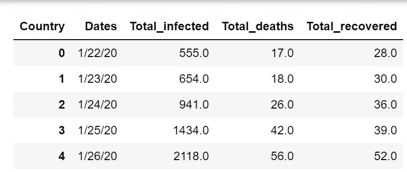
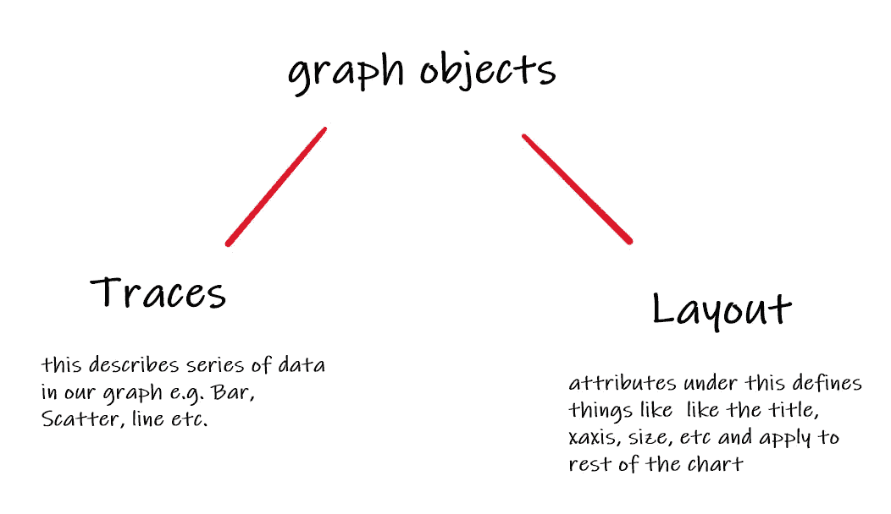
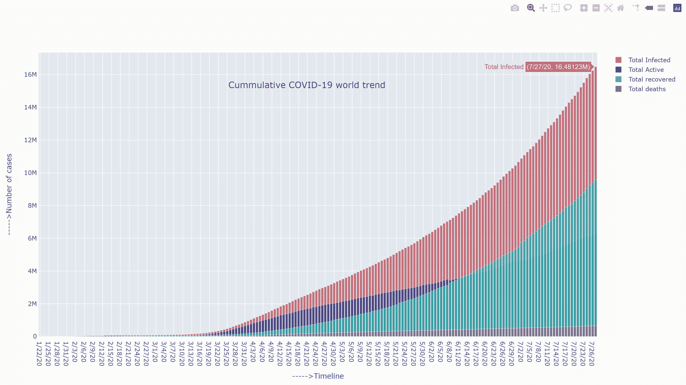
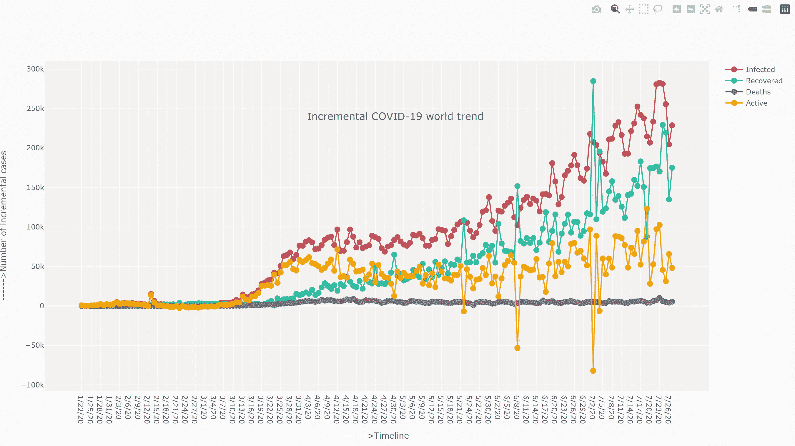

# 用 Plotly 实现数据可视化:新冠肺炎数据集

> 原文：<https://towardsdatascience.com/covid-19-data-visualisation-with-plotly-d1c96423942e?source=collection_archive---------36----------------------->

## 用新冠肺炎数据绘图的初学者方法。居家周末项目。

新冠肺炎传播的时间间隔为 2020 年 7 月 27 日。使用 Plotly 创建。

在数据科学和 Python 的自学之旅中，我被大量每秒都在发展的资源淹没了。这些都是非常重要的信息来源，我们很幸运能够获得如此丰富和免费的知识资源。

然而，有时你只需要后退一步，通过学习、分享和成长来关注基础。这篇文章正是关于这一点。一个非常基本和简单的使用新冠肺炎数据的可视化方法，这是我在家复活节假期项目的一部分！正如我的一位导师曾经对我说的那样:“……如果你想永不停止学习，就试着教你所知道的……”

这里我将只分享两件事，首先是用于绘图的基本编码，其次是参考文档的 T2，这样你就可以去实验了。

在我进入编码部分之前，我只想澄清一下，这篇文章只是作为一个**教育项目**。因此，我根本没有试图计算疫情的任何死亡率、增长率或存活率。因为我们都在一起，所以非常重要的是，这种敏感信息的计算和共享要非常谨慎，最好使用适当的领域知识来处理。关于新冠肺炎的任何观点或信息，请参考真实的信息来源。

## 那是关于什么的:

简单地说，“Plotly 是一个交互式的、开源的、基于浏览器的 Python 图形库”。它带有各种看起来很酷的图表类型(条形图、散点图、地理图等)。)而且我个人觉得它非常用户友好，有大量易于理解的文档。强烈建议您在[https://plotly.com/python/](https://plotly.com/python/)上构建任何代码时都要仔细阅读。

首先安装相关的库:

```
!pip install plotly_express==0.4.1
import plotly.express as px
import plotly.graph_objects as go #for calling graph objects from plotly library.
```

我使用了来自 https://data.humdata.org/的新冠肺炎案例数据，并由约翰·霍普金斯大学系统科学与工程中心(JHU·CCSE)编辑。使用各种技术将数据简化为以下几列。请注意，我假设这是一个基本的 Python 技能。



转换成简单形式的数据

在上面的数据中，x =日期，y =感染，z=死亡，w=康复。现在 y-z-w 也给了我们一些活跃的案例，只是为了在本文的条形图上进行演示。

我们使用 go.figure()函数(通常作为“go”导入)来调用 Plotly 中的绘图对象。在 Plotly 图形对象中，我们可以将其分为两类:轨迹和布局。然后在轨迹和布局中有进一步的属性来定义我们的图表。请务必参考[https://plotly.com/python/reference/](https://plotly.com/python/reference/)中的所有属性列表，然后使用它们。



## 条形图

为了覆盖条形图，我使用了 Plotly 的 go.figure()函数来调用图表对象，然后添加了更多的条形图轨迹(针对我的数据中的每一列),并将它们层叠在图表上:

```
***#call Bar charts and assign to fig_t. Add traces to the same figure***
fig_t = go.Figure(go.Bar(x=x, y=y, name='Total Infected', marker_color='indianred', opacity=.8))
fig_t.add_trace(go.Bar(x=x, y=y-z-w, name='Total Active', marker_color='mediumblue', opacity=0.7))
fig_t.add_trace(go.Bar(x=x, y=w, name='Total recovered', marker_color='lightseagreen', opacity=0.8))
fig_t.add_trace(go.Bar(x=x, y=z, name='Total deaths', marker_color='gray', opacity=1))***#here we define layout of the chart***
fig_t.update_layout(barmode='overlay', xaxis={'categoryorder':'total ascending'},xaxis_type='category',
                  title={
        'text': 'Cummulative COVID-19 world trend',
        'y':0.79,
        'x':0.45,
        'xanchor': 'center',
        'yanchor': 'top'},)
fig_t.update_xaxes(title= '----->Timeline' ,showline=True)
fig_t.update_yaxes(title= '----->Number of cases', showline=True)
fig_t.show()
```

**输出:**

交互式图表。请注意，如果你改变了上面代码中的轨迹类型，你可以添加线条、散点等。在同一块土地上。



## 线条和标记

为了分析案例数量的每日变化，我简单地对上面的累积数据使用了 diff()函数。现在，为了以不同的方式进行演示，这里使用了“线”轨迹:

```
***#call Line charts and assign to fig_inc. Add traces to the same figure***
fig_inc = go.Figure(go.Line(x=df_diff['Dates'], y=df_diff['Total_infected'],name='Infected', mode='lines+markers',marker=dict(size=10,color='indianred')))
fig_inc.add_trace(go.Line(x=df_diff['Dates'], y=df_diff['Total_recovered'],name='Recovered', mode='lines+markers',marker=dict(size=10,color='lightseagreen')))
fig_inc.add_trace(go.Line(x=df_diff['Dates'], y=df_diff['Total_deaths'], name='Deaths', mode='lines+markers',marker=dict(size=10,color='gray')))
fig_inc.add_trace(go.Line(x=df_diff['Dates'], y=df_diff['Active'], name='Active', mode='lines+markers',marker=dict(size=10,color='Orange')))***#here we define layout of the chart***
fig_inc.update_layout(xaxis_showgrid=True, yaxis_showgrid=True, plot_bgcolor='whitesmoke', 
        title={
        'text': 'Incremental COVID-19 world trend',
        'y':0.75,
        'x':0.5,
        'xanchor': 'center',
        'yanchor': 'top'},xaxis_type='category')
fig_inc.update_xaxes(title= '------>Timeline' ,showline=False)
fig_inc.update_yaxes(title= '------>Number of incremental cases', showline=False)

fig_inc.show()
```

**输出:**

带有各种分析选项的交互式折线图。



## 动画地理散点图

让我成为 Plotly 粉丝的最酷的特性之一是它易于使用的动画。你真的不需要做很多编码来制作一个简单的地图动画，就像上面视频中分享的那样。您可以通过文档了解许多内置特性。

对于这一个，我导入了 Plotly Express(作为“px”)，这是 Plotly 自带的一个接口。这适用于他们称之为“整齐”或“狭窄”的数据，适用于 pandas 数据帧、列表、numpy 数组、Pandas 系列等。

同样，图形对象和布局的基本原理是相同的。但是，在这种情况下，布局属性是在配置中详细定义的，并且可以更改。请参考[https://plotly.com/python/reference/#layout-sliders](https://plotly.com/python/reference/#layout-sliders)和不同的属性，看看它如何改变地图。

上面分享的视频基本上是新冠肺炎传播的延时，使用了来自我上面分享的同一个 JHU CCSE 数据源的窄数据形式。

```
***#call scatter_mapbox function from px. Note the attributes especially normalisation of data and maximum maker size. The animation is done on Dates.***
fig_map = px.scatter_mapbox(df_map, lat="Lat", lon="Long",     color="Infected", size=df_map['Norm']**0.5*50,
                color_continuous_scale="Rainbow", size_max=50, animation_frame='Date',
                center=dict({'lat': 32, 'lon': 4}), zoom=0.7, hover_data= ['Country'])***#here on wards various layouts have been called in to bring it in the present shape***
fig_map.update_layout(mapbox_style="carto-positron",width=900,
    height=700)
fig_map.update_layout(margin={"r":0,"t":0,"l":0,"b":0})***#update frame speed***
fig_map.layout.updatemenus[0].buttons[0].args[1]["frame"]["duration"] = 200**#update different layouts**
fig_map.layout.sliders[0].currentvalue.xanchor="left"
fig_map.layout.sliders[0].currentvalue.offset=-100
fig_map.layout.sliders[0].currentvalue.prefix=""
fig_map.layout.sliders[0].len=.9
fig_map.layout.sliders[0].currentvalue.font.color="indianred"
fig_map.layout.sliders[0].currentvalue.font.size=20
fig_map.layout.sliders[0].y= 1.1
fig_map.layout.sliders[0].x= 0.15
fig_map.layout.updatemenus[0].y=1.27
fig_map.show()
```

**输出:**

正如你在上面看到的，我已经调整了滑块的 x 和 y 位置，以随机选择图表上重叠的日期(即当前值)。


希望您喜欢 Plotly 的简要概述，以及如何使用它创建一些简单但看起来很酷的图表。