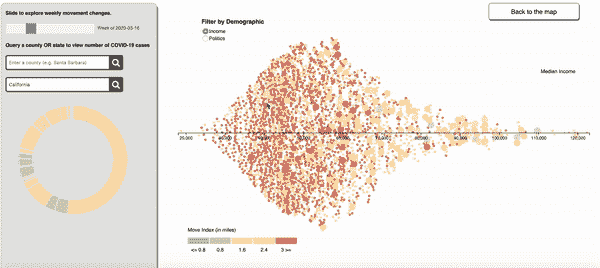

# 新冠肺炎数据可视化:跟踪移动和人口趋势

> 原文：<https://towardsdatascience.com/covid-19-data-visualization-tracking-movement-and-demographic-trends-de8e30aeb140?source=collection_archive---------21----------------------->

## 构建 D3 Chloropleth 地图，调查人口统计和社会距离如何影响各县病例数的增长。

由 Sammy Stolzenbach，Sook-Hee Evans 和 sejal Dua
T2 制作的❤点击[这里](https://bit.ly/covidmobility)来玩吧！

# **动机**

这学期，我在塔夫茨大学上了一门叫数据可视化的课。这是我迄今为止最喜欢的课程之一，因为它教会了我如何创造一个欺骗性的形象，更重要的是，如何创造一个有效的形象。

对于我们在数据可视化方面的最终项目，我们得到了你可能想象得到的最开放的规范。本着不扼杀任何辉煌的创造性火花的精神，我们被告知要用我们希望产生的任何数据集或可视化来击倒自己。这是一个“你投入什么就得到什么”的项目。

我的团队一致认为，我们希望承担一些雄心勃勃的事情，我们也希望做一些可以为他人所用的事情。我们决定围绕新冠肺炎社交距离数据来设计我们的项目，因为，嗯，它感觉非常热门，因为它是当时每个晚餐谈话的主题，几乎是我们脑海中唯一的事情。话虽如此，我们一致同意，必须为这个世界提供一些似乎没有人在做的独特的东西。我们想做一些新奇的事情，挑战我们作为程序员和普通人试图理解这些前所未有的时代。

已经有很多很棒的网站和追踪器了。约翰·霍普金斯大学有一个很棒的[新冠肺炎仪表板](https://coronavirus.jhu.edu/map.html)，它汇集了各种来源的数据，并显示了你可能感兴趣的关于全球疫情的任何统计数据。1point3acres 还有一个[追踪器](https://coronavirus.1point3acres.com/en)，提供实时更新和许多信息图表来分析病毒的增长率。虽然这些来源(以及许多其他来源)处于第一线，可靠地向人们提供重要信息，并帮助他们了解与这场危机有关的所有事情，但我们的目标略有不同，如下所述。

**目标:**

1.  使用二级数据源从独特的背景中获得对疫情的洞察。
2.  创建一个具有可链接组件的应用程序，以便一个 div 中的动作触发另一个 div 中相应的动作。
3.  提高我们的 D3.js 技能！
4.  弄清楚如何远程协同工作。

# 数据

## **数据来源 1:** [**Cuebiq 移动洞察**](https://help.cuebiq.com/hc/en-us/articles/360041285051-Reading-Cuebiq-s-COVID-19-Mobility-Insights)

我们决定将重点放在有关流动性在这段时间内如何变化的数据上，在这段时间里，社会距离要么受到高度鼓励，要么被州和地方法律强制规定。

Cuebiq 流动性指数

Cuebiq 是一家拥有免费仪表盘的公司，其移动洞察基于在美国各地收集的手机数据。

> Cuebiq 移动指数(CMI)量化了用户每天移动的距离。它是使用一个衍生因子来计算的，该衍生因子指示围绕每天观察到的用户位置绘制的一个方框的对角之间的距离。即使用户在平常的一天里走了不同的距离，使用一个指数也可以将各县相互比较。每个县的 CMI 是一个县内所有用户的总移动量的中位数。

CMI 值可以用 1-5 的等级来解释，其值对应于以下行驶的中值距离(5 = 100 公里，4 = 10 公里，3 = 1 公里，2 = 100 米，1 = 10 米)。一个县的 CMI 为 2.5，这意味着该县的中位用户出行量为 2.5 亿。

不幸的是，这些数据无法通过 API 调用或 CSV 文件下载获得。为了争夺数据，我们实际上不得不下载 PDF 文件，然后使用 Python 和其他妙招收集数据。如果县在 PDF 中由于名称过长和间距不足而被截断，我们必须交叉引用外部数据集来填充缺失的数据。

## **数据来源 2:纽约时报** [**美国冠状病毒病例与死亡**](https://github.com/nytimes/covid-19-data)

纽约时报美国冠状病毒数据

我们使用了 NYT 开放 GitHub 存储库，其中包含美国每天的病例和死亡人数。这些数据以 CSV 文件的形式出现，名为 us-counties.csv。我们编写了 Python 脚本来按县汇总数据，并确定每天的累计病例数。由于存储库每天都在更新，我们觉得让我们的应用程序总是拥有最新的数据很重要，所以我们将更多“案例数据”拉入 Bash 脚本的过程流水线化，以便我们可以在一行命令中自动拉入和争论数据。

## **数据来源 3:美国人口普查局人口数据**

美国人口普查局数据

最后，我们使用美国人口普查数据，根据各县的中位收入和政治联盟来可视化人口趋势。我们希望探索这些因素如何影响美国所有县的社交距离行为。项目的这一方面需要大量的数据操作，并且由于我们采用的可视化方法，它也是最具编程强度的，因此我们最终只实施了两个人口统计过滤器。然而，我们计划很快实现更多有趣的人口趋势，如教育水平或基本劳动力百分比。

我们试图谨慎地选择如何表示人口统计数据。按每个县的人口比例缩放对象是避免产生欺骗性可视化的一种方式。这一人口数据也是从最近可用的美国人口普查局数据集(2016 年)中获得的。

## 争论

*术语说明:* ***争论*** *是将数据从一种“原始”数据形式转换和映射为另一种格式的过程，目的是使其更适合各种用途，更有价值。*

从 3 个不同的来源获取数据是我们项目中最复杂的方面之一。这是那些需要白板或者频繁的 10 分钟休息来让大脑充电的任务之一。我们的任务是将来自 3 个来源的数据收集到一个主容器中(JSON 或 CSV 格式)。虽然数据是根据各种不同的方案组织的，但这项任务是通过使用唯一标识美国每个县的每个数据集中的 FIPS 代码实现的。

FIPS 电码故障

为了合并数据集，我们实际上使用 FIPS 列作为执行连接的键，对每个数据集执行了内部连接。这产生了一个数据集，我们可以用它来产生我们可视化的所有不同组件。

也就是说，数据集远非完美。一个数据集的不一致会影响 3 个来源的整体组合。例如，纽约时报存储库没有纽约市的县一级的案例数据，因为数据被划分到五个区，这五个区没有唯一的 FIPS 代码。此外，Cuebiq 没有阿拉斯加和夏威夷健全的县一级流动性数据。为了处理这些不一致，我们面临着一个决定:我们要么从可视化中完全忽略这些位置，要么接受忽略这些县的 3 个数据点中的一个。我们选择把阿拉斯加和夏威夷排除在外(很遗憾)，但我们对纽约在所有 3 个来源中存在一些不一致的地方没有意见。

以下部分将包括我们的网站如何工作的教程。我们将深入研究该应用程序的来龙去脉，包括一些实现细节，这些细节可能有助于了解如何最好地使用该应用程序来回答您可能会有的关于新冠肺炎的问题。如果您对这个技术故障不感兴趣，可以直接跳到本文的“我学到了什么”部分。

# 组件

转到新冠肺炎追踪器应用程序本身，我们可以在下面看到，可视化的关键是用颜色编码的移动指数数据，以及随着时间的推移，查看美国不同地方如何通过社交距离来应对疫情危机的能力。

新冠肺炎跟踪器应用程序的照片

地图上的颜色有意颠覆了交通灯根深蒂固的配色方案。鉴于我们正在经历这些前所未有的情况，我们都尽自己的努力将这种病毒的影响降至最低是至关重要的，我们认为将低运动与绿色联系起来，将高运动与红色联系起来会很有趣。用户确实需要更多的时间来理解配色方案，但是由于我们可视化的信息可能会非常强大，我们认为宁可混淆，也不要随意暗示我们不打算表达的基于颜色的信息。

在 2020 年 3 月 23 日这一周，西海岸的县相对于美国所有县的移动最小。红色的县的移动指数大于 3，表明那一周人们离家的中间距离在 1 到 10 公里之间，这看起来不算多，但实际上这很说明问题，因为这是一个中间值，许多州已经在这一点上制定了留在家中的命令。

## 滑块

我们实现的核心是上述移动索引数据的时间推进。通过拖动屏幕左上角的滑块，用户可以查看特定一周的数据，或者控制时间快进的速度。

从 3 月 2 日到 4 月 27 日的逐周滑块过渡

在上面的 GIF 图中，我们看到了一个动画，展示了自新冠肺炎疫情爆发以来，美国不同地方或多或少的变化。绿色和黄色编码最多的一周是 3 月 23 日。有趣的是，最近的数据表明，大多数县的移动指数大于 3。人们可以推测，这是人们选择离开家时戴口罩的结果，人们去散步和跑步，更好的天气，一些州放松了社交距离措施，或者这些理由的一些组合。随着新冠肺炎地位的改变、假期的到来和夏天的临近，看看这些数据会是什么样子将会很有趣。

## 动画条形图

我们的应用程序最重要和最常用的特性之一是一个查询县的新冠肺炎案例的动画条形图。用户可以查询各县或在地图上单击以调用此功能，并探索移动指数与新病例增加或减少之间的任何潜在关系。

演示动画条形图功能

在上面的演示中，我们展示了触发该特性的两种方式。将鼠标悬停在地图上的县几何图形上并找到华盛顿的 King County 后，用户只需在感兴趣的县的形状内单击即可锁定该选择并启动动画条形图。

左边的灰色框中会出现一个条形图。这个图表实际上描述了两种类型的数据:在被查询的县中，新冠肺炎病例的累积数量和由新冠肺炎引起的死亡的累积数量。条形图的左上角有一个图例，说明颜色如何表示正在绘制的数据集。将鼠标悬停在条形图上可激活工具提示，该工具提示提供该条形图的所有信息—日期、总病例数、新病例数(相对于前一天)和总死亡数—全部整合在一个位置。

我们的一个实现目标是让条形图特性和 chloropleth 图可视化展示双向链接。也就是说，一个县查询触发了某个事件，并与地图上高亮显示的特定县相对应，而地图上的一个操作也触发了相同的事件。从控制流的角度来看，这是一项复杂的工作。但是，它增强了用户体验，因为它使用户能够灵活地使用应用程序。(如果他们不知道某个县在地图上的位置，这也有助于他们复习美国的地理知识！)

以 King County 为例，有一个用户在不知道具体县在地图上的确切位置的情况下如何查询该县的例子。如你所见，当圣巴巴拉被查询时，它的地理位置在地图上被高亮显示。用户还可以滑动滑块来探索所查询的县中的移动与该县中病例的上升或下降之间的相关性。

## 圆环图

在做了一些用户测试后，很明显，人们自然倾向于按城市或州而不是按县来探索数据。因为我们使用第三方数据，我们不能控制它是如何组织的，但是我们可以简化用户的查找过程。例如，如果用户想了解新冠肺炎如何影响洛杉矶，他们可能不知道洛杉矶所属的县的名称(顺便说一下，是洛杉矶县)。然而，他们凭直觉知道，人口最多的城市可能位于加利福尼亚州病例相对百分比最高的县。

脱离了这个逻辑，我们决定实现一个环形图，描述查询州的每个县。圆环图每个部分的大小编码了给定州内每个县的相对案例百分比。可以预料，颜色编码与前面讨论的移动索引数据一致。还有链接功能也开始发挥作用。当用户将鼠标悬停在环形图的切片上时，这些县的地理位置会在克罗珀特地图上突出显示。当用户单击切片时，会显示动画条形图，而不是圆环图。要返回到圆环图，用户只需再次单击下方的放大镜。

圆环图功能的演示

圆环图有 3 个主要使用案例值得注意:

1.  它可用于识别每个州内最大的县(按人口计算)，从而间接使用户能够按城市探索新冠肺炎趋势。在上面的示例中，当查询“马萨诸塞州”时，从圆环图切片的大小可以清楚地看出，萨福克和米德尔塞克斯可能是相对于其所在州而言人口最多的县。这些县可能值得点击来提示条形图。
2.  圆环图可用于了解每个县在地图上的位置。如果用户没有特定的目标或问题想要通过使用应用程序来回答，他们可以使用州级链接，而不是单独查询县。
3.  圆环图可用于探索随时间的变化，同时缩小感兴趣的特定状态。在上面的演示中，我们看到了圆环图的切片是如何随着滑块的每次转换而改变颜色的。各州的移动指数值通常不会有很大的变化。有趣的是，一个州内人口最稠密的县(本例中为 Multnomah)往往具有最低的移动指数。我不是人口学家，但也许大城市更严格地执行了呆在家里的命令，或者也许是因为公共交通的关闭而减少了流动。谁能说得准呢？但是这是一个有趣的趋势，如果视觉化图像没有在我眼前照亮它，我永远不会想到它。

## 人口趋势

您还可以单击“切换到人口趋势”按钮，了解移动指数和案例数据如何与人口趋势相关联。默认的人口统计是中等收入。根据美国人口普查局(United States Census)记录的每个县的收入中值，这些县保留了与每周移动指数相匹配的颜色，但在 x 轴上从最不富裕到最富裕排列。因为有了与案例数据的完整链接功能，就像有了这个地图一样，这个视图允许用户探索收入如何影响人们在哪里避难。这是一个重要的相关性，但是我们认为将它形象化会更加强大！

人口趋势视图演示

根据上面的 GIF，你可以看到随着病毒的传播，最富裕的县最早变绿(开始社会距离)。这一趋势的唯一例外是收入较低的县，如洛杉矶，那里的病例太多，除了呆在家里别无选择。

通过切换人口统计，用户还可以探索政治联盟如何影响社交距离行为。使用政治过滤器，将县(用气泡表示)放置在从 0 到 1 的 x 轴上，其中 0 表示基于 2016 年选民登记的 0% GOP 投票，1 表示 100% GOP 投票。很容易看出，在过去几周里，一个县越右倾，他们就越有可能继续前进，尽管这些地区在 3 月底和 4 月初出现了病例。即使用户对确定新冠肺炎的人口趋势不感兴趣，该视图也可以简单地用作一种教育工具:当您将鼠标悬停在圆环图的切片上时，代表该县的气泡会突出显示，从而允许用户按州浏览人口信息。

好了，这就结束了我们的应用程序的各个组件的旅程。希望使用我们的数据可视化，您可以轻松地解释大量数据并确定趋势。

# 我学到了什么

在你开始玩可视化之前，我想分享一些在这个项目中的思考和经验。这些收获中有许多是我想分享的极客技巧，但我也想后退一步，评论一下该项目的一些非技术方面。

## 渐进的进展

到目前为止，每天做一些小的改进是这个项目中最令人满意的部分。因为我们是从第一步开始的，所以我们真的必须一次考虑一个特性。项目的第一个工作组件是带有县的地图，通过移动索引数据和工具提示功能来检查特定的县。然后我们让滑块开始工作，随后很快就有了动画条形图。

应用程序的早期版本

正如你在上面看到的，即使我们的功能正常工作，它们也不一定从一开始就很流畅。我们使用的配色方案被彻底修改，条形图 x 轴被修复，看起来不那么杂乱。我们还决定将页面左侧的元素放在一个灰色框中，以便更优雅地划分它们。

概念验证:人口趋势

至于人口趋势，让他们都适合在一个屏幕上实际上是一个巨大的挑战。我们最初使用强制节点碰撞来制作上面的动画，但我们必须找到一个解决方法，以便我们可以在同一页面上包含此功能。Sammy 想出了创建一个节点模拟并保存它们最终的 x 和 y 坐标的主意，这样我们就可以将它们都固定在适当的位置。这是一个巨大的胜利，使我们能够集成所有的组件，并不断推出更多的链接功能。

## Git 分支和拉请求

由于项目是在不到一个月的时间内完成的，开发通常是并行进行的。当团队成员处理不同的特性，但是在不同的地方修改同一个文件时，处理 git 分支是很重要的。我们没有很好地遵循远程开发的最佳实践。将来，我们肯定会将新特性推送到 git 分支，然后创建 pull 请求，以确保在合并期间不会覆盖彼此的工作。

## 沟通就是一切

…尤其是当您在全球疫情中远程工作时。我们在 3 个不同的家庭环境中工作，使用不同的电脑和无线网络，而且我们不在同一个时区。我们能够通过每隔几天召开一次 Zoom 会议来解决这个问题，以便检查、相互更新和讨论后续步骤。虽然我们也有一个处理小型技术后勤的群组短信，但虚拟联系对我们的成功至关重要。这确保了我们不会冒犯对方，并且在我们继续开发新功能之前，所有的想法都已经摆到桌面上了。

## 团队士气和生产力之间的相关性

人们需要的只是一点积极的反馈，让他们觉得自己的努力没有被忽视。用千禧一代的话来说，这种积极的强化可以被称为“互相打气”。

这个外卖其实只是对淑喜和萨米成为优秀搭档的颂歌。每个人都以独特的方式为项目做出贡献，这使得一起工作变得如此有趣。我们都有突破的时刻，我们都为这些时刻互相吹捧。虽然这是一个小小的举动，但是良好的团队士气会带来更好的最终产品！这不是意见。这是一个被证实的事实。

## 代码重构

[代码重构](https://resources.collab.net/agile-101/code-refactoring)是一个敏捷编程的概念，指的是澄清和简化现有代码的设计，而不改变其行为的过程。由于每个方法或类有太多的责任、重复的代码、糟糕的命名、糟糕的注释和普遍的混乱，未重构的代码往往会受到影响。为了说明一个流行的比喻，重构就像在你做饭的时候或者在你做完饭后不久打扫厨房。盘子、锅、食物和冰箱必须时刻保持干净整洁。没有干净的厨房，连续烹饪要么是不可行的，要么是非常不愉快的。类似地，如果代码没有被重构，开发新特性的难度大约是正常情况下的 10 倍。

正如在上面的短信对话中提到的，这是我们项目的一个方面，对我们能够向前发展至关重要。函数通常应该负责执行一个任务，但是我们的许多函数同时执行 5 个以上的任务。我们必须与代码坐在一起，思考如何最好地模块化它，使它尽可能地可重用。毫无疑问，即使在今天它也不是超级干净的。但是这里的要点是，代码重构是一个持续的过程，不应该被忽视。在这个项目中，我们确实学到了编写干净代码的价值，也许更重要的是，学会了如何处理杂乱的代码并清理它们。

## Bash 脚本自动化繁琐的任务

Bash 脚本是包含一系列命令的纯文本文件，我们通常会在命令行中输入这些命令，但是我们更愿意将这些命令聚集在一个文件中，以便同时执行许多任务。当我们发现从纽约时报 GitHub 存储库中提取数据的过程需要大约 12 个命令行命令时，我们看到了编写 Bash 脚本的优势。我们现在只需要输入**。命令行中的/pull_nyt.sh** 获取更多数据。这是一个非常简单的技巧，可以节省我们大量的时间，并最小化文件系统组织中的错误。我们甚至可能会进一步研究自动化流程，以便每天早上 9 点提取更多数据。

## 我❤开源社区

我在过去的文章中讨论过这个问题，但我将在这里重复这一观点。开源社区让我相信人性的美好。能够玩演示、克隆存储库和在在线论坛上寻求帮助是如此强大，以至于我们作为一个社区可以推进到新的领域，而不必重新发明轮子。对 Stack Overflow 上帮助我们完成这个项目的匿名英雄们大声喊出来。有一天，我希望向前支付。

## 学术项目只是掠过你潜力的表面

很长一段时间，我有一个有限的信念，你只需要完成学术项目并达到所有要求，然后你就可以在夏天有更多空闲时间的时候继续做你真正想做的事情。然而，我错了。学术项目应该被当作一个跳跃点，让你朝着更大的目标，你所热爱的目标前进。特别是当你有选择题目的自由时，我认为你应该选择一些感觉不像工作的东西。我知道这是一个感觉不像工作的项目，我肯定希望在未来与我的队友继续下去。我很感激任务和截止日期激励我们从某个地方开始。

# 摘要

如果你一路走到这里，感谢你足够关心阅读这篇冗长的文章。我们希望你获得了一两件东西，并感到鼓舞去建立一些东西。

你可以在这里玩我们的网络应用。
你可以在这里查看我们的源代码[。](https://github.com/sevans09/covid-movement-vis)

我们希望您对我们的新冠肺炎跟踪应用程序有任何反馈。如果你想提供建议、意见或批评，可以发电子邮件到 sejaldua@gmail.com 给我。

保持安全和健康！我们会一起度过难关的。