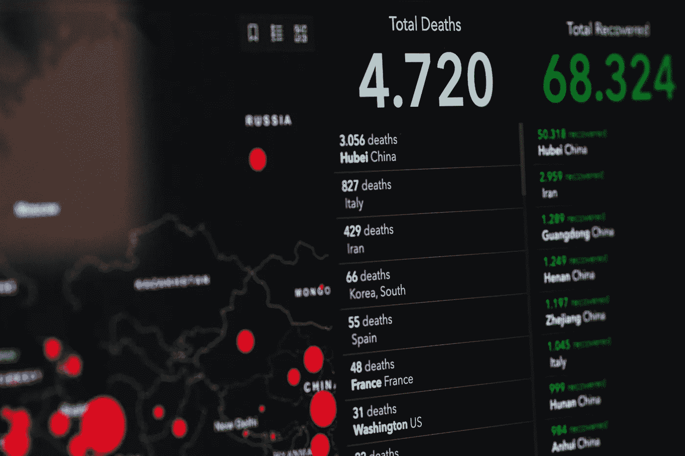
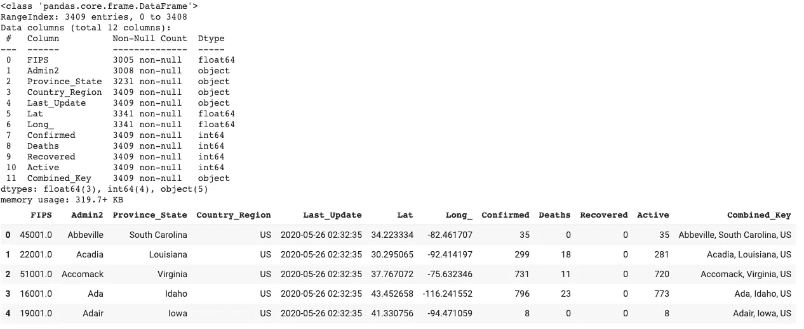
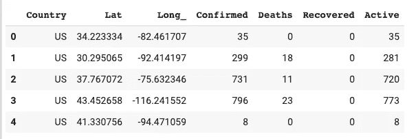
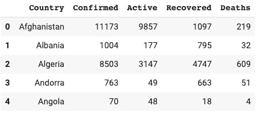
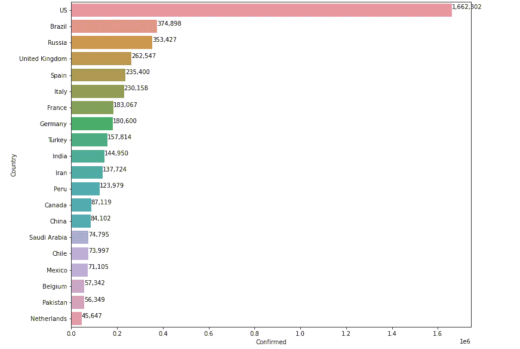
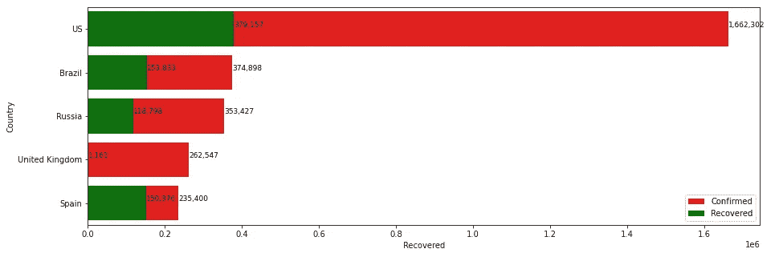
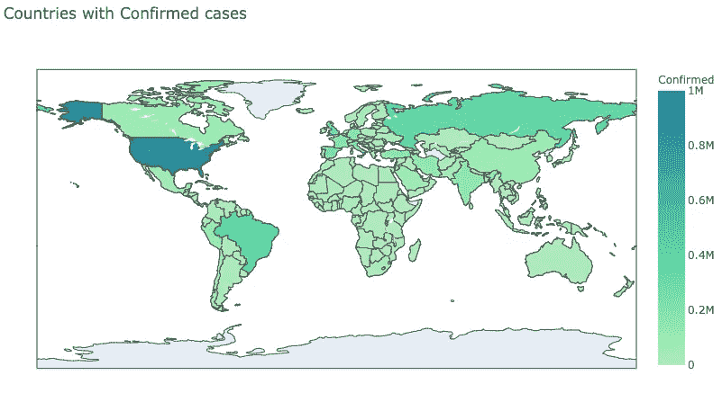
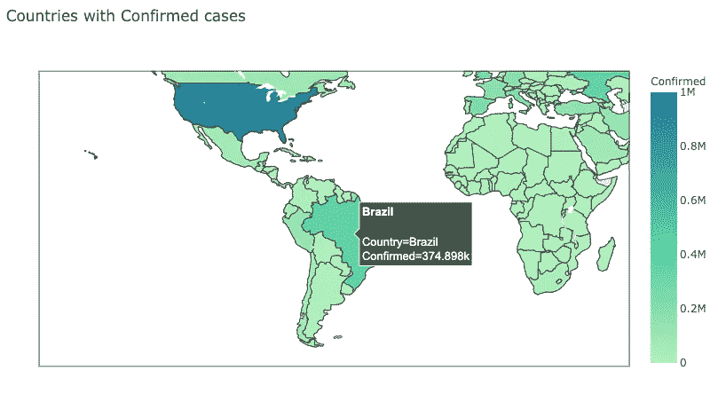

# 使用 Python 实现新冠肺炎数据可视化

> 原文：<https://towardsdatascience.com/covid-19-data-visualization-using-python-3c8bcfaeff5f?source=collection_archive---------25----------------------->



马库斯·斯皮斯克在 [Pexel](https://www.pexels.com/photo/coronavirus-statistics-on-screen-3970330/) 拍摄的照片

在每个数据科学项目中，数据可视化是深入了解大型数据集的第一步。获取并预处理数据(清理和消除重复数据)后，数据科学生命周期的下一步是探索性数据分析，从数据可视化开始。这里的目的是从数据中提取有用的信息。

我使用 Python 和它为数不多的强大库来完成这项任务。此外，我已经使用[谷歌 Colab 笔记本](https://colab.research.google.com/)来编写代码，以避免安装任何 IDE 或软件包的麻烦，如果你想跟进的话。

## 我们开始吧

第一步是打开一个新的 Google Colab ipython 笔记本，导入我们需要的库。

```
import pandas as pdimport numpy as npimport matplotlib.pyplot as pltimport seaborn as snsimport plotly.express as px ### for plotting the data on world map
```

## 加载数据

这些可视化是基于截至 2020 年 5 月 25 日的数据。我使用了约翰·霍普斯金大学[发布的 2020 年 5 月 25 日的日报数据。代码的下一部分处理加载。csv 数据到我们的项目。](https://github.com/CSSEGISandData/COVID-19/blob/master/csse_covid_19_data/csse_covid_19_daily_reports/05-25-2020.csv)

```
path = 'https://raw.githubusercontent.com/CSSEGISandData/COVID-19/master/csse_covid_19_data/csse_covid_19_daily_reports/05-25-2020.csv'df = pd.read_csv(path)df.info()df.head()
```



只用两行代码，我们就加载了数据，并准备好用作 Pandas 数据框架。接下来的两行显示关于数据(元数据)的信息，即总共 3409 行数据和 11 列。它还为我们提供了前五行的预览。

## 预处理数据

既然我们的数据已经成功加载，下一步就是在使用数据进行绘图之前对其进行预处理。它将包括:

*   删除多余的列，如*‘FIPS’，‘admin 2’，‘Last _ Update’*(因为所有数据都是单日的，即 5 月 25 日)。
*   删除列*‘省 _ 州’和‘组合 _ 关键字’*，因为并非所有国家都有州级数据。
*   按'*国家/地区*将数据分组，并将列重命名为'*国家/地区*

```
df.drop(['FIPS', 'Admin2','Last_Update','Province_State', 'Combined_Key'], axis=1, inplace=True)df.rename(columns={'Country_Region': "Country"}, inplace=True)df.head()
```



数据可以通过数据帧的“分组”功能进行分组。它类似于 SQL 中的 GROUPBY 语句。

```
world = df.groupby("Country")['Confirmed','Active','Recovered','Deaths'].sum().reset_index()world.head()
```



最后，我们的数据被清理并准备使用。

## 绘制确诊病例最多的前 20 个国家

```
### Find top 20 countries with maximum number of confirmed casestop_20 = world.sort_values(by=['Confirmed'], ascending=False).head(20)### Generate a Barplotplt.figure(figsize=(12,10))plot = sns.barplot(top_20['Confirmed'], top_20['Country'])for i,(value,name) in enumerate(zip(top_20['Confirmed'],top_20['Country'])): plot.text(value,i-0.05,f'{value:,.0f}',size=10)plt.show()
```



作者图片

## 绘制确认病例数最多的前 5 个国家的确认病例和活动病例

```
top_5 = world.sort_values(by=['Confirmed'], ascending=False).head() ### Generate a Barplotplt.figure(figsize=(15,5))confirmed = sns.barplot(top_5['Confirmed'], top_5['Country'], color = 'red', label='Confirmed')recovered = sns.barplot(top_5['Recovered'], top_5['Country'], color = 'green', label='Recovered')### Add Texts for Barplotsfor i,(value,name) in enumerate(zip(top_5['Confirmed'],top_5['Country'])): confirmed.text(value,i-0.05,f'{value:,.0f}',size=9)for i,(value,name) in enumerate(zip(top_5['Recovered'],top_5['Country'])): recovered.text(value,i-0.05,f'{value:,.0f}',size=9)plt.legend(loc=4)plt.show()
```



作者图片

## 在世界地图上绘制地图

> **choropleth 地图**是一种[专题地图](https://en.wikipedia.org/wiki/Thematic_map)，其中的区域按照代表每个区域内地理特征汇总的统计变量(如人口密度或[人均收入](https://en.wikipedia.org/wiki/Per-capita_income))的比例进行阴影化或图案化。
> 
> Choropleth 图提供了一种简单的方法来可视化一个地理区域内的测量值如何变化，或者显示一个区域内的可变性水平

```
figure = px.choropleth(world,locations=’Country’, locationmode=’country names’, color=’Confirmed’, hover_name=’Country’, color_continuous_scale=’tealgrn’, range_color=[1,1000000],title=’Countries with Confirmed cases’)figure.show()
```



作者图片

我们可以放大地图，将鼠标悬停在某个特定地区，查看该国已确认的病例数



作者图片

**完整代码可在我的 GitHub repo:**[https://GitHub . com/jaskeeratbhatia/新冠肺炎-数据-可视化/blob/master/新冠肺炎-数据-25-may-2020-revised.ipynb](https://github.com/jaskeeratbhatia/covid-19-data-visulaization/blob/master/covid-19-data-25-may-2020-revised.ipynb)

## 参考资料:

1.  **https://github.com/CSSEGISandData/COVID-19 Github 回购数据:**
2.  **维基百科**:[https://en.wikipedia.org/wiki/Choropleth_map](https://en.wikipedia.org/wiki/Choropleth_map)