# 新冠肺炎探测器烧瓶应用程序基于使用深度学习的胸部 x 光和 CT 扫描

> 原文：<https://towardsdatascience.com/covid-19-detector-flask-app-based-on-chest-x-rays-and-ct-scans-using-deep-learning-a0db89e1ed2a?source=collection_archive---------24----------------------->

## 使用四种深度学习算法(VGG16、ResNet50、InceptionV3 和 Xception)实现基于人工智能的模型和 Flask 应用程序，以检测胸部 X 射线和 ct 扫描中的新冠肺炎

***编者按:*** [*走向数据科学*](http://towardsdatascience.com/) *是一份以数据科学和机器学习研究为主的中型刊物。我们不是健康专家或流行病学家，本文的观点不应被解释为专业建议。想了解更多关于疫情冠状病毒的信息，可以点击* [*这里*](https://www.who.int/emergencies/diseases/novel-coronavirus-2019/situation-reports) *。*

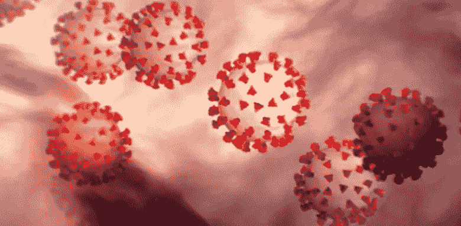

**图 1:新型冠状病毒疾病 2019** [**来源**](https://media.defense.gov/2020/Mar/03/2002258405/780/780/0/200303-A-TC012-005.JPG)

**新冠肺炎**，或更通常被称为**新型冠状病毒疾病**是一种高传染性疾病，于 2019 年底在中国出现。这种疾病是由 [**新型冠状病毒**](https://en.wikipedia.org/wiki/Severe_acute_respiratory_syndrome_coronavirus_2) 引起的，一种属于冠状病毒大家族的病毒。该疾病于 2019 年 12 月**首次起源于**中国武汉**，并很快成为全球疫情，蔓延至超过 **213** 个国家。**

**新冠肺炎最常见的症状是发烧、干咳和疲倦。人们可能经历的其他症状包括疼痛、疼痛或呼吸困难。这些症状中的大多数都显示出呼吸道感染和肺部异常的迹象，这可以由**放射科医生**检测出来。**

**因此，可以使用**机器学习**算法从**胸部 x 光**和 **CT 扫描**的图像中检测疾病。可以创建自动化应用程序来帮助支持放射科医生。本文是对四种深度学习算法的尝试，分别是: **VGG16、ResNet50、InceptionV3** 和 **Xception** 。**

**训练和测试模型以及运行 Flask 应用程序的完整代码可在我的 [**Github 存储库**](https://github.com/kaushikjadhav01/COVID-19-Detection-Flask-App-based-on-Chest-X-rays-and-CT-Scans) **上获得。****

# **数据集**

**该项目的数据集是从两个开源 Github 存储库中收集的:**

1.  ****胸部 x 光片**图像(1000 张图像)从[https://github.com/ieee8023/covid-chestxray-dataset](https://github.com/ieee8023/covid-chestxray-dataset)获得**
2.  ****CT 扫描**图像(750 张图像)从[https://github . com/UCSD-AI4H/COVID-CT/tree/master/Data-split](https://github.com/UCSD-AI4H/COVID-CT/tree/master/Data-split)获取**

**四个算法:VGG16、ResNet50、InceptionV3 和 Xception 分别在胸部 x 光和 CT 扫描上进行训练，给了我们总共 8 个深度学习模型。 **80%** 的图像用于**训练**模型，剩余的 **20%** 用于**测试**模型的准确性。**

# **构建模型**

**我首先向预训练模型添加了 **3 个自定义层**，以便它们可以在我们的数据集上进行训练。例如，添加自定义层到 **ResNet50** 模型的代码如下所示。其余模型的代码保持不变。只需将第一行中的 ResNet50 更改为所需模型的名称。**

```
res = ResNet50(weights="imagenet", include_top=False, input_tensor=Input(shape=(224, 224, 3)))
outputs = res.output
outputs = Flatten(name="flatten")(outputs)
outputs = Dropout(0.5)(outputs)
outputs = Dense(2, activation="softmax")(outputs)
model = Model(inputs=res.input, outputs=outputs)
for layer in res.layers:
  layer.trainable = False
model.compile(loss='categorical_crossentropy', optimizer='adam', metrics=['accuracy'])
```

**数据集中的图像大小不同。因此，我需要将它们调整到固定的大小，然后才能将它们提供给深度学习模型进行训练。我将图片尺寸调整为 224 x 224 像素，这被认为是 ResNet50 机型的理想尺寸。因此，我将形状 **(224，224，3)** 的输入张量添加到预训练的 ResNet50 模型中，3 为通道数。**

**接下来，我添加了一个**展平**层来展平我们所有的特征，并添加了一个**脱落**层来克服**过度拟合**。最后，我使用 **softmax 函数**作为激活函数，添加了**密集**输出层。由于模型的前半部分已经被预训练，先前层的可训练属性被设置为**假**。最后，我用 **adam 优化器**编译模型，并使用**分类交叉熵**作为**损失** **函数**。**

# **训练模型**

**我首先定义了一个**图像数据生成器**来训练模型修改版本的图像，比如不同的角度、翻转、旋转或移位。**

```
train_aug = ImageDataGenerator(rotation_range=20, width_shift_range=0.2, height_shift_range=0.2, horizontal_flip=True)
```

**接下来，执行模型的训练，所有需要的参数指定如下:**

```
history = model.fit(train_aug.flow(X_train, y_train, batch_size=32),validation_data=(X_test,y_test),validation_steps=len(X_test) / 32, steps_per_epoch=len(X_train) / 32, epochs=500)
```

**如你所见，我已经用 **32 张图像**的批量为 **500 个纪元**训练了模型。**

# **做预测**

**通过在测试集的图像上运行训练的模型来生成预测。数据集前 10 幅图像的预测绘制如下:**

```
y_pred = model.predict(X_test, batch_size=batch_size)
prediction=y_pred[0:10]
for index, probability in enumerate(prediction):
  if probability[1] > 0.5:
    plt.title('%.2f' % (probability[1]*100) + '% COVID')
  else:
    plt.title('%.2f' % ((1-probability[1])*100) + '% NonCOVID')
  plt.imshow(X_test[index])
  plt.show()
```

**以下片段显示了胸部 X 射线的前 10 个预测图:**

**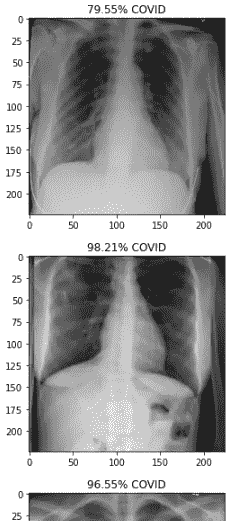**

****图 2:可视化胸部 X 射线的前 10 个预测****

# **机器学习的评估和结果**

**以下是一些重要的结果和图表，有助于估计模型的准确性并了解其性能。**

## **测试集图像的输出示例**

**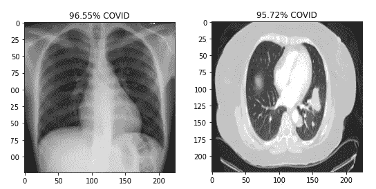**

****图 3:测试集图像的样本输出****

## **分类报告**

**VGG16 型胸部 X 线和 CT 扫描分类报告**

**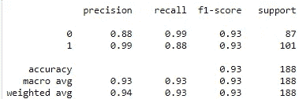****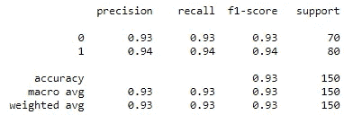

**图 VGG16 模型胸片(左)和 CT 扫描(右)分类报告**** 

**ResNet50 型胸部 X 线和 CT 扫描分类报告**

**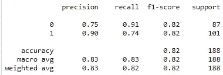****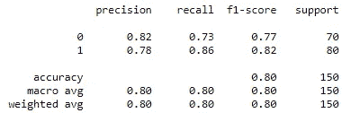

**图 ResNet50 型号胸片(左)和 CT 扫描(右)分类报告**** 

**胸部 X 线和 CT 扫描的 InceptionV3 模型分类报告**

**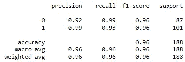****

**图 6:胸部 x 光(左)和 CT 扫描(右)的 InceptionV3 模型分类报告**** 

**胸部 X 线和 CT 扫描异常模型分类报告**

**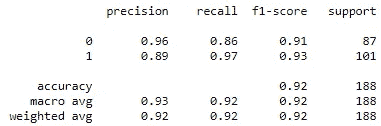****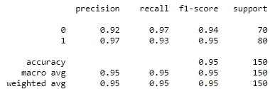**

****图 7:X 线胸片(左)和 CT 扫描(右)异常模型分类报告****

## **混淆矩阵**

**用于胸部 X 线和 CT 扫描的 VGG16 模型的混淆矩阵**

**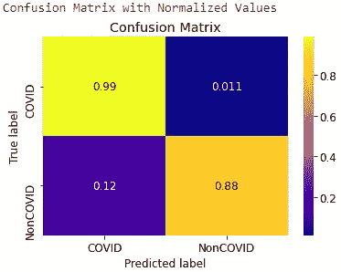****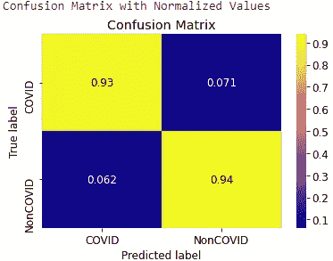

**图 8:胸片(左)和 CT 扫描(右)的 VGG16 模型混淆矩阵**** 

**ResNet50 胸部 X 线和 CT 扫描模型的混淆矩阵**

**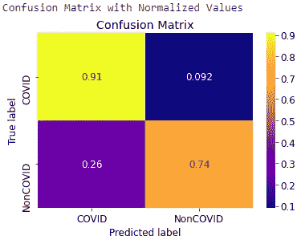****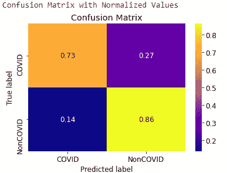

**图 ResNet50 模型胸部 x 光(左)和 CT 扫描(右)的混淆矩阵**** 

**胸部 X 线和 CT 扫描的概念模型混淆矩阵**

**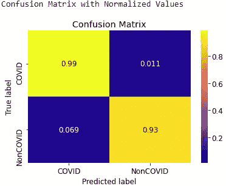****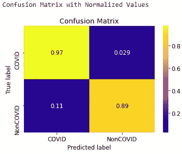

**图 10:胸部 x 光(左)和 CT 扫描(右)的 InceptionV3 模型的混淆矩阵**** 

**胸部 X 线和 CT 扫描异常模型的混淆矩阵**

**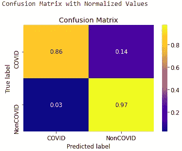****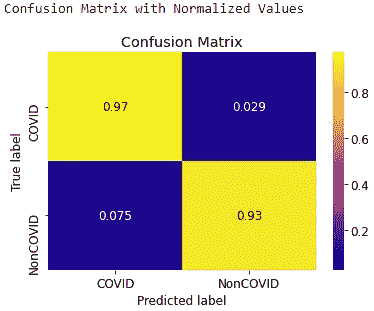

**图 11:胸部 x 光(左)和 CT 扫描(右)的异常模型的混淆矩阵**** 

# **构建 Flask 应用程序**

**现在，我使用目前为止我创建的代码，通过在某些 flask 函数中粘贴特定的代码段来构建 Flask 应用程序。例如，使用四个模型来生成胸部 X 射线预测的代码如下所示:**

```
def uploaded_chest():
   resnet_chest = load_model('models/resnet_chest.h5')
   vgg_chest = load_model('models/vgg_chest.h5')
   inception_chest = load_model('models/inceptionv3_chest.h5')
   xception_chest = load_model('models/xception_chest.h5') image = cv2.imread('./flask app/assets/images/upload_chest.jpg') 
   # read file 
   image = cv2.cvtColor(image, cv2.COLOR_BGR2RGB) 
   # arrange format as per keras
   image = cv2.resize(image,(224,224))
   image = np.array(image) / 255
   image = np.expand_dims(image, axis=0)

   resnet_pred = resnet_chest.predict(image)
   probability = resnet_pred[0]
   print("Resnet Predictions:")
   if probability[0] > 0.5:
      resnet_chest_pred = str('%.2f' % (probability[0]*100) + '% COVID') 
   else:
      resnet_chest_pred = str('%.2f' % ((1-probability[0])*100) + '% NonCOVID')
   print(resnet_chest_pred) vgg_pred = vgg_chest.predict(image)
   probability = vgg_pred[0]
   print("VGG Predictions:")
   if probability[0] > 0.5:
      vgg_chest_pred = str('%.2f' % (probability[0]*100) + '% COVID') 
   else:
      vgg_chest_pred = str('%.2f' % ((1-probability[0])*100) + '% NonCOVID')
   print(vgg_chest_pred) inception_pred = inception_chest.predict(image)
   probability = inception_pred[0]
   print("Inception Predictions:")
   if probability[0] > 0.5:
      inception_chest_pred = str('%.2f' % (probability[0]*100) + '% COVID') 
   else:
      inception_chest_pred = str('%.2f' % ((1-probability[0])*100) + '% NonCOVID')
   print(inception_chest_pred)xception_pred = xception_chest.predict(image)
   probability = xception_pred[0]
   print("Xception Predictions:")
   if probability[0] > 0.5:
      xception_chest_pred = str('%.2f' % (probability[0]*100) + '% COVID') 
   else:
      xception_chest_pred = str('%.2f' % ((1-probability[0])*100) + '% NonCOVID')
   print(xception_chest_pred)
   return render_template('results_chest.html',resnet_chest_pred=resnet_chest_pred,vgg_chest_pred=vgg_chest_pred,inception_chest_pred=inception_chest_pred,xception_chest_pred=xception_chest_pred)
```

## **Flask App 截图**

**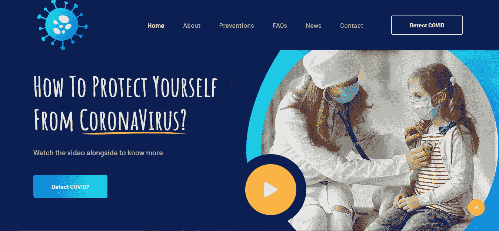****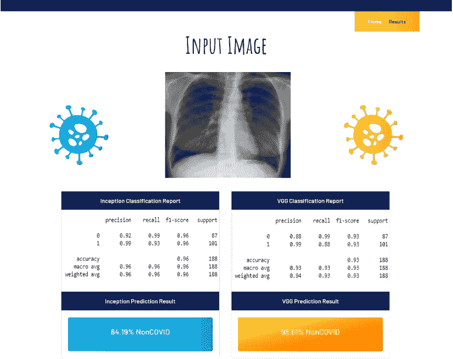**

# **源代码**

**整个项目的源代码以及数据集、模型和 flask 应用程序都可以在我的 [**Github repo 上找到。**](https://github.com/kaushikjadhav01/COVID-19-Detection-Flask-App-based-on-Chest-X-rays-and-CT-Scans/)**

# **结论**

**最后，我想说明一个事实，即分析是在有限的数据集上进行的，结果是初步的。该方法尚未进行医学验证，因此结果可能与实际使用案例中观察到的结果不同。**

**在未来，我计划通过在更多的图像上训练模型来提高它们的性能，并可能包括其他因素，如年龄、国籍、性别等。此外，我鼓励本文的读者自己尝试代码，以提高模型的精度。**

**如果你觉得这篇文章有用，请随意与他人分享。非常感谢您的阅读。注意安全！**

*****注意——我不是医学背景，这个项目是为了概念的演示而开发的。*****

**请随时在其他平台上与我联系:**

**github—[https://github.com/kaushikjadhav01](https://github.com/kaushikjadhav01)**

**LinkedIn—[https://www.linkedin.com/in/kaushikjadhav01/](https://www.linkedin.com/in/kaushikjadhav01/)**