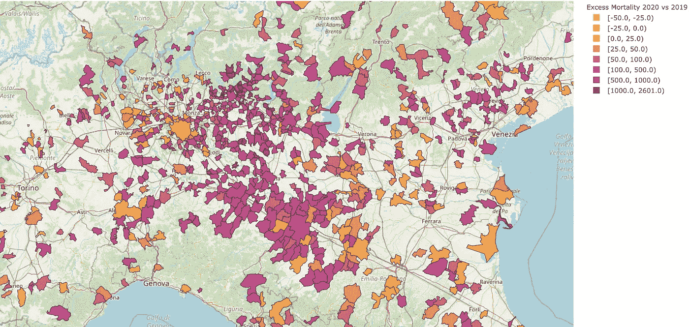
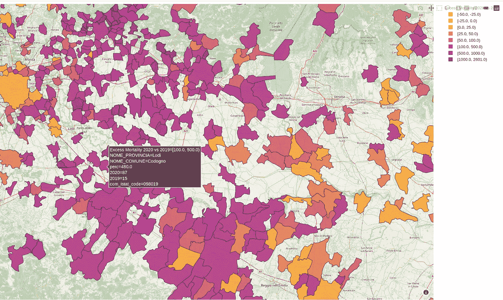
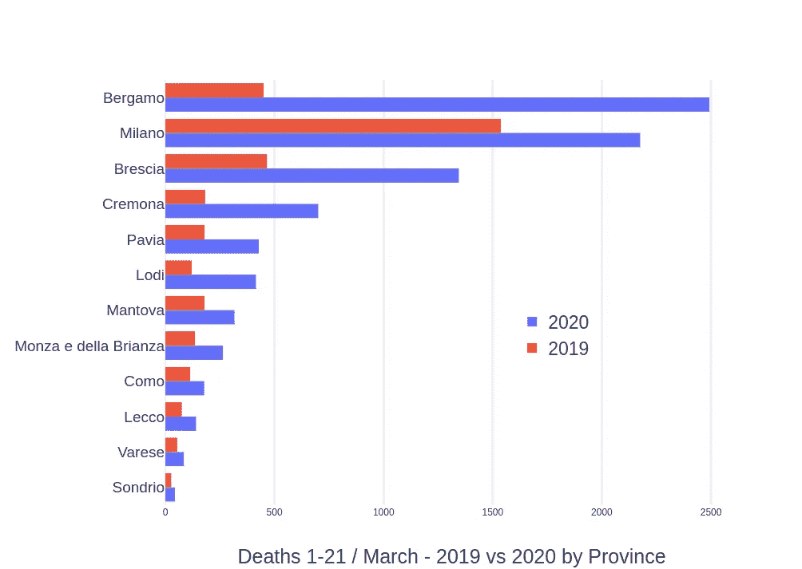
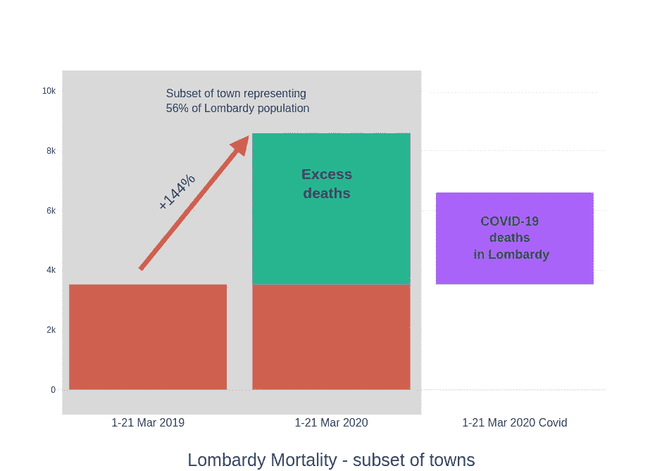
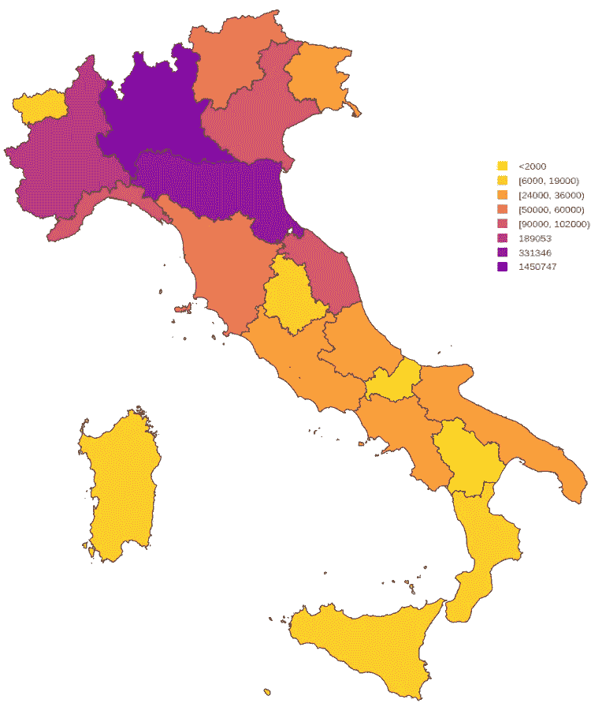
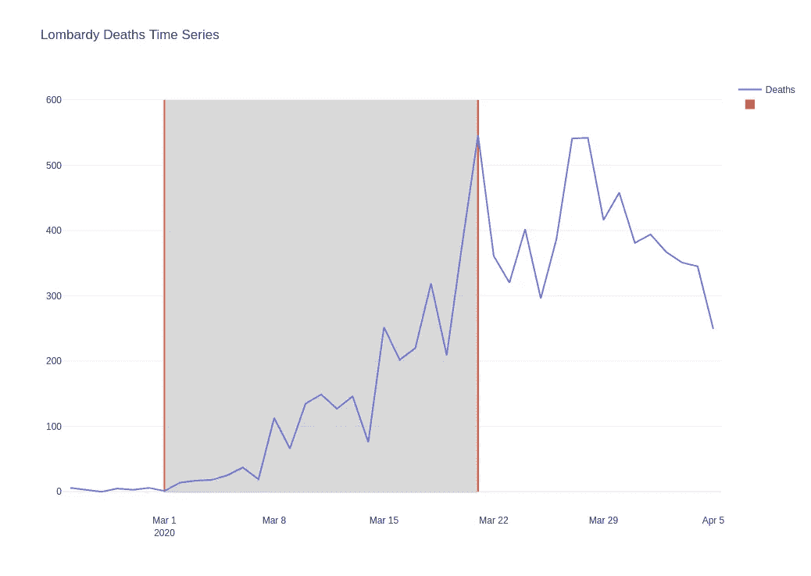

# 新冠肺炎:意大利的超额死亡率

> 原文：<https://towardsdatascience.com/covid-19-excess-mortality-figures-in-italy-d9640f411691?source=collection_archive---------1----------------------->

## 新冠肺炎官方死亡人数与伦巴第死亡率的比较

***编者按:*** [*走向数据科学*](http://towardsdatascience.com/) *是一份以数据科学和机器学习研究为主的中型刊物。我们不是健康专家或流行病学家，本文的观点不应被解释为专业建议。想了解更多关于疫情冠状病毒的信息，可以点击* [*这里*](https://www.who.int/emergencies/diseases/novel-coronavirus-2019/situation-reports) *。*

照片由 [Georg Eiermann](https://unsplash.com/@georgeiermann?utm_source=unsplash&utm_medium=referral&utm_content=creditCopyText) 在 [Unsplash](https://unsplash.com/s/photos/covid-19?utm_source=unsplash&utm_medium=referral&utm_content=creditCopyText) 拍摄

本周全世界有创纪录的 120 万新型冠状病毒，官方报道死亡人数超过 66000 人，意大利仍然是死亡人数最多的国家，截至 2020-04-04 为 15362 人，伦巴第的死亡人数占总死亡人数的 56%。

意大利民防部门的负责人在 3 月 23 日声称，新新型冠状病毒的致命率已经争论了很久:

> 截至昨天，冠状病毒的官方数字为 63000。我们认为 1:10 的比率(1 个阳性:10 个未检测的阳性)[ [1](https://rep.repubblica.it/pwa/generale/2020/03/23/news/coronavirus_borrelli_i_numeri_sono_altri_l_epidemia_va_piu_veloce_della_nostra_burocrazia_-252124440/?ref=RHPPTP-BH-I252124970-C12-P8-S1.12-T1) ]是可信的

很难估计有多少人被感染，因为他们中有很多人没有表现出任何症状，而且通常对表现出新冠肺炎症状的患者进行拭子检测。这种方法(方便取样)引入了取样误差的可能性，并且产生的样本的代表性仍然值得怀疑[ [2](https://web.uniroma1.it/memotef/sites/default/files/Proposta.pdf?fbclid=IwAR2TBaSIazE7mSmvsj8hAMamBcWVF86_PuI99RjGmiNOFm2aWpzZK_EaXN0) ]。

此外，死亡人数可能被低估。事实上，极有可能的是，过多的死亡主要是在家中或住宅设施中死亡的老年人或体弱者，他们没有被送往医院，因此没有进行新冠肺炎检测。

意大利统计研究所(ISTAT)根据最新的人口普查，公布了意大利各地选定城镇的死亡率数据，特别是 2020 年 3 月 1 日至 2020 年 3 月 21 日之间的总死亡人数。该数据包含所有城镇的子集，即 1084 个城镇/城市，可以比较 2020 年 3 月前三周与 2019 年同期相比死亡人数的增加或减少，结果如下图所示。该数据每周更新，文章基于以前发布的数据。

> **所有可用城镇和城市数据的互动地图可以在这里找到******[**5**](http://content.dsadserver.com/Ciro/muni.html)**】(地图加载有点重)**。****
> 
> ****截至 3 月 28 日的更新地图可在此处找到[ [8](http://content.dsadserver.com/Ciro/italy_map_28Mar2020.html) ]****

********

****放大意大利北部-艾米利亚伦巴第****

****令人震惊的是，与峰值超过 1000%的 2019 年相比，2020 年该镇的大多数颜色都倾向于非常高的死亡增长率。特别是，我们可以注意到紫色在伦巴第和艾米利亚地区的强烈集中，那里目前有最大的疫情，特别是在贝加莫，皮亚琴察，布雷西亚等省。如果从较大城市的数据来看，贝加莫涨幅最大 294%，其次是皮亚琴察 201%，布雷西亚 109%，帕尔马 103%，帕维亚 41%，曼图亚 22%，米兰 17%。****

****在发现“第一名患者”的罗提省，Codogno 今年已有 87 人死亡，而 2019 年同期只有 15 人死亡。****

********

****放大罗提和皮亚琴察之间的伦巴第****

# ****统计数据和见解摘要****

****如上所述，1，084 个城镇是 ISTAT 提供的一个子集。子集包含伦巴第的 434 个城镇，覆盖总人口的 56.48%(1000 万居民)。下表显示了按 12 个伦巴第省分组的死亡数据，按 2020 年死亡人数排序。贝加莫省的增幅最大，2020 年为 454%。2019 年，米兰省增幅最小，为 42%。****

********

****如果我们绘制伦巴第地区城镇子集记录的总死亡人数，我们可以看到，与 2019 年相比，2020 年 3 月 1 日至 21 日之间的死亡人数增加了 144%(2019 年 3520 人死亡，2020 年 8587 人死亡)。因此，又有 5067 人死亡。****

****但是官方公布的 2020 年 3 月 1 日至 21 日伦巴第新冠肺炎死亡人数是 3072 人。****

********

****这意味着，在 56.48%的人口中，数字显示有 5067 人超额死亡(即每 100 万人口中有 891.8 人死亡)，高于 3072 人(每 100 万人口中有 305.4 人死亡)，这是整个伦巴第的官方新冠肺炎死亡人数。****

****如果我们考虑同比最差情况波动高达 20%，那么超额死亡人数为每 100 万人 767.87 人，我们可以推断，2020 年 3 月 1 日至 21 日伦巴第地区可能有 7725 人超额死亡，其中 40%是由于新冠肺炎，60% (4653 人)是原因不明的死亡。于是出现了一个问题:统计误差有多大？****

****这表明，新冠肺炎导致的死亡人数可能是官方死亡人数的两倍半(即 767.87/305.4=2.514)。因此，伦巴第地区的 7725 例死亡可能代表了一个接近上限的数字，因为我们不知道这些城镇的子集是否是一个代表性样本，但是，潜在的，我们应该不会太远。****

****鉴于 3 月 1 日至 24 日期间新冠肺炎死亡总人数为 2060 人，3 月底，贝加莫市市长 Giorgio Gori [6]估计该省感染总人数为 288000 人。使用乘数 2.514 的估计值介于[258972；345256]感染，死亡率分别为 2%和 1.5%。这是贝加莫省总人口的 31%。****

****如果我们应用于伦巴第的 8656 例死亡的全部，估计在[1.08m；截至 2004 年 4 月 20 日，新冠肺炎感染人数为 145 万。****

****将相同的比率应用于意大利各地的 15362 例死亡人数(尽管南部地区可能有不同的乘数)，我们得到[193 万；2.57M]，所以在英国帝国大学研究人员计算的 95%可信区间内[ [7](https://www.imperial.ac.uk/mrc-global-infectious-disease-analysis/covid-19/report-13-europe-npi-impact/) ]，接近其下限。****

****下图总结了意大利可能出现的情况。****

********

****全国新冠肺炎感染者的可能人数****

# ******参考文献******

****[1]:[https://rep . repubblica . it/pwa/generale/2020/03/23/news/coronavirus _ borrelli _ I _ numeri _ sono _ altri _ l _ epidemia _ va _ piu _ veloce _ della _ no stra _ burocrazia _-252124440/？ref = RHPPTP-BH-I 252124970-C12-P8-s 1.12-T1)](https://rep.repubblica.it/pwa/generale/2020/03/23/news/coronavirus_borrelli_i_numeri_sono_altri_l_epidemia_va_piu_veloce_della_nostra_burocrazia_-252124440/?ref=RHPPTP-BH-I252124970-C12-P8-S1.12-T1))****

****[2]: Alleva，Giorgio 等人(2020 年 3 月)[https://web . uniroma 1 . it/memo tef/sites/default/files/proposta . pdf？FB clid = iwar 2 tbasiaze 7m smvsj 8 hamambcwvf 86 _ pui 99 rjgminofm 2 awp zzk _ eaxn 0](https://web.uniroma1.it/memotef/sites/default/files/Proposta.pdf?fbclid=IwAR2TBaSIazE7mSmvsj8hAMamBcWVF86_PuI99RjGmiNOFm2aWpzZK_EaXN0)****

****[3]:[https://www . Corriere . it/politica/20 _ marzo _ 26/the-real-death-toll-for-新冠肺炎-至少是官方数字的 4 倍-b5 af 0 EDC-6 eeb-11ea-925 b-a 0 C3 cdbe 1130 . shtml](https://www.corriere.it/politica/20_marzo_26/the-real-death-toll-for-covid-19-is-at-least-4-times-the-official-numbers-b5af0edc-6eeb-11ea-925b-a0c3cdbe1130.shtml)****

****[4]: ISTAT。(2020 年 4 月 3 日)。[https://www.istat.it/it/archivio/240401](https://www.istat.it/it/archivio/240401)****

****[5]:2020 年与 2019 年超额死亡率，Cholopetth 地图。西罗·蒙塔加诺。(2020 年 4 月 3 日)[http://content.dsadserver.com/Ciro/muni.html](http://content.dsadserver.com/Ciro/muni.html)****

****[6]:乔治·戈里的推特(2020 年 3 月 26 日):****

****乔治·戈里声明****

****[7][https://www . imperial . AC . uk/MRC-global-infectious-disease-analysis/新冠肺炎/report-13-Europe-NPI-impact/](https://www.imperial.ac.uk/mrc-global-infectious-disease-analysis/covid-19/report-13-europe-npi-impact/)****

****[8]2020 年 3 月 1 日至 28 日与 2019 年相比的超额死亡率，Cholopetth 地图。西罗·蒙塔加诺。(2020 年 4 月 14 日)[http://content.dsadserver.com/Ciro/italy_map_28Mar2020.html](http://content.dsadserver.com/Ciro/italy_map_28Mar2020.html)****

## ****其他读物****

********

****伦巴第死亡人数****

****世卫组织·新冠肺炎仪表板。(2020 年 4 月 4 日)。[https://experience . ArcGIS . com/experience/685 d0a ce 521648 F8 a5 beeee E1 b 9125 CD](https://experience.arcgis.com/experience/685d0ace521648f8a5beeeee1b9125cd)****

****向部长致敬。(2020 年 4 月 3 日)。*新冠肺炎—意大利的 Situazione*[http://www . salute . gov . it/portale/nuovocoronavirus/dettagliocontinutinuocoronavirus . JSP？lingua = italiano&id = 5351&area = nuovoCoronavirus&menu = vuoto](http://www.salute.gov.it/portale/nuovocoronavirus/dettaglioContenutiNuovoCoronavirus.jsp?lingua=italiano&id=5351&area=nuovoCoronavirus&menu=vuoto)****

****[https://github . com/PCM-DPC/新冠肺炎/blob/master/schede-riepilogative/regioni/DPC-covid 19-ita-scheda-regioni-2020 04 03 . pdf](https://github.com/pcm-dpc/COVID-19/blob/master/schede-riepilogative/regioni/dpc-covid19-ita-scheda-regioni-20200403.pdf)****

****[https://www . epicentro . ISS . it/coronavirus/SARS-cov-2-decessi-Italia](https://www.epicentro.iss.it/coronavirus/sars-cov-2-decessi-italia)****

**** [## 意大利的冠状病毒。拉马帕-德尔孔塔吉奥

### 意大利 29 日发生的第一起冠状病毒 2 型感染者死亡事件。到期…

www.ilfoglio.it](https://www.ilfoglio.it/salute/2020/02/24/news/il-coronavirus-in-italia-la-mappa-del-contagio-303522/)  [## 冠状病毒，真正的死亡人数:贝加莫省一个月内有 4500 名受害者

### 这是 L'Eco di Bergamo 和 InTwig 使用当地……提供的数据进行分析的结果

www.ecodibergamo.it](https://www.ecodibergamo.it/stories/bergamo-citta/coronavirus-the-real-death-tool-4500-victims-in-one-month-in-the-province-of_1347414_11/)  [## 伦巴第的冠状病毒，迪雷塔的 tutti gli aggiornamenti

### 关于达拉斯地区冠状病毒感染病例的确认问题。

www.lombardianotizie.online](https://www.lombardianotizie.online/coronavirus-casi-lombardia/) 

[https://www . ecodibergamo . it/stories/Bergamo-citta/coronavirus-the-real-death-tool-4500-victims-in-one-month-of-the-province-of _ 1347414 _ 11/](https://www.ecodibergamo.it/stories/bergamo-citta/coronavirus-the-real-death-tool-4500-victims-in-one-month-in-the-province-of_1347414_11/)****