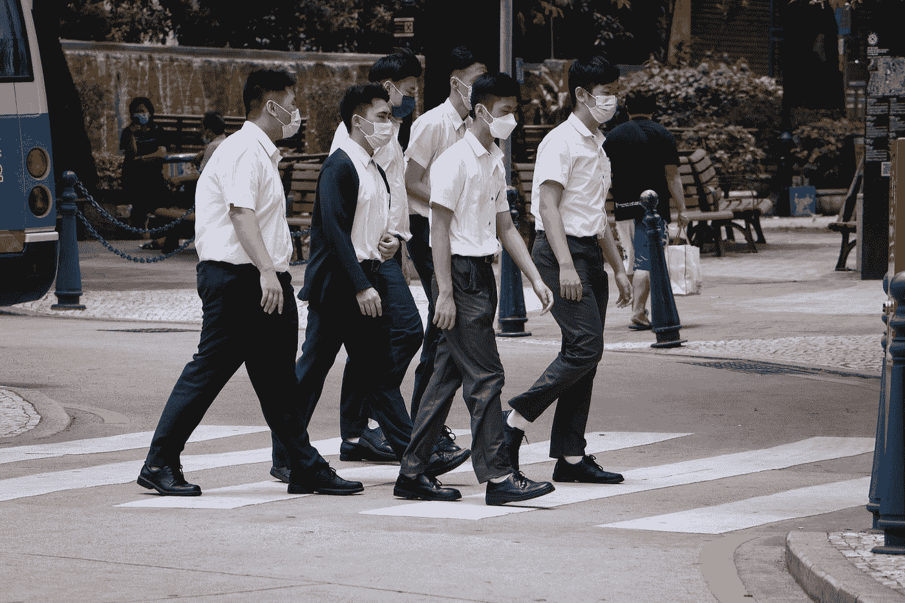
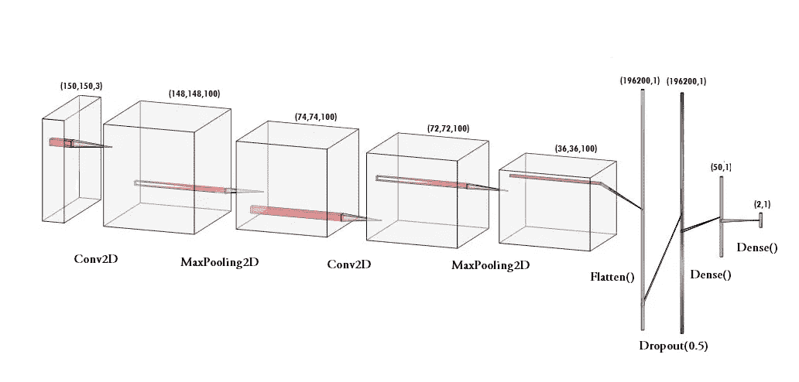
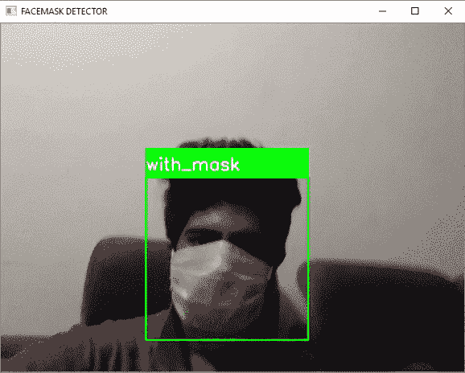

# 新冠肺炎:使用 TensorFlow 和 OpenCV 的人脸面具检测

> 原文：<https://towardsdatascience.com/covid-19-face-mask-detection-using-tensorflow-and-opencv-702dd833515b?source=collection_archive---------3----------------------->

## 构建一个 CNN 模型，用你的网络摄像头或手机摄像头检测一个人是否戴着口罩。

在这些艰难的*时代，做一些与之相关的事情岂不是令人满足？我决定用 ***TensorFlow*** 搭配 ***Keras*** 库和 ***OpenCV*** 建立一个非常简单基本的卷积神经网络(CNN)模型，来检测你是否戴了口罩来保护自己。有意思！不是吗？*

**

*[澳门图片社](https://unsplash.com/@macauphotoagency?utm_source=medium&utm_medium=referral)拍摄于 [Unsplash](https://unsplash.com?utm_source=medium&utm_medium=referral)*

*为了建立这个模型，我将使用由[般若班达瑞](https://www.linkedin.com/feed/update/urn%3Ali%3Aactivity%3A6655711815361761280/)提供的面具数据集。它由大约***1376***个图像和 ***690*** 个包含带面罩人的图像和 ***686*** 个包含不带面罩人的图像组成。*

*我将使用这些图像构建一个 CNN*模型，使用 TensorFlow 通过使用您的 *PC* 的*网络摄像头*来检测您是否戴着面罩。此外，你也可以用你的*手机的摄像头*来做同样的事情！**

## **步骤 1:数据可视化**

**在第一步中，让我们可视化两个类别的数据集中的图像总数。我们可以看到在' ***yes*** '类中有 ***690*** 图像，在' ***no*** 类中有 ***686*** 图像。**

```
**The number of images with facemask labelled 'yes': 690 
The number of images with facemask labelled 'no': 686**
```

## ****第二步:数据扩充****

**在下一步中，我们 ***增加*** 我们的数据集，以包括更多数量的图像用于我们的训练。在这个*数据扩充*的步骤中，我们*旋转*和*翻转*我们数据集中的每张图像。我们看到，在数据扩充后，我们总共有 2751 张*图像，其中 ***1380 张*** 图像属于“ ***是*** 类，而“ ***1371 张*** 图像属于“ ***否*** 类。***

```
**Number of examples: 2751 
Percentage of positive examples: 50.163576881134134%, number of pos examples: 1380 
Percentage of negative examples: 49.836423118865866%, number of neg examples: 1371**
```

## ****第三步:拆分数据****

**在这一步中，我们 ***将我们的数据分割成 ***训练集*** 和 ***测试集*** ，训练集***将包含 CNN 模型将被训练的图像，测试集***包含我们的模型将被测试的图像。*****

*在这里，我们取***split _ size = 0.8***，这意味着总图像的*的 80%将进入*训练集*，剩余的 ***图像的 20%*** 将进入*测试集。***

```
**The number of images with facemask in the training set labelled 'yes': 1104
The number of images with facemask in the test set labelled 'yes': 276
The number of images without facemask in the training set labelled 'no': 1096
The number of images without facemask in the test set labelled 'no': 275**
```

**在分割之后，我们看到如上所述，期望百分比的图像已经被分配给训练集和测试集。**

## ****第四步:建立模型****

**下一步，我们构建我们的 ***顺序 CNN 模型*** ，具有各种层，如 *Conv2D、MaxPooling2D、Flatten、Dropout* 和 *Dense* 。在最后一个密集层中，我们使用' ***softmax*** '函数来输出一个向量，该向量给出两个类中每一个的*概率*。**

**人脸面具检测的序贯模型**

**这里，我们使用'***Adam***' optimizer 和'***binary _ cross entropy***'作为我们的损失函数，因为只有两个类。此外，您甚至可以使用 *MobileNetV2* 来获得更高的精确度。**

****

**口罩 CNN 模型(来源——自己)**

## ****第五步:预先训练 CNN 模型****

**在构建了我们的模型之后，让我们创建' ***train_generator*** 和'***validation _ generator***'以在下一步中使它们适合我们的模型。我们看到 ***训练集*** 中总共有 ***2200 张*** 图像，*中有 ***551 张*** 图像。***

```
**Found 2200 images belonging to 2 classes. 
Found 551 images belonging to 2 classes.**
```

## **步骤 6:训练 CNN 模型**

**这一步是我们将训练集和测试集中的图像与我们使用 ***keras*** 库构建的序列模型相匹配的主要步骤。我已经为 ***30*** ***历元*** 训练了模型(迭代)。但是，我们可以训练更多的周期数以获得更高的精度，以免出现*过拟合*。**

```
**history = model.fit_generator(train_generator,
                              epochs=30,
                              validation_data=validation_generator,
                              callbacks=[checkpoint])>>Epoch 30/30
220/220 [==============================] - 231s 1s/step - loss: 0.0368 - acc: 0.9886 - val_loss: 0.1072 - val_acc: 0.9619**
```

**我们看到，在第 30 个历元之后，我们的模型对于训练集的准确度为*98.86%，对于测试集的准确度为 ***96.19%*** 。这意味着它训练有素，没有任何过度配合。***

## ****第七步:标注信息****

**建立模型后，我们为我们的结果标注两个概率。***【0】****为* ***【不带 _ 面具】*** *和****【1】****为* ***【带 _ 面具】*** 。我还使用 RGB 值设置了边界矩形的颜色。 ***【红色】*** *为* ***【不带 _ 面具】*** *和* ***【绿色】*** *为* ***【带 _ 面具】*****

```
**labels_dict={0:'without_mask',1:'with_mask'} 
color_dict={0:(0,0,255),1:(0,255,0)}**
```

## ****步骤 8:导入面部检测程序****

**在此之后，我们打算用它来检测我们是否戴着口罩使用我们的电脑的网络摄像头。为此，首先，我们需要实现人脸检测。在这里，我使用*基于 Haar 特征的级联分类器*来检测面部特征。**

```
**face_clsfr=cv2.CascadeClassifier('haarcascade_frontalface_default.xml')**
```

**这个级联分类器是由 *OpenCV* 设计的，通过训练成千上万的图像来检测*正面人脸*。的。xml 文件也需要下载并用于检测面部。我已经将文件上传到了我的 GitHub 存储库中。**

## ****第九步:检测戴面具和不带面具的人脸****

**在最后一步中，我们使用 OpenCV 库运行一个无限循环来使用我们的网络摄像头，其中我们使用*级联分类器*来检测人脸。代码`webcam = cv2.VideoCapture(0)`表示网络摄像头的使用。**

**该模型将预测两类`([without_mask, with_mask])`中每一类的可能性。基于哪个概率更高，标签将被选择并显示在我们的脸部周围。**

> ***此外，您可以下载适用于手机和 PC 的*[*droid cam*](https://www.dev47apps.com/)*应用程序，以使用您手机的摄像头并在* `*webcam= cv2.VideoCapture(1).*`中将数值从 0 更改为 1**

## **演示**

**让我们看看我在自己身上试用的演示吧！**

****

**演示视频**

**从上面的演示视频中，我们看到模型能够正确地检测到我是否戴着面具，并在标签上显示出来。**

**我正在分享我的 *GitHub 库*的链接，在那里你可以找到详细的。ipynb 程序代码，供你试用。**

**[](https://github.com/mk-gurucharan/Face-Mask-Detection/) [## MK-gurucharan/面罩检测

### 在此，我附上我的代码，建立一个 CNN 模型，以检测一个人是否戴着口罩或不使用…

github.com](https://github.com/mk-gurucharan/Face-Mask-Detection/) 

在这篇文章中，我们成功地建立了一个 CNN 模型来检测一个人是否戴着面罩。这可以用于许多应用中。考虑到*新冠肺炎危机*，戴口罩在不久的将来可能是必要的，这种检测人是否戴口罩的方法可能会派上用场。

我真的希望这些艰难的日子能尽快结束。让我们都保持健康和安全。到那时，快乐的机器学习！**