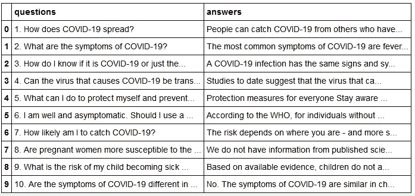
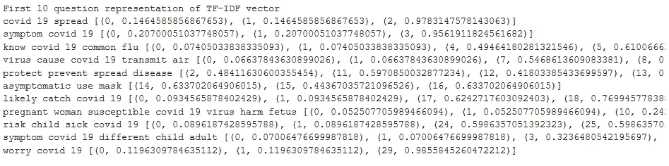
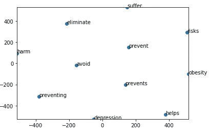
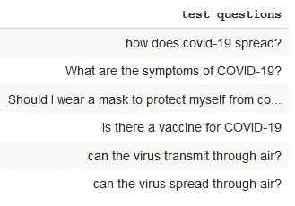
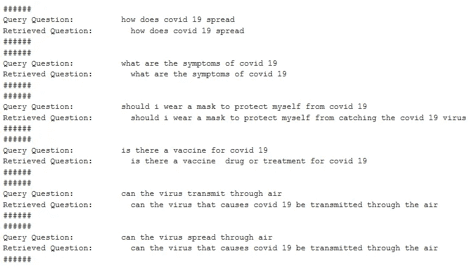

# 新冠肺炎常见问题机器人:一切你需要知道的 QnA 相似性

> 原文：<https://towardsdatascience.com/covid-19-faq-bot-everything-you-need-to-know-about-qna-similarity-35a730f63fa1?source=collection_archive---------45----------------------->

## 新冠肺炎相关问题的自动问答系统

***作者注:*** [*迈向数据科学*](http://towardsdatascience.com) *是一份以数据科学和机器学习研究为主的中型刊物。我们不是健康专家或流行病学家，本文的观点不应被解释为专业建议。想了解更多关于疫情冠状病毒的信息，可以点击* [*这里*](https://www.who.int/emergencies/diseases/novel-coronavirus-2019/situation-reports) *。*

最近几个月，新冠肺炎已经成为全球热门话题。今天，正如新冠肺炎强烈显示的那样，预防胜于治疗。他们中的大多数人在目前的情况下都能很好地理解这句话。是的，人们正试图阻止自己和他人传播病毒。的确，社交距离和戴 N-95 口罩被人们广泛效仿。

人们对每个话题都有自己的假设和看法。许多人都有一些常见问题，这些问题被称为常见问题。在今天的情况下，新冠肺炎病例迅速增加。每个人都想知道新冠肺炎病毒的真相。此外，他们中的大多数都有如下常见问题:

*   病毒是如何传播的？
*   有什么症状？
*   有疫苗吗？
*   病毒在表面存活多久？

每个人都有自己的假设或疑问。

在这篇文章中，将讨论如何建立自动新冠肺炎常见问题机器人检索常见问题的答案。

1.  数据收集—新冠肺炎常见问题数据
2.  数据准备
3.  数据预处理
4.  问题表示技术
5.  使用用户查询评估

# 1.数据收集—新冠肺炎常见问题

数据收集是从各种可用来源收集相关信息。当我在网上搜索新冠肺炎常见问题时，我找到了以下参考资料。

1.  [https://www.mohfw.gov.in](https://www.mohfw.gov.in/pdf/FAQ.pdf)
2.  [https://](https://www.mohfw.gov.in/pdf/FAQ.pdf)www.cdc.gov
3.  [https://](https://www.mohfw.gov.in/pdf/FAQ.pdf)www.un.org

我选择了[https://www.un.org](https://www.un.org)网站新冠肺炎常见问题数据来建立我们的问答相似性系统。它有 39 个不同的新冠肺炎常见问题。了解可用数据的格式总是非常重要的。它是一个 PDF 非结构化文档。让我们以编程方式下载该文件，如下面的代码片段所示。

# 2.数据准备

下一个任务是准备所需格式的数据来解决问题。因为，我们需要从非结构化文档中提取每个问题和相应的答案，并将其存储在结构化文件中。从文本文件中提取信息的最好和最简单的方法是进行解析。解析有助于检索基于以下假设的特定信息。

## 假设:

1.  它必须遵循原始文本中的一些模式。
2.  应该从 PDF 中提取相同的结构。
3.  文本中不应包含任何干扰。

在管道中，它涉及以下任务。

*   它使用 [R 模块](https://github.com/ropensci/pdftools)将 PDF 文件转换为文本文件。这个模块在文本文件中保持相同的 PDF 结构。我发现与 python 中的其他模块相比，这个模块工作得非常好。结构的内容将帮助我们很好地解析 QA。外部执行的 PDF 到文本的转换过程。(这个过程没有包含在代码片段中)
*   模式匹配对于从原始文本中检索结构化信息非常有效。我们将使用 [python 模块](https://docs.python.org/3/library/re.html)解析问题和答案。(如下面的代码片段所示)
*   存储新冠肺炎常见问题问答结构化(。csv)文件。

准备好的新冠肺炎常见问题数据如下所示:

结构化新冠肺炎常见问题数据。(前 10 行)

# **3。数据预处理**

我们不会照原样使用数据。预处理是 NLP 中微调数据的另一个非常关键的步骤。

1.  删除不需要的字符
2.  删除问题编号
3.  删除停用词
4.  词汇化——减少单词的变形，最小化单词歧义。

我们将这些技术应用于 FAQ 问题和用户查询问题。

**为什么我选择词汇化而不是词干化？**

词干化和词尾化都是为了减少屈折形式。词汇化将文本最小化为**适当的词汇**但是，词干化减少到单词的前缀或后缀。词汇化将所有意思相同但表达不同的单词转换成它们的基本形式。

新冠肺炎文本预处理程序类。

# 4.问题表示技术

在本节中，我们将讨论表示常见问题的多种方式。

1.  TF-IDF
2.  单词嵌入
3.  伯特嵌入

## TF-IDF

我们将用于语义相似性的第一种方法是利用单词包(BOW)。TF-IDF 将文本转换成有意义的数字。该技术是 NLP 应用中广泛使用的特征提取。TF(词频)衡量单词在文档中出现的次数。IDF(逆文档频率)测量在所有文档中具有高频率的词的低值。

新冠肺炎常见问题 TF-IDF 问题表示如下图所示，

TF-IDF 新冠肺炎分数表示常见问题。

用于生成 TF-IDF 表示的代码片段如下所示:

## 单词嵌入

[GloVe](https://nlp.stanford.edu/projects/glove/) 是一种无监督学习算法，用于获取单词的矢量表示。它在全局单词-单词共现矩阵上进行训练。我从 Glove 下载了一个预先训练好的单词向量用于我们的分析。用于生成文字嵌入表示的代码片段如下:

让我们来看看嵌入对于语义信息是如何相互接近的。

具有相似嵌入的“防止”的单词嵌入可视化。(二手手套-twitter-25)

## 伯特嵌入

BERT 是一个基于 transformer 的模型，试图利用单词的上下文来获得嵌入。伯特打破了几项 NLP 任务的记录。下面的搜索查询是理解 BERT 的一个很好的方法。“2019 年巴西旅行者去美国需要签证”。我们观察到单词“to”与句子中其他单词的关系对于语义解码是重要的。返回美国公民到巴西旅游的信息是不相关的，因为我们谈论的是巴西公民到美国旅游。伯特能处理好这件事。

# 5.使用用户查询评估

我们向多个代表提出了新冠肺炎常见问题。让我们评估用户新查询的每个表示。我们如何发现 FAQ 问题与新用户查询的相似之处？。寻找相似性得分的最佳技术之一是余弦相似性。我们现在将使用余弦相似度来比较每个表示。如何计算余弦相似性，如下面的代码片段所示，

我们将根据以下问题评估 FAQ 问题的相似性。

用户查询问题。

手套嵌入结果。

我们通过嵌入和 BERT 嵌入表示获得了最好的结果。TF-IDF 的缺点是不能从语义上表示这个问题。完整的代码可以在 [GitHub](https://github.com/narendraprasath/COVID-19-FAQ-Question-Answering-Bot) 中找到。你可以通过 [LinkedIn](https://www.linkedin.com/in/narendra-prasath/) 联系到我。

感谢阅读。！！！

## 资源:

https://github . com/narendraprasath/新冠肺炎-常见问题-问答-机器人