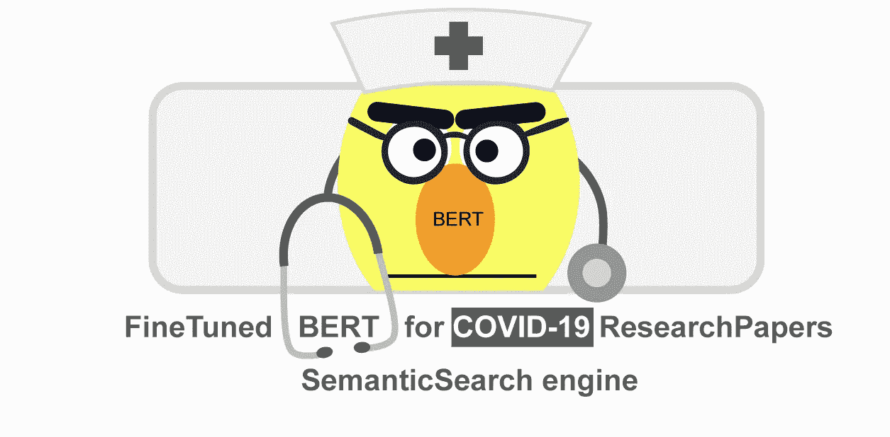
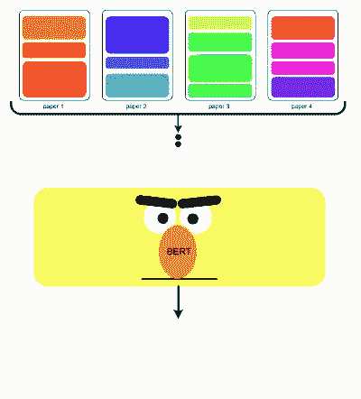
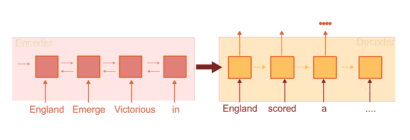
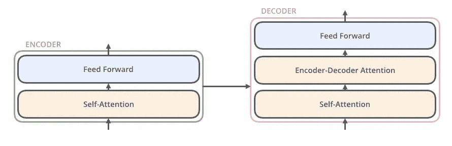
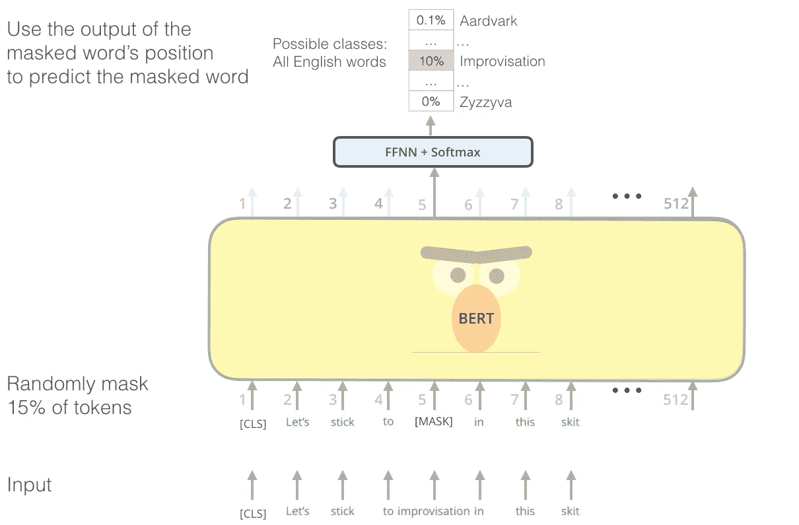
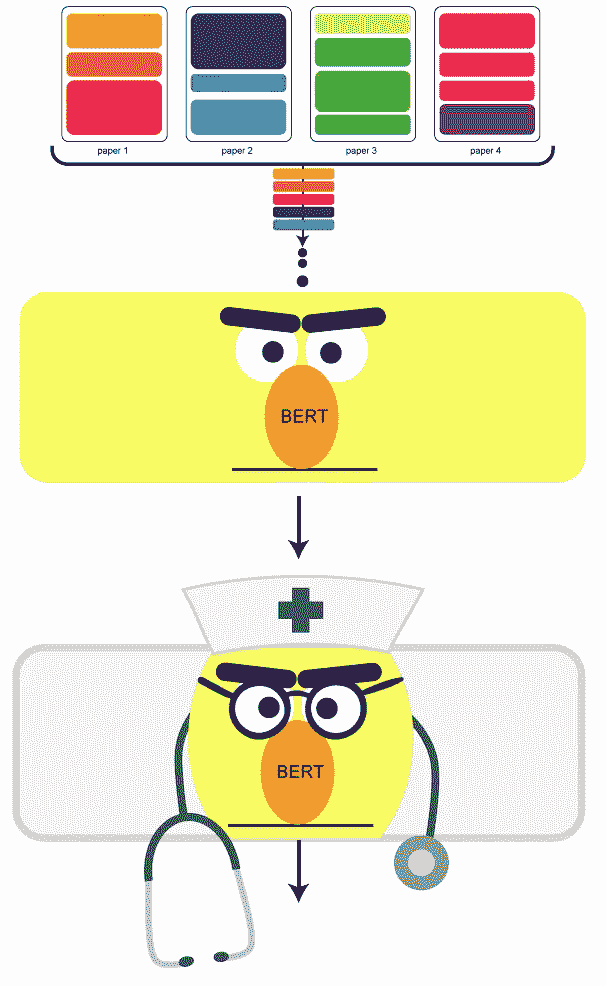
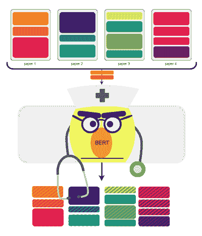
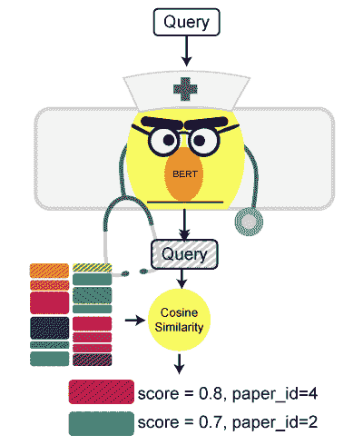

# 新冠肺炎微调伯特文学搜索引擎

> 原文：<https://towardsdatascience.com/covid-19-finetuned-bert-literature-search-engine-93ff9755a502?source=collection_archive---------35----------------------->



在过去的几周内，研究工作和研究论文的数量在持续增加，以对抗这种冠状新冠肺炎邪恶病毒。组织如此庞大的数据现在至关重要，这就是这项工作( [kaggle 代码](https://www.kaggle.com/theamrzaki/covid-19-finetune-bert-researchpapers-semantic-sea)、 [github 代码](https://github.com/theamrzaki/COVID-19-BERT-ResearchPapers-Semantic-Search/blob/master/COVID_19_FineTune_BERT_ResearchPapers_Semantic_Search.ipynb)优化运行在谷歌实验室、[数据](https://github.com/theamrzaki/COVID-19-BERT-ResearchPapers-Semantic-Search#data-links))试图实现的，作为[Kaggle 竞赛](https://www.kaggle.com/allen-institute-for-ai/CORD-19-research-challenge/tasks?taskId=568)的一部分，该竞赛试图找到智能解决方案来组织大量不断增加的研究知识。



微调 BERT，然后嵌入研究论文来构建搜索引擎

我们的方法是

1.  使用[变压器](https://github.com/huggingface/transformers)包微调 BERT 架构
2.  然后嵌入**研究论文**和**查询**，并使用余弦相似度在它们之间进行比较，有效地构建了一个搜索引擎，这里我们将使用[句子转换包](https://github.com/UKPLab/sentence-transformers)

这篇教程是我们上一篇教程 ( [代码](https://www.kaggle.com/theamrzaki/covid-19-bert-researchpapers-semantic-search)，[数据](https://github.com/theamrzaki/COVID-19-BERT-ResearchPapers-Semantic-Search#data-links))的延续，在这篇教程中，我们使用了一个已经训练好的 BERT 模型，并用它来构建我们的搜索引擎，不同的是，今天我们将微调我们的 BERT 模型以适应研究论文本身，所以让我们开始吧！！

# A.为什么是伯特

BERT 已经证明了它是语言建模的架构，在使用 Transformers 之前，文献使用 seq2seq 编码器-解码基于递归的模型(在我们的博客[系列](https://github.com/theamrzaki/text_summurization_abstractive_methods)中阅读更多)



然而，使用 [LSTM](https://medium.com/@theamrzaki/multilayer-bidirectional-lstm-gru-for-text-summarization-made-easy-tutorial-4-a63db108b44f) 限制了该架构处理长句的能力，所以这就是为什么在他们的论文[中引入了变形金刚【注意力是你所需要的全部】](https://arxiv.org/abs/1706.03762)，它们依赖于注意力模型，特别是**自我注意力**，这是一种神经网络，旨在理解如何关注输入句子中的特定单词，变形金刚也内置于编码器/解码器结构中(在贾马尔的精彩博客[http://jalammar.github.io/illustrated-transformer/](http://jalammar.github.io/illustrated-transformer/)中了解更多信息)



来自[http://jalammar.github.io/illustrated-transformer/](http://jalammar.github.io/illustrated-transformer/)

结果是，[我们不需要整个 Transformer 采用一个可微调的语言模型来完成 NLP 任务](http://jalammar.github.io/illustrated-bert/)，我们可以只使用解码器，就像 [OpenAI 提出的那样](http://jalammar.github.io/illustrated-bert/)，然而，由于它使用解码器，模型只训练一个正向模型，而不考虑前面和后面(因此是双向的)，这就是为什么引入了 BERT，我们只使用 Transformer 编码器。



来自[http://jalammar.github.io/illustrated-bert/](http://jalammar.github.io/illustrated-bert/)

# B.微调伯特



为了获得巨大的语言理解，BERT 在巨大的数据集上被训练，然而，我们能够进一步训练 BERT 到我们自己的数据集，(这是 [covid19 研究论文](https://www.kaggle.com/allen-institute-for-ai/CORD-19-research-challenge))这一步被称为微调，因为你微调 BERT 以适应我们自己的数据

1-首先我们将把[研究论文](https://www.kaggle.com/allen-institute-for-ai/CORD-19-research-challenge)(处理过的数据集在这里找到[)以一个大文件的形式传递，其中每一段都在它自己的一行上](https://github.com/theamrzaki/COVID-19-BERT-ResearchPapers-Semantic-Search#data-links)

2-然后我们将使用[变压器](https://github.com/huggingface/transformers)包来微调 BERT

所以让我们进入细节

1-处理[数据](https://github.com/theamrzaki/COVID-19-BERT-ResearchPapers-Semantic-Search#data-links)，我们采用了一些处理技术来构建一个 csv 文件，其中每一行都是一篇论文中的一个段落，我们的搜索引擎会尝试获取与查询最相似的段落，您可以从[这里下载数据](https://github.com/theamrzaki/COVID-19-BERT-ResearchPapers-Semantic-Search#data-links)(了解更多关于如何将数据从 google drive 连接到 google colab [这里](https://hackernoon.com/begin-your-deep-learning-project-for-free-free-gpu-processing-free-storage-free-easy-upload-b4dba18abebc))

```
import pandas as pd
from tqdm import tqdm#read csv
df_sentences = pd.read_csv("/content/drive/My Drive/BertSentenceSimilarity/Data/covid_sentences.csv")
df_sentences = df_sentences.set_index("Unnamed: 0")#load column to list
df_sentences = df_sentences["paper_id"].to_dict()
df_sentences_list = list(df_sentences.keys())
df_sentences_list = [str(d) for d in tqdm(df_sentences_list)]#process data to file
file_content = "\n".join(df_sentences_list)
with open("input_text.txt","w") as f:
    f.write(file_content)
```

2-现在我们将使用[变形金刚](https://github.com/huggingface/transformers)套装来微调 BERT

```
!pip install transformers
!git clone https://github.com/huggingface/transformers.git
```

然后运行微调

```
!python "/content/transformers/examples/run_language_modeling.py" \
--output_dir="/content/drive/My Drive/BertSentenceSimilarity/BERTfine" \
--model_type=bert \
--model_name_or_path=google/bert_uncased_L-2_H-128_A-2 \
--do_train \
--block_size=512 \
--train_data_file="/content/input_text.txt" \
--mlm
```

# C.构建搜索引擎

既然我们已经构建了自己的微调过的 BERT，让我们将嵌入应用到我们的数据中(使用[句子转换器](https://github.com/UKPLab/sentence-transformers)包)

```
!pip install -U sentence-transformers
```

然后加载您微调过的 BERT 模型

```
#https://github.com/UKPLab/sentence-transformers/blob/master/examples/application_semantic_search.pyfrom sentence_transformers import SentenceTransformer
from sentence_transformers import models, losses
import scipy.spatial
import pickle as pklword_embedding_model = models.BERT("/content/drive/My Drive/BertSentenceSimilarity/BERTfine")# Apply mean pooling to get one fixed sized sentence vector
pooling_model = models.Pooling(word_embedding_model.get_word_embedding_dimension(),
pooling_mode_mean_tokens=True,pooling_mode_cls_token=False,pooling_mode_max_tokens=False)model = SentenceTransformer(modules=[word_embedding_model, pooling_model])
```

然后应用嵌入，并将结果保存到 pkl 临时文件中



使用微调的 BERT 来嵌入我们的数据集

```
corpus = df_sentences_list
corpus_embeddings = model.encode(corpus,show_progress_bar=True)with open("/content/drive/My Drive/BertSentenceSimilarity/Pickles/corpus_finetuned_embeddings.pkl" , "wb") as f:
    pkl.dump(corpus_embeddings,f)
```

现在我们即将完成，我们只需要嵌入查询本身，然后使用**余弦相似度**来获得研究论文中最相似的段落，有效地构建一个搜索引擎



```
# Query sentences:queries = ['What has been published about medical care?',
'Knowledge of the frequency, manifestations, and course of extrapulmonary manifestations of COVID-19, including, but not limited to, possible cardiomyopathy and cardiac arrest',
'Use of AI in real-time health care delivery to evaluate interventions, risk factors, and outcomes in a way that could not be done manually',
'Resources to support skilled nursing facilities and long term care facilities.',
'Mobilization of surge medical staff to address shortages in overwhelmed communities .',
'Age-adjusted mortality data for Acute Respiratory Distress Syndrome (ARDS) with/without other organ failure – particularly for viral etiologies .']query_embeddings = model.encode(queries,show_progress_bar=True)
```

然后我们应用余弦相似度

```
# Find the closest 5 sentences of the corpus for each query sentence based on cosine similarityclosest_n = 5 
print("\nTop 5 most similar sentences in corpus:")*# Find the closest 5 sentences of the corpus for each query sentence based on cosine similarity*
closest_n = 5
print("**\n**Top 5 most similar sentences in corpus:")
**for** query, query_embedding **in** zip(queries, query_embeddings):
    distances = scipy.spatial.distance.cdist([query_embedding], corpus_embeddings, "cosine")[0]

    results = zip(range(len(distances)), distances)
    results = sorted(results, key=**lambda** x: x[1])

    **for** idx, distance **in** results[0:closest_n]:
        print("Score:   ", "(Score: **%.4f**)" % (1-distance) , "**\n**" )
        print("Paragraph:   ", corpus[idx].strip(), "**\n**" )
        row_dict = df.loc[df.index== corpus[idx]].to_dict()
        print("paper_id:  " , row_dict["paper_id"][corpus[idx]] , "**\n**")
        print("Title:  " , row_dict["title"][corpus[idx]] , "**\n**")
        print("Abstract:  " , row_dict["abstract"][corpus[idx]] , "**\n**")
        print("Abstract_Summary:  " , row_dict["abstract_summary"][corpus[idx]] , "**\n**")
```

# D.结果是

(与我们上一个[教程](/covid-19-bert-literature-search-engine-4d06cdac08bd)的预训练 BERT 相比)

## 示例 1:

```
==========================Query==========================
=== What has been published about medical care? =========
===================================================================================OLD (pretrained)=======================
Score:    (Score: 0.8296)
Paragraph:    how may state authorities require persons to undergo medical treatment
Title:    Chapter 10 Legal Aspects of Biosecurity----------------------------------Score:    (Score: 0.8220) 
Paragraph:    to identify how one health has been used recently in the medical literature
Title:    One Health and Zoonoses: The Evolution of One<br>Health and Incorporation of Zoonoses==========================NEW (finetuned)=========================
---------------Score:    (Score: 0.8779)Paragraph:    what is already known about this topic what are the new findings   paper_id:   f084dcc7e442ab282deb97670e1843e347cf1fd5 Title:    Ebola Holding Units at government hospitals in<br>Sierra Leone: evidence for a flexible and effective<br>model for safe isolation, early treatment<br>initiation, hospital safety and health system functioning---------------Score:    (Score: 0.8735)
Paragraph:    to identify how one health has been used recently in the medical literatureTitle:    One Health and Zoonoses: The Evolution of One<br>Health and Incorporation of Zoonoses
```

## 示例 2:

```
==========================Query==============================
=== Knowledge of the frequency, manifestations, and course of extrapulmonary manifestations of COVID-19, including, but not limited to, possible cardiomyopathy and cardiac arrest =====
===================================================================================OLD (pretrained)=======================
--------------Score:    (Score: 0.8139) 
Paragraph:    clinical signs in hcm are explained by leftsided chf complications of arterial thromboembolism ate lv outflow tract obstruction or arrhythmias capable of
Title:    Chapter 150 Cardiomyopathy --------------Score:    (Score: 0.7966) 
Paragraph:    the term arrhythmogenic cardiomyopathy is a useful expression that refers to recurrent or persistent ventricular or atrial arrhythmias in the setting of a normal echocardiogram the most commonly observed rhythm disturbances are pvcs and ventricular tachycardia vt however atrial rhythm disturbances may be recognized including atrial fibrillation paroxysmal or sustained atrial tachycardia and atrial flutter
Title:    Chapter 150 Cardiomyopathy==========================NEW (finetuned)=========================
--------------Score:    (Score: 0.8942)
Paragraph:    echocardiography and cardiac catheterization are common cardiac imaging modalities both modalities have drawbacks the limitations of echocardiography include operator dependence limited acoustic shadows a small field of view and poor evaluation of pulmonary veins the limitations of cardiac .......Title:    Trends in the utilization of computed<br>tomography and cardiac catheterization among children<br>with congenital heart disease--------------Score:    (Score: 0.8937)
Paragraph:    classic physical examination features of dcm include soft heart sounds from reduced contractility or pleural effusion gallop rhythm with or without a systolic murmur hypokinetic arterial pulses dull left apical impulse and clinical signs of profound chf exceptional cases are seen prior to onset of chfTitle:    Chapter 150 Cardiomyopathy
```

正如我们所看到的，新的微调伯特已经获得了经验丰富的知识，特别是优化和定制的新冠肺炎研究论文

完整的结果请参考[我们的代码笔记本](https://www.kaggle.com/theamrzaki/covid-19-finetune-bert-researchpapers-semantic-sea) (kaggle)或[代码](https://github.com/theamrzaki/COVID-19-BERT-ResearchPapers-Semantic-Search/blob/master/COVID_19_FineTune_BERT_ResearchPapers_Semantic_Search.ipynb) (github 优化为在 google colab 上运行)

# 电子评论

我们真的被深深打动了，

*   变形金刚包的易用性使得微调 BERT 变得非常容易，只需提供一个输入文本文件，每行包含一个句子(在我们的例子中是研究论文中的段落)
*   [句子转换器](https://github.com/UKPLab/sentence-transformers)库，这使得应用 BERT 嵌入和提取相似性变得极其容易。
*   结果的质量给我们留下了深刻的印象，因为与我们上一次教程中[的一般预训练的 BERT 相比，微调的 BERT 被证明更适合我们自己的数据集](/covid-19-bert-literature-search-engine-4d06cdac08bd)
*   我们相信，通过使用段落本身，而不仅仅是论文的摘要，我们不仅能够返回最相似的论文，而且能够返回论文中最相似的部分。
*   我们希望通过这一点，我们正在帮助构建一个不断增加的文献研究工作的世界，以对抗这种冠状新冠肺炎病毒。

# 电子参考文献

*   我们使用由[拥抱脸](https://github.com/huggingface)提供的叫做[变形金刚](https://github.com/huggingface/transformers)的库，这个库使得微调伯特变得非常容易
*   我们使用由 [UKPLab](https://github.com/UKPLab) 提供的名为[句子转换器](https://github.com/UKPLab/sentence-transformers)的库，这个库使得使用 BERT 和其他架构如 ALBERT、XLNet 进行句子嵌入变得非常容易，它们还提供了一个简单的接口来查询和聚集数据。
*   我们已经使用来自 [maksimeren](https://www.kaggle.com/maksimeren/covid-19-literature-clustering) 的代码进行数据处理，我们真心感谢他。
*   我们使用了绘画伯特的概念，在这里讨论[杰伊·阿拉姆马](http://jalammar.github.io/)在说明我们的建筑如何工作时，我们还参考了他所做的多个插图和解释，他的博客信息量极大，易于理解。
*   我们使用 Conneau 等人在 2017 年讨论的预训练模型，在 InferSent-Paper(从自然语言推理数据中监督学习通用句子表示)中显示，对自然语言推理(NLI)数据的训练可以产生通用句子嵌入。
*   [**注意就是你所需要的**](https://arxiv.org/abs/1706.03762)**变压器纸**
*   **[伯特](https://arxiv.org/abs/1810.04805)，[伯特代码](https://github.com/google-research/bert)**
*   **我们使用了一些来自 [Freepic](http://freepik.com/) 的矢量(图像)元素**

**本教程的代码可以在[这里](https://www.kaggle.com/theamrzaki/covid-19-finetune-bert-researchpapers-semantic-sea)找到，或者从 [github](https://github.com/theamrzaki/COVID-19-BERT-ResearchPapers-Semantic-Search/blob/master/COVID_19_FineTune_BERT_ResearchPapers_Semantic_Search.ipynb) 这里找到(如果你需要在 google colab 上运行它)，代码被构建为在 google colab 上无缝运行，使用其免费使用的 GPU，我们也使用 kaggle API 将数据直接下载到 google colab，所以既不需要在本地运行代码，也不需要在本地下载数据集。**

**我们还提供了所有处理过的数据集和嵌入的段落(219MB ),这些都需要一些时间来嵌入(所以你可以简单地使用它而不需要再次运行嵌入)，链接[这里](https://github.com/theamrzaki/COVID-19-BERT-ResearchPapers-Semantic-Search)，这些都托管在 google drive 上，我们已经构建了[代码](https://www.kaggle.com/theamrzaki/covid-19-finetune-bert-researchpapers-semantic-sea)或 [github 代码](https://github.com/theamrzaki/COVID-19-BERT-ResearchPapers-Semantic-Search/blob/master/COVID_19_FineTune_BERT_ResearchPapers_Semantic_Search.ipynb)来无缝连接到 google drive，(了解更多关于连接 google drive 的信息[这里](https://hackernoon.com/begin-your-deep-learning-project-for-free-free-gpu-processing-free-storage-free-easy-upload-b4dba18abebc)**

> *****编者注:*** [*走向数据科学*](http://towardsdatascience.com/) *是一份以数据科学和机器学习研究为主的中型刊物。我们不是健康专家或流行病学家，本文的观点不应被解释为专业建议。想了解更多关于疫情冠状病毒的信息，可以点击* [*这里*](https://www.who.int/emergencies/diseases/novel-coronavirus-2019/situation-reports) *。***

**我们真的相信，通过本教程，您已经对 BERT 有了更多的了解，以及如何根据您自己的数据集对其进行微调，我们也希望通过本教程，我们能够帮助研究社区对抗冠状病毒(新冠肺炎)。**

**希望你们都平安无事。**