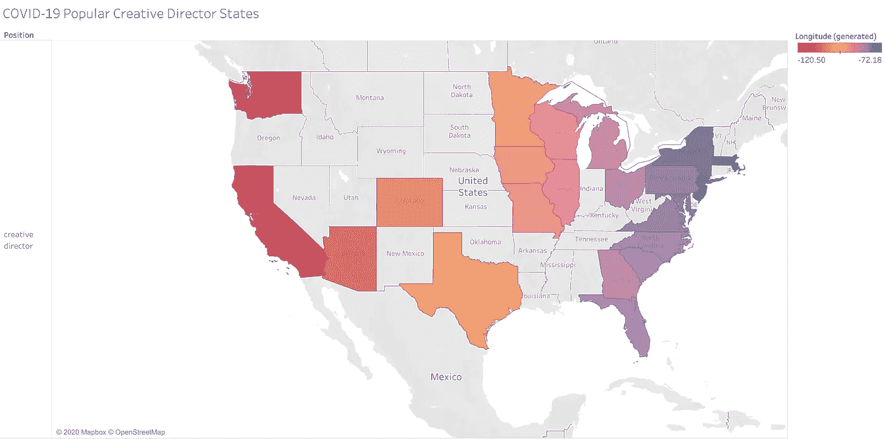

# 宾夕法尼亚州立大学格拉斯门毕业生薪酬分析

> 原文：<https://towardsdatascience.com/covid-19-glassdoor-penn-state-graduate-salary-analysis-7003a118c5bb?source=collection_archive---------53----------------------->

## 使用的数据科学工具和成果

# 介绍

新冠肺炎显然影响了就业市场。许多应届毕业生和即将毕业的大四学生被迫完成 2019-2020 学年，实际上在寻找工作和实习机会方面受到了严重影响，包括我和我的女朋友。

穆罕默德·沙赫侯赛尼在 [Unsplash](https://unsplash.com?utm_source=medium&utm_medium=referral) 上的照片

她和我都是宾州州立大学的高年级学生。由于新冠肺炎在就业市场造成的影响，美国许多公司已经并继续遭受大规模裁员，正因为如此，学生和新毕业生的许多机会现在都消失了。

然而，有一天，当社交距离和呆在家里，我有一个想法突然出现在我的脑海里。

> 如果我为我女朋友的专业做一个关于当前就业市场的项目会怎么样？

这太完美了。这不仅对我的[作品集](https://mariorashadhub.github.io/Paul_Portfolio/)来说是一个有价值的项目，而且也是一个有意义的分析，可以帮助她和其他学生了解哪些州目前在某些工作上比其他州拥有更多的机会。

# 目标

我的目标是总结哪些技能是雇主最需要的，哪些州对这些技能的招聘最多。这将使我有机会向我的“利益相关者”(我的女朋友)报告这些信息，帮助她在其他人申请同样的机会时获得优势。

通过写这篇文章，我在练习我讲故事的能力，并会感谢任何有助于我提高的反馈。

# 开始项目

我首先要问我在这个项目中的“利益相关者”她想要的职位是什么。以下是她转述给我的一些职位名称:

*   创意总监
*   营销总监
*   营销经理
*   品牌经理
*   营销协调员

有了一个好的开始，现在我需要得到那些要求这些工作的公司的招聘信息。

由于这是一个数据科学项目，我想自己手动收集数据。我决定跟随我的朋友 Ken Jee 的教程，他在自己的项目中讲解了如何用 Python 搜集 Glassdoor 数据，帮助我获得了大约 2000 个招聘广告。作为参考，我在这里链接了他的 YouTube 系列[。](https://www.youtube.com/watch?v=MpF9HENQjDo&list=PL2zq7klxX5ASFejJj80ob9ZAnBHdz5O1t)

# 沟通

在我探索如何成为一名数据科学家/分析师的过程中，我了解到**沟通是一项基本技能。**

我个人认为这也适用于人际关系。

进入这个项目时，我不知道在她的领域里需要什么样的技能，但是**没关系。将来会有这样的情况，我将从事一个我可能没有多少背景的项目。**由我来学习，找出这些信息来完成任务，找到答案。****

我决定做一个组合，问我的女朋友她从她的课程中学到了什么样的通用技能，并在谷歌上搜索这些相应职位的通用技能/先决条件。这些技能包括:

*   微软 Word
*   微软优越试算表
*   Adobe 创意云

然后，我在 2000 份招聘信息的数据集中设计了一些特征，看看哪些工作需要什么技能，在哪个州。

由于这篇文章主要是关于我的发现和反馈信息，我不会深入讨论该项目的数据收集、清理和探索性分析阶段，但是这些步骤的文档都可以在我的 [GitHub](https://github.com/MarioRashadHUB) 上获得。

# 我的一些发现:

在我的利益相关者给我的七个职位列表中，这是全美薪酬最高的前三个职位。

*   创意总监:111886 美元。
*   营销总监:99547 美元。
*   营销经理:76266 美元。

## 那些有微软 Excel 工作经验的人的总工资要高出 13%。

## 根据 Glassdoor 的调查，前五大最佳招聘城市约占所有招聘职位的 17%。

1.  纽约州纽约市:127 个招聘信息。
2.  加利福尼亚州旧金山:60 份招聘启事。
3.  伊利诺伊州芝加哥:58 个招聘广告。
4.  华盛顿州西雅图:56 个招聘广告。
5.  佐治亚州亚特兰大:45 个招聘广告。

## 所有职位平均工资中薪酬最高的 5 个州排名:

1.  阿肯色州:89250 美元。
2.  堪萨斯州:75750 美元。
3.  南达科他州:7.45 万美元。
4.  蒙大拿州:73250 美元。
5.  爱荷华州:73071 美元。

我女朋友最感兴趣的是获得一个创意总监的职位。有了这些信息，我做了更多的分析，特别是针对这个职位。我创建了一个 Tableau 可视化，但不幸的是，互动功能无法在媒体上显示。

相反，下面是显示创意总监薪酬最高的州的地图截图。对于那些有兴趣看到地图完整交互功能的人，我将把它链接到这里。

## 创意总监收入最高的 5 个州。

1.  蒙大拿州:18.4 万美元。
2.  德克萨斯州:14.04 万美元。
3.  爱荷华州:138250 美元。
4.  华盛顿:138250 美元。
5.  新泽西州:137250 美元。

## 根据我的分析，我最喜欢的随机事实是:

夏威夷是营销协调员薪酬最高的第五个州，平均薪酬为 80，500 美元。

# 包装东西

我的项目到此结束，我非常感谢我的叔叔詹姆斯帮我润色了这篇文章。我尽量让它简短，但尽可能提供更多信息。如果你对这个分析的全部内容感兴趣，我会把它链接到这里。请随时关注我，并在 [LinkedIn](https://www.linkedin.com/in/mario-rashad-paul/) 上与我联系，在我继续记录我的工作，朝着获得数据科学职位的目标努力的过程中，观察我的成长。我将在今年秋天回到宾夕法尼亚州立大学大四的时候开始申请全职职位。