# 新冠肺炎:数据科学家如何为医学界做出贡献？

> 原文：<https://towardsdatascience.com/covid-19-how-data-scientists-can-contribute-to-the-medical-community-ad03b19d34f0?source=collection_archive---------31----------------------->

来源:[https://www . pexels . com/photo/concept-of-新冠肺炎-in-red-background-4031867/](https://www.pexels.com/photo/concept-of-covid-19-in-red-background-4031867/)

## 让我们来讨论一下**新冠肺炎！！**

H 作为数据科学社区，我们如何为新冠肺炎疫情的研究做出贡献？为了解决这些问题，我们定期发布了几个数据集。[新冠肺炎开放研究数据集挑战(CORD-19)](https://www.kaggle.com/allen-institute-for-ai/CORD-19-research-challenge) 发布于 [Kaggle](https://www.kaggle.com/) 是最重要的数据集之一，由大约 47K 篇关于这些冠状病毒的学术文章组成。世界各地的许多人工智能研究人员正在不断地研究它，以从这些巨大的资源中提取有用的见解，并以简单的方式向医疗界提供所需的信息。让我们看看问题陈述:-

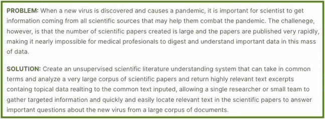

来源:[https://www . ka ggle . com/Allen-institute-for-ai/CORD-19-research-challenge](https://www.kaggle.com/allen-institute-for-ai/CORD-19-research-challenge)

在进一步深入之前，让我们讨论一下 CORD-19 挑战中为研究人员提出的任务。作为这项挑战的一部分，总共有 10 项任务，如下所示:

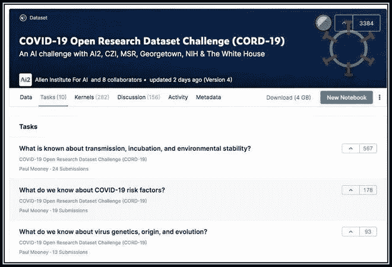

来源:[https://www . ka ggle . com/Allen-institute-for-ai/CORD-19-research-challenge](https://www.kaggle.com/allen-institute-for-ai/CORD-19-research-challenge)

数据集呢？嗯，我们提供了一个 CSV 文件，其中包含大约 29k 篇研究论文的元数据信息，如标题、摘要、论文正文等。除此之外，我们还获得了几个 JSON 文件，其中包含大约 13k 篇研究论文的细节。

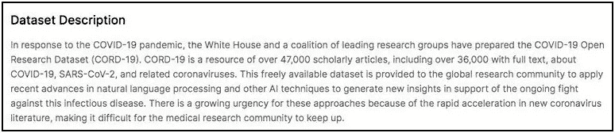

来源:[https://www . ka ggle . com/Allen-institute-for-ai/CORD-19-research-challenge](https://www.kaggle.com/allen-institute-for-ai/CORD-19-research-challenge)

目前，Kaggle 上有超过 600 个公开可用的内核，这些内核是由不同的研究人员发布的。**这篇文章旨在讨论解决这种无监督的 ML 问题的一些最佳技术。**

**注:**术语 ***【查询】*** 与 ***【疑问】*** 互换使用。此外，术语 ***【研究论文】*** 和 ***【研究文章】*** 可以互换使用，指的是同一件事。

# **方法一:**新冠肺炎文献聚类

 [## 新冠肺炎文献聚类

### 使用 Kaggle 笔记本探索和运行机器学习代码|使用来自多个数据源的数据

www.kaggle.com](https://www.kaggle.com/maksimeren/covid-19-literature-clustering) 

当我们进入无监督任务领域时，聚类是我们脑海中出现的明显方法。给定一个查询文章，聚类可以用来创建一个识别相似文章的工具。这个笔记本使用 K-Means 对相似的研究文章进行聚类。除此之外，作者还尝试了各种降维技术，如主成分分析和 t-SNE 来绘制交互图，以更好地了解不同的聚类。

1.  **数据准备:**解析每个 JSON 文件，并从元数据 CSV 文件中追加其元信息(“作者”、“标题”、“期刊”)。最终准备好的数据看起来是这样的-

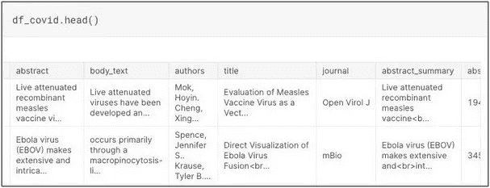

**2。数据预处理:**进行小写转换、去除标点符号等常用文本预处理，并利用文章正文创建特征向量。

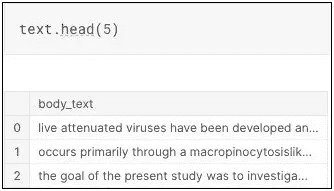

**3。** **特征生成:**生成来自单词的 n 元语法(n=2 ),并使用哈希矢量器来创建特征向量 x。

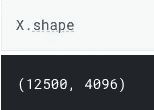

**4。使用 t-SNE 进行降维:**这种高维特征向量被降维为两个特征，以观察数据中是否存在某种模式，t-SNE 能够将相似的实例保存在一起。虽然在下图中观察到几个集群，但是没有标签来区分这些集群。

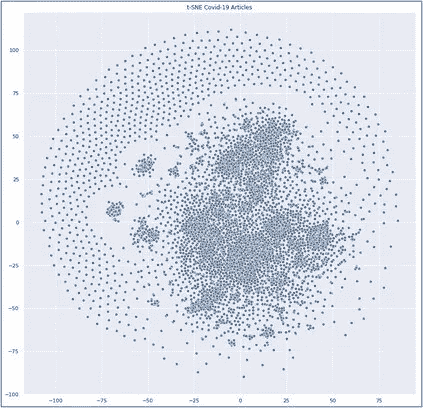

**5。用 K-均值聚类:**聚类的初始值即 K 被选择为 10，并且 K-均值被应用于原始数据(大小为 4096 的特征向量)。现在，可以使用 K-Means 对象的预测功能来获得每个数据点的分类标签。带有聚类标签的图如下所示。从图中可以看出，来自同一个簇的文章彼此靠近。但是仍然存在重叠，可以通过 K 的超参数调整、更好的特征表示等来克服。

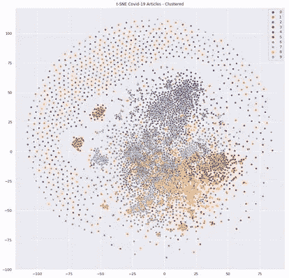

**6。进一步的改进:**首先，使用 tf-idf 来产生更好的特征表示，而不是使用哈希矢量器，然后对其应用 K-Means。然后使用 t-SNE 将维数降低到 2 用于绘图。

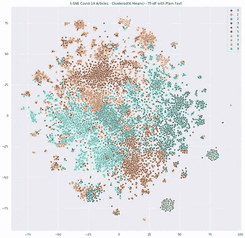

这一次聚类更加清晰可见，这意味着 tf-idf 的特征表现有所改善。作者进一步试验了 PCA 图并将 K 值增加到 20。此外，一个互动的 t-SNE 图显示，这是本笔记本的主要贡献之一。

> **总结:**这款笔记本实验了聚类&降维技术。给定一个查询，可以使用 K-Means 预测函数为其分配一个包含相似文章的聚类标签。主要的挑战将是确定 K 的正确值，并得出良好的特征表示。如果一些先进的技术，如医学领域的 BERT finetuned 可以用于特征表示，我想结果可以是即兴的。除此之外，其他聚类算法，如 DBSCAN，也可以进行实验，它不需要我们初始化聚类数。

# 方法 2:主题建模:查找相关文章

 [## 主题建模:查找相关文章

### 使用 Kaggle 笔记本探索和运行机器学习代码|使用来自多个数据源的数据

www.kaggle.com](https://www.kaggle.com/danielwolffram/topic-modeling-finding-related-articles) 

本笔记本使用 LDA(潜在狄利克雷分配)发现了许多主题。这允许将每篇文章视为这些主题的混合。通过将一篇特定的文章映射到主题空间(每个角落都有一个主题的单纯形)，我们可以找到相关的文章。

*主题=单词分布，文章=主题混合*

1.  **资料准备:**文章正文在整个笔记本中使用。

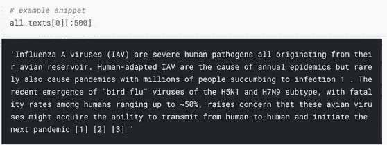

**2。数据预处理:** [scispaCy](https://allenai.github.io/scispacy/) ，这是一个 Python 包，包含用于处理生物医学、科学或临床文本的 [spaCy](https://spacy.io/) 模型。

**3。** **特征生成:**使用 CountVectorizer 将每篇文章表示为一个单词包表示法。

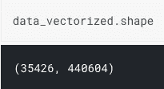

**4。潜在狄利克雷分配:** LDA 用于在矢量化数据表示上生成各种主题，其中主题的数量初始化为 50。几个话题的前 25 个单词显示如下-

现在，每篇文章都表示为主题分布。

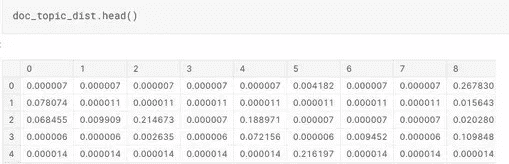

**5。获取最近的论文(在主题空间中):**为了获取与查询文章相似的文章，返回 k 个最近的文章的索引(如通过主题空间中的 Jensen-Shannon 散度)。作为相似性度量，使用 1-Jensen-Shannon 距离。

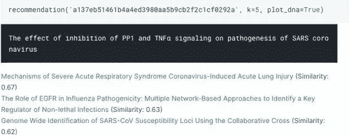

6。浏览任务:现在，一个任务可以映射到主题空间，可以找到相关的文章。

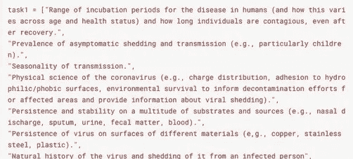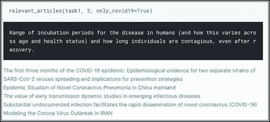

> **总结:**在本笔记中，作者使用了主题建模方法将每篇文章表示为主题空间。主要挑战之一是确定主题的数量。另一个可以尝试的方法是在正文中添加标题或摘要信息。除此之外，其他语义相似度技术也可以用来推荐相似的文章。

# 方法 3: **线索:工具和知识图表**

 [## graphs🛠️ 🛠️工具与知识中心

### 使用 Kaggle 笔记本探索和运行机器学习代码|使用来自多个数据源的数据

www.kaggle.com](https://www.kaggle.com/shahules/cord-tools-and-knowledge-graphs) 

本笔记本探索了各种方法，如主题建模、句子嵌入(使用)、DBSCAN 算法、关键词提取方法以及为相应任务创建知识图。

1.  **数据准备:**本笔记本仅使用元数据 CSV 文件中的可用信息。首先，LDA 被应用于文章的标题以产生 4 个主题。

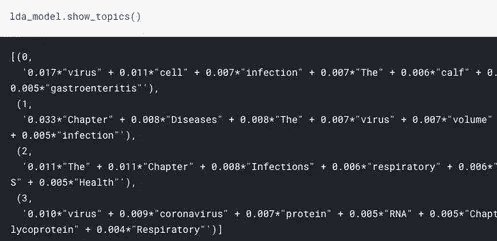

**2。可视化主题:**pyl Davis 库用于可视化每个单词在给定主题中的分布。

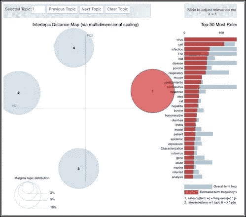

**3。寻找相似的论文:这里使用了两种不同的方法来寻找相似的论文。**

**i)** 然后，给定一个查询，它计算每篇文章之间的余弦相似度，并返回 k 篇最相似的文章。

**ii) DBSCAN:** 通过 spacy doc2vec 方法传递文章的标题，每篇文章由一个句子嵌入来表示。然后，DBSCAN 在这些文章的向量上运行，以生成各种聚类。然后，给定一个查询，它计算聚类标签并返回该聚类中存在的文章。

**4。基于关键字提取的方法:**下面描述的方法用于为给定的查询寻找相关的关键字

*   首先附加所有来源的文章(JSON，CSV，biorxiv)
*   从各种任务中选择一个子任务
*   使用嵌入方法查找相关文章
*   从这些文章中形成一个摘要列表
*   然后做关键词抽取，从这些研究论文中得到重要的关键词。

## 关键词提取

关键词提取是从文本中提取最相关的单词和短语的自动化过程。关键词提取(也称为关键词检测或关键词分析)是一种文本分析技术，包括自动提取文本中最重要的单词和短语。它有助于总结一篇文章的内容，并识别正在讨论的主要话题。

这里使用了两种不同的关键字提取方法:I)使用 Rake ii)使用 PytextRank 库

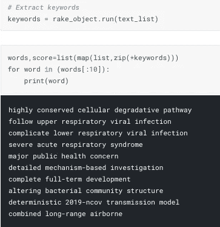

Rake 库使用

**5。知识图:**然后从给定查询中找到的摘要列表构建知识图。创建一个数据框架，它包含这些摘要中的主题、关系和对象，以绘制知识图。

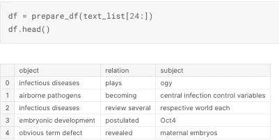

**一步一步的例子-**

*问题:关于传播、潜伏期和环境稳定性，我们知道些什么？*

1.  获取类似文章。

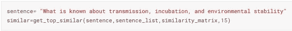

2.准备摘要和标题

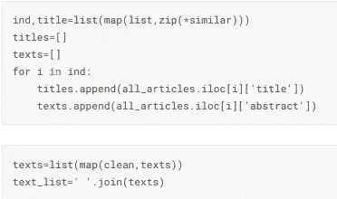

3.找出主语、宾语和关系，并画出 KG。

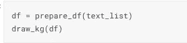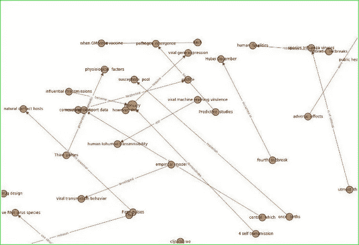

> **总结:**这个笔记本展示了主题模型和知识图表的可视化效果。作者还使用了最先进的句子嵌入技术，如 USE，并计算了相似度。这方面的进一步工作包括如何遍历这个 KG 并从中获取有用的信息。

# 方法 CORD 的问答模型

 [## 👑一个回答所有问题的模型

### 使用 Kaggle 笔记本探索和运行机器学习代码|使用来自多个数据源的数据

www.kaggle.com](https://www.kaggle.com/jonathanbesomi/question-answering-model-for-cord-19-beginner) 

这款笔记本开发了一个通用的问答系统，可以回答(几乎)任何一种与冠状病毒相关的问题。作者还使用 HTML 和 CSS 以更好的方式显示结果。

> **问答(QA)模型:**在机器学习中，一个问答模型由三个源组成:`question`、`context`和`answer`。模型输入为`question`和`context`，模型输出为`answer`。在大多数情况下，但不是所有情况下，`answer`包含在`context`中。

**使用搜索引擎产生上下文:**由于有超过 40k 的论文，需要通过选择所有与`answer`最相似的论文来减小上下文的大小。在代码中，一个非常简单的算法 [Okapi BM25](https://en.wikipedia.org/wiki/Okapi_BM25) 被用于这个目的。

**总体思路:**查询- >搜索引擎- >上下文列表- >针对每个上下文和同一查询- > QA 模型- > span(部分上下文代表答案)

1.  **数据准备:**本笔记本仅使用元数据 CSV 文件中的可用信息。

**2。COVID 搜索引擎:**BM 25 okapi 搜索引擎是在结合了整个研究文章的摘要和标题的数据上创建的。给定一个查询，它计算每篇文章的 bm25 分数，然后返回 k 分数最高的文章。这些文章将作为 QA 模型的上下文。

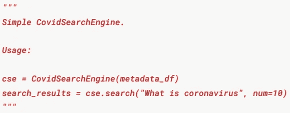

**3。问答模型:** [正在使用 Huggingface transformer 库](https://github.com/huggingface/transformers)来实现 QA 模型。这里使用的是在班数据集上预先训练的用于问题回答的 BERT 模型。从下面的代码片段可以理解整个方法。

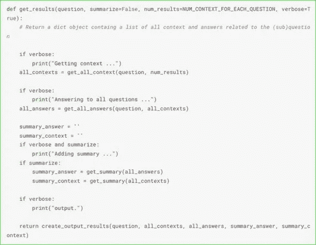

**4。CORD-19 Kaggle 问题:**首先，所有的 CORD-19 任务和各自的问题都存储在一个 dictionary 对象中。然后，迭代这个字典，一个任务的所有问题被一个接一个地传递，并且为那个特定的任务附加答案。

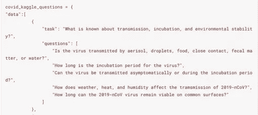

**5。显示问题、上下文和答案:**使用 HTML & CSS 以格式良好的方式显示最终结果。

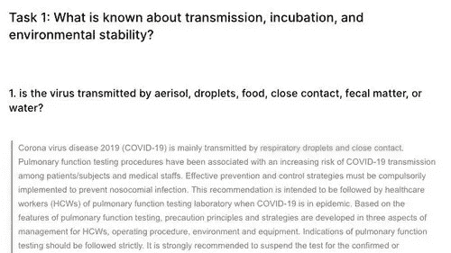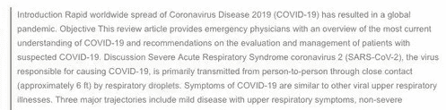

> **总结:**本笔记本采用问答模式处理各自的任务。它还利用 BM25 搜索引擎来减少上下文大小。这里的另一种方法是使用一些先进的基于相似性的方法来查找相似的上下文，而不是依赖于 BM25 搜索引擎。另一件可以做的事情是在医学领域数据集而不是开放领域数据集上预先训练 QA 模型，然后将其用于问答任务。

# 方法 5:语义语料库搜索的 Anserini+BERT-SQuAD

https://www.kaggle.com/dirktheeng/anserini-bert-squad-for-语义语料库搜索

之前的 QA 模型借用了这个笔记本的思想，因此方法非常相似。这个笔记本还使用了开放领域问答和语义搜索引擎的概念来快速地将科学信息减少到最感兴趣的几条记录中。但是，本笔记本提供了一种方法来产生一个“最佳”答案，而不像以前的方法那样根据上下文获得多个答案。除此之外，这里作者还使用[预训练的“BART”模型](https://sshleifer.github.io/blog_v2/jupyter/2020/03/12/bart.html)基于顶部结果生成了一个摘要用于“抽象摘要”。

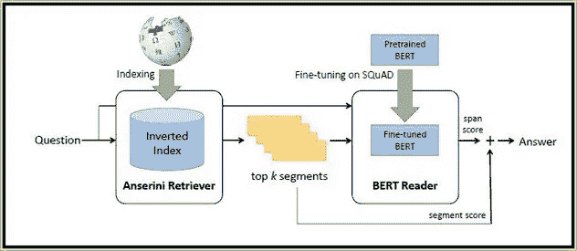

用 BERT-SQuAD 进行语义搜索

Anserini 是一个建立在 Apache Lucene 之上的搜索引擎，它可以搜索文献并返回排名记录。作者没有在维基百科上使用 Anserini，而是使用了已经公开的 CORD-19 Lucene 数据库。

**总体思路:**查询- >搜索引擎- >排名细分- >针对每个细分和相同的查询- > QA 模型- >跨度集- >使用模型相似度矩阵进行跨度排名- >最高得分跨度- > BART 摘要- >抽象总结

**注意**:随着一个给定的查询，需要传递一组关键字来帮助驱动 Anserini 搜索引擎找到最感兴趣的结果。这是有益的，因为搜索的 Anserini 部分不是真正的上下文，不能破译的意思，所以关键字将有助于推动搜索。

**定义比赛的所有问题**

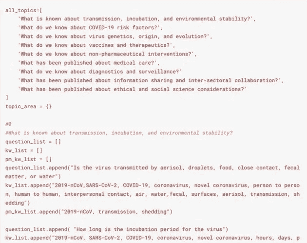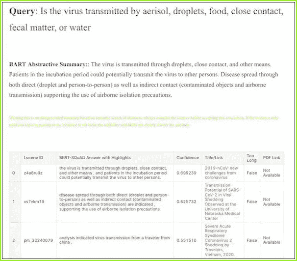

> **总结:**这款笔记本还使用了搜索引擎和 QA 模式来处理各自的任务。作者还设计了一个模型来总结结果，以简单的方式给出答案。同样，这里的另一种方法可以是使用一些先进的基于相似性的方法来找到相似的上下文，而不是依赖于搜索引擎。此外，可以做的另一件事是在医学领域数据集上预先训练 QA 模型，如果可用的话，然后将其用于问答任务

# 方法 6: **带有句子嵌入的 CORD-19 分析**

 [## 具有句子嵌入的 CORD-19 分析

### 使用 Kaggle 笔记本探索和运行机器学习代码|使用来自多个数据源的数据

www.kaggle.com](https://www.kaggle.com/davidmezzetti/cord-19-analysis-with-sentence-embeddings) 

该项目在 CORD-19 数据集上构建了一个索引，以帮助分析和数据发现。对于每个任务问题，都会构建一个亮点部分，其中包含结果摘要以及每篇匹配文章和每篇匹配文章的文本。

1.  **构建一个 SQLite 文章数据库:**原始的 CORD-19 数据存储在一个 metadata.csv 文件和 JSON 文件中，并带有全文。这个项目使用 [SQLite](https://www.sqlite.org/index.html) 来聚集和存储合并的内容。

**2。标签:**此时唯一的标签是新冠肺炎，如果文章文本包含任何建议的正则表达式，文章将使用此标签。只有这样的文章在这个项目中被考虑。

**3。构建嵌入索引:**使用 [FastText](https://fasttext.cc/) + [BM25](https://en.wikipedia.org/wiki/Okapi_BM25) 创建一个嵌入索引。嵌入索引获取每个新冠肺炎标记的、未标记的(不是问题/片段)部分，标记文本，并构建句子嵌入。句子嵌入是句子中每个标记的快速文本向量的 BM25 加权组合。嵌入索引采用这些嵌入的完整语料库，并构建一个 [Faiss](https://github.com/facebookresearch/faiss) 索引来实现相似性搜索。

作者绘制了几个图，如柱状图代表按来源分类的文章、按出版物分类的文章、按研究设计分类的文章等，以便更清晰地分析数据。下面显示了一个这样的图，它代表了所提到的国家的文章:

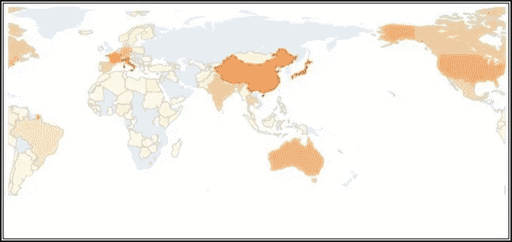

按提到的国家分列的文章

**4。测试模型:**最初，模型为语料库中的每个句子构建嵌入。对于输入查询，它将每个句子与输入查询进行比较。Faiss 使得相似性搜索更快。

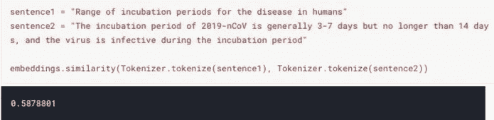

**5。构建任务报告:**任务报告是挑战任务中每个问题的集合。对于每个问题，运行一个查询并返回排名靠前的文章。对于每篇文章，文本匹配显示为带项目符号的点，这些是文章中最匹配的句子。结果句子的完整列表也通过 [textrank 算法](https://en.wikipedia.org/wiki/Automatic_summarization#TextRank_and_LexRank)进行分析和运行。结果中的重点或热门句子也会显示在报告中。

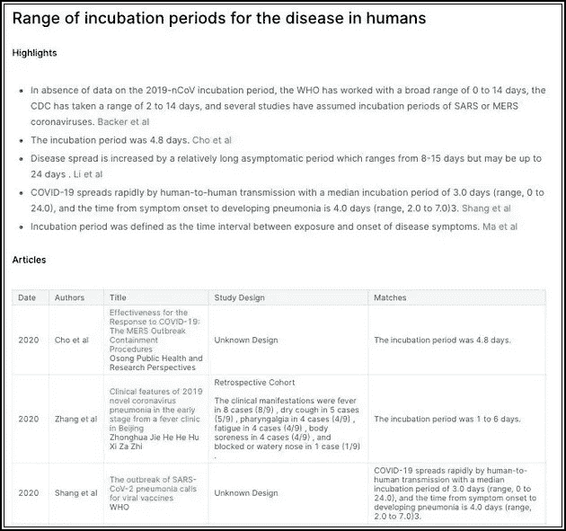

> **总结:**本笔记本尝试使用 FastText + BM25 嵌入组合的相似性搜索来解决给定的任务。此外，文章中具有最大相似性得分的句子显示在高亮部分，该部分充当给定查询的摘要。尽管这种方法看起来更简单，但是各种算法的结合已经产生了相当显著的结果。

# **方法 7:新冠肺炎:BERT + MeSH 使能知识图**

 [## 新冠肺炎:BERT + MeSH 支持的知识图

### 使用 Kaggle 笔记本探索和运行机器学习代码|使用来自多个数据源的数据

www.kaggle.com](https://www.kaggle.com/sandyvarma/covid-19-bert-mesh-enabled-knowledge-graph) 

该模型使用了**知识图与网格本体和 BERT 嵌入**的结合。支持图形的搜索帮助用户基于非常具体的医学术语进行搜索。它还可以扩展到推断不同的文档如何相互关联(基于作者、正文、标题等)。)

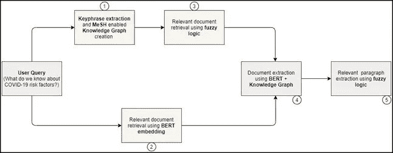

**方法论**

**1 a .从 JSON 文档中提取实体:**从每个 JSON 文档的标题、作者详细信息、摘要、正文和参考文献中提取实体。然后，这些实体被用于创建知识图的三元组。三元组包含 5 种关系。实体通过以下关系映射到其各自的纸张 id:

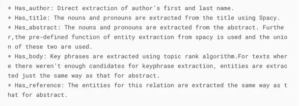

**1 b .使用网格本体的增强的实体提取:**对于三元组中的每个实体，从**网格本体**中提取其前 5 个对应的相似实体。然后，这些实体也包括在三元组中，具有它们相应的关系。这样做是为了增加**知识图**的范围和能力，使得它不仅覆盖文档中存在的术语，还覆盖不存在但可能有帮助的相关实体。

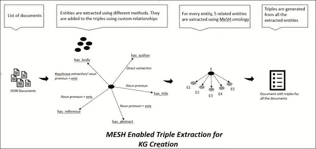

**2。BERT 训练和文件提取:**

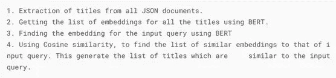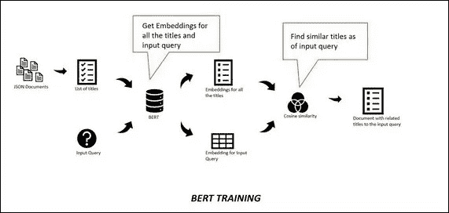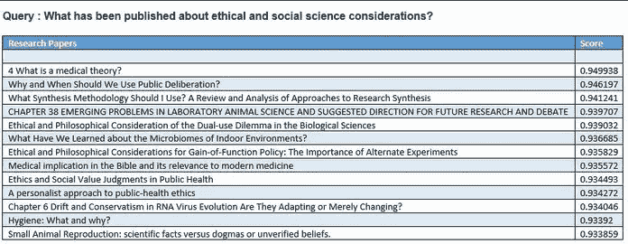

**3 和 4。使用 BERT 和知识图提取结果:**

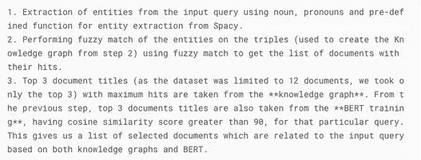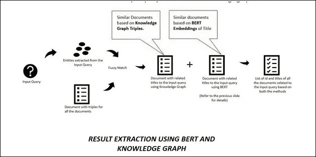

**5。提取文档中相关实体的段落提取**

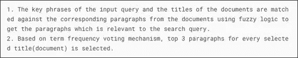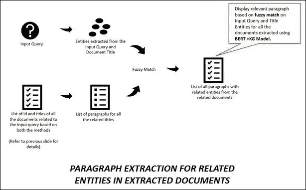

**任务查询结果:**结合使用 **BERT 和**知识图，涵盖了**语义搜索**以及一些**特定关键字搜索**的方面。

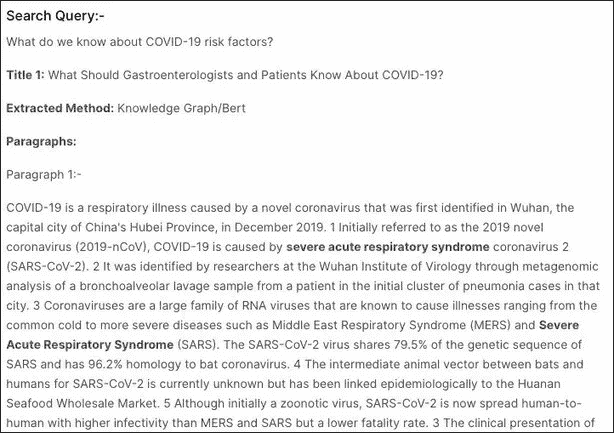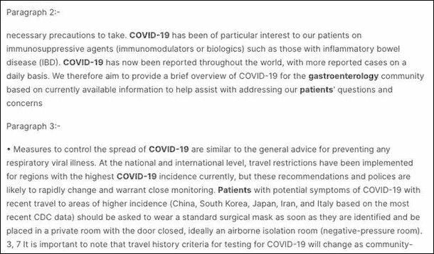

> **总结:**这款笔记本最大的贡献在于，作者提出了一个非常全面的解决方案，使用了多种 ML 技术。作者使用了 SOTA 伯特嵌入，并将其与知识图相结合，进一步提高了其效率。这个笔记本也是最有条理的，所有的方法都以非常系统的顺序呈现。

**结论:**本博客展示了人工智能研究人员在 CORD-19 数据集上完成的一些伟大工作。我试图收集所有不同的方法，通过这些方法可以解决这种无监督的学习任务，并让自己对这一领域有更好的理解。世界各地的数据科学家正试图以他们力所能及的方式做出贡献，我们希望这些工作能为医疗团队带来成果，我们可能很快就能摆脱疫情。

***编者按:*** [*走向数据科学*](http://towardsdatascience.com/) *是一份以数据科学和机器学习研究为主的中型刊物。我们不是健康专家或流行病学家，本文的观点不应被解释为专业建议。想了解更多关于疫情冠状病毒的信息，可以点击* [*这里*](https://www.who.int/emergencies/diseases/novel-coronavirus-2019/situation-reports)