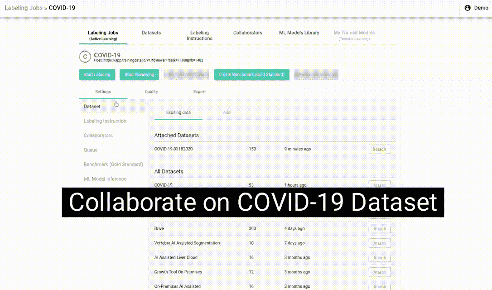
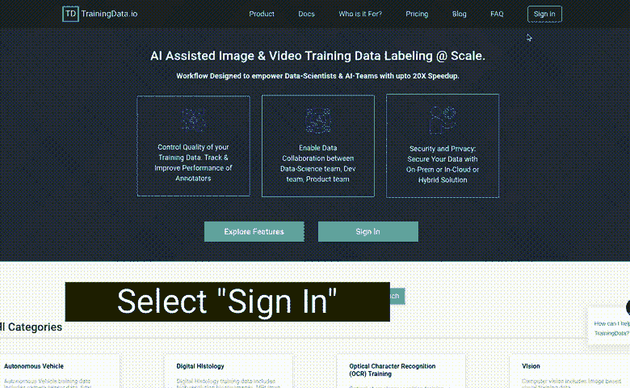

# 用于注释和协作的新冠肺炎放射数据集(胸部 x 光和 CT)(第 1 部分)

> 原文：<https://towardsdatascience.com/covid-19-imaging-dataset-chest-xray-ct-for-annotation-collaboration-5f6e076f5f22?source=collection_archive---------7----------------------->

## 迫切需要诊断工具来识别新冠肺炎。在疫情爆发的最初阶段，包括美国在内的所有国家都面临一个主要问题——缺乏诊断工具和适当的检测。为了能够构建诊断工具，数据科学家正在争先恐后地获取任何可用的少量数据。

鉴于对抗新冠肺炎疫情需要诊断工具，TrainingData.io 正在提供一个预先加载了开源数据集的免费协作工作空间。这个协作工作区允许数据科学家和放射学家共享训练数据的注释，这些数据用于训练新冠肺炎的机器学习模型。此数据集植入了以下数据集:

*   [GitHub covid-chestx ray-dataset](https://github.com/ieee8023/covid-chestxray-dataset)(150 个 CT+x 射线病例)
*   [GitHub UCSD-AI4H/COVID-CT](https://github.com/UCSD-AI4H/COVID-CT)(169 例 CT，288 幅图像)
*   SIIM.org[(60 例 CT)](https://www.sirm.org/en/)

任何人都可以通过点击这个[链接](https://app.trainingdata.io/v1/td/login)来创建和下载注释

机器学习的新冠肺炎训练数据

**用于研究的开源数据集:**我们邀请医院、诊所、研究人员、放射科医生上传更多去识别成像数据，尤其是 CT 扫描。目的是从受影响最严重的地方，如韩国、新加坡、意大利、法国、西班牙和美国，获得不同的数据集。这种对开源社区的贡献将帮助独立研究人员更快地构建诊断工具。**本案涉及的产品使用将完全免费。我们的目的是在遵守所有许可法的同时，帮助全球抗击新冠肺炎病毒。**

**如何创建和下载新冠肺炎数据集的注记？**

从这里开始:[https://app.trainingdata.io/v1/td/login](https://app.trainingdata.io/v1/td/login)

https://www.trainingdata.io

**使用 NVIDIA Clara train SDK 构建 ML 模型:**training data . io 的团队拥有在 NVIDIA Clara 上使用 U-Net 构建细分模型的专业知识。我们愿意为社区提供构建开源模型的服务。这是一个在 NVIDIA Clara train SDK 中使用 2D U-Net 模型检测椎体的样本模型。

NVIDIA Clara 中使用 U-Net 检测椎体的样本分割模型

**联系人:**更多信息请联系我们: [info@trainingdata.io](mailto:info@trainingdata.io)

**当前状态:**工作区有来自 319 个不同患者的 429 个不同图像，369 个 ct 图像，60 个 x 光图像。

**如何下载数据集？:**只能从 TrainingData.io 下载由 community 创建的注释(遮罩)，数据集的原始图像不能从我们的网站下载。要下载原始图像，请访问各自的来源。

**成本:**不考虑免费使用的限制，使用我们的产品在这个新冠肺炎数据集上工作将是零成本。

本系列第二部分: [**使用 NVIDIA Clara on TrainingData 自动检测胸部 CT 中的新冠肺炎感染. io**](/annotate-data-train-ai-for-covid-19-detection-in-chest-ct-using-nvidia-clara-on-trainingdata-io-e25df2bfd0aa)