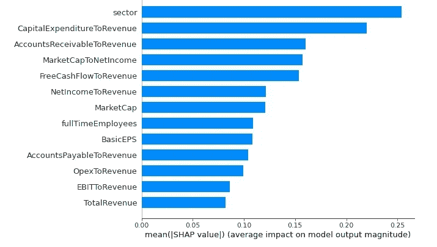
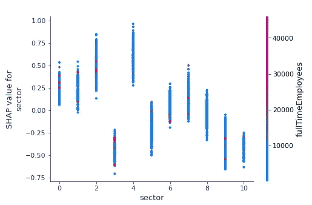
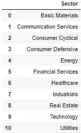
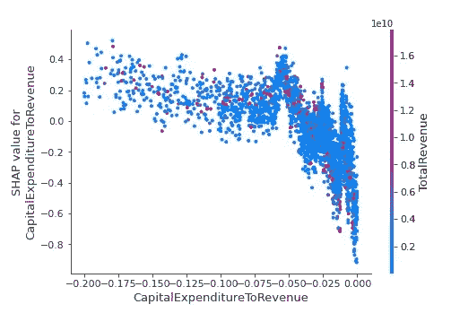
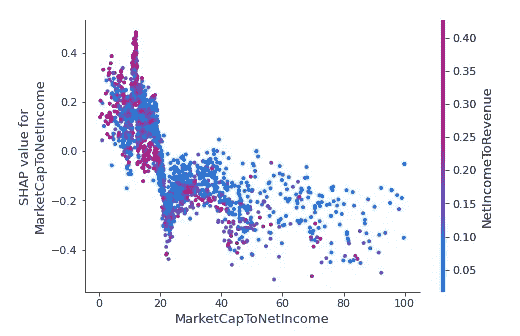
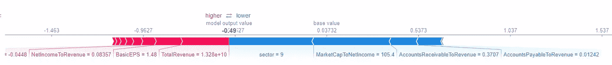
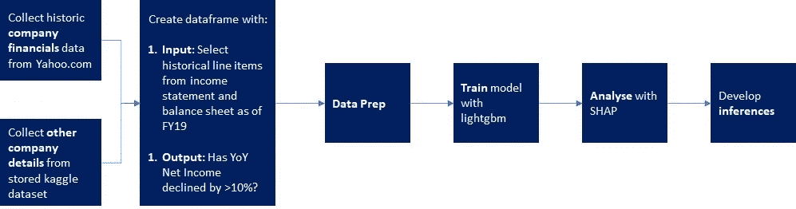
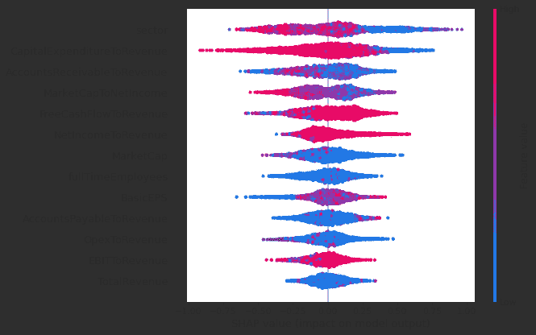

# 使用机器学习分析新冠肺炎对公司收益的影响

> 原文：<https://towardsdatascience.com/covid-19-impact-on-nasdaq-earnings-through-an-ai-lens-97f13ad60af7?source=collection_archive---------37----------------------->

图片由 Unsplash 的 Bud Helisson 提供

> “我们选择的镜头改变了我们看待事物的方式”——德威特·琼斯

***注来自《走向数据科学》的编辑:*** *虽然我们允许独立作者根据我们的* [*规则和指导方针*](/questions-96667b06af5) *发表文章，但我们不认可每个作者的贡献。你不应该在没有寻求专业建议的情况下依赖一个作者的作品。详见我们的* [*读者术语*](/readers-terms-b5d780a700a4) *。*

数据可用性的增加，更高的计算能力，以及易于实现的人工智能框架的可用性，开启了从大衰退到现在的人工智能复兴时代。这让我们有能力以 2008 年无法做到的方式分析新冠肺炎后的[衰退。](https://en.wikipedia.org/wiki/COVID-19_recession)

本文通过研究新冠肺炎事件后公司收益的变化来研究新冠肺炎事件的影响。具体来说，它使用机器学习来预测纳斯达克上市公司 2010 财年第二季度收益同比下降超过 10%背后的关键因素。

本文使用来自财务报表分析和机器学习的概念来获得见解。我首先介绍我的方法和发现，然后深入研究建模。这更像是一个分析的框架，而不是一项获得具体见解的研究。喝杯咖啡，坐下来享受吧！

# **内容**

1.  摘要
2.  关键驱动因素+精选深度挖掘
3.  公司建模示例:Salesforce
4.  模拟深潜
5.  进一步的背景阅读
6.  总结想法

# **1。总结**

我比较了 2010 财年第二季度和 2019 财年第二季度的公司财务报表数据，以了解从 2019 财年第二季度到 2010 财年第二季度，净收入是否下降了 10%以上，这可能是由新冠肺炎造成的。我开发了一个基于 [lightgbm](https://github.com/microsoft/LightGBM) 的机器学习模型，用包括 2019 财年财务在内的几个输入来预测产出(>净收入下降 10%)。

机器学习模型提供了对宏观和微观趋势进行建模的能力，这是一种识别关键影响维度的强大工具。它还可以用来分析哪些因素对公司收益下降的影响最大

该模型使用 yahooquery 从雅虎财经获取数据，并使用 T2 SHAP 对 ML 模型进行分析。除了提供 ML + SHAP 分析的发现外，我还尽可能对结果提供直观的解释。

# **2。**关键驱动因素+精选深度挖掘

K

*2010 财年第二季度和 2020 财年 Q2 净收入下降 10%的主要预测指标。*图片作者。

S **行业深潜:**行业对收益下降有很大影响。下图(Y 轴表示新冠肺炎影响，X 轴表示行业)中，分析的公司是单独的数据点，有力地说明了**能源和消费周期是受影响最大的行业，而消费防御、技术和公用事业是受影响最小的行业。**

*行业(和全职员工)对>2019 财年第二季度至 2020 财年 Q2 净收入下降 10%的影响。*图片作者。

直觉:新冠肺炎导致能源公司需求方面的冲击(简单地说，加油的人少了)导致收入减少，因此石油公司出现亏损。在消费品公司中，防御性消费品公司(销售主食和日常用品的公司)保持不变，因为对其产品的需求相对缺乏弹性，而周期性消费品公司(销售冲动和便利商品的公司)的收益大幅下降。需求的无弹性也解释了对公用事业公司的低影响。由于 WFH 的增加，数字化的加速推进等，科技也相对未受影响。

**附加观察:**观察 3 区(消费者防御)塔顶的一组红点——这可能是可口可乐、百事可乐等公司的影响。大量全职员工表示[Q2 季度质量下降](https://www.pymnts.com/earnings/2020/coke-and-pepsi-serve-up-new-strategies-for-a-post-covid-world/)

C 点的颜色=关键次要因素的影响程度，即总收入)。

*资本支出对收入比率(和总收入)的影响>2019 财年第二季度和 2020 财年 Q2 净收入下降 10%。*图片作者。

直觉:新冠肺炎抑制了财政收入。公司本可以迅速采取行动在一定程度上控制运营支出，但是，前几年较高的资本支出(在以后几年创造潜在收入的成本)将意味着较高的损益折旧和较低的净收入。此外，观察顶部的红点，可以推断出具有较大绝对资本支出(不仅仅是资本支出与收入的比率)的公司受影响最大。

P **/E 比率深度挖掘:**收益下降> 10%的可能性较高的公司，其 P/E(市盈率，也就是市值与净收入的比率)比其他公司低。

*市值与净收入比率对>2019 财年第二季度至 2020 财年 Q2 净收入下降 10%的影响。*图片作者。

**直觉:**市场先生永远是对的。股票的弹性反映在其价格溢价中，即收益质量较高的公司(包括在不利的市场条件下保持不变的潜力)将比质量较低的公司定价更高。从收益角度来看，市场认为更好的股票平均来说更好地经受住了新冠肺炎风暴。

# **3。公司建模示例:Salesforce**

Salesforce 有了一个[精彩的 Q2FY20](https://investor.salesforce.com/press-releases/press-release-details/2020/Salesforce-Announces-Strong-Second-Quarter-Fiscal-2021-Results/default.aspx) 。净收入从 9100 万美元增长至 26 亿美元。该模型正确预测这是一只收益下降> 10%概率非常小的股票。它进一步给出了关键的积极贡献因素及其影响的大小——事实上，这只具有高市盈率的科技股从总收入范围等维度做出了显著的积极贡献(蓝色)远远超过了消极贡献(红色)。

Salesforce 的公司影响建模结果。图片作者。

# 4.模拟深潜

(如果你对细节不太感兴趣，可以跳过这一部分)

我的模特工作流程。图片作者。

*   我选择特征/输入时谨记两个关键原则:(1)包括具有高水平数据可用性的字段(较少 NaNs 等)。)和
    (2)避免多重共线性:例如，毛利=收入— COGS，因此不能选择所有三个，只选择最多两个等。
*   该模型的 AUC(模型质量的量度)为> . 65
*   如果你想看的话，我的作品在的 [Kaggle 上。任何反馈都非常受欢迎。](https://www.kaggle.com/robinjon/covid19-impact-on-earnings)[我的 Kaggle 笔记本](https://www.kaggle.com/robinjon/covid19-impact-on-earnings)也有一些更有潜在意义的快照，可以用来产生更多的见解。

# 5.进一步的背景阅读

**关于财务报表分析…**

这个 [Investopedia](https://www.investopedia.com/terms/f/financial-statement-analysis.asp) 链接是财务报表分析 101 的良好起点。如果你想对财务报表中的关键术语有一个完整的解释，美世资本的这个资源是个不错的选择。

**关于机器学习…**

从商业角度来看，麦肯锡的这个页面是我见过的最好的资源之一。如果你想更专业一点，杰森·梅耶斯的精彩幻灯片非常适合你。

# **6。结论性想法**

我们研究了一个分析新冠肺炎对公司收益影响的框架。我们深入研究了行业、资本支出和市盈率如何影响收益下降。下面使用 SHAP 的可视化很好地总结了我们的分析。

*2010 财年第二季度和 2020 财年第二季度之间>净收入下降 10%的关键预测指标的更精细视图，包括方向性影响。*图片作者。

可以利用该框架来分析宏观收益趋势，如上面的深入分析，或者执行微观分析，如上面的 Salesforce 示例。这种分析从更深的角度揭示了新冠肺炎危机对经济的影响。

**后记**:

1.  对于金融类股，我在 9 月中旬左右从雅虎财经(Yahoo Finance)获取了数据快照。根据拍摄数据的时间，结果可能会有所不同。
2.  这不是一个投资假设，也不应被视为投资建议。
3.  本文表达的观点是我的个人观点。我们随时欢迎您的反馈。

**学分**:

斯科特·伦德伯格负责精彩的 SHAP 框架【https://shap.readthedocs.io/en/latest/T2
道格·格思里负责 yahooquery 我用来收集数据[https://pypi.org/project/yahooquery/](https://pypi.org/project/yahooquery/)