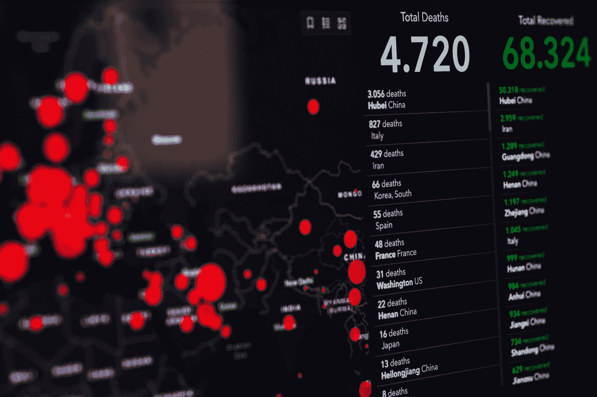
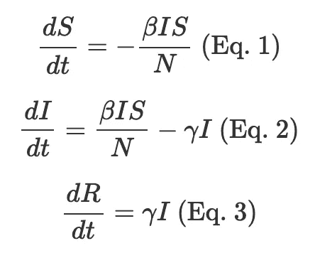
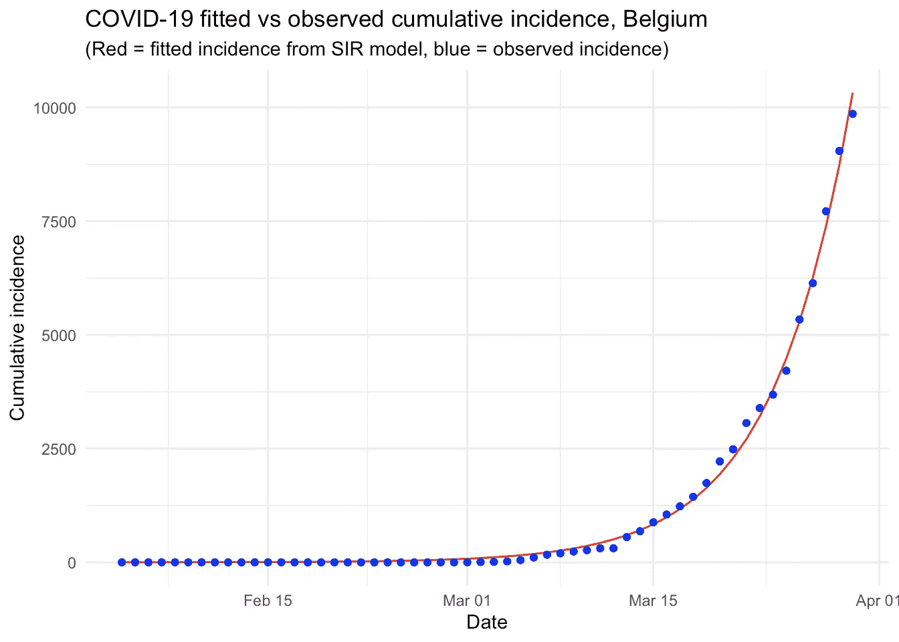
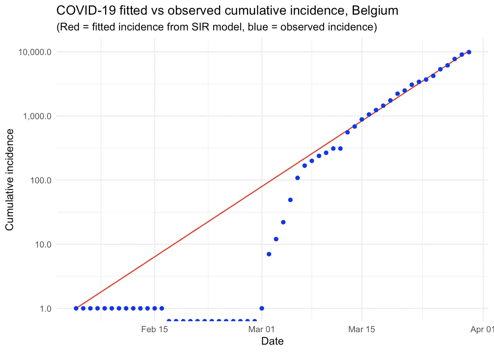

# 比利时的新冠肺炎

> 原文：<https://towardsdatascience.com/covid-19-in-belgium-efa0db9f6075?source=collection_archive---------26----------------------->

## 应用 R 分析比利时新型新冠肺炎冠状病毒



马库斯·斯皮斯克拍摄的照片

# 介绍

新型新冠肺炎冠状病毒仍在几个国家快速传播，而且似乎不会很快停止，因为许多国家尚未达到高峰。

自其开始扩张以来，世界各地的大量科学家一直在从不同的角度和使用不同的技术分析这种冠状病毒，希望找到一种治疗方法，以阻止其扩张并限制其对公民的影响。

# 冠状病毒的顶级资源

与此同时，流行病学家、统计学家和数据科学家正在努力更好地了解病毒的传播，以帮助政府和卫生机构做出最佳决策。这导致了大量关于该病毒的在线资源的发布，我收集并整理了一篇文章，涵盖了[关于冠状病毒](https://www.statsandr.com/blog/top-r-resources-on-covid-19-coronavirus/)的顶级资源。本文收集了我有机会发现的最好的资源，并对每个资源进行了简要总结。它包括闪亮的应用程序、仪表盘、R 包、博客帖子和数据集。

发布这个集合导致许多读者提交他们的作品，这使得文章更加完整，对任何有兴趣从定量角度分析病毒的人来说更有见地。感谢每一个贡献和帮助我收集和总结这些关于新冠肺炎的资源的人！

鉴于我的专业领域，我无法从医学角度帮助对抗病毒。然而，我仍然想尽我所能做出贡献。从更好地了解这种疾病到将科学家和医生聚集在一起，建立更大、更有影响力的东西，我真诚地希望这个收藏能在一定程度上帮助抗击疫情。

# 你自己国家的冠状病毒仪表板

除了收到来自世界各地的分析、博客帖子、R 代码和闪亮的应用程序，我意识到许多人都在试图为自己的国家创建一个跟踪冠状病毒传播的仪表板。因此，除了收集顶级 R 资源之外，我还发表了一篇文章，详细介绍了创建特定于某个国家的仪表板的步骤。在这篇[文章](https://www.statsandr.com/blog/how-to-create-a-simple-coronavirus-dashboard-specific-to-your-country-in-r)和一个关于比利时的[示例中，查看如何创建这样的仪表板。](https://www.antoinesoetewey.com/files/coronavirus-dashboard.html)

该代码已在 GitHub 上发布，并且是开源的，因此每个人都可以复制它并根据自己的国家进行调整。仪表板有意保持简单，这样任何对 R 有最低限度了解的人都可以很容易地复制它，高级用户可以根据他们的需要增强它。

# 文章的动机、限制和结构

通过查看和整理许多关于新冠肺炎的 [R 资源，我有幸阅读了许多关于疾病爆发、不同卫生措施的影响、病例数量预测、疫情长度预测、医院能力等的精彩分析。](https://www.statsandr.com/blog/top-r-resources-on-covid-19-coronavirus/)

此外，我必须承认，一些国家，如中国、韩国、意大利、西班牙、英国和德国受到了很多关注，正如对这些国家所做的分析数量所示。然而，据我所知，在本文发表之日，我不知道有任何针对比利时冠状病毒传播的分析。本文旨在填补这一空白。

在我的统计学博士论文中，我的主要研究兴趣是应用于癌症患者的生存分析(更多信息在我的[个人网站](https://www.antoinesoetewey.com/research/)的研究部分)。我不是流行病学家，也不具备通过流行病学模型模拟疾病爆发的广博知识。

我通常只写我认为自己熟悉的东西，主要是[统计学](https://www.statsandr.com/tags/statistics/)及其在 [R](https://www.statsandr.com/tags/r/) 的应用。在写这篇文章的时候，我很好奇比利时在这种病毒传播方面的立场，我想在 R(对我来说是新的)中研究这种数据，看看会有什么结果。

为了满足我的好奇心，虽然我不是专家，但在这篇文章中，我将复制更多知识渊博的人所做的分析，并将它们应用于我的国家，即比利时。从我到目前为止读到的所有分析中，我决定重复 Tim Churches 和 Holger K. von Jouanne-Diedrich 教授所做的分析。这篇文章是根据他们的文章组合而成的，在这里可以找到[这里](https://timchurches.github.io/blog/posts/2020-02-18-analysing-covid-19-2019-ncov-outbreak-data-with-r-part-1/)和[这里](https://blog.ephorie.de/epidemiology-how-contagious-is-novel-coronavirus-2019-ncov)。他们都对如何模拟冠状病毒的爆发进行了非常翔实的分析，并显示了它的传染性。他们的文章也让我了解了这个话题，尤其是最常见的流行病学模型。我强烈建议感兴趣的读者也阅读他们的[最近的文章](https://www.statsandr.com/blog/top-r-resources-on-covid-19-coronavirus/#analyzing-covid-19-outbreak-data-with-r)，以获得更深入的分析和对新冠肺炎疫情传播的更深入的理解。

其他更复杂的分析也是可能的，甚至是更好的，但是我把这个留给这个领域的专家。还要注意，下面的分析只考虑了截至本文发表之日的数据，因此默认情况下，这些结果不应被视为当前的发现。

在文章的剩余部分，我们首先介绍将用于分析比利时冠状病毒爆发的模型。我们还简要讨论并展示了如何计算一个重要的流行病学措施，繁殖数。然后，我们使用我们的模型来分析在没有公共卫生干预的情况下疾病的爆发。最后，我们总结了更先进的工具和技术，可以用来进一步模拟比利时的新冠肺炎。

# 比利时冠状病毒分析

# 经典的流行病学模型:SIR 模型

在深入实际应用之前，我们首先介绍将要使用的模型。

有许多流行病学模型，但我们将使用最常见的一个，即***先生模型****。*先生*模型可以被复杂化，以纳入病毒爆发的更多特性，但在本文中，我们保持其最简单的版本。Tim Churches 对这个模型的解释以及如何使用 R 来拟合它是如此的好，我将在这里复制它，并做一些小的修改。*

*传染病爆发的爵士模型背后的基本思想是，有三组(也称为区间)个体:*

*   **S* :健康但易患病者(即有被污染的风险)。在疫情开始的时候， *S* 是整个种群，因为没有人对病毒免疫。*
*   **我*:有传染性的(因此，被感染的)人*
*   **R* :已经康复的个人，即曾经受到污染但已经康复或死亡的人。它们不再具有传染性。*

*随着病毒在人群中的传播，这些群体会随着时间而演变:*

*   **S* 减少当个体被污染并转移到传染组 *I**
*   *随着人们康复或死亡，他们从受感染的群体进入康复的群体*

*为了对疫情的动态进行建模，我们需要三个微分方程来描述每组的变化率，参数如下:*

*   *β，感染率，它控制着 *S* 和 *I* 之间的转换*
*   *γ，去除率或回收率，其控制在 *I* 和 *R* 之间的转换*

*形式上，这给出了:*

**

*第一个等式(等式。1)声明易感个体的数量( *S* )随着新感染个体的数量而减少，其中新感染病例是感染率(β)乘以与感染个体( *S* )有过接触的易感个体数量( *I* )的结果。*

*第二个等式(等式。2)说明感染个体数( *I* )随着新感染个体数(βIS)的增加而增加，减去之前感染的已痊愈者(即γI，即去除率γ乘以感染个体数 *I* )。*

*最后，最后一个等式(Eq。3)说明恢复的组随着具有传染性并且恢复或死亡的个体数量的增加而增加(γI)。*

*流行病的发展过程如下:*

1.  *在疾病爆发前，S 等于整个人口，因为没有人有抗体。*
2.  *在疫情开始时，一旦第一个人被感染， *S* 减 1， *I* 也增加 1。*
3.  *这个第一个被感染的个体会感染(在恢复或死亡之前)其他易感的个体。*
4.  *这种动态还在继续，最近被感染的人在康复之前又会感染其他易感人群。*

*视觉上，我们有:*

**

*SIR 模型。来源:凯佐佐木。*

*在将 *SIR* 模型拟合到数据之前，第一步是将这些微分方程表示为相对于时间 *t* 的 R 函数。*

```
*SIR <- function(time, state, parameters) {
  par <- as.list(c(state, parameters))
  with(par, {
    dS <- -beta * I * S / N
    dI <- beta * I * S / N - gamma * I
    dR <- gamma * I
    list(c(dS, dI, dR))
  })
}*
```

# *用 SIR 模型拟合比利时数据*

*为了使模型符合数据，我们需要两样东西:*

1.  *这些微分方程的解算器*
2.  *为我们的两个未知参数β和γ寻找最佳值的优化器*

*来自`{deSolve}` R 包的函数`ode()`(针对常微分方程)使得求解方程组变得容易，并且为了找到我们希望估计的参数的最佳值，我们可以使用 base R 中内置的`optim()`函数*

*具体来说，我们需要做的是最小化 *I(t)* 之间的平方差之和，这是在时间 *t* 时感染室 *I* 中的人数，以及我们的模型预测的相应病例数。这个量被称为残差平方和( *RSS* ):*

**

*为了拟合比利时发病率数据的模型，我们需要一个初始未感染人群的数值 *N* 。据[维基百科](https://en.wikipedia.org/wiki/Belgium)统计，2019 年 11 月比利时人口为 11515793 人。因此，我们将使用 *N = 11515793* 作为初始未感染人群。*

*接下来，我们需要用比利时从 2 月 4 日(我们的每日发病率数据开始时)到 3 月 30 日(本文发布时的最后可用日期)的每日累积发病率创建一个向量。然后，我们将把根据这些数据拟合的 SIR 模型预测的发病率与 2 月 4 日以来的实际发病率进行比较。我们还需要初始化 *N* 、 *S* 、 *I* 和 *R* 的值。请注意，比利时的每日累积发病率摘自 Rami Krispin 开发的`[{coronavirus}](https://www.statsandr.com/blog/top-r-resources-on-covid-19-coronavirus/#coronavirus)` [R 包](https://www.statsandr.com/blog/top-r-resources-on-covid-19-coronavirus/#coronavirus)。*

```
*# devtools::install_github("RamiKrispin/coronavirus")
library(coronavirus)
data(coronavirus)`%>%` <- magrittr::`%>%`# extract the cumulative incidence
df <- coronavirus %>%
  dplyr::filter(country == "Belgium") %>%
  dplyr::group_by(date, type) %>%
  dplyr::summarise(total = sum(cases, na.rm = TRUE)) %>%
  tidyr::pivot_wider(
    names_from = type,
    values_from = total
  ) %>%
  dplyr::arrange(date) %>%
  dplyr::ungroup() %>%
  dplyr::mutate(active = confirmed - death - recovered) %>%
  dplyr::mutate(
    confirmed_cum = cumsum(confirmed),
    death_cum = cumsum(death),
    recovered_cum = cumsum(recovered),
    active_cum = cumsum(active)
  )# put the daily cumulative incidence numbers for Belgium from
# Feb 4 to March 30 into a vector called Infected
library(lubridate)
Infected <- subset(df, date >= ymd("2020-02-04") & date <= ymd("2020-03-30"))$active_cum# Create an incrementing Day vector the same length as our
# cases vector
Day <- 1:(length(Infected))# now specify initial values for N, S, I and R
N <- 11515793
init <- c(
  S = N - Infected[1],
  I = Infected[1],
  R = 0
)*
```

**注意，需要的是当前感染人数(累计感染人数减去移除人数，即痊愈或死亡人数)。然而，被找回的人数很难获得，并且可能由于漏报偏差而被低估。我因此考虑了* ***累计*** *感染人数，这在这里可能不是一个问题，因为在分析时恢复的病例数可以忽略不计。**

*然后我们需要定义一个函数来计算 *RSS* ，给定一组β和γ的值。*

```
*# define a function to calculate the residual sum of squares
# (RSS), passing in parameters beta and gamma that are to be
# optimised for the best fit to the incidence data
RSS <- function(parameters) {
  names(parameters) <- c("beta", "gamma")
  out <- ode(y = init, times = Day, func = SIR, parms = parameters)
  fit <- out[, 3]
  sum((Infected - fit)^2)
}*
```

*最后，我们可以找到β和γ的值，使观察到的累积发病率(在比利时观察到的)和预测的累积发病率(通过我们的模型预测的)之间的残差平方和最小，从而使 *SIR* 模型符合我们的数据。我们还需要检查我们的模型是否已经收敛，如下面显示的消息所示:*

```
*# now find the values of beta and gamma that give the
# smallest RSS, which represents the best fit to the data.
# Start with values of 0.5 for each, and constrain them to
# the interval 0 to 1.0# install.packages("deSolve")
library(deSolve)Opt <- optim(c(0.5, 0.5),
  RSS,
  method = "L-BFGS-B",
  lower = c(0, 0),
  upper = c(1, 1)
)# check for convergence
Opt$message## [1] "CONVERGENCE: REL_REDUCTION_OF_F <= FACTR*EPSMCH"*
```

*确认收敛。请注意，对于初始值或约束条件的不同选择，您可能会发现不同的估计值。这证明拟合过程是不稳定的。这里有一个潜在的[解决方案](http://blog.ephorie.de/contagiousness-of-covid-19-part-i-improvements-of-mathematical-fitting-guest-post)用于更好的装配过程。*

*现在我们可以检查β和γ的拟合值:*

```
*Opt_par <- setNames(Opt$par, c("beta", "gamma"))
Opt_par##      beta     gamma 
## 0.5841185 0.4158816*
```

*记住，β控制着 *S* 和 *I* 之间的转换(即易感和传染)，γ控制着 *I* 和 *R* 之间的转换(即传染和痊愈)。然而，这些值并不意味着很多，但我们使用它们来获得我们的 *SIR* 模型的每个隔间中截至 3 月 30 日用于拟合模型的拟合人数，并将这些拟合值与观察到的(真实)数据进行比较。*

```
*sir_start_date <- "2020-02-04"# time in days for predictions
t <- 1:as.integer(ymd("2020-03-31") - ymd(sir_start_date))# get the fitted values from our SIR model
fitted_cumulative_incidence <- data.frame(ode(
  y = init, times = t,
  func = SIR, parms = Opt_par
))# add a Date column and the observed incidence data
library(dplyr)
fitted_cumulative_incidence <- fitted_cumulative_incidence %>%
  mutate(
    Date = ymd(sir_start_date) + days(t - 1),
    Country = "Belgium",
    cumulative_incident_cases = Infected
  )# plot the data
library(ggplot2)
fitted_cumulative_incidence %>%
  ggplot(aes(x = Date)) +
  geom_line(aes(y = I), colour = "red") +
  geom_point(aes(y = cumulative_incident_cases), colour = "blue") +
  labs(
    y = "Cumulative incidence",
    title = "COVID-19 fitted vs observed cumulative incidence, Belgium",
    subtitle = "(Red = fitted incidence from SIR model, blue = observed incidence)"
  ) +
  theme_minimal()*
```

**

*从上图中我们可以看到，不幸的是，观察到的确诊病例数遵循了我们的模型所预期的确诊病例数。这两种趋势重叠的事实表明，疫情在比利时明显处于指数增长阶段。需要更多的数据来观察这一趋势是否会在长期内得到证实。*

*下图与上图相似，除了 *y* 轴是在对数标尺上测量的。这种图被称为半对数图，或者更准确地说是对数线性图，因为只有 y 轴以对数标度进行变换。转换对数标度的优势在于，就观察到的和预期的确诊病例数之间的差异而言，它更容易阅读，并且它还显示了观察到的确诊病例数如何不同于指数趋势。*

```
*fitted_cumulative_incidence %>%
  ggplot(aes(x = Date)) +
  geom_line(aes(y = I), colour = "red") +
  geom_point(aes(y = cumulative_incident_cases), colour = "blue") +
  labs(
    y = "Cumulative incidence",
    title = "COVID-19 fitted vs observed cumulative incidence, Belgium",
    subtitle = "(Red = fitted incidence from SIR model, blue = observed incidence)"
  ) +
  theme_minimal() +
  scale_y_log10(labels = scales::comma)*
```

**

*该图表明，在疫情开始时至 3 月 12 日，确诊病例数低于指数阶段的预期值。特别是，从 2 月 4 日至 2 月 29 日，确诊病例数保持不变，为 1 例。从 3 月 13 日到 3 月 30 日，确诊病例数量以接近指数的速度持续增加。*

*我们还注意到 3 月 12 日和 3 月 13 日之间有一个小的跳跃，这可能表明数据收集中的错误，或者测试/筛选方法的变化。*

# *再现数 R0*

*我们的 *SIR* 模型看起来与在比利时观察到的累积发病率数据非常吻合，因此我们现在可以使用我们的拟合模型来计算基本生殖数 R0，也称为基本生殖率，它与β和γ密切相关。 [2](https://www.statsandr.com/blog/covid-19-in-belgium/#fn2)*

*繁殖数给出了每个感染者感染的平均易感人数。换句话说，繁殖数指的是每一个患病人数中被感染的健康人数。当 R0 > 1 时，疾病开始在人群中传播，但如果 R0 < 1\. Usually, the larger the value of R0, the harder it is to control the epidemic and the higher the probability of a pandemic.*

*Formally, we have:*

**

*We can compute it in R:*

```
*Opt_par##      beta     gamma 
## 0.5841185 0.4158816R0 <- as.numeric(Opt_par[1] / Opt_par[2])
R0## [1] 1.404531*
```

*An R0 of 1.4 is below values found by others for COVID-19 and the R0 for SARS and MERS, which are similar diseases also caused by coronavirus. Furthermore, in the literature, it has been estimated that the reproduction number for COVID-19 is approximately 2.7 (with β close to 0.54 and γ close to 0.2). Our reproduction number being lower is mainly due to the fact that the number of confirmed cases stayed constant and equal to 1 at the beginning of the pandemic.*

*A R0 of 1.4 means that, on average in Belgium, 1.4 persons are infected for each infected person.*

*For simple models, the proportion of the population that needs to be effectively immunized to prevent sustained spread of the disease, known as the “herd immunity threshold”, has to be larger than 1−1/R0 (Fine, Eames, and Heymann 2011).*

*The reproduction number of 1.4 we just calculated suggests that, given the formula 1-(1 / 1.4), 28.8% of the population should be immunized to stop the spread of the infection. With a population in Belgium of approximately 11.5 million, this translates into roughly 3.3 million people.*

# *Using our model to analyze the outbreak if there was no intervention*

*It is instructive to use our model fitted to the first 56 days of available data on confirmed cases in Belgium, to see what would happen if the outbreak were left to run its course, without public health intervention.*

```
*# time in days for predictions
t <- 1:120# get the fitted values from our SIR model
fitted_cumulative_incidence <- data.frame(ode(
  y = init, times = t,
  func = SIR, parms = Opt_par
))# add a Date column and join the observed incidence data
fitted_cumulative_incidence <- fitted_cumulative_incidence %>%
  mutate(
    Date = ymd(sir_start_date) + days(t - 1),
    Country = "Belgium",
    cumulative_incident_cases = I
  )# plot the data
fitted_cumulative_incidence %>%
  ggplot(aes(x = Date)) +
  geom_line(aes(y = I), colour = "red") +
  geom_line(aes(y = S), colour = "black") +
  geom_line(aes(y = R), colour = "green") +
  geom_point(aes(y = c(Infected, rep(NA, length(t) - length(Infected)))),
    colour = "blue"
  ) +
  scale_y_continuous(labels = scales::comma) +
  labs(y = "Persons", title = "COVID-19 fitted vs observed cumulative incidence, Belgium") +
  scale_colour_manual(name = "", values = c(
    red = "red", black = "black",
    green = "green", blue = "blue"
  ), labels = c(
    "Susceptible",
    "Recovered", "Observed incidence", "Infectious"
  )) +
  theme_minimal()*
```

**

*The same graph in log scale for the *y* 轴没有传播，并带有一个可读性更好的图例:*

```
*# plot the data
fitted_cumulative_incidence %>%
  ggplot(aes(x = Date)) +
  geom_line(aes(y = I, colour = "red")) +
  geom_line(aes(y = S, colour = "black")) +
  geom_line(aes(y = R, colour = "green")) +
  geom_point(aes(y = c(Infected, rep(NA, length(t) - length(Infected))), colour = "blue")) +
  scale_y_log10(labels = scales::comma) +
  labs(
    y = "Persons",
    title = "COVID-19 fitted vs observed cumulative incidence, Belgium"
  ) +
  scale_colour_manual(
    name = "",
    values = c(red = "red", black = "black", green = "green", blue = "blue"),
    labels = c("Susceptible", "Observed incidence", "Recovered", "Infectious")
  ) +
  theme_minimal()*
```

**

# *更多汇总统计数据*

*其他有趣的统计数据可以从我们模型的拟合中计算出来。例如:*

*   *疫情顶峰的日期*
*   *重症病例的数量*
*   *需要特别护理的人数*
*   *死亡人数*

```
*fit <- fitted_cumulative_incidence# peak of pandemic
fit[fit$I == max(fit$I), c("Date", "I")]##          Date        I
## 89 2020-05-02 531000.4# severe cases
max_infected <- max(fit$I)
max_infected / 5## [1] 106200.1# cases with need for intensive care
max_infected * 0.06## [1] 31860.03# deaths with supposed 4.5% fatality rate
max_infected * 0.045## [1] 23895.02*
```

*鉴于这些预测，在完全相同的环境下，如果没有任何干预措施来限制疫情的传播，比利时的峰值预计将在 5 月初达到。届时将有大约 530，000 人受到感染，这意味着大约 106，000 个严重病例，大约 32，000 人需要重症监护(鉴于比利时有大约 2000 个重症监护病房，卫生部门将完全不堪重负)，以及多达 24，000 人死亡(假设死亡率为 4.5%，如本[来源](https://learning-from-the-curve.github.io/epidemic-models/2020/04/13/COVID-SIR.html)所述)。*

*至此，我们明白比利时为什么要采取如此严格的遏制措施和规定了！*

*请注意，这些预测应该非常谨慎。一方面，如上所述，它们是基于相当不切实际的假设(例如，没有公共卫生干预、固定的再生数 R0 等。).利用`{projections}`包，更高级的预测是可能的，等等(见[部分](https://www.statsandr.com/blog/covid-19-in-belgium/#more-sophisticated-projections)了解更多关于这个问题的信息)。另一方面，我们仍然必须小心谨慎，严格遵循公共卫生干预措施，因为以前的大流行，如西班牙和猪流感，已经表明，令人难以置信的高数字不是不可能的！*

*本文的目的是用一个简单的流行病学模型来说明这种分析是如何进行的。这些是我们的简单模型产生的数字，我们希望它们是错误的，因为生命的代价是巨大的。*

# *其他注意事项*

*如前所述， *SIR* 模型和上面所做的分析相当简单，可能无法真实反映现实。在接下来的章节中，我们将重点介绍五项改进措施，以加强这些分析，并更好地了解冠状病毒在比利时的传播情况。*

# *查明率*

*在之前的分析和图表中，假设确诊病例数代表所有具有传染性的病例。这与现实相去甚远，因为在官方数字中，只有一部分病例得到筛查、检测和统计。这一比例被称为查明率。*

*在疾病爆发过程中，确诊率可能会发生变化，特别是如果检测和筛查工作增加，或者如果检测方法发生变化。这种变化的确定率可以通过对发生情况使用加权函数而容易地结合到模型中。*

*在他的第一篇文章中，Tim Churches 证明了 20%的固定确诊率对于没有干预的模型化疾病爆发没有什么影响，除了它发生得更快一点。*

# *更复杂的模型*

*更复杂的模型也可以用来更好地反映现实生活中的传播过程。例如，疾病爆发的另一个经典模型是 *SEIR* 模型。这种扩展模式类似于 *SIR* 模式，其中 **S** 代表**S**us 可接受， **R** 代表 **R** ecovered，但感染者分为两个车厢:*

1.  ***E** 为 **E** 暴露/感染但无症状*
2.  ***I** 为 **I** 感染并出现症状*

*这些模型属于假设固定转换率的连续时间动态模型。还有其他随机模型，允许根据个人属性、社交网络等改变转换率。*

# *使用对数线性模型模拟流行病轨迹*

*如上所述，当以对数线性图(对数标度上的 *y* 轴和没有变换的 *x* 轴)显示时，爆发的初始指数阶段看起来(有些)是线性的。这表明我们可以使用以下形式的简单对数线性模型来模拟流行病的增长和衰退:*

*log(y) = rt + b*

*其中 *y* 为发病率， *r* 为增长率， *t* 为自特定时间点(通常为疫情开始)起的天数， *b* 为截距。在这种情况下，两个对数线性模型，一个是高峰前的生长期，一个是高峰后的衰退期，被拟合到流行病(发病率)曲线。*

*您经常在新闻中听到的翻倍和减半时间估计值可以从这些对数线性模型中估计出来。此外，这些对数线性模型还可以用于流行病轨迹，以估计流行病增长和衰退阶段的再生数 R0。*

*R 中的`{incidence}`包是 [R 流行病联盟(RECON)](https://www.repidemicsconsortium.org/) 流行病建模和控制包套件的一部分，使得这种模型的拟合非常方便。*

# *估计有效再生数 Re 的变化*

*在我们的模型中，我们设置了一个再生数 R0，并保持不变。然而，逐日估算当前的有效再生数 Re 将是有用的，以便跟踪公共卫生干预的有效性，并可能预测发病率曲线何时开始下降。*

*R 中的`{EpiEstim}`包可用于估计 Re，并允许考虑除本地传播外来自其他地理区域的人类传播(柯里等人，2013；汤普森等 2019)。*

# *更复杂的预测*

*除了基于简单 *SIR* 模型的天真预测之外，更先进和复杂的预测也是可能的，特别是利用`{projections}`软件包。该软件包使用关于每日发病率、序列间隔和繁殖数的数据来模拟可能的流行轨迹和预测未来发病率。*

# *结论*

*本文首先(I)描述了可用作背景材料的关于冠状病毒疫情的几个 R 资源(即[集合](https://www.statsandr.com/blog/top-r-resources-on-covid-19-coronavirus/)和[仪表板](https://www.statsandr.com/blog/how-to-create-a-simple-coronavirus-dashboard-specific-to-your-country-in-r)),以及(ii)本文背后的动机。然后，我们详细介绍了最常见的流行病学模型，即 *SIR* 模型，然后将其实际应用于比利时发病率数据。*

*这导致了在比利时对拟合的和观察的累积发病率的直观比较。这表明，就确诊病例数量而言，新冠肺炎疫情在比利时明显处于指数增长阶段。*

*然后，我们解释了什么是繁殖数，以及如何在 r 中计算繁殖数。最后，我们的模型用于分析在完全没有公共卫生干预的情况下冠状病毒的爆发。*

*在这种(可能过于)简单的情况下，比利时新冠肺炎的峰值预计将在 2020 年 5 月初达到，感染人数约为 530，000 人，死亡人数约为 24，000 人。这些非常危言耸听的天真预测凸显了政府采取限制性公共卫生行动的重要性，以及公民采取这些卫生行动以减缓病毒在比利时的传播(或至少减缓到足以让卫生保健系统应对它)的紧迫性。*

*在这篇文章的结尾，我们描述了五个可以用来进一步分析疾病爆发的改进。*

*请注意，这篇文章已经在 UCLouvain 进行了[演讲](https://www.antoinesoetewey.com/files/slides-how-can-we-predict-the-evolution-of-covid-19-in-Belgium.pdf)。*

*感谢阅读。我希望这篇文章让你对新冠肺炎冠状病毒在比利时的传播有了很好的了解。请随意使用这篇文章作为分析这种疾病在你自己国家爆发的起点。*

*对于感兴趣的读者，另请参阅:*

*   *[比利时住院人数和确诊病例数的变化](https://www.statsandr.com/blog/covid-19-in-belgium-is-it-over-yet/)*
*   *[收集冠状病毒方面的顶级资源](https://www.statsandr.com/blog/top-r-resources-on-covid-19-coronavirus/)以获得更多知识*

*和往常一样，如果您有与本文主题相关的问题或建议，请将其添加为评论，以便其他读者可以从讨论中受益。*

***相关文章:***

*   *[关于新型新冠肺炎冠状病毒的前 25 个 R 资源](https://www.statsandr.com/blog/top-r-resources-on-covid-19-coronavirus/)*
*   *[如何创建针对贵国的简单冠状病毒仪表板](https://www.statsandr.com/blog/how-to-create-a-simple-coronavirus-dashboard-specific-to-your-country-in-r/)*
*   *[如何在 R 中一次对多个变量进行 t 检验或方差分析，并以更好的方式传达结果](https://www.statsandr.com/blog/how-to-do-a-t-test-or-anova-for-many-variables-at-once-in-r-and-communicate-the-results-in-a-better-way/)*
*   *[如何手动执行单样本 t 检验，并对一个平均值进行 R:检验](https://www.statsandr.com/blog/how-to-perform-a-one-sample-t-test-by-hand-and-in-r-test-on-one-mean/)*

# *参考*

*柯里，安妮，尼尔·M·费格森，克利斯朵夫·弗雷泽和西蒙·柯西梅兹。2013."一个新的框架和软件来估计流行病期间随时间变化的繁殖数."*美国流行病学杂志* 178 卷 9 期。牛津大学出版社:1505-12。*

*好的，保罗，肯·伊姆斯和大卫·海曼。2011.“《群体免疫》:粗略指南。”*临床传染病* 52 (7)。牛津大学出版社:911–16。*

*Thompson，RN，JE·斯托克温，RD van Gaalen，JA Polonsky，ZN Kamvar，PA Demarsh，E Dahlqwist 等，2019 年。"改进传染病爆发期间随时间变化的繁殖数的推断."流行病 29。爱思唯尔:100356。*

1.  *如果您专门针对比利时进行了一些分析，我可以将这些分析包含在我的文章中，报道关于冠状病毒的[顶级 R 资源，请随时在评论中或通过](https://www.statsandr.com/blog/top-r-resources-on-covid-19-coronavirus/)[联系我](https://www.statsandr.com/contact/)让我知道。 [↩](https://www.statsandr.com/blog/covid-19-in-belgium/#fnref1)*
2.  *如果你需要更深入的理解，请参见詹姆斯·霍兰德·琼斯关于复制号的更详细的注释。 [↩](https://www.statsandr.com/blog/covid-19-in-belgium/#fnref2)*

**原载于 2020 年 3 月 31 日 https://statsandr.com*[](https://statsandr.com/blog/covid-19-in-belgium/)**。***

*****编者注:*** [*迈向数据科学*](http://towardsdatascience.com/) *是一份以数据科学和机器学习研究为主的中型刊物。我们不是健康专家或流行病学家，本文的观点不应被解释为专业建议。想了解更多关于疫情冠状病毒的信息，可以点击* [*这里*](https://www.who.int/emergencies/diseases/novel-coronavirus-2019/situation-reports) *。***