# 新冠肺炎在比利时:结束了吗？

> 原文：<https://towardsdatascience.com/covid-19-in-belgium-is-it-over-yet-e6ce286ee023?source=collection_archive---------73----------------------->

## 比利时新冠肺炎引起的住院率和新增确诊病例数的变化。

# 介绍

*注 1:本文写于 2020 年 5 月 22 日，不经常更新。因此，比利时新冠肺炎的现状可能与下文所述不同。更多剧情更新请看我的* [*推特*](https://twitter.com/statsandr) *简介。*

*注 2:这是与* [*尼可·斯佩布鲁克*](https://twitter.com/NikoSpeybroeck) *教授* [*凯瑟琳·里纳德*](https://twitter.com/CatherineLinard) *教授* [*西蒙·德利库尔*](https://twitter.com/sdellicour) *和* [*天使罗萨斯-阿吉雷*](https://twitter.com/arosas_aguirre) *的联合作品。*

比利时最近开始解除最初为遏制新冠肺炎病毒蔓延而实施的封锁措施。在比利时当局做出这一决定后，我们分析了迄今为止形势的演变。

与我在之前的一篇文章中使用 SIR 模型分析了比利时[冠状病毒的爆发相反，在这篇文章中，我们关注的是:](https://www.statsandr.com/blog/covid-19-in-belgium/)

*   住院人数
*   医院里的病人
*   重症监护中的病人
*   新确诊病例

在省和国家一级。

数据来自[科学杂志](https://epistat.wiv-isp.be/covid/)，所有的图都是用`[{ggplot2}](https://www.statsandr.com/blog/graphics-in-r-with-ggplot2/)` [软件包](https://www.statsandr.com/blog/graphics-in-r-with-ggplot2/)创建的。

# 新入院人数

# 全部的

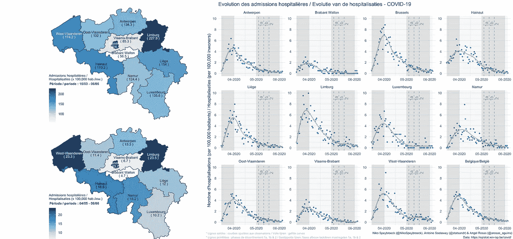

新冠肺炎比利时医院

从上图可以看出，住院率在所有省份都呈下降趋势(比利时也是如此)。

[下载](https://www.statsandr.com/blog/2020-05-22-covid-19-in-belgium-is-it-over-yet_files/Belgian_Hospitalisations_COVID-19_1.png)图，或查看[代码](https://github.com/AntoineSoetewey/COVID-19-Figures/blob/master/plot_hosp_trends_divid_twographs.R)。

**2020 年 10 月 27 日更新:**

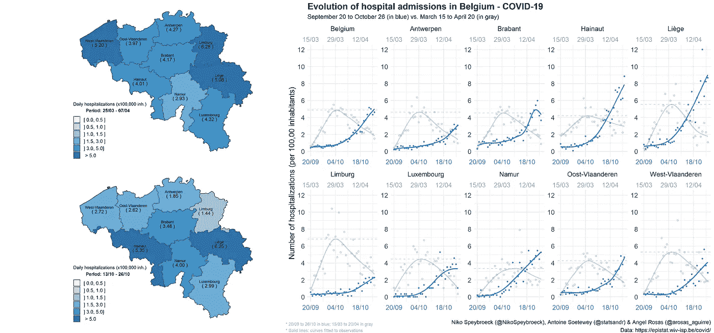

比利时的住院治疗

[下载](https://www.statsandr.com/blog/2020-05-22-covid-19-in-belgium-is-it-over-yet_files/Belgian_Hospitalizations_2710.png)图，或查看[代码](https://github.com/AntoineSoetewey/COVID-19-Figures/blob/master/plot_hosp_trends_divid_twographs_2710.R)。

布拉班特的详细情况:

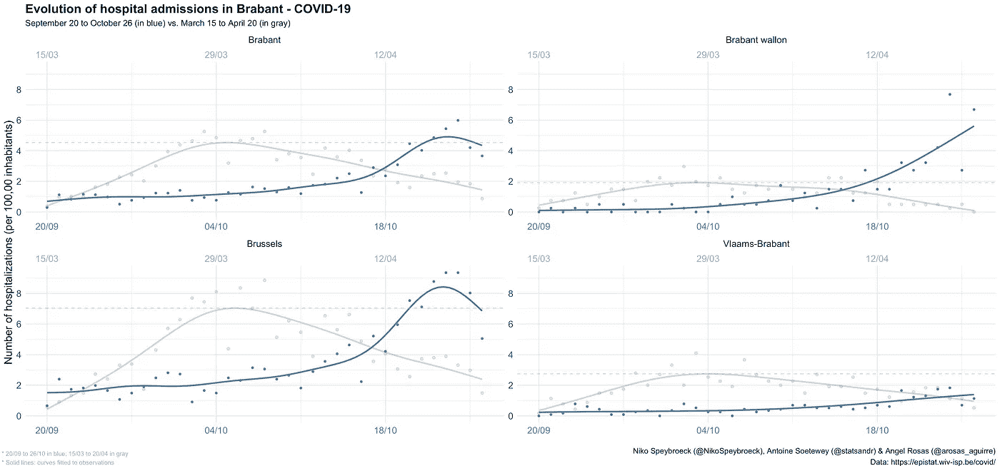

[下载](https://www.statsandr.com/blog/2020-05-22-covid-19-in-belgium-is-it-over-yet_files/Belgian_Hospitalizations_splitBrabant_2710.png)图，或查看[代码](https://github.com/AntoineSoetewey/COVID-19-Figures/blob/master/plot_hosp_trends_divid_splitBrabant_2710.R)。

# 按周期

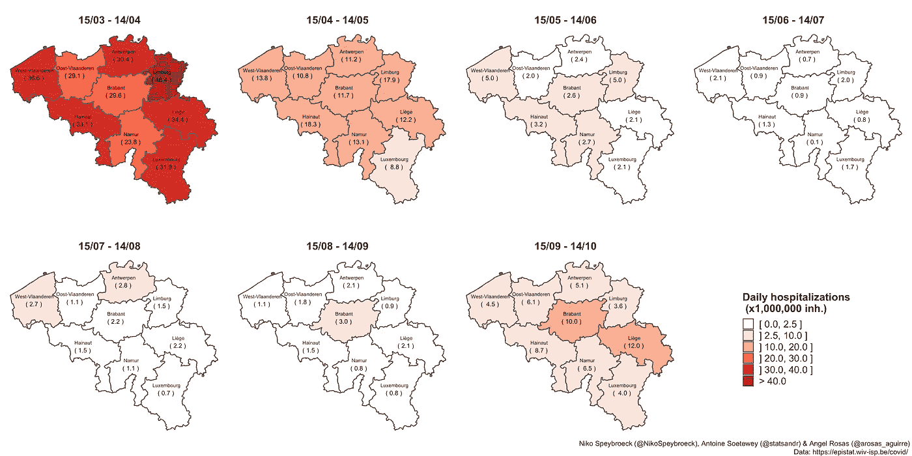

2020 年 3 月至 10 月比利时的每日 COVID19 住院情况

[下载](https://www.statsandr.com/blog/2020-05-22-covid-19-in-belgium-is-it-over-yet_files/EvolutionHospitalizations_red2.png)图，或查看[代码](https://github.com/AntoineSoetewey/COVID-19-Figures/blob/master/EvolutionProvincesCOVID_v3.R)。

**2020 年 11 月 16 日更新:**

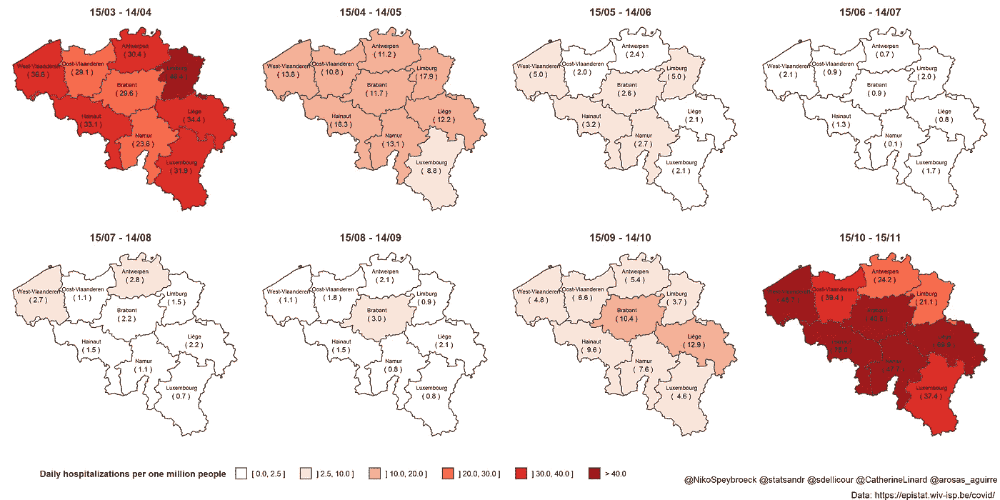

比利时期间每天的 COVID19 住院情况

[下载](https://www.statsandr.com/blog/2020-05-22-covid-19-in-belgium-is-it-over-yet_files/EvolutionHospitalizations_16_11_20.png)图。

在第一波中，林堡省每百万居民平均住院人数最高。在第二次浪潮中，列日和海瑙特努力争取最高税率。除了两个例外(安特卫普和林堡)，上个月的情况比 3-4 月更糟糕。在三个省(海瑙特、那慕尔和列日)，这一数字增加了一倍多。

在 2020 年 6 月 14 日至 7 月 15 日期间，比利时的 COVID19 住院人数降至非常低的相对水平，但我们未能保持这一水平。既然住院人数不再增加，我们希望随着年底的临近，颜色会再亮一点。

# 放大

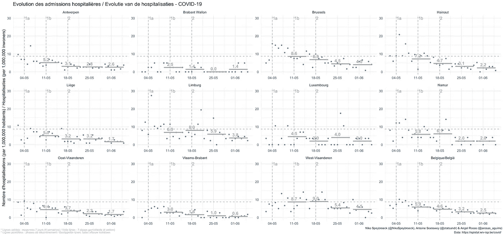

比利时新冠肺炎医院

[下载](https://www.statsandr.com/blog/2020-05-22-covid-19-in-belgium-is-it-over-yet_files/Belgian_Hospitalisations_COVID-19_3weeks.png)图或查看[代码](https://github.com/AntoineSoetewey/COVID-19-Figures/blob/master/plot_hosp_trends_divid_3weeks.R)。

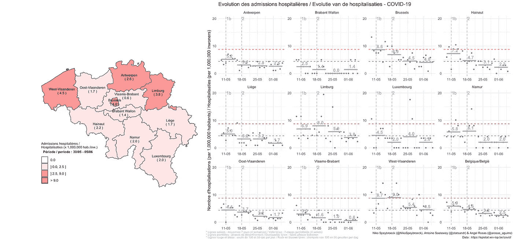

[下载](https://www.statsandr.com/blog/2020-05-22-covid-19-in-belgium-is-it-over-yet_files/Belgian_Hospitalisations_COVID-19_4weeks_limited.png)图或查看[代码](https://github.com/AntoineSoetewey/COVID-19-Figures/blob/master/plot_hosp_trends_divid_4weeks_limited_1.R)。

**2021 年 2 月 26 日更新:**

比利时正在讨论是否要放松限制。2021 年 2 月 26 日，比利时当局将开会、讨论、辩论并做出决定。新冠肺炎住院治疗的当前水平和趋势可以为他们提供指导:

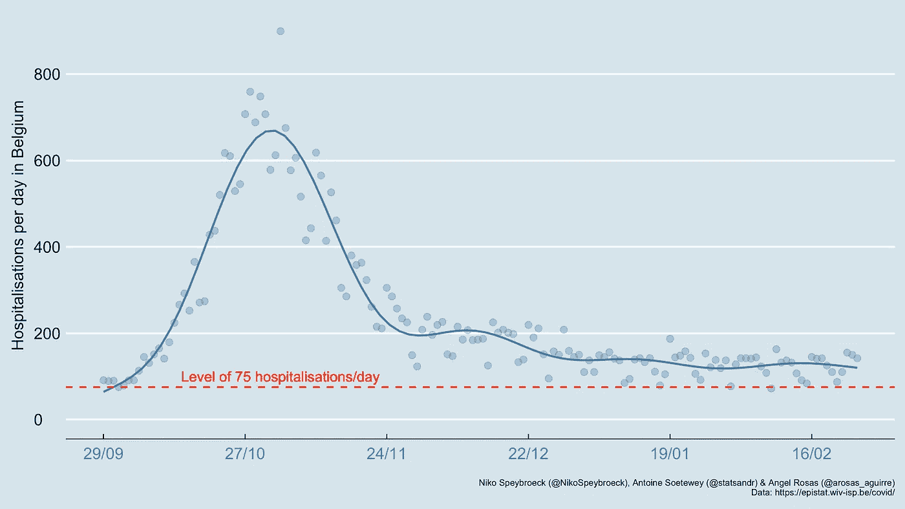

仍然没有强有力的证据表明比利时的新冠肺炎住院曲线下降。第一波(灰色-日期和曲线)和第二波(蓝色-日期和曲线)之间的比较需要谨慎，但表明当前的住院水平并不像一些人希望的那样低:

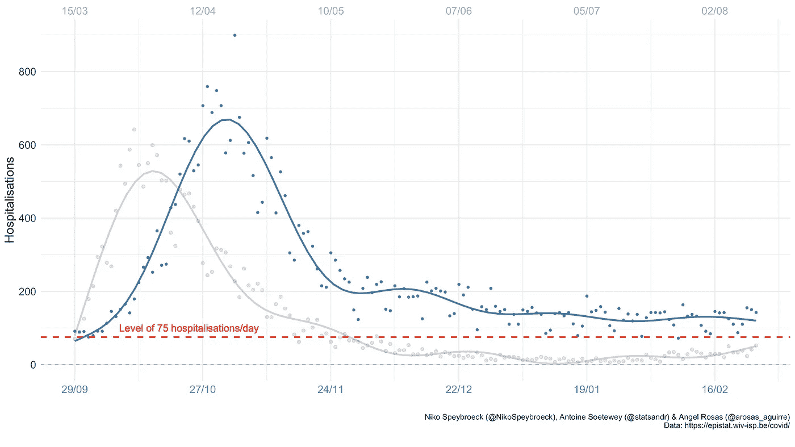

放大显示了第一波和第二波省级新冠肺炎水平的更多信息:

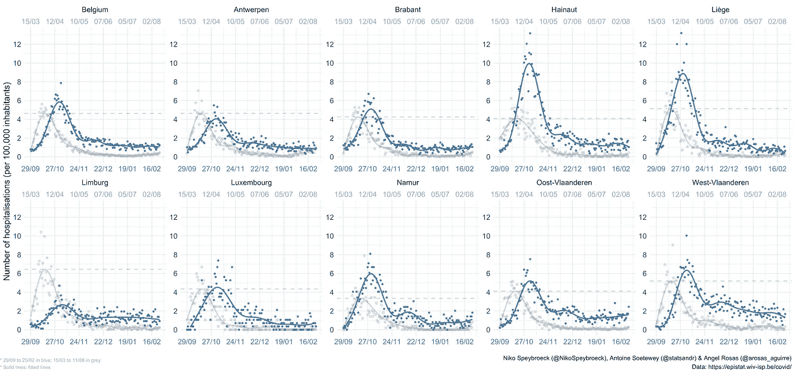

这表明，在比利时大多数省份，第二次浪潮导致的住院人数比第一次更多，尽管第一次致命浪潮发出了警告。这也说明了一个事实，即比利时目前的每日住院率仍然高于第一波结束时的水平。

简而言之，坏消息是接触人数和通过接触传播的风险的组合似乎(目前)还不足以导致住院人数大幅减少。然而(简而言之)，今天的好消息是人群中已经有了一些免疫力，疫苗接种可能会大大增加这种免疫力。这有助于向下推动曲线。让我们不要失去希望。

下载数字( [1](https://statsandr.com/blog/2020-05-22-covid-19-in-belgium-is-it-over-yet_files/fig_trends3_1.png) 、 [2](https://statsandr.com/blog/2020-05-22-covid-19-in-belgium-is-it-over-yet_files/fig_trends2_2.png) 和 [3](https://statsandr.com/blog/2020-05-22-covid-19-in-belgium-is-it-over-yet_files/Belgian_Hospitalizations_2602.png) )或查看[代码](https://github.com/AntoineSoetewey/COVID-19-Figures/blob/master/plot_hosp_trends_divid_twographs_23_02_2021_fr.R)。

# 医院里的病人

以下是比利时医院病人数量的变化情况:

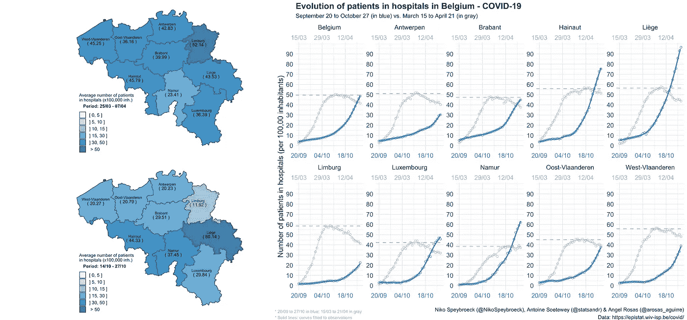

比利时医院中的 COVID19 患者

[下载](https://www.statsandr.com/blog/2020-05-22-covid-19-in-belgium-is-it-over-yet_files/Belgian_Hospitalizations_total_2810.png)图或查看[代码](https://github.com/AntoineSoetewey/COVID-19-Figures/blob/master/plot_hosp_trends_divid_twographs_total_2810.R)。

我们看到，截至 2020 年 10 月 28 日，比利时医院的 COVID19 患者数量达到第一波高峰。因此，尽管与第一波相比，第二波患者在医院停留的时间较短，但医院仍然越来越拥挤。

因此，如果未来几周医院中的患者数量遵循同样的路径，医院将很快变得过于拥挤，并且将无法接收新患者，因为其最大容量将很快达到(如果这还不是情况……)。

# 重症监护中的病人

根据短期预测和 99%的置信区间，比利时重症监护中 COVID19 患者的演变如下:

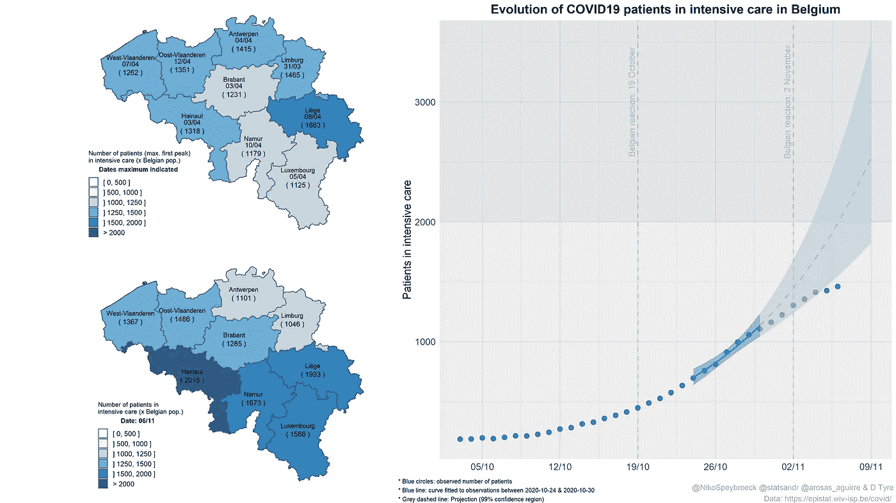

比利时重症监护病房中 COVID19 患者的演变

[下载](https://www.statsandr.com/blog/2020-05-22-covid-19-in-belgium-is-it-over-yet_files/covid19-patients-in-intensive-care-in-belgium.png)图。

短期预测表明，如果传播速度没有减慢，可能会发生什么。这种放缓是积极的消息。

这些地图显示了各省重症监护患者的总数(如果有比利时人口的话)。顶部的地图显示 3 月至 4 月的最高水平，底部的地图显示当前水平。该图显示了 COVID19 导致的高重症监护使用率。在比利时大多数省份，今天的数字仍然高于 3 月至 4 月的峰值。

观察结果与其他初步迹象一致，如 COVID19 住院趋势(目前相对不稳定)，表明传播正在放缓:

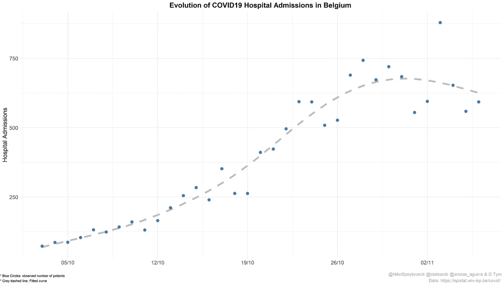

[下载](https://www.statsandr.com/blog/2020-05-22-covid-19-in-belgium-is-it-over-yet_files/evolution-covid19-hospital-admissions-belgium.png)图。

# 确诊病例

*请注意，报告的新增确诊病例数可能被低估。这一数字不包括未诊断(无症状或症状很少)或未检测的病例。因此，应极其谨慎地解释带有病例数的数字。*

# 按省份

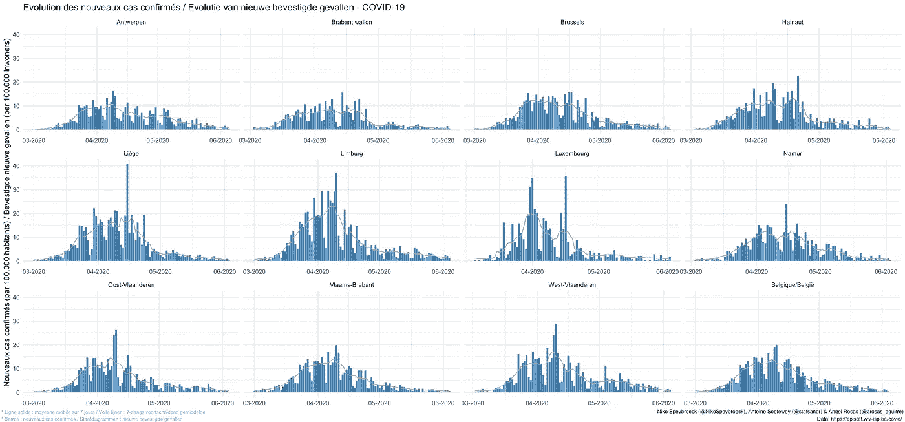

比利时新增确诊新冠肺炎病例

[下载](https://www.statsandr.com/blog/2020-05-22-covid-19-in-belgium-is-it-over-yet_files/new_cases_divid.png)图或查看[代码](https://github.com/AntoineSoetewey/COVID-19-Figures/blob/master/new_cases_divid.R)。

# 按年龄组和性别

# 静态

下面是比利时三个不同时期按年龄组和性别分列的病例数的另一个图表:

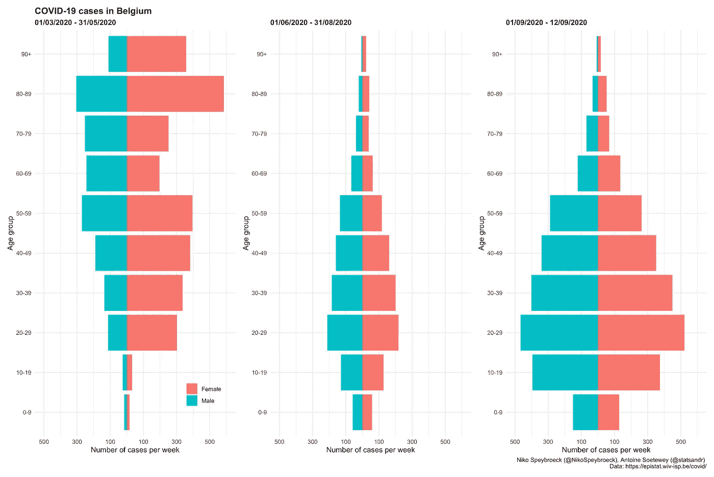

比利时按年龄组和性别分列的新冠肺炎病例

[下载](https://www.statsandr.com/blog/2020-05-22-covid-19-in-belgium-is-it-over-yet_files/pyramid-plot-week-limit.png)图或查看[代码](https://github.com/AntoineSoetewey/COVID-19-Figures/blob/master/pyramid-plot-week.R)。

这一形象化显示了报告病例年龄而不仅仅是总数的重要性。

此外，我们看到，9 月初按年龄组划分的每周病例分布与暑假期间相似，但每周病例数更高。然而，9 月初按年龄组划分的每周病例分布与“第一波”(2020 年 3 月 1 日至 2020 年 5 月 31 日期间)不同。在第一阶段，大多数病例是老年人，而在 9 月初，大多数病例是年轻人。观察冬季不同年龄组的病例分布如何演变将是很有意思的。

上述数字可能与比利时人口结构有关:

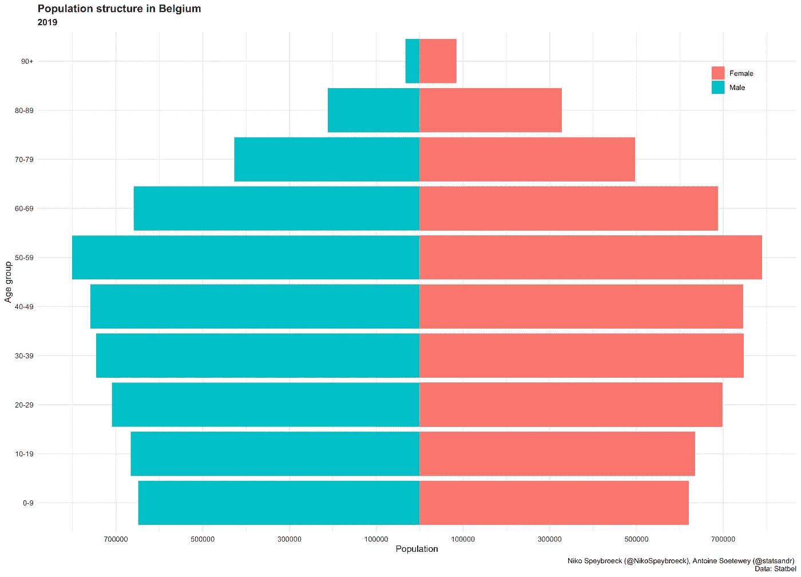

比利时人口结构(2019 年)

[下载](https://www.statsandr.com/blog/2020-05-22-covid-19-in-belgium-is-it-over-yet_files/pyramid-plot-population.png)图或查看[代码](https://github.com/AntoineSoetewey/COVID-19-Figures/blob/master/pyramid-plot-population.R)。

# 动态的

此外，还可以动态查看这些信息:

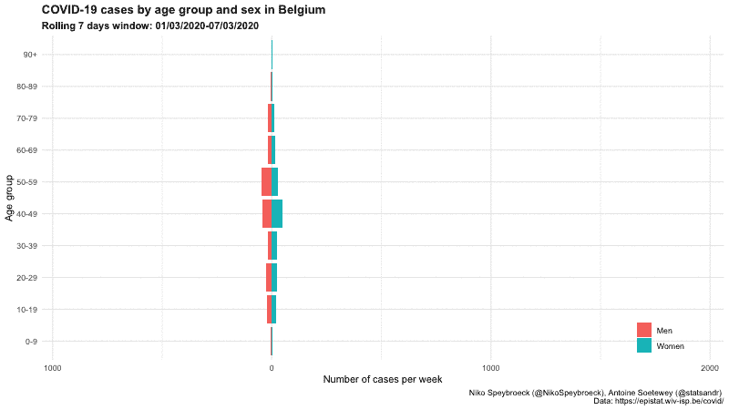

比利时按年龄组和性别划分的新冠肺炎病例-动态版本

[下载](https://www.statsandr.com/blog/2020-05-22-covid-19-in-belgium-is-it-over-yet_files/pyramid-plot-week-animated.gif)图或查看[代码](https://github.com/AntoineSoetewey/COVID-19-Figures/blob/master/pyramid-plot-week-animated.R)。

随着第二波的更新:

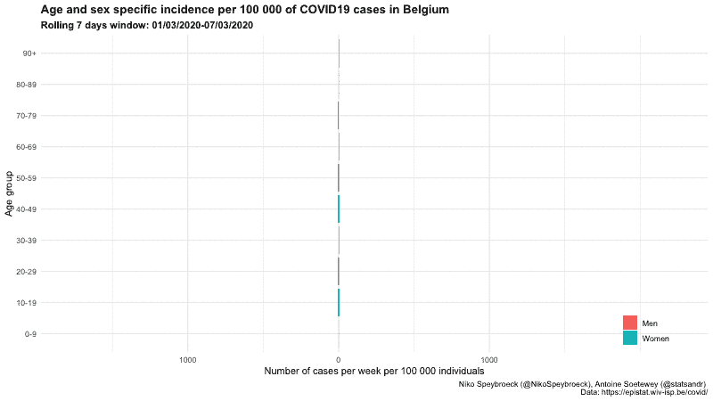

比利时每 100，00 0 例 COVID19 病例的年龄和性别特异性发病率—动态版本

[下载](https://www.statsandr.com/blog/2020-05-22-covid-19-in-belgium-is-it-over-yet_files/pyramid-plot-week-animated-incidence.gif)图或查看[代码](https://github.com/AntoineSoetewey/COVID-19-Figures/blob/master/pyramid-plot-week-animated.R)。

# 按年龄组、性别和省份

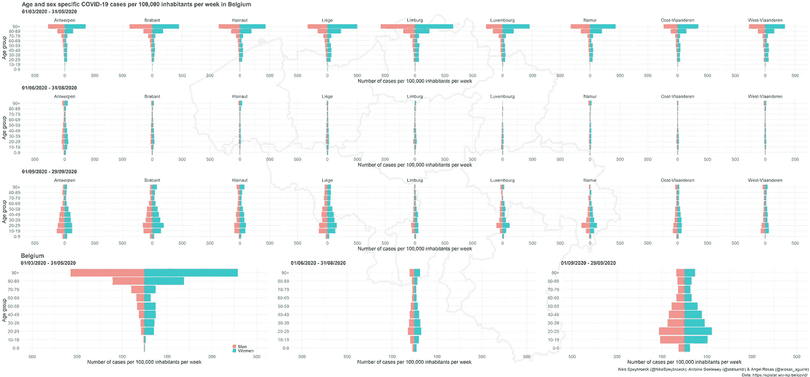

[下载](https://www.statsandr.com/blog/2020-05-22-covid-19-in-belgium-is-it-over-yet_files/pyramid-plot_facets_incidence_week.png)图或查看[代码](https://github.com/AntoineSoetewey/COVID-19-Figures/blob/master/pyramid-plot_facets_incidence_week.R)。

感谢阅读。我们希望这些数字将朝着正确的方向发展。与此同时，请注意安全！

如果你想进一步了解新冠肺炎疫情的发展，有两个选择:

1.  不时访问博客，并且
2.  加入 Twitter 并关注我们: [statsandr](https://twitter.com/statsandr) ，[NikoSpeybroeck](https://twitter.com/NikoSpeybroeck)&[arosas _ agui rre](https://twitter.com/arosas_aguirre)

和往常一样，如果您有与本文主题相关的问题或建议，请将其添加为评论，以便其他读者可以从讨论中受益。

# 相关文章

*   [如何创建针对贵国的简单冠状病毒仪表板](https://www.statsandr.com/blog/how-to-create-a-simple-coronavirus-dashboard-specific-to-your-country-in-r/)
*   [新型新冠肺炎冠状病毒前 100 名资源](https://www.statsandr.com/blog/top-r-resources-on-covid-19-coronavirus/)
*   [R 中的图形用 ggplot2](https://www.statsandr.com/blog/graphics-in-r-with-ggplot2/)
*   [在新冠肺炎隔离期间免费下载斯普林格书籍的套装](https://www.statsandr.com/blog/a-package-to-download-free-springer-books-during-covid-19-quarantine/)
*   [比利时的新冠肺炎](https://www.statsandr.com/blog/covid-19-in-belgium/)

*原载于 2020 年 5 月 22 日 https://statsandr.com***。**

****编者注:*** [*走向数据科学*](http://towardsdatascience.com/) *是一份以数据科学和机器学习研究为主的中型刊物。我们不是健康专家，这篇文章的观点不应被解释为专业建议。**