# 印度的新冠肺炎

> 原文：<https://towardsdatascience.com/covid-19-in-india-b2c32cb096c1?source=collection_archive---------10----------------------->

## 新冠肺炎教对印度影响的详细统计分析。


马库斯·温克勒在 [Unsplash](https://unsplash.com?utm_source=medium&utm_medium=referral) 上的照片

新冠肺炎是一种由冠状病毒引起的传染病，生物学上称为严重急性呼吸综合征冠状病毒 2 型(新型冠状病毒)。这种疾病于 2019 年 12 月在中国湖北省省会武汉首次被发现，此后蔓延到世界各地。当我写这篇文章时，IST 时间 2020 年 4 月 28 日 00:55，根据谷歌的数据，全世界有 300 万确诊病例，并导致 208，000 人死亡。

在这篇文章中，我将看看印度的现状。我们将看看受疫情影响最严重的地区，以及该国的人数是如何稳步攀升的

首先，我们将导入我将在分析中使用的必要库。

```
import pandas as pd
import matplotlib.pyplot as plt
import numpy as np
import seaborn as sns%matplotlib inline
%matplotlib notebook
```

接下来，我们将从我获取信息的地方导入不同的数据表。

```
covid19_df = pd.read_csv("./datasets/covid_19_india.csv")
individuals_df = pd.read_csv("./datasets/IndividualDetails.csv")excel_file = pd.ExcelFile("./datasets/Indian States Population and Area.xlsx")
indian_states_df = excel_file.parse('Sheet1')
```

在这个分析中，我使用了三个不同的数据来源。我要感谢 Sudalai Rajkumar 和他的合作者，我从 Kaggle 下载了前两个文件。最后一个数据集是我从 uidai 网站和维基百科上收集的州级 Aadhaar 饱和度数据。

你可以从我的 GitHub 库下载数据集，我在文章末尾附上了链接，或者你也可以从 Kaggle 下载。如果你在网上使用它们，记得给出到期的学分！

让我们看看来自 Kaggle 的 COVID 19 数据集的前几条记录。

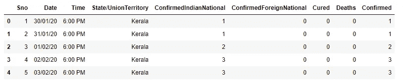

```
 covid19_df.head()
```

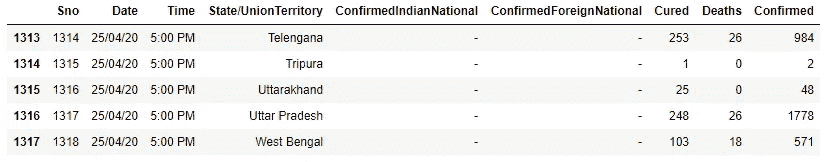

```
 covid19_df.tail()
```

因此，我们可以看到，该数据集提供了该国特定州每天发现的病例数记录。在进一步的检查中，我们发现这个数据集包含 1350 个条目和 9 个特征。这些数据包含了一些重要的数据，比如某个州某一天的确诊人数、死亡人数和治愈人数。确诊病例进一步细分为印度国民和外国人。这个数据集中的细节层次是我最喜欢的！


```
covid19_df.shape
```

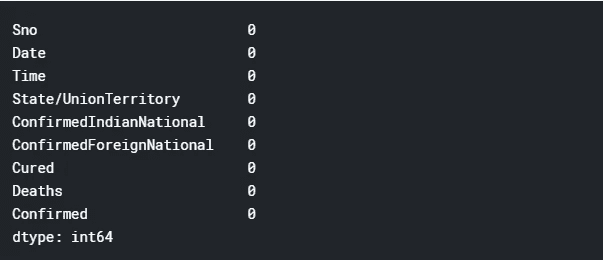

```
covid19_df.isna().sum()
```

在这里，我们看到这个数据集中没有丢失的值，这使我的工作更容易。现在让我们看一下每个州的最新记录，了解一下我们目前的情况。从最后一组记录中，我们可以看到我们拥有截至 2020 年 4 月 25 日的数据。

```
covid19_df_latest = covid19_df[covid19_df['Date']=="25/04/20"]
covid19_df_latest.head()
```

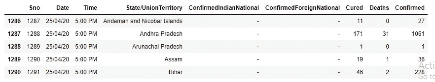

```
covid19_df_latest['Confirmed'].sum()
```


因此，现在我们已经根据每个州的最新数据筛选了 1318 条记录的数据集。通过检查这些数据，我们看到截至 2020 年 4 月 25 日，印度共有 24，893 例病例。

# **治国人物**

```
covid19_df_latest = covid19_df_latest.sort_values(by=['Confirmed'], ascending = False)
plt.figure(figsize=(12,8), dpi=80)
plt.bar(covid19_df_latest['State/UnionTerritory'][:5], covid19_df_latest['Confirmed'][:5],
        align='center',color='lightgrey')
plt.ylabel('Number of Confirmed Cases', size = 12)
plt.title('States with maximum confirmed cases', size = 16)
plt.show()
```

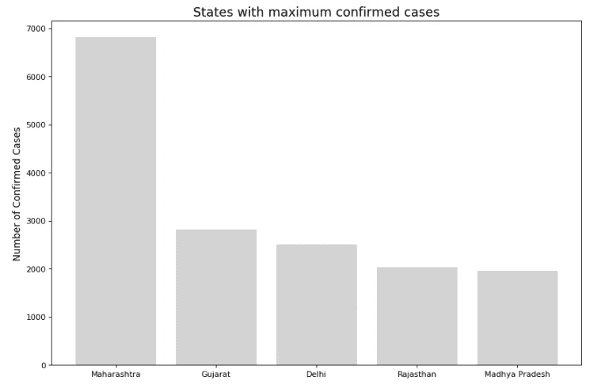

显示确诊新冠肺炎阳性病例最多的州的条形图。

在检查上面的可视化，我们看到，马哈拉施特拉邦有最多的案件检查到目前为止。马哈拉施特拉邦接近 7000 例，在我上传这个笔记本的时候可能已经超过了这个数字。根据我们掌握的数据，马哈拉施特拉邦的情况如此严重，以至于印度没有任何其他邦超过这一标准的一半。古吉拉特邦和德里即将达到 3000 例，而拉贾斯坦邦和中央邦只有 2000 多例。

```
covid19_df_latest['Deaths'].sum()
```


根据数据集中的数据，印度各邦已有 779 人死亡。我们现在将了解哪些州的死亡人数最多。

```
covid19_df_latest = covid19_df_latest.sort_values(by=['Deaths'], ascending = False)
plt.figure(figsize=(12,8), dpi=80)
plt.bar(covid19_df_latest['State/UnionTerritory'][:5], covid19_df_latest['Deaths'][:5], align='center',color='lightgrey')
plt.ylabel('Number of Deaths', size = 12)
plt.title('States with maximum deaths', size = 16)
plt.show()
```

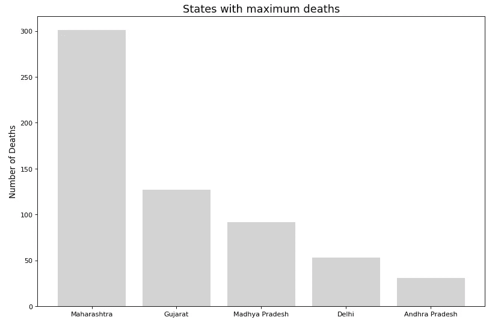

条形图显示了因新冠肺炎死亡人数最多的州。

毫不奇怪，上图中出现的五个状态中的四个也出现在这张图中。马哈拉施特拉邦目前几乎占了印度因新冠肺炎死亡人数的一半。排名第二的古吉拉特邦也没有达到一半。中央邦即将达到三位数，德里和安得拉邦紧随其后。

接下来，我想看看印度各邦每个确诊病例的死亡人数，以便更好地了解可用的医疗设施。

```
covid19_df_latest['Deaths/Confirmed Cases'] = (covid19_df_latest['Confirmed']/covid19_df_latest['Deaths']).round(2)
covid19_df_latest['Deaths/Confirmed Cases'] = [np.nan if x == float("inf") else x for x in covid19_df_latest['Deaths/Confirmed Cases']]
covid19_df_latest = covid19_df_latest.sort_values(by=['Deaths/Confirmed Cases'], ascending=True, na_position='last')
covid19_df_latest.iloc[:10]
```

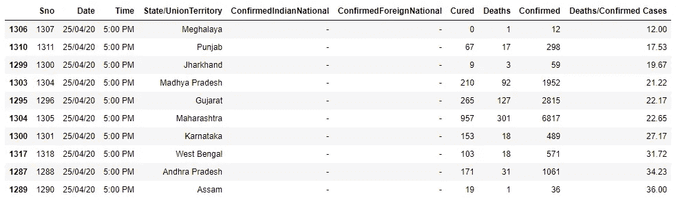

因此，在创建了这个新的衡量标准，并根据这个数字对各州进行排序之后，我来看看这方面最差的十个州。我们看到，在梅加拉亚邦、恰尔肯德邦和阿萨姆邦等一些邦，病例和死亡人数目前都很低，情况似乎得到了控制。但是像旁遮普邦、卡纳塔克邦等其他邦看起来也受到了这种情况的影响。我们将西孟加拉邦排除在整个等式之外，因为该邦已经出现了关于错误发布数字的消息。中央邦、古吉拉特邦和马哈拉施特拉邦也榜上有名。

然而，这些统计数据并不总是提供清晰的画面。印度是一个人口结构多变的国家，没有两个邦是相同的。也许将这些数字等同于一个州的估计人口可能会对整个情况有更好的了解。

# 每 1000 万例

```
indian_states_df.head()
```

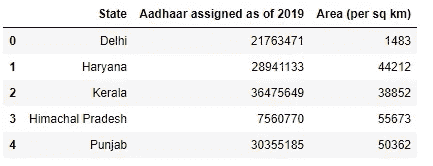

现在让我们真正使用你收集的数据集。该数据集提供了截至 2019 年每个州分配的 Aadhaar 卡的数量以及每个州每平方公里的面积等细节。每个州分配的 Aadhaar 卡的数量是一个很好的衡量或估计每个州人口数字的方法。我决定使用这个数字，因为印度政府的官方人口普查是在 2011 年进行的，差距太大，不能使用。我还决定不采用基于以往人口普查预测的各种人口预测数字。

我们现在将从主新冠肺炎数据集中删除一些要素，因为这些细节对我的分析没有太大帮助。我们还会将分配的 Aadhaar 卡的数量列重命名为人口，并放弃面积功能，因为我决定不使用它，因为最近印度各邦和 UTs 进行了更新。

```
covid19_df_latest = covid19_df_latest.drop(['Sno','Date','Time','ConfirmedIndianNational','ConfirmedForeignNational'], axis = 1)
covid19_df_latest.shape
```


```
indian_states_df = indian_states_df[['State', 'Aadhaar assigned as of 2019']]
indian_states_df.columns = ['State/UnionTerritory', 'Population']
indian_states_df.head()
```

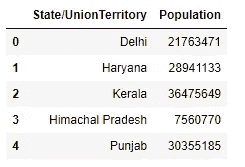

我们现在将人口数据集与主数据集合并，并创建一个名为“每 1000 万病例数”的新要素，以获得更多关于哪些病例受新冠肺炎危机影响更大的信息。我觉得这个新措施现在是一个更加冷静的措施，因为它考虑到了不同州之间存在的人口差异。

```
covid19_df_latest = pd.merge(covid19_df_latest, indian_states_df, on="State/UnionTerritory")
covid19_df_latest['Cases/10million'] = (covid19_df_latest['Confirmed']/covid19_df_latest['Population'])*10000000
covid19_df_latest.head()
```

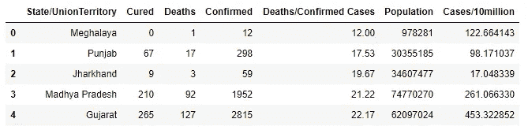

```
covid19_df_latest.fillna(0, inplace=True)
covid19_df_latest.sort_values(by='Cases/10million', ascending=False)
```

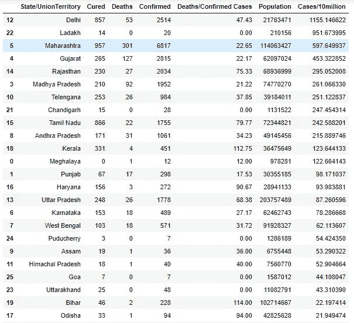

错过了大约 5 个州，因为我不能把它们放在一张图片里！对不起，读者们！

```
df = covid19_df_latest[(covid19_df_latest['Confirmed']>=1000) | (covid19_df_latest['Cases/10million']>=200)]
plt.figure(figsize=(12,8), dpi=80)
plt.scatter(covid19_df_latest['Confirmed'], covid19_df_latest['Cases/10million'], alpha=0.5)
plt.xlabel('Number of confirmed Cases', size=12)
plt.ylabel('Number of cases per 10 million people', size=12)
plt.scatter(df['Confirmed'], df['Cases/10million'], color="red")for i in range(df.shape[0]):
    plt.annotate(df['State/UnionTerritory'].tolist()[i], xy=(df['Confirmed'].tolist()[i], df['Cases/10million'].tolist()[i]),
                xytext = (df['Confirmed'].tolist()[i]+1.0, df['Cases/10million'].tolist()[i]+12.0), size=11)plt.tight_layout()    
plt.title('Visualization to display the variation in COVID 19 figures in different Indian states', size=16)
plt.show()
```

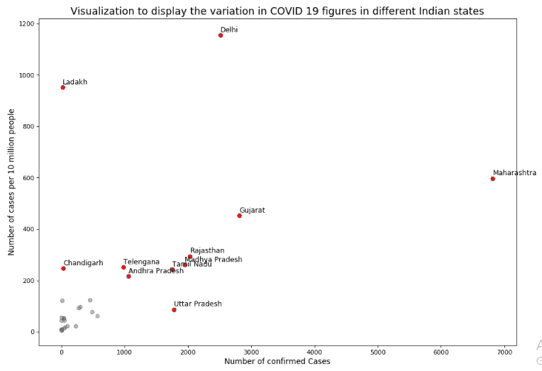

散点图显示了印度不同邦之间新冠肺炎数字的变化。

因此，从图表和视觉效果来看，我们意识到，即使我们把邦人口考虑在内，马哈拉施特拉邦、古吉拉特邦、德里、拉贾斯坦邦和中央邦确实受到了严重影响。除了这些邦，还有其他邦和中央直辖区，如泰米尔纳德邦、北方邦、安得拉邦、泰伦加纳、昌迪加尔和拉达克。然而，拉达克的情况看起来不错，在 20 例确诊病例中，有 14 例已经康复。昌迪加尔也是如此，28 例确诊病例中有 15 例已经康复。

现在我们已经有了每个状态的六个重要特征，我们可以看看这些特征是如何相互关联的，并从中得出一些见解。

```
plt.figure(figsize = (12,8))
sns.heatmap(covid19_df_latest.corr(), annot=True)
```


显示不同功能之间相互关系的热图。

我们注意到，一些指标，如确诊、治愈、死亡和每 1000 万人病例数，是非常相关的，我们并不急于去认识其中的原因。

# **个人数据**

接下来，我们来看一下现有的个案数据。在对该数据集进行初步检查时，我们发现该数据集中有大量缺失数据，我们在继续分析时必须考虑这些数据。

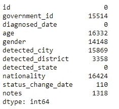

```
individuals_df.isna().sum()individuals_df.iloc[0]
```

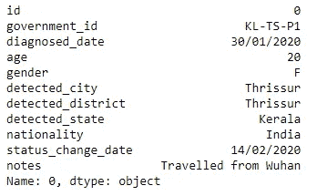

2020 年 1 月 30 日，印度发现首例新冠肺炎病例。这是在喀拉拉邦的特里斯苏尔市发现的。该人有在武汉的旅行史。

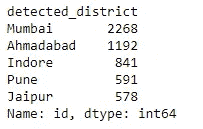

```
individuals_grouped_district = individuals_df.groupby('detected_district')
individuals_grouped_district = individuals_grouped_district['id']
individuals_grouped_district.columns = ['count']
individuals_grouped_district.count().sort_values(ascending=False).head()
```

接下来，我决定根据发现病例的地区对个人数据进行分组。在做这件事的时候，我必须格外小心，因为这一栏中有一些丢失的数据。从现有数据来看，孟买是全国受灾最严重的地区。它有 2000 多个病例，其次是艾哈迈达巴德。浦那是马哈拉施特拉邦的另一个区，也在这个名单中。所有这些地区都属于我们在前面的图表中看到的州。

```
individuals_grouped_gender = individuals_df.groupby('gender')
individuals_grouped_gender = pd.DataFrame(individuals_grouped_gender.size().reset_index(name = "count"))
individuals_grouped_gender.head()plt.figure(figsize=(10,6), dpi=80)
barlist = plt.bar(individuals_grouped_gender['gender'], individuals_grouped_gender['count'], align = 'center', color='grey', alpha=0.3)
barlist[1].set_color('r')
plt.ylabel('Count', size=12)
plt.title('Count on the basis of gender', size=16)
plt.show()
```

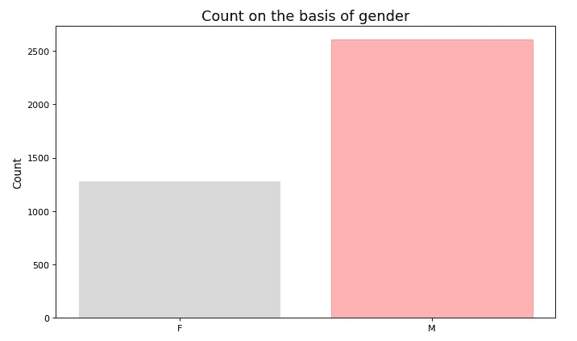

基于性别的新冠肺炎案例分布。

继续我们的分析，我想看看病例数是如何根据性别分布的。我们看到在这个分布中没有宇称。从数据来看，在印度，这种病毒对男性的影响似乎大于女性。这也得到不同新闻机构的证实。挖一下谷歌！

# 印度病例数的进展

在本节中，我们将了解印度的病例数是如何增加的。之后，我们将检查这条曲线，并找出与州级曲线的相似之处。

为了做这个分析，我必须稍微修改一下数据集。我根据诊断数据特征对数据进行了分组，这样我就有了全印度每天检测到的病例数。接下来，我对这个特性进行了累加，并将其添加到一个新的列中。

```
individuals_grouped_date = individuals_df.groupby('diagnosed_date')
individuals_grouped_date = pd.DataFrame(individuals_grouped_date.size().reset_index(name = "count"))
individuals_grouped_date[['Day','Month','Year']] = individuals_grouped_date.diagnosed_date.apply( 
   lambda x: pd.Series(str(x).split("/")))
individuals_grouped_date.sort_values(by=['Year','Month','Day'], inplace = True, ascending = True)
individuals_grouped_date.reset_index(inplace = True)
individuals_grouped_date['Cumulative Count'] = individuals_grouped_date['count'].cumsum()
individuals_grouped_date = individuals_grouped_date.drop(['index', 'Day', 'Month', 'Year'], axis = 1)
individuals_grouped_date.head()
```

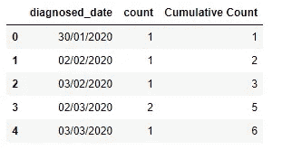

```
individuals_grouped_date.tail()
```

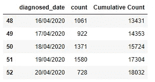

该数据集包含截至 4 月 20 日的数据。当天，印度共有 18032 例确诊病例。我们注意到数据集包含 1 月 30 日的数据，但不包含中间的数据，因为在此期间没有检测到病例。为了保持连续性，我决定假设 2020 年 3 月 2 日为第一天，因为我们有从那以后每天的数据。

```
individuals_grouped_date = individuals_grouped_date.iloc[3:]
individuals_grouped_date.reset_index(inplace = True)
individuals_grouped_date.columns = ['Day Number', 'diagnosed_date', 'count', 'Cumulative Count']
individuals_grouped_date['Day Number'] = individuals_grouped_date['Day Number'] - 2
individuals_grouped_dateplt.figure(figsize=(12,8), dpi=80)
plt.plot(individuals_grouped_date['Day Number'], individuals_grouped_date['Cumulative Count'], color="grey", alpha = 0.5)
plt.xlabel('Number of Days', size = 12)
plt.ylabel('Number of Cases', size = 12)
plt.title('How the case count increased in India', size=16)
plt.show()
```

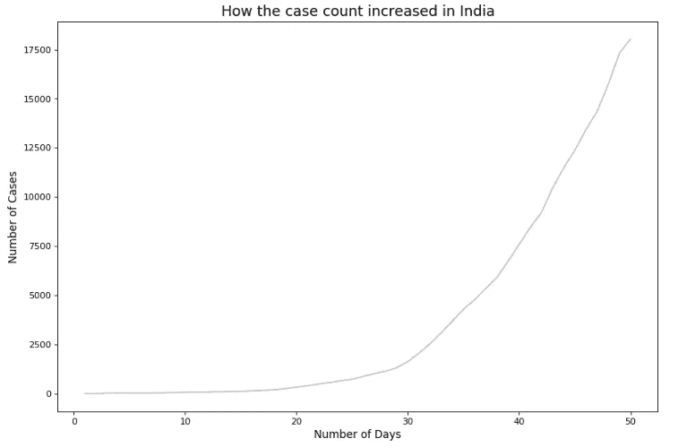

印度新冠肺炎阳性病例的进展。

在上面的曲线中，我们看到上升或多或少是稳定的，直到第 20 天。在 20-30 之间的区间，曲线稍微倾斜。这种倾斜逐渐增加，在 30 天后，我们看到一个稳定而陡峭的斜坡，没有变平的迹象。这些都是不祥的迹象。

在接下来的几个代码元素中，我准备并处理数据集，根据不同的状态对数据进行分组。在接下来的分析中，我使用了以下五种状态:

*   马哈拉施特拉邦
*   喀拉拉邦
*   德里
*   拉贾斯坦邦
*   古吉拉特邦

```
covid19_maharashtra = covid19_df[covid19_df['State/UnionTerritory'] == "Maharashtra"]
covid19_maharashtra.head()
covid19_maharashtra.reset_index(inplace = True)
covid19_maharashtra = covid19_maharashtra.drop(['index', 'Sno', 'Time', 'ConfirmedIndianNational', 'ConfirmedForeignNational','Cured'],  axis = 1)
covid19_maharashtra.reset_index(inplace = True)
covid19_maharashtra.columns = ['Day Count', 'Date', 'State/UnionTerritory', 'Deaths', 'Confirmed']
covid19_maharashtra['Day Count'] = covid19_maharashtra['Day Count'] + 8
missing_values = pd.DataFrame({"Day Count": [x for x in range(1,8)],
                  "Date": ["0"+str(x)+"/03/20" for x in range(2,9)],
                  "State/UnionTerritory": ["Maharashtra"]*7,
                  "Deaths": [0]*7,
                  "Confirmed": [0]*7})
covid19_maharashtra = covid19_maharashtra.append(missing_values, ignore_index = True)
covid19_maharashtra = covid19_maharashtra.sort_values(by="Day Count", ascending = True)
covid19_maharashtra.reset_index(drop=True, inplace=True)
print(covid19_maharashtra.shape)
covid19_maharashtra.head()
```

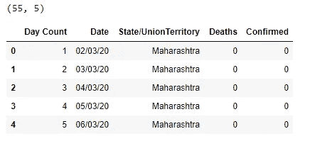

```
covid19_kerala = covid19_df[covid19_df['State/UnionTerritory'] == "Kerala"]
covid19_kerala = covid19_kerala.iloc[32:]
covid19_kerala.reset_index(inplace = True)
covid19_kerala = covid19_kerala.drop(['index','Sno', 'Time', 'ConfirmedIndianNational', 'ConfirmedForeignNational','Cured'], axis = 1)
covid19_kerala.reset_index(inplace = True)
covid19_kerala.columns = ['Day Count', 'Date', 'State/UnionTerritory', 'Deaths', 'Confirmed']
covid19_kerala['Day Count'] = covid19_kerala['Day Count'] + 1
print(covid19_kerala.shape)
covid19_kerala.head()
```

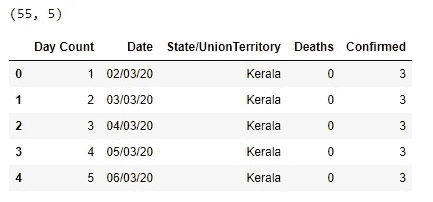

```
covid19_delhi = covid19_df[covid19_df[‘State/UnionTerritory’] == “Delhi”]
covid19_delhi.reset_index(inplace = True)
covid19_delhi = covid19_delhi.drop([‘index’,’Sno’, ‘Time’, ‘ConfirmedIndianNational’, ‘ConfirmedForeignNational’,’Cured’], axis = 1)
covid19_delhi.reset_index(inplace = True)
covid19_delhi.columns = [‘Day Count’, ‘Date’, ‘State/UnionTerritory’, ‘Deaths’, ‘Confirmed’]
covid19_delhi[‘Day Count’] = covid19_delhi[‘Day Count’] + 1
print(covid19_delhi.shape)
covid19_delhi.head()
```

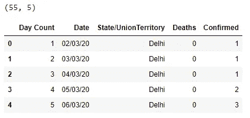

```
covid19_rajasthan = covid19_df[covid19_df['State/UnionTerritory'] == "Rajasthan"]
covid19_rajasthan.reset_index(inplace = True)
covid19_rajasthan = covid19_rajasthan.drop(['index','Sno', 'Time', 'ConfirmedIndianNational', 'ConfirmedForeignNational','Cured'], axis = 1)
covid19_rajasthan.reset_index(inplace = True)
covid19_rajasthan.columns = ['Day Count', 'Date', 'State/UnionTerritory', 'Deaths', 'Confirmed']
covid19_rajasthan['Day Count'] = covid19_rajasthan['Day Count'] + 2
missing_values = pd.DataFrame({"Day Count": [1],
                           "Date": ["02/03/20"],
                           "State/UnionTerritory": ["Rajasthan"],
                           "Deaths": [0],
                           "Confirmed": [0]})
covid19_rajasthan = covid19_rajasthan.append(missing_values, ignore_index = True)
covid19_rajasthan = covid19_rajasthan.sort_values(by="Day Count", ascending = True)
covid19_rajasthan.reset_index(drop=True, inplace=True)
print(covid19_rajasthan.shape)
covid19_rajasthan.head()
```

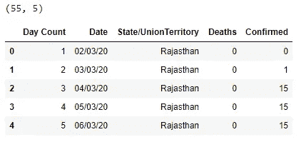

```
covid19_gujarat = covid19_df[covid19_df['State/UnionTerritory'] == "Gujarat"]
covid19_gujarat.reset_index(inplace = True)
covid19_gujarat = covid19_gujarat.drop(['index','Sno', 'Time', 'ConfirmedIndianNational', 'ConfirmedForeignNational','Cured'], axis = 1)
covid19_gujarat.reset_index(inplace = True)
covid19_gujarat.columns = ['Day Count', 'Date', 'State/UnionTerritory', 'Deaths', 'Confirmed']
covid19_gujarat['Day Count'] = covid19_gujarat['Day Count'] + 19
missing_values = pd.DataFrame({"Day Count": [x for x in range(1,19)],
                           "Date": [("0" + str(x) if x < 10 else str(x))+"/03/20" for x in range(2,20)],
                           "State/UnionTerritory": ["Gujarat"]*18,
                           "Deaths": [0]*18,
                           "Confirmed": [0]*18})
covid19_gujarat = covid19_gujarat.append(missing_values, ignore_index = True)
covid19_gujarat = covid19_gujarat.sort_values(by="Day Count", ascending = True)
covid19_gujarat.reset_index(drop=True, inplace=True)
print(covid19_gujarat.shape)
covid19_gujarat.head()
```

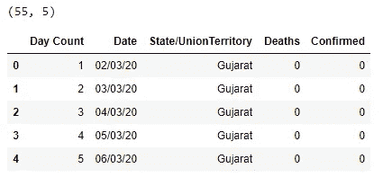

所有五个州都有 55 个记录，包含 5 个特征。每个记录代表一天。在这个分析中，为了保持一致，我也决定将 2020 年 3 月 2 日作为第一天。

现在让我们来看看可视化。

```
plt.figure(figsize=(12,8), dpi=80)
plt.plot(covid19_kerala['Day Count'], covid19_kerala['Confirmed'])
plt.plot(covid19_maharashtra['Day Count'], covid19_maharashtra['Confirmed'])
plt.plot(covid19_delhi['Day Count'], covid19_delhi['Confirmed'])
plt.plot(covid19_rajasthan['Day Count'], covid19_rajasthan['Confirmed'])
plt.plot(covid19_gujarat['Day Count'], covid19_gujarat['Confirmed'])
plt.legend(['Kerala', 'Maharashtra', 'Delhi', 'Rajasthan', 'Gujarat'], loc='upper left')
plt.xlabel('Day Count', size=12)
plt.ylabel('Confirmed Cases Count', size=12)
plt.title('Which states are flattening the curve ?', size = 16)
plt.show()
```

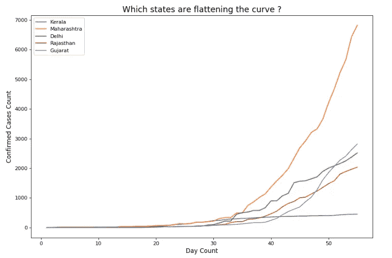

印度一些邦新冠肺炎病例的进展。

我们看到几乎所有的曲线都遵循着整个国家的曲线。唯一的例外是喀拉拉邦。与其他曲线一样，喀拉拉邦的曲线在 20-30 天内逐渐倾斜。但喀拉拉邦成功做到的是，它没有让曲线进一步倾斜，而是设法让曲线变平。因此，国家已经能够控制局势。

马哈拉施特拉邦的形势看起来确实非常严峻。这条曲线非常陡峭，没有减速的迹象。与其他地区相比，古吉拉特曲线在较晚的时间间隔变陡。它一直保持在控制状态，直到第 30 天，40 天后病情恶化。

作为一个整体，我们防止这场迫在眉睫的危机的唯一方法是拉平曲线。所有邦政府都需要遵循喀拉拉模式。这是唯一一个设法使曲线变平的国家，因此，大多数事情都做对了。是时候我们遵循喀拉拉模式了。

卡格尔邮报:[https://www.kaggle.com/pritamguha31/covid-19-in-india](https://www.kaggle.com/pritamguha31/covid-19-in-india)

Github 链接:【https://github.com/PritamGuha31/COVID-19-Analysis 