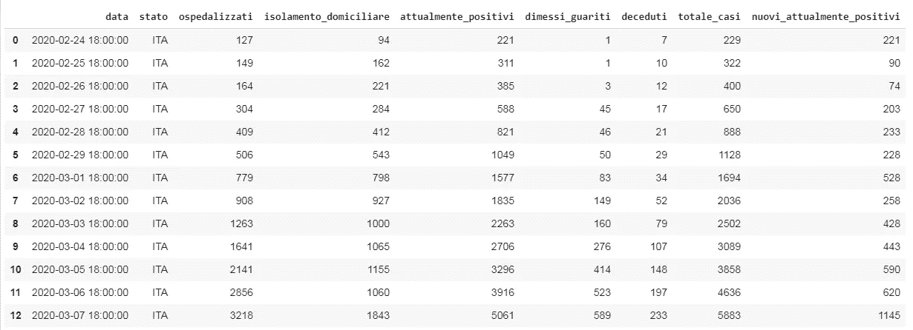
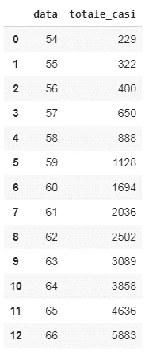
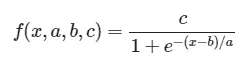
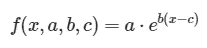
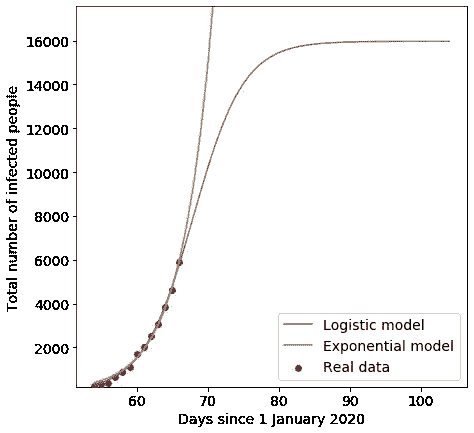

# 意大利的新冠肺炎感染。数学模型和预测

> 原文：<https://towardsdatascience.com/covid-19-infection-in-italy-mathematical-models-and-predictions-7784b4d7dd8d?source=collection_archive---------1----------------------->

## logistic 和指数模型在意大利新冠肺炎病毒感染中的比较。


Viktor Forgacs 在 [Unsplash](https://unsplash.com?utm_source=medium&utm_medium=referral) 上拍摄的照片

这些天来，世界正在与一个新的敌人作战，这就是**新冠肺炎**病毒。

自从在中国首次出现以来，这种病毒在世界上迅速传播。不幸的是，**意大利**正在记录欧洲新冠肺炎感染人数**最高**。我们是西方世界面对这个新敌人的第一个国家，我们每天都在与这种病毒的所有经济和社会影响作斗争。

在本文中，我将向您展示 Python 中感染增长的简单**数学**分析和**两个模型**，以更好地理解感染的演变。

# 数据收集

每天，[意大利民事保护部门](http://www.protezionecivile.gov.it/)都会刷新累计感染人数数据。此数据在 GitHub 上**公开**为公开数据:[https://raw . githubusercontent . com/PCM-DPC/新冠肺炎/master/dati-andamento-Nazionale/DPC-covid 19-ita-andamento-Nazionale . CSV](https://raw.githubusercontent.com/pcm-dpc/COVID-19/master/dati-andamento-nazionale/dpc-covid19-ita-andamento-nazionale.csv)

我的目标是创建到目前为止的**总感染人数的时间序列的**模型**(即实际感染人数加上已经感染的人数)。这些模型都有**参数**，将通过**曲线拟合**来估算。**

用 Python 来做吧。

首先，让我们导入一些库。

```
import pandas as pd
import numpy as np
from datetime import datetime,timedelta
from sklearn.metrics import mean_squared_error
from scipy.optimize import curve_fit
from scipy.optimize import fsolve
import matplotlib.pyplot as plt
%matplotlib inline
```

现在，我们来看看**原始数据**。

```
url = "https://raw.githubusercontent.com/pcm-dpc/COVID-19/master/dati-andamento-nazionale/dpc-covid19-ita-andamento-nazionale.csv"df = pd.read_csv(url)
```



我们需要的列是“totale_casi ”,它包含迄今为止的累计感染人数。

这是一切开始的原始数据。现在，让我们**为我们的分析准备**它。

# 数据准备

首先，我们需要将日期转换成数字。我们将从 1 月 1 日开始休假。

```
df = df.loc[:,['data','totale_casi']]FMT = '%Y-%m-%d %H:%M:%S'date = df['data']df['data'] = date.map(lambda x : (datetime.strptime(x, FMT) - datetime.strptime("2020-01-01 00:00:00", FMT)).days  )
```



我们现在可以分析我将参加考试的两个模型，它们是**逻辑函数**和**指数函数**。

每个模型有**三个参数**，这些参数将通过对历史数据的**曲线拟合**计算来估计。

# 逻辑模型

逻辑斯蒂模型被广泛用于描述人口的**增长。**感染可以被描述为病原体的增长，因此逻辑模型似乎**合理**。

这个公式在数据科学家中非常有名，因为它被用在逻辑回归分类器中，并作为神经网络的激活函数。

逻辑函数最通用的表达式是:



在这个公式中，我们有变量 *x* 即时间和三个参数: *a，b，c* 。

*   *a* 指感染速度
*   b 是发生感染最多的一天
*   *c* 是感染结束时记录的感染者总数

在高时间值时，感染人数**越来越接近**和 *c* ，在这一点上我们可以说感染**已经结束**。该函数在 *b* 处还有一个**拐点**，即一阶导数**开始降低**的点(即感染开始变得不那么具有攻击性并降低的峰值)。

我们用 python 来定义吧。

```
def logistic_model(x,a,b,c):
    return c/(1+np.exp(-(x-b)/a))
```

我们可以使用 *scipy* 库的 *curve_fit* 函数，从原始数据开始估计参数值和误差。

```
x = list(df.iloc[:,0])
y = list(df.iloc[:,1])fit = curve_fit(logistic_model,x,y,p0=[2,100,20000])
```

以下是这些值:

*   *答* : 3.54
*   *b* : 68.00
*   *c* : 15968.38

该函数也返回**协方差矩阵**，其对角线值是参数的方差。取它们的平方根，我们可以计算出标准误差。

```
errors = [np.sqrt(fit[1][i][i]) for i in [0,1,2]]
```

*   *a* 的标准误差:0.24
*   *b* 的标准误差:1.53
*   *c* 的标准误差:4174.69

这些数字给了我们许多有用的见解。

感染结束时的**预期感染人数**为 15968+/- 4174。

感染高峰**预计在 2020 年 3 月 9 日左右。**

**预期感染结束时间**可以计算为累计感染人数**等于**到四舍五入到最接近整数的 *c* 参数的那一天。

我们可以使用 *scipy* 的 *fsolve* 函数来数值求解定义感染结束日的方程的根。

```
sol = int(fsolve(lambda x : logistic_model(x,a,b,c) - int(c),b))
```

时间是 2020 年 4 月 15 日。

# 指数模型

逻辑模型描述的是 ain 感染增长**将在未来**停止，而指数模型描述的是**不可阻挡的**感染增长。例如，如果一个病人每天感染 2 个病人，1 天后我们会有 2 个感染，2 天后 4 个，3 天后 8 个，依此类推。

最普通的指数函数是:



变量 *x* 是时间，我们还有参数 *a，b，c* 。然而，其含义不同于逻辑函数参数。

让我们在 Python 中定义函数，并执行用于逻辑增长的相同曲线拟合过程。

```
def exponential_model(x,a,b,c):
    return a*np.exp(b*(x-c))exp_fit = curve_fit(exponential_model,x,y,p0=[1,1,1])
```

参数及其标准误差为:

*   一个 : 0.0019 +/- 64.6796
*   *b* : 0.2278 +/- 0.0073
*   *c* : 0.50 +/- 144254.77

# 情节

我们现在有了可视化结果的所有必要数据。

```
pred_x = list(range(max(x),sol))
plt.rcParams['figure.figsize'] = [7, 7]plt.rc('font', size=14)# Real data
plt.scatter(x,y,label="Real data",color="red")# Predicted logistic curve
plt.plot(x+pred_x, [logistic_model(i,fit[0][0],fit[0][1],fit[0][2]) for i in x+pred_x], label="Logistic model" )# Predicted exponential curve
plt.plot(x+pred_x, [exponential_model(i,exp_fit[0][0],exp_fit[0][1],exp_fit[0][2]) for i in x+pred_x], label="Exponential model" )plt.legend()
plt.xlabel("Days since 1 January 2020")
plt.ylabel("Total number of infected people")
plt.ylim((min(y)*0.9,c*1.1))plt.show()
```



两条理论曲线似乎都非常接近实验趋势。哪个做得更好？再来看看**残差**。

# 残差分析

残差是每个实验点和相应理论点之间的**差**。我们可以分析两个模型的残差，以验证最佳拟合曲线。在一级近似中，理论和实验数据之间的均方差越低，**越符合**。

```
y_pred_logistic = [logistic_model(i,fit[0][0],fit[0][1],fit[0][2]) for i in x]y_pred_exp =  [exponential_model(i,exp_fit[0][0], exp_fit[0][1], exp_fit[0][2]) for i in x]mean_squared_error(y,y_pred_logistic)
mean_squared_error(y,y_pred_exp)
```

Logistic 模型均方误差:8254.07

指数模型均方误差:16219.82

# 哪个型号合适？

残差分析似乎指向**逻辑模型**。很有可能是因为**感染应该在未来的某一天结束**；即使每个人都会被感染，他们也会发展出适当的免疫防御来避免二次感染。只要病毒**不会变异**太多(比如流感病毒)，就没错。

但是有一点**还是让我担心**。自从感染开始，我每天都在拟合逻辑曲线，每天**我都得到不同的参数值**。末感染人数**增加**，最大感染日往往是当天或次日(这个参数上兼容 1 天的标准误)。这就是为什么我认为，尽管逻辑模型似乎是最合理的一个，但曲线的形状**很可能会由于像新感染**热点**、政府**控制感染**的行动等外部影响而改变**。

这就是为什么我认为这个模型的预测只有在几周内，也就是感染高峰期过后，才会开始变得有用。

*编者按:*[*【towardsdatascience.com】*](https://slack-redir.net/link?url=http%3A%2F%2Ftowardsdatascience.com)*是一家以数据科学和机器学习研究为主的中型刊物。我们不是健康专家或流行病学家。想了解更多关于疫情冠状病毒的信息，可以点击* [*这里*](https://slack-redir.net/link?url=https%3A%2F%2Fwww.who.int%2Femergencies%2Fdiseases%2Fnovel-coronavirus-2019) *。*