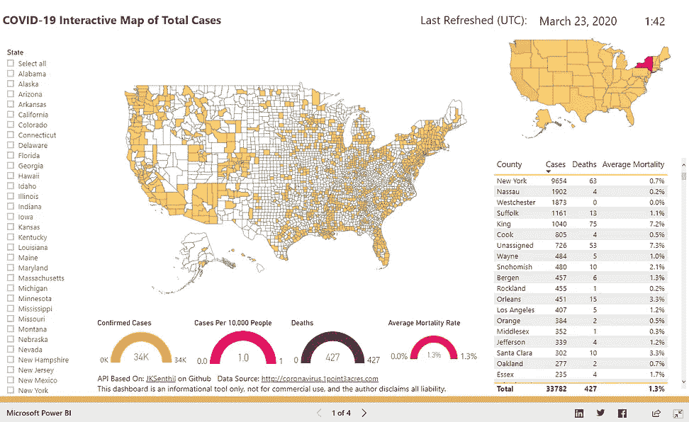
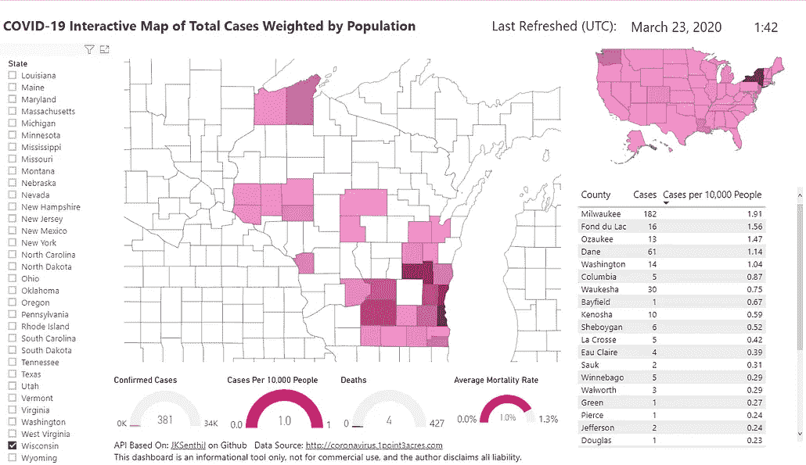

# 新冠肺炎-按美国州和县列出的所有案例的交互式 Power BI 地图

> 原文：<https://towardsdatascience.com/covid-19-interactive-power-bi-map-of-total-cases-by-us-state-and-county-e4ad7fdd0f10?source=collection_archive---------26----------------------->

## 疫情对全国的影响的局部视图

## TL；DR 链接到仪表板[此处](https://app.powerbi.com/view?r=eyJrIjoiMDkzZjQwNDMtZmI1Zi00YmVkLWExMTMtNDRjMjcwNWQ5ZGExIiwidCI6IjE1MjgxOGIxLTdmMTUtNDM3YS1hYzBiLTkyNDQwNzgwMzQ0ZCIsImMiOjN9&fbclid=IwAR0sB3j-SvuYu8dxdwSMX8Pp20m3eSBO7a5v6C1e6W6WgRrWn3-TwWz9IuA)

我和我妻子谈到美国各县是如何在新闻中单独报道新冠肺炎病例的。有很多地图追踪器用于世界和美国的州级报告，但没有多少地图在县一级整理。

她将此视为一项挑战，并在一个晚上就构建了这个惊人的公开可用的 Power BI 交互式仪表盘！

# 支持仪表板的 API 和数据:

最初，我们将这个令人敬畏的 GitHub API 归功于 GitHub 用户**JKSenthil:**[**【https://github.com/JKSenthil/coronavirus-county-api】**](https://github.com/JKSenthil/coronavirus-county-api)
，他构建了这个基于 python 的 API，从[**https://coronavirus.1point3acres.com/en**](https://coronavirus.1point3acres.com/en)抓取数据

但是，当 1point3acres 更改他们的 html UI 数据格式时，我们遇到了一些问题，这破坏了 API。我最终克隆了 API，并对其进行了编辑，使其起死回生(这占用了我周日的大部分时间)。但是，嘿，一个星期天花在帮助妻子上是值得的。:)

# API 分叉和调整:

API 使用 Selenium WebDriver，它运行一个无头 Chrome 来抓取 web URL，并将 API 数据作为 JSON 返回。API 是用 python 编写的，运行在通过 gunicorn 提供服务的 Flask 上，部署并托管在 Heroku 上。我遇到了一些问题:

问题# 1:API 中断是因为 scraper 失败。这源于源 UI 格式的变化。我可以通过调整抓取逻辑来解决这个问题。

问题#2: Heroku 的自由等级意味着我必须限制 gunicorn 的工人数量为 1。这对于应用程序来说不是问题，因为它是唯一请求数据的 API 用户。这些请求每隔几个小时才会刷新一次仪表板。

问题# 3:API 需要一段时间来响应，因为抓取器必须遍历美国所有 3200 多个县来抓取数据。我不得不将 gunicorn 的超时值提高到比默认值更长。

# 结束语:

总的来说，这是一次很酷的经历，特别是使用 Python 和 Heroku 主机。

我相信这张公共地图也揭示了有趣的县级统计数据和空间分布。随着美国新冠肺炎病例的增加，这一点尤其重要。在#隔离期间，帮助我的妻子做一个数据科学项目也很有趣！

如果您对该主题有任何想法或对仪表盘或所用工具有任何疑问，请通过 [LinkedIn](https://www.linkedin.com/in/lakshmananshankar) 与我联系

这里是交互式仪表盘的链接，它每 24 小时更新一次:[新冠肺炎美国仪表盘](https://app.powerbi.com/view?r=eyJrIjoiMDkzZjQwNDMtZmI1Zi00YmVkLWExMTMtNDRjMjcwNWQ5ZGExIiwidCI6IjE1MjgxOGIxLTdmMTUtNDM3YS1hYzBiLTkyNDQwNzgwMzQ0ZCIsImMiOjN9&fbclid=IwAR0sB3j-SvuYu8dxdwSMX8Pp20m3eSBO7a5v6C1e6W6WgRrWn3-TwWz9IuA)