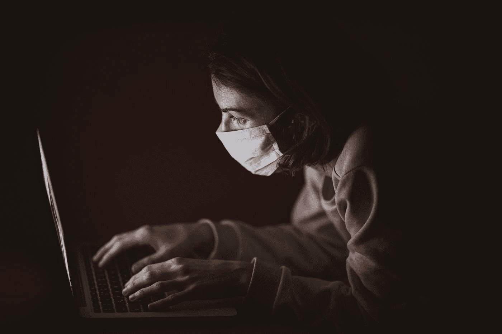

# 新冠肺炎正在改变我们的生活方式，而人工智能正在努力跟上

> 原文：<https://towardsdatascience.com/covid-19-is-changing-how-we-live-and-ai-is-struggling-to-keep-up-133e2fb0d7d7?source=collection_archive---------77----------------------->

## 根据过去行为训练的机器学习模型很难猜测我们的下一步行动

在 [Unsplash](https://unsplash.com?utm_source=medium&utm_medium=referral) 上 [engin akyurt](https://unsplash.com/@enginakyurt?utm_source=medium&utm_medium=referral) 拍摄的照片

本周，亚马逊建议我买一加仑的洗手液，谷歌的地理位置记录告诉我总共去过零个地方，YouTube 认为我可能会喜欢看更多的面具制作 DIY 和面包烘焙教程。

显然，自从疫情开始以来，我们的日常生活已经发生了变化。对我们中的许多人来说，我们买什么，去哪里，做什么都和以前有很大的不同。

在国际卫生危机期间，这些变化是意料之中的。然而，对于根据正常人类行为训练的人工智能系统来说，我们的新行动对它们的算法来说是一个相当大的冲击，它们正在努力跟上。

人工智能是一个包含很多东西的宽泛术语，但在这种情况下，我们谈论的是[机器学习](/clearing-the-confusion-ai-vs-machine-learning-vs-deep-learning-differences-fce69b21d5eb)。这些算法使用大量数据来找到一种模式，并对接下来会发生什么做出有根据的猜测。对于亚马逊来说，这个猜测就是你想买的东西。对于 YouTube 来说，就是你想看的。

无论我们是否意识到这一点，我们的生活已经深深扎根于机器学习模型。除了在线商店和流媒体应用，它们还用于欺诈检测、安全、营销等领域。

但是这些模型只能脱离给它们的数据。当他们遇到一个与他们从中学到的数据相差太大的场景时，他们很难猜到你要做什么。

## 当新冠肺炎开始影响我们的日常生活时，机器学习算法开始遇到一些问题。

[据《麻省理工技术评论》报道，](https://www.technologyreview.com/2020/05/11/1001563/covid-pandemic-broken-ai-machine-learning-amazon-retail-fraud-humans-in-the-loop/?utm_source=nextdraft&utm_medium=email)一家公司的预测算法被一次不寻常的批量订单打破。当算法告诉他们重新进货的商品不再与客户购买的商品匹配时，他们注意到了这一点。

类似的用户激增给一家在线流媒体公司使用的推荐算法带来了问题。他们发现用户数据的涌入降低了推荐的准确性。

对于一家信用欺诈检测公司来说，引起警惕的不是*如何*购买了多少，而是*购买了什么*。他们发现，人们突然开始购买园艺设备和电动工具，他们的算法通常会将其记录为欺诈性支出。

在这种情况下，公司的工程师们有先见之明，为消费习惯的改变做出了调整。

当发生重大变化时，像这样的修改对于保持机器学习算法的工作是必不可少的。你不能简单地训练自动化系统，然后走开。为了跟上时代，他们需要监督、调整，甚至可能需要一些再培训。

例如，亚马逊调整了他们的算法，以解释他们在购买中看到的变化。

它们通常会为使用其仓库的卖家带来流量，但当疫情开始，人们开始更多地在网上购物时，仓库变得不堪重负。通过调整他们的算法，他们能够让订单更均匀地分配给卖家。

另一家使用机器学习来编写广告电子邮件的公司也对他们的算法进行了一些修改。他们的系统选择最好的短语来使用，但在当前全球疫情的情况下，该公司认为最好避免某些短语，如“病毒式传播”

展望未来，随着我们的生活在疫情期间和之后继续进化，负责维护机器学习模型的计算机科学团队将需要继续做出这些改变。这样，我们正在经历的新世界将会在算法的行为中得到反映。

## 这也适用于新的机器学习模型的开发，这些模型是为了响应疫情而创建的。

随着新冠肺炎病毒带来的种种不确定性，科学家们一直在开发预测该病毒未来的算法。

在[5 月 19 日](https://www.nature.com/articles/s41591-020-0931-3)发表的一项研究中，西奈山医院的研究人员将胸部 CT 扫描和患者数据与机器学习模型相结合，以诊断新冠肺炎患者。他们发现，在某些情况下，他们的算法在确定哪个病人感染了病毒方面甚至比高级胸科放射科医生还要好。

其他医院迫切希望了解哪些病人会病情危急，甚至已经开始使用尚未验证的算法。

机器学习也被用于预测病毒的传播，并确定隔离和社会距离等缓解措施的效果。

伦斯勒理工学院的研究人员将这些努力集中在单个城市。他们指出，较小的城市更难建模，因为训练算法的数据较少。在这些情况下，他们需要做出调整以做出准确的预测。

就像影响我们日常生活其他方面的算法一样，随着我们对病毒的了解越来越多，并适应新常态，这些模型也必须更新。

AI 的目的是让我们的生活更简单。机器学习模型在许多不同的行业中以许多不同的方式做到这一点。但是，随着这种相互联系，我们有必要共同成长。否则，他们就有被落下的危险。