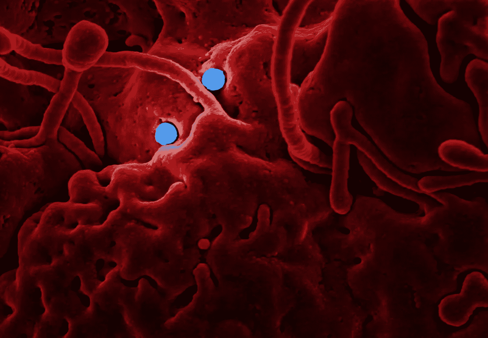
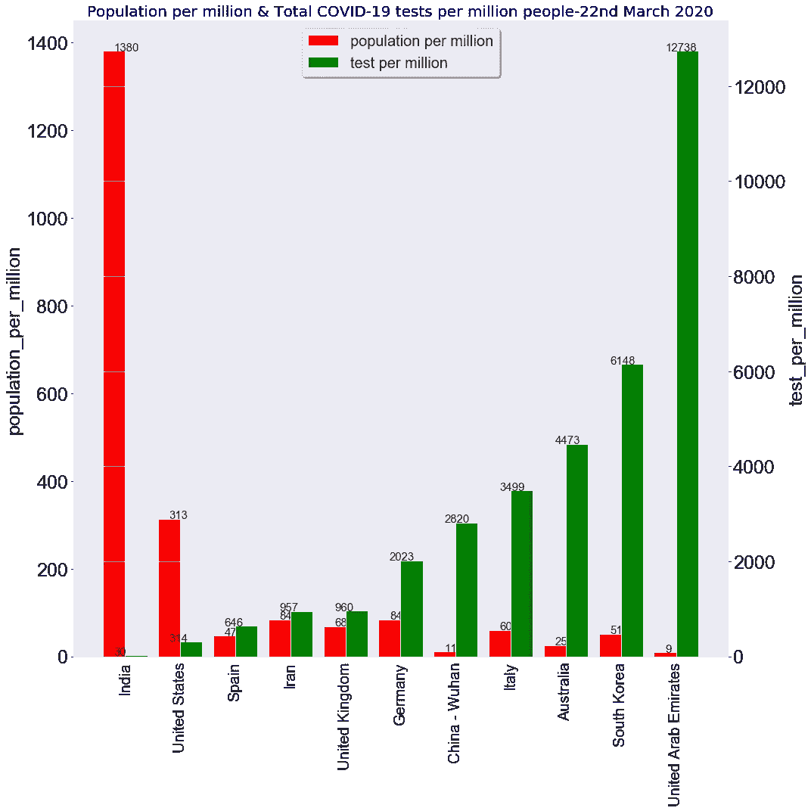
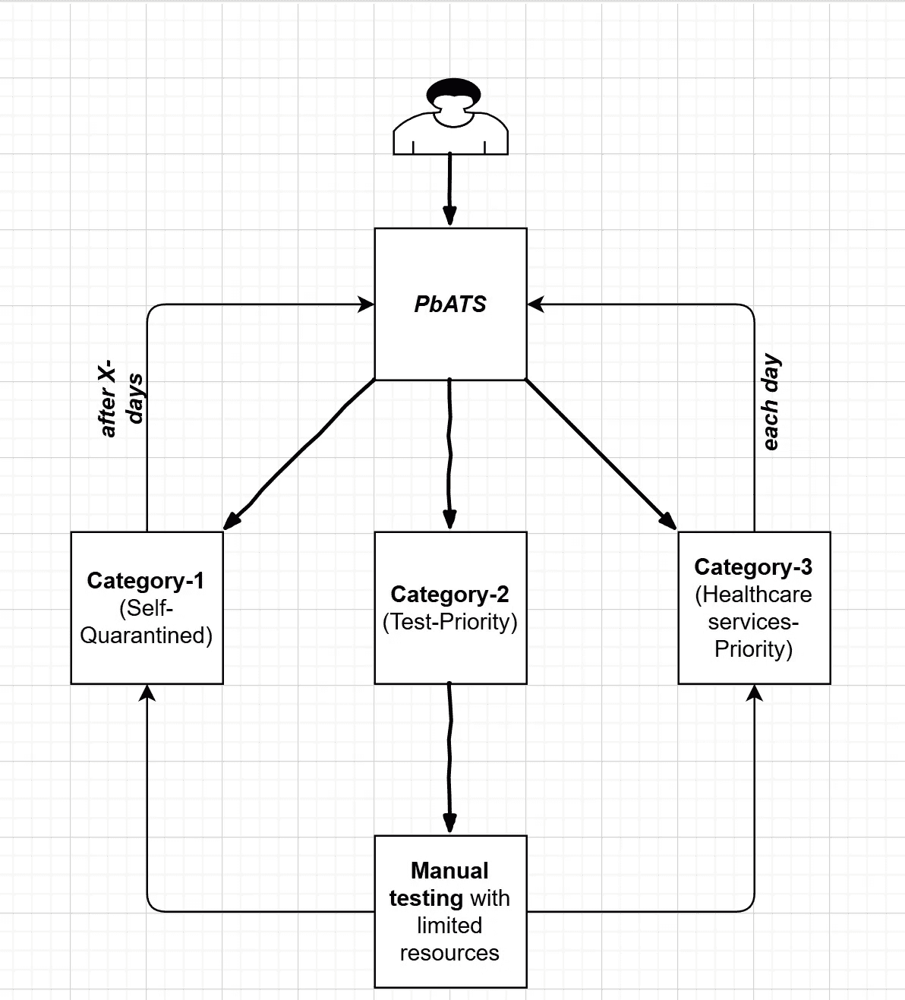
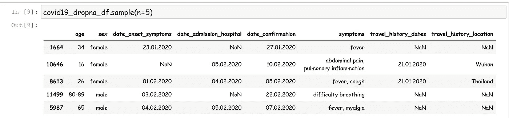
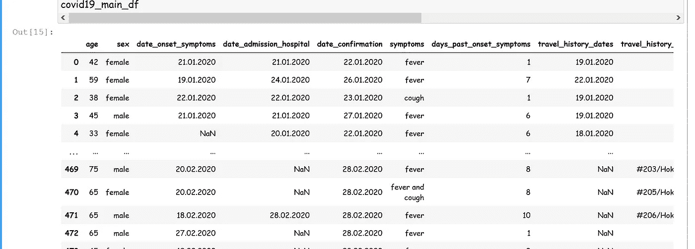
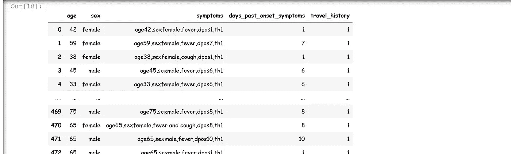
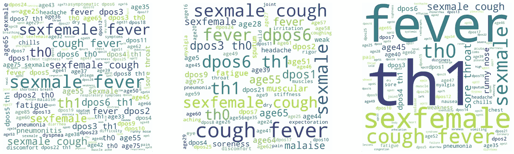
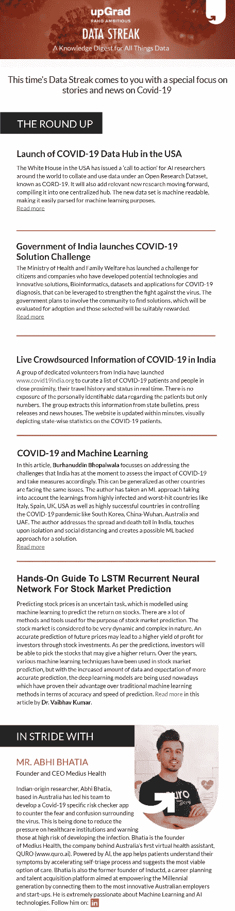

# 新冠肺炎和机器学习

> 原文：<https://towardsdatascience.com/covid-19-machine-learning-4f064df53c43?source=collection_archive---------13----------------------->

## 一种潜在的机器学习方法，可以帮助控制新冠肺炎

****成功提交:***[***【https://innovate.mygov.in/covid19/】***](https://innovate.mygov.in/covid19/)*

**

*信用:[https://unsplash.com/](https://unsplash.com/)*

> ***注:** **注:**我的方法将侧重于解决**印度**(我的祖国)在评估新冠肺炎的影响时所面临的挑战。但是下面的方法很容易推广，因为其他受影响的国家也面临着与印度类似的挑战。*
> 
> *此外，我通过考虑从高感染和受打击最严重的国家(如意大利、西班牙、英国、美国)以及在控制新冠肺炎疫情方面非常成功的国家(如韩国)获得的经验，制定了这个 ML 方法；中国-武汉，澳大利亚，**阿联酋**！*

# *目录？*

1.  ****解决控制印度新冠肺炎病毒传播和死亡人数的主要问题/挑战&其他国家？****
2.  ****我提出的想法/解决方案****
3.  ****ML 问题公式化&解决上述挑战的解决方案****
4.  ****一种潜在的 ML 方法/解决方案****
5.  ****这是长久之计吗？****

# ***1: *解决印度控制新冠肺炎病毒传播和死亡人数的主要问题/挑战&其他国家？****

***—问题是:***

****缺乏专注的测试！！！****

****1.1:为什么测试很重要****

*   *测试让受感染的人知道他们被感染了。这可以帮助他们接受所需的护理，也可以帮助他们采取措施降低感染他人的概率。不知道自己被感染的人可能不会呆在家里，从而有感染他人的风险。*
*   *测试对于适当应对疫情也至关重要。它让我们了解疾病的传播，并采取循证措施减缓疾病的传播。*
*   *不幸的是，在许多国家，包括印度和世界各地，新冠肺炎检测的能力仍然很低。由于这个原因，我们仍然没有很好地了解疫情的传播。*

**新冠肺炎考试如何进行:* [*这里*](https://www.youtube.com/watch?v=AUmVgDlutE0)*

****1.2:那么，测试阈值应该是多少呢？****

*为了找到这一点，我们需要理解可视化。我还在下面附上了整个 ***ipython*** 笔记本的链接。*

*数据来源:[https://ourworldindata.org/](https://ourworldindata.org/grapher/covid19-tests-per-million-people)*

**

*百万分之 2 Y 轴条形图*

*   *像 ***中、汉、韩、澳*** 这样的国家在拉平新冠肺炎传播曲线方面一直很繁荣，因为他们根据每百万人口增加了每百万人口的检测。*

> *显然，从上面的可视化中，我们可以得出结论，为了控制新冠肺炎传播，**(test _ per _ million≥population _ per _ million * 100)意味着 100 万人口需要至少 100 个测试容量。***

*像印度、美国、英国、西班牙和意大利这样的国家还没有达到上述检测标准，并且仍然在与新冠肺炎疫情做斗争，甚至还在与每百万人口检测做斗争。*

****1.3:对印度&其他国家来说，增加每百万人的检测数量有哪些挑战？还有为什么需要倍数？****

*   ****印度&其他受影响的国家卫生资源有限。印度每万人拥有 8 名医生，而意大利和韩国分别为 41 名和 71 名。****
*   **疾病的早期(最初 1-3 天)病毒载量太低，无法检测。这会导致假阴性，因此需要多次测试/个体，最终导致每百万人的测试应至少大于或等于每百万人口的 100 倍，这一点我们可以从其他成功国家的数据中学习。**
*   **测试是一个手动过程，导致* ***处理&人为错误*** *。**

**为什么我们没有足够的新冠肺炎测试(详细):* [*这里*](https://medium.com/@ASlavitt/why-we-dont-have-enough-coronavirus-tests-3cfee1c47264)*

# *2:我提出的想法/解决方案*

*所以，如果问题是缺乏集中测试！！！那么新冠肺炎疫情的解决方案就是:*

> ***“测试测试测试&然后检疫”***

*但是，我已经提到，增加检测数量的挑战不是微不足道的，特别是当印度和其他国家，甚至美国、英国、意大利和伊朗，也有最少的卫生资源和同样的问题。*

*在计算机科学中，有一句流行的话:**“最好的解决方案是最简单的！”**。我们需要在很短的时间内增加每百万测试的数量，这里我提出了我对这个问题的想法/解决方案:*

> *我们应该使用**基于优先级的自动化测试系统(PbATS)** 使用 ML/AI 来区分测试的优先级。这有助于确定测试的优先级，并有助于确定提供有限医疗服务的优先级。*
> 
> *使用 PbATS，我们将根据他们的输入对人群进行分类。为此，假设我们将人口分为以下三类:*
> 
> ***类别 1(自我隔离):**它们要么未受影响，要么仍未显示系统，但已受影响(假阴性)。它主要包含了未受影响的&一些假阴性病例。因此，他们需要定期接受 PbATS，直到特定的持续时间。*
> 
> ***类别 2(测试优先级):**该类别包含一些假阴性，但开始显示症状，因此需要手动测试*
> 
> ***第 3 类** **(医疗保健服务-优先)**:这一类由极有可能感染新冠肺炎病毒的人组成，因此，他们应该被严格隔离，并得到优先的医院服务。*

**

*PbATS 工作流程*

> ***注:** **这种 PbATS 机制将是一种 AI/ML 方法，我们根据过去所有新冠肺炎患者的历史数据对这三个类别进行分类**。众所周知，“所有的机器学习模型都是错误的，只有一些是有用的”——考虑到这一点，我的解决方案包含对类别 1 和类别 3 的多次尝试，因为类别 2 已经有了手动测试。*
> 
> ***此外，在领域专家/新冠肺炎专家的帮助下，可以准确确定类别数量和周期。***

# *3:解决上述挑战的 ML 问题公式和解决方案*

*现在，为了让上述解决方案发挥作用，我们需要鲁棒的 PbATS。现在，我将展示一种使用机器学习技术构建这种 PbATS 的潜在方法。*

> ****ML 问题公式化:*** *我们需要根据那里、特征(年龄、性别)、症状、过往旅行史对人群进行分类。**

> ***解决方案工作流程:**一旦该 PbATS 准备就绪，每个人都需要通过数字方式或通过志愿者填写他们的详细信息(以最大限度地减少错误)，然后医生可以轻松确定测试/医疗保健服务的优先级，并选择要隔离的人。这有助于医生和政府用最少的卫生资源阻止新冠肺炎。*

**最终，这种 PbATS 机制将间接帮助政府&医疗服务提供者增加****test _ per _ million****根据* ***人口 _per_million*** *阻止新冠肺炎传播所需的。**

# *4:潜在的 ML 方法/解决方案*

****4.1:数据？*** 对于这一点，我已经取了数据，刮了数据(使用文本挖掘技术)，并把它们串联起来。数据来源如下:*

*   *[https://ourworldindata.org/coronavirus](https://ourworldindata.org/coronavirus)*
*   *[https://www.kaggle.com/tags/covid19](https://www.kaggle.com/tags/covid19)*
*   *[https://www . who . int/docs/default-source/corona virus/situation-reports/2020 03 23-sit rep-63-covid-19 . pdf？sfvrsn=d97cb6dd_2](https://www.who.int/docs/default-source/coronaviruse/situation-reports/20200323-sitrep-63-covid-19.pdf?sfvrsn=d97cb6dd_2)*

****下面是原始数据的样子:****

**

*原始数据样本*

****4.2:数据清理后:****

**

*数据清理*

****4.3:然后，我做了一些特色工程如下:****

*   *将年龄范围(60-65)转换为平均值(62.5)*
*   *增加了 ***日期 _ 过去 _ 发病 _ 症状(dpos)*** 这是天数 b/w 日期 _ 确认的差异&日期 _ 发病 _ 症状*
*   *基于 travel _ history _ dates&travel _ history _ locations 之间的操作，增加了***travel _ history(th)***标志*
*   *最后，将来自整个数据点的所有特征合并为一个 ***主症状/混合症状*** 。我这样做的原因稍后会更明显*

****4.4:最终数据集:****

**

*最终数据集*

****4.5:主症状上的自然语言处理****

*然后，我执行了所有标准的 NLP 技术来矢量化主症状。我用过***BoW+W2V(word 2 vec-gensim)***。我使用 W2V 是因为我需要根据**关系(不是相似性&计数)**对症状进行聚类，这有助于聚类过程。*

*我使用了 ***BoW，而不是 TF-IDF*** ，因为我们的数据集没有很多罕见的、出现的、需要更多重要性的单词。*

****4.6: ML 聚类:****

**最后，我用****k means++****做了聚类(最通用)。我们使用肘方法得到的聚类数也是 3(巧合的是)，但是也可以使用更多的* ***领域知识*** *来改变它！**

****4.7:结果/词云:****

**

*基于 3 个聚类的主症状，dpos:过去发病天数-症状，th:旅行史*

****最终类别:*** 从上面**主症**的词云可以看出，我们可以大致将易发人群归类为:*

> ***第 3 类(医疗保健服务-优先):**【年龄在 30-75 岁之间】+【发热、咳嗽、呼吸道感染、流鼻涕、喉咙痛、肺炎、头痛、胸闷(主要有**dpos>4**)+[**th-1**经常旅行记录】*
> 
> ***第 2 类(测试优先):**【年龄在 0-75 岁之间】+【发热、咳嗽、不适、肺炎、僵硬、关节、肌肉酸痛以及**dpo 在 1-3 之间** ] + [ **th-0/1** 活动或不活动的旅行记录】*
> 
> ***第 1 类(自我隔离):**【年龄在 0-75 岁之间】+【发热、咳嗽、虚弱、腹泻、头晕、寒战，dpos 在 1-3 之间】+[**th-0**大部分无旅行史，也有一些有旅行史】*

****学问:*** *我们可以看到，症状模式***取决于* ***年龄，*** *主要以新冠肺炎为例，而变得严重的有****dpos****我的努力只是为了检测这些模式，以便优先使用 PbATS 进行测试。***

**Jupyter 笔记本**

> **类似实现:[此处](https://coronariskcalculator.in/)**

# **5:这是永久的解决方案吗？**

*****根本没有！*** 上述解决方案仅通过有限的医疗服务帮助印度和其他国家阻止新冠肺炎的传播。因此有助于遏制 Sars-CoV-2。**

**这种永久性的解决方案是 ***疫苗*** ，需要数周甚至数月才能准备好。通过使用现有病毒疫苗(Sars-1，西班牙流感)等的组合找到疫苗，这种缺口也可以使用 ML/AI 容易地发现。，使用 ML/AI 技术。**

****最后**，是的，上述方法解决了医疗资源有限的问题。尽管如此，像印度和其他国家需要每百万人口中至少有 30%-40%的医疗资源(床位/呼吸机)用于第三类。**

*****这个博客是我对在印度盛行的新冠肺炎 esp 战斗的一点微薄贡献。报送:***[***https://innovate.mygov.in/covid19/***](https://innovate.mygov.in/covid19/)**

**差不多就是这样！*【bbhopalw@gmail.com】接:***

******PS:******

*   ***关于数据集的请求——我已经把用 nodeJS* *编写的* ***数据集& Web 抓取代码都开源了，可以在我的 GitHub 上获得。*****
*   ***关于* ***合作*** *，请直接发邮件给我。***
*   ***这是博客原文。读者可能会在其他数据科学* ***简讯(upGrad，DS news)*** *中找到这一点(再版！).***

****

**再版—时事通讯**

*****连接*** 🤝 ***:*****

*   *****邮箱***:*bbhopalw @ Gmail***
*   *****Linkedin***:[*www.linkedin.com/in/bbhoaplw*](http://www.linkedin.com/in/bbhoaplw)**

*****延伸阅读***✍️***:*****

*****大数据&云工程博客:*****

*   *****走向数据科学出版:***[*https://medium.com/@burhanuddinbhopalwala*](https://medium.com/@burhanuddinbhopalwala)**

*****后端工程&软件工程博客:*****

*   *****DEV 社区:*** [*https://dev.to/burhanuddinbhopalwala*](https://dev.to/burhanuddinbhopalwala)**