# 基于新冠肺炎机器学习的普通实验室检查快速诊断

> 原文：<https://towardsdatascience.com/covid-19-machine-learning-based-rapid-diagnosis-from-common-laboratory-tests-afafa9178372?source=collection_archive---------41----------------------->

## 塔尔西斯·苏扎博士、古斯塔沃·文泽尔·塞纳托医学博士和赫利·苏扎医学博士

## 来自巴西 5644 名患者的证据


由 [Unsplash](https://unsplash.com?utm_source=medium&utm_medium=referral) 上的[融合医学动画](https://unsplash.com/@fusion_medical_animation?utm_source=medium&utm_medium=referral)拍摄的照片

# 摘要

*   *新冠肺炎病例的突然快速增长正在使全球卫生系统不堪重负。快速、准确和早期检测新型冠状病毒对控制病毒传播至关重要。然而，基于 RT-PCR 分析的传统新型冠状病毒检测可能成本高、耗时长且普遍不可用，使得检测每个病例成为不切实际的努力。*
*   *我们提出了一种基于机器学习的方法，使用通常可用的实验室测试数据来快速检测新冠肺炎病例。*
*   *我们分析了巴西圣保罗的以色列阿尔伯特爱因斯坦医院的 5644 名患者样本，其中 558 名患者的新型冠状病毒检测呈阳性。考虑到原始样本数据的⅓的保留测试组，所提出的模型呈现出 92% (AUC)的总体高性能。*
*   *我们观察到，有新冠肺炎症状且鼻病毒、肠病毒、B 型流感和 Inf 检测呈阴性的患者。2009 年甲型 H1N1 流感，白细胞和血小板水平较低，更有可能检测出新型冠状病毒阳性。*
*   *我们提出了一个基于不同场景的参数模型，这些场景是作为目标敏感度水平或医院有能力优先处理的潜在阳性病例总数的函数给出的。*
*   *在 25%的患者被认为是新型冠状病毒阳性的情况下，所提出的模型显示出分别超过 84%和 96%的灵敏度和特异性，因此被证明是一种有用的快速优先化工具。*

# 介绍

## 背景

世界卫生组织(世卫组织)在 3 月 11 日将由新型冠状病毒引起的新冠肺炎定性为疫情，而病例数量的指数级增长有可能使世界各地的卫生系统不堪重负，对 ICU 床位的需求远远超过现有能力，意大利的一些地区就是突出的例子。

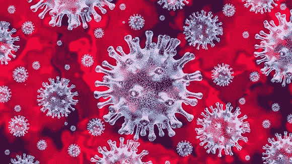

巴西于 2 月 26 日记录了第一例新型冠状病毒，病毒传播从仅输入病例发展到当地并最终社区传播非常迅速，联邦政府于 3 月 20 日宣布全国社区传播。

截至 2020 年 3 月 27 日，圣保罗州记录了 1223 例新冠肺炎确诊病例，68 例相关死亡，而截至 3 月 23 日，拥有约 1200 万人口和以色列阿尔伯特·爱因斯坦医院所在地的圣保罗州有 477 例确诊病例和 30 例相关死亡。该州和圣保罗县都决定建立隔离和社会距离措施，这将至少持续到 4 月初，以努力减缓病毒的传播。

## 动机和目标

这项工作的目标是根据通常收集的实验室检查结果预测疑似病例中的确诊新冠肺炎病例。我们考虑以下研究问题:

*根据在急诊室就诊期间通常为疑似新冠肺炎病例收集的实验室检测结果，是否有可能预测 SARS-Cov-2 的检测结果(阳性/阴性)？*

这项工作的一个动机是，在卫生系统不堪重负的情况下，对新型冠状病毒的检测进行测试可能会受到限制，测试每个病例是不切实际的，考虑到测试结果需要 48 小时到一整周的时间，即使只测试一个目标亚群，测试也可能会被推迟。

## 贡献

我们提出了一个简单的模型来快速预测感染新型冠状病毒病毒风险最高的患者，使他们能够得到优先考虑，并有可能采取隔离措施和相关的医疗程序。我们的贡献有三个方面:

1.  新型冠状病毒的快速高准确度测试:提议的模型仅基于通常可获得的实验室测试数据，其表现出 92%的 AUC 和大于 85%的灵敏度水平以及大于 85%的合理特异性水平的高性能
2.  可解释性:变量的重要性和与结果变量的条件依赖性很容易从模型中提取出来，其解释可以指导医疗决策
3.  灵活性:根据目标敏感度水平、医院能力和疾病流行程度，模型构建可灵活适应不同的政策情景

# 资料组

该数据集包含在巴西圣保罗的以色列阿尔伯特爱因斯坦医院就诊的患者的匿名数据，这些患者在就诊期间收集了样本以进行新型冠状病毒 RT-PCR 和其他实验室测试。


巴西圣保罗的阿尔伯特·爱因斯坦医院收集并提供了该数据集。

所有数据都按照最佳国际惯例和建议进行了匿名处理。所有的临床数据被标准化为平均值为零和单位标准差。

该数据集包含 109 个变量(预测因子)，一个患者 ID 和一个目标结果变量，该变量指示患者是否对 SARS-Cov-2 检测为阳性/阴性。有 5644 个样本可用，其中有 558 个阳性病例，占数据集的 10%。

## 数据准备

首先，我们执行一些基本的数据清理程序:

1.  通过删除特殊字符、空格和符号，使变量名在语法上有效
2.  将表示缺失数据的字符串转换为 **NA** ，即以下值:“no realization do”和“not_done”
3.  将字符串分类值转换为因子
4.  将变量**尿…pH** 转换为数值，因为它在输入数据中包含字符串和数值的混合

我们的结果变量被命名为 **SARS。Cov.2.exam.result** ，它是一个二元变量，表示患者对 SARS-COV2 病毒的检测是阳性还是阴性。我们将此变量转换为$SARS。Cov.2.exam.result = 1$，如果患者检测为阳性，则为$SARS。Cov.2.exam.result = 0$，否则。

如下所示，大多数变量都有很高的缺失值百分比(NA)。这里的问题是，在我们提出的预测建模中，当数据被分成交叉验证/自举子样本时，这些预测器可能成为零方差预测器。


因此，我们去除了有太多缺失数据点(> = 95%)的变量。我们还去除了实验室数据中过于稀疏的样本，我们选择保留至少有 10 个变量和数据点的阴性样本。这样做是为了避免过拟合的情况，在过拟合的情况下，少数样本(稀疏但正的)可能会对预测模型产生不适当的影响。

删除了以下变量:

```
[1] "Serum.Glucose" [2] "Mycoplasma.pneumoniae" [3] "Alanine.transaminase" [4] "Aspartate.transaminase" [5] "Gamma.glutamyltransferase." [6] "Total.Bilirubin" [7] "Direct.Bilirubin" [8] "Indirect.Bilirubin" [9] "Alkaline.phosphatase" [10] "Ionized.calcium." [11] "Magnesium" [12] "pCO2..venous.blood.gas.analysis." [13] "Hb.saturation..venous.blood.gas.analysis." [14] "Base.excess..venous.blood.gas.analysis." [15] "pO2..venous.blood.gas.analysis." [16] "Fio2..venous.blood.gas.analysis." [17] "Total.CO2..venous.blood.gas.analysis." [18] "pH..venous.blood.gas.analysis." [19] "HCO3..venous.blood.gas.analysis." [20] "Rods.." [21] "Segmented" [22] "Promyelocytes" [23] "Metamyelocytes" [24] "Myelocytes" [25] "Myeloblasts" [26] "Urine...Esterase" [27] "Urine...Aspect" [28] "Urine...pH" [29] "Urine...Hemoglobin" [30] "Urine...Bile.pigments" [31] "Urine...Ketone.Bodies" [32] "Urine...Nitrite" [33] "Urine...Density" [34] "Urine...Urobilinogen" [35] "Urine...Protein" [36] "Urine...Sugar" [37] "Urine...Leukocytes" [38] "Urine...Crystals" [39] "Urine...Red.blood.cells" [40] "Urine...Hyaline.cylinders" [41] "Urine...Granular.cylinders" [42] "Urine...Yeasts" [43] "Urine...Color" [44] "Partial.thromboplastin.time..PTT.." [45] "Relationship..Patient.Normal." [46] "International.normalized.ratio..INR." [47] "Lactic.Dehydrogenase" [48] "Prothrombin.time..PT...Activity" [49] "Vitamin.B12" [50] "Creatine.phosphokinase..CPK.." [51] "Ferritin" [52] "Arterial.Lactic.Acid" [53] "Lipase.dosage" [54] "D.Dimer" [55] "Albumin" [56] "Hb.saturation..arterial.blood.gases." [57] "pCO2..arterial.blood.gas.analysis." [58] "Base.excess..arterial.blood.gas.analysis." [59] "pH..arterial.blood.gas.analysis." [60] "Total.CO2..arterial.blood.gas.analysis." [61] "HCO3..arterial.blood.gas.analysis." [62] "pO2..arterial.blood.gas.analysis." [63] "Arteiral.Fio2" [64] "Phosphor" [65] "ctO2..arterial.blood.gas.analysis."
```

其余的变量如下:

`[1] "Patient.age.quantile" [2] "SARS.Cov.2.exam.result" [3] "Patient.addmited.to.regular.ward..1.yes..0.no." [4] "Patient.addmited.to.semi.intensive.unit..1.yes..0.no." [5] "Patient.addmited.to.intensive.care.unit..1.yes..0.no." [6] "Hematocrit" [7] "Hemoglobin" [8] "Platelets" [9] "Mean.platelet.volume" [10] "Red.blood.Cells" [11] "Lymphocytes" [12] "Mean.corpuscular.hemoglobin.concentration..MCHC." [13] "Leukocytes" [14] "Basophils" [15] "Mean.corpuscular.hemoglobin..MCH." [16] "Eosinophils" [17] "Mean.corpuscular.volume..MCV." [18] "Monocytes" [19] "Red.blood.cell.distribution.width..RDW." [20] "Respiratory.Syncytial.Virus" [21] "Influenza.A" [22] "Influenza.B" [23] "Parainfluenza.1" [24] "CoronavirusNL63" [25] "Rhinovirus.Enterovirus" [26] "Coronavirus.HKU1" [27] "Parainfluenza.3" [28] "Chlamydophila.pneumoniae" [29] "Adenovirus" [30] "Parainfluenza.4" [31] "Coronavirus229E" [32] "CoronavirusOC43" [33] "Inf.A.H1N1.2009" [34] "Bordetella.pertussis" [35] "Metapneumovirus" [36] "Parainfluenza.2" [37] "Neutrophils" [38] "Urea" [39] "Proteina.C.reativa.mg.dL" [40] "Creatinine" [41] "Potassium" [42] "Sodium" [43] "Influenza.B..rapid.test" [44] "Influenza.A..rapid.test" [45] "Strepto.A"`

# 预测分析

## 模特培训

为了预测患者感染 SARS-Cov2 病毒的可能性，我们将数据集随机分为训练和测试测试，训练与测试的分割比为 2/3。我们分解数据集，使得结果变量也遵循训练集和测试集之间的相同分割比。

我们使用剩余的数据集变量作为预测器来训练 GBM 模型。我们还定义了一个袋分数，它定义了随机选择的训练集观察值的分数，以提出扩展中的下一棵树。这将随机性引入模型拟合，并减少过度拟合。

## 模型可解释性

我们通过观察变量的相对重要性以及它们相对于结果变量的条件依赖概率来评估模型的可解释性。模型解释是重要的，因为它们可以用来改善医疗决策和指导政策制定的倡议。

模型返回的前 10 个最重要的变量如下所示。重要性度量是标准化的，它们基于变量被选择用于树分裂的次数，由作为每个分裂的结果的模型的改进来加权，并在所有树上平均。

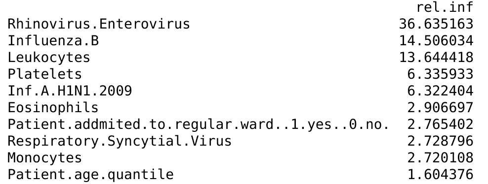

我们分析了下面 5 个最重要变量的条件概率图，其中 x 轴代表预测值，y 轴代表感染的可能性(数字是归一化的)。我们观察到以下情况:

1.  当鼻病毒。肠病毒，流感。b 或 Inf。甲型 H1N1.2009 未被检测到，患者更有可能检测出 SARS-COV2 阳性
2.  白细胞或血小板低的患者更有可能检测出 SARS-COV2 阳性

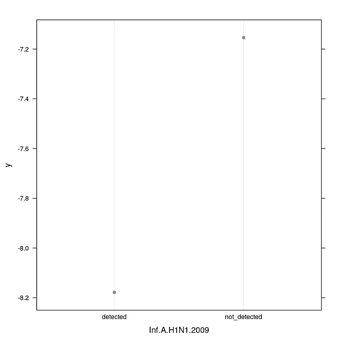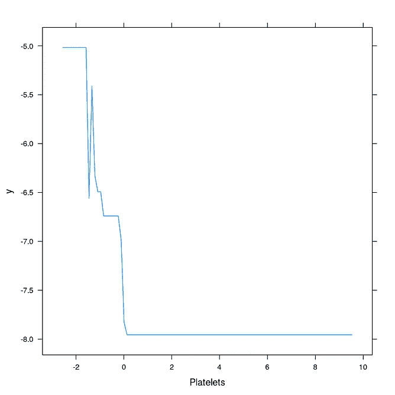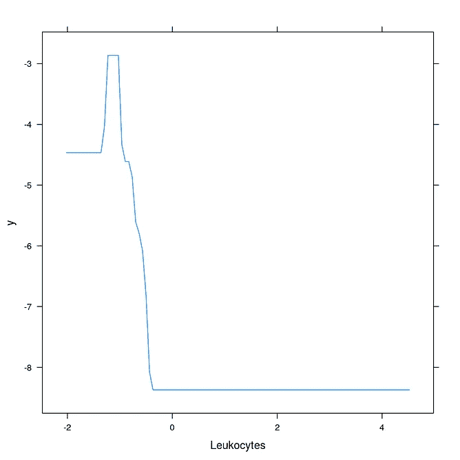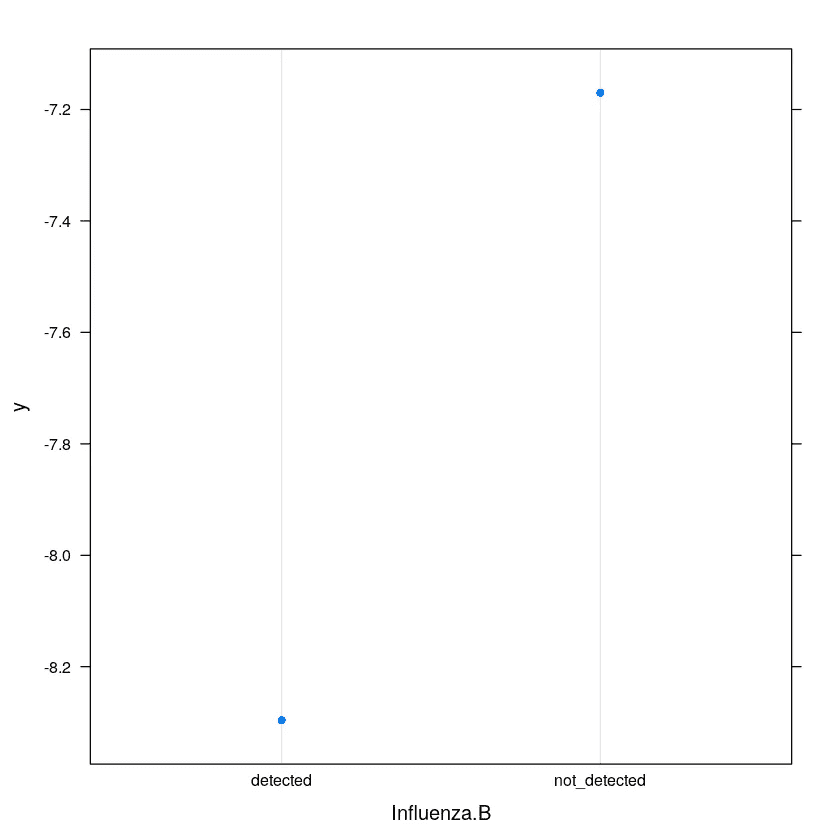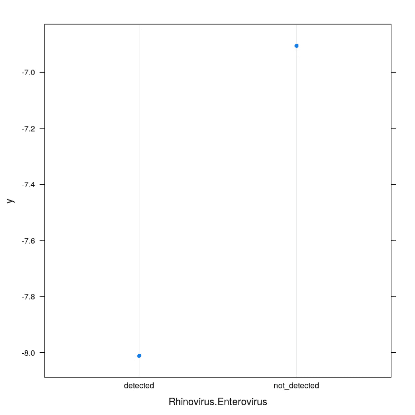

作为严重新冠肺炎病例的主要指标，一个被广泛讨论的变量是年龄。因此，我们分析变量 *age_quantile* 和之前讨论的前 5 个最重要的变量之间的二元关系。我们观察到，当与研究的其他前 5 个变量结合时，患者的年龄分位数可以增加 SARS-COV2 感染的可能性。

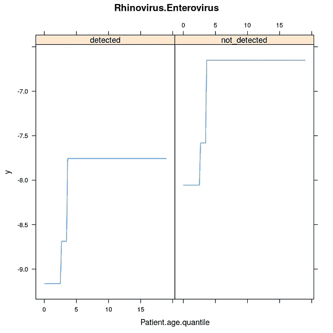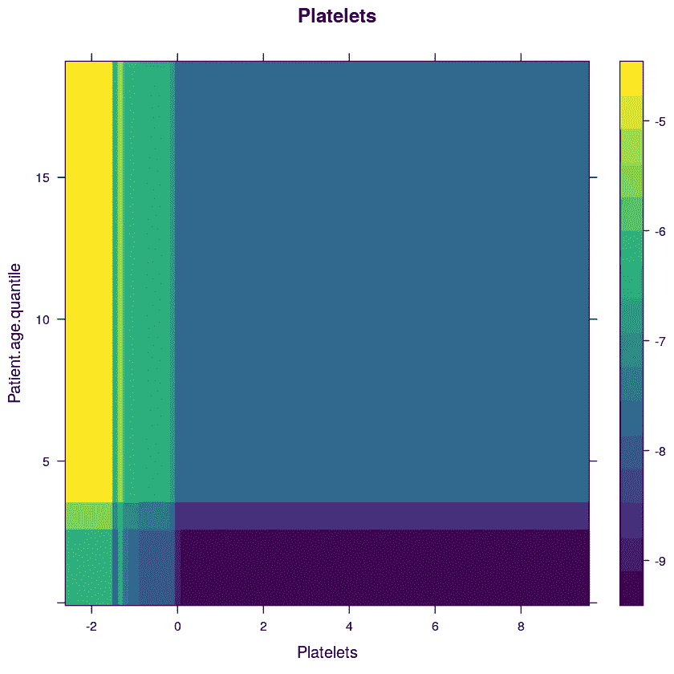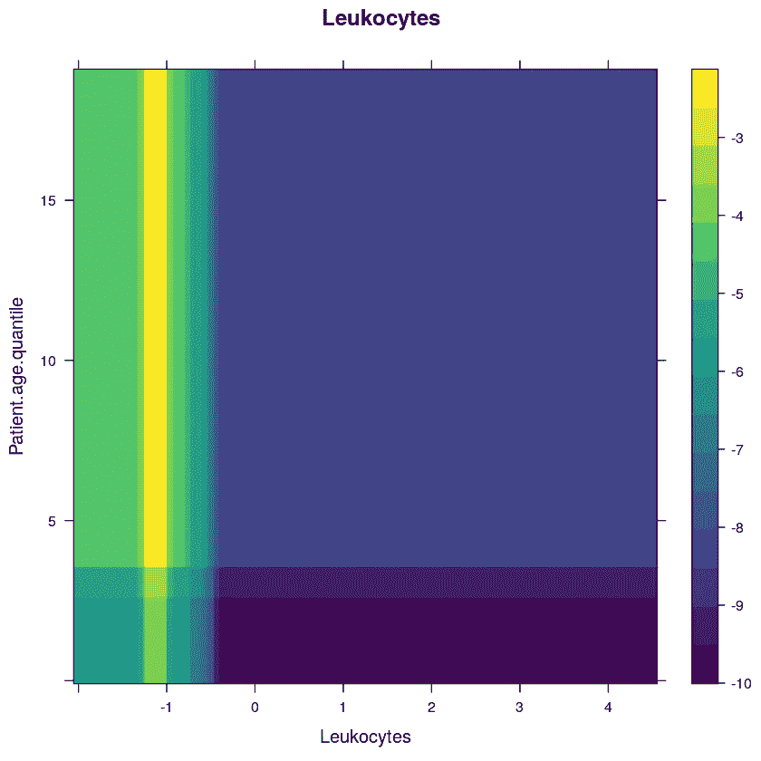

## **预测**

我们将训练好的模型应用于 668 名患者的测试数据集。我们观察到该模型表现非常好，AUC 为 92%。然而，模型的特异性和敏感性的确定依赖于可能性阈值的定义，以确定在疑似病例中被认为可能是阳性新冠肺炎病例的患者。

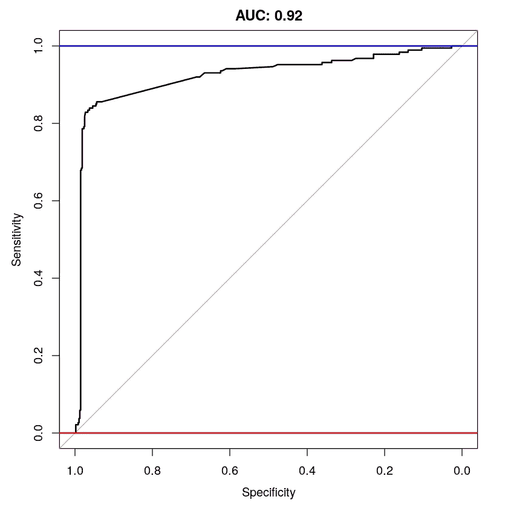

下面我们可以看到阈值的选择如何影响模型的灵敏度和特异性(使用训练集的样本内分析)。具有高灵敏度的模型在那些真正的阳性患者中找到阳性患者方面取得了良好的结果。然而，预测为阳性的患者数量可能过高，并影响模型的特异性。此外，如果这个数字太高，医院可能没有足够的资源来为所有被分配了阳性标签的患者应用必要的程序。因此，理想的模型是平衡良好的模型，即，具有高灵敏度但不会给患者过多分配阳性标记的模型。

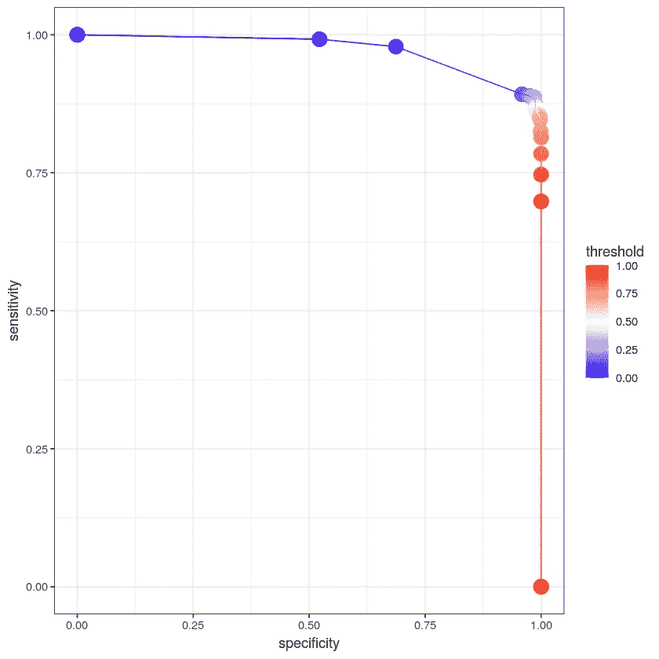

为了确定选择哪种可能性以及如何确定哪些患者更有可能被感染，我们讨论了与不同的医院、城市、州或国家特定政策相关的不同场景。对于每个场景，我们将从训练集中选择阈值，该阈值优化由场景中的策略驱动的给定目标函数。

## 场景 1:资源的高可用性

在场景 1 中，我们假设医院具有高可用性的资源。这样，模型就可以放松，高估阳性病例的数量。因此，我们的目标函数是使灵敏度最大化。

我们使用训练数据来选择最大化模型灵敏度的阈值。然后，我们将这个阈值应用于测试集中的预测概率。该过程返回 1.6%的概率阈值，并且该模型呈现 95%的高灵敏度值，如预期的那样。然而，高召回率是以特异性为代价的，特异性呈现 34%的低值。此外，测试集中约 74%的患者被标记为阳性，因此该模型作为优先化工具的使用有限。

## 场景 2:资源有限

在场景 2 中，我们假设环境资源有限，因此，如果我们能够获得一个平衡的模型，那么降低模型的敏感度是可以接受的。为此，我们选择最大化定义为$max(灵敏度+特异性)$的约登 J 统计量作为目标函数。

下面，我们可以看到阈值对相应的约登 J 统计值的影响(样本内分析)。我们观察到，过低或过高的阈值会导致模型中的次优平衡。

在对测试集进行预测后，我们将从训练集中选择一个阈值，该阈值最大化约登 J 统计量，以实现良好平衡的模型。我们观察到，与场景 1 的 95%相比，场景 2 下的模型现在提供了 84%的灵敏度。然而，它返回 96%的特异性，同时保持 92%的高 AUC(因为阈值的选择不影响 AUC)，因此提供了预期的更好平衡的模型。此外，现在该模型仅将 26%的测试集分配给阳性标签，显示出作为潜在的患者优先化工具是有用的。

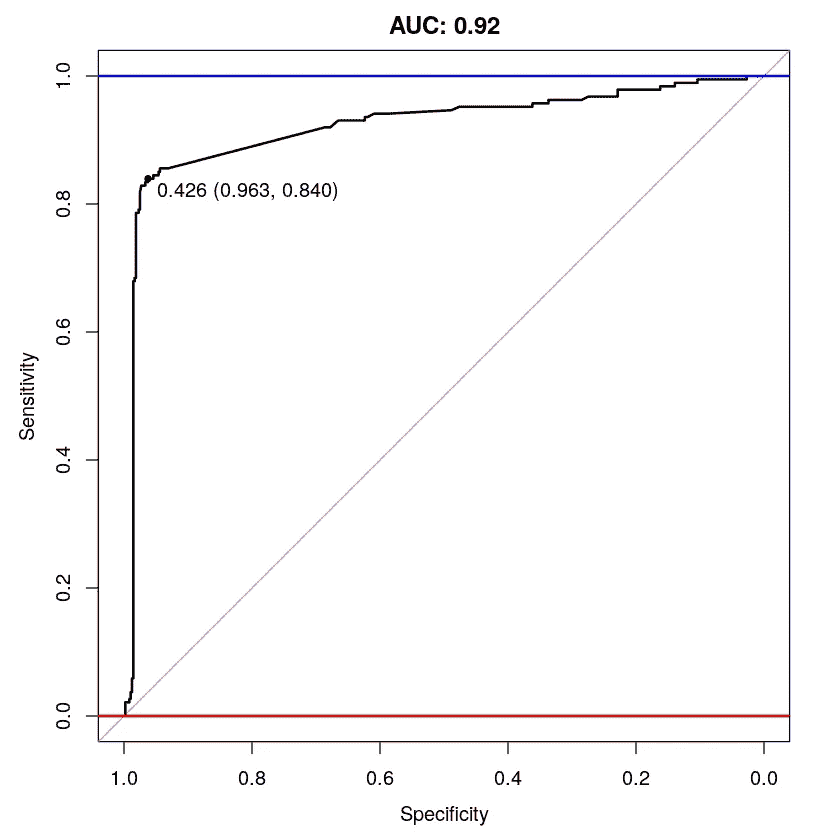

## 场景 3:有限的资源，不同的政策

在情景 3 中，我们假设不同的医院可能对敏感度的可接受值有不同的政策，或有不同的能力检测优先患者，以及有不同的流行水平。因此，我们通过提出一个具有成本函数的参数模型来概括场景 1 和 2 下研究的模型，该成本函数允许医生根据目标策略以及作为输入参数的输入流行度，与假阳性分类相比，高估或低估假阴性分类。

我们的目标函数是

$max(灵敏度+r * specific)$，

在哪里

$r = 1 —流行率/成本*流行率$

并且$r$是假阴性分类的相对成本(与假阳性分类相比)。不同的国家和地区可能有不同的流行率，而不同的医院可能有不同的政策来定义$cost$参数。

我们的研究结果表明，在标记为阳性的患者百分比数(＄num . positive . pct ＄)低于 30%的情况下，可以提供特异性和敏感性均大于 85%的实用模型，因此可以作为相关的优先化工具。此外，该模型被参数化，以允许容易地微调，从而针对目标敏感度、患病率或要优先考虑的患者的最大数量进行调整。

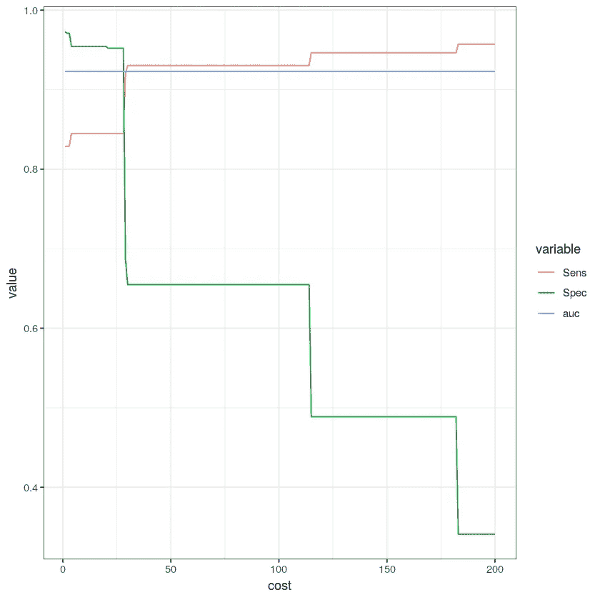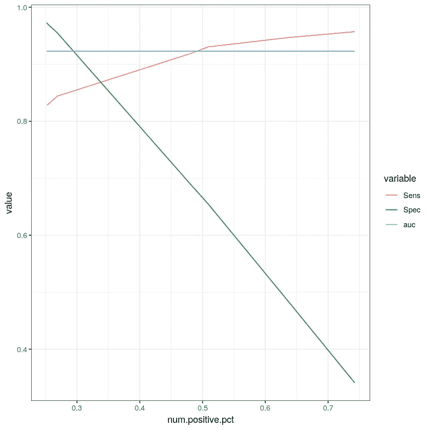

# **实际应用**

在实践中，使用建议模型的卫生工作者/医院将为最低可接受敏感度水平或要优先考虑的患者目标数量定义政策，并指定当前流行率。这些参数将作为模型的输入，以确定可能检测为阳性的优先患者。然后，该模型将输出新型冠状病毒感染、可能性测量和准确性的二元指标。该模型的输出可用作优先化的工具，并支持进一步的医疗决策过程。输入参数和医院的政策可以根据卫生系统的状况定期更新。然后，该模型将被重新训练，并纳入新的可用数据。

# **结论**

在这项工作中，我们通过分析来自以色列阿尔伯特·爱因斯坦医院的 5644 名患者(其中 558 名患者的新型冠状病毒病毒检测呈阳性)的样本，表明可以根据通常为疑似新冠肺炎病例收集的实验室检测结果来预测新型冠状病毒的检测结果。

根据目标政策/方案，所提出的模型具有 92%的 AUC 和大于 85%的敏感性/特异性水平的实际应用。该模型具有较高的可解释性，进一步显示了鼻病毒、肠病毒、B 型流感和 Inf 检测阴性的新冠肺炎症状患者。2009 年甲型 H1N1 流感，白细胞和血小板水平较低，更有可能检测出新型冠状病毒阳性。

我们还研究了如何根据不同的场景来调整模型的性能，这些场景被定义为目标敏感度的函数或医院对大量患者进行优先排序的政策。我们发现，如果医院愿意考虑选择 75%的患者进行检测，特异性水平可以达到 98%以上。然而，我们表明，在患者优先级别约为 25%的情况下，可以实现良好平衡的模型(特异性和敏感性均大于 85%)，因此证明这是一个相关的优先程序。模型的性能平衡可定义为考虑患病率、患者优先级别或目标敏感度级别的医院特定政策的函数。

我们采用了一种简约的建模方法，并构建了一个简单有效且透明的基线模型。我们承认，由于研究中的几个限制因素，应该谨慎对待这些发现，这些限制因素包括:(1)数据样本数量少；㈡不平衡的数据集；(iii)预测值的高度稀疏性。此外，该数据集具有潜在偏见，即在本研究中研究的特定医院的普通实验室检测中存在病毒筛查，这可能在巴西或世界范围内的许多其他医疗机构中不可用。

进一步的研究应该通过考虑生命体征和体检记录来解决变量的稀疏性。鉴于这种疾病的概况，来自 x 射线和断层扫描的图像研究可以提供严重病例的早期检测，预测是否需要 ICU 病床。

## 数据和代码可用性声明

这项工作报告了由巴西圣保罗的以色列阿尔伯特爱因斯坦医院创建的 Kaggle 数据集[诊断新冠肺炎及其临床谱](https://www.kaggle.com/einsteindata4u/covid19)的结果。

完整代码可在 https://github.com/souzatharsis/covid-19-ML-Lab-Test*获得*