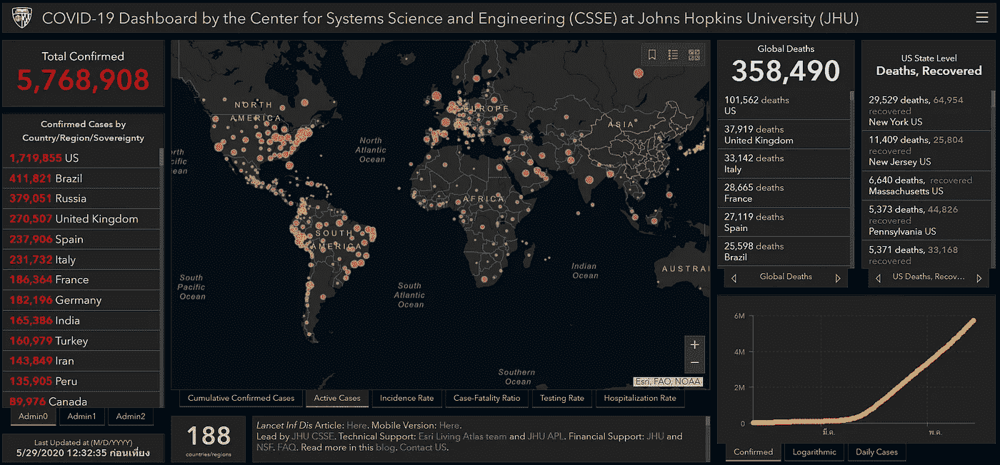
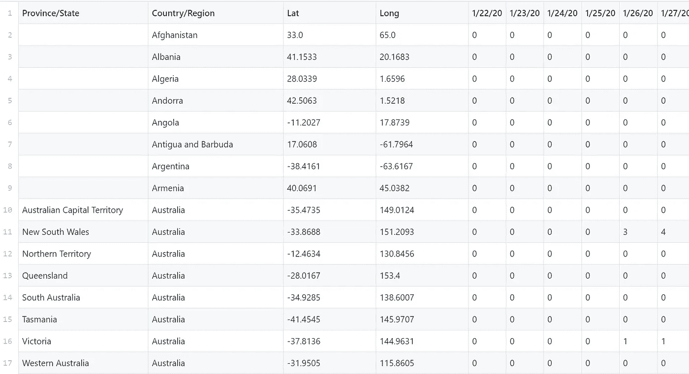
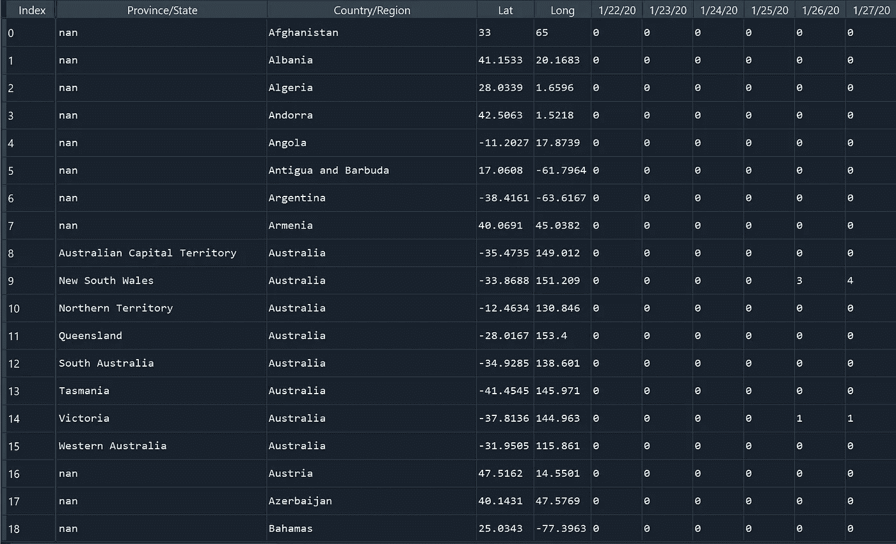
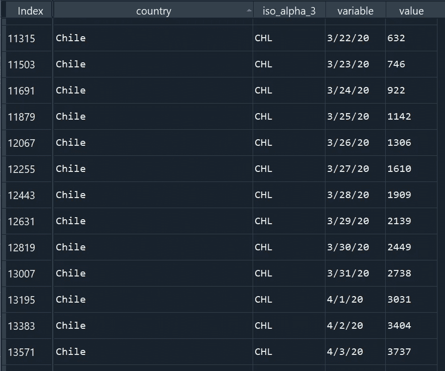
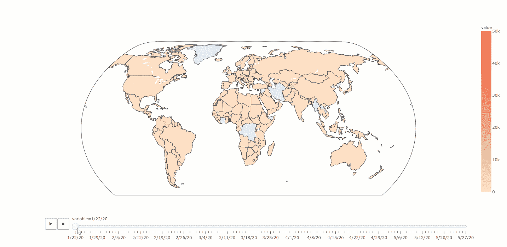

# 用 Python 在 5 分钟内创建新冠肺炎地图动画

> 原文：<https://towardsdatascience.com/covid-19-map-animation-with-python-in-5-minutes-2d6246c32e54?source=collection_archive---------26----------------------->

## 数据可视化

## 用 Python 和 Plotly 制作新冠肺炎地图动画


马特·拉默斯在 [Unsplash](https://unsplash.com?utm_source=medium&utm_medium=referral) 上拍摄的照片

在抗击新冠肺炎的战斗中，GIS 技术在很多方面都发挥了重要作用，包括数据整合、疫情信息的地理空间可视化、确诊病例的空间追踪、区域传播预测等等。这些为政府部门抗击新冠肺炎疫情提供了支持信息。[1]为了解决这个问题，JHU 提供了一个用 ESRI ArcGIS operation dashboard 创建的漂亮的[仪表盘](https://www.arcgis.com/apps/opsdashboard/index.html#/bda7594740fd40299423467b48e9ecf6):



**CSSE 在 JHU 的** [**新冠肺炎仪表盘**](https://www.arcgis.com/apps/opsdashboard/index.html#/bda7594740fd40299423467b48e9ecf6)**(2020 年 5 月 29 日截图)**

**仪表板提供了累计确诊病例总数、活跃病例、发病率、病死率、检测率和住院率的非常好的概览。但是，在地图上可视化数据随时间变化的功能丢失了！**

**本文将向您介绍一种使用 JHU·新冠肺炎数据集创建可视化新冠肺炎随时间扩展的动态地图的简单方法。**

## **我们开始吧！**

# **步骤 1:准备 Python 库**

**我们将在本文中使用的 Python 库主要是 Pandas、PyCountry 和 Plotly Express。你们中的大多数人可能已经知道 Plotly 库，但是如果不知道，你可以在这篇文章中查看它的所有特性。**

```
**$ pip install pandas
$ pip install pycountry
$ pip install plotly**
```

# **步骤 2:加载数据集**

**我们将在这里使用的数据集是 JHU·CSSE·新冠肺炎数据集。你可以从 CSSE Github [repo](https://github.com/CSSEGISandData/COVID-19/blob/master/csse_covid_19_data/csse_covid_19_time_series/time_series_covid19_confirmed_global.csv) 下载或获取它的最新更新版本。您可以查看这篇[文章](/automatically-update-data-sources-in-python-e424dbea68d0)，了解如何使用 *PythonGit* 在您的 Python 项目中随时间自动更新数据源。在本文中，我们将只关注`**time_series_covid19_confirmed_global.csv**` 数据集。**

****

****来自 JHU CSSE 的时间序列 _ covid 19 _ confirmed _ global . CSV****

**然后，您可以使用以下命令轻松地将数据加载到 dataframe**

```
**import pandas as pd
df_confirm =** **pd.read_csv('path_to_file')**
```

****

****时间序列 _ covid19 _ 已确认 _ 全局**数据集**

# **步骤 3:清理数据集**

**为了使用 Plotly Express 动态可视化时间序列数据集，您需要满足以下数据框架要求。**

*   ****将数据集**聚合到国家级别。**
*   ****获取每个国家在[ISO 3166–1](https://en.wikipedia.org/wiki/ISO_3166-1_alpha-3)中定义的三个字母的国家代码**；例如，`AFG`代表阿富汗。你可以使用 [PyCountry](https://pypi.org/project/pycountry/) 来做到这一点。**
*   ****将数据集转换为长格式**，其中日期值在单个列中表示。您可以轻松完成此操作，首先将数据集加载到 Pandas 数据帧中，然后在 Pandas 中使用 [**melt**](https://pandas.pydata.org/pandas-docs/stable/reference/api/pandas.melt.html) 。**

**您可以使用此 Python 脚本执行以下步骤:**

**总体而言，最终的干净数据帧如下图所示:**

****

****已清理的时间序列 _ covid19 _ 已确认 _ 全局**数据集**

# **步骤 4:使用 Plotly Express 创建地图动画**

**数据集准备就绪后，您可以使用 Plotly Express 轻松创建地图动画。例如，您可以使用下面的脚本从步骤 3 的数据帧创建一个动画 choropleth 图，您也可以根据自己的喜好调整每个参数。**

****使用 Plotly Express 从 time _ series _ covid 19 _ confirmed _ global 数据集创建动画 choropleth 的 Python 脚本****

****

****使用 Plotly Express 从时间序列 _ covid19 _ 已确认 _ 全局数据集制作的动画 choropleth】****

## **差不多就是这样！简单对吗？**

## **下一步是什么？**

**此示例可视化了已确认的新冠肺炎病例数据集，但您也可以尝试将此方法应用于可视化新冠肺炎死亡病例和康复病例数据集。**

**关于用 plotly 绘制动画 choropleth 地图的更多信息，查看完整文档[这里](https://plotly.com/python/choropleth-maps/)。如果你想改变色阶，你可以简单地从[这里](https://plotly.com/python/builtin-colorscales/)选择内置色阶。应用更好的颜色符号规则。尝试创建其他类型的地图，如散点图或热图，通过查看 Plotly 地图库[这里](https://plotly.com/python/maps/)。**

**或者，您可以通过本文[查看如何在 Kepler.gl 中可视化新冠肺炎数据，这是一个用于动态数据可视化的地理空间分析工具。](/4d-data-visualization-with-kepler-gl-b6bd6dd90451)**

# **结论**

**本文将向您介绍如何使用 Plotly Express 以简单的方式准备数据集和创建地图动画。我希望你喜欢这篇文章，并发现它对你的日常工作或项目有用。如果您有任何问题或意见，请随时给我留言。**

**关于我&查看我所有的博客内容:[链接](https://joets.medium.com/about-me-table-of-content-bc775e4f9dde)**

**安全**健康**和**健康**！💪**

****感谢您的阅读。📚****

# **参考**

**[1]周，陈，苏，李，李，马，蒋，李，阎，李，易，胡，杨，肖，(2020)。新冠肺炎:大数据对 GIS 的挑战。地理和可持续性，1(1)，77–87。[https://doi.org/10.1016/j.geosus.2020.03.005](https://doi.org/10.1016/j.geosus.2020.03.005)**