# 使用 ELK 构建新冠肺炎地图

> 原文：<https://towardsdatascience.com/covid-19-map-using-elk-7b8611e9f2f4?source=collection_archive---------22----------------------->

## [变更数据](https://towardsdatascience.com/tagged/data-for-change)

## 使用 elasticsearch 创建您自己的自定义新冠肺炎地图

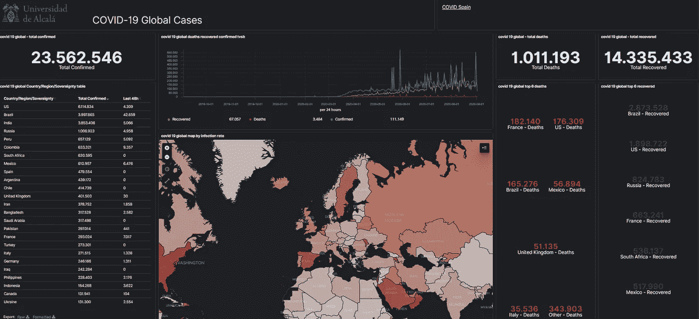

新冠肺炎麋鹿地图，可在[https://covid 19 Map . uah . es/app/dashboards #/view/478 e9 b 90-71e 1-11ea-8d D8-e 1599462 e 413](https://covid19map.uah.es/app/dashboards#/view/478e9b90-71e1-11ea-8dd8-e1599462e413)|图片由作者提供

可能你们大多数人都熟悉[约翰·霍普金斯大学(JHU)的地图](https://coronavirus.jhu.edu/map.html)代表新冠肺炎疫情的现状。

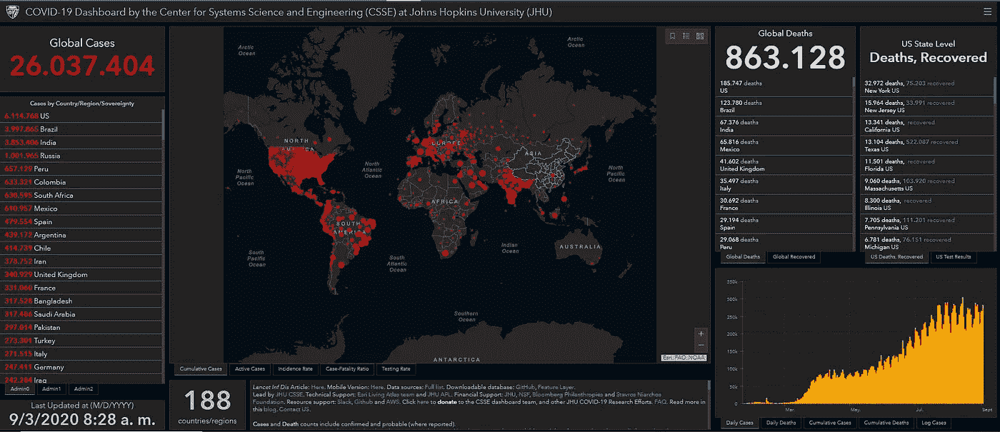

[约翰·霍普金斯大学(JHU)地图的图像](https://coronavirus.jhu.edu/map.html)(约翰·霍普金斯大学)

这张地图是使用 ArcGIS 技术开发的，在很多情况下，这已经成为开发疫情地图的事实上的标准，例如世卫组织政府的地图。

在看到这个之后，我想用麋鹿创建我自己的地图；几天后，在一个朋友的帮助下，一切都运转起来了。根据我的经验，我决定写你如何也能轻松做到这一点。这一系列的文章将集中在如何使用 ELK 栈创建你自己的自定义地图。

# 为什么选择 Elasticsearch？

第一个要回答的问题是为什么是麋鹿？而不是使用 ArcGIS 技术。Elasticsearch 是开源的，每个人都可以轻松部署一个正在运行的集群。此外，Elasticsearch 使用 Kibana 进行了漂亮的展示，并且还提供了地图，因此它拥有我们构建令人难以置信的新冠肺炎地图所需的一切。我真的很喜欢麋鹿栈，所以我决定尝试一下。

> 我在一个月 10 美元[的数字海洋 VPS](https://m.do.co/c/01825577c607) 中运行了 ELK stack，显然没有冗余和大量空间，但我们会发现我们不需要大量空间来存储数据。

基于这一点，我们的成本将只是运行 ELK 的基础设施，但一个小的 VPS 可以运行一个小的集群。我没有很多闲钱，所以我总是试图将成本保持在最低水平。我已经运行了 ELK stack，每月 10 美元[数字海洋 VPS](https://m.do.co/c/01825577c607) ，显然没有冗余和大量空间，但我们会发现我们不需要大量空间来存储数据。另一种选择是使用[弹性云](https://www.elastic.co/es/cloud/?ultron=EL-B-Stack-Trials-EMEA-S-Exact&gambit=Elasticsearch-Cloud&blade=adwords-s&thor=elastic%20cloud&gclid=CjwKCAjwqML6BRAHEiwAdquMnQSbXR8OCrTac4UM6P8onKBaGtmV7OSI5Z-ZSBU0OmilwqcukCR0NRoCkxEQAvD_BwE)。

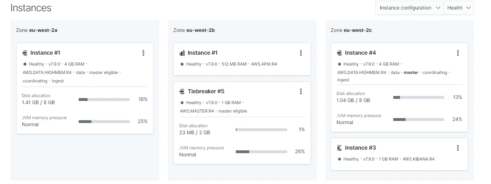

我当前部署的弹性云|图片作者

[弹性云](https://www.elastic.co/es/cloud/elasticsearch-service/signup)是运行 ELK 集群最简单的方式，并提供许多有用的功能。例如，ELK 的一个*问题*是频繁更新新功能的数量。在 Elastic Cloud 中，更新集群就像按下控制面板中的一个按钮一样简单。此外，最小的部署成本低于每月 20 美元。就我而言，我停止使用弹性云是因为它的易用性和易于管理。我完全推荐这个选项，不要忘记你有 14 天的试用期。

# 新冠肺炎数据来源

同意 ELK 堆栈的惊人之处后，我们可以开始考虑如何在 ELK 中插入新冠肺炎数据。首先，我们为地图确定一个可靠和更新的数据源。我们需要每天检索和插入新数据来更新我们的地图。

[约翰霍普金斯大学(JHU)](https://coronavirus.jhu.edu/map.html) 在 [GitHub](https://github.com/CSSEGISandData/COVID-19) 上发布他们的数据。它们都是 CSV 格式，可以很容易地使用。新冠肺炎意大利数据也发生了类似的事情。这种格式可以很容易地被解析和插入，但是有几个问题。在解析这些数据的过程中，我遇到了几个问题。第一个是数据更新过程，例如，JHU 并不总是更新数据最快的。这很正常，他们需要等待新数据的发布，并将其纳入数据集中。您将看到意大利知识库更新更加频繁。

> 如果你计划运行一个更新的地图，最好的选择是不要使用那些 Github 库。
> 
> 最好的选择是使用新冠肺炎 API。我们有几个选择，但我决定使用新冠肺炎叙事 API。

另一个问题是文件结构的变化。有时 CSV 结构已经改变，然后您需要再次解析这些文件，可以重命名列或者改变顺序。因此，如果你计划运行一个更新的地图，最好的选择是不要使用 Github 库。

为了避免这些问题，最好的选择是使用新冠肺炎 API。我们有几个选项，但我决定使用[新冠肺炎叙事 API](https://covid19tracking.narrativa.com/index_en.html) 。

要检索 2020 年 9 月 3 日的新冠肺炎数据，我们只需向 https://api.covid19tracking.narrativa.com/api/2020–09–03 的[发出请求。在执行该请求后，我们将获得一个 JSON 响应，避免前面提到的所有问题。叙事瓦已经从几个官方数据来源检查和下载新冠肺炎信息:](https://api.covid19tracking.narrativa.com/api/2020-09-03)

*   西班牙语:[卫生部](https://www.mscbs.gob.es/profesionales/saludPublica/ccayes/alertasActual/nCov-China/situacionActual.htm)
*   意大利:[意大利民事保护部](https://github.com/pcm-dpc/COVID-19)
*   德国:[罗伯特·科赫研究所](https://www.rki.de/DE/Content/InfAZ/N/Neuartiges_Coronavirus/Situationsberichte/Gesamt.html)
*   法国:[法国公共卫生](https://www.santepubliquefrance.fr/maladies-et-traumatismes/maladies-et-infections-respiratoires/infection-a-coronavirus/articles/infection-au-nouveau-coronavirus-sars-cov-2-covid-19-france-et-monde)
*   约翰·霍普金斯大学
*   约翰·霍普金斯大学

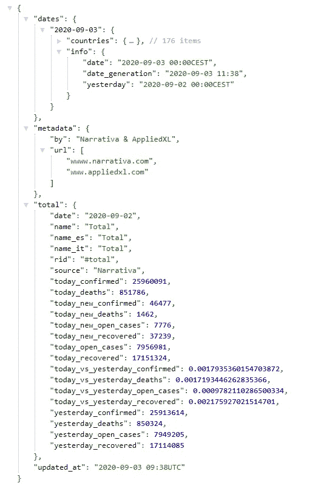

新冠肺炎叙事 API |图片由作者提供

使用这个 API，我们可以检索我们需要的所有数据。从世界数据到国家和地区数据。API 的完整文档可以在这里[找到](https://documenter.getpostman.com/view/10831675/SzYZ1eNY)。到了这一步，我们可以开始在 Elasticsearch 中消费和插入数据。

# 在松紧带内插入新冠肺炎

为了使用来自 API 的数据，我们可以使用 Logstash。Logstash 是在插入 Elasticsearch 之前收集、解析和转换信息的标准工具。此外，Logstash 已经为普通日志发布了许多预配置配置。

但是也有其他的可能性，比如 Python。我真的很喜欢 Python 语法和编程，所以当我从一个 API 消费时，我通常会结束构建一个脚本来消费数据并插入到 Elasticsearch 中。就像我说的，你可以用 Logstash 来做这件事，但是我觉得用 Python 编程更舒服。

所以还是从代码开始吧！！首先，我们需要从疫情开始到今天的所有数据。此外，我们希望将这些数据按日期分开，以便从不同的时间段过滤或创建可视化效果。使用 Python 请求和 datetime，我们可以轻松地迭代抛出所有日期并检索所有数据。我个人更喜欢[的请求](https://requests.readthedocs.io/en/latest/)而不是[的 urrlib](https://docs.python.org/3/library/urllib.html) ，我觉得它简单优雅得多。

> 使用 Python 请求和 datetime，我们可以轻松地迭代抛出所有日期并检索所有数据。

```
import requests
from datetime import datetime, date, timedeltastart_date = date(2020, 3, 1)
end_date = date(2020, 4, 9)
delta = timedelta(days=1)while start_date <= end_date:  
     day = start_date.strftime("%Y-%m-%d")  
     print ("Downloading " + day)    
     url = "https://api.covid19tracking.narrativa.com/api/" + day
     r = requests.get(url)
     data = r.json()    
     start_date += delta
```

获得每个日期的数据后，我们可以将它插入到 Elasticsearch 中，但在此之前，有必要对数据进行一些格式化。我们将在一个[弹性地图](https://maps.elastic.co/#file/world_countries)中表示与国家相关的数据。为了将数据与每个国家相关联，elasticsearch 需要识别国家/地区的名称。叙事 API 为我们提供了英语、意大利语和西班牙语的名称，但有些国家的名称可能会有问题。因此，发明了 ISO 3166-1α-2(iso 2)和 ISO 3166-1α-3(iso 3)。使用这种命名法，我们可以很容易地识别每个国家的名字，不会出错。Python 有一个包 [countryinfo](https://pypi.org/project/countryinfo/) 可以帮助我们将国家名称翻译成 iso3 格式。

> Python 有一个包 [countryinfo](https://pypi.org/project/countryinfo/) 可以帮助我们将国家名称翻译成 iso3 格式。
> 
> 你需要比较人群的感染率，或者使用统计学指标，而不是绝对数字。这个主题在我完全推荐的 [ArcGis 帖子](https://www.esri.com/arcgis-blog/products/product/mapping/mapping-coronavirus-responsibly/)中有详细介绍。

```
from countryinfo import CountryInfofor day in data['dates']:
    for country in data['dates'][day]['countries']:
        try:
            country_info = CountryInfo(country)
            country_iso_3 = country_info.iso(3)
            population = country_info.population()
        except Exception as e:
            print("Error with " + country)
            country_iso_3 = country
            population = None
            infection_rate=0
            print(e)
```

另外，如果你检查了代码，可能大多数人都会看到一个人口值。不幸的是，Elasticsearch 现在不包括每个国家的人口数值，[他们正在做那个](https://github.com/elastic/ems-file-service/issues/164)。为了代表性地绘制新冠肺炎疫情，有必要获得每个国家的人口值，仅具有数量的热图是不具有代表性的。你需要比较感染率和人口数量，或者使用统计指标，而不是绝对数字。我强烈推荐的一篇 [ArcGis 帖子](https://www.esri.com/arcgis-blog/products/product/mapping/mapping-coronavirus-responsibly/)中详细介绍了这个主题。

获得每个国家受感染人数代表性指标的一个简单方法是使用[感染率](https://en.wikipedia.org/wiki/Infection_rate)。感染率代表人群感染的概率或风险。

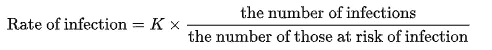

感染率公式|作者图片

再次使用 Python，我们可以很容易地计算出这个数字。不幸的是，Python countryinfo 不包括所有国家的人口，因此我控制了这个例外。大多数国家都得到支持，但我发现了一些错误，如巴哈马群岛、Cabo 和其他一些国家。

```
def getInfectionRate(confirmed, population):
    infectionRate = 100 * (confirmed / population)   
    return float(infectionRate)if population != None:
    try:
        infection_rate=getInfectionRate(data['dates'][day]['countries'][country]['today_confirmed'], population)
        print(infection_rate)
    except:
        infection_rate=0
```

> 我用日期时间格式日期替换了时间戳。这样，Elasticsearch 将自动检测日期格式，而您将忘记创建 Kibana 索引。

完成所有这些修改后，我们只需要将这些数据插入到 Elasticsearch 中。在插入数据之前，我倾向于创建一个包含所有数据的自定义字典。我添加了以前的数据，人口，国家 iso3 名称，感染率，并用日期时间格式日期替换了时间戳。这样，Elasticsearch 将自动检测日期格式，而您将忘记创建 Kibana 索引。

```
def save_elasticsearch_es(index, result_data):
    es = Elasticsearch(hosts="") #Your auth info
    es.indices.create(
        index=index,
        ignore=400  # ignore 400 already exists code
    )
    id_case = str(result_data['timestamp'].strftime("%d-%m-%Y")) + \
        '-'+result_data['name']

    es.update(index=index, id=id_case, body {'doc':result_data,'doc_as_upsert':True}) result_data = data['dates'][day]['countries'][country]
del result_data['regions']
result_data['timestamp'] = result_data.pop('date')result_data.update(
                     timestamp=datetime.strptime(day, "%Y-%m-%d"),
                     country_iso_3=country_iso_3,
                     population=population,
                     infection_rate=infection_rate,
                    )save_elasticsearch_es('covid-19-live-global',result_data)
```

完整的脚本可以在 [GitHub](https://github.com/CarlosLannister/covid19-elk/blob/master/covid19Global.py) 上找到，只要记得在运行脚本之前添加你的 elasticsearch 主机，并安装所有的依赖项。

# 使用 Kibana 创建新冠肺炎可视化

> Kibana 将自动识别时间戳字段作为时间过滤器，你只需要选择它。

运行该脚本后，将在 elasticsearch 中创建一个索引，您可以从 Kibana 配置它。Kibana 将自动识别时间戳字段作为时间过滤器，你只需要选择它。

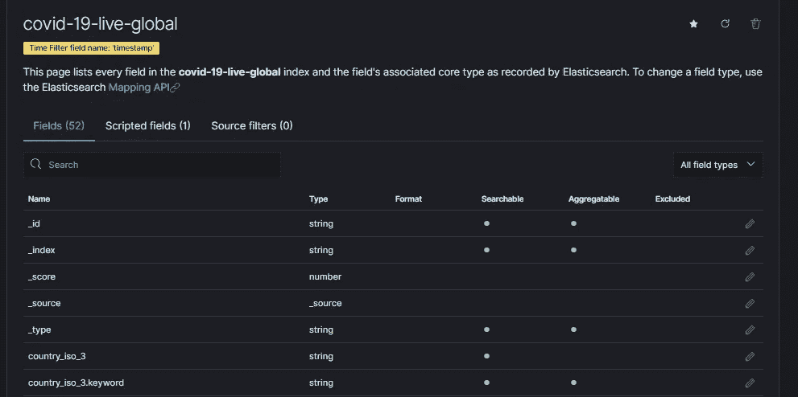

基巴纳指数模式|图片由作者提供

## 数据表可视化

我们可以做的最简单的可视化之一是一个简单的表格，显示新冠肺炎病例最多的国家。

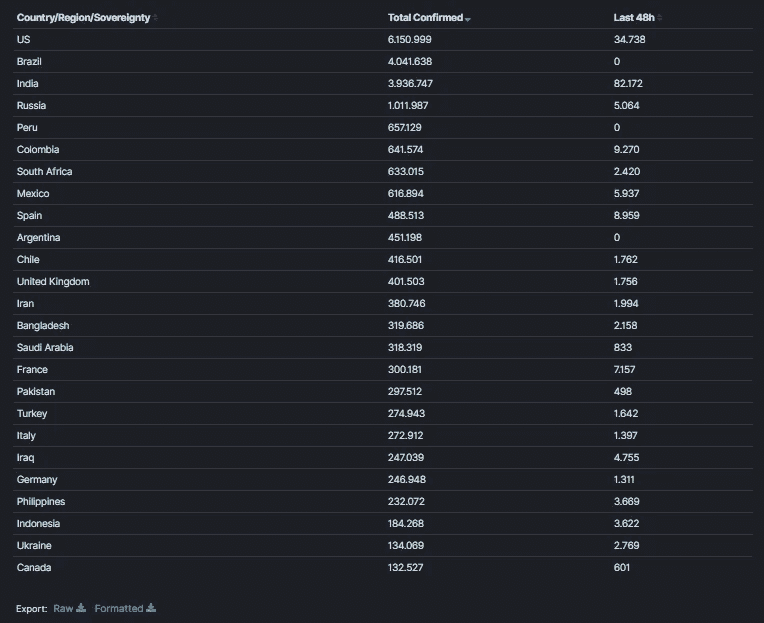

基巴纳表格显示新冠肺炎病例数最多的国家|图片由作者提供

为了创建这个可视化，我们需要一个数据表可视化。第一列可以是确诊病例的总数，使用 today_confirmed 上的简单 max 聚合，我们可以获得该数字。

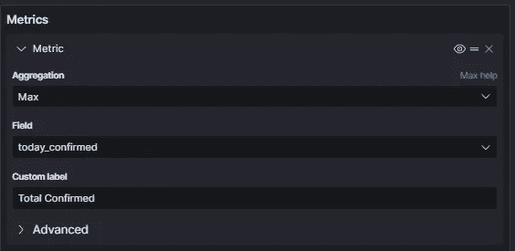

Kibana 中的确诊病例总数配置|作者提供的图片

另一个有趣的指标可能是过去 48 小时内的最后确诊病例。人们可能会认为 24 小时的数字可能更有意义，但许多国家花了更多的时间来报告它们的病例，有了 48 小时的窗口，你将能够代表更多的结果。为了在 Kibana 中执行这种表示，我们需要一个 Sum Bucket 聚合。使用这种聚合，我们可以使用过去 48 小时的日期范围，现在-2d，然后再次使用最大聚合获得确诊病例数。

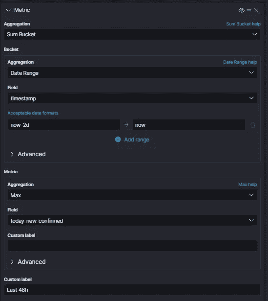

基巴纳最近 48 小时确诊病例配置|图片由作者提供

有了我们的聚合之后，我们唯一需要做的事情就是使用国家名称来拆分行。选择“按名称.关键字分割”将会这样做。此外，我会建议设置一个大小限制，我们将看到最重要的数字。在我的仪表板中，25 个降序数字似乎就足够了，但是您可以根据自己的喜好调整这个数字。

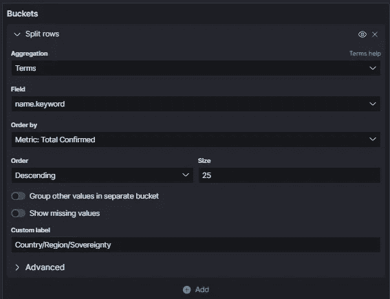

按国家名称拆分行|按作者拆分图片

## 新冠肺炎疫情地图可视化

我们能创造的最不可思议的可视化或者至少是最受欢迎的是一张显示新冠肺炎疫情演变的地图。Kibana 提供了几个创建地图的选项，在本例中，我们将选择 choropleth 选项。使用此选项，我们可以选择一个单词国家层，并选择 ISO 3166–1 alpha-3 作为格式，请记住我们是如何将它包含在脚本中的。统计源将是我们的索引名，包含 ISO 3166-1 alpha-3 的字段将是我们的连接字段，在我们的例子中是 country_iso_3。

> 还有，要意识到这一点！！，如果添加图层后地图仍然是黑色的，请检查您的基巴纳日期过滤器，并将最近 15 分钟选择器更改为最近 1 年。我花了很多时间思考我做错了什么，问题出在基巴纳时间选择器上。

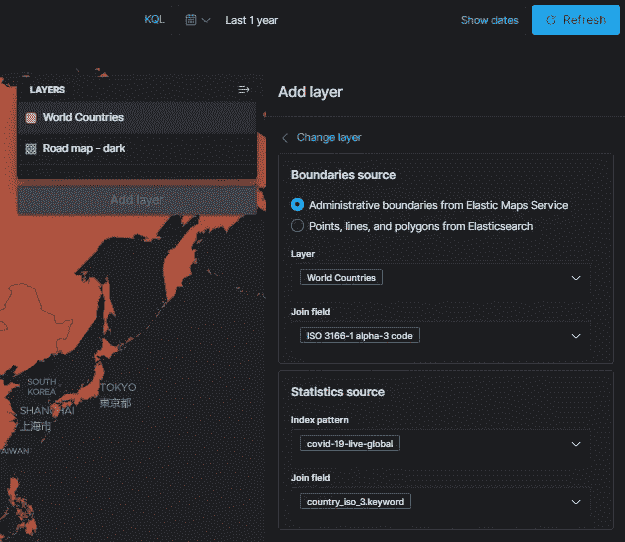

Kibana 地图 choropleth 配置以在作者的地图|图像中创建一个图层

添加这一层后，我们还没有完成，所有国家都呈现相同的数据。我们需要选择 infection_rate 变量作为度量，以便根据其值绘制颜色，然后选择“按值填充颜色”,并再次选择 infection_rate。此外，我们可以在图层样式下的几个调色板中选择，我更喜欢红色调的那个。到达这一点，地图上应该有一些颜色。还有，要意识到这一点！！，如果添加图层后地图仍然是黑色的，请检查您的基巴纳日期过滤器，并将最近 15 分钟选择器更改为最近 1 年。我花了很多时间思考我做错了什么，问题出在基巴纳时间选择器上。

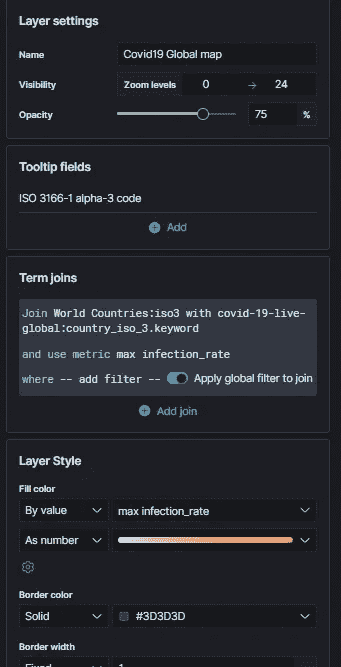

基巴纳地图 choropleth 图层配置|图片由作者提供

选择这些选项后，您应该能够看到如下内容:

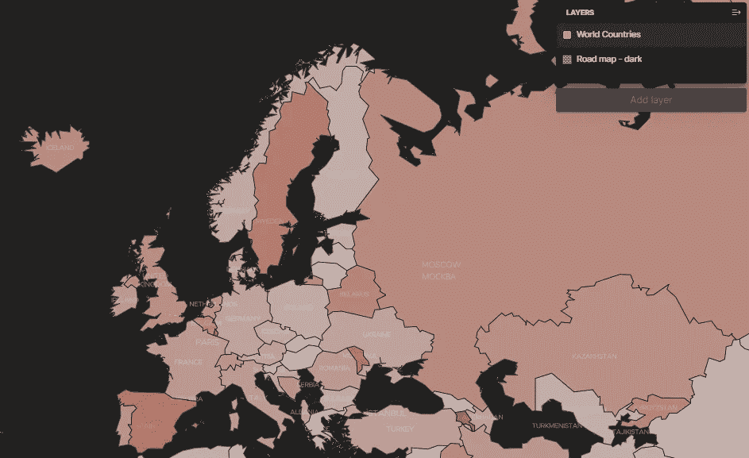

基巴纳地图创作|作者图片

# 结论

希望通过本文提供的代码和示例，您能够创建自己的自定义地图和可视化。在这篇文章中有很多可能的基巴纳可视化，我只提出了一些想法。我的建议是尽可能多地尝试 Kibana 可视化。Kibana 是一个不可思议的工具，只需点击几下，你就可以创建以你的国家、地区或大陆为中心的图表。