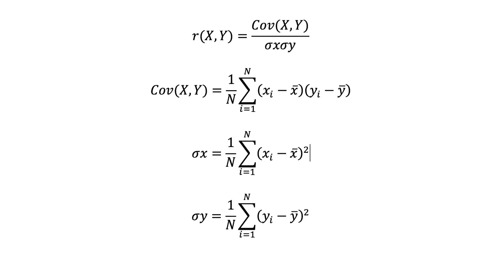
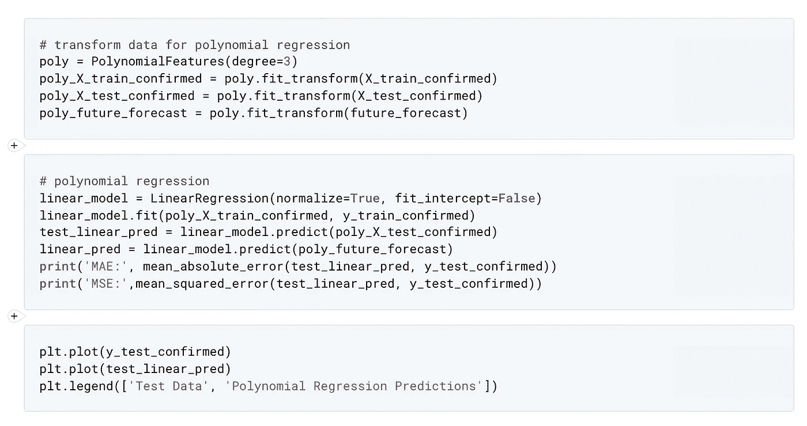
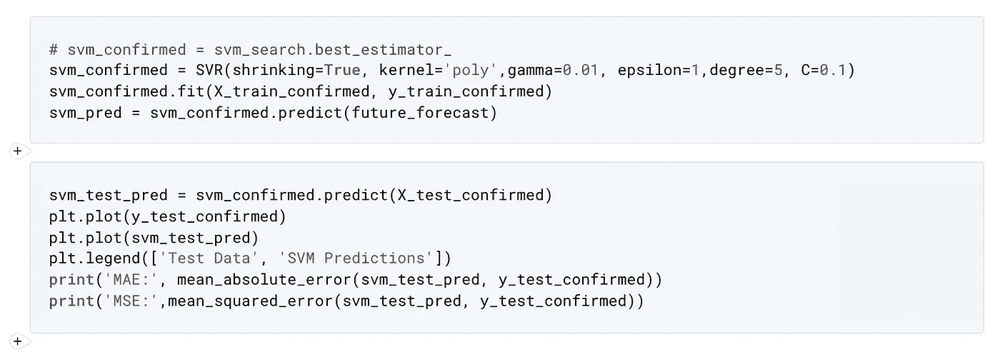

# 基于机器学习算法的新冠肺炎疫情预测

> 原文：<https://towardsdatascience.com/covid-19-outbreak-prediction-using-machine-learning-algorithm-ce5641bd55bf?source=collection_archive---------12----------------------->


照片由[联合国新冠肺炎回应](https://unsplash.com/@unitednations?utm_source=medium&utm_medium=referral)在 [Unsplash](https://unsplash.com?utm_source=medium&utm_medium=referral)

## 新冠肺炎灾难性的爆发给社会带来了威胁

## 传输的早期预测可以适应采取所需的响应

***编者按:*** *《走向数据科学》是一份以研究数据科学和机器学习为主的中型刊物。我们不是健康专家或流行病学家，本文的观点不应被解释为专业的健康建议。然而，本文将关注如何使用机器学习来预测疫情的传播。*

## 介绍

我们的社会正处于一个难以置信的时代，人们试图在基础设施、金融、商业、制造业和其他一些资源方面与这种威胁生命的状况进行斗争。人工智能(AI)研究人员加强了他们在开发数学范式方面的熟练程度，以便使用全国范围内的分布式数据调查这一疫情。本文旨在通过使用来自 Johns Hopkins 仪表板的实时数据，将机器学习模型与全国范围内新冠肺炎的预期可达性预测同时应用。


Erik Mclean 在 [Unsplash](https://unsplash.com?utm_source=medium&utm_medium=referral) 上拍摄的照片

## 传输阶段

冠状病毒传播分为四个阶段。**第一阶段**始于记录的前往或来自受影响国家或城市的人的病例，而在**第二阶段**，病例在与来自受影响国家的人有过接触的家庭、朋友和团体中按区域报告。因此，受影响的人是可以识别的。接下来，**第三阶段**导致严重的情况，因为感染者变得不可检测，并且在既没有任何旅行记录也没有与受感染者有联系的个体中变平。这种情况迫使全国立即封锁，以减少个人之间的社会接触，以衡量病毒的移动。最后，**第四阶段**在传播转变为地方病和不可控时开始。中国是第一个感受到新冠肺炎传播第四阶段的国家，而大多数发达国家现在都处于传播的这一阶段，与中国相比，承受着更多的流行病和损失。

机器学习算法在疫情调查和预测中发挥着重要作用。此外，机器学习技术有助于揭示流行模式。因此，可能会立即准备应对措施，以防止病毒的传播( **Kalipe，Gautham & Behera，2018**；**辛格，辛格&巴蒂亚，2018** )。此外，通过使用来自 Johns Hopkins 仪表板的实时数据，利用机器学习模型来识别集体行为以及新冠肺炎在整个社会的预期传播预测。

## 资料组

从约翰霍普金斯大学的官方知识库中检索到的数据集。这些数据由每日案例报告和每日时间序列汇总表组成。在这项研究中，我们选择了 CSV 格式的时间序列汇总表，其中有三个表用于新冠肺炎的确诊、死亡和康复病例，有六个属性。例如，省/州、国家/地区、上次更新、已确认、死亡和已恢复的病例。CSV 数据可在 **Github⁴** 仓库中获得。

## 预测和分析

冠状病毒的传播将社会置于社会生活丧失的边缘。此外，调查未来的传输增长并预测传输的未来事件也至关重要。在并发中，基于机器学习选择最先进的数学模型用于预测病毒传播的计算过程，例如:

*   **支持向量 Regression⁵** (SVR)
*   **多项式 Regression⁶** (PR)
*   深度学习回归模型

它还涉及:

*   **人工神经 Network⁷** (安)
*   **递归神经 Networks⁸** (RNN)使用**长短期 Memory⁹** (LSTM)细胞。

使用 **python 库**执行机器学习和深度学习策略，以广泛预测确诊、恢复和死亡病例的总数。这种预测将允许根据传播增长做出具体决定，例如延长封锁期，执行卫生计划，以及提供日常支持和供应。

## 回归分析

回归分析是机器学习算法的一部分。它是领先的机器学习算法。想象一下由任意两个变量 X 和 Y 组合而成的直线方程，可以用代数方法表示为:


其中 ***b*** 声明 y 轴上的截距，***a*** 称为直线的斜率。这里， ***a*** 和 ***b*** 也称为回归分析的参数。这些参数应该通过适当的学习方法来学习。

> 回归分析包含一组机器学习方法，使我们能够根据一个或多个预测变量(X)的值来预测连续的结果变量(Y)。它假装结果和预测变量之间存在持续的联系。

## 相关系数

相关系数被解释为两个变量之间线性关系的强度。卡尔·皮尔逊强调，相关系数是两个变量之间线性相关的权重或程度。他还生成了一个被称为相关系数的公式。两个随机变量 X 和 Y 之间的相关系数，通常由这些变量之间线性相关性的数值度量表示，定义为:



其中， *i = 1，2，3，4，…N* ，是输入输出变量的集合。下面给出了一些预测:

1.  如果相关系数的值等于零，则表明输入变量 X 和输出变量 y 之间没有相关性。
2.  如果相关系数的值等于正 1，则表明输入变量和输出变量之间有很强的关系。换句话说，如果输入变量增加，那么输出变量也会增加。
3.  如果相关系数的值等于负，则表明输入变量增加，然后输出变量也减少，以此类推。

那些线性相关性很小或没有线性相关性的变量可能具有很强的非线性关系。另一方面，在拟合模型之前估计线性相关性是识别具有简单关系的变量的一种有价值的方法。在这项拟议的研究中，我们测量了全国范围内 COVID-2019 确诊病例的日期和数量之间的相关系数。

## 用 Python 编码



注意:完整的源代码可以在本文末尾获得

## 结论

我们的环境处于新冠肺炎病毒的控制之下。本文旨在通过来自 Johns Hopkins 的数据集使用机器学习模型进行疫情分析。总之，在预测新冠肺炎传输时，多项式回归(PR)方法比其他方法产生了最小的均方根误差(RMSE)。然而，如果传播模仿 PR 模型的预测趋势，那么它将导致大量的生命损失，因为它呈现了全球传播的不可思议的增长。正如中国所认为的，新冠肺炎病例的增加可以通过减少感染者中敏感个体的数量来降低。这种新常态可以通过变得不合群和支持有控制的锁定规则来获得。

```
**References**#1 [Predicting Malarial Outbreak using Machine Learning and Deep Learning Approach: A Review and Analysis](https://ieeexplore.ieee.org/document/8724266)#2 [Sentiment analysis using machine learning techniques to predict outbreaks and epidemics](https://www.researchgate.net/publication/332819639_Sentiment_analysis_using_machine_learning_techniques_to_predict_outbreaks_and_epidemics)#3 [Johns Hopkins University](https://coronavirus.jhu.edu/)#4 [Johns Hopkins University: COVID-19 Data Repository](https://github.com/CSSEGISandData/COVID-19)#5 [Support Vector Regression](https://www.researchgate.net/publication/340883347_Detection_of_coronavirus_Disease_COVID-19_based_on_Deep_Features_and_Support_Vector_Machine)#6 [Polynomial Regression](https://www.researchgate.net/publication/341109515_Application_of_Hierarchical_Polynomial_Regression_Models_to_Predict_Transmission_of_COVID-19_at_Global_Level)#7 [Artificial Neural Network](https://www.researchgate.net/publication/340538849_Novel_Coronavirus_Forecasting_Model_using_Nonlinear_Autoregressive_Artificial_Neural_Network)#8 [Recurrent Neural Networks](https://www.researchgate.net/publication/341474954_How_well_can_we_forecast_the_COVID-19_pandemic_with_curve_fitting_and_recurrent_neural_networks)#9 [Long Short-Term Memory](https://www.researchgate.net/publication/340255782_Application_of_Long_Short-Term_Memory_LSTM_Neural_Network_for_COVID-19_cases_Forecasting_in_Algeria)***Disclaimer*** *This is for education and information purposes only, additional research in the machine learning algorithm needed to give the exact amount of prediction data from the real-time dataset. The source code of the experiment can be access* [***here on GitHub***](https://github.com/wiekiang/covid-predict-analyst)*.*
```