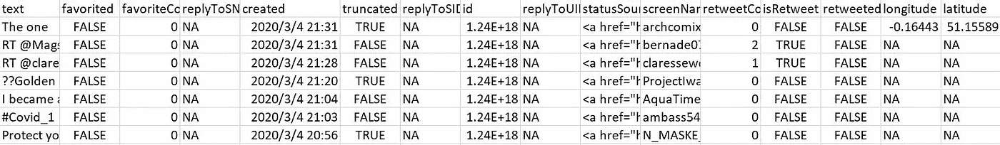
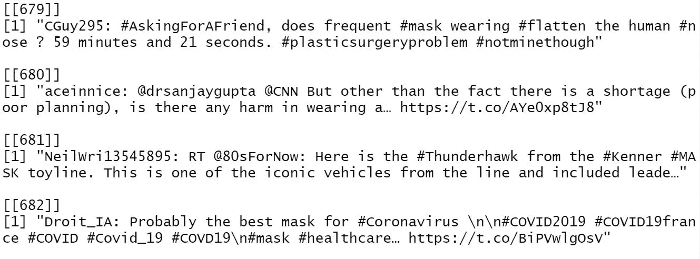
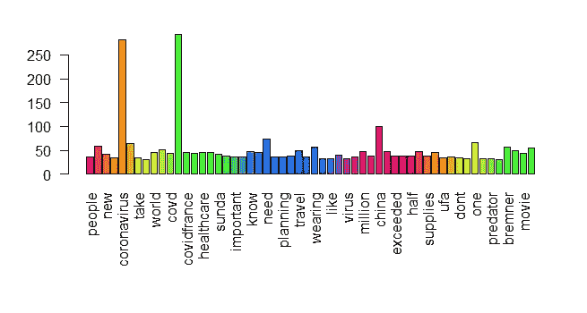
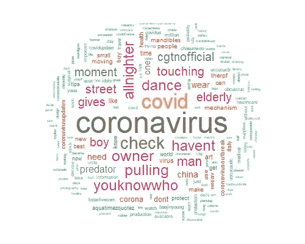
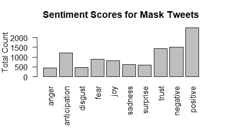
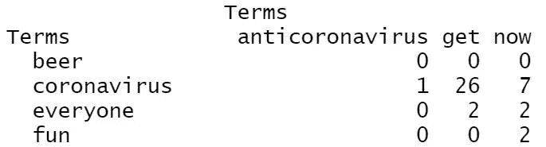
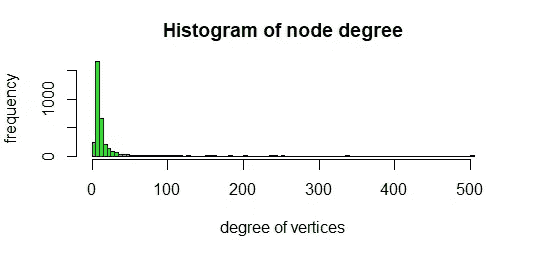
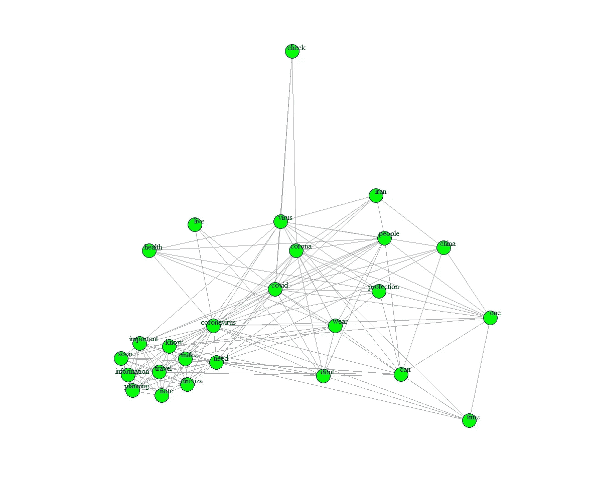
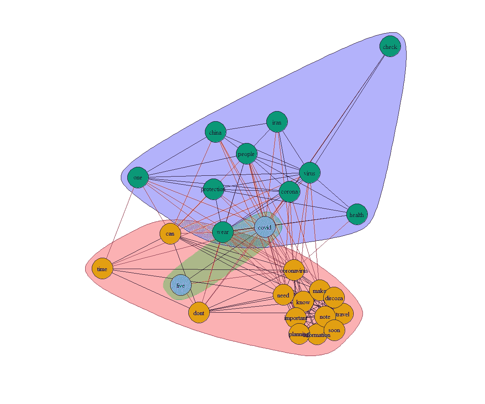
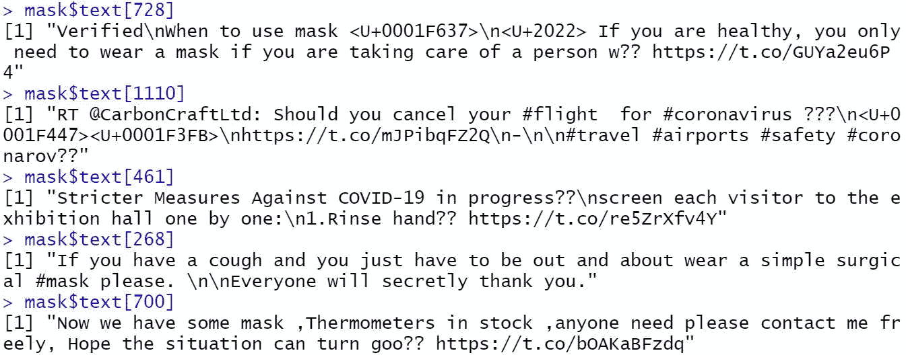

# 新冠肺炎爆发:口罩推特分析

> 原文：<https://towardsdatascience.com/covid-19-outbreak-tweet-analysis-on-face-masks-27ef5db199dd?source=collection_archive---------20----------------------->

2020 年 2 月 28 日，加利福尼亚州奥林达的一家真值五金店的招牌上写着防护面具售罄。(约翰·G·马英美资源集团/美国环境保护署-埃菲社/Shutterstock)

别买口罩了！在美国报道第二例新冠肺炎死亡一天后，卫生官员继续恳求美国人停止恐慌购物模式。虽然疾病控制和预防中心(C.D.C .)不建议健康人戴口罩以避免感染，但中国当局鼓励人们在面对新冠肺炎时戴口罩。[这种对比源于西方人和东方人不同的传统和习惯。在美国最近的口罩价格欺诈背后，普通人对戴口罩的态度引发了我的好奇。他们在网上聊些什么，整体情绪如何？他们的言论有没有网络效应？在下面的帖子中，我将通过进行推文分析来研究最近的口罩短缺问题。](https://theconversation.com/ive-always-wondered-why-many-people-in-asian-countries-wear-masks-and-whether-they-work-90178)

# 目标

这个项目有两个主要目标:

1.  了解人们对流行偶像口罩的态度
2.  看看人们的推文是否有网络效应，找出热门话题

在方法论方面，我将使用数据挖掘技术、情感分析和网络分析来实现上述两个目标。

# 数据理解

通过一个 Twitter 开发者账户，我从网站上提取了 1200 条包含关键词“面具”的推文。如下所示，原始数据有 16 列和 1，200 行。第一列包含 tweet 的内容，其他列描述参与度、时间和用户 ID 等信息。

表 1。部分原始数据

# 数据清理

如图 1 所示，很难分析原始杂乱的语料库。通过使用 R 中的 NLP 包，我从语料库中删除了标点、数字、停用词、URL 和空格。此外，由于推文是使用关键字“mask”提取的，我更关心的是与其一起出现的单词，而不是它本身。因此，我创建了一个字典，包括不必要的单词，如“面具”和“面具”，并从文本中清除。

图一。部分原创推文

了解文本挖掘的复杂性也很重要。一个词可以有多种意思。面膜也可以和护肤之类的话题有关，和我的学业无关。下一步我会解决这个问题。

# 数据探索

数据可视化让我们有了一些初步的了解。

图表 1。频率术语

不出所料，人们的推文集中在新冠肺炎疫情上。像“需要”、“重要”、“计划”这样的词让我们看到了他们的态度。他们还谈到了当前市场的供需不平衡。值得注意的是，右边有两个奇怪的术语，“布伦内尔”和“电影”这是一个关于克里斯·布伦内尔写的一部叫 M.A.S.K .的即将上映的电影的话题。通过下面的单词云，我看到了更多不必要的单词，如“通宵”

图 2。术语的词云

现在不相关的单词会直观地出现。我回去删除了所有这些推文，继续处理剩下的 1127 条推文。

# 情感分析

每个字背后都有情感。R 中的“syuzhet”包有助于在文本中捕捉人们的情绪。

图表 2。面具推文的情感评分

上述情节表明，推文更多地与预期和信任有关。人们在推特上确实有一些负面情绪。条形图显示，大约 30%的人在网上表达过恐惧，大约 50%的人表现出负面情绪。但总的来说，推特上的人们对流行偶像面具持乐观态度。

# 网络分析

虽然情感分析有助于了解个人的态度，但网络分析可以识别社交平台上的关系。在推文分析中，每个词都是一个顶点；顶点的度数表明了它与其他词的联系。例如，我们可以从下面的例子中看出，“冠状病毒”通常与“get”一起出现。'

图 3。一起出现的术语

从下面的直方图来看，右偏度表示大多数推文的度数值较小。右边的尾巴上也有一些极端值，意味着一些术语与其他术语有密切的联系。

图表 3。节点度直方图

那些流行的术语是什么？下面的网络图提供了一个更清晰的外观。为了避免混乱的显示，我只包含了频率超过 30 的术语。

图 4。术语可视化

关联术语是那些在 Twitter 上一起出现的术语。“冠状病毒”这个词位于网络图的中心，与所有其他术语相关。然后我根据边的介数将所有的单词聚集在一起。

图 5。基于边介数的聚类

介数表示一个节点位于其他节点的测地线路径之间的频率。这三组主要是关于正在发生的流行病、口罩的重要性和口罩的使用。

在看到术语之间的关系后，我继续讨论网络对推文的影响。

图 6。带有 tweets 的顶点

上面的图显示了推文的分布。我们可以看到很多推文没有连接(稀疏区域的离散点)。由于高参与度的推文更令人感兴趣，我删除了那些连接度较低的推文，得到了一个更详细的网络图，如下所示。

图 7。一个详细的推特网络

上面的数字代表原始数据中 tweets 的 ID。这两个密集区域的推文最常被点赞、转发和评论。然后，我从圈出的区域中随机挑选了一些推文，看看人们在 Twitter 上谈论的是什么。

图 8。Twitter 上参与度较高的精选推文

由于这些推文在网上引发了最多的讨论，我们现在知道了人们最关心的问题:

1.  他们不确定谁需要戴口罩来降低感染风险。
2.  他们对最初的旅行计划犹豫不决。
3.  他们关注新冠肺炎预防政策的变化。
4.  他们提醒出现症状的人采取行动。
5.  口罩的抢购模式还在继续。

# 部署

关键问题是“那又怎样”尽管文本挖掘是计算机科学的一个相对较新的领域，但它已经逐渐被应用于风险管理和客户服务等领域。新冠肺炎疫情刚刚在美国爆发。此时，文本挖掘技术有两个主要部署。

1.  零售商和供应商可以了解人们随着时间的推移而改变的态度，从而相应地调整库存和生产计划。
2.  当局可以知道人们的担忧和不确定性，给出明确的方向，并制定有益于人民的新政策。

最后，我的学习有两个改进点。首先,“syuzhet”软件包的一个主要问题是它没有适当考虑负面因素，这可能会对敏感性分析产生一些影响。其次，提取的推文数量可以更多，以捕捉在线全貌。