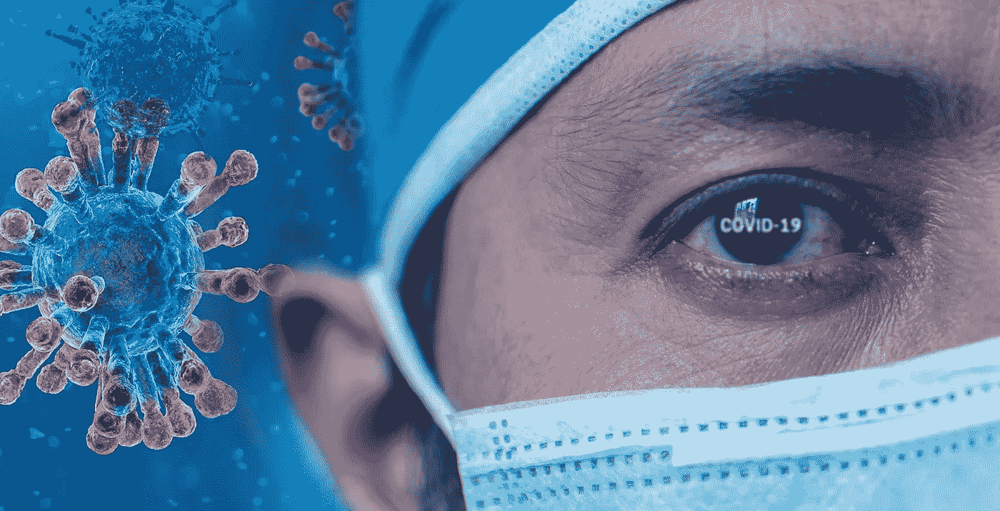
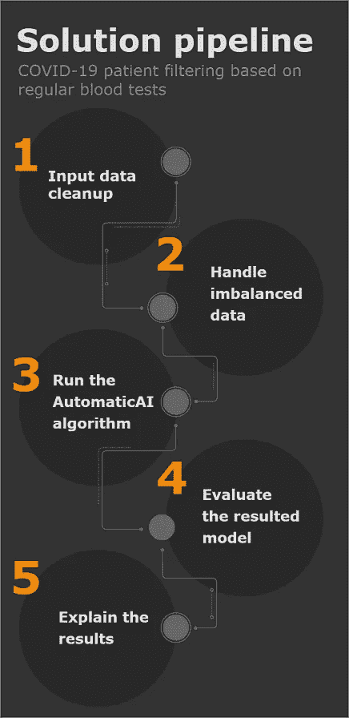
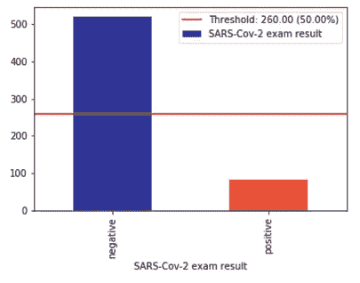
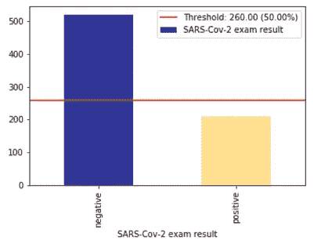
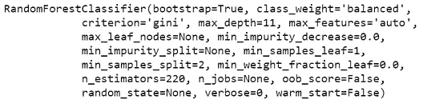
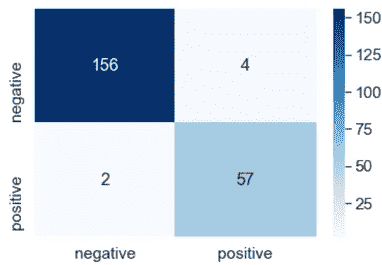
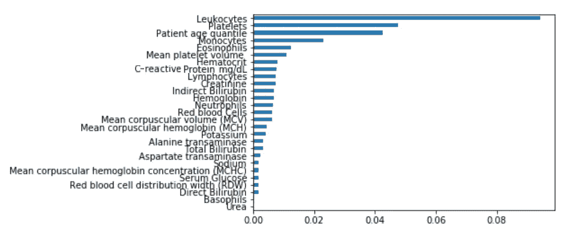

# 基于使用 AutomaticAI 的常规血液检查的新冠肺炎患者筛选和风险评估

> 原文：<https://towardsdatascience.com/covid-19-patient-filtering-and-risk-estimation-based-on-regular-blood-tests-using-automaticai-e583c7d56e61?source=collection_archive---------31----------------------->

## 创造一种可能的人工智能解决方案来帮助医生对抗新冠肺炎

图片由[Fernando zhimaicela](https://pixabay.com/users/fernandozhiminaicela-6246704/?utm_source=link-attribution&amp;utm_medium=referral&amp;utm_campaign=image&amp;utm_content=5028575)通过 [Pixabay](https://pixabay.com/?utm_source=link-attribution&amp;utm_medium=referral&amp;utm_campaign=image&amp;utm_content=5028575) 拍摄

# 问题的背景

大自然再次证明了它的力量，证明了即使在我们的文明世界里，我们也不是大自然的主人，但我们是大自然的一部分。

冠状病毒疾病于 2019 年 12 月被发现，我们仍在努力，我们不知道如何确切地对抗它，尽管有所有的计算能力，所有的技术发明和全世界所有梦想殖民火星或在月球上争夺土地的聪明人，我们仍然没有任何针对这种显然新病毒的解毒剂。

我认为，我们应该脚踏实地，寻找更有用的解决方案，帮助我们拯救我们的世界，而不是做殖民火星或从月球上开采矿物的梦。寻找新的可居住的行星并离开地球不是一个解决方案，但这只是一种懦夫的生存行为。我们有很多更实际的问题需要解决，比如**饥饿、污染、全球变暖，现在还有新冠肺炎**。我们应该集中精力帮助我们的人民，帮助那些活在当下、现在需要帮助的人。从局部开始，如果你甚至不能帮助你自己或你的家人，不要急于改变整个世界。

在这些艰难的日子里，有许多当地英雄，他们尽最大努力抗击新冠肺炎，帮助医生的日常工作，尽可能挽救更多的生命，他们提供免费服务，如为老人购物，运送货物，甚至缝制自制的口罩。我们应该感谢他们在这些危险的日子里所做的努力。

我想强调一个来自 Cluj-Napoca 的开发者团队展示的利他主义的特殊故事。这是一家初创公司的故事，一家名为 [**Spectro 的小公司。Life**](https://www.spectro.life/) ，一家致力于通过使用结合人工智能的物联网解决方案来帮助糖尿病患者的公司。

即使这是一个收入很少的初创公司，他们也很快将他们的糖尿病监测解决方案变成了一个新冠肺炎监测应用程序，帮助医生全天候远程监测感染者。该应用程序**完全免费**，此外**他们向买不起这些小玩意的人提供免费的传感器和智能手表**。实际上，他们掏空了自己的口袋来帮助我们，帮助抗击疫情。他们是真正的生活英雄，我们应该以他们为榜样，每个人都可以成为英雄，每个人都可以帮助，英雄主义是一种选择而不是一种特权。你可以在 [**国际新闻发布**](https://www.spectro.life/so/52N6Ds5bs#/main) 和他们的 [**主页**](https://www.spectro.life/) 上找到更多关于这个项目的信息。

**为了有助于对抗冠状病毒，在这篇文章中，我想介绍一种利用人工智能对抗新冠肺炎的可能方法。这只是一个想法，一个起点，而不是最终的解决方案，但它可以进一步发展，以创建一个更可靠的解决方案。**

# 使用人工智能进行新冠肺炎风险评估和患者筛选

为了控制冠状病毒的传播，识别已经被这种新型病毒感染的人是非常重要的。为了检测这种病毒，金标准是 **rRT-PCR** (逆转录聚合酶链反应)检测。但是有一个问题，这种测试是费时费力的手工过程，而且供应量非常少。所以问题是，**我们能不能想出一种替代的方法来过滤掉健康的人，并评估感染的风险**，**这种方法减少了所需的新冠肺炎检测的次数**。此外，我们希望创建一个自动过滤算法，**，这样医生就不会浪费时间**来评估和选择需要进一步测试和评估的患者。

在接下来的章节中，我们将介绍一种基于常规血液检测结果的初步患者过滤算法。为了选择最佳匹配的人工智能模型并调整其超参数，我们使用了 [**自动**](https://github.com/CzakoZoltan08/AutomaticAI) 。

[**自动**](https://github.com/CzakoZoltan08/AutomaticAI) 是一种通用算法，可用于任何类型的分类或预测问题，它会根据输入数据自动调整自身并选择最佳匹配算法。通过将该算法与一些预处理以及可能的一些特征提取步骤相结合，我们可以以相当高的分数(准确度、精确度、召回率等)解决几乎任何种类的分类(或回归)问题。).

其类似于 [Auto-Sklearn](https://automl.github.io/auto-sklearn/master/) 或 [Auto-Weka](https://www.cs.ubc.ca/labs/beta/Projects/autoweka/) ，主要区别在于 [**AutomaticAI**](https://github.com/CzakoZoltan08/AutomaticAI) 使用 [**群体智能**](https://en.wikipedia.org/wiki/Particle_swarm_optimization) 结合[**模拟退火**](https://en.wikipedia.org/wiki/Simulated_annealing) 来寻找最佳匹配模型并尽快调整其超参数。

使用*pip install automatica*命令，可以从 [**安装 **PyPi** 库。算法**的**源代码可以在这里**](https://pypi.org/project/AutomaticAI/) 找到 [**。**](https://github.com/CzakoZoltan08/AutomaticAI)

## 提议的解决方案管道

## 数据集

这个 [**数据集**](http://This dataset contains anonymized data from patients seen atthe Hospital Israelita Albert Einstein, at S ̃ao Paulo, Brazil. Alldata  were  anonymized  following  the  best  international  prac-tices and recommendations. All clinical data were standardizedto  have  a  mean  of  zero  and  a  unit  standard  deviation.  Dateshave been omitted and the information on the patient’s sex hasbeen coded.) 包含来自巴西圣保罗的以色列阿尔伯特爱因斯坦医院(Israelita Albert Einstein Hospital)的匿名数据。所有数据均按照国际最佳做法和建议匿名化。所有临床数据均标准化为平均值零和单位标准偏差。日期被省略，关于患者性别的信息被编码。

它包含大约 5000 多名患者的数据，每个患者有 100 多个特征。特征之间包含常规血液检测结果，具有白细胞、Mematocrit、血红蛋白、血小板、平均血小板体积等属性。除常规血液检测值外，还包含呼吸道合胞病毒、流感嗜血杆菌、乙型流感病毒、鼻病毒/肠道病毒等病毒(不同于冠状病毒)的不同检测结果。

## 预处理

此数据集的唯一问题是，它包含大量缺失数据。因此，第一个预处理步骤是删除血液测试完全缺失的所有行。有多个列与我们的问题不相关，因此我们也将删除不相关的列。此外，将仅保留缺失数据不超过 70%的列。

得到的数据集非常不平衡，有 500 多个负面示例，只有少数正面示例，如下图所示:

为了处理这个问题，我们使用了 [**XAI 的**](https://github.com/EthicalML/XAI) 库从 [**伦理 ML** 为**过采样**。以 0.4 的速率运行过采样算法后，我们得到以下结果:](https://github.com/EthicalML)

我们不想以更高的速率运行过采样，因为这将导致过拟合。

下一步是分离独立变量和因变量，因此要从要素中分离标签。由于 AutomaticAI 不能将字符串作为标签，我们将“正值”转换为 1，将“负值”转换为 0。

在运行自动算法之前，我们希望确保**在训练数据**中不再有缺失数据，因此我们再次运行数据，并用该特定特征的**平均值**填充所有缺失数据。

下一步是将数据分成训练集和测试集。

下一步是运行自动算法，为我们的数据找到最佳模型，并自动调整其超参数。

运行这个算法后，选择的模型是 **RandomForestClassifier** ，其**f1-得分为 95%** ，这确实是一个令人印象深刻的结果。

为了评估我们的模型，我们绘制了混淆矩阵。

由此产生的混淆矩阵可以在下图中看到。我们可以清楚地看到，结果非常好，与 213 个正确的结果相比，该模型只犯了 6 个错误。

除了分类结果(0 表示阴性，1 表示阳性)之外，该模型还返回一个介于 0 和 1 之间的值，该值表示分类结果的置信度。**该置信值可用于风险评估**。如果分类结果为阳性且置信度高，这意味着患者被冠状病毒感染的可能性高，因此需要进一步调查。如果结果是阴性，那么病人是健康的，所以我们没有必要在健康的病人身上浪费新冠肺炎测试。这可以**减少所需的新冠肺炎测试**和**的数量，帮助医生自动筛选出处于危险中并需要医疗护理的患者**。

## 解释结果

**医疗领域需要高度的问责制，因此也需要透明度**，这意味着我们需要能够解释机器决策、预测并证明它们的可靠性。

为了解释最佳模型的结果，即 **RandomForestClassifier** ，我们使用了**特征重要性**。可以使用 **XAI** 库计算特征重要性，如下所示:

这将生成如下图所示的图表:

正如我们所料最重要的特征是**白细胞**或**T3 或**白细胞**计数。**白细胞数量高于或低于正常值可能表明潜在疾病**。白细胞计数可以检测你体内隐藏的感染，并提醒医生未诊断的医疗状况。白细胞主要有五种类型:**中性粒细胞**，**淋巴细胞**，**嗜酸性粒细胞**，**单核细胞**和**嗜碱性粒细胞**。因为高嗜碱性粒细胞与病毒、细菌或其他类型的感染无关，但它是甲状腺功能减退的常见迹象，所以在特征重要性图中，它显得非常低。高数量的中性粒细胞、淋巴细胞、单核细胞或嗜酸性粒细胞是病毒感染的常见迹象**，因此，正如我们所料，它们在图表中具有更高的重要性值。

第二个最重要的特征是**血小板**。血小板是在我们血液中循环的细胞，当它们识别受损的血管时会结合在一起。血小板过多是由感染或其他情况引起的。通常血小板计数结合**平均血小板体积(MPV)** 进行评估，这也是一个重要特征，如图所示。当血小板通常被抗体、感染或毒素破坏时，会出现低血小板计数和高 MPV。

即使患者出现气短、疲劳、高血压、意识模糊或呕吐等症状，如果肌酸水平较高，则是肾衰竭或糖尿病的迹象，因此不是冠状病毒引起的。这就是肌酸在特征重要性图中也有很高分数的原因(用于排除冠状病毒)。

其他特征如**直接胆红素、间接胆红素、**钾等。也被模型用于排除新冠肺炎感染，因此这些特征将降低冠状病毒感染的风险。

# 结论

在本文中，我们介绍了一种使用人工智能对**新冠肺炎患者进行初步筛选和风险评估的可能解决方案。**

最佳人工智能模型是由**库自动选择的**，通过使用一些预处理步骤，如处理缺失和不平衡数据，选择的模型获得了令人印象深刻的结果。****

**为了增加该算法的可信度，我们使用了[**【XAI】**](https://github.com/EthicalML/XAI)库来**使用**特征重要性**图解释结果**。**

****数据集**和**完整代码**可以在下面的 git 资源库中找到: [**新冠肺炎-患者-过滤-使用-自动化**](https://github.com/CzakoZoltan08/COVID-19-patient-filtering-using-AutomaticAI) **。****

****感谢您阅读本文！如果你喜欢它，请在媒体上跟随我！谢谢大家！****

*****编者注:*** [*走向数据科学*](http://towardsdatascience.com/) *是一份以研究数据科学和机器学习为主的中型刊物。我们不是健康专家或流行病学家，本文的观点不应被解释为专业建议。想了解更多关于疫情冠状病毒的信息，可以点击* [*这里*](https://www.who.int/emergencies/diseases/novel-coronavirus-2019/situation-reports) *。***

****成为媒介上的作家:**[https://czakozoltan08.medium.com/membership](https://czakozoltan08.medium.com/membership)**

****我真的很喜欢咖啡，因为它给我精力去写更多的文章。如果你喜欢这篇文章，那么你可以给我买杯咖啡来表达你的欣赏和支持！****

****