# 新冠肺炎:人员层追溯

> 原文：<https://towardsdatascience.com/covid-19-person-level-drill-down-86a14dbbd78b?source=collection_archive---------53----------------------->

## 对捷克共和国个人层面数据的深入分析

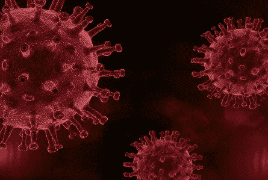

来源:( [enriquelopezgarre](https://pixabay.com/users/enriquelopezgarre-3764790/) )通过 [pixabay](https://pixabay.com/photos/coronavirus-mask-infection-virus-4957673/) (CC0)

# 介绍

主要有较大人群的累积新冠肺炎统计数据，例如国家一级的感染人数。

由于有价值，它很少告诉我们关于我们父母所属的年龄/性别群体，或我们伴侣的群体，或我们兄弟姐妹的年龄/性别的新冠肺炎情况。

*鸣谢:丹·佩尔乔夫斯基，* [捷克国家技术图书馆](https://www.techlib.cz/)内景照片

让我们全面深入了解关于年龄和性别组的个人信息。

# 数据

我们将调查有关捷克新冠肺炎患者的数据，这些数据可在捷克卫生部 [**网页**](https://onemocneni-aktualne.mzcr.cz/api/v1/covid-19) 获得。为了将新冠肺炎的情况放入人口统计背景中，我们将使用来自捷克统计局 [**网站**](https://www.czso.cz) 的数据。

请注意，关于阳性新冠肺炎病例的数据很可能偏向于不仅感染了新冠肺炎病毒，同时还出现了中度、重度或严重症状的人。我们还是说“*感染新冠肺炎/接触新冠肺炎”*而不是更精确但冗长的“*感染新冠肺炎并有中等、严重或危急症状”。*

# 第一部分.深入了解我们如何导入新冠肺炎

我们知道新冠肺炎不是起源于捷克共和国。让我们调查一下我们所知道的有关新冠肺炎输入病例的情况，从总体概述开始，然后深入到更详细的细节。

## 概述

每个暴露国家的输入性新冠肺炎病例总数是多少？

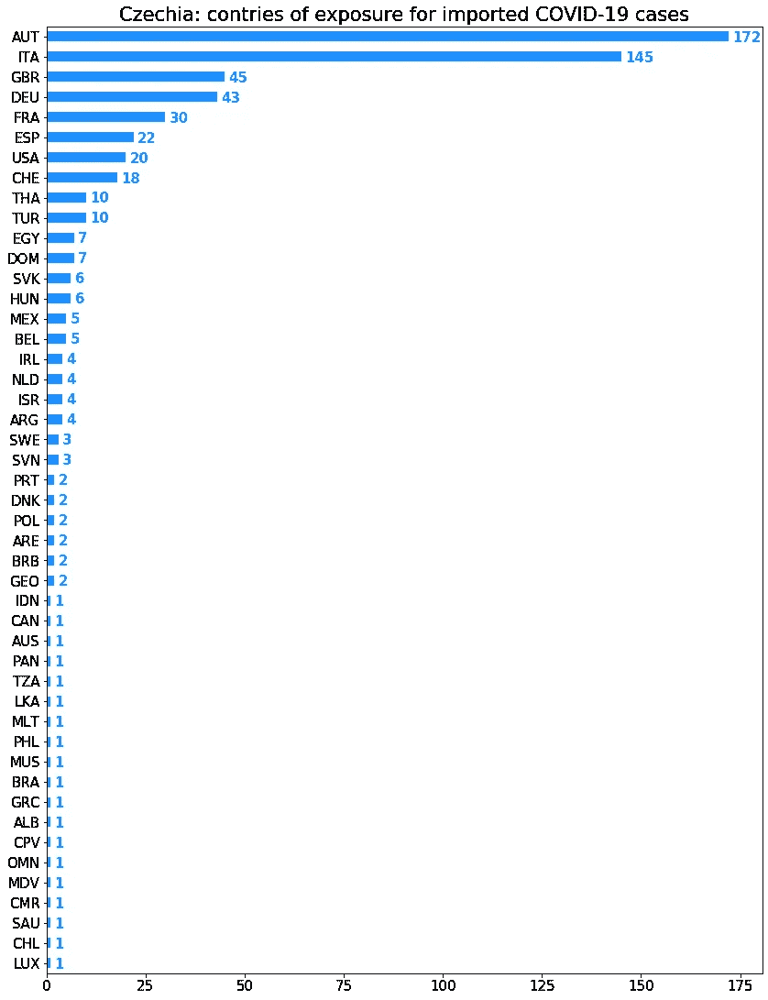

我们已经看到了进口病例来自的地方。现在让我们概述一下**发生在**什么时候。

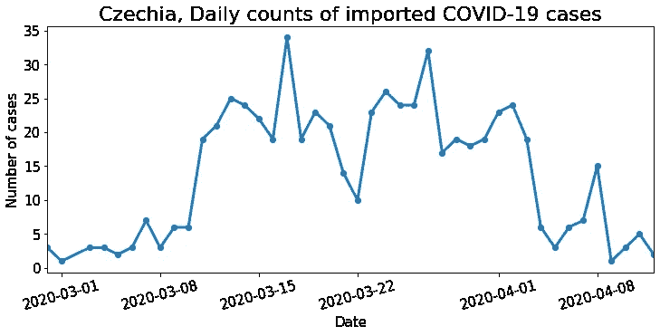

好消息是，最近输入性新冠肺炎病例的绝对数量似乎有下降趋势。

## 暴露在哪个国家，有多少病人？

## 每个暴露国家的捷克患者人数，及时

让我们首先检查不同国家的累计计数。

为此，我创建了一个交互式可视化，可以通过 [**这个链接**](https://samusram.github.io/cz_covid_where_from_when_cumulative/) 访问。请随意探索各种细节，亲自体验可视化。

作为开胃菜，对于每个单独托管的交互式可视化，我将发布简短的 gif 和简短的评论。

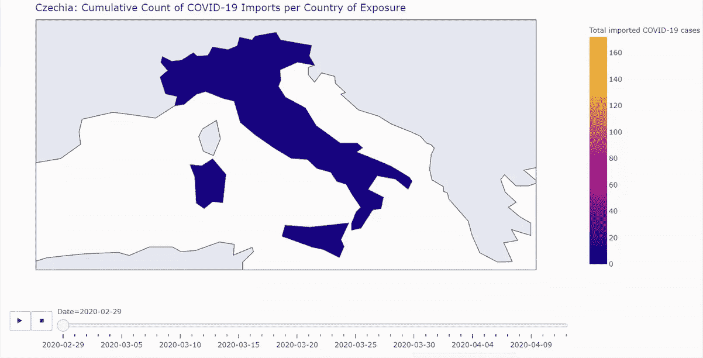

在上面的 GIF 上，我们可以看到新冠肺炎是如何从意大利进口到捷克的。后来，全世界的捷克人都接触到了新冠肺炎。然而，意大利和位于意大利和捷克之间的奥地利仍然是主要的投资国。有趣的是，没有一个捷克病人在中国接触到这种病毒。

我们已经看到了每个国家的累计总数的演变。现在让我们检查每个暴露国家每周输入的新冠肺炎病例数。对于 GIF，我将重点关注欧洲。

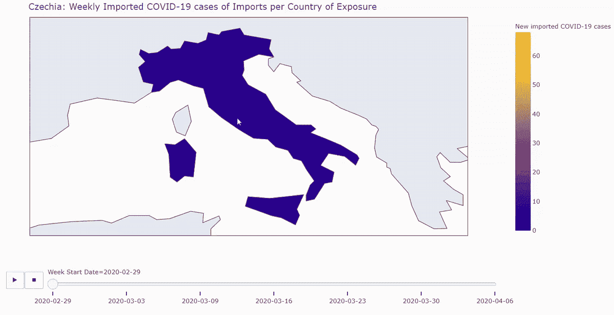

*再次，请随意通过* [***这个链接***](https://samusram.github.io/cz_covid_where_from_when_weekly/) *来玩这个互动可视化。*

放大到欧洲，我们可以看到，在疫情爆发的前几周，几乎所有输入性新冠肺炎病例都来自意大利。后来，虽然意大利仍然是主要的暴露源，但奥地利成为第二大病毒暴露源。后来，每周进口的大部分原产于奥地利。最后，进口数量下降了。这给人的印象几乎是，我们看到了一波从意大利到捷克的进口潮，奥地利是意大利和捷克之间的主要转运点。

在调查输入捷克共和国的新冠肺炎病例时，我们同时检查了“来自哪里、何时、有多少？”。然而，我们还没有分析病人的性别。现在让我们来关注一下。

## 什么性别的病人，什么时候？

## 及时输入新冠肺炎的患者中女性的比例

让我们来看看每周输入新冠肺炎的捷克男女患者的数量。

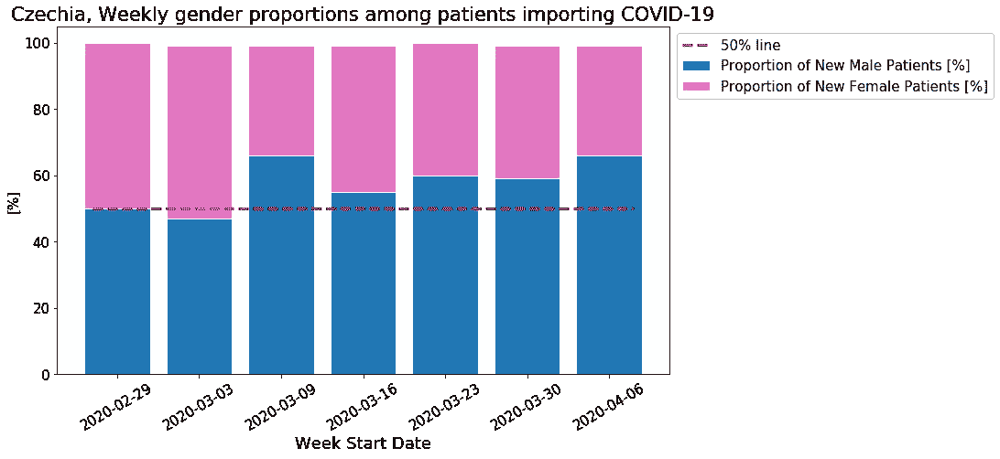

首先，通过每周汇总，我们可以更好地看到男性和女性输入病例总数的减少。让我们希望它保持这样。

第二，我们可以看到，在输入的新冠肺炎病例中，男性系统性地多于女性。它适用于所有年龄组吗？让我们深入到年龄/性别组。

## 不同性别患者的年龄？

让我们先来看看每个年龄段每个性别的输入病例总数。

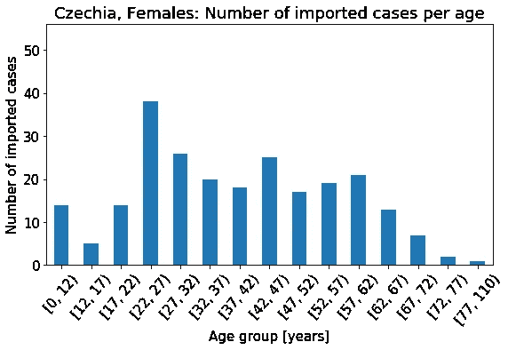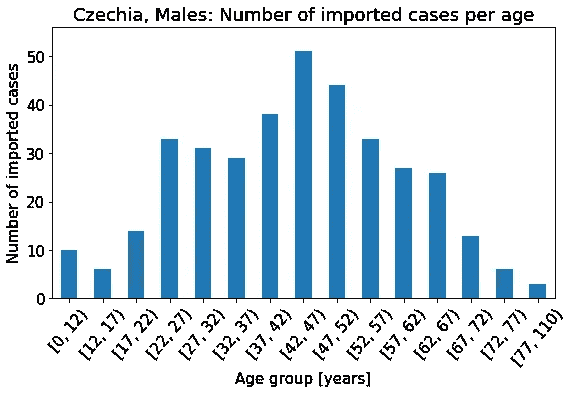

有趣的是，20 多岁的男性和女性有相似的进口活动，女性实际上更活跃。然后，对于男性和女性来说,“进口活动”随着年龄的增长而下降，直到 40 岁，这种下降对女性来说尤其迅速。根据官方统计，捷克首次生育母亲的平均年龄为 29 岁(来源于捷克文)。继续到更高的年龄组，我们可以看到男女两性对应于 45 岁左右的局部分布模式。与 30 多岁的女性相比，40 多岁的女性输入了更多的新冠肺炎病例。然而，总体而言，40 多岁的男性是最活跃的输入群体。

暴露国家中最活跃的年龄/性别群体是否相同？让我们找出答案。

## 根据不同的接触国家，哪个年龄/性别组最活跃？

让我们创建单独的交互式可视化，一个针对女性，一个针对男性。两种可视化将共享相同的色标，以便我们可以在视觉上比较选定的年龄/性别组。人们可以通过将鼠标移动到可视化的相应框来检查来自任何国家/年龄/性别的病例的精确计数。

原始尺寸可视化可以在这里找到[(女性)](https://plotly.com/~samusram/52/#/)和[(男性)](https://plotly.com/~samusram/54/#/)。

我们可以看到，典型的患者年龄因国家而异。

例如，在联合王国，20 多岁的年轻人是男女输入病例中最大的年龄组。

在暴露于新冠肺炎病毒的捷克患者中，40 多岁、50 多岁和 60 多岁的人群数量最多，同性别的 60 多岁男性多于女性。

另一方面，与意大利病例相比，从奥地利输入的病例对应于更年轻的年龄组。

这些差异可能暗示了访问一个国家或另一个国家的主要原因(例如，学习相对于工作相对于家庭娱乐)。

在奥地利，我们可以看到男女年龄分布的差异。20 多岁的女性是在那里感染新冠肺炎病毒的女性中人数最多的年龄组。此外，就奥地利而言，这一年龄组的妇女多于男子。关于在奥地利接触到病毒的男性，30 多岁和 40 多岁的男性是捷克新冠肺炎进口商中最活跃的群体。在所有国家的所有年龄/性别群体中最活跃。

在上面的分析中，我们没有调查导入的时间。特定年龄/性别群体的进口活动是否会随着时间而变化？

## 哪个年龄/性别群体在特定日期最活跃？

很高兴看到最近所有年龄/性别群体的进口活动都在减少。

在其他观察结果中，人们可以注意到 60 多岁男性的输入病例在 3 月份有所增加，而对于 20 多岁或更年轻的男性，总的趋势正好相反。

我们首先看到了每个不同国家输入的新冠肺炎病例的年龄/性别统计，然后我们及时检查了每个年龄/性别的输入。现在让我们尝试结合这两种观点，及时检查每个国家输入病例的性别比例。

## 暴露在什么国家，什么性别，什么时候？

## 按暴露国家分列的输入新冠肺炎病毒的患者中女性的比例

让我们用我在这里主持的**互动可视化来调查女性在新患者中的每周比例。**

**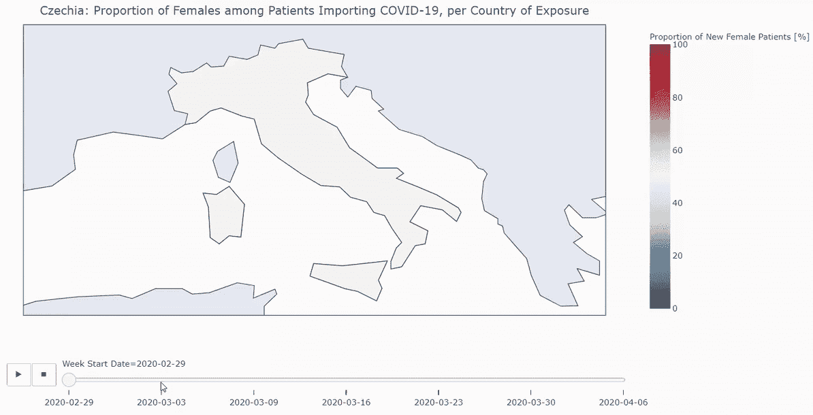**

**我们正在分析每周汇总。然而，有时我们只有一两个从某个国家传入的病例。然后，颜色告诉我们一个人的情况。更有意思的是检查每周病例数较多的主要“进口国”的可能趋势:意大利和奥地利。**

****义大利****

**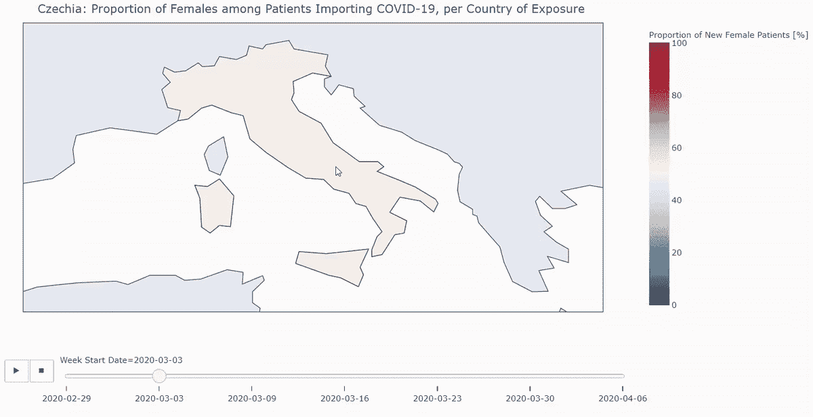**

**似乎意大利出口的男性和女性的比例一直大致相同(可能除了三月的第二周和四月的第一周，那时男性略多)。我很好奇，在意大利接触到病毒的病人来自捷克的哪个地区。**

**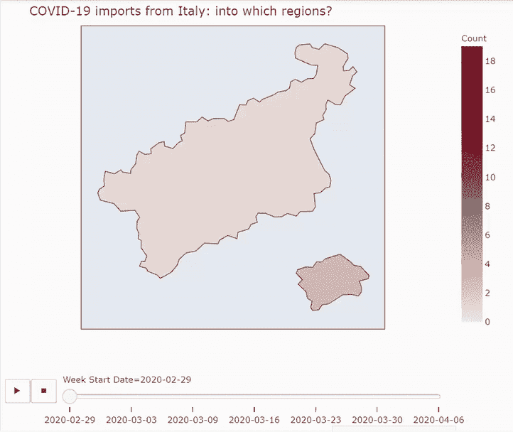**

****奥地利****

****

**除了 3 月中旬和最后一周总共只有 8 个病例外，澳大利亚感染新冠肺炎的男性患者明显更多。那些可能主要是商务旅行吗？让我们也快速检查一下奥地利病例输入到了捷克的哪些地区。**

****

**最后，我们还将及时检查每个国家的平均进口年限。**

## **暴露在哪个国家，多长时间，什么时候？**

**可以在 处找到 [**能够详细调查年龄信息的交互式可视化。**](https://samusram.github.io/cz_covid_where_from_how_old_when_weekly/)**

**作为一个人们可能会好奇的例子，我想看看年轻人什么时候从英国带来了新冠肺炎。**

**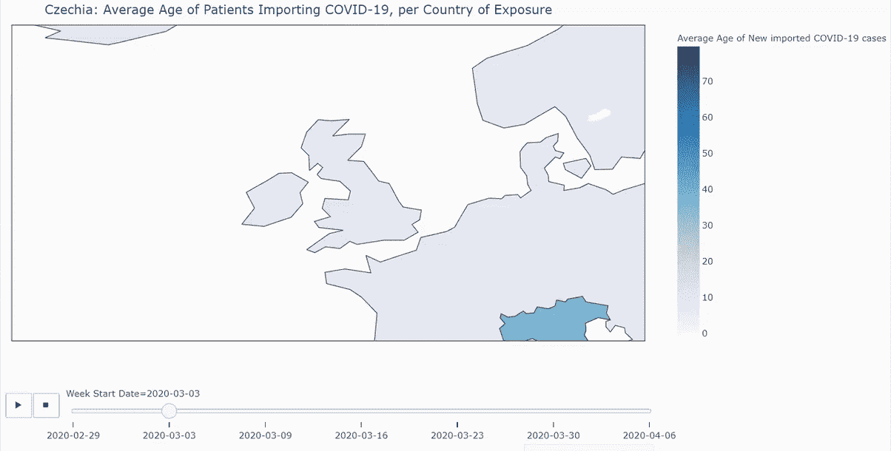**

**有趣的是，在 3 月下半月和 4 月初，英国进口商的平均年龄下降了。简单地搜索了一下，在这个网页上，我看到了给学生留在家里的“基本建议”，日期是 3 月 24 日。这可能是对我们所看到的现象的一种可能的解释吗？**

## **输入性新冠肺炎病例应该是我们的主要关注点吗？**

**要回答这个问题，让我们来看看每天输入性病例与本地病例的比例。**

**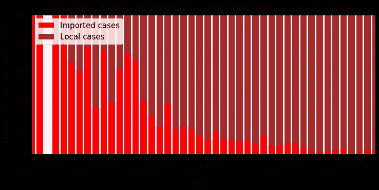**

**分析捷克共和国的总体情况很重要。**

# **第二部分。捷克地区追溯**

## **从捷克所有新冠肺炎患者的概况开始，深入分析谁、何时、何地**

## **概述**

**让我们首先检查高层次的总结。新冠肺炎阳性患者每个性别的总体年龄分布是什么？**

**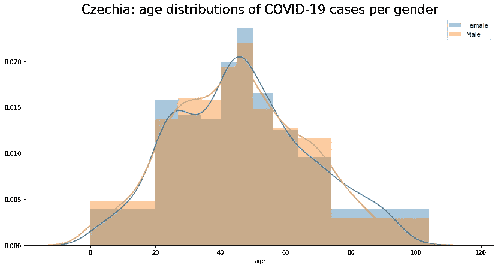**

**我们可以观察到女性和男性的分布有两个有趣的差异。**

**与同年龄组的男性相比，30 多岁的女性似乎较少感染新冠肺炎病毒。70 多岁的女性和男性的情况也是如此。此外，30 多岁的女性比 20 多岁的女性更少出现电晕。我们已经提到过，在捷克，第一次做母亲的平均年龄是 29 岁，所有生育的母亲的平均年龄是 31 岁。生孩子会导致更有效的自我隔离和社会距离，导致观察到的 30 多岁女性比例吗？我们稍后将检查年龄/性别组在总人口中的比例，然后得出结论。**

**我们已经检查了病人的性别。新冠肺炎患者在各地区的总体分布情况如何？**

**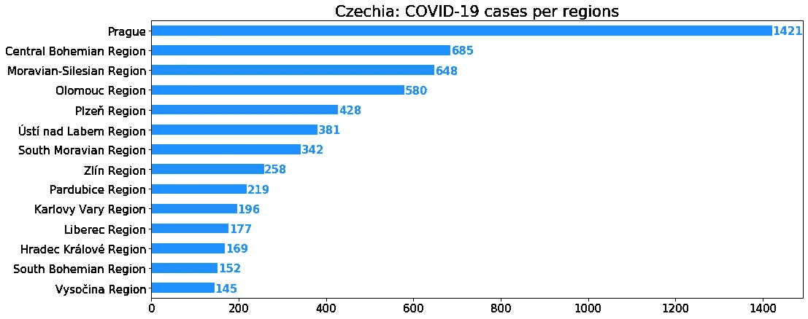**

**哦，布拉格…应该注意的是，根据官方统计，中央波希米亚地区的总人口略高于布拉格的人口。然而，布拉格的人口密度高出 30 多倍，这可能意味着社交距离明显更难。**

**我们已经分别看到了“谁”(年龄分布)和“哪里”(地区分布)。现在，让我们深入了解组合细节。**

## **谁在哪里？**

**让我们使用交互式可视化来查看每个地区每个性别的新冠肺炎患者的年龄分布。**

**我们之前已经看到，与 20 多岁的女性相比，30 多岁的女性新冠肺炎病例较少。现在我们可以看到，在几个地区，同样的情况也适用于男性！**

**人们还可以注意到不同地区年龄分布的不同变化。例如，Olomouc 的女性分布向年轻女性转移，而úSTínad Labem 似乎向老年妇女略有转移。然而，根据官方人口统计，Olomouc 地区女性的平均年龄略高于úSTínad Labem 地区女性的平均年龄。众所周知，奥洛穆茨是一个“学生”城市，那里 1/5 的人口是来自全国各地的学生(捷克语中[的引用)。这一观察将有助于我们对高危人群进行分析。](https://www.studenta.cz/6-duvodu-proc-studovat-v-olomouci/r~st:article:1239/)**

**所以，我们一直在看“谁”和“哪里”，完全忽略了疫情的时间线。再加上“什么时候”的问题吧。进入我们的下钻！**

## **何时何地？每个地区的新冠肺炎患者人数**

**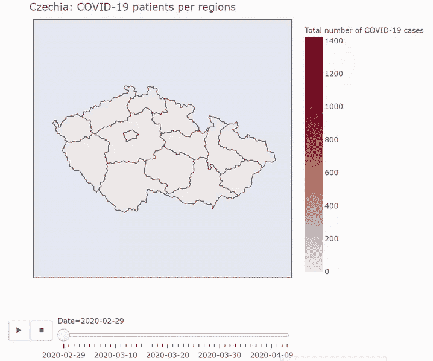**

**交互可视化可以在 [**这里**](https://samusram.github.io/plotly-covid-19-cz-counts/) 找到。**

**最终的累积计数支配了早期的统计数据，使得很难直观地检查开始时发生了什么。对数色标将使我们能够更好地看到流行病的早期阶段，关于对数色标的更多细节可以查看[相应的维基页面](https://en.wikipedia.org/wiki/Logarithmic_scale)。**

**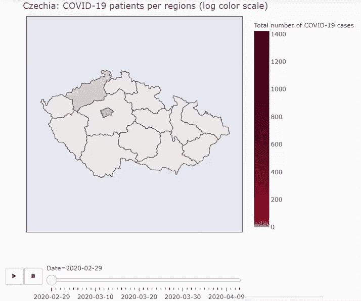**

**我们可以看到疫情是如何在乌斯季和布拉格开始的，然后中部和东部地区成为新冠肺炎的领导者，直到我写这篇博客的时候，他们一直是“领导者”。**

**我们及时调查了每个地区的阳性病例总数。现在让我们及时检查每个年龄/性别组的新冠肺炎患者。**

## **谁和什么时候？每天每个年龄/性别组的新新冠肺炎患者计数**

**详细的可视化使我们能够检查，例如，老年人群体。我们可以看到，在流行病开始时，60 多岁的男性是当时所有男性年龄组中每日新新冠肺炎病例数最高的人群之一。我们知道，捷克政府很早就实施了保护老年人的额外措施。从数据中我们可以看到，对于 60 岁以上的人来说，新患者的日增长率并没有像年轻群体那样增长。在大约一周的时间里，60 多岁的人每天的新增病例数下降。然而，后来这个数字开始上升，特别是这个年龄段的男性，这个数字在同一日期接近其他年龄段。另一个令人不安的观察结果是 40 多岁的女性新增病例数很高。**

**现在让我们调查每个地区新患者的性别比例。**

## **什么性别，什么时间，什么地点？**

## **每个地区每周新增女性患者的比例**

**为了减少噪音，我们计算并可视化每周统计数据。**

**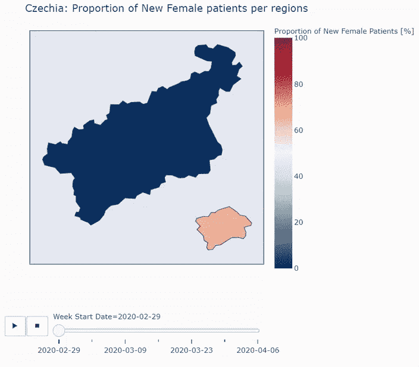**

**请随意自己玩交互式可视化，检查各种细节。可视化坐在[这里](https://samusram.github.io/cz_covid_what_gender_when_where/)。**

**可视化使我们能够看到，新女性和新男性患者的数量通常是不同的，即使是在随后几周的更大样本中，当有许多新的新冠肺炎患者时。让我们注意到这一周是从 3 月 30 日开始的。在所有地区，新的新冠肺炎阳性患者中女性更多。**

**那一周新病人的平均年龄是多少？让我们检查一下。**

## **多大，什么时候，在哪里？**

## **每个地区新患者的平均年龄**

**同样，您可以在[这个地址](https://samusram.github.io/cz_how_old_when_where/)上找到交互式可视化，并检查任何细节。**

**在这里，我将重点关注从 3 月 30 日开始的这一周，我们注意到这一周女性新患者的比例有系统地上升。**

**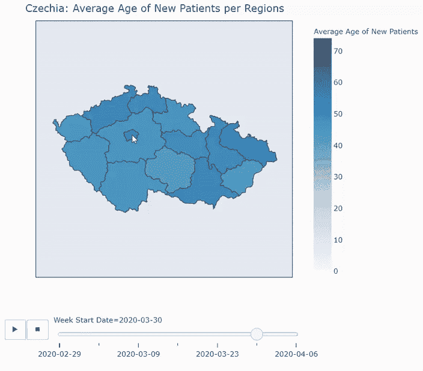**

**似乎在这一周，40 多岁的人感染新冠肺炎病毒最多。这可能表明，在捷克，40 多岁的女性可能是感染新冠肺炎病毒风险较高的年龄/性别群体。**

**让我们更正式地分析每个年龄/性别群体感染新冠肺炎的风险。**

# **第三部分。每个年龄/性别群体感染新冠肺炎病毒的风险**

**首先，让我们检查一下，与我们基于人口统计学的预期相比，数据显示每个年龄/性别组的不同风险。**

## **新冠肺炎对所有年龄性别群体的攻击是均等的吗？**

**让我们制定一个无效假设，新冠肺炎随机攻击任何人，不管什么年龄/性别组。接下来，让我们检查数据是否提供了足够的证据来反对这个假设。如果是这样，我们就拒绝这个假设。这就是统计学家经常使用数据来验证事实的方式。这是一个相关的笑话。**

**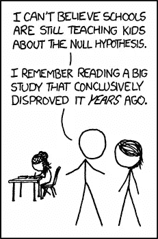**

**来源:[**XKCD**](https://xkcd.com/892/)**(CC0)****

****关于我们将如何检查这一点的详细信息****

**在这一部分，我将提供一个简短的统计介绍。有很强统计学背景的读者可能想跳过这一节。另一方面，如果能对我的描述进行修正，我会很感激。**

**我们将使用捷克人口统计数据来计算每个年龄/性别组的比例。利用这些比例，我们将计算每个年龄/性别类别中新冠肺炎阳性患者的预期频率。如果零假设成立，也就是说，如果每个年龄/性别组的新冠肺炎收缩率相等，我们就可以预期这些频率。**

**然后，我们将使用一个数字来总结这些预期频率和观察到的频率之间的差异，称为统计卡方，表示为 *χ* 2。数学家们知道如果零假设为真，χ2 的不同值有多大的可能性。这将使我们能够检查如果不同的年龄/性别群体平均收缩新冠肺炎，我们的数据是多么不可能。在此基础上，我们将决定我们是否应该拒绝零假设。**

**事先达成一致是一个好习惯，在这种情况下，我们将拒绝零假设，否则，人们可能会试图将自己的信念投射到对结果的解释中。罗纳德·科斯曾经说过，**

> **如果你折磨数据足够长的时间，它会承认任何事情。**

**我们很快会看到另一个关于测试结果解释的笑话，但是为了让每个人都完全理解它，我们需要刷新一个 ***p 值*** 的定义。**

**我们已经讨论过统计数据 *χ* 2 总结了我们观察到的和我们期望的之间的差异。 *χ* 2 值越高，差异越大。换句话说， *χ* 2 值越高，我们的数据越不可能是真的。 *P 值*是当零假设为真时，得到我们的 *χ* 2 值或 *χ* 2 值甚至更高的概率(即证明假设更不成立的值)。**

**综上所述，我们得到的 p 值越低，我们在真零假设假设下的观测值就越不可能，因此拒绝零假设就越安全，这表示为 ***H₀*** 。**

**如前所述，在进行统计实验之前，最好就 p 值“低”的含义达成一致。通常，我们会设置一个阈值来与获得的 p 值进行比较。如果 p 值小于阈值，则无效假设将被拒绝。这个阈值称为显著性水平，用α *表示。*我们同意测试新冠肺炎是否以α *=* 5%的显著性水平平均攻击所有年龄/性别组。**

**关于结果解释的笑话来了。**

**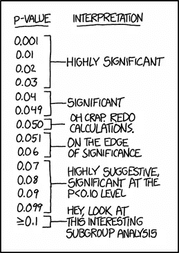**

**来源:[**XKCD**](https://xkcd.com/1478/)**(CC0)****

**如果对我们将要执行的统计测试的技术细节感兴趣，人们可能会想看一个来自可汗学院的短片。**

****卡方检验结果****

**我们已经检查了皮尔逊卡方检验的前提条件，然后得到 p 值= 1.8*10⁻ ⁶。因此，我们安全地拒绝显著性水平为α *=* 5%的零假设。**

**让我们直观地比较观察到的新冠肺炎年龄/性别比例与人口比例。**

**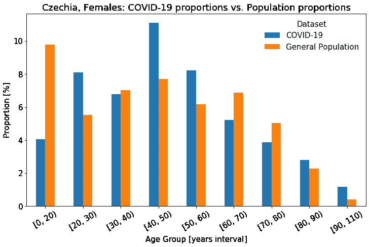****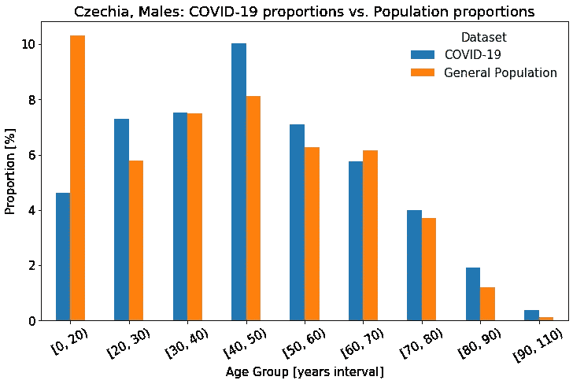**

**鉴于 20 岁以下人群的比例差异如此之大，我们拒绝零假设也就不足为奇了。**

**现在让我们分别检查每个年龄/性别类别。因为我们将使用相同的数据样本执行多个测试，所以让我们应用 Holm 校正。**

****同一数据多次测试有什么问题？****

**同样，有很强统计背景的读者可能想跳过这一部分。**

**使用相同的数据进行多重测试会导致所谓的多重比较或多重分析问题。问题类似于多次掷骰子。**

****

**来源:( [ID 955169](https://pixabay.com/users/955169-955169/) )通过 [pixabay](https://pixabay.com/photos/roll-the-dice-craps-board-game-1502706/) (CC0)**

**我们知道得到 6 的概率是 1/6 或大约 17%。让我们想象一下，你掷骰子得到了 5 英镑。你对你的“分析”结果不满意，所以你重新掷骰子。假设你又不开心了，所以你再掷一次，这次你得到了想要的 6。然而，当掷出三个骰子时，至少有一次得到 6 的概率是 42%，而不再是 17%。**

**如果您测试数据样本的多个子组，也会发生类似的情况。子群越多，子群中的一个就越有可能偶然“坦白”，正如科斯的名言**

> **如果你折磨数据足够长的时间，它会承认任何事情。**

**因此，当对多个组重复相同的假设检验时，偶然得到某个组的低 p 值的风险更高。在这种情况下，我们会错误地拒绝一个真正的零假设。这种类型的误差称为 I 型误差。**

**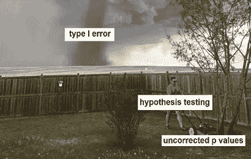**

**来源:([统计统计模因](https://www.facebook.com/statsmemes))经[脸书](https://www.facebook.com/photo?fbid=585606708478293&set=a.306077739764526)**

**可以看出，对于显著性水平为α的单一假设检验，I 型错误的概率小于或等于α。**

**如果我们希望在多次测试的情况下将 I 型错误的概率保持在α之下，我们需要在与α比较之前校正 p 值。最基本的校正是所谓的 Bonferroni 校正，对于 *m* 测试，在与α比较之前，每个 p 值乘以 *m* 。然而，Bonferroni 校正非常保守，并且已知经常不能拒绝错误的零假设。在我们的案例中，这意味着不同年龄/性别的人群感染新冠肺炎病毒的风险是不同的，但我们无法拒绝风险相同的无效假设。**

****

**灵感来自:([统计统计模因](https://www.facebook.com/statsmemes))经由[脸书](https://www.facebook.com/photo?fbid=587074834998147&set=a.306077739764526)**

**这种类型的错误被称为第二类错误。**

**我们将使用 Holm 校正，它是 Bonferroni 校正的改进，技术细节可以在 wiki 中找到，例如[。应该注意的是，该测试仍然相当保守，仍然可能导致第二类错误。](https://en.wikipedia.org/wiki/Holm–Bonferroni_method)**

*****关于分组卡方检验的一个注记*****

**有经验的读者已经注意到，通过逐组执行卡方检验，我们将得到一个具有一个自由度的卡方分布，这只是一个平方正态分布。因此，实际上我们将做一些类似于 z-test 的事情来检验比例的差异，因此我们必须检查相应的前提条件，我们已经这样做了。90 岁以上的预期男性患者不到 10 例，因此我们将 90-110 岁年龄组排除在分析之外。**

****每个年龄/性别组的单独结果****

**根据霍尔姆校正的重复测试结果，对于大多数年龄/性别组来说，零假设被拒绝，取而代之的是年龄/性别组不会随机暴露于新冠肺炎。**

**让我们计算新冠肺炎年龄/性别群体比例与基于人口统计的预期比例之间的差异。对于随机暴露于新冠肺炎没有统计差异的组，让我们插入零。让我们用红色描绘增加的新冠肺炎曝光，用绿色描绘减少的曝光。**

***雌性***

**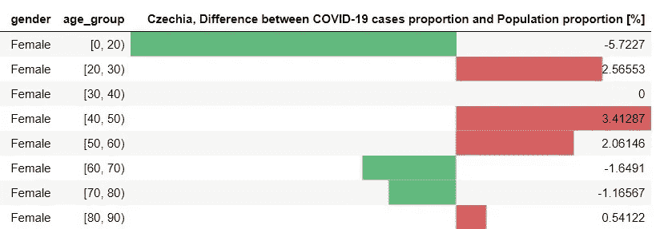**

***雄性***

**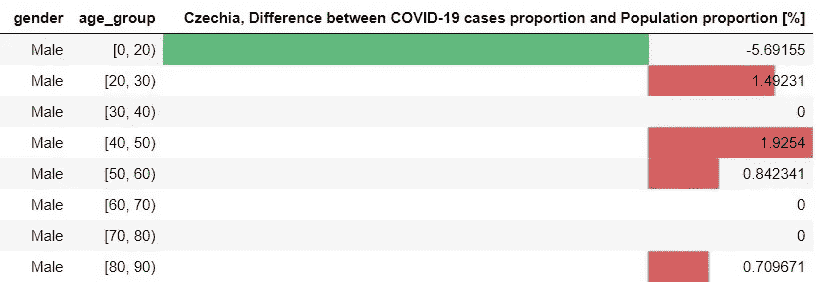**

**我们只是利用了新冠肺炎和总人口比例之间的直接差异。让我们使用置信区间来计算比例中数量差异的更保守的估计。**

## **年龄/性别组比例的置信区间和更保守的风险定量评估**

**让我用一个具体的例子来说明我将要做的事情。我母亲属于 50-59 岁之间的女性，我将用这个群体作为例子。**

1.  **首先，我将根据新冠肺炎的数据估计 50-59 岁女性的人口比例。群体比例的 99%置信区间为 7.1-9.6%。如果这个特定的年龄/性别群体被随机暴露在病毒中，这是一个很可能属于**的人口比例的间隔**。**
2.  **然后，我们使用人口统计数据计算 50-59 岁女性在人口中的实际比例。实际比例为 6.2%。**
3.  **将置信区间与真实比例进行比较，我们得出结论，新冠肺炎比例比人口比例至少高 0.9%**

**结果总结如前:**

***雌性***

**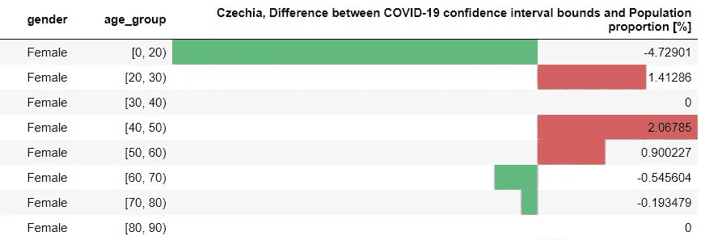**

***雄性***

**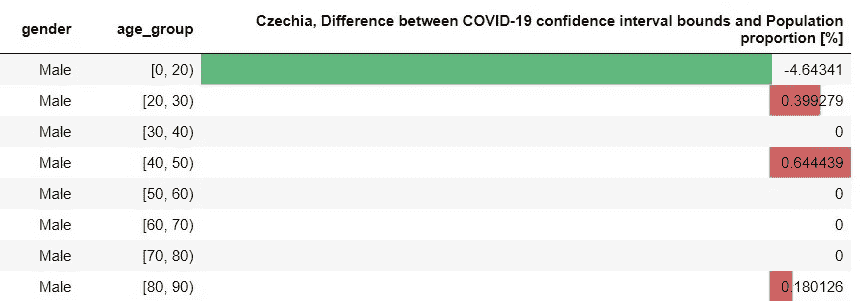**

**对于风险增加的年龄/性别组，让我们将风险增加与组比例一起可视化。**

******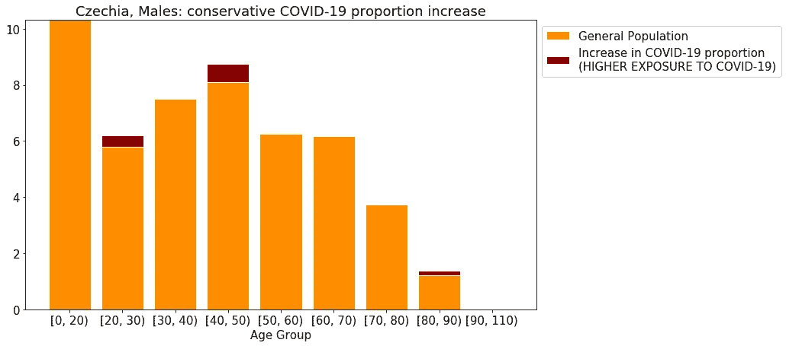**

# **结束语**

**一些见解:**

*   **对于捷克女性和男性来说，20-29 岁、40-49 岁和 50-59 岁年龄组接触新冠肺炎的风险明显高于随机人群。**
*   ****可能的原因是什么？** - >这些是活跃的群体，即使在正式的紧急状态下也必须上班**
*   **30-39 岁的女性和男性没有更高的风险。为什么？ - >一开始是一个令人费解的观察。然后，我查了一下，捷克母亲出生时的平均年龄是 30.1 岁([来源于捷克](https://www.czso.cz/csu/czso/aktualni-populacni-vyvoj-v-kostce))。这意味着在 30-39 岁的人群中，有许多孩子的父母。幼儿园和学校都关门了，家长们经常必须呆在家里照顾孩子。**
*   ****给每个人的一个信息**:这个年龄组的大多数父母不得不呆在家里带孩子，因此更系统地远离社会，这表明了社会距离对于新冠肺炎预防是多么重要。每个人都可以发挥作用！**
*   **谢天谢地，保护老年群体的有效国家政策似乎起了作用。然而，这些政策似乎对女性更有效。因此，对于 60 岁和 70 岁的男性来说，暴露于新冠肺炎的几率并不比随机的少很多，而对于同年龄的女性来说，暴露的几率要少很多。也许值得进一步调查这一事实，看看这是否是由于女性更好的管教/更多地呆在家里陪孙子/其他原因。**
*   **令人欣慰的是，输入病例的比例正在下降，证明政府的旅行限制是正确的。**
*   **似乎我们可以对最年轻的近亲保持合理的冷静。我仍然认为，即使是 19 岁以下的人也不应该放松警惕，因为众所周知，没有症状的人仍然可以传染给他人。**

# **局限性讨论**

*   **如前所述，关于新冠肺炎阳性病例的数据很可能偏向于那些不仅感染了新冠肺炎病毒，同时还出现了中度、重度或严重症状的人。根据**数据**部分的协议，整个帖子由“*签约新冠肺炎/接触新冠肺炎/ect。”*我们指的是“*感染新冠肺炎并有中度、重度或危急症状”。***
*   **其次，数据中的新冠肺炎样本很可能偏向于那些自己想接受测试的人。例如，可能有一些症状温和的新冠肺炎阳性患者在疫情期间不愿意去卫生机构就诊，并且没有记录在案，而一些症状温和的新冠肺炎阳性患者可能更愿意去检测中心就诊。**
*   **此外，在流行病爆发之初，检测能力可能不足，这可能会带来额外的偏见，例如，在最初几周，可能会对有严重症状的病例产生偏见。**
*   **接下来，我们只分析了新冠肺炎阳性确诊病例的数据。我们没有关于人的死亡率或病毒后果的信息，这对于分析是非常重要的。**
*   **此外，我们没有关于患者原有健康状况的信息，而这些信息对于分析也是至关重要的。**

**总的来说，我认为这种探索性的数据分析是相对初步的，我建议一旦有了更好的个人水平的数据，就重复并扩展它。**

**如果感兴趣的话，请随意分析这些数据，或者通过派生相应的****或者 [**GitHub repo**](https://github.com/SamusRam/covid-19-person-level-eda) 。******

****大家保重，保持健康！****

*******编者按:*** [*走向数据科学*](http://towardsdatascience.com/) *是一份以数据科学和机器学习研究为主的中型刊物。我们不是健康专家或流行病学家，本文的观点不应被解释为专业建议。想了解更多关于疫情冠状病毒的信息，可以点击* [*这里*](https://www.who.int/emergencies/diseases/novel-coronavirus-2019/situation-reports) *。*****