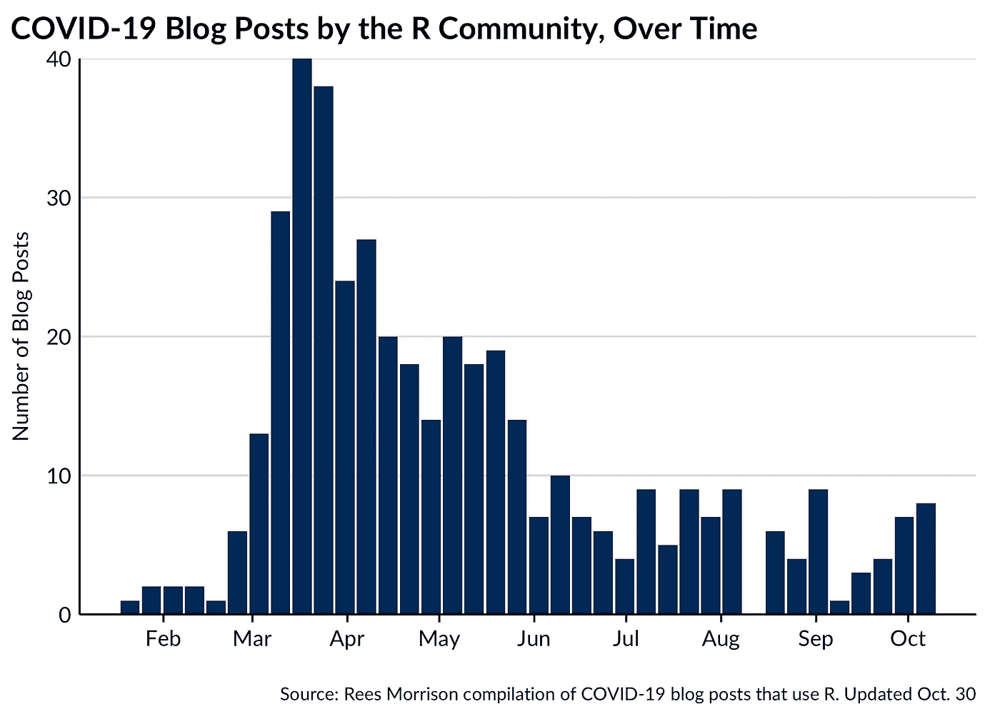
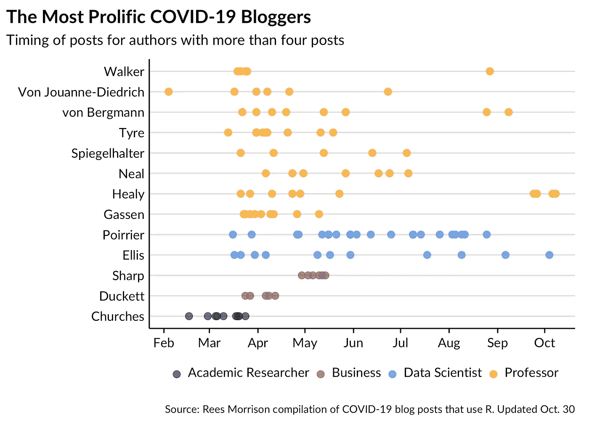
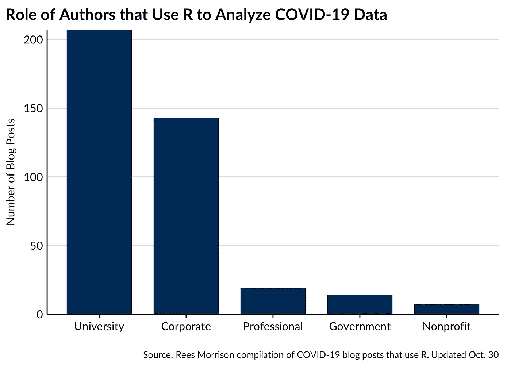
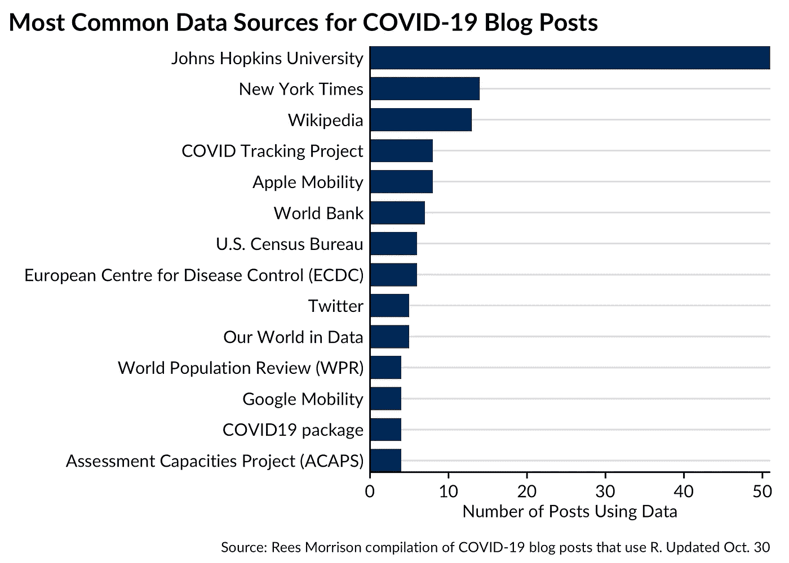
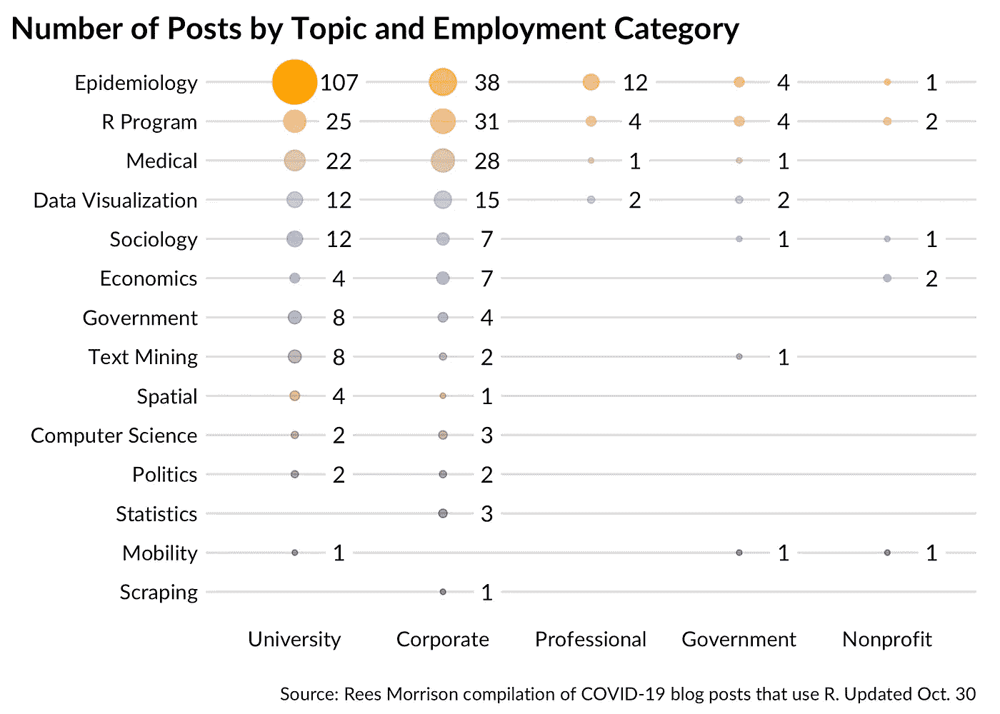

# 新冠肺炎帖子:包含 400 多个新冠肺炎博客帖子的公共数据集

> 原文：<https://towardsdatascience.com/covid-19-posts-a-public-dataset-containing-400-covid-19-blog-posts-ae5ad8181790?source=collection_archive---------31----------------------->

在过去的几个月里，我们从 R 社区收集了数百篇新冠肺炎的博文。今天，我们很高兴公开分享这个数据集，以帮助那些希望通过释放 R 及其社区资源来分析新冠肺炎数据的博主们能够研究这样的帖子。

到目前为止，我们已经发现并记录了 423 篇英文的 COVID 帖子。为了鼓励其他人探索这样的帖子，我们发布了一个[闪亮的网络应用](https://connorrothschild.shinyapps.io/covid-posts/)，它允许用户找到写这些帖子的 231 位博主的名字，他们的角色，以及他们关注的国家。该应用程序还允许用户通过主要话题、帖子标题、日期以及帖子是否使用了特定的数学技术或数据来源来交互式搜索帖子集合。为了更多地了解这个数据集的演变，其中一位作者(里斯)在 Medium 上发表了九篇文章，你可以在这里找到。

我们鼓励用户提交他们自己的帖子或者其他人的帖子来收录，这可以在这个[谷歌表单](https://docs.google.com/forms/d/e/1FAIpQLScfob3uBoumXIRcSW83T0GhXCfi-KI_psGxIqtl_rQ5VHu9ZQ/viewform?usp=sf_link)上完成。我们的数据集，以及闪亮应用的代码，可以在 [GitHub](https://github.com/connorrothschild/covid-posts) 上获得。如果任何人对数据集有任何更正，请写信给里斯莫里森(点)com。

这篇文章的剩余部分强调了新冠肺炎文章数据集中的一些发现。正如接下来的情节所显示的，这绝不是对新冠肺炎的每一篇博文的全面回顾，而是对我们已经发现的数据的概述。

# 一段时间内的帖子

随着疫情的进展，越来越少的博客作者关注 COVID 相关数据，因为我们注意到博客帖子在 2020 年 3 月达到峰值。

一些博客作者多产；更多的人已经合二为一。下面的图显示了 23 位博主的名字和帖子，他们到目前为止已经发表了至少四篇帖子。作为如何解读这一情节的例子，位于 y 轴底部的蒂姆·丘奇斯(Tim Churches)总共发表了 9 篇帖子，但没有一篇是在 4 月初之后发表的。

点的颜色对应于博客作者的工作角色，如底部图例中所述。显而易见，教授和学术研究人员在这个博客群体中占主导地位。如果你把研究生也算在内，那么几乎所有多产的博客作者都来自大学。

# 作者的角色

我们数据集中的博主们用各种方式描述他们的工作角色。其中一位作者(Rees)通过对大量的术语和描述进行分类，使这些工作角色标准化，但是这种努力很可能歪曲了这些博客作者的谋生之道。我们欢迎指正。

我们进一步将角色分为五大类:大学、T2、企业、T4、职业、政府和非营利组织。这些更广泛的类别在下面的图表中表示为列。

# 数据源

与新冠肺炎相关的大量数据来源将产生更丰富的见解。组合不同的数据集可以对一个问题有新的认识，产生改进，并允许作者构建更好的指数和测量方法。出于这个原因，其中一位作者(Rees)从我们收集的博客文章中提取了数据集信息。

在很大程度上，博客们确定了他们分析所使用的数据来源。有时，我们必须努力标准化 140 个数据源。

到目前为止，最流行的数据来源是约翰·霍普金斯大学，该大学早期、全面和一贯地为新冠肺炎数据收集和向公众传播设定了标准。

# 博客帖子主题

也可能是这样的情况，读者想要一个博客的摘要，或者只看属于某个主题的帖子。当然，给每篇博文指定一个主要话题会带来相当大的主观性，但我们希望这些宽泛的话题能帮助研究人员找到内容和有相似兴趣的同事。

在这里，一个气球图显示了 423 篇帖子的主要主题。主题在 y 轴上，博主的职业类别在 x 轴上。每个气泡的大小(和不透明度)代表匹配该组合的帖子数。正如所料，流行病学领先，但相当多的帖子似乎使用 COVID 数据来展示其他东西，或以新的方式应用 R。

# 总结想法

我们鼓励您使用我们的[闪亮应用程序](https://connorrothschild.shinyapps.io/covid-posts/)亲自探索数据。如果你想提交你的文章被收录，请填写这张[谷歌表格](https://docs.google.com/forms/d/e/1FAIpQLScfob3uBoumXIRcSW83T0GhXCfi-KI_psGxIqtl_rQ5VHu9ZQ/viewform?usp=sf_link)。

正如我们在应用程序的页脚所提到的，R 社区是聪明的，并且产生有趣的内容，但是当涉及到新冠肺炎时，并不是我们所有人都是专家。参与这些帖子会让你更好地理解 R 在我们当前时刻的应用，也许还能给帖子作者提供反馈。我们不认可任何特定作者的发现，并鼓励您从声誉良好的来源如 [CDC](https://www.cdc.gov/) 和[世卫组织](https://www.who.int/)找到准确、相关和最新的信息。

*原载于我的* [*博客*](https://www.connorrothschild.com/post/covid-posts/) *。跟随作者* [*里斯*](https://twitter.com/ReesMorrison) *和* [*康纳*](https://twitter.com/CL_Rothschild) *上推特。*