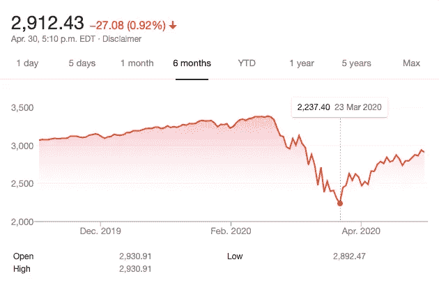
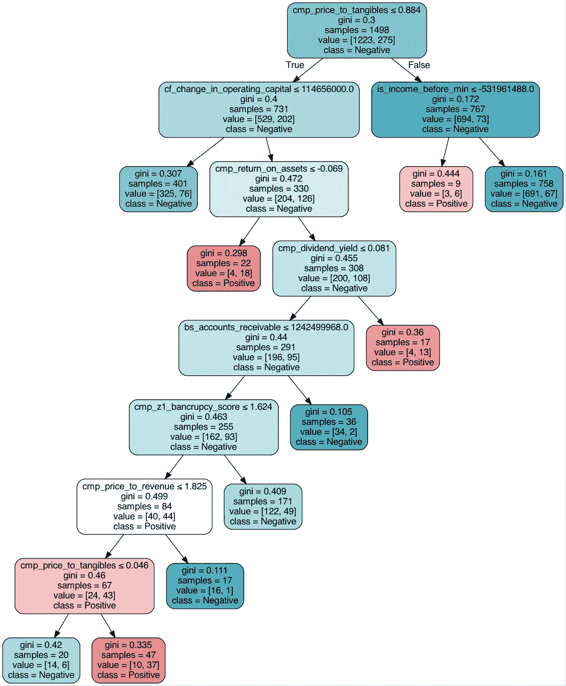
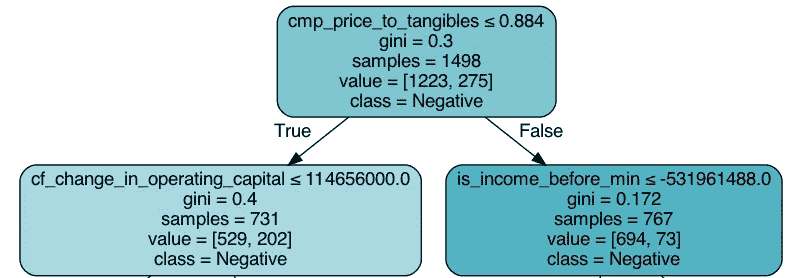
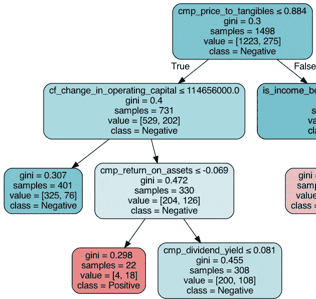
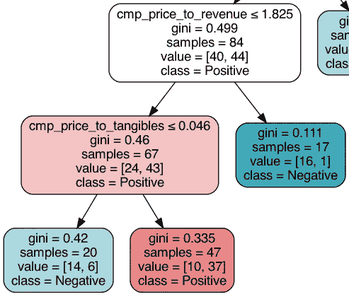

# 新冠肺炎在股票市场上横冲直撞。机器学习来解释。

> 原文：<https://towardsdatascience.com/covid-19-rampage-on-the-stock-market-machine-learning-comes-to-explain-3332707954af?source=collection_archive---------56----------------------->

## 亨尼投资

## 使用机器学习来识别新冠肺炎期间受打击最大的股票中的共同因素。

[图片](https://stock.adobe.com/ca/images/destruction-concept/69298723)作者[谢尔盖·尼文斯](https://stock.adobe.com/ca/contributor/201376482/sergey-nivens?load_type=author&prev_url=detail)

在这篇文章中，我使用机器学习来研究那些在新冠肺炎期间股价下跌最多的公司。为了更好地说明发生了什么，让我们来看看最近市场最动荡时期的标准普尔 500 指数。

[谷歌金融](https://www.google.ca/finance)

这场**新冠肺炎**崩盘结束了长达十年的牛市，股价在 2020 年 2 月 20 日至 3 月 23 日期间下跌了 **33%** 。虽然这次衰退对股票市场有整体的负面影响，但并不是所有的公司都受到同样的影响。下面是 **1500+** 美国上市公司在此期间的股票市场回报率分布。

[源代码](https://github.com/vhinny-investing/codebase/blob/master/apps/covid/eda/Plots.ipynb)

在 X 轴上，我显示了 2020 年 2 月 20 日至 2020 年 3 月 23 日之间的价格增长。在 Y 轴上，我显示了报告增长的公司的百分比。

我们可以看到大多数公司出现负增长。分布看起来**正态**，平均值在 **-33%** 左右，在正回报范围内有一些异常值。这与我在这里提到的正常市场条件非常不同:

*   [用机器学习预测股市。引言。](/predicting-the-stock-market-with-machine-learning-introduction-310cd6069ffa)

这种环境为投资者提供了一个研究不同公司形象如何受到影响的绝佳机会。特别是，哪些类型的公司相对于那些完全没有受到影响的公司受到的打击最大。随着**机器学习**为我们所用，我将**数据科学家**的观点带入游戏，分享我对这次**衰退**教会我们什么的观察。

# 财务数据

在这项研究中，我使用来自 www.vhinny.com[的 **Alpha 数据集**，它提供了**过去 **8 年的基本财务数据**，包括资产负债表、损益表和现金流量表。我还使用免费的 alpha vantage API 来访问每日股票价格。**](http://www.vhinny.com/)

# 问题陈述

在这项研究中，我希望找出那些受打击最大的公司背后的驱动因素。根据上面的直方图，我对股价至少损失了 **55%** 的公司感兴趣，这适用于数据中所有公司的 **~20%** 。

# 方法学

有许多方法可以解决这个问题，从**无监督聚类**到**预测建模**。我在这里使用的方法利用了预测建模的优势。我的目标不是训练一个预测未来衰退的模型。相反，我的目标是**了解过去**。带着这个目标，我发现简单的**决策树**分解是这项工作的最佳方法。

决策树因过度拟合训练数据而臭名昭著。由于这一特性，它们几乎从未用于预测建模，从而产生了**随机森林**和 **XGBoost** 。然而，与其他算法不同的是，**决策树**提供了对其决策过程的准确可见性，向研究人员准确显示了决策是如何做出的。

我把这个问题框定为一个分类任务，把价格损失至少 55%的公司列为正面例子。然后，我用以下参数拟合一个**决策树**(实现代码可以在[这里找到](https://github.com/vhinny-investing/codebase)):

*   最大深度:10
*   叶子上的最小样本:5
*   最大叶节点数:10

因为我的目标是**解释过去**而不是预测未来，所以我没有像在典型的预测机器学习问题中那样分成**训练和验证**。我用的参数并不是区分正反例的最佳参数。相反，我选择的参数将问题限制在可以容易解释的维度。这样，在稍微牺牲性能的情况下，我可以确定并可视化数据中的基本趋势，这正是我所寻找的。

# 实施情况和结果

下图显示了一个**决策树**,适用于识别在新冠肺炎危机期间股价损失至少 55%的公司。

[源代码](https://github.com/vhinny-investing/codebase/blob/master/apps/covid/eda/Plots.ipynb)

这个决策树适合于 1500 多家美国上市公司的基本财务数据。每个节点都有一个标签(类),根据叶子上的大多数例子将叶子分类为正或负。我使用**红-白-蓝**的配色方案来帮助视觉化每个节点上积极和消极的平衡。纯红色表示绝大多数例子都是正面的。纯蓝色表示大多数示例都是负面的。随着正反例子的比例达到相等，颜色变得更加淡化。如果正样本的数量等于负样本的数量，节点将变成白色(**完全透明**)。箭头表示基于节点本身记录的条件的分割。**左箭头**将符合条件的例子分开，不符合条件的例子留给**右箭头**。

# 全球趋势

[源代码](https://github.com/vhinny-investing/codebase/blob/master/apps/covid/eda/Plots.ipynb)

根节点包含整个数据集。它被标记为负的，因为大多数例子(1223)是负的(和 275 个正的例子)。这个节点上的分割是基于**价格对有形资产**比率完成的，这是价值投资者中的一个流行指标。如果有形资产的价格比**大**比 **0.88** 大，公司被标记为负面，将我们带到**右下方的**节点。这种情况对我们来说轻而易举，因为它使我们达到了 91%的公司被正确标记为负面的水平，在(694 + 73)中有 694 家。如果不满足这个条件，我们就转到左边的节点，这样我们就有许多潜在的目的地和可能性要考虑。

# 积极的暗示

[源代码](https://github.com/vhinny-investing/codebase/blob/master/apps/covid/eda/Plots.ipynb)

虽然树的全局右分支帮助我确定了绝大多数的负面例子，但我希望在左分支找到一条通向正面例子的道路。通往正面例子的最短路径让我有了三个条件:

*   有形资产价格比≤ 0.88
*   运营资本的变化> 1 . 15 亿美元
*   资产回报率≤ -0.07

用语言来说，公司必须相当便宜(条件 1)，以低于其有形资产成本的价格出售，并在最近一个财政年度报告亏损(条件 3)。第二个条件更难解释，因为它取决于企业的规模，但它表明公司的资产负债表有所改善。

# 更深入

[源代码](https://github.com/vhinny-investing/codebase/blob/master/apps/covid/eda/Plots.ipynb)

从根向下进入左分支 7 层后，我发现自己处于一个白色节点，该节点使用**价格**、**收入**和**有形资产**有效地将公司分为正面和负面。重要的是要注意，白色节点上的示例不是随机采样的示例，而是满足 6 个条件的示例导致白色节点。

在这个节点上，几乎所有**价格对收入** > 1.8 的公司(17 家中的 16 家)都是负数。这些是价格适中的公司，它们在上一年亏损了一些钱，但并不太贵，因为它们的交易价格低于其有形资产的价值(基于达到白色节点之前的拆分历史)。

或者，交易价格与收入之比(T10)≤1.8 和交易价格与有形资产之比(T12)≤0.04 的公司大多为正(47 家中有 37 家)。这是那种离破产只有一步之遥的公司。岌岌可危的是，他们业务的价格几乎是他们年收入的两倍，他们账面上所有有形资产的价值不到 1 美元的 5 美分。以任何标准衡量，这种不稳定的基础都可能会让投资者抛售股票，希望减少损失，并进一步压低股价，以反映这些公司的内在价值。

# 结论

在这篇文章中，我对 1500 多家美国上市公司的财务状况进行了分析，以确定由于 T4 新冠肺炎 T5 恐慌导致 T2 股价下跌 55%的公司的趋势。2020 年 2 月 20 日至 3 月 23 日期间，美国公司的股价平均下跌了 33 %。亏损 **55%+** 的公司有着臭名昭著的**糟糕的财务表现，**这部分反映在它们的价格甚至在崩盘开始前就一直低于其有形资产价值。这些公司中输家的一个特征指标是那些以有形资产的 4%或更低价格出售的公司。另一个不太严重的特征是，公司损失了 55%以上的价格，这是他们上一个财政年度报告的损失。在估值已经很低的情况下，上一财年的财务损失导致投资者卖出他们投资组合中的失败者 T21。

感谢阅读我的文章！如果你喜欢，你可能想看看这个:

 [## 从新冠肺炎恢复的股票。机器学习来解释。

### 使用机器学习来识别新冠肺炎崩盘后恢复正常的股票中的共同因素。

towardsdatascience.com](/stocks-that-recovered-from-covid-19-machine-learning-comes-to-explain-ba712f62456d) 

# 我们连线吧！

我很高兴和与我志同道合的人联系，这是我对财务独立的追求。如果你也在寻求经济独立，或者你想合作，交流想法，请随时联系我们！以下是一些可以找到我的地方:

*   [www.vhinny.com](http://www.vhinny.com/)—投资研究平台，为您自己的分析提供金融数据
*   [https://www.linkedin.com/company/vhinny](https://www.linkedin.com/company/vhinny)——加入我们 LinkedIn 上的社区，在那里我和其他贡献者分享投资相关的内容

干杯！