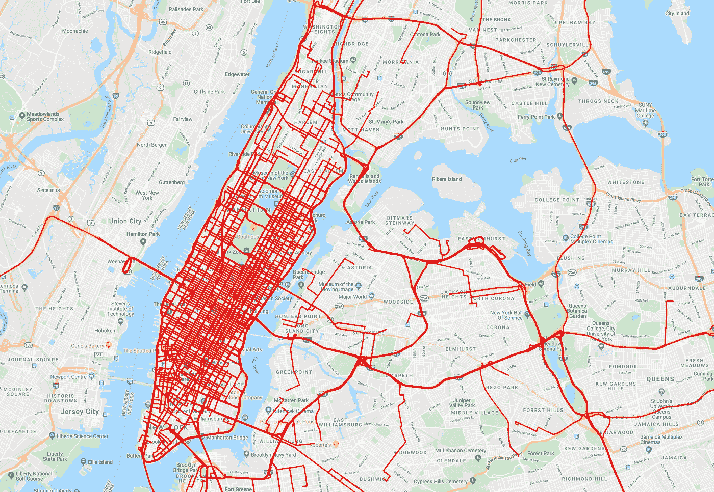
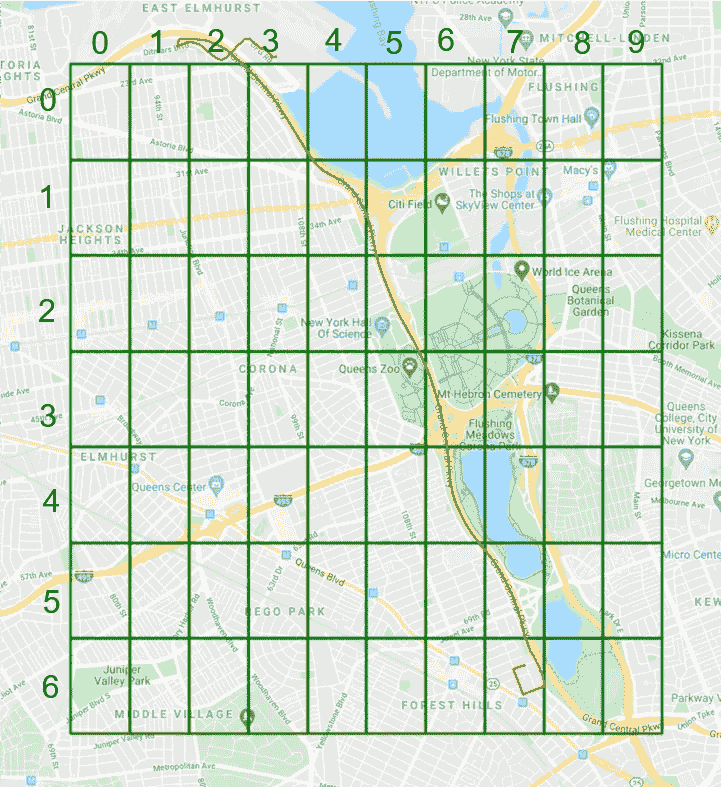
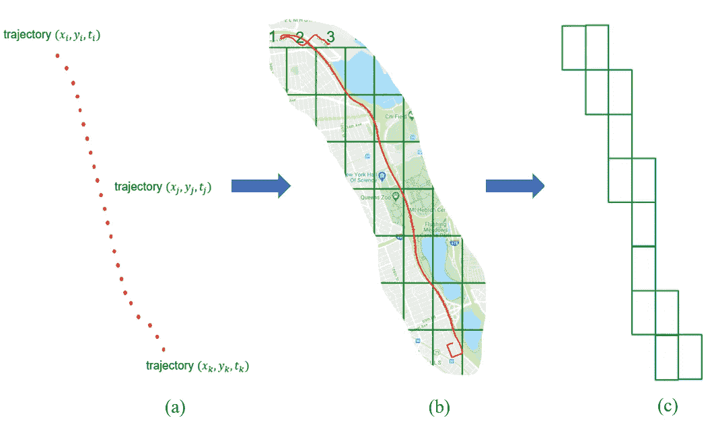
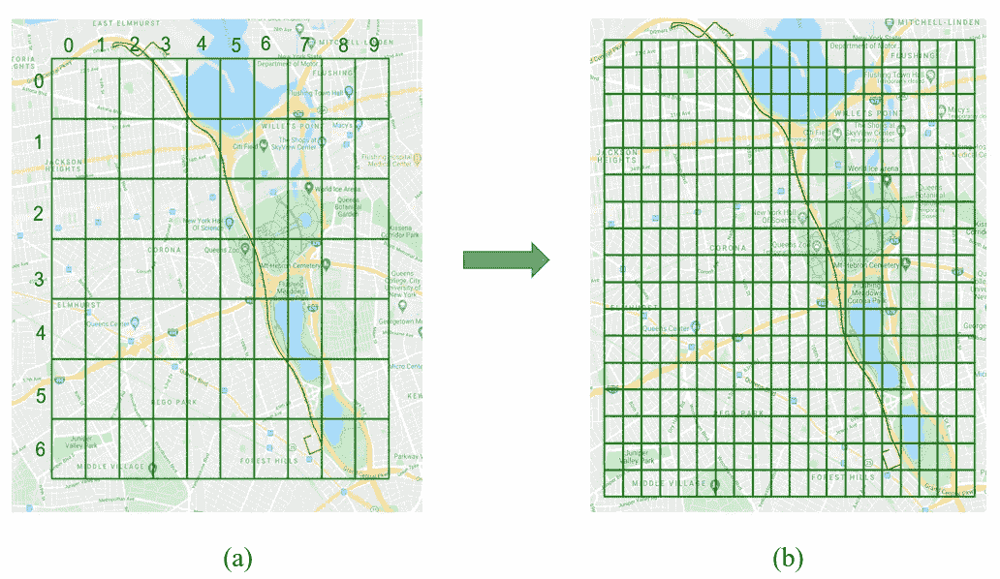
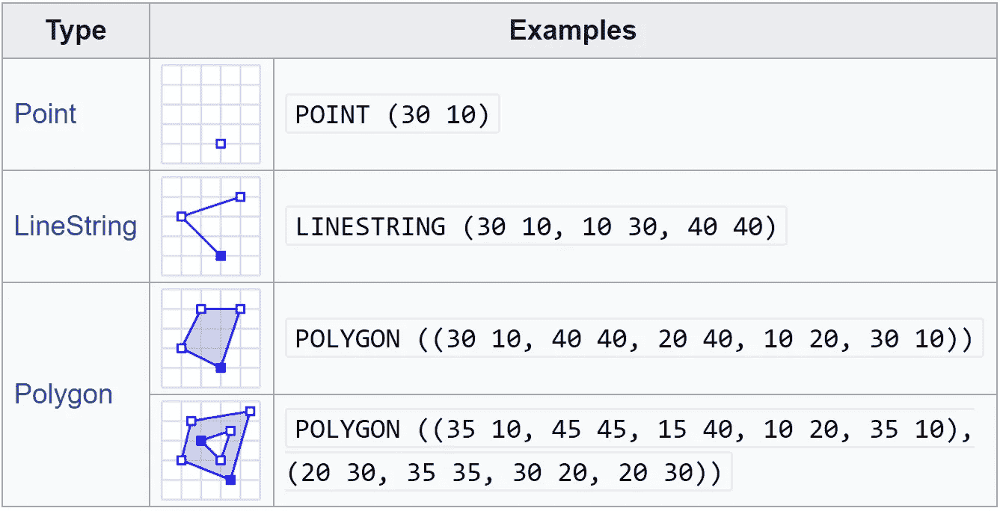
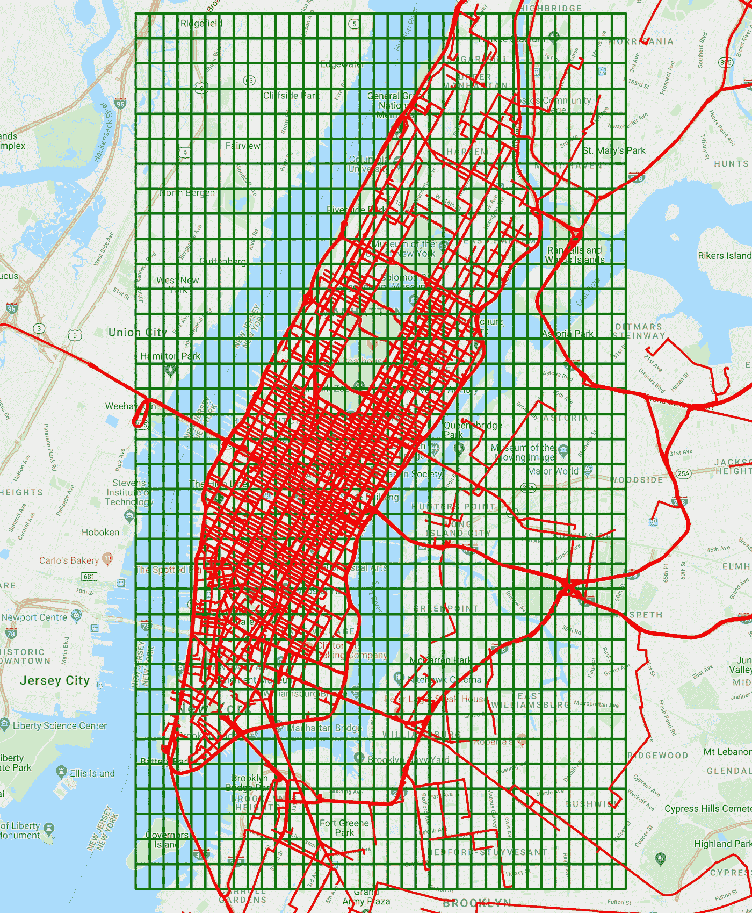
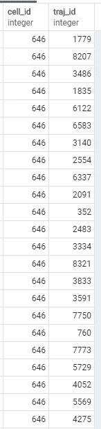

# 新冠肺炎:地理区域被感染的风险

> 原文：<https://towardsdatascience.com/covid-19-risk-of-geographical-areas-being-infected-a81938a5e286?source=collection_archive---------46----------------------->

## PostgreSQL-PostGIS 方法



图 1:曼哈顿出租车的轨迹

[*迈向数据科学*](http://towardsdatascience.com/) *是一份以研究数据科学和机器学习为主的媒体刊物。我们不是健康专家或流行病学家，本文的观点不应被解释为专业建议。想了解更多关于疫情冠状病毒的信息，可以点击* [*这里*](https://www.who.int/emergencies/diseases/novel-coronavirus-2019/situation-reports) *。*

自从电晕疫情爆发以来，我一直看到多伦多技术社区的人们提出了令人敬畏的分析，如 Russell Pollari 为了人民的利益贡献他们的理解和知识。这一直是激励我尝试为我的硕士论文和研究工作寻找一些用例的因素。

在本文中，我将解释我是如何想出利用地理区域内的轨迹来了解哪些地区受新冠肺炎影响的风险更高的想法的，例如，多伦多或纽约。在我深入实际框架本身的细节之前，让我们先了解一些基础知识。

## PostgreSQL 和 PostGIS

PostgreSQL (又名 Postgres)是一个开源的对象关系数据库管理系统(ORDBMS)，强调可扩展性和标准遵从性。它扩展了 SQL 语言，并结合了许多安全存储和扩展最复杂的数据工作负载的功能。
[PostGIS](https://postgis.net/) 是 Postgres 的空间数据库扩展器。它向 Postgres 添加了空间函数，如距离、面积、并集、交集和几何数据类型(这也是我在当前分析中使用它的原因)。

## 数据

我使用的数据集由纽约市出租车和豪华轿车委员会(TLC)发布，其中包括接送时间、地理坐标、乘客数量和其他几个特征。数据集 [*文件*](https://www.kaggle.com/c/nyc-taxi-trip-duration/data?select=train.zip) 包含 1，048，576 个旅行记录，这些记录包含作为(经度，纬度)坐标对的上下车点。为了这个实验的需要，我依靠随机样本 *S* 包括 10，000 双。对于每一对接送坐标，我利用 Google Directions API([*python 代码*](https://github.com/saimmehmood/covid_19_risk/blob/master/new_york_taxi.py) )在 NYC 创建轨迹(如图 1 所示)。

## 将地理区域划分成统一的网格

设轨迹 *t = {(x_0，y_0)，(x_1，y_1)，…，(x_n，y_n)}* 等于从起点到终点的路线，其中序列对 *(x_i，y_i)* 表示 2D 笛卡尔坐标系中的经纬度坐标。虽然移动物体的单个轨迹被定义在较低的粒度级别(例如，经度和纬度坐标对的序列)，但是地理区域的分析通常需要在较高的粒度级别完成，例如在城市的街区或邮政编码级别。不失一般性，我采用了一个*均匀网格*的抽象，它将观察空间 *A* 分成一组均匀间隔的 *r* 行和 *c* 列，形成*网格单元*；行数不需要等于列数。我正式定义 *grid_rc* 如下:

> grid_rc = {c_00，c_01，c_10，…，c_r-1c-1}



图 2:样本网格和网格单元上的样本轨迹

*grid_rc* 由 *r x c* 网格单元组成，而 *c_ij* 代表第 *i* 行和第*j*列的网格单元。通过将 *A* 划分为网格单元，我能够将轨迹 *t ϵ T* 从地理位置序列转换为 grid_rc 上的网格单元序列。例如，图 2 显示了一个 7x10 网格和一个穿过 13 个网格单元的样本轨迹，从 c_02 开始移动到 c_03、c_04、c_14、…，一直到 c_67。

现在你应该想到一个有趣的问题。**为什么我需要将地理区域划分成网格单元？**这可以从以下可视化中理解:



图 3:从作为地理位置的轨迹到作为网格单元的轨迹

因此，我们看到的是一个单一的(a)轨迹表示为地理位置(b)遍历网格单元和(c)最终转换为一组网格单元表示的运动路径的轨迹。对成千上万条轨迹进行的这种抽象使我们能够发现移动物体(即人、公共汽车和汽车)与分割的地理空间的相互作用。

请注意，网格的大小在更精确的分析和更快速的分析之间提供了一个有趣的平衡。这是因为网格的行数和列数越多，每个网格单元所代表的地理区域就越小，但代价是必须将每个轨迹关联到更大数量的网格单元，这在计算上是昂贵的(如图 4 所示)。



图 4 :( a)更少和(b)更精细分析之间的权衡

## 数据库中数据集的建模

为了将数据存储在 postgres 数据库中，需要将其转换为[众所周知的文本](https://en.wikipedia.org/wiki/Well-known_text_representation_of_geometry) (WKT)格式，这是一种用于在地图上表示矢量几何对象的文本标记语言。WKT 可以表示许多不同的几何对象，如点、线串&多边形等(如图 5 所示)。



图 5:几何图元(2D)[参考:[https://tinyurl.com/nz8ybfu4](https://tinyurl.com/nz8ybfu4)

我使用 *Linestring* 存储轨迹数据集，类似地使用 *Polygon* 存储网格单元坐标。使用这个[代码](https://github.com/saimmehmood/covid_19_risk/blob/master/uniform_grid.py)我将地理空间划分成 35×35 的网格(如图 6 所示)并以 WKT 格式存储网格单元坐标。



图 6:划分为 35x35 网格的地理区域

## 识别高感染区域

宣布地理区域(即网格单元)为高度感染的想法是基于这样的假设，即通过特定网格单元(划分的地理区域)的轨迹数量越多，该区域被感染的机会就越大。我通过绘制轨迹与网格单元的相互作用以及使用基于 PostGIS 的空间查询来识别这些区域。

**查询**

Q#1:存储网格单元坐标和轨迹数据集的查询

我使用 [pgAdmin](https://www.pgadmin.org/) 中可用的导入/导出命令将数据存储在 traj、网格和单元格表中。现在是进行神奇查询的时候了，该查询可以找到感染风险高的区域。

问题 2:神奇的查询

神奇的部分是我们得到的表格(traj_as_cells)。它类似于图 7 所示，但是针对数千条轨迹。
完成上述分析后，我们的工作是找到通过其的轨迹数量最多的细胞 id，即，具有被新冠肺炎感染的高风险的(划分的地理区域)。

为了帮助更好地理解它，我们可以编写一个简单的查询来查找有多少轨迹通过单个网格单元(在下面的查询中 *646* )。

问题 3:发现具有高感染风险的热点(网格细胞)

上面的网格细胞有 111 个轨迹穿过它(可能是感染的热点)。
(图 7)显示了从 postgres 数据库获取的快照。此外，我们可以通过将它的 id 与“单元格”表进行比较来定位这个网格单元格坐标(如 Q#4 所示)。



图 7

问题 4:定位网格单元坐标

最后，我们可以聚集轨迹穿过的所有网格单元，并基于穿过它们的轨迹的数量对它们进行排序。

寻找穿过每个网格单元的轨迹

上面的代码聚集了通过每个网格单元的所有轨迹，并将它们存储在`traj_ids.txt`文件中。最后，我们使用一个 bash 命令对网格单元进行排序。

```
perl -ne 'push [@a](http://twitter.com/a), $_; END{ print sort { length $a <=> length $b } [@a](http://twitter.com/a) }' traj_ids.txt
```

## 概述

*   我们开始探索一个地理空间，并着眼于人的运动路径，即轨迹。
*   我们将地理空间划分为统一的网格单元，并讨论了较小或较大网格大小之间的权衡。
*   此外，我们详细阐述了划分地理空间如何使我们能够将轨迹从一组地理位置坐标转换到一组网格单元中。
*   最后，我们执行了各种 Postgres/PostGIS 查询来查找轨迹穿过的格网单元。
*   最后，python (numpy *，pandas* )使我们能够将属于每个单元的轨迹放在一起，并通过 bash 命令对它们进行排序。

## 结论

从本质上说，这项工作提供了一个简单、易于遵循的概念验证方法，用于发现受新冠肺炎影响的高风险地区。