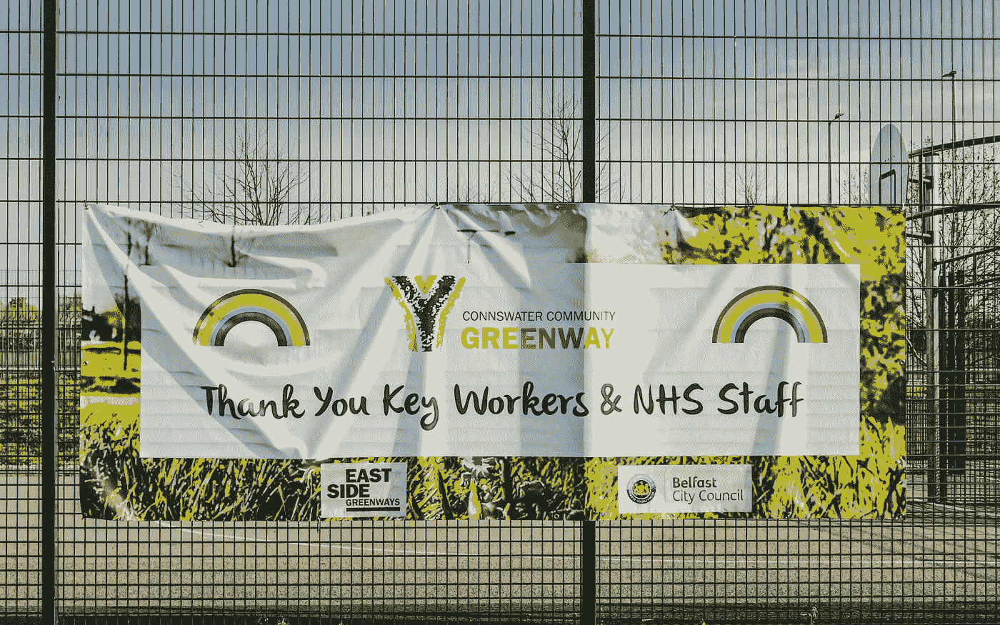
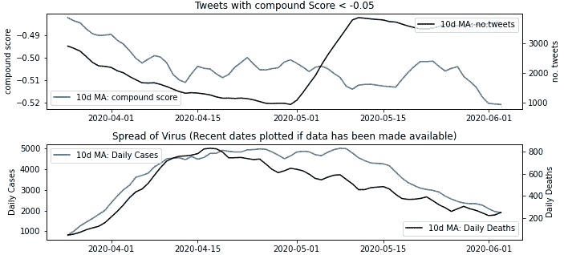
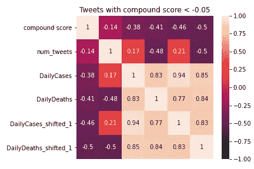
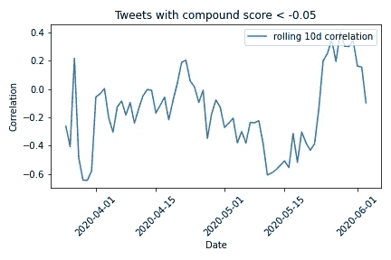

# 新冠肺炎情绪分析系列，第 1 部分:开始

> 原文：<https://towardsdatascience.com/covid-19-sentiment-analysis-series-part-1-getting-started-70892122630c?source=collection_archive---------45----------------------->

🇨🇭·克劳迪奥·施瓦茨| @purzlbaum 在 [Unsplash](https://unsplash.com?utm_source=medium&utm_medium=referral) 上拍摄的照片

## 推特情感分析

## 理解一级防范禁闭中的伦敦人

我发现封锁最令人震惊的是，与朋友聚会喝酒，或在某人的电脑前与同事交谈时，社区的丧失。

于是，我们失去了对每个人的感觉，失去了被倾听的感觉，失去了将社会团结在一起的共同声音。

我想通过 Twitter 了解伦敦人对事件的反应，以某种小的方式抵消这一点。我们对谁有好感？又是什么给我们带来了愤怒和挫败感？

由 [K .米奇·霍奇](https://unsplash.com/@kmitchhodge?utm_source=medium&utm_medium=referral)在 [Unsplash](https://unsplash.com?utm_source=medium&utm_medium=referral) 上拍摄的照片

这将是一个由 3 部分组成的系列，我们将会看到解决这个问题的几种方法…

**第一部分:入门:**如何获得你的推文，如何为推文评分，进行一些高层次的相关性分析。

**第二部分:假设检验:**如何在统计上高度确认组织情感上的信心差异，使用文字云来了解公众*对某人的真实看法*！

**第 3 部分:建模:**展示如何逐步应用频率主义和贝叶斯方法来建模锁定的赢家和输家，我还将清楚地概述每种方法在回答这个问题时为我们提供了什么。

# 第 1 部分:入门

## 获取推文:

我试图使用 Twitter API 来检索关于该病毒的推文，但是，搜索 API 将历史呼叫限制为 7 天，幸运的是，我找到了一个名为 GetOldTweets3 的 Python Twitter scraper，它帮助我解决了这个问题:

GetOldTweets3:当函数被调用时，日期和搜索字符串保持可配置

我发现在抓取 Twitter 时存在稳定性问题，导致当我达到 Twitter 配额时出现“HTTP 错误 429:太多请求”，或者当我与他们的服务器失去连接时出现“HTTP 错误 503:服务暂时不可用”。

这两个错误都会导致收集到的数据丢失，*所以 try/except is your friend* …在这些异常的情况下，我要求函数在重试之前等待 15 分钟，并确保我为用户打印了大量的进度更新…包括函数超时时的计时器…

> 第 1 次尝试(共 3 次)检索 2020–05–30
> 在 HTTP 请求期间发生错误:HTTP 错误 429:请求太多
> 
> 第 1 次尝试(共 3 次)检索 2020–05–30 时出错。睡了 15 分钟。
> 分钟睡眠:
> 0..一..2..3..四..5..6..七..8..9..10..11..12..

在撰写本文时，我在 3 个月的时间里收集了伦敦人以“冠状病毒或 covid 或新冠肺炎或 covid19”为搜索字符串的 55 万条推文，并将其作为每日 csv 文件保存在我的 GitHub 中。

**解析文本:**

我们想提取伦敦人在推特上谈论的人/事，这样我们就能找到情绪的主要驱动因素…

我尝试了一下 spaCy 的 NLP 管道:

首先使用词性标注器来检索专有名词(虽然它工作得很好，但我发现这不符合我的目标，因为它检索了许多非实体)。

然后使用实体识别器来检索预训练管道识别为“人”或“组织”的任何东西。

然后(出于兴趣)我用 EntityRuler 覆盖了带有我自己的自定义列表的实体识别(我看了两个:Boris Johnson 和 NHS)。

尽管 EntityRuler 是最精确的，但它非常繁琐，需要为每个实体手动设置规则，所以我选择了实体识别器:

spaCy 的 NLP 管道:将实体识别器应用于一列 tweets

## 得分情绪

我特别使用了 VADER (Valence Aware 字典和情感推理器)Python 库，因为它已经被调整来处理社交媒体上表达的情感。它结合了词典方法和基于规则的方法，在社交媒体上进行情感评分时提供了高水平的准确性。

他们的 GitHub 提供了 VADER 研究论文的更多细节，但总结起来:

**词汇法**:

*   情感评分从-4(非常负面)到+4(非常正面)不等，收集了 10 位独立评委的 9000 多字，他们自己也经历了审查过程。
*   平均评分为 0 或评分标准偏差> 2.5 的功能被丢弃，留给我们一个包含 7，500 个已验证功能的词典。

VADER 不仅研究了单个单词的情感等级，还研究了句法对句子层次情感的影响…

**基于规则的方法:**

*   例如，“好”与“非常好”是程度修饰语“非常”增加句子中情感强度的一个例子。
*   VADER 方面已经制定了一些规则，来检测此类结构性因素，并根据经验对整体情绪进行加权。

代码实现起来非常简单:初始化 SentimentIntensityAnalyzer()类，然后应用 polarity_scores()方法(这是我在 map 函数中做的)。这返回了一个数组，其中包含每条 tweet 的 4 个不同的情感指标:POS，COMPOUND，NEU，NEG。

3 个分数(POS/NEU/否定)量化了该推文中包含 POS/NEU/否定单词的比例(例如，POS =推文中的正面单词数/推文中的总单词数)。

然而，我决定在下面的分析中使用化合物(或化合价),因为它简洁地解释了两极的极性程度:正极和负极。相对于该文本的长度，它还被归一化为-1 到+1 之间的值(+1 表示最大正值，-1 表示最大负值)，从而可以用作比较度量。研究人员通常将得分> 0.05 分为积极，并且

## Correlation: Did sentiment vary with the spread of the virus?

I found a dataset on Kaggle that had collated Public Health England’s statistics on the cases and deaths from Coronavirus. I started to plot this in Matplotlib together with the average daily sentiment observed from the tweets:

Plotted: Negative Sentiment and Cases / Deaths

I learned a couple of things from seeing the data like this:

1.  **A.B.C .(总是在检查)**
    在这一时期的开始，我注意到我收集的推文数量急剧减少，很快发现我的查询已经过时……
    -不要搜索标签，而是搜索文本，因为大多数推文不经常使用标签。
    ——“COVID”取代了“冠状病毒”，成为频繁发微博者的便捷速记。
    因此，将搜索字符串更改为*“冠状病毒或 covid 或新冠肺炎或 covid 19”*可以立即看到改进(见 5 月)。尽管如此，谢天谢地我还是有足够大的样本量。
2.  **高水平的数据产生低水平的洞察力**
    在如此高的聚合水平上，情绪通常围绕全球平均水平波动。

## 随着病毒的发展，我们是否看到了更多负面的推文？

是的，我们可以大致看到这一点。

例如，情绪(即复合得分)与每日死亡数的负相关性为-41%。当你给死亡人数加上一天的滞后时，这个数字增加到-50%，表明人们对前一天的消息可能有一些延迟反应。

在相关性的一些早期不稳定性之后，我们能够看到一些有趣的东西:

关联历史:负面推文与每日死亡人数

这种相关性在 3 月和 4 月基本上是负的，即*“病例数/死亡数的增加(更为积极)与整体情绪的恶化(更为消极)相一致*。*“*这也是我们在观察情绪和病例/死亡趋势时看到的情况。

自那以后，这种相关性变成了积极的，即使每天的死亡人数变得很少，人们的情绪也保持相对不变，这表明伦敦人现在已经找到了他们愤怒的其他原因。

## 结论

收集完数据后，我们现在准备更深入地了解伦敦人。

在下一篇文章中，我将会使用假设检验*(并且会大量使用！)*验证对不同组织的态度是否真的存在差异。我将展示如何设置测试，并解释我们在每个测试中所依赖的假设(以及如何测试这些假设)。

我们还将看到如何以 wordcloud 的形式可视化人们的真实意见…例如，我们将国民保健服务视为*、【关心】、【支持】、【英雄】、【保护】、【乐于助人】* …但我们对政府的看法是一样的吗？#掌声鼓励者对此有什么影响？

《T4》第二部再见……