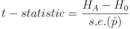

# 新冠肺炎情感分析系列，第 2 部分:假设检验

> 原文：<https://towardsdatascience.com/covid-19-sentiment-analysis-series-part-2-hypothesis-testing-3db511875165?source=collection_archive---------45----------------------->


[斯科特·格雷厄姆](https://unsplash.com/@sctgrhm?utm_source=medium&utm_medium=referral)在 [Unsplash](https://unsplash.com?utm_source=medium&utm_medium=referral) 上拍照

## Twitter 情感分析/假设检验

## 理解一级防范禁闭中的伦敦人

在这个系列中，我们将利用伦敦人的推文来了解情绪在新冠肺炎封锁中是如何演变的，以及在他们眼中哪些公众人物和企业是赢家和输家。

在[第 1 部分:“入门”](/covid-19-sentiment-analysis-series-part-1-getting-started-70892122630c)中，我们使用实体识别和情感评分获得了 Twitter 数据并对其进行了处理。

今天，在第 2 部分中，我们将查看数据，并通过假设检验来验证不同实体的情感得分存在 ***统计显著性*** 差异。但是首先…

# 奠定基础

支撑假设检验的是以下思维过程:

1.  **正态分布**:我们承认我们不可能捕捉到这段时间发送的所有推文，所以我们拥有的数据点是从更广泛的人群中获取的*样本*。如果这种抽样是随机的，除非样本大小为< ~30，否则根据[中心极限定理](/central-limit-theorem-explained-with-examples-4c10377ee58c) *，您可以预期您的测量观察(在这种情况下，我们正在测量情绪)是正态分布的。*例如，如果我们的样本均值为 5，则假设分布为:


正态分布，样本均值= 5

**2。设置测试**:为了测试这个样本均值是否不同于另一个样本均值(假设是 2，但它可以是任何数字)，我们将计算多少个*标准偏差*(或者，在抽样统计中，*标准误差*)会将两者分开，如果它们是同一分布的一部分。也就是说，我们假设它们不是来自不同的情绪分布，而是来自相同的分布:


**3。标准化标准**:想象这个操作，我们正在做的是沿着 x 轴将正态分布移动-2，然后除以标准误差。它成为以 2 为中心的标准正态分布，等式可以改写为:


我还概括了一些术语，以突出正在进行的假设检验

*   *z-score* 量化了*替代假设*距离新均值有多少标准误差(在这种情况下，这是*零假设*)。这很强大，因为标准正态分布上任何 z 得分的 p 值都是已知的[。因此，我们能够描述从与*空值相同的人口分布中观察到*替代*的可能性。*然后，我们将能够拒绝或接受我们的零假设，即通过比较这个 p 值和我们的显著性水平(我们将坚持 0.05 的显著性水平)，备选项被绘制为与零相同的分布。](https://en.wikipedia.org/wiki/Standard_normal_table#Table_examples)

3.**学生的 t 分布**。在下面的测试中，我们将把 z 分数称为一个 *t 统计量。*这是因为我们将假设一个学生的 t 分布，它比标准正态分布有更厚的尾部，从而引入一些保守性来应对[类型 I 错误](https://en.wikipedia.org/wiki/Type_I_and_type_II_errors)，这是因为我们的观察值数量有限:


*   这个分布的 p 值也是已知的。

让我们继续我们的测试…

# 假设 1:政府 vs 国民保健服务


照片由 [Grooveland 设计](https://unsplash.com/@groovelanddesigns?utm_source=medium&utm_medium=referral)在 [Unsplash](https://unsplash.com?utm_source=medium&utm_medium=referral) 上拍摄

我们首先来看两个将在数据中得到充分体现的实体:政府和国民保健服务系统。


直方图:情绪

国民保健服务的情绪似乎更积极，分布更偏向右侧，我们可以通过查看平均值来确认这一点:

```
Avg Gov sentiment -0.036
Avg NHS sentiment 0.171
```

你可能想知道为什么 NHS 的直方图在 0.5 左右有第二个峰值。我以为这些是重复的推文，然而，发现它们得分相同，因为它们都使用了短语“谢谢”，例如…

> 谢谢#掌声鼓励者#掌声鼓励者# NHS #关键员工#一级防范禁闭#迪士尼乐园巴黎#迪士尼世界#迪士尼#明天将是美好的一天# ColonelTomMoore #冠状病毒
> 
> 非常感谢 hollandandbarret & @ ray _ electronica 今天的复活节彩蛋捐赠@圣乔治医院# NHS # NHS workers # LondonNHS # front line NHS # medical team # stayat home #冠状病毒…
> 
> 谢谢 NHS biglove NHS # thankyounhs # clapping fornhs # covid 19 # we einittother # stayat home # bandanavixenv @ sur biton，伦敦

**假设**:

1.  **每个分布的标准差是相同的。**上面的箱线图通过比较四分位数范围帮助我们直观地证实了这一点:


紫罗兰图(左)和箱线图(右)

我们还使用 NumPy 证实了这一点:

```
StDev of Gov sentiment: 0.508
StDev of NHS sentiment: 0.527
```

确认这一假设的有效性使我们能够使用[混合方差](https://en.wikipedia.org/wiki/Pooled_variance)方法，因此 SciPy 的 2 样本 t 检验的实施可以归结为:

如果标准差不同，我们会使用[韦尔奇的 t 检验](https://en.wikipedia.org/wiki/Welch%27s_t-test)来计算两个样本的标准差。实际上，这意味着只需设置 equal_var =False。

**结果:**

```
Ttest_indResult(statistic=43.62708002444751, pvalue=0.0)
```

回忆样本意味着我们正在比较…

```
Avg Gov sentiment -0.036
Avg NHS sentiment 0.171
```

p 值~0 告诉我们，以-0.036 为中心的学生 t 分布极不可能包含 0.171 的观察值。换句话说，上面计算的测试统计表明，平均值 0.171 与平均值-0.036 相差 43 个标准误差

**判决:拒绝无效。我们可以很有信心地说，人们对国民保健制度的看法比对政府的看法更好。**

## 情绪何时开始出现分歧？

我们看到整个 3 个月期间的平均情绪有所不同，但这是从什么时候开始出现分歧的？

我们可以绘制平均情绪的每日差异，但是，我们需要调整样本大小和每天数据的标准偏差，以衡量我们对每日样本均值的信心。

相反，我们可以为平均情绪的每日差异计算 95%的置信区间，这将我们的信心纳入我们的采样过程:*我们创建一个上限和一个下限，我们有 95%的信心包含当天平均情绪的真实差异。*


每条垂直的黑线都是为那一天构建的置信区间。每天的置信区间标志着我们有 95%的信心认为政府和国民保健服务的情绪存在真正差异的区域(因为当然我们的数据本质上只是总体人口的样本)。

在观察期开始时，每天发的推文相对较少。这些小的每日样本量导致了较大的标准误差，因为:


因此置信区间更宽。随着时间的推移，每日样本量增加，使我们的置信区间变窄。

信心区间在很大程度上完全低于红色零虚线，表明在整个期间，对政府的平均情绪低于对国民保健服务的平均情绪的信心为 95%。有一些罕见的时刻，如 4 月底，当区间越过零线时…在那些日子里，我们不能说我们选择的信心水平是政府情绪低于国民保健服务。

# 假设 2:政府 vs NHS…积极还是消极的感觉？

我们看到平均情绪有所不同，但这是因为对国民保健服务更积极(复合> 0.05)，还是对政府更消极(复合< -0.05)?

Visually it appears both statements could be true, but we will test for this:


Distplot comparison using Seaborn

**积极推文:**

比率的差异是 0.159，即。NHS 的正面推文比例比政府高 0.159。

```
Difference in (Positive Tweets / Total Tweets): 0.15881778668707092
```

我们可以通过运行“两个*比例的差异*测试”来测试这种差异的统计显著性，这同样依赖于计算两个比例来自相同分布的假设的 t 统计量:



其中，比例差的标准误差为:


因此，我们可以轻松地手动计算 t-stat 和相关的 p 值:

```
t-statistic 47.33409611769171 p-value 0.0
```

**判决:拒绝无效。另一个假设(NHS 的积极推文比率)距离零(政府的比率)47 个标准误差，p 值为 0，我们说这两者极不可能来自同一人群。**

**负面推文:**

我们重复对负面推文的分析:

```
Difference in (Negative Tweets / Total Tweets): 0.14177193931000753
```

我们可以看到政府的负面推文比率比 NHS 的高 0.14，我们测试这一差异是否具有统计学意义:

```
t-statistic 38.561197004624 p-value 0.0
```

**判决:拒绝 Null。**与阳性率一样，差异有统计学意义。

或者，我们可以使用 Pandas crosstab 函数创建一个表，显示每个类别中的 tweets 数量。然后应用[卡方检验](https://en.wikipedia.org/wiki/Chi-squared_test)来验证任何一行是否包含 pos、neu 或 neg 推文数量的不平衡:


交叉数据分析表

这返回:
-卡方统计量
-p 值
-自由度
-平均分布的预期频率

```
(1047.7937788707934,
 2.981754146928481e-228,
 2,
 array([[6978.92922191, 3234.01294658, 9538.05783151],
        [6640.07077809, 3076.98705342, 9074.94216849]]))
```

我们可以从中看出，无论是正面还是负面，推文的分布与平均分布相比是不平衡的。

# 假设 3:政府 vs NHS…伦敦人的意见有分歧吗？

是不是有些用户在推特上对国民医疗服务体系持更积极的态度，而另一些用户则更消极地指出伦敦人之间的分歧？或者这种对 NHS 的赞同观点在个人用户层面上也是正确的，因此我们每个人都持有这种观点？

这也是一个需要设置的简单测试，称为[成对均值测试](https://en.wikipedia.org/wiki/Student%27s_t-test#Dependent_t-test_for_paired_samples)，我们从再次使用 Pandas crosstab 来创建平均情绪的用户级视图开始:


与其他参数检验一样，我们依赖于感兴趣变量分布的正态性假设(在本例中为*差异*栏)，我们可以看到这大致成立:


差异列的直方图和 QQ 图

我们使用相同的框架来计算 t 统计量:


除了现在替代假设是差异的平均值列，零假设是没有总体差异(即，零)，并且与假设 1(其是 2 样本均值测试)一样，标准误差是通过缩放标准偏差(这次是差异)来计算的:


或者简单地使用 SciPy:

```
Ttest_relResult(statistic=-9.035954747008454, pvalue=3.4616270088977246e-19)
```

**判决:拒绝无效。**即使在个人用户层面，我们也察觉到对政府和国民医疗服务体系的不同看法。看来我们在持有这些不同的观点上没有分歧。

*注意:我们不需要正态假设就能对此进行测试，成对均值测试的非参数模拟(* [*Wilcoxon 符号秩*](https://en.wikipedia.org/wiki/Wilcoxon_signed-rank_test) *测试)可用于查看中位数，而非均值:*

```
WilcoxonResult(statistic=934184.0, pvalue=1.2233021976129815e-18)
```

**判决:**同样的结果。

# 为什么对 NHS 的看法更积极？

虽然我们现在知道公众对 NHS 的情绪比政府更热情，但很难辨别当公众对一个和另一个进行思考时到底激起了什么情绪。我们可以使用单词云来可视化使用了哪些单词:


我们并不更清楚，因为图片模糊不清，因为最频繁出现的单词是中性的，对化合价没有贡献。我们需要从政府和国民保健服务语料库中筛选出最具情感性的词语:


我们现在对为什么国民保健服务比政府更受欢迎有了更清晰的认识:

**政府:**推特用户在强调感知失败时更多地提到政府，而不是 NHS:

*   *危机、失败、死亡、消亡、脆弱、停止、失败、严重、缺乏、紧急、困难、警告、失败*

NHS: 推特通常称 NHS 为英雄，因为他们在如此艰难的情况下给予了支持和照顾。

*   *感谢，关心，支持，嗯，帮助，安全，好，保护，爱，帮助，希望，朋友，英雄，自豪，伟大*

因此，有趣的是，尽管表面上朝着一个共同的目标努力，但公众似乎认为 NHS 比政府打得更好。

# 随着时间的推移，国民保健服务的情绪:

随着时间的推移，这种国民保健服务的情绪是如何演变的？公众是逐渐喜欢上了 NHS，还是开始产生了积极疲劳？


*(注意:你在 5 月份看到的 num_tweets 的增加是由于我在* [*第一部分*](/covid-19-sentiment-analysis-series-part-1-getting-started-70892122630c) *中提到的我的 Twitter 查询的改进，考虑到这一点，我们仍然可以提出以下几点)*

在 3 月底/4 月初，有 3 个明显的每周峰值，最明显的是在推文数量上，但在复合情绪得分上也很明显，这与#ClapforCarers 活动的开始相吻合。

虽然此时对 NHS 的情绪受到了积极的影响，但这些每周的高峰已经基本消退，也许伦敦人已经感觉到#职业疲劳？

# 摘要

我们已经展示了如何应用假设检验来对 Twitter 情感数据进行统计上稳健的推断。我们已经展示了不同类型的假设检验如何有助于揭示情绪差异的本质，概括如下:

1.  **假设 1:** 比较*样本均值*的双样本 t 检验，使我们能够得出 Gov 与 NHS 情绪平均存在差异的结论。*我们还绘制了置信区间来跟踪这一点是如何随着时间的推移而演变的。*
2.  **假设 2:** 双样本*比例差异 t 检验*证实了这种高水平的差异是由对国民保健服务的更多积极态度和对政府的更多消极态度共同驱动的。
3.  **假设 3:** 一个*成对均值* t 检验告诉我们，用户在这方面没有分裂，即。这种 Gov 与 NHS 情绪上的分歧也存在于个人用户层面。
4.  形象化:我们使用文字云来发现哪些情绪化的词语被用来描述政府和国民保健服务系统，以进一步了解公众的真实想法。我们甚至展示了#掌声鼓励者对国民保健服务热情的影响。

在这一系列的下一篇(也是最后一篇)博客中，我们将撒开网去寻找更多锁定期的赢家和输家。我们将一步一步地深入机器学习领域，开发有趣的方法来解决这个问题…

*   我们将从重复 word cloud/假设检验技巧开始，寻找新的赢家和输家。
*   然后，我们将看看如何通过使用逻辑回归模型来简化这一过程，以给出一个整体视图。
*   最后，我将解释*如何*以及，重要的是，*为什么*贝叶斯方法可以帮助我们跟踪一个城市不断变化的情绪。

《T4》第三部再见……