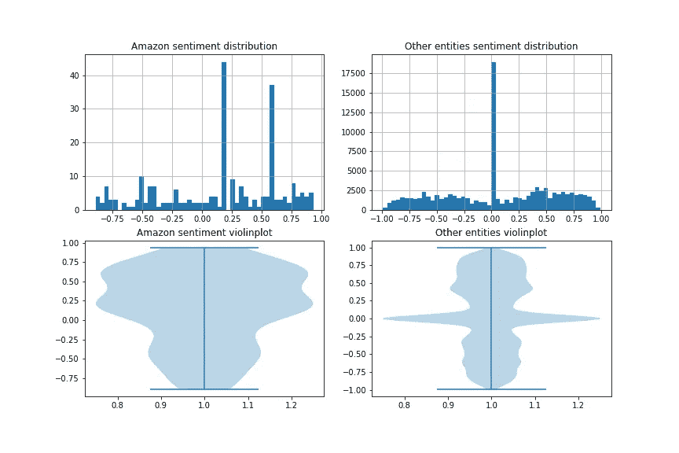
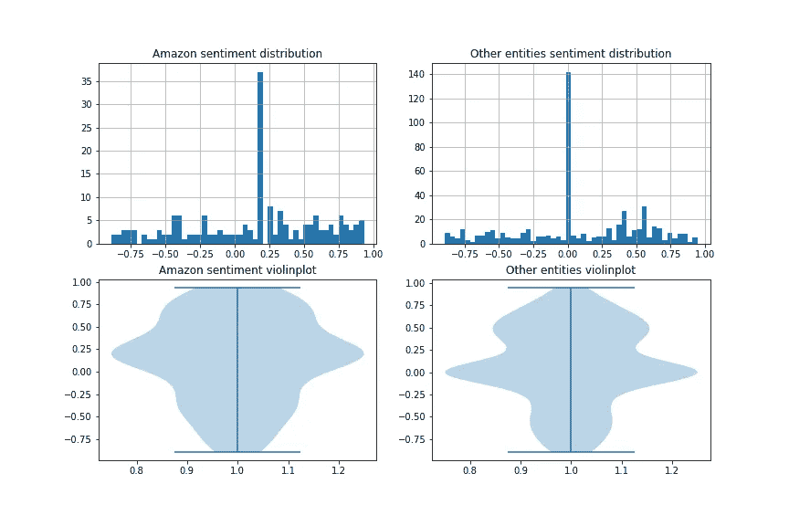
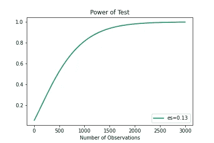
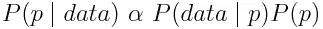
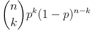
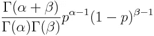
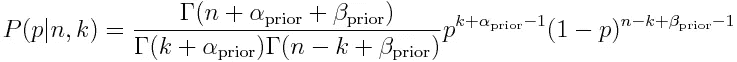
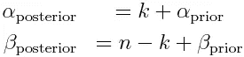

# 新冠肺炎情感分析系列，第 3 部分:贝叶斯情感分析

> 原文：<https://towardsdatascience.com/covid-19-sentiment-analysis-series-part-3-winners-and-losers-c00f384080a8?source=collection_archive---------45----------------------->


彼得罗·兰帕索在 [Unsplash](https://unsplash.com?utm_source=medium&utm_medium=referral) 上的照片

## 推特情感分析/贝叶斯推理

## 理解一级防范禁闭中的伦敦人

***编者按:*** [*走向数据科学*](http://towardsdatascience.com/) *是一份以数据科学和机器学习研究为主的中型刊物。我们不是健康专家或流行病学家，本文的观点不应被解释为专业建议。想了解更多关于疫情冠状病毒的信息，可以点击* [*这里*](https://www.who.int/emergencies/diseases/novel-coronavirus-2019/situation-reports) *。*

在这个系列中，我们一直在使用伦敦人的推特来了解情绪在新冠肺炎封锁中是如何演变的，以及在他们眼中哪些公众人物和企业是赢家和输家。

在[第 1 部分:“入门”](/covid-19-sentiment-analysis-series-part-1-getting-started-70892122630c)中，我们获得了 Twitter 数据，并使用实体识别和情感评分对其进行了处理。

在[第二部分:“假设检验”](/covid-19-sentiment-analysis-series-part-2-hypothesis-testing-3db511875165)中，我们使用了各种不同类型的假设检验，解释了为什么对国民保健服务的看法比对政府的看法积极得多。

今天，在第三部分(也是最后一部分),我们将扩大搜索范围，寻找更多锁定的赢家和输家:

*   简单的方法:我们将从简单而繁琐的方法开始:我们重复第 2 部分的技巧，使用文字云和假设检验来突出显示，然后推断谁是赢家和输家。
*   **Frequentist 建模:**然后，我们将看看如何通过使用逻辑回归模型来简化这一过程，以给出一个整体视图。
*   **贝叶斯更新:**最后，我将解释*如何*以及重要的是*为什么*贝叶斯方法可以帮助我们跟踪一个城市不断变化的情绪，我们将可视化结果:

使用贝叶斯推理对凯尔·斯塔默的情感建模

# 简单的方法

回到我们在[第二部分“假设检验”](/covid-19-sentiment-analysis-series-part-2-hypothesis-testing-3db511875165)中离开的地方，让我们从可视化我们的 tweets 数据集中最常提到的组织开始。我们还缩小了搜索范围，只搜索那些被评为正面或负面的推文，因为我们对找出赢家和输家感兴趣:


我们可以清楚地看到，亚马逊和财政部是最常被提及的组织。然而，很难看到这两个以外的东西，因为词云充斥着大写单词，被 spaCy 错误地标记为实体。

尽管如此，我们仍然可以看看亚马逊，然后说:

> *由于伦敦人在封锁期间转向网上购物，亚马逊将成为大赢家*。

进行单样本测试来表明亚马逊的情绪得分是积极的是不够的，我们需要表明亚马逊的得分比合理的基线更积极。为此，我们将进行两个*双样本均值* t 检验:

**假设 1:** 亚马逊情绪在封锁前的基础上有所改善。

**假设 2:** 在所有实体中，处于锁定状态的亚马逊情绪高于基线平均值。

# 假设 1:亚马逊对亚马逊

我们可以非常容易地创建两个发行版: *amazon_prelockdown* 和 *amazon_postlockdown* ，并运行 SciPy 的 t-test:

```
Ttest_indResult(statistic=0.10878616367025529, pvalue=0.9134795533240211)
```

这向我们表明，总体平均值的任何差异在统计上并不显著。为什么？

```
Number of pre_lockdown Amazon tweets = 3
Number of post_lockdown Amazon tweets = 201
```

因为我们的数据只有 3 条提到亚马逊的预锁定推文，导致标准错误太高，无法拒绝 null。

# 假设 2:亚马逊与其他公司

类似地创建相关的分布，并运行相同的 t-test:

```
Ttest_indResult(statistic=2.469890113757005, pvalue=0.01351783280956628)
```

我们有一个低 p 值，这将导致我们拒绝零，但是让我们检查分布和样本大小，以检查正态假设是否成立，因为我们已经执行了参数统计测试:



亚马逊与其他公司:分销

```
Amazon sample size 243
Other entities sample size 94912
```

我们在这里可以看到两个问题:

1.  亚马逊分布看起来很奇怪，因为它有两个峰值，分别位于 x 轴的 0.2 和 0.6 处。运行一些快速 EDA，我们可以看到 0.6 的峰值需要纠正，因为它包含许多来自病毒式宣传活动的非独立推文:


**教训:**确保从现在开始删除所有重复的文本。

2.“其他实体”的样本量太大，无法代表我希望它能代表的基线。仅适用于其他组织。看来 SpaCy 错误地将大写单词标记为实体导致了这种分布被污染。因此允许这更接近地代表更广泛的样本集。我手动创建了最常提及的组织的良好子集，它们可以构成“其他实体”:

*世卫组织、脸书、FDA、联合国、Whatsapp、乐购、英超、谷歌、FDA、苹果、疾控中心、议会、白宫*



亚马逊与其他公司:发行版(已清理)

```
Amazon sample size 183
Other entities sample size 520
```

重新运行我们的 t 测试:

```
Ttest_indResult(statistic=1.1270992972809608, pvalue=0.26018755847340846)
```

我们现在不能拒绝零，因为:

*   删除重复的内容会删除 35 条推文，亚马逊的平均分也会从 0.15 降到 0.11
*   虽然“其他实体”的标准偏差变化不大，但由于限制了最常提及的组织，样本量大幅下降，标准误差从 0.0019 降至 0.02，因此降低了测试的统计功效。

本质上，如果我们想要确定亚马逊的正均值和其他公司的中性均值之间的差异在统计上是显著的，我们需要收集更多的样本来增加我们的测试拒绝零均值的能力。我们可以使用功耗分析来衡量这一点…

## 功率分析

为了以 95%的置信度得出两个样本均值确实不同的结论，我们需要多少条推文？

换句话说:要将第二类错误率降低到某个阈值以下，需要多大的样本量。我们将选择 20%的阈值，这相当于 80%的能力(正确拒绝空值的能力)。

我们可以进行一个[功率分析](https://machinelearningmastery.com/statistical-power-and-power-analysis-in-python/)(细节我们不在此赘述)，但是代码非常简单，并且利用了 Statsmodel 的 TTestIndPower 函数:



效果大小= 0.13 的功效分析

这表明我们的测试需要几乎 1000 条 tweets 的非常大的样本量来正确拒绝 80%的空值。

因此，即使一个商业实体(亚马逊)与所有其他关于商业实体的最多推文进行了相对大量的测试，仍然没有给我们足够的统计能力来区分他们的手段。

然而，我们从单样本测试中得知，我们相信对亚马逊的看法是积极的:

```
Ttest_1sampResult(statistic=4.298040028883434, pvalue=2.616546144158821e-05)
```

所以 2 个样本的测试没有足够的统计能力，而单独观察每个实体就可以了。

然后，我们如何在所有实体中呈现这种单样本视图，以查看哪些实体确实是赢家/输家，而不必单独对每个实体重新进行 t 检验？

# 频繁主义建模

为了做到这一点，我们可以把这个问题重新组织成一个监督学习问题。我们可以应用 Statsmodel 的逻辑回归分类器预测两个标签类别*阳性*或*阴性、*中的一个，其特征是由 SpaCy 识别的组织。

我使用 scikit-learn 的[tfidf 矢量器](https://scikit-learn.org/stable/modules/generated/sklearn.feature_extraction.text.TfidfVectorizer.html)将实体编码到一个 features 数组中，使用其 TF-IDF 方法获得权重。我还使用这个函数来删除停用词和其他不需要的词，并将其限制在前 70 个特性中。返回的结果是:

逻辑回归结果

整个模型，特别是当只限于 70 个顶级特征时，无法预测一条推文是正面还是负面的(看 R)。然而，我们可以在个体特征层面学到很多东西:我们可以看到哪些是净正的(因为 coef > 0)，哪些是净负的(coef < 0).

The model results also show us the certainty of our sample statistic (the coefficient) using: the standard-error for that distribution (influenced by sample size), the z-score and the p-value which both show whether this sample statistic was statistically significant, and then the 95% confidence interval for the sample statistic.

## Winners:

*   **科技公司。**正系数和接近 0 的 p 值让我们毫不怀疑，亚马逊、苹果、Whatsapp、Instagram 等公司在推特上获得了正面评价。
*   英国政府的口号 **stayhomesavelives** ，也有一个非常积极的系数。沿着这些思路，自我隔离是另一个积极的故事，和社会距离。公众积极支持这些努力。

## 失败者:

*   多米尼克·卡明斯。极化图有一个非常负的系数。在围绕他决定打破社会距离规则的争议期间，这种情况显著恶化。
*   令人惊讶的是，Keir Starmer 的系数为负，这可能是由于对政府做法的批评吗？不，从数据来看，这实际上是因为人们批评他没有让政府承担足够大的责任。
*   由于推特指出了 NHS 医院的短缺，PPE 也被负面描述。

## 其他注意事项:

*   描述政府人物和部门的词通常具有较高的 p 值和跨越 0 阈值的宽置信区间，表明公众对其表现的看法不一。

## 结论:

我们已经使用频率统计创建了一个自上而下的方法来寻找好的和坏的情绪的组织驱动因素，但是这依赖于我们已经收集的 3 个月的数据。

在观察期开始时，情况发展很快，我们看到对一个实体的情绪波动很大，加上样本量较小，导致不确定性更大。这就是贝叶斯模型可以帮忙的地方…

# 贝叶斯的常客

在频率主义者的世界观中，我们有一个更广泛的人群，通过抽样，我们试图了解他们。因此，有一个真正的总体参数，通过抽样，我们可以通过我们的样本统计估计。

*   用这种方法，我们仍然试图得出一个单一的估计数。
*   通过这种方法，我们也允许我们的观点只被我们的观察期所了解，而不是被任何先验知识所了解。

在贝叶斯的世界观中，我们不认为有更广泛的人口。我们只有样品。然而，我们不得不承认，因为我们的样本量是有限的，所以我们的样本统计存在不确定性，所以我们应该将其建模为*分布，而不是一个单一的数字。*

*   *通过这种方法，我们采用了一个预先的假设，并使用贝叶斯定理用新的观察来更新这个假设，从而得出当前的世界观。*

**

*贝叶斯定理*

*其中:*

*   **P(p)* =先验假设*
*   **P(data|p)* =新的观察值(如在 Frequentist 方法中)，也称为似然函数*
*   **P(p|data)* =最新的(或:“后验”)假设，在我们用最新的观察结果更新了先验之后。*

*鉴于大多数数据收集的“实时”性质，特别是在新冠肺炎这样的独特事件之后，看看贝叶斯方法如何帮助我们回答这个问题是有意义的。*

# *贝叶斯建模*

*让我们首先概述一下这种方法:*

1.  *我们有两种选择来模拟贝叶斯定理的元素(如上):*

*   ***共轭**(如果可能的话，更简单和优选):如果先验是似然函数之前的共轭，则后验将是与先验相同类型的分布。这有利于使贝叶斯定理代数可解，后验(未知)参数用先验和似然(已知)参数表示。*
*   ***抽样技术(**例如马尔可夫链蒙特卡罗):有有限数量的共轭先验，如果我们的数据不符合其中任何一个，那么我们就需要使用抽样技术。*

*2.幸运的是，由于我们只对二元结果感兴趣(我们的推文要么是正面的，要么是负面的，因为我们将省略中性推文)，我们可以使用最简单的共轭对来实现共轭:***β二项式对****

*   ***似然函数:**对一组推文进行采样，并将其标记为成功(正面)或失败(负面)是一种二项式分布:*

**

*二项分布*

*   ***先验:**贝塔分布描述了两个二元结果的概率范围:*

**

*贝塔分布*

*   ***后验概率:** …我们可以添加 *n 次*试验和 *k 次*成功来得出后验概率:*

**

*后验贝塔分布*

*这是一个漫长而复杂的等式，但从中可以得出一些重要的直觉:*

*   *二项式分布可以被认为仅仅是连续贝塔分布的离散形式。我们在上面证明的贝叶斯更新模拟了实际发生的情况:当新数据进来时，这通过二项式似然函数被表示为离散的数据点，其用于更新平滑的先验分布。*
*   *α和β现在可以非常简单地用先验和似然性来表示:*

**

## *应用*

*我们可以使用逻辑回归的输出来给出我们可以查看的最热门的实体列表。*

*为特定实体构建贝叶斯建模管道的过程可分为两个阶段:*

1.  *先验:*

*   *统计在封锁前这段时间有多少正面和负面的推文:*

*   *使用此数据计算先验β分布的α和β:*

*2.后路:*

*   *使用公式记录新数据出现时α和β参数的变化:*

**

*我还在 Matplotlib 中创建了一个动画，可以向我们展示这种演变:*

*让我们来看看几个感兴趣的实体的情绪演变:*

***亚马逊***

*在此期间有 183 条推文提到亚马逊，橙色分布显示了封锁前情绪的概率分布，即。在那之前的两周。这是我们对亚马逊情感概率分布的先验信念。*

*这种情况下的分布非常平坦和浅，反映了这样一个事实，即只有相对较少的推文告知我们之前的信念:只有 2 条正面推文和 1 条负面推文。*

*一旦我们进入一级防范禁闭状态，我们就会用从一级防范禁闭期间收集的推文更新先验信息。这使我们能够对后半部分(蓝色)进行建模。请注意，随着时间的推移，随着我们收集更多的推文来通知我们的后验分布，分布如何变窄并达到峰值(由滑块表示)。*

*   *亚马逊的先验处于中性区域:0.5。但在封锁后几乎立即跳进了积极的领域，并停留在那里。*
*   *最终最大后验概率估计，即其中 0.6 的后峰显示亚马逊的情绪更可能是积极的(由 x 轴上的 1.0 分表示)，而不是消极的(x 轴上的 0 分)，这是基于我们发现的数据平衡来更新我们之前的信念。*

***凯尔·斯塔默***

*在封锁之前，我没有关于凯尔·斯塔默的推文来告知任何关于他的预先信念。在这里，您可以将α和β都设置为 0.5，因此采用 Jeffreys 的先验模型来模拟未知分布。先验呈 U 形。*

*在封锁期间，我们收集了 66 条推文，在整个期间，斯塔默的地图一直处于负值，徘徊在 0.2 左右。*

***Dominic Cummings***

*我们为多米尼克·卡明斯(Dominic Cummings)收集了 1003 条推文，在封锁前，他在我的数据集中除了积极的推文什么也没有。*

*在进入锁定期大约 20 天后，后验分布已经向左移动，地图结束时略低于 0.5。*

*这种从积极情绪到消极情绪的转变，从看实际日期，与围绕他打破社交距离规则的争议相吻合。*

# *结论/最终想法*

*在这个博客系列中:我们展示了从 Twitter 建立一个 feed，应用一些文本处理，进行情感评分，并以一种明确赢家和输家的方式分析每个实体的情感是可能的。*

## ***假设检验:***

*我广泛地用这个来理解我的发现带来了一些统计上的清晰，这教会了我一些需要谨慎对待的领域:*

*   ***p 值**:如果样本量足够大，可以确保足够低的标准误差，则可以很容易地使其具有统计显著性。问问自己你的测试是否具体到可以提出一个尖锐的问题？问问你自己你的过滤设置是否正确，确保你的样品没有膨胀。*
*   ***正态假设**:由于中心极限定理，这通常在大多数情况下成立，但我们总是可以使用我们假设检验的非参数版本，如 Mann-Whitney 或 Wilcoxon 符号秩检验。*
*   ***均值回归/中和**:对于任何足够大或不够具体的数据片段，情绪通常会聚集在 0 附近，没有意义。查看您的子样本的分布，如果它在 0 情绪有一个高峰，那么您可能需要更具体的过滤，以进行有意义的假设检验。*

## *整体赢家/输家:*

*为了获得一个整体的观点，我使用逻辑回归来模拟正面和负面标签的推文，使用矢量化实体列作为预测矩阵。*

*这给出了一些有趣的结果:*

*   *总体 R 很低，这表明我需要比我包括的几个特征更多的特征，才能准确地模拟一条推文是正面还是负面。*
*   *然而，这不是我想要的…我感兴趣的是我包括的那些特征如何对积极或消极做出贡献，这可以从它们的系数中得到。与 scikit-learn 的软件包相比，使用 statsmodel 的软件包的好处是能够看到每个系数的统计置信度。*
*   *因为我们实际上对情感有一个不断进化的观点，所以我们转向了贝叶斯方法…*

## *贝叶斯赢家/输家:*

*在这里，我设置了一个动画滑块来显示先验分布，然后随着新数据的到来，后验分布如何演变，这可以根据选择的实体进行配置。*

*   *这清楚地表明了卡明斯和 T2 的情绪是如何以及何时开始恶化的，并给出了一些很好的解释。如果我们在现场运行，我们的模型会给我们提供这种恶化的早期线索，我们就可以一条一条地跟踪推特了。*
*   *通过将概率分布附加到每个阶段的情绪，它也清楚地显示了我们的后验信念的确定性。*
*   *使用β-二项式模型极大地简化了参数，观察这种共轭性的一个好方法是二项式分布只是β分布的离散版本，因此简单地反映了单个新数据点到连续先验的增加。这在数学上被解决为通过添加二项式参数来更新β参数。*

*对于那些已经做到这一步的人，感谢您的阅读，当然欢迎并感谢所有的反馈，您可以在这里找到回购:*

*[](https://github.com/noahberhe/COVID-19) [## 诺亚贝尔赫/新冠肺炎

### NLP 应用于最近的冠状病毒/ COVID19 推文:最近几周情绪进展如何？刮刮伦敦总部…

github.com](https://github.com/noahberhe/COVID-19)*