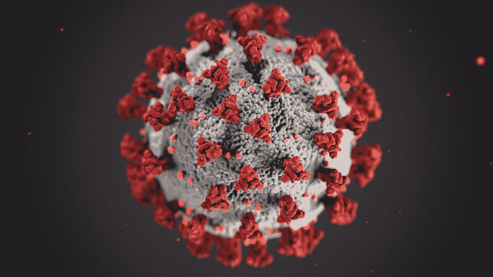
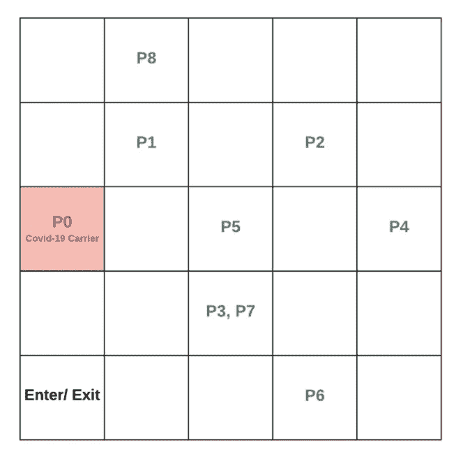
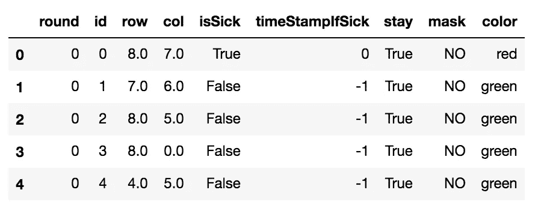
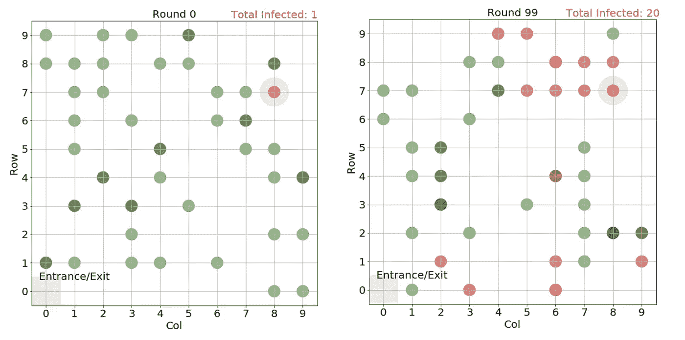
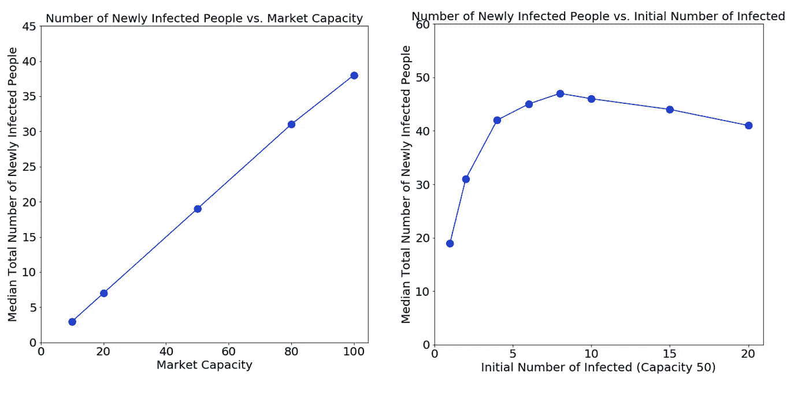
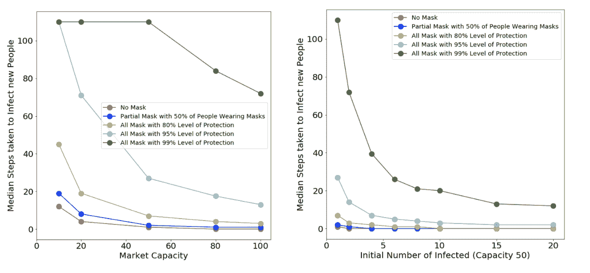

# 新冠肺炎模拟器

> 原文：<https://towardsdatascience.com/covid-19-simulator-da5be0067193?source=collection_archive---------51----------------------->

## 口罩如何有效减缓新冠肺炎的传播

***编者按:*** [*走向数据科学*](http://towardsdatascience.com/) *是一份以数据科学和机器学习研究为主的中型刊物。我们不是健康专家或流行病学家，本文的观点不应被解释为专业建议。想了解更多关于疫情冠状病毒的信息，可以点击* [*这里*](https://www.who.int/emergencies/diseases/novel-coronavirus-2019/situation-reports) *。*

> 我们设计了一个新冠肺炎模拟器，在戴口罩和不戴口罩的不同场景下可视化病毒的传播。据透露，在 [Unsplash](https://unsplash.com/s/photos/coronaviruses?utm_source=unsplash&utm_medium=referral&utm_content=creditCopyText) 时，R0(每个感染者通常导致的二次感染数)可能会下降到< 1 (each infected person will infect less than 1 person in average), which strongly indicates that the virus spread could be significantly reduced.

Ultrastructural morphology exhibited by coronaviruses. Photo by [CDC](https://unsplash.com/@cdc?utm_source=unsplash&utm_medium=referral&utm_content=creditCopyText)

自从 12 月 31 日在中国武汉报道首例病例以来，一种易感染的动物源性病毒 ovid-19 迅速席卷全球。在过去的 6 个月里，美国有超过 200 万人被感染，导致经济下滑和全国性的社会焦虑。根据美国劳工部的失业数据，从二月到四月，失业率从 4%飙升到 14 %, 1500 万人失业。

> 我们如何降低在公共活动中被感染的风险？尤其是我们已经看到了各州重新开放后的第二波疫情

CDC(疾病控制和预防中心)建议采取非常常规的预防措施:洗手、戴口罩和保持社交距离。这是我们从小就学到的老知识，但是这些程序能在多大程度上减少我们被感染的机会呢？在这里，我们开发了一个新冠肺炎模拟器来模拟病毒在室内环境中的传播，并比较了不同场景下新感染人数和新感染所需的最短时间: **1)不戴口罩，2)部分戴口罩，3)全部戴口罩。**

# 模拟器设计

## 方案

人们在室内市场购物。市场只有一个入口/出口。市场中的人数(市场中的人数)是恒定的:一旦人们到达进入/退出，他们将退出，不会回来。与此同时，同样数量的新人将进入市场。假设随机有一个人感染了新冠肺炎病毒，他/她在购物时间只咳嗽/打喷嚏一次。我们想知道有多少新的人(R0)被这种最初的新冠肺炎携带者感染，以及第一个新的感染多快出现，以便评估口罩的有效性。

## **假设/近似**

**图。简化市场空间设计**

1.  **市场被设计成一个矩阵**
2.  **矩阵大小**

*   每个细胞的大小是一个 6 英尺* 6 英尺的正方形(CDC 建议的社会距离)。整个市场有 10 * 10 个单元(总共 3600 平方英尺)。因此，市场可以模拟为一个 10 * 10 的矩阵(每个<row col="">对代表一个单元)。</row>
*   如果人们在受感染的细胞内，不戴口罩的人将 100%被感染，而戴口罩的人被感染的几率会大大降低。

**3。市场中的人数(市场容量)**

*   [沃尔玛和山姆会员店](https://corporate.walmart.com/newsroom/2020/04/03/changes-to-our-shopping-process-to-encourage-social-distancing)现在任何时候每 1000 平方英尺只允许五名顾客进入，这大约是商店容量的 20%。因此，模型中的容量范围将从 10 到 100。

**4。从一个单元到另一个单元的行进速度**

*   这是相当主观的，但是我们可以假设平均购物行程需要 40 分钟才能走完 0.5 英里，所以从一个单元走到另一个单元需要 0.1 分钟(6 英尺的距离)。换句话说，每一步/每一个动作需要 0.1 分钟。下一步有 8 个自由度:上，下，左，右，左上，直立，左下，垂直和停留。

**5。新冠肺炎病毒变得无传染性所需的时间**

*   典型房间和建筑物的换气率为[6–10](https://cleanair.camfil.us/2017/02/22/retail-store-air-quality-can-make-sick/)(一个空间内的空气在 60 分钟的时间段内被过滤或被新空气替换的速率)。因此，我们可以假设 10 分钟后，新冠肺炎病毒没有传染性。如果我们用步数来计算时间，需要 100 步新冠肺炎才会变得无传染性

## **编程语言**

模拟器设计使用 Java。Python 用于数据分析和可视化。

## **模拟器设计**

我们设计了*三大类*(空间、位置、人)和*一个随机数发生器*来实现模拟器的基本功能:初始化模型，跟踪每一步人的健康状况。简而言之，

1.  **类空间**

*Space(int size，int numOfPeople，int initialSick，int maskPercent，int maskSickPercent，int unMaskSickPercent) {…}*

类别空间由 1)矩阵的大小，2)矩阵中的人数(市场容量)，3)矩阵中的初始感染人数，4)戴口罩的人的百分比，5)如果戴口罩被感染的概率，以及 6)如果不戴口罩被感染的概率来初始化。

空间有几大功能，包括**()*和***getHealthyPeople****()*跟踪感染和健康人的名单，以及***next move****()*更新每个人下一个位置的状态，如果有人到达出口，调用 ***离开****

***2。类别位置***

**Position(int row，int col) {…}**

*用行号和列号初始化类位置。每个职位都维护该职位的人员列表。它还具有 ***【添加人员】*** *(人员)****离开*** *()* 功能，用于从当前位置添加/删除人员。Helper 类定义了两个与位置相关的 helper 函数:***getRandomPosition****(int size)*生成随机位置，以及***get next Position****(Position[][]matrix，int row，int col)* 从当前位置基于随机方向得到下一个可能的位置。*

***3。上课的人***

**Person(int id，boolean isSick，Mask mask) {…}**

*Person 类用 id (int，用于标识个人)、isSick (true 或 false)和 Mask status (enum YES 或 NO)初始化。它还有一个字段来记录一个人何时(在哪一步)生病(如果这个人是健康的，则为-1)。*

*4.**枚举概率***

**枚举概率{是，否；…}**

*根据输入的概率，指定 1)戴口罩的人的概率，以及 2)当人们进入受影响的位置时被感染的概率。*

# ***数据分析和可视化***

## *模拟输出*

*为了使输出更少偏差，对于每个数据点，我们重复模拟 1000 次，并使用中位数。我们通过调整空间模型的输入参数来评估不同场景中新感染的总人数和新感染所需的最少步骤:1)人数( *numOfPeople* )、2)最初感染的人数( *initialSick* )、3)戴口罩的人的百分比( *maskPercent* )、4)如果戴口罩被感染的概率( *maskSickPercent* )和 5)如果不戴口罩被感染的概率(*

> **Space(int size，int numOfPeople，int initialSick，int maskPercent，int maskSickPercent，int unMaskSickPercent) {…}**

**输出文件是 csv 文件，“round”表示步数，“id”是人员 ID，“row”和“col”表示在矩阵中的位置，“timeStampIfSick”是此人被感染时的轮数(-1 表示此人未被感染)，“stay”表示此人是否在市场中，“mask”表示此人是否戴口罩，颜色表示此人是否被感染(红色表示感染，绿色表示健康)。**

****

****图。模拟结果示例****

## **新冠肺炎在市场上传播的可视化**

**如前所述，我们可以看到市场中人们的健康状况(感染和健康)。简而言之，我们将市场空间建模为一个 10 * 10 的矩阵，每个交叉点代表一个 6 英尺* 6 英尺的区域。入口/出口位于(0，0)，健康人用绿圈表示，感染者用红圈表示。受影响的区域被标记为一个更大的红色圆圈。在单个模拟中(市场容量为 50，初始感染人数为 1，屏蔽百分比为 0%，无屏蔽疾病为 100%)，我们观察到在第 0 轮(第一轮指数为 0)，只有 1 人被感染；而在 100 轮之后，20 人被感染，这表明 R0 是 19。换句话说，**如果一个 3600 平方英尺的市场里有 50 个人，如果没有人戴口罩，仅仅 1 个人就会感染 19 个人**。**

****

****图。从 1 名感染者开始的第 1 轮(左)和第 100 轮(右)市场人员的健康状况(市场容量为 50 人)****

> **数字 19 本身看起来并不可怕，但如果疾病的 R0 是 19，那将是灾难性的**

**我们以 R0 等于 2 为例，表示疾病会感染两个人。假设 2 天后，被感染的人变得具有传染性。因此，每 2 天，患者人数就会增加一倍。如果这种疾病得不到控制，66 天后，在最坏的情况下，它将感染超过 80 亿人，这比目前世界上的人口要多得多！考虑到这一点，在我们的例子(19)中 R0 是一个可怕的数字，我们想知道口罩是否能有效地降低 R0，以及减缓新冠肺炎的传播。**

****

****图。R0 = 2 的指数增长模型****

## **市场容量和初始感染人数对新冠肺炎传播的影响**

**原来新感染人数和市场容量之间是线性关系:增长速度相同。相比之下，随着初始感染人数的增加，新感染人数呈对数增长:从 1 名初始感染人数开始，病毒在市场容量为 50 人时会感染 19 人，如果初始感染人数分别增加到 2 人和 3 人，新感染人数会增加到 32 人和 43 人，在初始感染人数达到 4 人后会趋于平稳。**

****

****图。受市场容量影响的新感染人数(左)和初始感染人数(右)****

**就新冠肺炎的传播而言，市场容量和初始感染人数的增加都加速了病毒的传播(表现为对新感染采取的步骤减少)。如果在不同的市场容量下，初始感染人数被设置为 1，则新感染的最小步数将从容量为 10 时的 12 步指数下降到容量为 100 时的 0 步。如果市场容量设置为 50，初始感染人数不同，则新感染不会晚于第 1 步。**

****

****图。感染新人所需的最少步骤。如果在 100 步之后，没有新的感染，则感染新的人所采取的步骤被设置为 110。****

> **无论是新增感染者还是新冠肺炎的传播速度，都会随着市场容量(市场更拥挤)和初始感染者(市场初始感染者更多)的增加而增加。但是哪个因素影响更大呢？**

**似乎减少市场上的初始感染者比减少市场容量更能有效地减缓新冠肺炎的传播。但不幸的是，与限制市场中的人数相比，在感染者进入市场之前识别他们要困难得多，尤其是在他们没有表现出任何症状的情况下。根据斯克里普斯研究转化研究所的研究， [40%-45%的感染者是无症状的](https://www.ncbi.nlm.nih.gov/pmc/articles/PMC7281624/)。换句话说，即使一个人感染了新冠肺炎病毒，也有近 50%的可能性这个人没有表现出任何症状，比如发烧、咳嗽或气短，但这个人能够将病毒传播给他人。**

## **面具对新冠肺炎教传播的影响**

> **鉴于进入市场的初始感染人数难以控制的情况，口罩会显著减少新冠肺炎的传播吗？还是勉强？**

**下图显示了不同情况下新感染总人数的增长与市场容量和初始感染人数的关系:1)不戴口罩，2)部分戴口罩，50%的人戴口罩，3)所有人都戴防护等级为 80%的口罩，4)所有人都戴防护等级为 95%的口罩，以及 5)所有人都戴防护等级为 99%的口罩。说 99%的防护水平，意思是如果一个人戴着口罩去了受感染的区域，这个人有 1%的概率会被感染。**

**在这里，我们可以清楚地看到，随着越来越多的人戴上口罩和防护等级更高的口罩，新增感染者总数趋于“扁平化”(病毒传播减少)。在市场上只有 1 名初始感染者的情况下，如果所有人都佩戴 95%防护水平的口罩，即使容量从 10 到 100 增加 10 倍，新感染人数也只会增加到 4 人。当保护水平提高到 99%时，在市场容量为 100 时，只有 1 人会被感染(最拥挤的情况)。当最初有多名感染者时，也观察到类似的情况:当 50 人中有 20 人最初被感染时，如果所有人都戴口罩，只有 4 人被新感染，而如果没有人戴口罩，则有 41 人被新感染。**

****

****图。不同场景下受市场容量(左)和初始感染人数(右)影响的感染人数对比。****

**此外，口罩也将大大减缓新冠肺炎的传播，即使市场上有多个最初感染者。据观察，如果没有人戴口罩，随着市场容量和初始感染人数的增加，病毒几乎立即传播。相比之下，当人们戴上口罩和防护水平更高的口罩时，病毒形成新感染所需的时间越来越长。如果市场容量和初始感染人数控制得好，病毒甚至在其生命周期中找不到下一个宿主。这强烈表明，口罩将有助于减少甚至阻止新冠肺炎的大规模传播。**

****

****图。不同情景下受市场容量(左)和初始感染人数(右)影响的感染新人所需的最少步骤的比较。如果在 100 步之后，没有新的感染，则感染新的人所采取的步骤被设置为 110。****

# ****结论****

**该项目旨在定量评估口罩在不同情况下如何有效减少新冠肺炎的传播:1)不戴口罩，2)部分戴口罩，3)全部戴口罩。新冠肺炎模拟器旨在模拟真实市场，数据是根据我们的假设生成的。据透露，如果所有人都戴口罩，即使在市场非常拥挤、有多个初始感染者和/或难以保持社交距离的情况下，新感染人数也可能减少到 0。虽然感染率可能被夸大了，特别是考虑到即使没有人戴口罩，人们进入受影响区域时也不应该 100%被感染。然而，这里要传达的信息是**在公共场合戴口罩不仅是保护自己的责任，也是保护他人的责任。****

**感谢您阅读这篇文章。这项工作是由刘泳和维多利亚苏怡平等贡献。有关新冠肺炎模拟器设计和数据分析的更多信息，请访问 my [Github](https://github.com/liudj2008/CovidSimulator) 。**