# 德国新冠肺炎社会距离模拟

> 原文：<https://towardsdatascience.com/covid-19-social-distancing-simulation-f091a58732f9?source=collection_archive---------15----------------------->

## 我们什么时候能恢复正常生活(德国情景)？


图片来自 [Pixabay](https://pixabay.com/?utm_source=link-attribution&amp;utm_medium=referral&amp;utm_campaign=image&amp;utm_content=1104066) 的 [kalhh](https://pixabay.com/users/kalhh-86169/?utm_source=link-attribution&amp;utm_medium=referral&amp;utm_campaign=image&amp;utm_content=1104066)

**TL；博士**

我使用 RKI 的基准模拟了 5 个场景(如果没有实施社交距离，到 2020 年 6 月中旬达到 1000 万活跃案例)。如果您只想查看结果，请滚动至**第 5 部分**。

[所有代码都发布在我的 GitHub 这里](https://github.com/o0oBluePhoenixo0o/COVID_19-Social-Dist-Simulation)

**目录**

[0。免责声明](#6f09)
1。[简介](#04cd)
2。[概述](#8cad)3
。[数据输入](#2323)
— [3.1 MIDAS 研究网](#f843)
— [3.2 JHU 和 RKI 知识库](#b6af)
— [3.3 社会人口统计数据](#b6af)
[4 .车型](#324d)
—[4.1 SIR](#c204)
—[4.2 SEIR](#a347)
—[4.3 SEIR+DH](#1ada)
[5 .模拟](#c4a0)
——[5.1 无社交距离](#242a)
——[5.2 10%社交距离](#686f)
——[5.3 25%社交距离](#4170)
——[5.4 50%社交距离](#9dbd)
——[5.5 90%社交距离](#d891)
[6。致谢](#8113)

**更新 4 月 3 日**从 2020 年 3 月 23 日(总理默克尔宣布国家紧急状态的那一天)开始的每个场景的预计死亡病例

# 0 免责声明

我不是流行病学家，所以我不能 100%保证上述情景会成为现实。我相信这种形象化将有助于解释“社会距离”的影响，通过这一点，我想强调的是，在这个疫情，每个人都扮演着重要的角色。

请记住，这是一个简单的 SEIR+DH 模型，在撰写本文时，用于训练该模型的可用数据有限。

[**您可以在我的 GitHub**](https://github.com/o0oBluePhoenixo0o/COVID_19-Social-Dist-Simulation) 上查看 Jupyter 笔记本中的代码

此外，我希望这将激励人们探索更多的数字和模型，而不仅仅局限于主流媒体和潜在的不那么可靠的新闻。

# 1 导言

这个分析的目的是对我们何时回到在德国**的正常生活做出最好的“猜测”。**


电晕表情符号([来源](https://www.rnd.de/digital/corona-emojis-klopapier-und-social-distancing-YOS4KXTP2BC3VDMPS4GLBV62W4.html))

[罗伯特·科赫研究所(RKI)对**德国**的“无社交距离场景”的估计](https://www.iamexpat.de/expat-info/german-expat-news/rki-coronavirus-could-infect-10-million-people-germany)在此用作本次模拟的基准。报告称，如果不采取干预措施，3 个月后(截至 2020 年 3 月 19 日)，感染病例数将上升至**~ 1000 万**。

鉴于社会现在处于完全或完全“封锁”状态(取决于你住在哪里)，我想在这次尝试中使用社会人口统计和疾病数据以及简单的流行病学模型来模拟 5 种不同的社交距离场景。

这 5 种情况如下:

1.  没有社交距离
2.  10%的社交距离
3.  25%的社交距离
4.  50%的社交距离
5.  90%的社交距离

# 2 概述

整个项目可以很快总结在这张图表中:

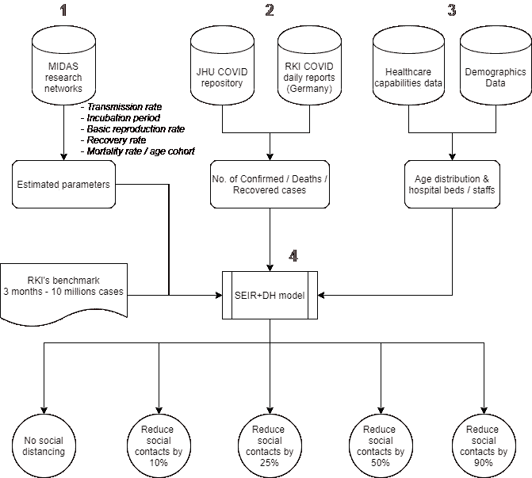

项目一览

# 3 数据输入

## [3.1 MIDAS 研究网络:](https://github.com/midas-network/COVID-19)

我直接使用来自 MIDAS 新冠肺炎研究网络的估计参数进行分析:

*   **潜伏期** —从暴露到症状和体征首次出现之间所经过的时间
*   **痊愈率** —“从症状出现到痊愈的时间”，从新加坡和中国的研究期刊上获得(使用对数正态参数生存方法&在 *t* 时间累计痊愈/死亡人数与感染人数的比率)。
*   **基础繁殖率(R0)** —从一个传染者身上传染疾病的平均人数。它特别适用于以前没有感染和没有接种疫苗的人群。如果一种疾病的 R0 为 18，那么只要没有人接种过疫苗或者在他们的社区中已经对其免疫，那么患有这种疾病的人平均会将这种疾病传播给其他 18 个人。

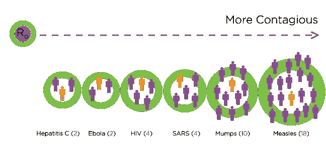

*R0 值越大表示传染病越多(来源:* [*健康热线*](https://www.healthline.com/health/r-nought-reproduction-number) *)*

*   **报告率** —置信区间高达 95%的最新研究表明，新冠肺炎病例的实际报告率为 75%(截至 2020 年 3 月 29 日)

为了计算每天的死亡案例，我使用以下参数:

*   **临界死亡率** —如果患者不能住院，病死率约为 12%。这是来自武汉的 max 报道:[估计 2019 年新型冠状病毒疾病的死亡风险，中国，2020 年 1 月至 2 月](https://wwwnc.cdc.gov/eid/article/26/6/20-0233_article)
*   **从住院到死亡的时间** —该参数用于计算过去住院的人增加的死亡病例(时滞因子)。

截至 2020 年 3 月 29 日，收集的参数值如下:

```
Incubation period: 6.55
R0 - basic reproduction rate: 3.26
Time from hospitalization to death: 10
Recovery time: 21.02
Reporting rate: 0.75
Critical death rate - without hospitalization: 0.122
Probability of an infected case but asymptomatic: 0.179
```

# 3.2 JHU(约翰·霍普金斯大学)和 RKI(罗伯特·科赫研究所)存储库

*   ***确诊人数/痊愈人数/死亡人数*** 世界数据来源于约翰霍普金斯大学的知识库([https://github . com/CSSEGISandData/新冠肺炎/)-](https://github.com/CSSEGISandData/COVID-19/)-) 此数据只包含国家层面的数字。

```
*# Get total timeseries from JHU*
global_confirmed = pd.read_csv('https://github.com/CSSEGISandData/COVID-19/raw/master/csse_covid_19_data/csse_covid_19_time_series/time_series_covid19_confirmed_global.csv')global_death = pd.read_csv('https://github.com/CSSEGISandData/COVID-19/raw/master/csse_covid_19_data/csse_covid_19_time_series/time_series_covid19_deaths_global.csv')global_recovered = pd.read_csv('https://raw.githubusercontent.com/CSSEGISandData/COVID-19/master/csse_covid_19_data/csse_covid_19_time_series/time_series_covid19_recovered_global.csv')
```

*   **RKI 每日发布的州级数字**([https://NP geo-corona-NP geo-de . hub . ArcGIS . com/datasets/DD 4580 c 810204019 a 7 b 8 e B3 E0 b 329 DD 6 _ 0](https://npgeo-corona-npgeo-de.hub.arcgis.com/datasets/dd4580c810204019a7b8eb3e0b329dd6_0))

# 3.3 社会人口统计数据

*   年龄分布为**德国** — [金字塔年龄](https://www.populationpyramid.net/germany/2019/)。其他国家的数据也可以在此页面收集(某些国家截止到 2018 年)

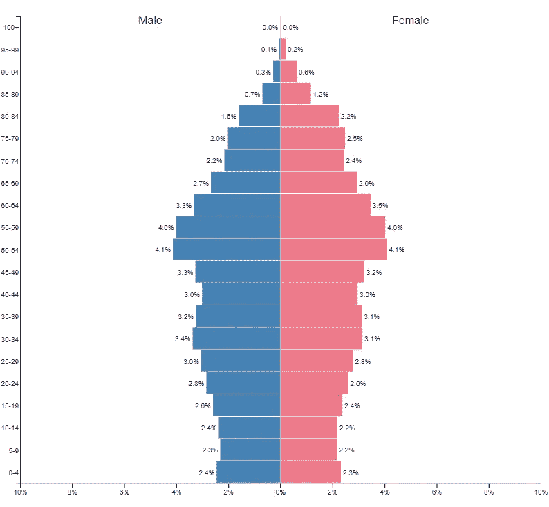

德国的年龄金字塔—资料来源:[人口金字塔](https://www.populationpyramid.net/germany/2019/)

*   **经合组织数据库【https://data.oecd.org/healtheqt/hospital-beds.htm提供的医院床位**和医护人员数量
*   对于每个年龄组的**死亡率**，我使用了 2020 年 3 月 16 日[“帝国理工学院新冠肺炎响应小组”](https://www.imperial.ac.uk/media/imperial-college/medicine/sph/ide/gida-fellowships/Imperial-College-COVID19-NPI-modelling-16-03-2020.pdf)报告中的数据。下表显示了每个年龄组的死亡率:

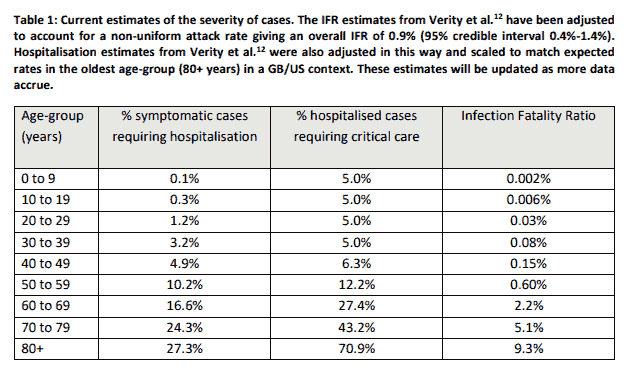

*资料来源:帝国理工学院新冠肺炎应对小组*

在收集了所有的社会人口统计数据后，以下是死亡率**和住院率**和**的结果**:

*   ***比例 _ 德 _2020*** *是德国人口的年龄分布*

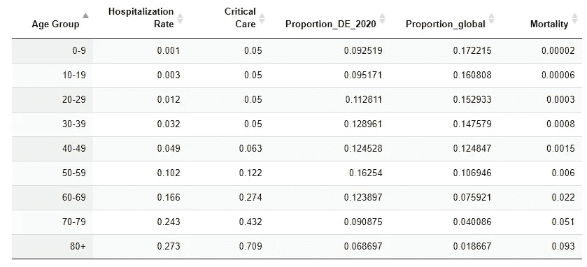

死亡率和住院率快照

# 4 款

# 4.1 先生

1927 年，Kermack 和 McKendrick 首次使用了 SIR 模型,随后该模型被应用于多种疾病，尤其是通过空气传播的儿童疾病，这些疾病在痊愈后具有终身免疫力，如麻疹、腮腺炎、风疹和百日咳。S、I、R 代表易感、感染、痊愈个体数， **N = S + I + R** 为总群体数。

该模型假设:

*   人口规模是固定的(即不出生、不死于疾病或死于自然原因)
*   传染原的潜伏期是瞬间的
*   完全同质的群体，没有年龄、空间或社会结构

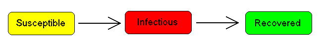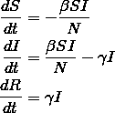

来源: [EMOD 艾滋病毒建模](https://www.idmod.org/docs/hiv/model-sir.html)

> **其中 N(群体)= S(易感)+ I(感染)+ R(康复)**

控制疾病传播的关键因素是 R0(基本繁殖率)，即患病者感染的平均人数。

> 参数**β**(β)和**γ**(γ)定义如下:
> 
> **β** =人群中的平均接触率。
> 
> **γ** =平均传染期的倒数(1/t _ 传染)。或通常称为“回收率”
> 
> 可以通过计算 R0 来获得这些参数:
> 
> **R0 = β/γ**

# 4.2 SEIR

许多疾病有一个潜伏期，在此期间，个体被感染但还没有传染性。感染的获得和感染状态之间的这种延迟可以通过增加一个潜伏/暴露群体 E，并让感染(但还没有传染性)的个体从 S 移动到 E 和从 E 移动到 I，而包含在 SIR 模型中。

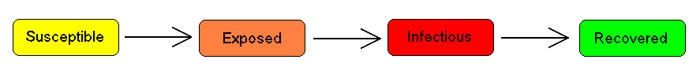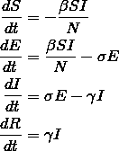

来源: [EMOD HIV 建模](https://www.idmod.org/docs/hiv/model-seir.html)

> **其中 N(人群)= S(易感)+ E(暴露)+ I(感染)+ R(康复)**

**暴露**是指人群已经暴露于疾病，但没有表现出任何症状，也没有变得具有传染性(又名——仍处于潜伏期)。因此，第三个参数**δ**(δ)计算如下:

> **δ** =潜伏期的倒数(1/t _ 孵育)

# 4.3 SEIR + DH

*   另外两个因素 **D** & **H** 被加入到 SEIR 模型中，这两个因素分别说明了死亡病例数和住院病例数。

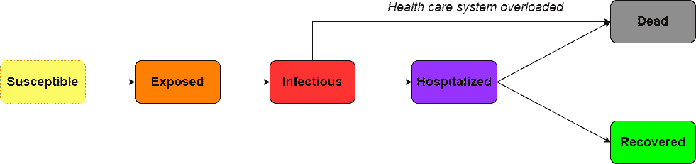

> **其中 N(人群)= S(易感)+ E(暴露)+ I(感染)+ R(康复)+ D(死亡)**

这两个数字的计算方法如下:

> **住院病例(第 t 天)=住院率(每年龄组)*活跃感染病例(第 t 天)**

为了计算死亡病例的数量，我使用从住院到死亡的**时间**来获得过去的住院病例(如果卫生保健系统没有超载)并估计第(t)天的总死亡病例。

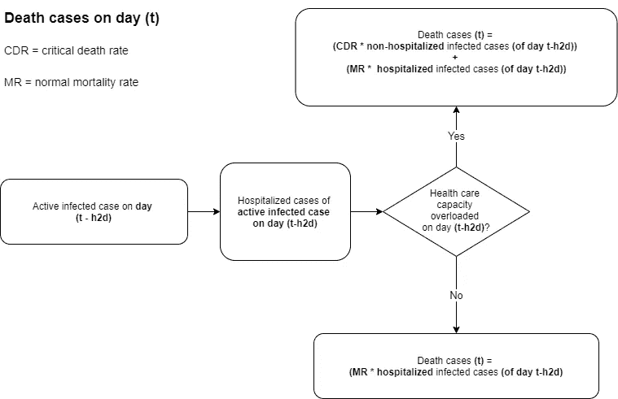

死亡病例计算方法(h2d =“从住院到死亡的时间”)

*   ***临界死亡率*** *—如果没有得到适当治疗的死亡率*，我使用了本报告中的值[估计 2019 年新型冠状病毒疾病的死亡风险，中国，2020 年 1 月至 2 月](https://wwwnc.cdc.gov/eid/article/26/6/20-0233_article)，即 **0.122**

**社交距离因子(s_dist)** 这是一个添加到(S)和(E)变量中的参数，它们乘以 **β** 。由于我使用 RKI 的报告作为基准，所以对于无干预的 **s_dist** 的估计值为 **~ 1.2**

```
(1) S[t] = -(s_dist * β*S[t-1]*I[t-1])/N(2) E[t] = s_dist *S[t-1]*I[t-1] — δ*E[t-1]
```

# 5 模拟

在开始场景模拟之前，我们先来看看德国的历史数据。截至 2020 年 3 月 28 日，德国已有近 **60k** 确诊病例 **~ 9k** 痊愈，接近 **500** 死亡。

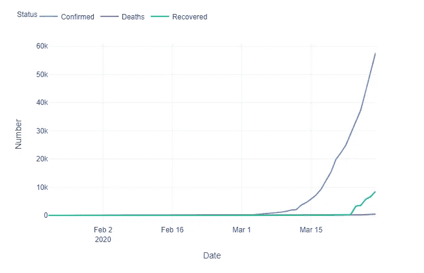

让我们试着预测一下未来 180 天(6 个月)会发生什么。由于本模拟中使用的死亡率是根据目前可用的研究报告的，当我们有了更准确的数字时，动态可能会改变。以下是模型的输入:

```
# Define parameters
t_max = 180 # forecast next 180 days
dt = 1
t = np.linspace(0, t_max, int(t_max/dt) + 1)
N = population# Current exposed cases but yet show symptoms (infectious)
E_0 = round((no_c - no_r - no_d) * RR)
# Current recovered cases
R_0 = no_r
# Current hospitalized cases (part of current infected active cases)
H_0 = func.hospitalized_case(no_c - no_d - no_r, AGE_DATA)
# Current infected cases = confirmed - recovered - deaths
I_0 = no_c - no_r - no_d 
# Current deaths
D_0 = no_d
# Cummulative deaths
CD_0 = no_d# Current susceptible cases
S_0 = N - (I_0 + D_0 + R_0 + E_0)init_vals = (S_0, E_0, I_0, R_0, H_0, D_0, CD_0)# Parameters
# inverse of incubation period
delta = 1/IB
# Beta = gamma - (recovery rate =  1/infectious_day) * R0 
beta = 1/RT * R0 
# Recovery rate
gamma = 1/RT
```

## 5.1 没有社交距离

对于第一种没有社会联系的情况。由于 RKI 预测德国的总活跃感染病例将在未来 3 个月达到**1000 万，让我们将这 1000 万作为“无社会距离”情景的基准。**

这里对*社会距离*参数的估计是 **1.2** ，这导致我们到**2020 年**6 月 19 日**1000 万活跃感染病例**

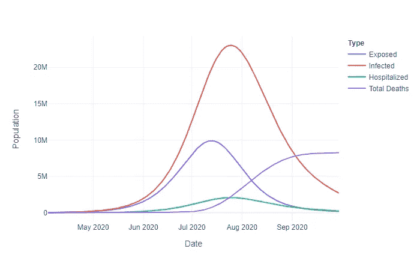

从 2020 年 3 月 23 日起没有社交距离

在这种情况下，该模型预测德国将在 7 月**末**左右达到其入住率峰值，在此期间**至**207 万活跃病例需要住院治疗，但其中只有一半得到治疗。因此，“总死亡数”曲线在这段时间后显著增加(从住院到死亡的平均时间为 10 天)。

到该预测期(6 个月)结束时，死亡总人数将达到 820 万(使用当前死亡率)

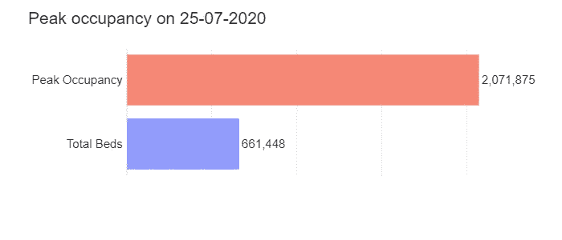

无社交距离情景—预计医院床位高峰占用率

从下面的图表来看,“没有社交距离”情景下的预计死亡案例相当高。50-59 岁年龄组的死亡病例总数最高，6 个月结束时死亡人数超过 110 万(使用当前住院率)。

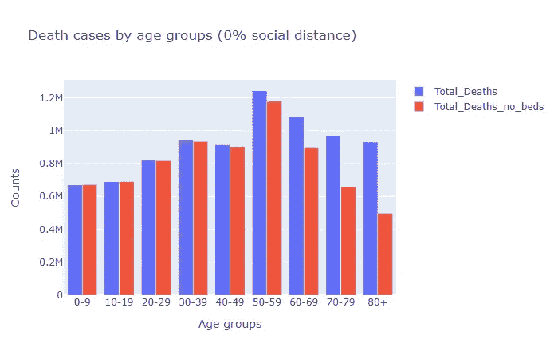

2020 年 3 月 23 日无社会距离——预计死亡病例

> 如果没有干预，德国的医疗保健系统将从 7 月初开始超负荷运转，并在 7 月底达到高峰，预计 6 个月后总死亡人数将超过 800 万。

## 5.2 10%的社交距离

在这种情况下，德国从**2020 年 3 月 23 日**(默克尔总理演讲后)开始应用社交距离法。可以看出，与没有社交距离的情况相比，感染病例略有下降。而且预测死亡病例总数和第一个病例相差不大(**~ 750 万例死亡**)。

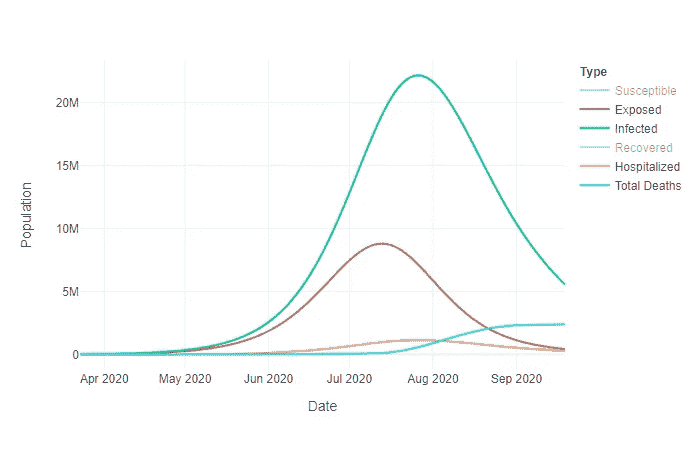

从 2020 年 3 月 23 日开始，10%的社交距离

同时，到 7 月底，德国的医疗保健能力将在同一时期超负荷运转，这一次将有 186 万病例需要住院治疗，但只有略多于 1/3 的人得到治疗。

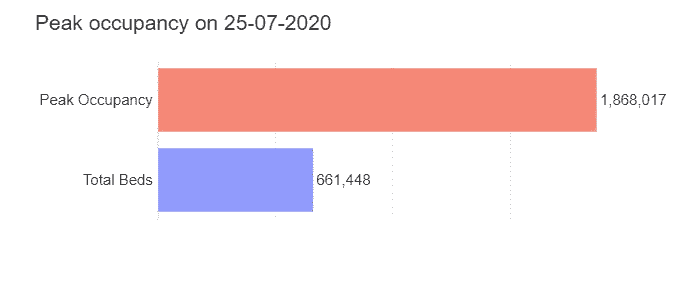

10%的社交距离——预计医院床位高峰占用率


10%的社交距离——预计死亡案例

## 5.3 25%的社交距离

接下来，我们假设德国从 2020 年 3 月 23 日**开始应用 **25%** 社交距离方法。**

可以看出，与上面的其他两种情况相比，感染病例**显著下降**。在这种情况下，180 天后的死亡病例总数约为**500 万**(使用当前估计的病死率)，国家医疗保健系统仍将超负荷运转(8 月中旬**左右达到高峰**，有 150 万病例需要住院治疗)

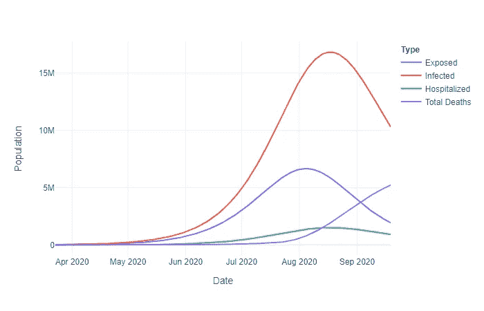

25%的社交距离


25%的社交距离——医院床位高峰占用率

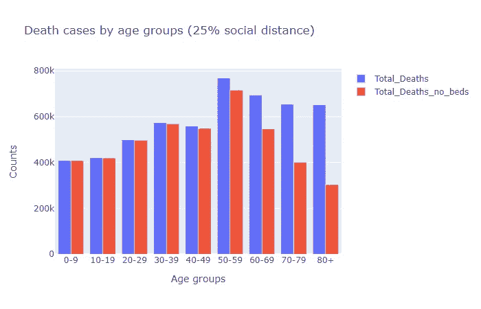

25%的社交距离——预计死亡案例

## 5.4 50%的社交距离

我们已经“拉平了曲线”，但没有那么多。现在让我们看看是否每个人都遵守社交距离 50%的规则(从 2020 年 3 月 23 日起)

可以看出，与上述三种情况相比，感染病例**显著下降**。在这种情况下，180 天后的死亡病例总数仅为 **184k** ，国家医疗保健系统仍不会超负荷(9 月中旬**左右为高峰**)。

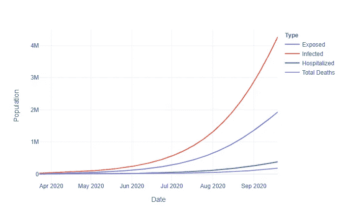

2020 年 3 月 23 日的 50%社交距离情景

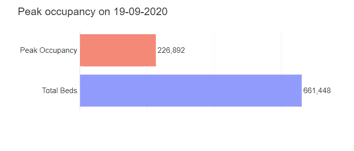

50%的社交距离——预计医院床位高峰占用率

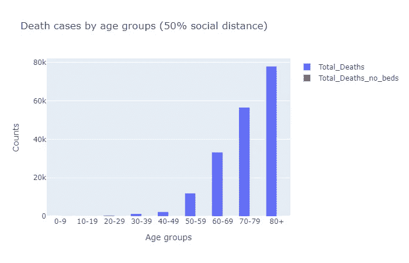

50%的社交距离——预计死亡案例

> 从 2020 年 3 月 23 日开始的 6 个月后，如果德国人遵循社交距离(90%社交距离)，只有大约 4000 人死亡！

## 5.5 90%的社交距离

上面的场景看起来“足够好”，但如果我们真的将社交距离法则发挥到了极致呢？让我们试着模拟一下如果每个人都遵循社交距离到 **90%** 的情况。

正如你所看到的，如果每个人都真正遵守规则，180 天后的死亡总数将会降低到只有～4k，德国的医疗保健系统将不会超载！！

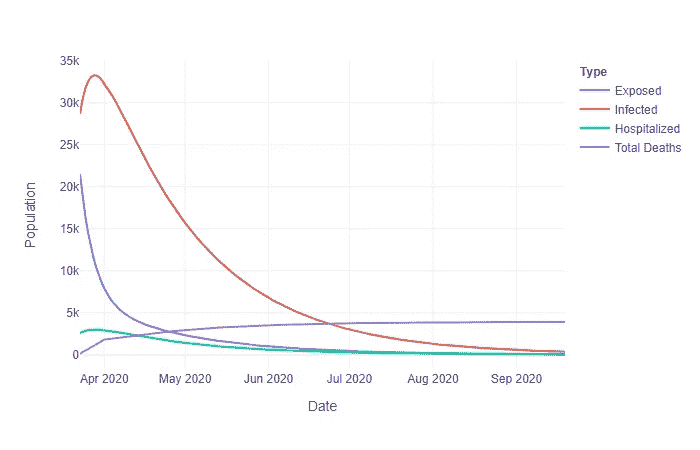

90%的社交距离

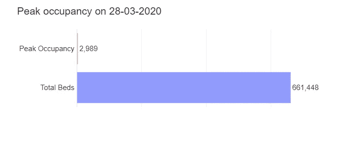

90%的社交距离——医院床位高峰占用率

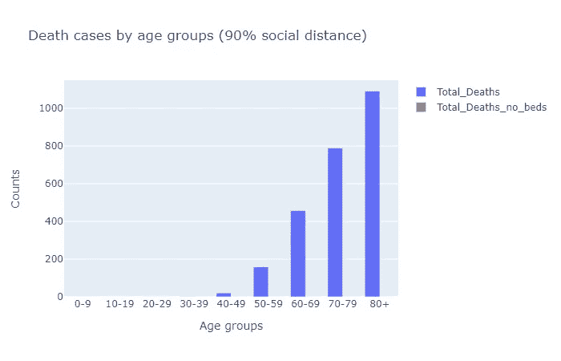

90%的社交距离——预计死亡案例

# 6 次致谢

灵感来源于 **Element AI** 团队的*corona-calculator*([https://corona-calculator.herokuapp.com/](https://corona-calculator.herokuapp.com/))和 **Christian Hubbs** 的流行病学动态扩散模型([https://www.datahubbs.com/](https://www.datahubbs.com/))