# 新冠肺炎测试。你的机会有多大？

> 原文：<https://towardsdatascience.com/covid-19-testing-what-are-your-chances-33f0af5d2ae4?source=collection_archive---------10----------------------->


阿迪·萨瓦拉在 [Unsplash](https://unsplash.com/s/photos/medical?utm_source=unsplash&utm_medium=referral&utm_content=creditCopyText) 上拍摄的照片

## 统计思想在新冠肺炎检验中的应用

*注意:我不是医学专业人士，这篇博客只是我对我认为与诊断测试相关的统计学观点的看法。*

**检测新冠肺炎** 你不需要介绍新冠肺炎，这种冠状病毒现在已经蔓延到地球上的每个国家，正在对经济、卫生系统和人们的生活造成严重破坏。

除了社会距离之外，世界各国政府的首要任务之一是对尽可能多的公民进行测试，既看谁目前携带病毒(抗原测试)，也看谁已经携带病毒(抗体测试)。请注意，在这篇博文中，我将使用“阳性”来表示检测到抗体，并且此人患有新冠肺炎。

到目前为止，一切顺利。你推出测试，评估人群，然后某些人可以返回工作岗位。

**评估是/否诊断测试** 当你低头看测试盒(通常是一种护理点侧流设备，类似于家庭妊娠测试的工作方式)并查看结果时，问题出现了。这些测试给出“阳性”或“阴性”结果，我们经常听说这种测试是通过它们的**准确性**来评估的。我们总是在新闻上听到它。你做了一个准确率为 99%的测试，得到了一个阳性结果，所以很容易假设你患新冠肺炎的概率是 99%，对吗？

不完全是。

准确性是在某种评估过程中，测试正确识别的案例数，无论是正面的还是负面的。这种引用阳性/阴性测试有多好的方式的问题是，它没有区分正确的阳性和正确的阴性。

想象一下，你有一个根本不起作用的测试。无论患者、病情等如何，每次运行时它都会显示“阳性”。你在一组随机的医务人员身上进行测试，其中 98 名已知患有新冠肺炎，2 名没有。你的假测试，把每个人都诊断为阳性，最终会有 98%的准确率！

谢天谢地，有更好的方法来总结这种测试的有效性，最常见的是灵敏度和特异性。这些定义如下:


注意分母。对于灵敏度，我们有“真阳性”，当然是阳性，还有“假阴性”，*，也是阳性*。因此，敏感性只处理阳性病例，而逻辑与阴性病例的特异性相同。结果是灵敏度是从所有阳性病例中获得阳性结果的概率的量度，而特异性是从所有阴性病例中获得阴性结果的概率的量度。

另一种表述方式是，敏感度是得到阳性结果的概率，假设你已经患病，写为 **P(+ve result|Disease)**

然而，在实践中，我们感兴趣的是与此相反的*，即在测试结果为阳性的情况下，患此疾病的概率，即 **P(疾病|+ve 结果)**。那么，在实践中，我们如何做这个翻转呢？*

*托马斯·贝叶斯于 1701 年出生在英国。他一生的大部分时间都专注于教会，只出版了一本关于数学的著作。在晚年，他对概率产生了兴趣，这可能是因为他想反驳大卫·休谟反对将个人证明作为奇迹证据的论点。*

*在他死后，一个朋友找到了关于概率的手稿并交给了皇家学会，贝氏在 1742 年被选为该学会的会员。其中一篇题为《解决机会主义中的一个问题的论文》的论文，引出了今天所知的**贝叶斯定理**，定义为:*

*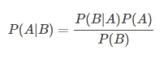*

*注意左边的第一个词和右边的第一个词。在这里，我们可以看到我们所追求的“翻转”，即当我们知道 **P(+ve result|Disease)** 时，获得 **P(Disease|+ve result)** ，以及其他几个我们很快会谈到的术语。这个定理反过来(经过皮埃尔·西蒙·拉普拉斯的提炼)导致了今天所知的贝叶斯统计。*

*流行的统计类型和在许多应用中使用的统计类型被称为**频率统计。这种方法基于样本中事件发生的频率来分配概率。相比之下，在贝叶斯思维中，概率与我们当前对事件的知识水平有关。后一种方法允许引入所谓的**先验**或**预测试概率**(下面将更详细地解释)，这是在收集关于事件的数据之前分配给*的概率。这个预测试概率与新的证据相结合，给出一个**后验概率**或**后验概率**。****

*在贝叶斯定理中， **P(A)** 是患过该病的概率， **P(B)** 是得到阳性结果的概率。这些价值观是什么？P(A)是预测试概率(如上所述)，通常使用当地疾病流行率。或者，预测试概率也可以从详细的医学检查、对患者记录的回顾等中进行估计。P(B)是可以获得阳性结果的所有方式的组合，即患者可能患有该疾病并获得阳性结果，或者患者可能没有患有该疾病并获得阳性结果。具体来说，*

*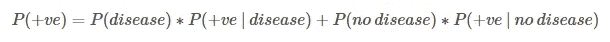*

*在实践中，这样的计算通常是用一种叫做**似然比**的东西来完成的。这些被定义为，*

*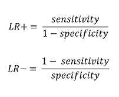*

*其中 LR+是正似然比，LR-是负似然比。它们允许你使用一种叫做**法甘诺模图**的图形工具，从预测试概率到后测概率。或者，可以使用计算机快速进行计算。它们也给你一个测试有效性的指示，因为它们告诉你你的预测试概率会受到正面或负面结果的影响(见下表)。*

*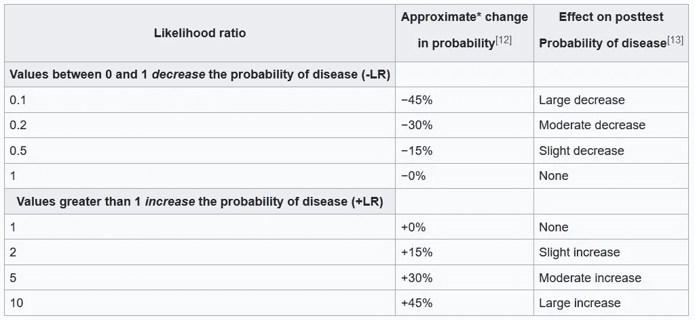*

*似然比数值和后验概率的变化(来自维基百科)*

*精确的计算包括从概率到赔率的转换，*

*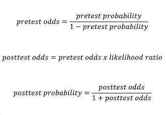*

*看看世界各地正在使用的一些新冠肺炎测试，灵敏度值似乎约为 91%，特异性约为 99%。这样我们的 LR+为 91，LR-为 0.09。相当令人印象深刻。*

*我们现在有了解决这个难题的所有方法，给定一个肯定的结果，对于一个给定的个体，患新冠肺炎的概率是多少。首先，让我们假设您在一个流行率为 1%的地区进行测试，并得到一个肯定的结果。考后概率是多少？*

*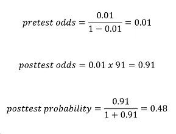*

*我们找到了。一个人在一次奇妙的测试中获得阳性结果后患上新冠肺炎病的概率小于 50%。*

*现在，想象一下如果汤姆·汉克斯怀疑新冠肺炎。不，不是真正的汤姆·汉克斯，他确实得到了新冠肺炎。我指的是查克·达拉，汤姆·汉克斯在电影《荒岛余生》中扮演的角色。如果通过一个非常复杂的事件转折，被困在荒岛上多年的查克·达拉发现了一种被冲上沙滩的新冠肺炎快速现场护理测试，并因为他有点咳嗽而决定进行它，如果它给了他一个阳性结果，这意味着什么？嗯，前测概率为零，也就是说后测概率也为零。运行测试完全是浪费时间！(当你被困在一个荒岛上时，这并不是什么大问题)。*

*现在让我们把它翻过来。你对医务人员进行了测试，他们在新冠肺炎的一个紧急避难所里长时间工作，却没有足够的个人防护装备。他们都有症状，但后来都康复了。他们治疗的病人都有严重的症状。他们都在艰难地呼吸。他们都发烧了。他们都与自己是确诊病例的家庭成员有过接触。现在是仲夏，普通感冒和流感的发病率很低。很难说患病率是多少，所以你用的是利用(过去)临床症状和患者病史的方法。您估计每位员工的预测试概率为 0.95。这是数字，*

*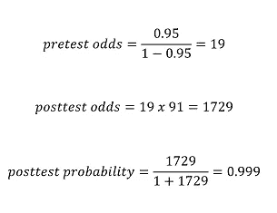*

*你已经从测试前的概率 0.95，变成了测试后的概率 1。并不特别意外。同样，这个测试可以说是浪费时间。*

*由此得出的结论是，考虑到你可能缺少测试，测试那些预测试概率极低或极高的人有意义吗？毕竟，在一天结束的时候，*您在运行测试之后所做的事情可能不会改变*。如果你非常确定某人已经感染了新冠肺炎病毒，并且计划让他们脱离隔离状态，那么用尽一项宝贵的检测结果呈阳性并不能改变什么。即使有人的预测试概率为 0.95，并且他们得到了否定的结果，这也不会显著改变事情(基于上面的 LR)。*

*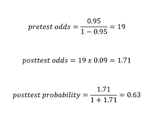*

*我们得到 0.63 的后验概率。如果医生的想法是“如果他们的后验概率超过 0.5 或以上，我会允许团队成员返回工作”，这个负面结果不会改变任何事情。他们将被允许在测试前返回。之后他们也会被允许回来。*

*这种“治疗阈值”更容易通过图表看出。下面是一个 Python 函数，它根据给定的灵敏度和特异性值，计算出给定的预测试概率的预测试概率。*

```
*def diagnostic_posttest(pretest,sens,spec):
    lr_pos = sens / (1 - spec) 
    lr_neg = (1 - sens) / spec 

    pretest_odds = pretest / (1-pretest)
    posttest_odds_pos = pretest_odds * lr_pos 
    posttest_odds_neg = pretest_odds * lr_neg 
    posttest_pos = posttest_odds_pos / (1+posttest_odds_pos)
    posttest_neg = posttest_odds_neg / (1+posttest_odds_neg)

    return(posttest_pos, posttest_neg)*
```

*我们可以使用该函数以及类似于现实世界中的灵敏度和特异性值来创建预测试概率对预测试概率的图，*

```
*import numpy as np
import matplotlib.pyplot as pltpost = list()
prev_options = np.arange(0.0, 1.0, 0.01)

for i in prev_options:
    post_temp = diagnostic_posttest(i,0.91,0.99)[0]
    post.append(post_temp)fig, ax = plt.subplots()
ax.plot(prev_options, post)
plt.xlim([0.0, 1.0])
plt.ylim([0.0, 1.0])
plt.rcParams['font.size'] = 12
plt.title('Pretest vs Posttest Probability (sens = 0.91, spec = 0.99)')
plt.xlabel('Pretest Probability')
plt.ylabel('Posttest Probability')*
```

*这是我们得到的阳性测试结果，*

*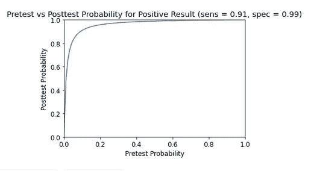*

*对于阴性测试结果，*

*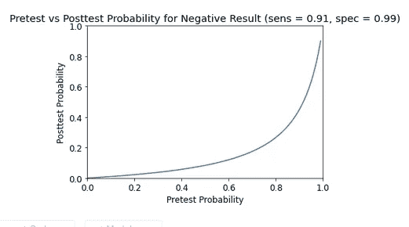*

*正如你看到的正面结果，随着测试前概率的增加，测试后概率迅速上升。对于一个否定的结果，你需要一个非常高的预测试概率，这样预测试概率也会很高。*

***有多自信？所有这些还有一个方面。新冠肺炎测试通常引用的数字通常不包括**置信区间**。***

*置信区间是围绕某个数字的值的范围，例如敏感度值，它向您显示与您的数据兼容的值的可能范围。它们是一种方法，如果你要重复你的实验，你可以在哪里找到你的结果。这样的信息是至关重要的，因为如果你将关键决策建立在一个特定的数字*上，而这个数字实际上可能与现实中的*不同，你可能会面临严重的问题。*

*我们举个例子。假设新冠肺炎测试的灵敏度和特异性分别为 88%和 90%。给定测试期间属于每个类别的案例数(真阳性、假阳性、真阴性和假阴性)，我们可以计算置信区间。*

*假设我们这样做，最终灵敏度为 88% (85%至 92%，95%可信区间)，特异性为 90% (84%至 95%，95%可信区间)，其中“95%可信区间”表示其置信区间为 95%(详见[这篇博文](https://medium.com/@tentotheminus9/veterinary-stats-2-the-central-limit-theorem-a-crisis-of-confidence-ff78466bb898))。*

*本质上，这种 COVID–19*可能*具有低至 85%的灵敏度和低至 84%的特异性。这样我们的 LR+为 5.3，LR-为 0.18。这在实践中意味着什么？*

*假设你估计的预测试概率是 0.1。在这种情况下，一个阳性的测试结果会给你一个大约 0.38 的后验概率，这个概率仍然很低(见下图)。你以 0.38 的概率保持隔离吗？如果你有一份重要的工作呢？测试真的取得了什么成果吗？*

*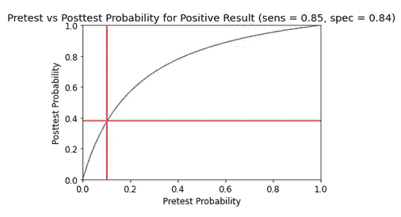*

*同样，在前面处理一线医务人员的例子中，他们的预测试概率可能估计为 0.95。如果这个测试给你一个否定的结果，结果后测概率是 0.78(见下图)。还是很高的。*

*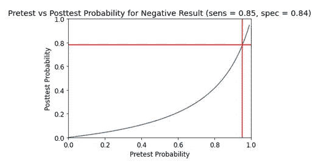*

***总结思路** 我们已经看到，快速、即时的是/否诊断测试的结果从来都不是完美的，可以使用贝叶斯统计和预测试概率的概念将其置于有意义的环境中。阳性结果并不一定意味着这个人患有新冠肺炎，特别是如果他们在苏格兰突出部分的一个孤立的小村庄(为了这个说明的目的，请忽略人们正涌向高地自我隔离的事实)。同样，阴性结果并不一定意味着这个人没有感染新冠肺炎病毒，尤其是如果他们刚刚在前线花了 4 周时间治疗数百名感染病毒的患者。*

*背景很重要，在这个疯狂的测试时代，这些细节可能很重要。*

*如开头所述，本文只是一些统计观点的例子，并不意味着对新冠肺炎提供任何指导。*