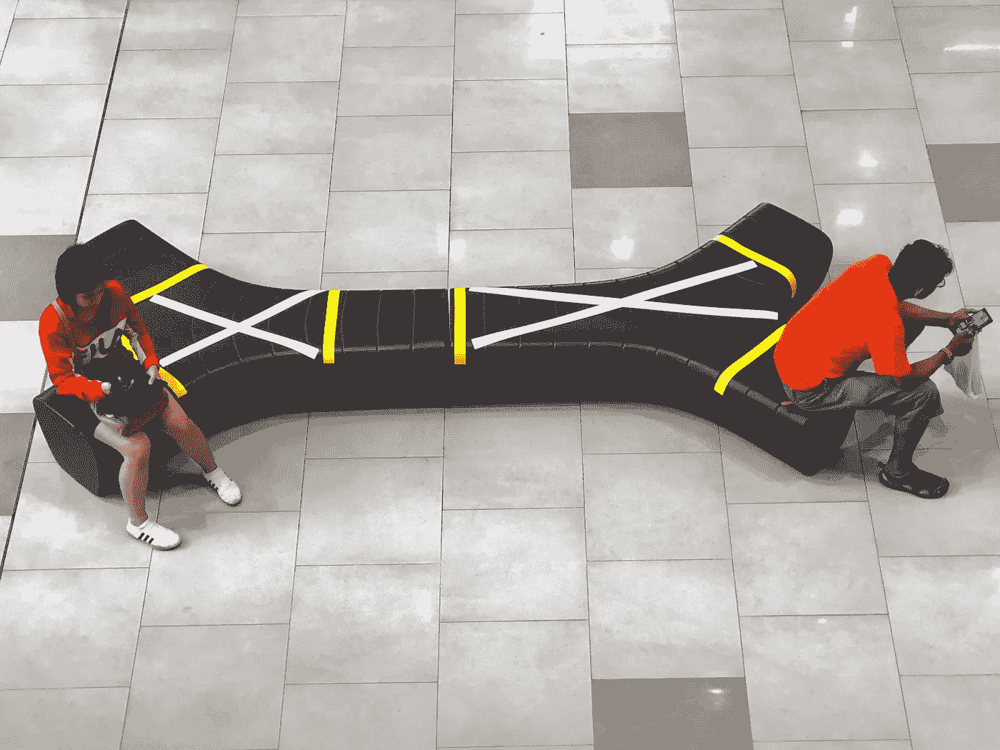
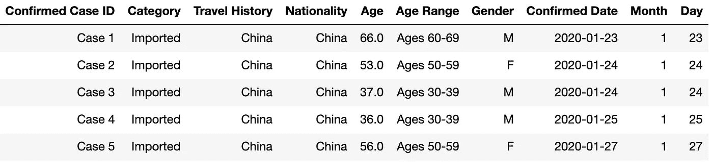
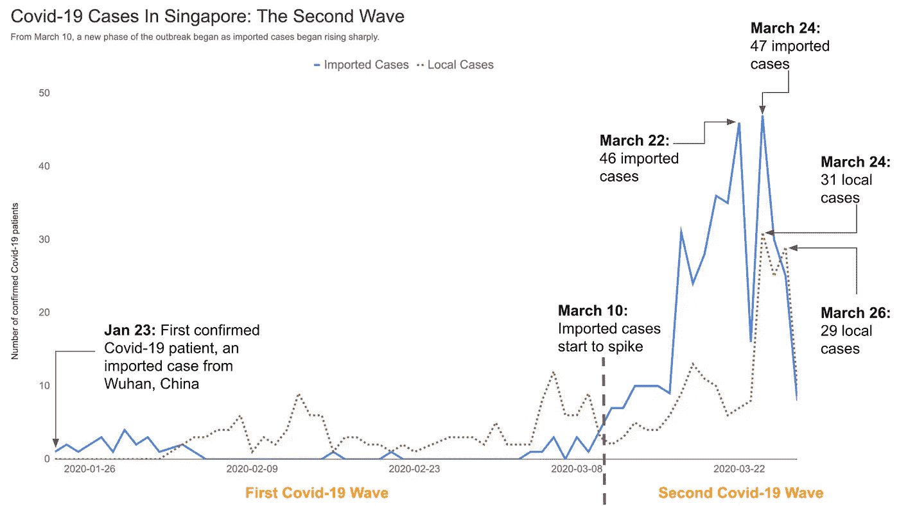
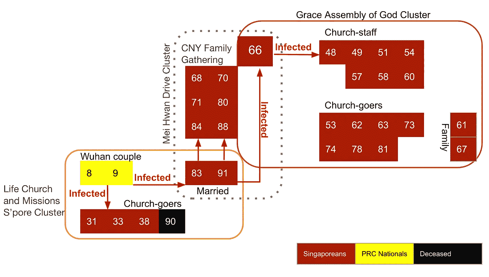
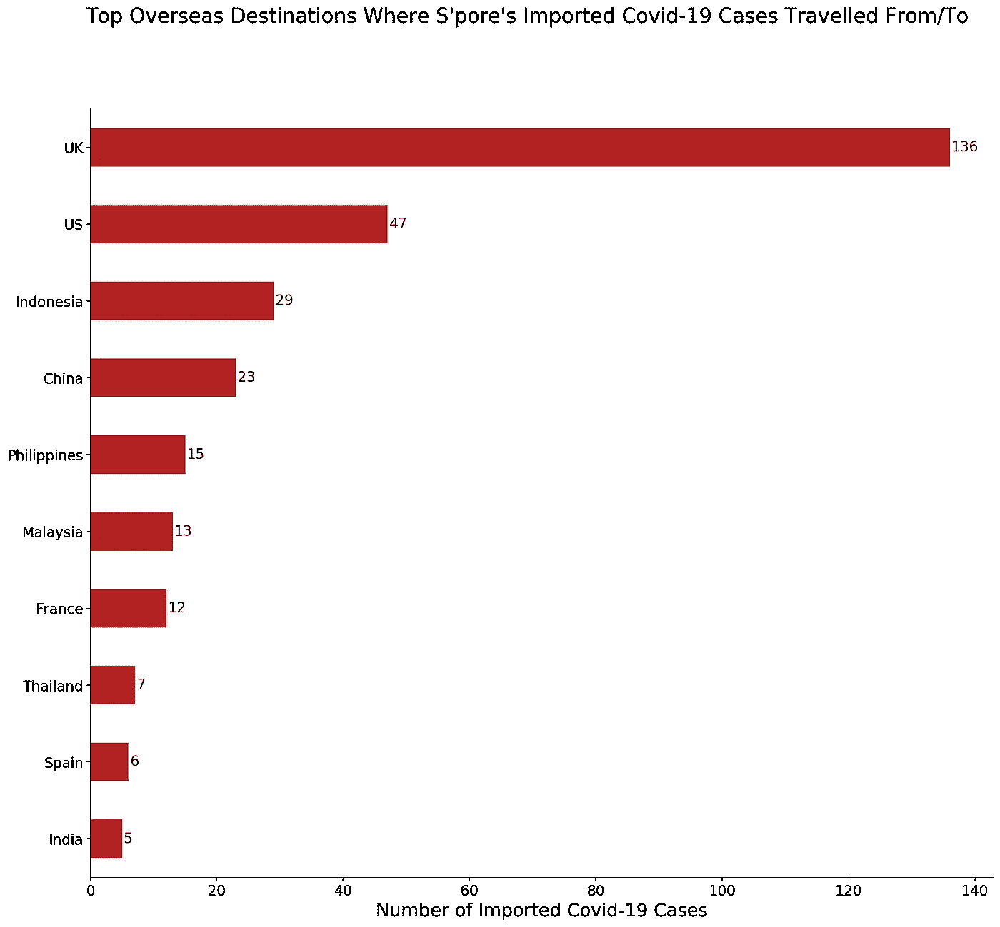
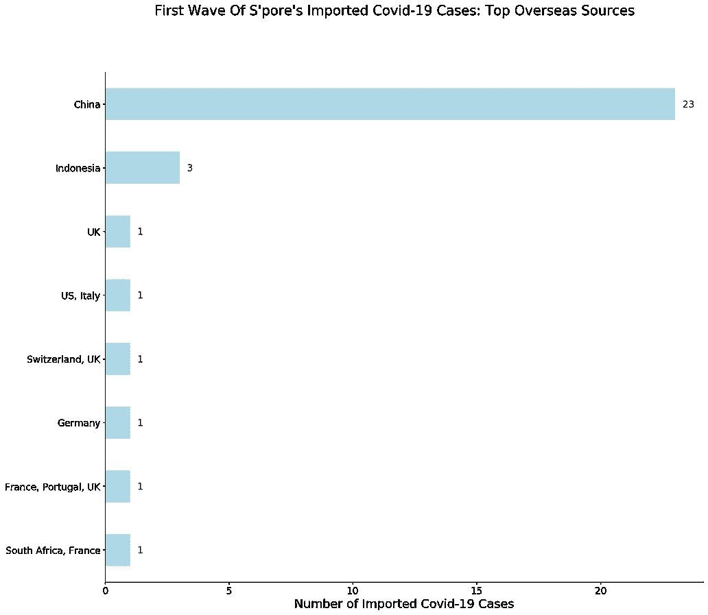
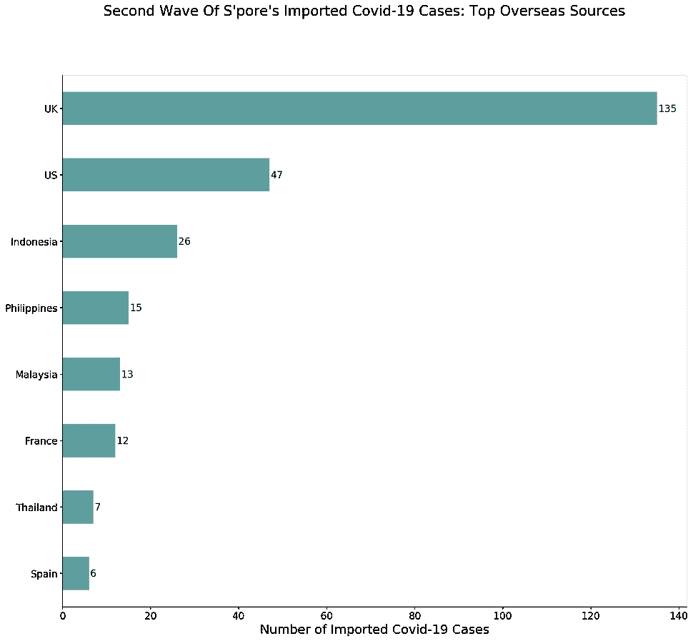
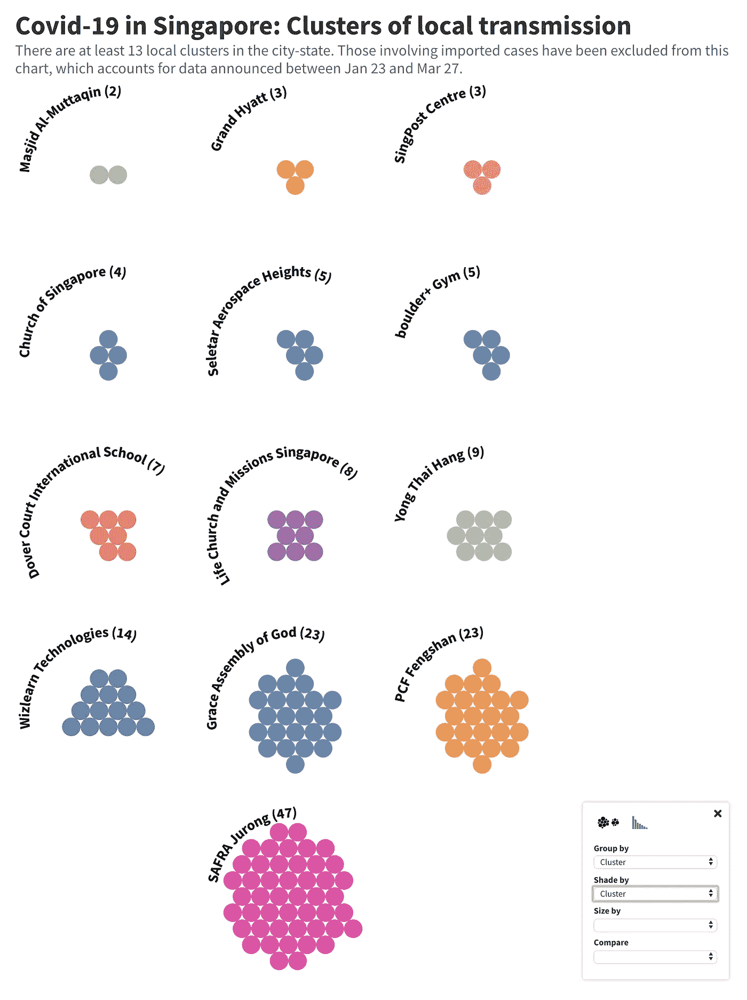
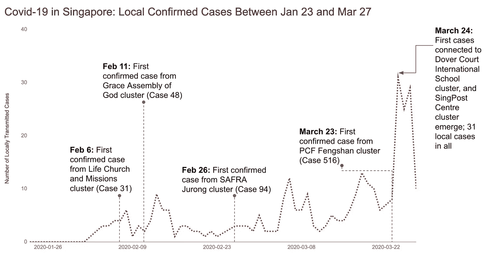
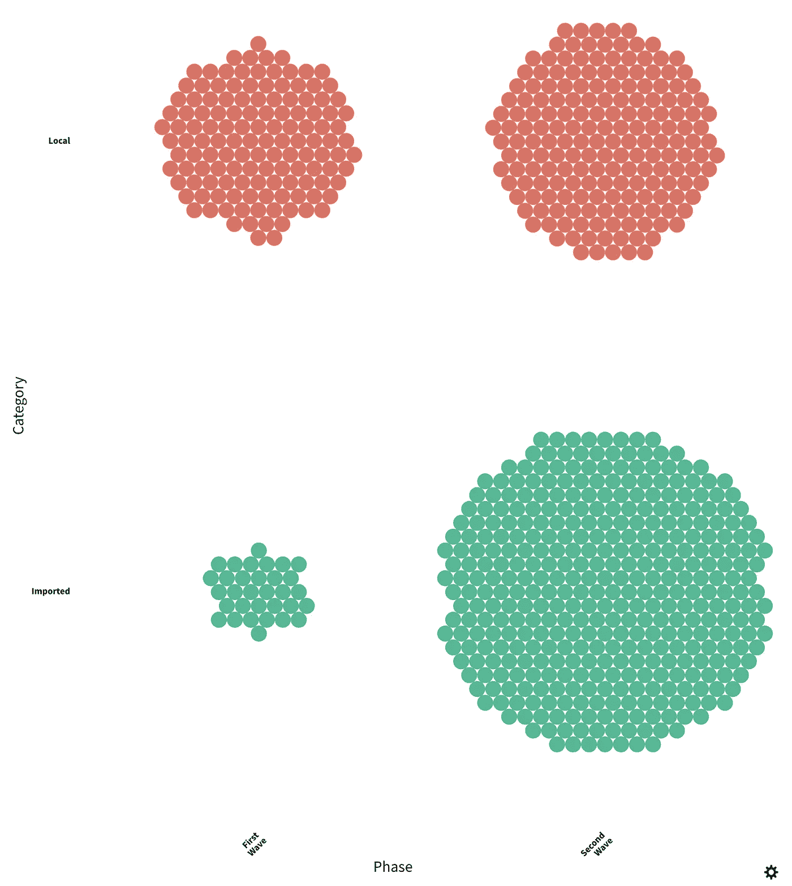

# 新冠肺炎:新加坡的第二次浪潮

> 原文：<https://towardsdatascience.com/covid-19-the-second-wave-in-singapore-91e886b3d444?source=collection_archive---------12----------------------->

大约在 3 月 10 日，新加坡抗击新型冠状病毒的斗争进入了一个新阶段，当时输入病例的数量开始急剧增加。这个城市国家的经历可能是仍在努力应对疫情第一阶段的其他国家煤矿中的金丝雀。



T2 从 2020 年 3 月 27 日开始实施新的社交距离规则。照片:蔡展汉

在 1 月 23 日报告首例确诊新冠肺炎病例约两个月后，新加坡已进入疫情爆发的新阶段，其特征是来自更多国家的更大一波输入性病例。

根据新加坡卫生部[每日新冠肺炎公告](https://www.moh.gov.sg/news-highlights/)的分类，第二波开始于 3 月 10 日左右。就像第一阶段一样，在 1 月 23 日至 09 年 3 月之间，人们担心不断增加的输入性病例将引发新冠肺炎本地传播的更大高峰。

为此，新加坡当局推出了一系列严厉的新措施，以加强社会距离，限制人群，并对来自英国和美国等新冠肺炎热点地区的“海归”进行隔离。政府已经暗示，如果有必要，它准备出台更严厉的措施。

本帖将仔细观察新冠肺炎病毒在新加坡爆发的第一波和第二波有何不同。

# **1。数据和警告**

本文涵盖了新加坡当局在 1 月 23 日至 3 月 27 日之间宣布的 732 例确诊病例(415 例输入性病例，317 例本地病例)。图表数据来自卫生部网站[的每日新冠肺炎更新。你可以在这里](https://www.moh.gov.sg/news-highlights/)下载数据集[，或者通过我的](https://www.dropbox.com/s/f0zy74zhw1af7qw/2ndwave_processed.csv?dl=0) [Github repo](https://github.com/chuachinhon/covid_sg) 下载。



卫生部的每日更新包括宣布当天确诊的新冠肺炎病例，以及前一天检测呈阳性的病例。例如，日期为 3 月 27 日的新闻发布会将有患者在 3 月 27 日和 3 月 26 日都检测为阳性。

为了避免混淆，**本文中的图表仅参考官方确认感染**的日期。这些确认日期是医疗记录，与更具管理性质的公告日期相比，将更加可靠和一致。

但是，请注意，新加坡的媒体报道是基于新加坡政府每天公布的新新冠肺炎数据。如果你将那些文章中报道的数字与图表中突出显示的数字进行比较，就会发现有出入，因为它们是从不同的日期引用的。

最后，声明:**这不是医学研究，我也不是流行病学家。这是为了更好地理解公开信息的潜在趋势。已经特别注意避免过度解读不完整的新冠肺炎数据。**

# 2.3 月 10 日:一个新阶段开始了

新感染的出现与当局检测和确认它们的能力之间显然有一个时间差。但根据现有数据的分类，新加坡的新冠肺炎疫情似乎在 3 月 10 日左右进入了一个新阶段。

从那时起，输入性病例的数量开始超过本地传播的病例——起初很慢，随后急剧增加，如下图所示。



图表中的日期是指官方确认新冠肺炎感染的日期，而不是卫生部宣布的日期。

在 3 月 10 日之前，绝大多数输入性病例都是来自 mainland China 的游客或从新冠肺炎疫情发源地武汉撤离的新加坡人。

第一例与中国没有关联的输入性病例——患者 113——直到 3 月 4 日才得到确诊，几乎是在新加坡 1 月 23 日报告首例新冠肺炎病例的 6 周之后。

第 113 号患者，一名 42 岁的法国国民，曾去过法国、葡萄牙、土耳其和英国，这是一个征兆，尽管当地病例继续超过输入病例达六天之久。

3 月 10 日，输入性病例数几周来首次略微领先于本地病例(4 例输入性病例对 3 例本地病例)。一周后的 3 月 17 日，输入病例激增至 31 例。一周后的 3 月 24 日，47 例输入性病例得到确认，这是迄今为止此类病例的最高单日记录。

第二波输入性新冠肺炎病例主要来自英国和美国，这与疫情第一阶段与中国相关的输入性病例形成鲜明对比。关于输入病例变化的更详细分类可在第 4 节中找到。

在疫情的第二阶段，本地传播的病例数量也相应增加。事实上，本地传播的病例在 3 月 24 日达到了目前 31 例阳性检测的最高纪录，同一天，新输入病例的确认也达到了最高纪录。

到目前为止，当局尚未披露第二阶段的输入性和本地病例之间的任何直接联系。但是我们已经从第一阶段的几个集群中看到，这是一种明显的可能性。

# 3.进口-本地多米诺效应



90 号病人是 T2 第一个死于新冠肺炎的新加坡人。

输入性新冠肺炎病例如何对当地传播产生“多米诺骨牌效应”的最著名的例子发生在一对受感染的武汉夫妇身上，他们分别是 8 号和 9 号患者。他们于 1 月 19 日抵达新加坡，并在同一天拜访了巴耶利巴的生命教会和传道会。

这对中国夫妇感染了六名去教堂做礼拜的人，这些人接着又感染了另外两群人中的大约 24 人(见上图)。这两名中国公民仅在 1 月 28 日和 29 日对新冠肺炎的检测呈阳性。从 2 月 6 日起，被他们感染的新加坡人新冠肺炎病毒检测呈阳性。

鉴于该病毒的高度传染性，首次接触感染者和确认新感染之间的巨大时间差令人担忧。尽管当局现在有了更快的检测试剂盒和更多应对新冠肺炎的经验，但全面追踪接触者和护理高危人群中的患者仍是一项极具挑战性的任务。

例证:[90 号病人，第一个死于新冠肺炎的新加坡人](https://www.moh.gov.sg/news-highlights/details/passing-of-two-patients-with-covid-19-infection)。这名 75 岁的妇女有慢性心脏病和高血压病史，于 2 月 9 日开始报告症状。但她只是在 2 月 23 日的新冠肺炎检测中呈阳性。在重症监护 26 天后，她于 3 月 21 日去世。

距离疫苗问世还有几个月，甚至几年的时间，对新冠肺炎的多米诺骨牌效应最明显的应对措施就是人们减少社会交往，以最大限度地减少任何潜在的传播链。对于没有出过远门的新加坡人来说，这意味着要认真对待社交距离，避开人群。对于最近刚从海外回来的人来说，这意味着要严格遵守[的自我检疫令](https://www.channelnewsasia.com/news/singapore/covid19-stay-home-notice-breach-charged-court-shanmugam-12574668)。

新加坡在这一新阶段控制新感染的能力，或者说是最近广为人知的“拉平曲线”的能力，将在很大程度上取决于这里的居民遵守这些新规则的程度。

# **4。新加坡输入性新冠肺炎病例的变化概况**

在撰写本文时，新加坡的 415 例输入性新冠肺炎病例有旅行史，涉及 45 个不同的目的地。然而，卫生部在这方面发布的信息并不一致，一些输入病例的旅行史被公布为“东盟”、“欧洲”和“东欧”，但没有详细说明。卫生部还将 19 例输入病例的旅行记录标记为“待定”,但没有解释为什么没有这些信息。

如果我们排除这四个有问题的类别，输入性新冠肺炎病例前往(或来自)的 41 个国家是:英国、美国、印度尼西亚、中国、菲律宾、马来西亚、法国、泰国、西班牙、意大利、斯洛文尼亚、摩纳哥、台湾、爱尔兰、土耳其、阿联酋、加拿大、澳大利亚、波斯尼亚、挪威、日本、俄罗斯、冰岛、塞尔维亚、匈牙利、丹麦、瑞士、巴基斯坦、印度、荷兰、斯里兰卡、奥地利、比利时、克罗地亚、墨西哥、捷克共和国、葡萄牙、荷兰、南非、德国和瑞典。

至少有 60 例输入病例曾传播到上述两个或更多国家。在新加坡，绝大多数输入性新冠肺炎病例都有一个单一的来源，目前以英国为首:



这个图表不包括卫生部记录中的模糊类别，如“欧洲”、“东欧”、“东盟”和“待定”。

如果我们包括抵达新加坡前有多个旅行目的地的输入病例，那么与英国有关联的病例数将达到 155 例。对于这些病例，卫生部的新闻稿没有详细说明患者可能是在哪里感染的。

当我们根据迄今为止我们所看到的疫情的两个阶段来划分输入性病例时，输入性病例的地理分布更加惊人:第一波从 1 月 23 日到 3 月 9 日，第二波从 3 月 10 日起:



左图:2009 年 1 月 23 日至 3 月的输入病例。右图:3 月 10 日至 3 月 27 日输入病例。

中国在第一阶段的输入病例中占主导地位，在第二波中自然没有出现在图表中，因为新加坡当局在 1 月下旬针对中国游客和最近有过大陆旅行史的人实施了严格的旅行限制。

来自英国和美国的输入性病例激增，似乎主要是由于新加坡人(尤其是学生)因东道国对新冠肺炎疫情处理不当而回国。

对有英国旅行史的 155 例输入病例的分类显示:

*   113 人(73%)是新加坡人，14 人是新加坡永久居民。
*   大约一半，即 78 岁，年龄在 18 到 25 岁之间。

当局预计[更多在英国和美国的新加坡学生和居民将在未来几周内回国](https://www.channelnewsasia.com/news/singapore/covid19-returning-singapore-residents-uk-us-shn-hotels-12571490)，他们对此不抱任何希望。根据从疫情第一阶段吸取的教训，新加坡已经要求从这两个国家返回的居民直接从机场前往[酒店，接受为期两周的隔离](https://www.bloomberg.com/news/articles/2020-03-28/in-singapore-quarantine-comes-with-a-sea-view-and-room-service)。

# 5.越来越多的本地集群

检查本地案例最有趣的方式是通过网络图来查看集群是如何连接的。考虑到绘制集群所涉及的工作量，我将把这个问题放在另一篇文章中。

这里有一个我通过[riche 的](https://flourish.studio/)优秀调查模板得到的快速版本。你可以在这里访问它[。](https://public.flourish.studio/visualisation/1722034/)



这些集群中有几个仍在增长，所以这里的数字没有反映最新的计数。这张图表的数据取自新加坡卫生部 1 月 23 日至 3 月 27 日的新闻稿。

迄今为止最大的本地聚集性病例是 SAFRA 句容聚集性病例，涉及 47 例确诊病例，这些病例以各种方式与 2 月 15 日的一次晚宴活动有关。许多参加活动的人有共同的社交圈，并参加了可能加剧病毒传播的联合活动。

下面的图表有助于更好地了解本地传播中的峰值是如何跟踪这些集群的出现的:



从 3 月 24 日起本地病例的激增是由于大约同时出现了至少三个新的集群:

*   PCF 凤山丛(26 例及以上)；第一例出现在 3 月 23 日。
*   多佛法院国际学校集群(至少 8 起案件)；第一例出现在 3 月 24 日
*   新加坡邮政中心集群(至少 5 个案例)；第一例出现在 3 月 24 日

在新聚集的第一个病例和随后所有本地病例的高峰之间通常有几天的间隔。按照全球标准，新加坡的接触者追踪制度已经相当激进。

但这里的目标是进一步减少建立新确诊病例近期活动史所需的时间，以便可以快速检测他或她的密切接触者，并将其与其社交圈子中的其他人隔离开来。我将在以后的文章中更详细地介绍本地集群。

# 6.比较第一波和第二波新冠肺炎病例的关键人口统计学指标

疫情仍在快速发展，因此在这一点上制作太多详细的图表没有多大意义。我再次在 fluore 上加载了一个单独的调查模板，供那些想要详细探索第一波和第二波人口统计数据的人使用。你可以在这里找到。

我将只关注几个引起我注意的关键领域。

## 6.1 本地输入病例组合的变化

我们已经从之前的图表中看到，在第二波期间，新加坡的输入性病例数量出现了急剧上升。如果把所有的数字放在一起，那就更令人吃惊了:

```
**Phase                Category    Total Confirmed Cases**
First Wave           Local                 131
                     Imported               32Second Wave          Imported              383
                     Local                 186
```



互动图表可用[此处](https://public.flourish.studio/visualisation/1732543/)。

从 3 月 10 日起，外来病例增加了 10 倍多。

## 6.2 性别混合

我们继续看到新冠肺炎病毒检测呈阳性的男性多于女性。

```
**Phase                 Gender**     **Total Confirmed Cases**
First Wave            M                    92
                      F                    71Second Wave           M                    328
                      F                    241
```

## **6.3 年龄范围的变化**

在第二波中有一个明显的年轻新冠肺炎患者高峰，在 20-29 岁年龄组的 179 个病例中可以看到。这可能是因为从英国和美国回国的学生人数很多。

```
**Phase                Age Range**    **Total Confirmed Cases** 
First Wave           Ages 50-59           38
                     Ages 30-39           35
                     Ages 60-69           29
                     Ages 40-49           28
                     Ages 20-29           17
                     Ages 70-79           10
                     Ages 0-9              4
                     Ages 10-19            2Second Wave          Ages 20-29          179
                     Ages 30-39          101
                     Ages 50-59           86
                     Ages 40-49           82
                     Ages 60-69           64
                     Ages 10-19           23
                     Ages 70-79           22
                     Ages 0-9              6
                     Ages 80-89            6
```

我的笔记本里有这篇文章更详细的分析。在这一点上，我会避免走得太远。

# 结论

第一波和第二波新冠肺炎疫情之间的显著差异凸显了在全球化时代试图遏制疫情的复杂性。

在第一阶段，新加坡反应迅速，相对较快地控制了疫情，而疫情在很大程度上仍以中国为中心。

鉴于疫情现已席卷全球几乎所有角落，第二阶段将更难管理。其他国家政府如何应对本国的新冠肺炎病例，将对新加坡产生直接影响，正如我们从从英国和美国回国的难民人数激增中所看到的那样。

在可预见的未来，新加坡将不得不密切关注新输入病例的多种潜在来源，同时努力控制本地传播。

遏制疫情还将带来日益复杂的国内政策挑战。在疫情爆发的第一阶段，即 1 月 23 日至 09 年 3 月，输入性病例中只有 8 名新加坡人。

在第二阶段，从 3 月 10 日起，新加坡人至少占了 239 例输入性病例，在这一类别中占了绝大多数:

```
**Phase        Category  Nationality     Total Confirmed Cases**
First Wave   Imported  China                   17
                       **Singapore                8**
                       Indonesia                2
                       Singapore PR             2
                       France                   1
                       Italy                    1
                       UK                       1Second Wave  Imported  **Singapore              239**
                       Singapore PR            34
                       UK                      16
                       Indonesia               15
                       Australia               10
                       Malaysia                 9
                       Philippines              9
```

毫无疑问，在第二波输入病例中，新加坡人的激增与归国学生或没有多少选择的担忧家庭有关，但这个数字暗示了新加坡当局在说服本国公民不要出国旅行以避免疾病卷土重来方面面临的更大挑战。

这个信息可能会持续一段时间，但新加坡或其他国家在这方面的吊桥能抵挡第三次甚至第四次新冠肺炎疫情爆发多久呢？三个月？六个月？一年？

现在还不知道。

本帖图表的[笔记本](https://github.com/chuachinhon/covid_sg/blob/master/notebooks/2.0_covidsg_2nd_wave_cch.ipynb)和[数据](https://github.com/chuachinhon/covid_sg/blob/master/data/covidsg_2ndwave.csv)在我的 Github [回购](https://github.com/chuachinhon/covid_sg)里。如果你发现了错误或者对这个来自新加坡的小数据集做了一些有趣的事情，请告诉我。在以下时间 Ping 我:

推特:[蔡振鸿](https://medium.com/u/b3d8090c0aee?source=post_page-----aad7f2e1d0a0----------------------)

领英:[www.linkedin.com/in/chuachinhon](http://www.linkedin.com/in/chuachinhon)

我关于新加坡新冠肺炎疫情的其他帖子:

## * [新冠肺炎:新加坡首批 100 名完全康复患者的视觉记录](/visual-notes-from-singapores-first-100-fully-recovered-covid-19-patients-aad7f2e1d0a0)

## * [恐慌性购买的背后:一个神秘的“泄露”和随着 S'pore 提高其病毒警戒级别 FB 的激增](https://www.analytix-labs.com/insights/panic-buying)

## * [病毒式传播:随着武汉冠状病毒疫情恶化，新加坡的食品安全反应如何激增](https://medium.com/@chinhonchua/going-viral-how-fb-reactions-in-singapore-surged-as-wuhan-coronavirus-outbreak-worsened-9e980f1a2e96)

***编者按:*** [*走向数据科学*](http://towardsdatascience.com/) *是一份以数据科学和机器学习研究为主的中型刊物。我们不是健康专家或流行病学家，本文的观点不应被解释为专业建议。想了解更多关于疫情冠状病毒的信息，可以点击* [*这里*](https://www.who.int/emergencies/diseases/novel-coronavirus-2019/situation-reports) *。*