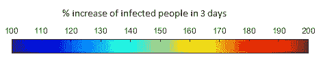
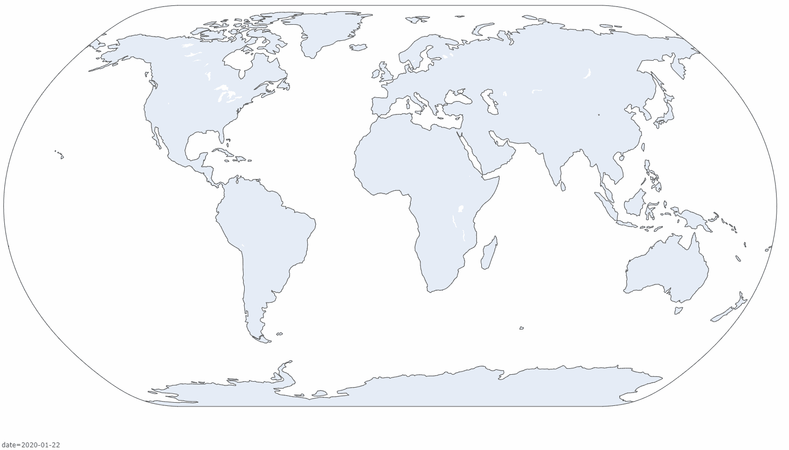
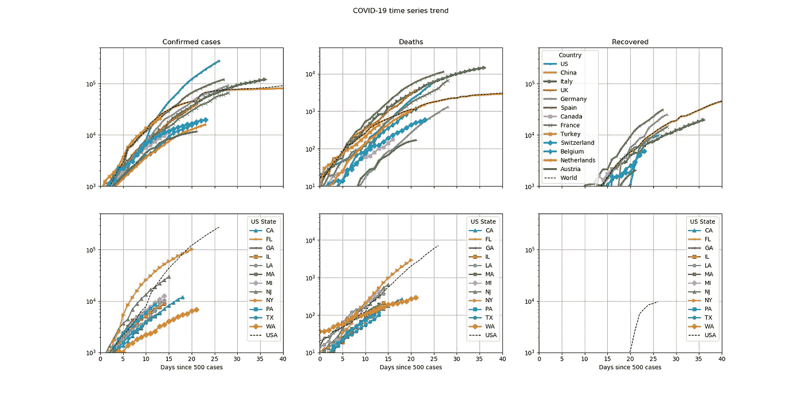
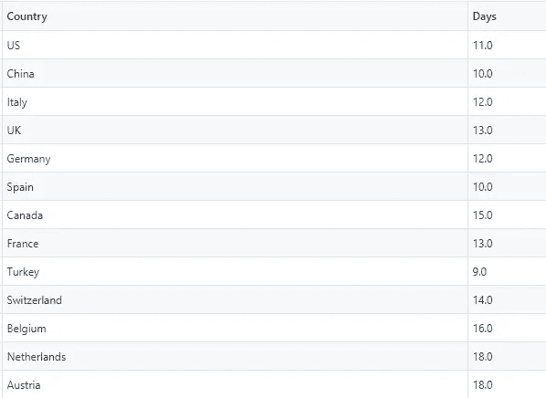
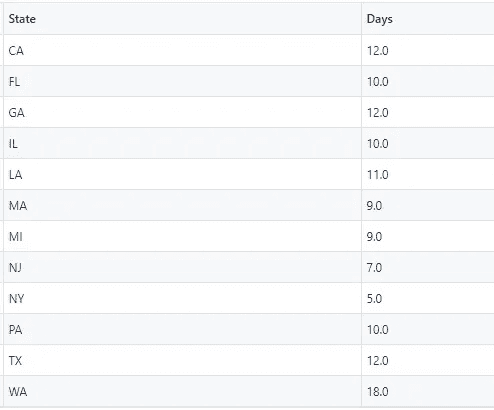

# 分析新冠肺炎趋势的开源代码——第一部分

> 原文：<https://towardsdatascience.com/covid-19-trends-corona-virus-in-numbers-8725c25b636d?source=collection_archive---------40----------------------->

## GitHub 和 Google 联合实验室使用约翰·霍普斯金大学的数据库跟踪新型冠状病毒传播的用例

我开发了一个 python 代码库，并将其发布在我的 [GitHub 库](https://github.com/sidbannet/COVID-19_analysis)中，使用由**约翰·霍普斯金大学**维护的[数据库](https://github.com/CSSEGISandData/COVID-19)来呈现新型冠状病毒的传播。在本文中，我不提供任何预测模型，而是专注于以有意义的方式提供数据，旨在对新型冠状病毒感染如何在不同地理区域传播做出循证判断。尽管有明显的迹象表明官方数据被严重低估，但这个代码库旨在使新冠肺炎趋势的官方数据和分析工具包民主化。

[](https://github.com/sidbannet/COVID-19_analysis) [## 悉尼/新冠肺炎 _ 分析

### 使用约翰霍普金大学的数据库分析 2019 年新冠状病毒病例的代码库…

github.com](https://github.com/sidbannet/COVID-19_analysis) 

这些数据在各个国家报告的新冠肺炎病例的*地理散点图*和时间序列图*中呈现，以比较各个地理区域的传播率。此外，还特别关注美国的利差率。以坚持只回答*“数据怎么说？”*我的分析仅限于报告的病例。约翰·霍普斯金大学报告的新冠肺炎病例有三种类型，分别是 1) *确诊感染*，2) *报告死亡*，3) *报告康复*。*

## 新冠肺炎教在世界各地传播的地理散点动画。



地理散布图例

气泡的颜色代表*3 天内感染人数增加的百分比*，作为传播率的衡量标准*。*


动画展示新冠肺炎确诊病例数。气泡的大小与确诊病例的数量成比例，气泡的颜色显示传播速度



动画展示新冠肺炎确诊病例数。气泡的大小与新冠肺炎的死亡人数成比例，气泡的颜色显示了传播速度

冠状病毒像任何传染病一样，最初以指数增长速度在给定人群中传播。这意味着每日新增感染病例与特定人群中的感染人数成正比。衡量新冠肺炎病毒传播速度的一个很好的指标是感染人数增加的天数。在本节中，受冠状病毒影响的人数使用时间序列图纵坐标中的*对数*标度表示。在横坐标图中，显示了前 500 例报告病例的天数。当病毒找不到新的感染者时，通常会达到饱和点，然后时间序列纵坐标会在*对数*范围内变平。

最上面的三个子图显示了每个国家的*确诊病例*(左)*(中)和*(右)的数据。底部的三个子图显示了美国各州的相同指标。这些图中仅显示了截至 2020 年 4 月 3 日确诊病例超过 10000 例的国家(韩国除外)和至少有 5000 例确诊病例的美国各州。**

****

**自社区爆发开始至 2020 年 4 月 3 日的新冠肺炎趋势**

****

**从 500 例到 1 万例确诊病例的天数**

**并非所有国家都遵循上述*对数*图中的相同轨迹。影响这些轨迹的因素是 a)检测的可用性，b)人口密度和 c)采取的政策措施。**

****澳洲**、**比利时**和**荷兰**用了 16 到 18 天报告了 1 万例病例，而**美国**、**中国**、**意大利**、**德国**和**西班牙**用了 9 到 12 天的时间达到 1 万例确诊病例。**美国**和**土耳其**显示在第 11 天左右报告的病例突然增加。这可能是由于冠状病毒检测活动的增加。**加拿大**和**比利时**的病例还在不断出现。根据这些图，**法国**、**英国**、**意大利**和**德国**将在大约 30-35 天内报告 10 万个病例。**意大利**的确诊病例轨迹已经显示出大约 40 天持平的充分证据。**西班牙**目前的传播率高于**意大利**，但也显示出传播率放缓的一些初步迹象。美国正走在一条不同于任何其他国家的轨道上，而且几乎没有迹象显示曲线变平。**

**到目前为止，德国、T42、瑞士、加拿大、澳大利亚在限制新冠肺炎死亡人数增长率方面做得非常好。另一方面，美国没有显示新冠肺炎死亡曲线减缓的证据。**

****

**从最初的 500 例增加到 5000 例的天数**

**在**美国**范围内，各州的传播率差异很大。纽约**和新泽西**和**的传播率最高，而华盛顿**和**的传播率则截然不同。纽约**用了 7 天时间**报告了第一万个病例，而华盛顿**从全州第一个 500 个病例的类似增长可能需要 25 天以上。在其他州中，**加利福尼亚州**、**佐治亚州**和**得克萨斯州**可以归为一类，它们在大约 16-18 天内报告了 1 万例病例。******

# **如何使用开源代码库来重新分析数据**

**求知欲强的观众可以使用 [**谷歌**](https://colab.research.google.com/) 平台重新分析和绘制本文中的人物，代码也发表在 GitHub [gist](https://gist.github.com/sidbannet/2b734d0b9ca8157df8624cea8e5ebfc1) 上。**

## **使用谷歌合作实验室的新笔记本，人们可以克隆代码库[和](https://github.com/sidbannet/COVID-19_analysis)。**

*   **克隆代码和数据仓库**
*   **设置环境**

```
***# Clone repository* 
!git clone https://github.com/sidbannet/COVID-19_analysis.git 
%cd ./COVID-19_analysis
!git submodule init
!git submodule update --remote**
```

## **加载分析和绘图所需的包。**

*   **分析工具**
*   **绘图工具**

```
***# Import necessary modules*
**from** **tools** **import** collection **as** cll
**import** **plotly.tools** **as** **tls**
**from** **plotly.offline** **import** iplot
**import** **plotly.express** **as** **px****
```

## **解析数据库中的数据**

*   **设置包含数据和解析数据的方法的类**
*   **解析数据**

```
***# Setup data class and parse the database*
d = cll.DataClass()
d.parse()**
```

## **制作时间序列图**

**绘制每个国家和每个美国州的新冠肺炎时间序列数据**

*   **确诊病例数**
*   **COVID 的死亡人数**
*   **从 COVID 中恢复的数量**

**以对数标度绘制这些变量，以突出自首次爆发以来疫情相对于天数的指数增长。**

```
***# Make some meaningful timeseries plots* 
fig, ax = d.plots_timeseries(
   n_outbreak=500, n_filter_country=10000, n_filter_state=5000) fig.set_size_inches(w=24, h=12) 
_ = [axes.set_ylim([10, 50000]) **for** axes **in** ax[:, 1].flat] 
_ = ax[0, 0].set_xlim([0, 40]) 
_ = ax[0, 0].get_legend().remove() 
_ = ax[0, 1].get_legend().remove() 
_ = ax[1, 0].get_legend().remove() 
_ = ax[1, 1].get_legend().remove()**
```

## **地理分散动画，以可视化新冠肺炎的趋势**

**在下面这张`geoscatter`动画图像中，气泡的大小代表了报道的新冠肺炎病例数。气泡的颜色代表病例数的每日增长率。动画帧表示从 2020 年 1 月 22 日开始的日期。**

```
***# Data frame customized for plotly express geo-scatter*
df_global = d.df_global.copy()
date_time = [str(date) **for** date **in** df_global.date]
date_str = [str.split(date, ' ')[0] **for** date **in** date_time]
df_global['Date'] = date_str*# Geo scatter of confirmed cases*
fig = px.scatter_geo(df_global, locations="iso_alpha", color="rate",
                     color_continuous_scale='jet', range_color=[1.0, 2.0],
                     hover_name="country", size="confirmed",
                     animation_frame="Date",
                     title='Confirmed case',
                     size_max=int(80),
                     width=2000, height=1000,
                     projection="natural earth")
fig.show()*# Geo scatter of deaths*
fig = px.scatter_geo(df_global, locations="iso_alpha", color="rate",
                     color_continuous_scale='jet', range_color=[1.0, 2.0],
                     hover_name="country", size="death",
                     animation_frame="Date",
                     title='Deaths',
                     size_max=int(80),
                     width=2000, height=1000,
                     projection="natural earth")
fig.show()**
```

**— —直到下次**