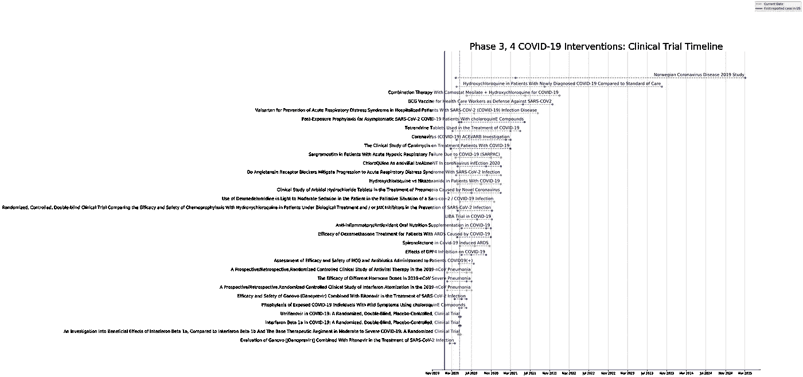
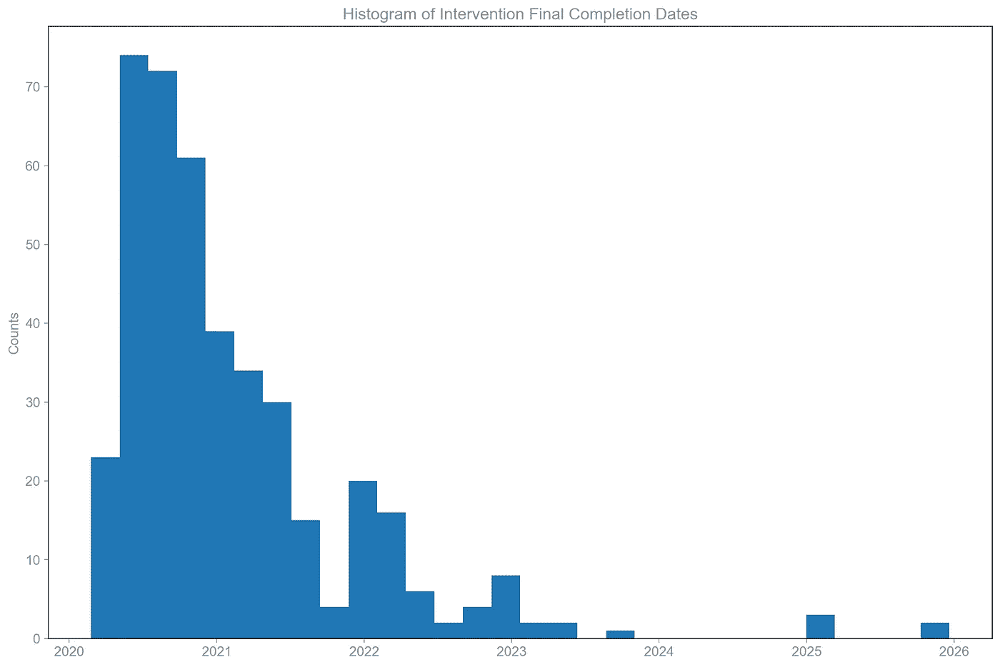
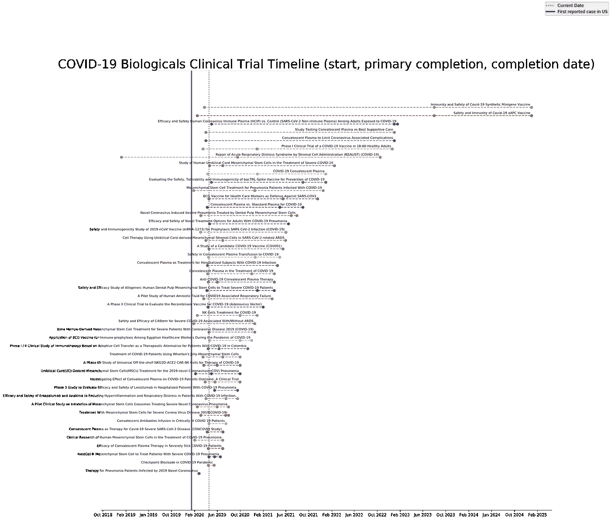

# 新冠肺炎疫苗和治疗时间表

> 原文：<https://towardsdatascience.com/covid-19-vaccine-treatment-timeline-9051a1b71863?source=collection_archive---------34----------------------->

第 3、4 期新冠肺炎干预临床试验时间表。数据来自 ClinicalTrials.gov。

## 可视化所有新冠肺炎介入临床研究的完整时间表。

什么时候事情会最终恢复正常？我们都见过许多模拟“拉平曲线”的模型和新冠肺炎的投影。现在让我们来看一个预示新冠肺炎末日的模型。在这篇文章中，我们将介绍新冠肺炎目前的干预措施，包括治疗和疫苗。我们将在一个全面的时间表中很好地将这些放在一起。最后，我们将简要探讨目前临床试验中的治疗方法的相似之处。

从美国国立卫生研究院(NIH)的临床试验网站上，我们可以看到数百个正在进行的与治疗新冠肺炎相关的临床试验。我们想特别关注介入性临床试验。介入性研究包括疫苗、药物和疗法。从这些干预性研究中，我们希望将重点放在最近的研究上，并将有一个合理的最终完成日期，所以让我们专注于 2019 年至 2025 年之间的研究。

从 NIH 临床试验网站上，我们正在寻找的相关数据包括研究的标题、干预的类型、干预的组成部分以及干预的预计完成日期。首先，让我们看看什么类型的干预措施目前正在试验中！这第一个饼图显示了不同类型的新冠肺炎干预，从药物到生物制剂到诊断(等等)。

临床试验中新冠肺炎的干预类别。符合该类别的病历报告数量显示在饼图中。“其他”被列为 ClinicalTrials.gov 的一个类别。数据来自 ClinicalTrials.gov。

很明显，大多数临床试验是针对药物和生物制剂的。很好！这意味着有许多临床试验在寻找疫苗或治疗方法。

现在的问题是在这些干预措施中使用了什么成分。我们能否发现一个统一的趋势，并对哪些药物可能成功对抗新冠肺炎做出推论？

要回答这个问题，每个临床试验都必须列出方案中描述的干预措施的组成部分。使用一系列自动请求来获取相关的组件信息。这些成分然后被浓缩和匹配，并且在下面，我们使用一个饼图来显示在至少 3 次试验中包含的成分。

临床试验中新冠肺炎治疗的干预成分。符合该类别的病历报告数量显示在饼图中。数据来自 ClinicalTrials.gov。

似乎目前大多数治疗都着眼于羟氯喹和洛匹那韦-利托那韦。专利药物，如 Gilead 的 Remdesivir，出现的次数不多，因此没有在可视化中列出。值得一提的是，这种可视化包括仅仅评估这些药物安全性的研究(不仅仅局限于 3、4 期)。尽管如此，在作品中看到不同类型的治疗还是很有趣的。

酷！羟氯喹和其他药物的疗效将在许多临床试验中进行严格评估。现在我们会问，这些药物多快能上市？

要回答这个问题，每个临床试验必须包含其研究开始日期、主要完成日期和研究完成日期。研究开始日期是指研究正式开始的日期。主要完成是指研究人员估计他们可以做出主要结果结论的日期(即这种治疗安全吗？这种治疗有效吗？)而研究完成日期是指研究人员估计他们可以做出主要、次要和不利结论的日期(即这种治疗有效吗？这种治疗会造成长期的不良影响吗？).临床试验有 4 个阶段，后期阶段(3，4)测试干预的临床效果。下面，我们将主要关注 3 期和 4 期临床试验。

# 3-4 期干预的临床试验时间表

第 3、4 期新冠肺炎干预临床试验时间表。将鼠标悬停在各点上，查看相应的研究。数据来自 ClinicalTrials.gov。

该图中绘制的信息与顶部第一个图中绘制的数据相同。它是专门针对 3 期和 4 期临床试验的，因为它们是部署准备最充分的。这一总体数字(不受阶段限制)也在下面的补充部分以互动形式呈现。

从 2020 年 2 月 1 日开始到 2020 年 4 月 18 日结束的鲑鱼色阴影框代表了第一次广泛注意到新冠肺炎和这一可视化的(当前)日期。3 个气泡(有时 2 个)代表研究开始日期、主要完成日期(如果包括)和研究完成日期。大多数研究都是在这个范围内开始的。

在这个跟踪器中，我们可以专门跟踪临床试验的阶段，以及跟踪它们的预计结束日期。我们可以在下面的柱状图中看到这些最终研究完成日期的分布。

新冠肺炎干预研究完成日期柱状图。数据来自 ClinicalTrials.gov。

该直方图显示了与新冠肺炎相关的所有介入性临床试验的预计最终研究完成日期。似乎大多数审判将在 2020 年末和 2021 年初结束。很有可能，我们可以期待一种安全有效的疫苗在 2021 年的某个时候向公众提供。

# 结论

在我们拥有安全、方便、有效的疫苗和治疗方法之前，我们应该期待社会距离仍然是常态。根据相关 3 期和 4 期临床试验的完成日期，这可能会在 2021 年初的某个时候发生。特别是因为我们都试图在这个时候拉平曲线，在疫苗出来之前过早地开放这个国家将对公共卫生产生重大影响。请记住这一点:目前还没有治愈或预防新冠肺炎的方法。尽管临床试验管道中的新干预措施看起来很有希望，例如 Moderna 的新型 mRNA 方法和 Gilead 的 Remdesivir，但这些公司都不会在今年晚些时候结束临床研究。现在，我们比以往任何时候都更需要维护强有力的社区标准，照顾那些受病毒影响最严重的人，并记住这一切都会过去的。正是在这些不确定的时期，我们作为一个社区的纽带受到了考验，我们将比以前更加强大。

在此之前，我们将继续关注这些治疗的进展！

# 补充材料和方法

生物制品干预临床试验时间表。数据来自 ClinicalTrials.gov。

**互动版第 3、4 期干预措施:**【https://plotly.com/~nathan2wong/28/#/ 

【所有干预的互动版:[https://plotly.com/~nathan2wong/7/#/](https://plotly.com/~nathan2wong/7/#/)

**仅生物制品互动版(更多疫苗)**:[https://plotly.com/~nathan2wong/5/](https://plotly.com/~nathan2wong/5/#/)

## **方法:**

*   API 请求获取所有临床试验数据的 XML，使用嵌套循环获取具体的试验信息，包括干预和完成日期。
*   将响应格式化为 JSON，用 BeautifulSoup、Regex、Datetime 和其他过程解析响应。
*   熊猫保存不同临床试验的记录。
*   可视化与 Matplotlib，Seaborn，Plotly。

**接下来的步骤**

*   对世卫组织临床试验数据库执行相同的可视化。
*   每天刷新以获取更新
*   跟踪单个临床研究的进展

**数据**:[https://clinicaltrials.gov](https://clinicaltrials.gov)

可根据要求提供代码。请将所有信件寄至:berkeley.edu 的 nathanwong。

***编者按:*** [*走向数据科学*](http://towardsdatascience.com/) *是一份以数据科学和机器学习研究为主的中型刊物。我们不是健康专家或流行病学家，本文的观点不应被解释为专业建议。想了解更多关于疫情冠状病毒的信息，可以点击* [*这里*](https://www.who.int/emergencies/diseases/novel-coronavirus-2019/situation-reports) *。*

***最后更新****:2020 年 4 月 18 日。*