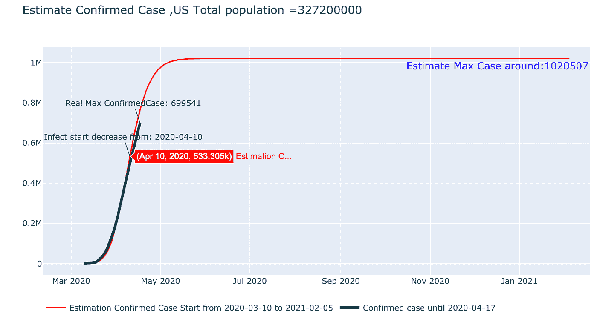
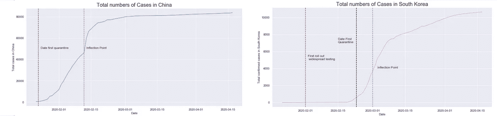
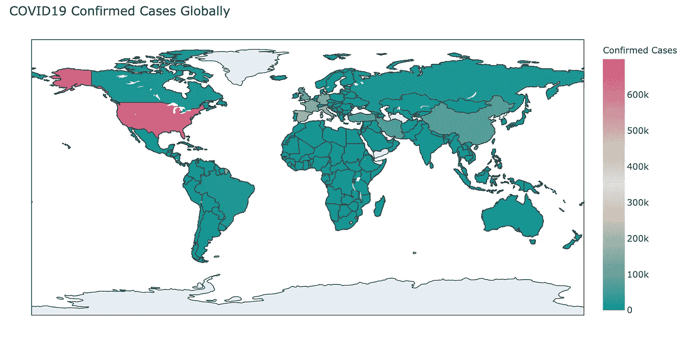
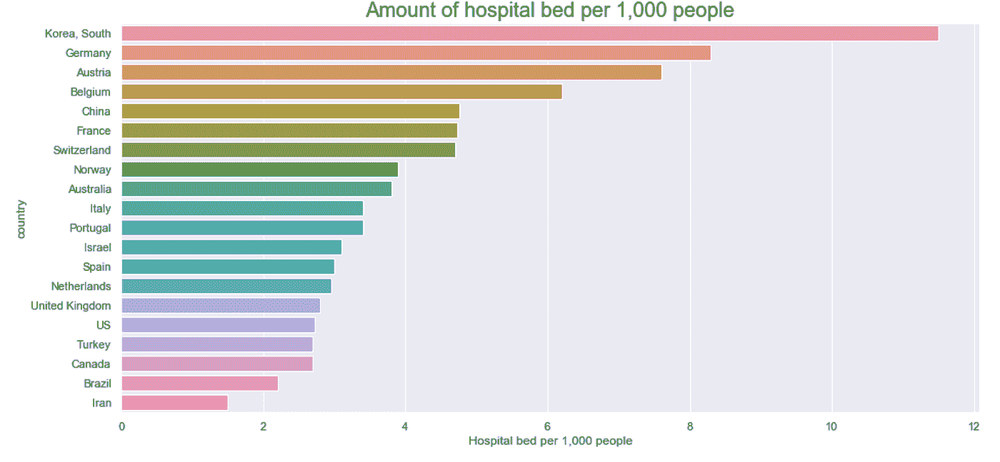
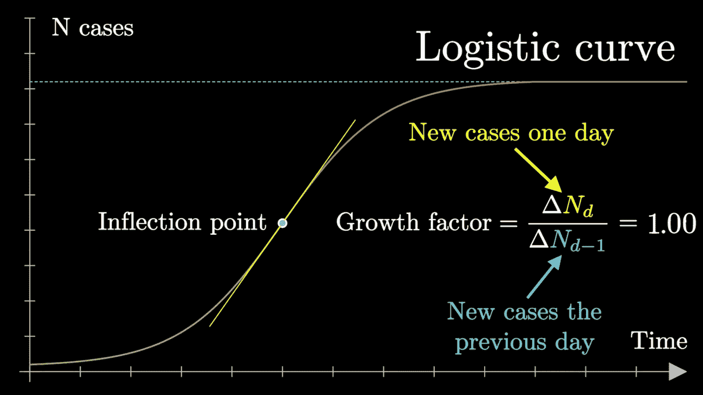
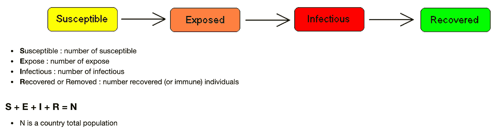
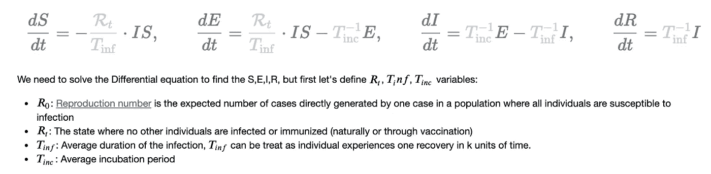
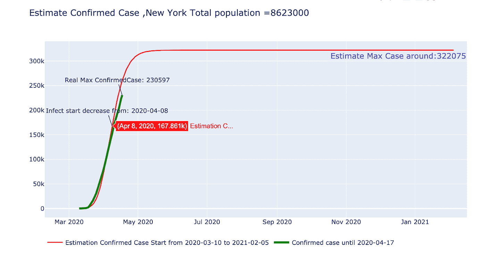
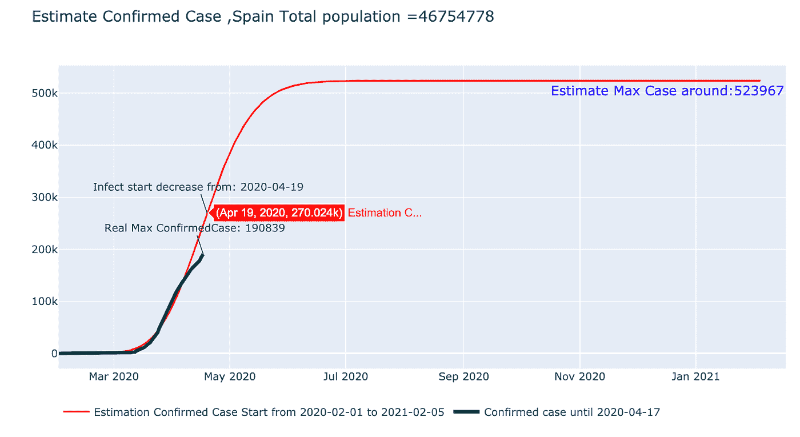
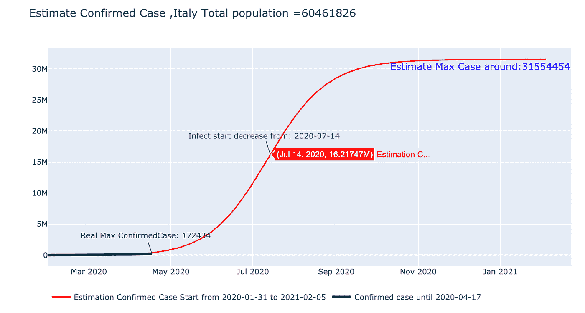

# 新冠肺炎:我们对非药物干预了解多少？

> 原文：<https://towardsdatascience.com/covid-19-what-do-we-know-about-non-pharmaceutical-interventions-ba5c9f4150bb?source=collection_archive---------62----------------------->

来源:Giang (GiGi) Nguyen。详细分析可以在我的 [Github Repo](https://github.com/giginghn/covid19-non-pharmaceutical) 或者 [Kaggle 笔记本](https://www.kaggle.com/giginghn/covid19-analysis-seir-model)上找到

上面的预测是由 **SEIR 模型**产生的，该模型估计，鉴于**干预**，新冠肺炎感染从 4 月 10 日开始下降，并可能在美国超过 100 万确诊病例时达到峰值。该模型将在本文稍后详细讨论。

***免责声明*** *:本分析的目标是提供有关新冠肺炎传播的数据信息。建议基于我的数据探索和个人观点。因此，预测仅作为参考，不应作为未来事件的最终验证。* ***关于新冠肺炎的任何健康相关问题都应咨询您的医生和医疗保健提供者。***

通过早期的《接触者追踪、广泛检测和隔离法》,韩国在实施后 1 个月内就将传播率控制在了医疗保健能力之下。该病例与中国有相似的模式，中国在早期通过全面封锁武汉抑制了疫情的增长，当时每天约有 100 多例确诊的新病例。

来源:Giang (GiGi) Nguyen。详细分析可以在我的 [Github Repo](https://github.com/giginghn/covid19-non-pharmaceutical) 或者 [Kaggle 笔记本](https://www.kaggle.com/giginghn/covid19-analysis-seir-model)上找到

尽管一些国家的形势已经稳定，但其他国家的形势仍在上升。在缺乏新型冠状病毒疫苗的情况下，我们正试图利用其他非药物因素来抑制病毒的传播，并将其保持在医疗保健能力之下。

在这篇文章中，我将评估 3 个主要话题:

*   关于传播、潜伏期和环境稳定性，我们知道些什么？例:各地区气温、湿度、风速数据。
*   我们对新冠肺炎风险因素了解多少？例如:一个国家吸烟人口的百分比或病人的重症监护室床位数。
*   **我们对非药物干预了解多少？隔离、取消大型集会、大范围检测、追踪接触者等。**

# 背景

为了加入抗击新冠肺炎的行列，我参加了由 Kaggle 发起的为期 4 周的新冠肺炎预测挑战。

虽然挑战包括预测确诊病例和死亡人数，但主要目标不仅仅是做出准确的预测。在这个项目中，我的首要任务是确定似乎影响新冠肺炎病毒传播率的关键因素，这些因素最终可以作为参考，帮助医疗和政府机构做好准备，并随着疫情的发展做出调整。

# 数据

约翰·霍普金斯大学系统科学与工程中心(JHU·CSSE)提供并每天更新 Kaggle 竞赛数据。train 数据包含 1 月 21 日至 4 月 17 日全球 184 个国家的新冠肺炎确诊病例和死亡病例的累计数。出于预测目的，可从 4 月 2 日至 5 月 14 日获取测试数据。

除了原始数据集，我还利用了来自不同 Kagglers 贡献的多个开源数据，包括但不限于天气、人口统计、干预和关于疫情的测试数据集。

# 分析

来源:Giang (GiGi) Nguyen。详细分析可以在我的 [Github 回购](https://github.com/giginghn/covid19-non-pharmaceutical)或者 [Kaggle 笔记本](https://www.kaggle.com/giginghn/covid19-analysis-seir-model)上找到

目前，全球约有 250 万感染病例，其中 32%主要在美国

# 天气

*下面是一个互动图表。随意点击“播放”或拖动时间线栏，查看感染病例的数量如何随着湿度水平的变化而变化。*

来源:Giang (GiGi) Nguyen。详细分析可以在我的 [Github Repo](https://github.com/giginghn/covid19-non-pharmaceutical) 或者 [Kaggle 笔记本](https://www.kaggle.com/giginghn/covid19-analysis-seir-model)上找到

***注*** *:颜色代表湿度水平，圆圈大小显示新冠肺炎病例数。*

天气有不同的组成部分:温度(华氏)、风速、降水、气压、湿度和日照时间(每个地区太阳照射地球表面的持续时间)。应用多元线性回归模型，我想了解哪些变量与病毒的传播率显著相关。

我的初步发现表明，温度、风速和湿度与全球感染病例数显著相关。特别是，当湿度增加时，确诊病例的数量会减少，而温度和风速则显示出相反的结果。

然而，效果因地区而异。以西班牙为例:虽然湿度似乎没有显著影响(p > 0.05)，但较高的温度与新冠肺炎病例的下降密切相关。当风速与感染病例的减少显著相关时，美国也是一个特例。

虽然我们了解天气因素与病毒传播之间的相关性，但这些变量在相隔几英里的情况下可能非常多样。因此，调查其他潜在因素至关重要。

# 人口统计和风险因素

来源:Giang (GiGi) Nguyen。详细分析可以在我的 [Github Repo](https://github.com/giginghn/covid19-non-pharmaceutical) 或者 [Kaggle 笔记本](https://www.kaggle.com/giginghn/covid19-analysis-seir-model)上找到

韩国和德国是每千人 ICU 床位数最高的两个国家之一。因此，与确诊病例数量相当的同行相比，他们的死亡率最低(2-3%)。

在分析之前，我假设有足够数量的 ICU(重症监护病房)床位，我们可以挽救更多情况危急的新冠肺炎患者。结果证实了我的假设。

> **当我们增加 ICU 病床数量时，死亡人数在统计学上显著下降。**

为了检验人口统计学和风险因素与冠状病毒致死病例之间的相关性，我再次应用了多线性回归模型。**当我们增加 ICU 病床数量时，死亡人数有统计学意义上的显著下降** (p < 0.05)。相反，一个国家的中位年龄越高，致命风险的趋势越高。该模型反映了现实生活中的情况，因为意大利是中位年龄最高的国家之一(~45 岁)，并且该国迄今为止冠状病毒死亡率最高(~13%)。

而吸烟或有潜在健康问题(肺癌等)的人口数量。)未显示死亡率的统计显著结果，应进行进一步的科学调查。

> 广泛的检测显示对抑制新冠肺炎的传播有显著的积极影响。

此外，广泛的检测显示对抑制新冠肺炎的传播有显著的积极影响，因为检测次数的激增与传播次数密切相关。如果我们能够扩大家庭检测试剂盒的规模，让更多的家庭可以使用，更多的人可以在家里立即进行分类，降低传染的风险，并最终成为更准确的接触者追踪的基础。证明这一点的最佳案例是韩国，该国在第一天就引入了广泛的测试。

城市人口密度也被发现显著影响新冠肺炎传播。城市越拥挤，确诊病例越多。这确实反映了美国人口众多的州(纽约、马萨诸塞州、加利福尼亚州等)的情况。)报告的冠状病毒病例最多。

虽然我们理解足够数量的 ICU 病床、呼吸机和个人防护设备的积极影响将挽救更多新冠肺炎患者的生命，但我们迫切需要评估非药物干预在抑制传播率方面的潜在作用。

# 非药物干预

如果我们仔细观察中国和韩国在一段时间内的感染病例，它们实际上遵循逻辑曲线。尽管传输速率呈指数增长，但是，在某个被称为拐点(传播的中点)的点上，传输速率会减慢。

来源: [3Blue1Brown](https://youtu.be/Kas0tIxDvrg?t=339) 通过 Youtube

在这篇文章中，我不会详细讨论逻辑曲线背后的数学原理，但基本上，我会计算疫情的**增长因子**，以深入了解哪些国家可能已经到达拐点。增长因子可以通过**第 N** 天的病例数变化与 **(N-1)** 天的病例数变化之比来计算。例如，如果一个国家的增长因子**稳定在 1.00** 左右，那么这可能是该国已经到达拐点的迹象。

这让我们想到了流行病学中的[房室模型之一](https://en.wikipedia.org/wiki/Compartmental_models_in_epidemiology#The_SEIR_model)——SEIR 模型，代表易感+暴露+传染性+康复:

来源:维基百科 [SEIR 模型](https://en.wikipedia.org/wiki/Compartmental_models_in_epidemiology#The_SEIR_model)

对于 2003 年爆发的 SARS，患者只需 2-7 天就能出现症状。这就是我们能够更快采取行动抑制疾病传播的原因。然而，这种新型冠状病毒需要长达 14 天的时间才能出现明显的症状——这是一颗定时炸弹，后果要严重得多。

在 SEIR 模型中，这段时间被称为潜伏期。基本上，它是指个体已经被感染，但他们自己还没有传染性的这段时间。这发生在隔间 **E** (对于**暴露**)。

以下是该模型的细分:

来源:[流行病计算器](http://gabgoh.github.io/COVID/index.html)作者 [Gabriel Goh](http://gabgoh.github.io/)

在求解模型之前，我将假设有一些**干预**会导致再生数(R0)减少(*，如更多的 ICU 床位、呼吸机或隔离、广泛检测、接触者追踪、疫苗等。*)。

出于分析的目的，干预期被设置为 60 天，预测期是从训练日(4 月 17 日)起提前 300 天进行预测。注意，这些时间点是我的假设；因此，它们不是固定的，而是可以被灵活地修改以检查不同的场景。

在求解上述微分方程后，我们将对每个国家拟合 SEIR 模型，以预测感染率，在那里感染率将达到拐点和平台。*(特别感谢* [*潘善品*](https://www.kaggle.com/super13579) *为本代码奠定基础)*

让我们先来看看美国受影响最大的州——纽约州:

来源:Giang (GiGi) Nguyen。详细分析可以在我的 [Github 回购](https://github.com/giginghn/covid19-non-pharmaceutical)或者 [Kaggle 笔记本](https://www.kaggle.com/giginghn/covid19-analysis-seir-model)上找到

来源:Giang (GiGi) Nguyen。详细分析可以在我的 [Github Repo](https://github.com/giginghn/covid19-non-pharmaceutical) 或者 [Kaggle 笔记本](https://www.kaggle.com/giginghn/covid19-analysis-seir-model)上找到

好消息！我的模型预测，美国已经在 4 月 10 日左右达到拐点，并将很快持平。

来源:Giang (GiGi) Nguyen。详细分析可以在我的 [Github Repo](https://github.com/giginghn/covid19-non-pharmaceutical) 或者 [Kaggle 笔记本](https://www.kaggle.com/giginghn/covid19-analysis-seir-model)上找到

西班牙的模式与此类似，预计将在 4 月 19 日达到反射点，并在变得更加稳定之前达到最多约 50 万+感染病例。

来源:Giang (GiGi) Nguyen。详细分析可以在我的 [Github Repo](https://github.com/giginghn/covid19-non-pharmaceutical) 或者 [Kaggle 笔记本](https://www.kaggle.com/giginghn/covid19-analysis-seir-model)上找到

然而，意大利预计要到 7 月 14 日才会达到拐点，这距离现在还有 3 个月。这可能是因为它们的生长因子每天都呈指数增长。

除了 SEIR 模型，我还尝试了随机森林和贝叶斯岭模型对天气和人口数据进行预测。然而，首要目标同样不仅仅是准确的预报，而是确定新冠肺炎传播的关键指标，这些指标最终可以作为抑制疫情的参考。

# 结束语

在#AtHome 自我隔离期间学习新东西(流行病学的分室模型、疫情的指标等)是一次非常有益的经历。)，在与我以前所做的完全不同的领域进行分析，并(潜在地)提供一些有意义的见解，以帮助我们共同抗击疫情。

> 总之，我希望你保持安全和健康，洗手，戴口罩和#StayHome 来帮助我们在前线的医疗英雄！

来源: [Siouxsie Wiles](https://thespinoff.co.nz/society/09-03-2020/the-three-phases-of-covid-19-and-how-we-can-make-it-manageable/) 通过分拆

**链接到我的 Github Repo**

 [## giging HN/covid 19-非药物

### 白宫科技政策办公室(OSTP)召集了一个联合研究小组和…

github.com](https://github.com/giginghn/covid19-non-pharmaceutical/blob/master/README.md) 

**进一步阅读**

*   [脸书&卡耐基梅隆大学新冠肺炎症状地图](https://covid-survey.dataforgood.fb.com/)
*   [冠状病毒(新冠肺炎)对步行交通的影响](https://www.safegraph.com/dashboard/covid19-commerce-patterns?is=5e7a66538dd3816c985d8fc7)
*   [冠状病毒:为什么你必须立即行动](https://medium.com/@tomaspueyo/coronavirus-act-today-or-people-will-die-f4d3d9cd99ca)
*   [冠状病毒:锤子与舞蹈](https://medium.com/@tomaspueyo/coronavirus-the-hammer-and-the-dance-be9337092b56)
*   [与韩国拉平曲线](https://www.nytimes.com/2020/03/23/world/asia/coronavirus-south-korea-flatten-curve.html)