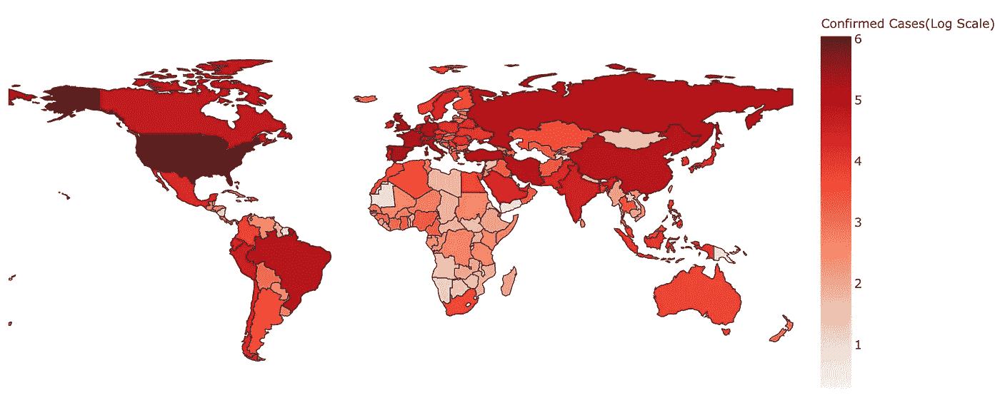
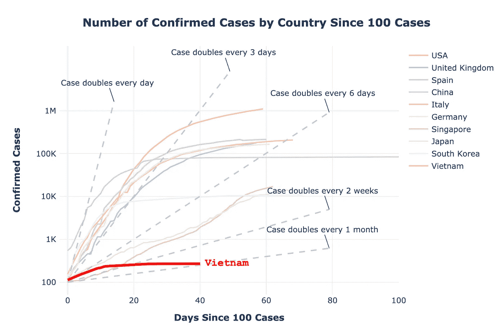
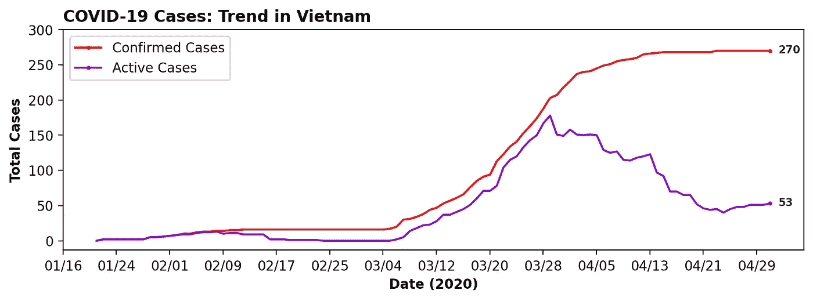
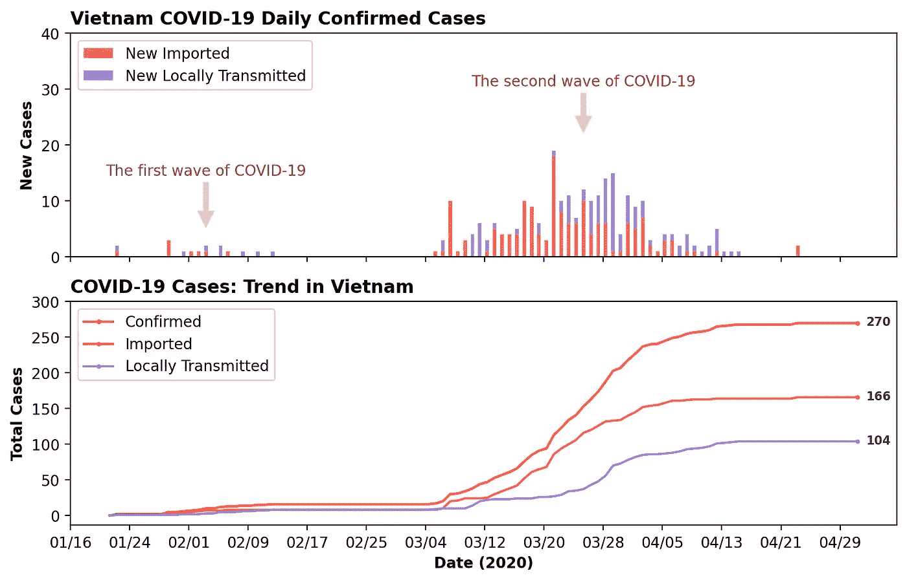
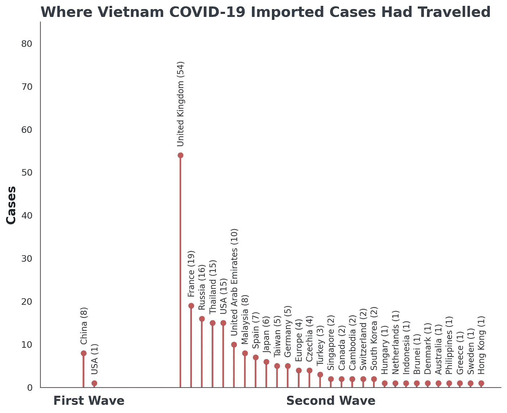
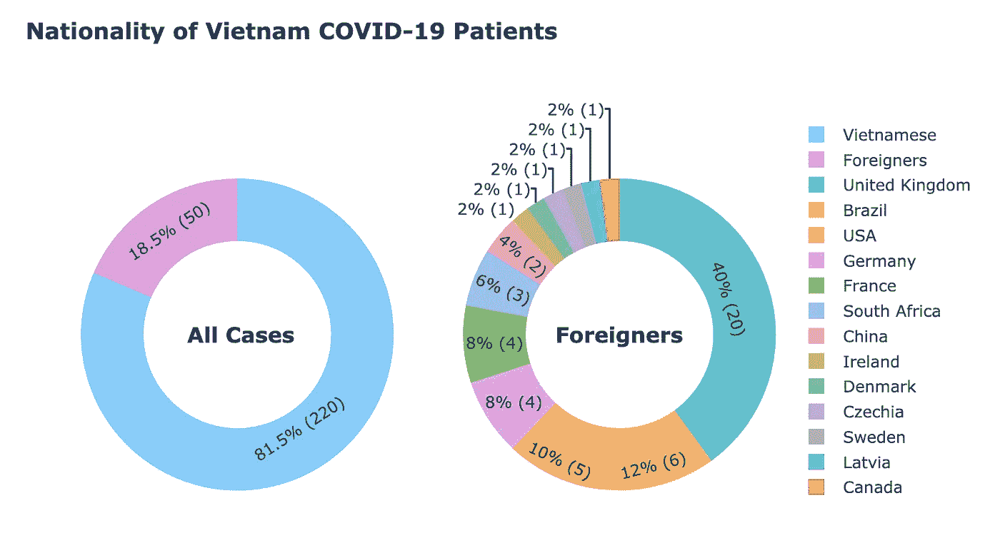
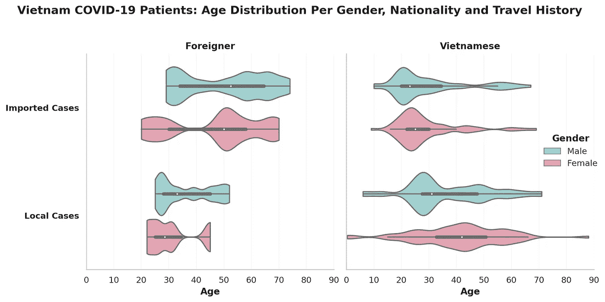
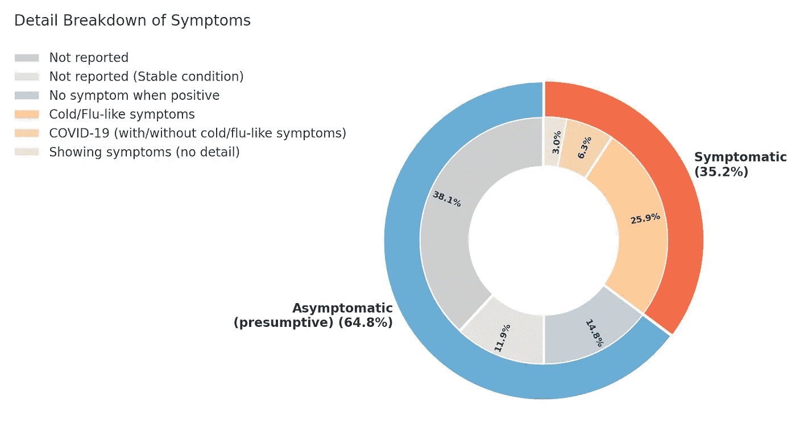
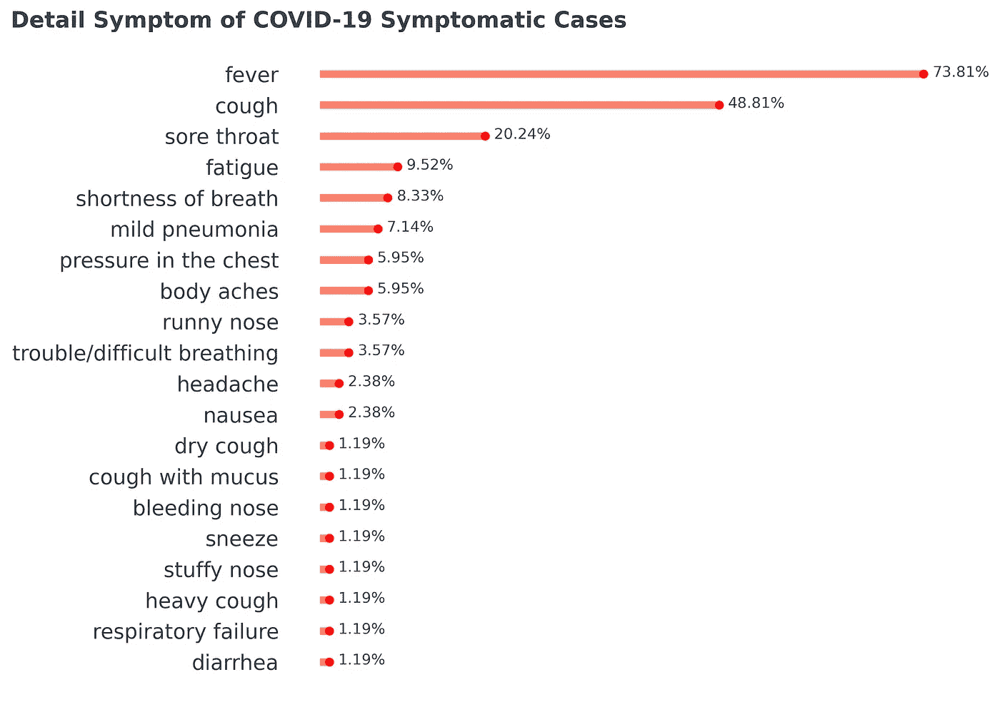
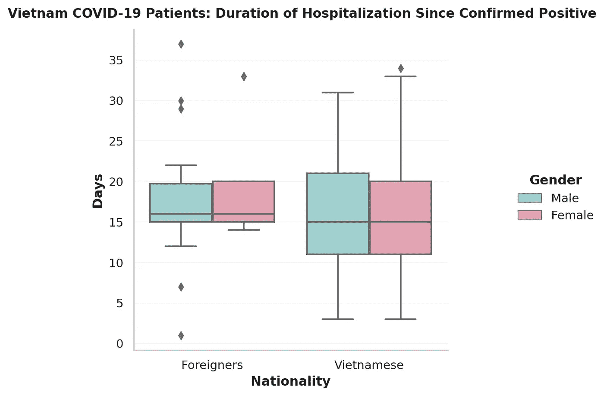

# 新冠肺炎-我们对越南的情况了解多少？

> 原文：<https://towardsdatascience.com/covid-19-what-do-we-know-about-the-situation-in-vietnam-82c195163d7e?source=collection_archive---------15----------------------->

## 深入研究越战新冠肺炎患者数据

***编者按:*** [*走向数据科学*](http://towardsdatascience.com/) *是一份以数据科学和机器学习研究为主的中型刊物。我们不是健康专家或流行病学家，本文的观点不应被解释为专业建议。想了解更多关于疫情冠状病毒的信息，可以点击* [*这里*](https://www.who.int/emergencies/diseases/novel-coronavirus-2019/situation-reports) *。*

根据约翰霍普金斯大学的数据，目前全球已有超过 340 万例新冠肺炎确诊病例，至少 239622 人死亡，分布在 212 个国家和地区(2020 年 5 月 2 日更新)。

**图一。新冠肺炎确诊病例在各个国家和地区的分布。**资料来源:Tran Nguyen。详细分析可以在我的 [Kaggle 笔记本](https://www.kaggle.com/nhntran/covid-19-the-world-data-eda-and-visualization?scriptVersionId=33127742)或者[我的 Github](https://github.com/nhntran/vietnam_covid19_patients) 上找到。

确诊病例和死亡人数呈指数上升，在许多国家达到了严峻的里程碑。与此同时，越南目前总共只有**270 例新冠肺炎确诊病例**，无**死亡病例**。现在，越南已经连续 16 天没有本地传播的新病例，连续 8 天没有新病例。这给我们留下了许多问题要问。

越南发生了什么？

*   越南官员报告的新冠肺炎病例数是否被低估了？测试在越南进行得好吗？
*   越南政府是否隐瞒了当地新冠肺炎疫情的范围？如果不是，那么在如此“真实”的低病例数和无死亡的情况下，越南是如何控制病毒的？
*   我们对越战新冠肺炎患者了解多少？这些病人有什么特征可以帮助降低越南的感染率吗？

作为一名具有分子生物学和生物信息学背景的数据分析师，我过去也在 PCR/qPCR(用于新冠肺炎的标准检测方法)方面做了很多工作(实验)，自从世卫组织宣布 2019 年 12 月武汉爆发一小批未知肺炎以来，我就对新冠肺炎感兴趣。当疫情沿着自己的路线跨越国界时，我对许多主题的兴趣越来越大:测试(测试，以及更多的测试)、早期测试和接触者追踪、流行病监测、新型冠状病毒基因组、患者症状、疫苗开发等。我住在湾区(美国加利福尼亚州)，经常在清晨阅读/观看世界各地的冠状病毒实时更新/简报，因此我非常熟悉新冠肺炎的情况和许多国家为控制疫情而采取的措施。越南的低病例数给我们大家提出了许多问题。因此，我决定收集数据，并利用互联网上所有可用的信息进行独立研究。

具有讽刺意味的是，越南医疗保健系统的一个重要特点是隐私法不像美国、加拿大或欧洲那样严格。因此，越南的新冠肺炎患者数据是公开的。在某些情况下，他们的地址、姓名、个人联系方式、日常活动和习惯(例如，在市场上的哪个商店买东西)都是细节。

在本文的其余部分，我将向您展示越南新冠肺炎患者数据集，并逐步回答上面的一些问题。(测试和接触者追踪——隔离值得拥有自己的注释，即将推出)。

**免责声明 **

*   *这是我的个人作品，与任何机构都没有关系。虽然这个分析是数据驱动的，但我的评论反映了我的个人观点。*
*   *我的结果基于从越南卫生部网站和越南主流媒体收集的数据。这些数据可能有偏差，反映的是互联网上公开的信息。然而，对于那些对越南新冠肺炎疫情感兴趣的人来说，它可以作为一个很好的参考。(老实说，到目前为止，我对任何有关越战新冠肺炎·疫情的报道的范围都不满意，所以我决定自己做一个)。*

***数据***

*   **越南数据**通过网络删节获得，人工整理自[越南卫生部网站](https://ncov.moh.gov.vn/)和越南其他主流媒体。
*   **世界数据**从由约翰·霍普金斯大学系统科学与工程中心(JHU·CSSE)运营的[2019 新型冠状病毒视觉仪表板](https://github.com/CSSEGISandData/COVID-19)的数据仓库中获得。
*   [越南新冠肺炎患者数据集](https://www.kaggle.com/nhntran/vietnam-covid19-patient-dataset)，以及我在 Kaggle 笔记本上的完整报告([新冠肺炎:越南数据](https://www.kaggle.com/nhntran/covid-19-vietnam-data-eda-and-visualization)和[新冠肺炎:世界数据](https://www.kaggle.com/nhntran/covid-19-the-world-data-eda-and-visualization/))都可以从这些网站获得并下载。

# 我们学到了什么？

## **1。新冠肺炎疫情在越南的增长速度比大多数国家都慢，到目前为止还没有死亡病例。**

**图二。新冠肺炎确诊病例在一些国家的增长速度有多快** (Y 轴是对数刻度，但为了便于解释，标签保持为实数(100-100 万例))。与其他国家相比，越南的新冠肺炎确诊病例数量一直较低。来源:Tran Nguyen。详细分析可以在[我的 Kaggle 笔记本上找到。](https://www.kaggle.com/nhntran/covid-19-the-world-data-eda-and-visualization?scriptVersionId=33127742)

越南与中国接壤，于 2020 年 1 月 23 日**报告了首例新冠肺炎确诊病例，与韩国(1 月 20 日)、美国(1 月 21 日)、英国(1 月 31 日)几乎同时。从那时起，每个国家都有自己的控制疫情的具体策略。大多数国家现在已经从遏制范式(早期追踪、隔离传染源)转向严重缓解范式(减少传播的策略)。[虽然失去了一些 F0 病例](https://medium.com/@tranhnnguyenvn/a-full-picture-of-vietnam-covid-19-patients-496f7ccad3ea)，但越南仍然安全地保持在遏制阶段。**

随着活跃病例(目前住院的新冠肺炎患者)数量显著减少，曲线变得平缓(图 3)。请注意，在越南，所有的新冠肺炎患者，包括无症状的病例，都住院了。相比之下，在美国，无症状病例或症状轻微的人被建议呆在家里，除非接受医疗护理。

**图 3。越南新冠肺炎确诊病例的增长速度有多快。**活跃病例包括无症状患者和“再感染”病例。

在整个疫情期间，每日病例数一直保持在个位数的低水平，在高峰期，每日病例数低于 20 例(见图 4 中的每日病例图)。

**图四。越南新冠肺炎疫情可以用两个不同的波来描述:**第一波(2020 年 1 月 23 日至 2 月 16 日)和第二波(2020 年 3 月 6 日至 4 月下旬)。在每日的新新冠肺炎病例中，输入性病例的数量仍然占主导地位。

有趣的是，新冠肺炎输入和本地传播病例的增长率有相同的趋势，这两者加起来就是总确诊病例。此外，输入病例的数量仍然大于本地传播病例。**这一趋势表明，随着时间的推移，越南一直能够控制疫情:本地病例从未超过输入病例。**

## 2.越南从欧洲和美国获得的新冠肺炎输入病例多于从中国获得的病例

> 注意:疾病无国界，这种新型冠状病毒也是如此。因此，这种分析是模棱两可的，只能作为参考意见。

越南的新冠肺炎疫情可以用两种不同的波浪来描述。(越南新冠肺炎疫情的全貌，包括确诊病例、时间表、患者概况、传染源、主要感染群等。可在[本笔记](https://medium.com/@tranhnnguyenvn/a-full-picture-of-vietnam-covid-19-patients-496f7ccad3ea)中找到。

*   第一波来自中国的输入病例最多。唯一从美国输入的病例(如图所示)来自患者 BN7。该患者可能是来自中国的传播病例，因为该病例报告得非常早(2020 年 2 月 2 日)，并且该患者在从美国到越南的途中确实在中国武汉中转了 2 小时。
*   第二次浪潮始于许多来自欧洲(主要来自英国)的病例。

这一趋势与美国的情况非常一致([美国从欧洲获得的新冠肺炎病例多于从中国获得的病例](https://theintercept.com/2020/04/12/u-s-got-more-confirmed-index-cases-of-coronavirus-from-europe-than-from-china/)

**图 5。越南新冠肺炎输入病例的传染源。*此分析的注意事项:**国家列表可能被低估，因为一些患者可能在回到越南之前去过许多国家，但没有报告。他们也在不同的地方过境，可能在这些短暂的过境期间被感染。(例如，患者 BN7 可能是在中国武汉转机 2 小时时被感染的)。在这项分析中，包括过境国在内的所有国家都包括在内。

**有想过吗？**

*请记住，这份报告可能会有偏见，原因如下:为了对传染源有一个概括的看法，在这项分析中，包括“过境”国家在内的所有国家都包括在内。许多国家可能在传染源列表中占据主导地位，因为它们是主要的国际******旅行枢纽*** *患者中转地，如英国、俄罗斯、阿联酋等***

**在这份传染源名单中(图 5)，英国主要与 54 例确诊病例有关(占输入病例的 27%)，几乎是第二大传染源法国的 3 倍，与 19 例病例有关。这一事实背后的原因不仅仅是因为英国是繁忙的国际旅游中心之一。但是，它表明，自疫情爆发初期以来，英国新冠肺炎病例的实际数量可能要高得多。英国因其对冠状病毒的反应而受到批评。当时没有采取适当而迅速的措施:没有隔离，没有旅行禁令，……请注意，越南的大多数外国新冠肺炎患者来自英国(图 6)。**

****

****图 6。越南国籍的新冠肺炎患者****

**为什么越南从欧洲和美国获得的新冠肺炎病例比从中国获得的多？中国是一个与越南接壤的邻国，与越南有着密切的日常贸易关系。 对我们来说是个谜。其他变量，如当地天气(温度、湿度)、种族背景和基因变异、疫苗接种情况、文化和社会行为，特别是人们的意识(武汉震中是当时越南社交媒体和新闻上的热门趋势)，可能有助于减缓来自中国的病毒传播。**

## **3.越南新冠肺炎患者的年龄和性别分布大多与特定人群有关，而不是随机的，这表明疫情在很大程度上得到了控制。**

****

****图 7。越南新冠肺炎患者的年龄、性别、国籍和旅行史分布的小提琴图。*关于小提琴图的说明:**它是一个盒子图和一个核密度图的混合体。白点:中间值；中间粗灰条:四分位数范围；小提琴图的 Wider 和 skinner 部分:人口中的成员接受给定值的概率分别较高和较低。**

*****为导入案例:*****

*   **大多数越南新冠肺炎输入病例年龄在 20-30 岁之间。他们是去国外学习和培训的学生和年轻员工。更多详情，请参见[越南新冠肺炎患者数据集](https://www.kaggle.com/nhntran/vietnam-covid19-patient-dataset)中的样本行。**
*   **大多数外国患者都是老年人，男性为 50-70 岁，女性为 45-60 岁。他们很可能是退休旅行者。**

*****为本地案例:*****

**年龄趋势似乎与越南特定的感染人群有关:年轻时的外国人与佛酒吧烧烤(一家餐馆和酒吧)人群有关；大多数越南女性患者与巴赫迈医院等的食品供应公司有联系。**

**= >目前，在这个小数据集的情况下，无法判断是否有任何年龄性别的人群感染新冠肺炎病毒的风险更高。当所有病例似乎都与特定的聚集性和旅行团体有关时，越南的疫情似乎在很大程度上得到了控制。**

## **4.接近 65%的越南新冠肺炎患者在确诊为病毒阳性时无症状:**

> **如果越南没有早期检测和检疫，情况可能会更糟。**

****

****图 8。270 名越南新冠肺炎患者病毒检测呈阳性时的症状。**值得注意的是，大约 65%的病例是**无症状**(显示无症状)。注意，为了更谨慎起见，这里的无症状病例称为推定(原因可在本报告末尾找到)。来源:Tran Nguyen。详细分析可以在[我的 Kaggle 笔记本](https://www.kaggle.com/nhntran/covid-19-vietnam-data-eda-and-visualization)或者[我的 Github](https://github.com/nhntran/vietnam_covid19_patients) 上找到。**

**在所有 270 例越南新冠肺炎确诊病例中，只有 35.2%的患者在病毒检测呈阳性之前或之后出现症状。**值得注意的是，只有 6.3%的病例报告了******(气短/胸闷/轻度肺炎/呼吸衰竭)。**大多数有症状的患者报告了轻微的感冒/流感样症状(如发烧、咳嗽、喉咙痛、疲劳等)。) (占全部病例的 25.4%)。****

****在有症状的患者中，常见的症状包括发烧、咳嗽和喉咙痛。****

********

******图九。报告了有症状患者的详细症状。在总共 270 例病例中，只有 35.2%的病例有症状。来源:Tran Nguyen。详细分析可以在[我的 Kaggle 笔记本上找到。](https://www.kaggle.com/nhntran/covid-19-vietnam-data-eda-and-visualization/data)******

****从这个结果我们可以推断出什么？****

> ****如果越南没有迅速作出反应，进行检测并早期隔离人员，这些新冠肺炎病例中的 90%以上将继续经常出现在公共场所，不知不觉地在社区中传播病毒。****

****如果越南对考试采取和其他国家一样的政策，比如美国(我目前生活在美国，最了解这种情况)，会发生什么？一场灾难:超过 90%的患者没有资格接受新冠肺炎测试。在这些患者身上检测到任何严重的新冠肺炎相关症状之前；在它们变得“足够”有资格进行测试之前；当他们徘徊在等待测试结果的时候，病毒可能已经悄悄地传播了。自第一波感染(2020 年 1 月 23 日)以来，应该会有许多“热点”。当来自欧洲的第二波感染如火如荼时(从 2020 年 3 月 6 日第 17 号患者开始)，情况将会异常严重。[(此处查看越南两次感染浪潮的更多详情)。](https://medium.com/@tranhnnguyenvn/a-full-picture-of-vietnam-covid-19-patients-496f7ccad3ea)****

## ****5.越南新冠肺炎患者(确诊后)的住院时间约为 2 周，主要是因为越南严格的出院政策。****

********

******图 10。越南新冠肺炎患者的平均住院时间。**请注意，在越南，所有新冠肺炎患者，包括无症状病例，均已住院。因此，大多数越南新冠肺炎患者病情较轻。[只有少数患者出现了更严重的并发症。](https://www.kaggle.com/nhntran/vietnam-covid19-patient-dataset)****

****越南新冠肺炎患者(大多数症状轻微)的平均住院时间约为 2 周。在一个罕见的案例中，患者 BN51 在正式出院前已经接受了 13 次检测(参见[越战新冠肺炎患者数据集](https://www.kaggle.com/nhntran/vietnam-covid19-patient-dataset)的参考和注释)。****

****与越南患者相比，外国人住院时间更长。原因可能是因为医院内的环境(食物、医疗保健中的语言障碍)、种族背景和基因变异，和/或他们的年龄组:大多数外国人是退休的旅行者，他们更容易受到病毒的影响。****

****越南卫生部网站上的新冠肺炎病例出院标准如下:****

> ****“新冠肺炎患者在 48 小时内连续两次实验室检查呈阴性，至少连续 3 天没有发烧，生命体征正常，血液检查正常，胸部 x 光检查有所改善，可以出院。出院的病人必须(在家里/旅馆)再隔离 14 天。”****

*******讨论大纲视图:*******

****1 例住院时间仅 1 天。原因可能是:****

*   ****住院时间从患者被正式确认为新冠肺炎阳性之日算起，而不是从患者住院、出现症状和/或采集样本进行检测之日算起。因此，该患者在被确认为病毒阳性之前可能已经住院。****
*   ****公布检测结果的时间可能因患者而异，取决于他们从当地实验室和国家卫生和流行病学研究所实验室进行了多少次检测/确诊检测。****

*****讨论新冠肺炎测试的详细说明即将发布。*****

## ****6.越南有 270 例新冠肺炎确诊病例，目前没有死亡病例。****

****一些住院时间长(超过 30 天)的患者表示，他们的病情更加严重。不同来源的重症患者数据并不一致(每个患者出现严重症状的时间、患者 id 等)。)所以在分析中省略了。然而，你仍然可以看一看[越南新冠肺炎数据集](https://www.kaggle.com/nhntran/vietnam-covid19-patient-dataset)。这是对它的一种理解:****

****在重症监护室(ICU)收治的少数新冠肺炎患者中，一些人被插管并康复；2 -3 例接受了 ECMO 治疗(体外膜肺氧合)和强化透析。但是**到目前为止，没有死亡**。[重症新冠肺炎患者出现好转迹象](https://vnexpress.net/benh-nhan-ncov-nang-da-qua-giai-doan-kho-khan-4092348.html)；感谢医护人员和医院的巨大努力。早期反应(病例识别、隔离、接触者追踪、隔离)有助于避免卫生保健系统的负担，从而降低发病率和死亡率。****

> ****“一个很好的经验法则是，一旦你所在的城市或城镇出现确诊的新冠肺炎死亡病例，病毒可能已经在你所在的社区存在了两周左右。”****

****这条规则可能不是一个真实的事实，但是当还没有确认新冠肺炎死亡的时候，想到越南仍然是“安全的”,这是非常令人鼓舞的。****

****越南官员一直在努力遏制病毒？请继续关注，我的媒体页面将很快提供这方面的可视化。****

# ****带回家的信息****

****凭借如此小的样本量(270 例新冠肺炎确诊病例)和公开的患者数据集**、**，我们可以更好地了解新冠肺炎患者的概况。****

****曲线已经变平；越南被誉为[“疫情中一个异常成功的故事】](https://www.washingtonpost.com/world/2020/04/30/vietnam-offers-tough-lessons-us-coronavirus/)；越南政府已经开始解除一些隔离措施和封锁。然而，整个国家需要保持警惕，保持耐心，并[“准备在需要时采取措施”](http://www.euro.who.int/en/health-topics/health-emergencies/coronavirus-covid-19/statements/statement-we-cannot-allow-the-impact-of-covid-19-to-be-amplified-by-neglecting-other-vital-health-protection-measures)。**否则，在冠状病毒疫苗和/或针对新冠肺炎的特效疗法问世之前，越南可能会失去已经取得的进展。******

*******我同题其他笔记:*******

****[越南新冠肺炎患者的全貌](https://medium.com/@tranhnnguyenvn/a-full-picture-of-vietnam-covid-19-patients-496f7ccad3ea)****

********关于无症状/有症状病例的注意事项******

*******关于健康状况数据的注意事项*** :我没有任何知情人，也没有医院的文件。患者的健康状况收集自越南卫生部网站和越南主流媒体，有 2 个显著的局限性:****

****(I)每个患者描述的症状依赖于患者及其密切接触者的记忆，而这些记忆可能是模糊的。****

****㈡健康记录不是从医院文件中正式收集的，因此这些记录可能被少报。****

****然而，我得到的数据仍然是一个很好的参考来源，原因如下:****

****(I)主流媒体似乎“渴求”信息，因此，他们报道了任何可能的信息。例如，患者 BN204 被报告没有症状，但留在同一隔离室的另一人回忆说，该患者确实打喷嚏。而这个微不足道的症状被举报了。所以主流媒体不太可能漏掉任何案例。****

****㈡许多病例没有提及患者的健康状况(我将这些病例报告为“未报告”)。其他人被报告说他们的“健康状况稳定”(被报告为“未报告(稳定状况)”，我们可以假设他们没有表现出任何症状。****

****(iii)当汇总“未报告”、“未报告(病情稳定)”和“阳性时无症状”的病例时，我们得到 64.8%，接近于[越南卫生部网站上公布的 63.33%的无症状确诊病例。](https://ncov.vncdc.gov.vn/)详细分析可以在[我的 Kaggle 笔记本](https://www.kaggle.com/nhntran/covid-19-vietnam-data-eda-and-visualization/data)或者[我的 Github](https://github.com/nhntran/vietnam_covid19_patients) 上找到。****