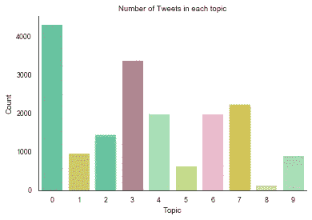
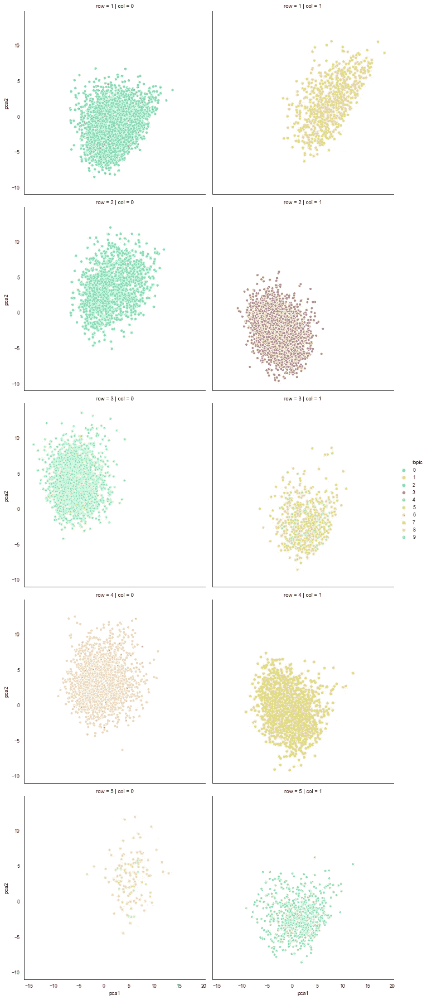
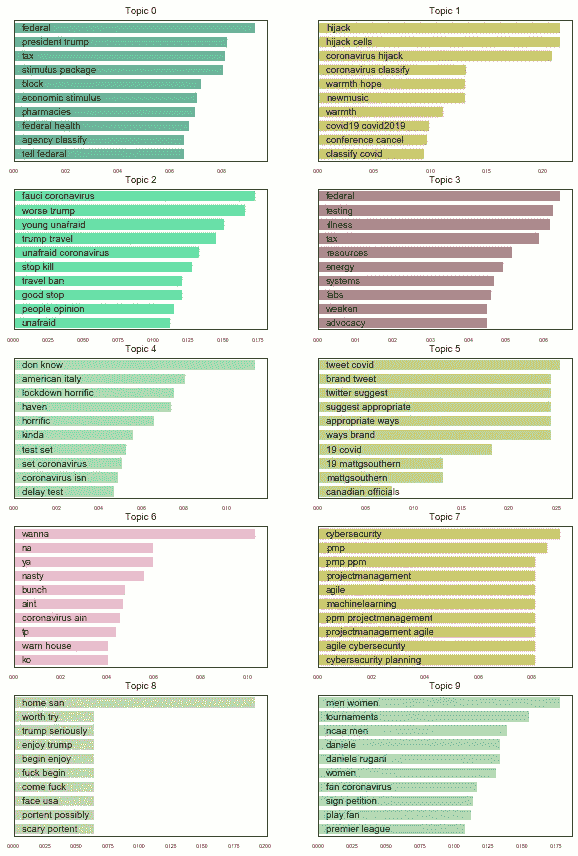
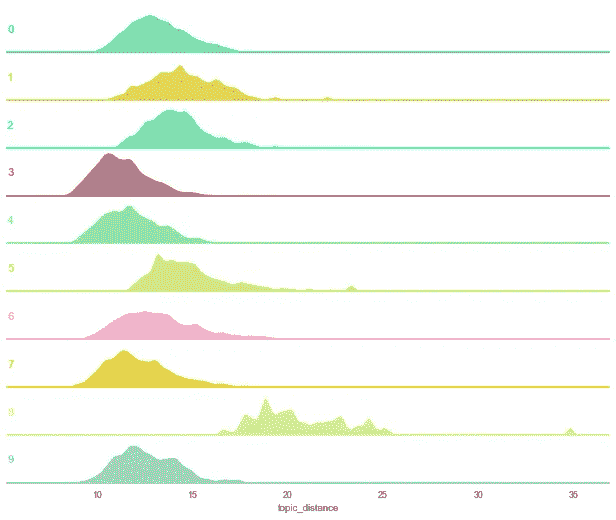
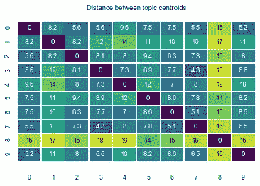

# 有天赋的新冠肺炎

> 原文：<https://towardsdatascience.com/covid-19-with-a-flair-2802a9f4c90f?source=collection_archive---------9----------------------->

## 使用 BERT 模拟冠状病毒讨论


[去飞溅](https://unsplash.com/photos/gHrEvF7Ugb4)

# 一些背景

除非你一直生活在一块足够幸运的岩石下，不在新冠肺炎广袤的疆域之内，否则你会意识到这种病毒正在席卷全球。在撰写本文时，约 [25 万病例已被确认](https://www.worldometers.info/coronavirus/)，死亡人数超过 1 万人。不鼓励群众集会，商店和餐馆关门，国家关闭边境，在家工作是强制性的，而不是特权。这是件大事。

它几乎占据了媒体的所有讨论，优先于 2020 年美国总统大选或英国最终在不到 9 个月的时间里永远离开欧盟等话题。人们在社交媒体上充斥着 COVID 信息，这只能意味着一件事:数据。等待分析的新数据。我们会分析它。

# 为什么

为什么要分析文本数据？这里想象的商业案例是什么？

在社交媒体时代，每个人都可以在一个平台上发表自己的观点，从客户那里获得直接和即时的反馈从未如此容易。因为人们在网上发表他们的意见，组织不仅有天赋，也有义务利用这一点，并从客户群发布的意见中提取可操作的见解。

然而，社交媒体数据是巨大的。*非常*辽阔。一个中等规模的组织将很难记录、理解、总结和展示他们的客户在网上发布的所有观点、抱怨和赞扬；即使他们雇佣了整个团队来做这件事。当他们可以使用*数据科学*时，他们为什么要这么做。

# 什么

我们将尝试在冠状病毒讨论的快照中揭示潜在的主题。为了更好地理解我们将如何实现这一点，让我带你踏上主题建模的历史之旅。请把你的掌声留到最后。

## 经典作品

*想象一下。现在是 2003 年。克里斯蒂亚诺罗纳尔多刚刚为曼联首次亮相，迈克刚刚在《老友记》中向菲比求婚。三位计算机科学家建议在主题建模领域使用一种之前在遗传学领域首创的算法。问题中的算法是潜在的狄利克雷分配，被称为 LDA，因为没有人能发出第二个单词。该方法使用概率方法来基于单词共现将文档分配到主题中。这是一个压倒性的成功，这个模型被羽翼未丰的 NLP 社区广泛采用。*

经典的主题建模方法，如 LDA T1 或 T2 LSA T3 已经存在了一段时间。这些是建立在文本数据的文档术语矩阵表示上的，可以以相对较低的成本非常有效地工作。然而，它们确实缺乏捕捉关于我们文本中单词的位置或顺序的任何信息的能力，也缺乏捕捉它们彼此之间有多相似的能力。

## 让我们得到向量

*你眨眨眼——现在已经是 2013 年了，但你还在看电视。在《了不起的盖茨比》中，利奥·迪卡普里奥第一次苦笑着举起了酒杯，麦莉·赛勒斯像一个灾难球一样出现了。布鲁诺·马斯在那里。与此同时，托马斯·米科洛夫(Tomas Mikolov)正在尝试使用浅层神经网络来改进谷歌搜索引擎，并发现他能够将单词映射到 N 维向量空间，该空间可以捕捉单词在数字位置上相对于彼此的意义。一个灯泡突然出现在他的头上，他发布了 word2vec 模型，并随之向世界释放了* word2word *命名法的瘟疫(参见 doc2vec，node2vec，seq2seq，graph2vec…)。*

w[order 嵌入](https://en.wikipedia.org/wiki/Word_embedding)方法是数字文本表示中的一个主要步骤。这一系列技术将语料库中的单词映射到向量空间，最常用的是使用神经网络(例如 word2vec 或 GloVe)。单词嵌入给上述概率模型带来的一个主要好处是，在训练数据中给定上下文的情况下，它们能够将单词之间的相似性表示为向量空间中的接近度；比如*猫*和*小猫*会比*猫*和*木工*彼此距离近很多。这种方法已经被广泛使用了很多年，但仍然有局限性，因为它只能将单词映射到一个单一的向量，无法捕捉同一单词在不同上下文中的不同含义。

## 变压器组装

画面又变得模糊了。当你的视线清晰时，你注意到手机上的日期是 2018 年 10 月 11 日。科罗娜对你来说只不过是一个啤酒品牌。谷歌仍在不知疲倦地努力保持他们作为*搜索引擎的地位，这一次是雅各布·德夫林来拯救他们了。他发表了一篇关于使用转换器-编码器深度学习算法进行文本预测任务的论文。他将其命名为“变形金刚的双向编码器表示”，幸运的是，它被缩写为*伯特*。效果很好。非常好。* [*没有人确定为什么*](https://www.aclweb.org/anthology/D19-1445/) *。*

BERT 不仅在许多下游 NLP 任务中击败了单词嵌入方法，而且对我们来说更重要的是，它可以在不同的上下文中为同一单词指定不同的向量表示。这对于同音异义词来说尤其重要:例如，当*我给某人我的地址*并且如果*我称呼某人*时，单词*称呼*具有完全不同的含义。

这个网站以前已经多次介绍过 BERT，但是如果你还没有遇到过它，我建议你绕道去阅读它。Jay Alammar 的博客提供了一个很好的总结，他致力于用芝麻街的角色来说明模型是令人敬畏的。一定要回来，因为接下来会很有趣。

我们现在已经看到了文本表示已经走了多远(它已经走得更远了)，所以让我们来测试一下。

我们将使用发布在冠状病毒爆发主题上的推文样本。然后，我们将使用 BERT 在向量空间中表示它们，使用它们的单词嵌入值的平均值。然后，我们可以假设，如果在向量空间中相似意思的单词彼此更接近，我们可以将附近的 Tweets 分组在一起，以找到共同话题的集群。我们的高级工作流程是:

1.  收集数据:搜索关于冠状病毒的微博
2.  **预处理数据:**执行通常的文本清理步骤
3.  **嵌入文档:**使用 BERT 找到每条推文的向量表示
4.  **降维:**使用主成分分析来降低向量的大小，同时保持方差
5.  **聚类嵌入:**应用聚类算法来查找具有相同含义的推文组
6.  评估主题:试着理解主题的内容

所有这些都是为了回答这个问题:**人们在 Twitter 上谈论的与冠状病毒有关的话题是什么？**

# 怎么做

在这一节中，我将介绍我的方法，并分享我的一些代码。如果你只对目的地感兴趣，而不是旅程，你可以跳过这一部分。

## 数据收集和清理

我使用 Twitter 搜索 API 在 3 月 11 日找到了包含“COVID”或“冠状病毒”字样的推文，这让我在全球范围内获得了 17998 条英语推文。

让我们来看一个例子:

> @RepKinzinger 我知道你有很多无能需要“克服”，而且你在冠状病毒监测中一直保持着“难以置信的警惕”。但是你愿意解释一下你的政党与你在莫斯科的“朋友”达成了什么样的协议和默许吗？[https://t.co/a5dx9skaa5](https://t.co/a5dx9skaa5)

我们通过一系列预处理步骤运行数据；由于这个话题在其他地方已经讨论过很多次了，我就不再赘述了。我把所有东西都改成小写，去掉超链接、提及、非字母数字字符和换行符，去掉停用词，剩下的用字母表示。上面的文本现在看起来像这样:

> “知道很多无能克服令人难以置信的警惕冠状病毒监测会蒂基火炬特朗普主义者关心解释协议默许党结交朋友莫斯科”

## 文档嵌入

我们将使用 [Flair](https://github.com/flairNLP/flair) Python 库，这是一个由 [Zalando Research](https://research.zalando.com/) 在 PyTorch 上开发的框架，使用预先训练的单词嵌入模型的组合来嵌入我们的推文。

*注意:我用 Google Colab 来嵌入推文，大约需要 30 分钟。您的里程可能会有所不同，但如果像我一样，您没有特别强大的机器，我会建议您使用免费的 GPU 访问。*

我们将初始化单词嵌入模型:

```
import torch
!pip install flair  # install Flair on Google Colab
from flair.embeddings import FlairEmbeddings, DocumentPoolEmbeddings, Sentence, BertEmbeddings# initialise embedding classes
flair_embedding_forward = FlairEmbeddings(‘news-forward’)
flair_embedding_backward = FlairEmbeddings(‘news-backward’)
bert_embedding = BertEmbeddings(‘bert-base-uncased’)# combine word embedding models
document_embeddings = DocumentPoolEmbeddings([bert_embedding, flair_embedding_backward, flair_embedding_forward])
```

这将给我们每个 Tweet 一个大小为(1，7168)的张量，所以我们将初始化一个大小为(17998，7168)的空张量，并用我们的文档向量迭代填充它:

```
# set up empty tensor
X = torch.empty(size=(len(df.index), 7168)).cuda()# fill tensor with embeddingsi=0
for text in tqdm(df['text_cl']):
    sentence = Sentence(text)
    document_embeddings.embed(sentence)
    embedding = sentence.get_embedding()
    X[i] = embedding
    i += 1
```

这需要一些时间，所以去喝一杯吧。或许洗一次碗。

我们现在有一个(17998，7168)维的张量，其中填充了每个 Tweet 的嵌入。至此，我们已经完成了 PyTorch，因此我们将从 GPU 中分离张量，并将其转换为 NumPy 数组:

```
X = X.cpu().detach().numpy()
del(X)
torch.cuda.empty_cache()
```

## 主成分分析和聚类

我们希望将这些向量聚类到主题中，我们将从 *scikit-learn* 调用[凝聚聚类](https://scikit-learn.org/stable/modules/generated/sklearn.cluster.AgglomerativeClustering.html)来实现这一点。自底向上的层次聚类算法的[记忆复杂度为 *O(n )*](https://en.m.wikipedia.org/wiki/Hierarchical_clustering) ，所以我们将使用[主成分分析](https://scikit-learn.org/stable/modules/generated/sklearn.decomposition.PCA.html)来加速这个过程。毕竟我们*刚刚*看完一个进度条 30 分钟。

*顺便说一句，我确实测试了许多聚类算法(K-means、BIRCH、DBSCAN、具有完全/平均相似性的 Agglomerative ),但 Ward 似乎在大多数情况下表现最好。我将此归因于它识别较小边缘簇的能力，并且似乎不会不顾一切地将我的数据点分成相等大小的组，因此它有利于挑选出不一定与主要讨论对应的潜在主题。*

让我们将向量的维数减少到长度 768——我选择这个数字有些随意，但是 BERT 本身会产生这个大小的向量，所以它对我们来说应该足够好了，同时还将数据大小减少了大约 80%。

```
from sklearn.decomposition import PCApca = PCA(n_components=768)
X_red = pca.fit_transform(X)
```

我们将用 10 个聚类初始化算法，拟合我们的数据，并将聚类标签分配给我们的主数据框架:

```
from sklearn.cluster import AgglomerativeClusteringN_CLUSTERS = 10# WARD CLUSTER
ward = AgglomerativeClustering(n_clusters=N_CLUSTERS,
                               affinity='euclidean',
                               linkage='ward')pred_ward = ward.fit_predict(X_red)df['topic'] = pred_ward
```

这会产生以下主题分布:



按主题分类的推文分布

我们可以看到我们选择的聚类算法的好处。主要的话题，比如 0 和 3 被挑选出来，但是我们设法把一些边缘的讨论分开，比如 5 和 8。

我们可以在二维空间中可视化主题群:



以二维形式表示的主题群

## 热门术语

我们现在已经给每条推文分配了一个主题，但是我们如何理解它们呢？我们将找到每个主题中 TF-IDF 得分最高的单词和短语(单词和双词);也就是说，我们将识别在一个主题中出现很多但在其他主题中不出现很多的术语。为此，我们将在自定义函数中使用 *scikit-learn* 的[*TfidfVectorizer()*](https://scikit-learn.org/stable/modules/generated/sklearn.feature_extraction.text.TfidfVectorizer.html)。因为我们要处理几个大文档(将每个主题视为自己的文档)，所以我们将文档频率限制为 50%，确保提取的术语不会出现在总数的一半以上。这一步有助于排除非常常见的词(如冠状病毒)，这对识别主题没有太大帮助。

```
from sklearn.feature_extraction.text import TfidfVectorizerdef get_top_words(documents, top_n):
  '''
  function to get top tf-idf words and phrases
  ''' vectoriser = TfidfVectorizer(ngram_range=(1, 2),
                               max_df=0.5) tfidf_matrix = vectoriser.fit_transform(documents) feature_names = vectoriser.get_feature_names() df_tfidf = pd.DataFrame() for doc in range(len(documents)):
    words = []
    scores = [] feature_index = tfidf_matrix[doc,:].nonzero()[1]
    tfidf_scores = zip(feature_index, [tfidf_matrix[doc, x] for x in feature_index]) for w, s in [(feature_names[i], s) for (i, s) in tfidf_scores]:
      words.append(w)
      scores.append(s) df_temp = pd.DataFrame(data={’word’:words, 'score’:scores})
    df_temp = df_temp.sort_values(’score’,ascending=False).head(top_n)
    df_temp[’topic’] = doc
    df_tfidf = df_tfidf.append(df_temp) return df_tfidf
```

我们将我们的推文分组到分配给它们的主题中，以形成长文档，然后对它们应用上述函数，以找到每个主题中最重要的 10 个术语:

```
topic_docs = []
# group text into topic-documents
for topic in range(N_CLUSTERS):
    topic_docs.append(' '.join(df[df['cluster']==topic]['text_cl'].values))# apply function
df_tfidf = get_top_words(topic_docs, 10)
```

我们将可视化结果:每个图表代表一个主题及其 10 个最重要的术语。条形越长，术语越有代表性:



每个主题中最具代表性的术语

我们可以围绕经济刺激方案(话题 0)、病毒检测(话题 3)和体育(话题 9)找出一些话题。稍后我们将对其他人做更多的调查。

## 主题紧密度

我们的话题有多好？这是一个重要的问题，因为我们正在对实时数据使用无监督技术(我们没有任何训练集)。我们所能做的就是将它们相互比较。我们假设“好的”主题在向量空间中更紧凑，也就是说，它们的文档向量比坏的更接近。为了评估这一点，我们将查看每个 Twitter 向量在其各自的主题中与主题向量的*质心*的接近程度。

我们通过对每个主题进行平均来找到向量的质心:

```
topic_centroids = []for topic in tqdm(range(N_CLUSTERS)):
    X_topic = X_red[df.index[df['cluster']==topic]]
    X_mean = np.mean(X_topic, axis=0)
   topic_centroids.append(X_mean)
```

然后，我们计算每个 Tweet 向量到各自主题质心的欧几里德距离:

```
from scipy.spatial.distance import euclideantopic_distances = []for row in tqdm(df.index):
    topic_centroid = topic_centroids[df.iloc[row]['cluster']]
    X_row = X_red[row]
    topic_distance = euclidean(topic_centroid, X_row)
    topic_distances.append(topic_distance)

df['topic_distance'] = topic_distances
```

我们可以想象到主题质心的距离分布:



文档向量到各个主题质心的分布

分布越靠近图表左侧，主题越紧凑。题目 3、4、6、7、8 似乎是强有力的竞争者；8 是可悲的蔓延，表明缺乏一致的内容。

## 主题相似度

我们看了每个主题中的推文有多相似，但我们也可以看这些主题彼此有多相似。我们将在 10 个主题质心之间构建欧几里德距离矩阵，以找到主题平均值之间的距离。平均值越接近，我们期望主题之间的重叠就越多。

```
from scipy.spatial import distance_matrixdf_dist_matrix = pd.DataFrame(distance_matrix(topic_centroids,
                                              topic_centroids),
                              index=range(N_CLUSTERS),
                              columns=range(N_CLUSTERS))
```



主题质心的距离矩阵

距离矩阵显示了所有主题之间的距离。单元格的颜色越深(数字越小)，与其行和列对应的主题越接近。题目 3 和 7 或者 0 和 2 离得挺近的；话题 1 和话题 4 相距甚远；话题 8，家里的害群之马，和其他人加起来离所有人都那么远。

# 洞察力

感谢那些在前一部分与我一起坚持到底的人——这是一项艰巨的任务，但我们已经发现了一些有用的信息，所以让我们回顾一下。

## 题目是关于什么的？

顶部的术语为主题提供了一些非常需要的上下文，使我们能够非常合理地猜测每个主题(广泛地)在讨论什么:

*   **话题 0 关键词:** *联邦，特朗普总统，税收，刺激方案，阻止，经济刺激，药房，联邦医疗，机构分门别类，告诉联邦* 最有可能的大概: [特朗普的冠状病毒刺激方案](https://www.nytimes.com/2020/03/13/us/politics/trump-coronavirus-relief-congress.html)
*   **话题 1 关键词:** *劫持，劫持细胞，冠状病毒劫持，冠状病毒分类，温馨希望，newmusic，温馨，covid19 covid2019，会议取消，分类 covid* **最有可能关于:**人们分享关于 [COVID 如何“劫持你的细胞”](https://www.nytimes.com/interactive/2020/03/11/science/how-coronavirus-hijacks-your-cells.html)的知识，以及各种活动被取消
*   **话题二关键词:**福西冠状病毒，更糟的川普，年轻不惧，川普旅行，不惧冠状病毒，停杀，旅行禁令，好停，人民意见，不惧
    **最有可能的大概:** [川普的旅行禁令](https://www.breitbart.com/politics/2020/03/11/dr-fauci-coronavirus-in-u-s-would-be-worse-without-trumps-travel-bans/?utm_source=dlvr.it&utm_medium=twitter)
*   **话题三关键词:** *联邦、检测、疾病、税收、资源、能源、系统、实验室、削弱、倡导* **最有可能的关于:** [美国冠状病毒检测](https://www.npr.org/sections/health-shots/2020/03/13/815363944/trump-administration-announces-measures-to-speed-coronavirus-testing?t=1584307194625)
*   **话题四关键词:** *唐知道，美国意大利，一级防范禁闭可怖，避风港，可怖，着实令人，测试设定，设定冠状病毒，冠状病毒 isn，延迟测试*
    **最有可能大概:** [意大利因疫情爆发而一级防范禁闭](https://www.nbcnews.com/news/world/coronavirus-italy-deepens-lockdown-covid-19-spreads-n1156351)
*   **话题 5 关键词:** *tweet covid，brand tweet，twitter suggest，建议适当，适当的方式，途径 brand，19 covid，19 mattgsouthern，mattgsouthern，加拿大官员* **最有可能的大概:** Twitter，显然是在给 brands 关于[如何发布关于冠状病毒](https://www.searchenginejournal.com/twitter-suggests-appropriate-ways-for-brands-to-tweet-about-covid-19/354550/)的建议
*   **话题 6 关键词:** *wanna，na，ya，nasty，bunch，aint，coronavirus ain，tp，warn house，ko* 最有可能的大概:这个不明显。我不得不看一些例子，发现这是关于冠状病毒的非新闻相关的一般话语。(例:如果你们这些讨厌的喝醉了的女孩在周六晚上爬遍浴室地板后会洗手，我们可能就不会陷入这种困境了。)那是一条真正的推特。)
*   **话题 7 关键词:** *网络安全，pmp，pmp ppm，项目管理，敏捷，machinelearning，ppm 项目管理，项目管理敏捷，敏捷网络安全，网络安全规划* **最有可能关于:**如何在 COVID lockdown 中有效地远程管理一个交付团队！
*   **话题 8 关键词:** *家三，值得一试，王牌认真，享受王牌，开始享受，他妈的开始，来他妈的，面对美国，预兆可能，可怕预兆* **最有可能:**……你猜得和我一样好。我们在上一节已经看到，这是一个弱主题。
*   **话题 9 关键词:** *男女，锦标赛，ncaa 男，daniele，daniele rugani，女，球迷冠状病毒，签名请愿，玩球迷，英超* **最有可能关于:**冠状病毒对世界体坛的影响，例如 NCAA，英国 PL 或达妮埃莱·鲁加尼，据报道病毒检测呈阳性的意大利足球运动员。

## 题目有多好？

*   关于**测试(3)** 、**意大利封锁(4)**、**笑话推文(6)** 、**远程工作方式(7)** 和**世界体育(9)** 的主题是最紧凑的，因此我们可以假设它们涵盖了比其他主题更简洁的主题。
*   **COVID 测试(3)** 和**远程工作方式(7)** 密切相关——我的理论是这是由于分别有*实验室*和*网络*等重叠的技术术语。
*   **特朗普的 COVID 刺激方案(0)** 和**他的旅行禁令(2)** 也密切相关，原因显而易见。
*   从语义上来说，病毒的生物工作方式(1) 和意大利封锁(4) 相距最远。

通过从大量真实数据中提取一些连贯的主题，我们使用最先进的语言模型展示了较少采用的主题建模方法的有效性。我们的方法还允许我们评估我们的主题之间的关系，这似乎与我们对它们的解释相一致。我认为这是一次成功。

# 事后思考

我做错什么了吗？我能做得更好吗？我做得好吗*？*

*请随时在 [LinkedIn](https://www.linkedin.com/in/marcell-ferencz-9892a3a6) 上联系我；如果你对我的工作感兴趣，我总是很乐意接受挑战或者只是聊聊天。*