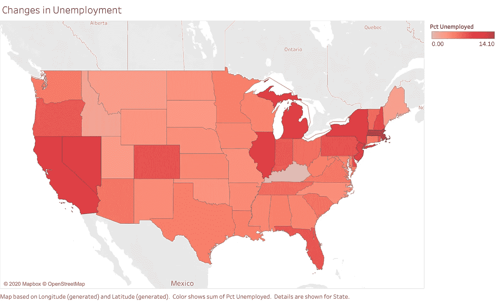
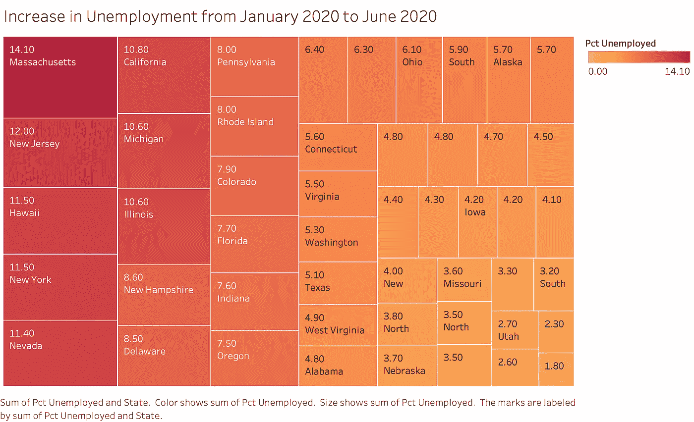
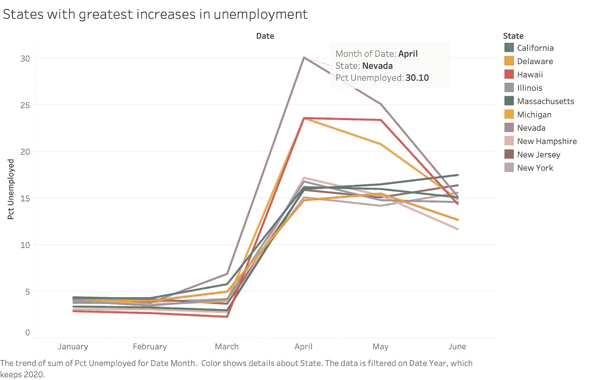
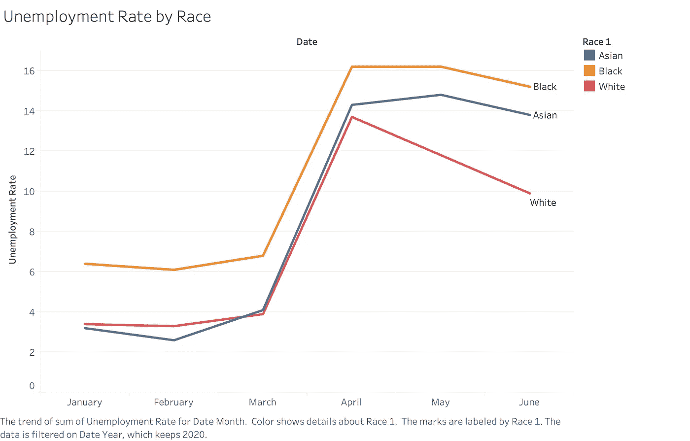
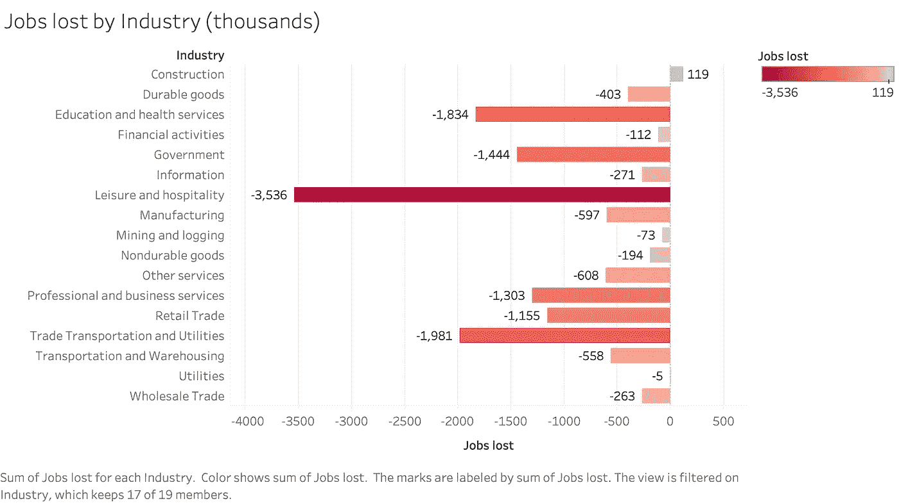

# 新冠肺炎失业简报:州、种族和行业

> 原文：<https://towardsdatascience.com/covid-19s-affect-on-unemployment-state-race-and-industry-3116d772d41e?source=collection_archive---------53----------------------->

## 自 2008 年金融危机以来，新冠肺炎一直是对美国劳动力市场影响最大的国家。

面对快速传播的疾病，大量来自各级政府的错误信息，国家经济收缩，企业暂时或永久关闭。显然，**经济的某些部门**在应对病毒时受到了不同的打击，本文将从三个横截面**国家、种族和行业来探讨【2020 年 1 月至 6 月的就业趋势**。

该分析的数据来自[劳工统计局](https://www.bls.gov/data/)。你可以在 [my github repo](https://github.com/rchardptrsn/COVID-Employment-Analysis) 下载数据并查看 python 笔记本。

 [## rchardptrsn/COVID-就业-分析

### 这个笔记本描述了几个查询美国劳工统计局 API 的例子，并把数据整理成一个…

github.com](https://github.com/rchardptrsn/COVID-Employment-Analysis) 

# 州失业率

[链接到 tableau public](https://public.tableau.com/views/Covidchangesinunemployment-STATE/Increaseinunemploymentbystate?:language=en&:display_count=y&:origin=viz_share_link)

[链接到 Tableau Public](https://public.tableau.com/views/Covidstateunemploymenttreemap/IncreaseinUnemploymentTreemap?:language=en&:display_count=y&:origin=viz_share_link)

一些州从新冠肺炎疫情爆发后下意识的就业市场崩溃中复苏的速度较慢。内华达州在酒店和休闲行业拥有近 30 万名工人，失业率在 2020 年 4 月达到 30%。

[链接到 Tableau Public](https://public.tableau.com/views/Stateswithgreatestincreasesinunemployment/Stateswithgreatestincreasesinunemployment?:language=en&:display_count=y&:origin=viz_share_link)

# 人种

不幸的是，劳工统计局只根据黑人、亚洲人和白人来划分每月的失业率。尽管这些类别有限，但很明显，黑人的复苏没有白人强劲。

[链接到 Tableau Public](https://public.tableau.com/views/Unemploymentratebyrace/UnemploymentRatebyRace?:language=en&:display_count=y&:origin=viz_share_link)

# 工业

各行业的就业水平受到社会距离限制和旅游指南的强烈影响。休闲和酒店等行业不要求大多数员工拥有高等学位或证书，因此可以认为它们对需求下降的反应更有弹性。**运输和仓储**也受到重创，可能是因为旅行限制和贸易放缓。

[链接到 Tableau Public](https://public.tableau.com/views/Jobslostbyindustry-thousands/JobslostbyIndustrythousands?:language=en&:display_count=y&:origin=viz_share_link)

从数据中可以明显看出，新冠肺炎并没有平等地影响所有经济部门。为了度过这个疫情，我们必须调整我们的生活方式，确保我们把社会的健康和福利放在自己之前。我们不能忘记**2020 年上半年因致命病毒而失去工作的数百万人**，我们可以支持那些受戴口罩和社会距离**影响的人。**