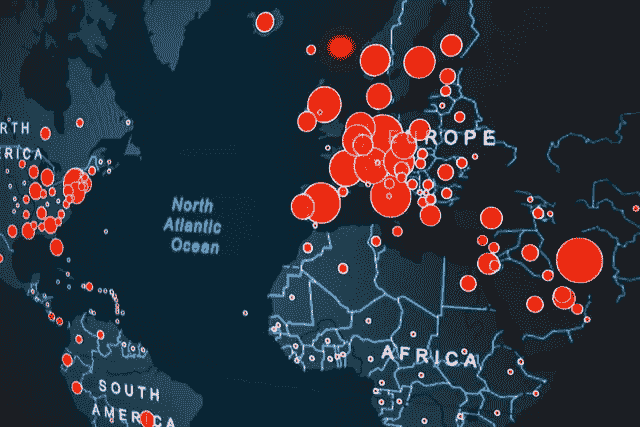
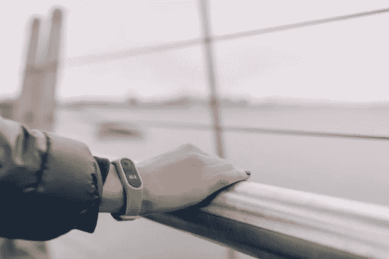
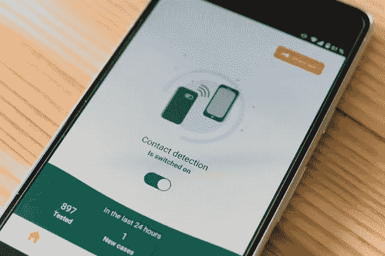
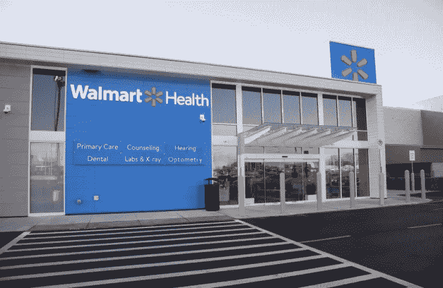

# 错综复杂的联系追踪应用程序正在出现

> 原文：<https://towardsdatascience.com/covid-contact-tracing-8f852354667b?source=collection_archive---------60----------------------->

## 这是经济复苏所必需的，它很乱，可能已经在你的口袋里了

亚马逊远程助手图片，鸣谢:亚马逊

在美国，[只有三个州](https://www.businessinsider.com/apple-google-coronavirus-contact-tracing-tech-states-dont-plan-using-2020-6)表示有兴趣采用早在三月份宣布的苹果-谷歌联系追踪平台。相比之下，英国放弃了创建定制 COVID 联系人追踪应用程序的计划，而是将使用苹果-谷歌平台。英国[的决定](https://www.bbc.co.uk/news/technology-53095336)逆转之前，初步试验发现政府的中央系统只能检测到 4%的 iPhones。尽管如此，解决方案[在冬季](https://www.theguardian.com/society/2020/jun/17/nhs-covid-19-contact-tracing-app-no-longer-a-priority-says-minister)之前不会上线，当它发布时，可能仅限于症状报告。这是因为政府的测试和追踪项目负责人还不相信这项技术适合使用。

> “在过去的几周里，我们一直在为零售商开发碰撞检测系统……人们走到一起，呆在一起。因此，我们需要找出症结所在，”一家物联网供应商表示

尽管围绕无数接触者追踪和新冠肺炎安全措施缺乏标准化，对隐私的担忧，最终用户采用的缺乏，随着城市放松限制和企业重新开业，私营行业并没有等待万灵药。

据负责机器人和工程的副总裁布拉德·波特发布的公司公告[称，亚马逊刚刚推出了一个解决方案，该方案将人工智能和机器学习应用于他们大楼的摄像机镜头，以识别高流量区域，从而改善员工的社交距离。这个名为“*距离助手*”的解决方案现在已经在他们的几栋建筑中使用，他们计划开源这个软件。](https://blog.aboutamazon.com/operations/amazon-introduces-distance-assistant)

其他雇主正在探索如何利用基于应用的位置数据、运行在 Android 和 iOS 上的消费者移动应用以及物联网(IoT)信标来提高安全性和支持经济复苏。“零售商正在询问我们如何维护更安全、更高效的环境，”Acuity Brands 高级副总裁 Audwin Cash 表示，Acuity Brands 是一家面向零售、机场和工业企业的物联网位置服务提供商。

像 Acuity 这样的解决方案通常用于店内导航:那些为室内顾客提供路线指导的“蓝点寻路”应用程序，或者商店员工从货架上快速挑选产品以进行“点击取货”订单。它们还可以用于提供匿名的总客流量分析，帮助公司了解客户或员工在哪里花费的时间最多(或最少)，这有助于改善营销决策。

但是最近，对话发生了变化。

“在过去的几周里，我们一直在为零售商开发碰撞检测系统。这项测试现在使用购物车，但也可能用于员工。人们聚在一起，待在一起。所以，我们需要找出症结所在，”卡什说。

这些夹点可以在热图上以彩色花朵的形式表示，热图是企业用来匿名观察人口密度和遵守社交距离准则的图形仪表盘可视化，或者根据高流量确定应该清理的区域。

亚马逊推出“远程助手”，鸣谢:亚马逊

# 恢复需要大规模的接触追踪

约翰·霍普金斯彭博公共卫生学院的一份报告概述了缓解美国重返工作和学校的社会距离的要求，更重要的是，推动经济发展。在最优先的事项中，他们的卫生专家表示，美国需要 1)快速诊断测试的便捷途径，2) [免疫识别](https://onezero.medium.com/ticket-passport-blood-sample-soon-youll-have-to-prove-your-health-to-everyone-3459be17c1b7)，以及 3)追踪报告病例的所有接触者的能力，以识别和警告那些可能接触过新冠肺炎的人。

挑战在于如何大规模实现接触追踪。为了支持这一需求，约翰霍普金斯大学估计需要 36 亿美元的紧急资金和 10 万额外的人。

根据国家公共电台[的调查](https://www.npr.org/sections/health-shots/2020/06/18/879787448/as-states-reopen-do-they-have-the-workforce-they-need-to-stop-coronavirus-outbre)，目前的 37，110 名接触者追踪人员仍然远远不能满足这一需求，并且考虑到他们目前的病例数，只有 7 个州和哥伦比亚特区有人员控制疫情。

> “想象一下，如果一名员工报告说他们生病了，那么我们就可以确定还有谁和他们一起轮班，”Cash 说。

为了利用技术大规模解决联系人追踪问题，苹果和谷歌[宣布](https://www.apple.com/newsroom/2020/04/apple-and-google-partner-on-covid-19-contact-tracing-technology/)建立合作伙伴关系，提出一种去中心化的模式。他们的解决方案利用智能手机上的蓝牙来记录使用同一平台的其他设备，如果它们距离很近的话。如果一个人冠状病毒测试呈阳性，它将提醒任何其他人在 14 天内遇到他们。

照片由[米卡·鲍梅斯特](https://unsplash.com/@mbaumi?utm_source=unsplash&utm_medium=referral&utm_content=creditCopyText)在 [Unsplash](/s/photos/tracking?utm_source=unsplash&utm_medium=referral&utm_content=creditCopyText) 上拍摄

但是苹果-谷歌系统是如此的封闭，以至于卫生官员说该软件将没有多大用处，只有阿拉巴马州、南卡罗来纳州和北达科他州确认使用该技术。其他 16 个州完全排除了联系人追踪应用的开发。

“我认为，如果你问大多数人，‘你相信谷歌会尊重你的隐私吗？’。。。他们不信任谷歌，”[共和党参议员比尔·卡西迪说](https://www.washingtonpost.com/technology/2020/06/01/contact-tracing-congress-privacy/)，他是 6 月份公布的监管联系人追踪应用程序的两党提案人。

除了全球官员的怀疑，这种方法还面临着任何移动应用程序的另一个障碍:认知度和采用率。华盛顿邮报-马里兰大学的一项调查发现，一旦苹果-谷歌联系人追踪应用发布，近五分之三的美国人不愿意或无法下载，43%的人普遍怀疑科技公司保护个人隐私的能力。

根据牛津大学的一项研究，这还不够。为了有效阻止疫情，研究人员确定至少 60%的人口需要使用数字接触追踪应用程序。

# 政府措施无效

然而，一个例外是越南及其 9500 万人口，到目前为止，越南没有因冠状病毒而死亡的，这主要部分归功于全国性的强制接触者追踪计划。他们的严格版计划在印刷品和电视上公开患者的身份，以告知公众受试者以前的目的地，这样，如果公民在同一时间访问过，他们可以联系当地的卫生当局。

> 如果每个州使用不同的协议开发联系人追踪应用程序，那么对于跨州旅行的公民来说，互操作性就成了一个问题。

照片由[埃里克·麦克莱恩](https://unsplash.com/@introspectivedsgn?utm_source=unsplash&utm_medium=referral&utm_content=creditCopyText)拍摄

在新加坡，当局推出了首批联系人追踪应用程序之一，接受率仅达到 20%。在挪威，21%的采用率仅略高于此。

在美国，强制性的项目是完全不可能的，而且病人身份的公开会与许多隐私法和健康法规相冲突。但是对于那些通过移动应用程序实施某种形式追踪的州来说，挑战在于一致性。如果每个州使用不同的协议开发联系人追踪应用程序，那么对于跨州旅行的公民来说，互操作性就成了一个问题。

一些政府仓促行事，跌跌撞撞，然后努力却未能赢得公众信任。对北达科他州和南达科他州的 Care19 移动追踪应用程序发布后的分析发现，[通过与 Foursquare 共享公民位置和其他个人数据，违反了](https://www.washingtonpost.com/technology/2020/05/21/care19-dakota-privacy-coronavirus/)自己的隐私政策。Foursquare 通过一名发言人表示，他们“没有以任何方式使用这些数据，这些数据很快就会被丢弃”，根据最先发现这一问题的分析师的说法，这一数据泄露事件已于 6 月份在[关闭](https://blog.jumboprivacy.com/care19-update-foursquare-allows-developers-to-disable-idfa-collection.html)。

# 私营部门对安全和接触者追踪的做法

雇主们不能再等了，正在研究其他方法来实现复苏:最初是在上班前进行体温检查和员工自我调查。

> 零售业现在有一种甚至是医疗行业都缺乏的能力:每天有数百万人使用的 iOS 和 Android 上的位置感知应用程序可以支持联系追踪。

可穿戴设备制造商 Fitbit 最近[发布了](https://investor.fitbit.com/press/press-releases/press-release-details/2020/Fitbit-Introduces-Ready-for-Work-Solution-to-Help-Employers-Manage-Workplace-Health-and-Safety-During-the-COVID-19-Pandemic/default.aspx?utm_source=Triggermail&utm_medium=email&utm_campaign=Post%20Blast%20bii-connectivity-and-tech:%20Facebook%20Workplace%27s%20abandoned%20%27content%20control%27%20tools%20highlight%20limitations%20of%20remote%20work%20%7C%20Waymo%2C%20Uber%2C%20and%20other%20leading%20AV%20companies%20join%20data-sharing%20program%20%7C%20Fitbit%20announces%20enterprise%20health-tracking%20platform&utm_term=BII%20List%20Connectivity%20ALL)一个结合健康指标、症状检查和问卷调查的解决方案。根据 Fitbit health solutions [的网页](https://healthsolutions.fitbit.com/fitbit-care-ready-for-work/)，他们的 Fitbit Care Ready for Work 项目面向雇主，雇主可以查看仪表盘来监控员工重返工作岗位的准备情况，这有助于为工作场所协议、业务连续性和公司风险状况提供信息。

照片由[突发](https://www.pexels.com/@burst?utm_content=attributionCopyText&utm_medium=referral&utm_source=pexels)发自[像素](https://www.pexels.com/photo/person-wearing-green-fitness-band-373913/?utm_content=attributionCopyText&utm_medium=referral&utm_source=pexels)

利用移动应用程序和生物识别设备可以提供比现场温度检查更高级的警告。斯坦福大学基因组学和个性化医学中心主任迈克尔·斯奈德博士在 Fitbit 的公开声明中说:“可穿戴设备非常强大，因为它们可以测量生物特征的细微差别，这些细微差别可能表明常规医生诊所就诊时无法检测到的疾病发作。”。“在测量心率时，即使每分钟心跳增加两次，也可能表明免疫系统有明显反应，这就是为什么可穿戴设备可以成为评估员工准备重返工作时整体健康状况的重要工具，特别是在评估有症状和无症状的新冠肺炎病例时。”

与亚马逊使用摄像机相比，早期的 Acuity 飞行员使用 iOS 或 Android 智能手机检测碰撞和集群，这些智能手机与天花板上的智能照明网络通信。

这引发了新的对话，有可能在工作场所接触到 trace。“找到聚集在商店里的员工是一种可能。我们正在探索性地讨论如何扩展这一场景，“共享现金”。“想象一下，如果一名员工报告他们生病了，然后我们可以确定还有谁和他们一起轮班。”

# 一种新颖的方法怎么样:位置感知移动应用

雇主们正试图解决社交距离问题，但他们的联系追踪解决方案仍然只通知那些在工作场所的人。准确跟踪办公大楼外的位置和联系仍然是经济发展的一个挑战。此外，随着越来越多的工人转向在家工作，这些解决方案不太可能在工厂、制造设施和配送中心之外产生影响。

企业可以解决采用挑战、大规模匿名追踪，并为经济带来更广泛的影响，因为零售业现在有一种甚至医疗保健行业都缺乏的能力:每天有数百万人使用的 iOS 和 Android 上的位置感知应用程序，这些应用程序可以支持联系追踪。

这些移动应用程序不会用于传输个人身份(PII)或健康信息(PHI)，而是仅限于位置数据和匿名设备标记。相比之下，Fitbit 向云端传输的个人数据更多。

马库斯·温克勒在 [Unsplash](/s/photos/tracking?utm_source=unsplash&utm_medium=referral&utm_content=creditCopyText) 上的照片

担心从手机上共享移动位置数据？你现在就做。零售应用主要用于浏览产品、管理购物清单和订单提货。Kroger iPhone 应用程序在设置页面中解释说，启用位置跟踪“可以实现更流畅、更高效的提货体验和个性化的店内购物。”使用地理围栏和室内定位，他们还通过导航(“寻路”)引导客户找到产品，或通过个性化报价通知客户。

例如，当你走过麦片货架时，玉米片的应用内折扣可能会激活。通过使用与苹果 iOS 或安卓移动设备通信的蓝牙信标或智能照明网络，一些定位系统可以实现高达 4 英寸的定位精度。然后，实时数据被吸收到高级数据模型中，以产生高度个性化和位置相关的报价。许多应用程序还通过 GPS 或 WiFi 使用位置跟踪，并可以在用户同意的情况下在商店内外的后台运行。

那么，如果一个零售商联盟匿名化他们的客户定位数据，并在公共健康危机中使用人工智能，而不是在移动设备上使用该技术来获得位置感知的数字优惠券，会怎么样？想象一下，塔吉特、沃尔玛、克罗格、沃尔格林、CVS 和其他主要零售商通过数据共享合作开展回归商业活动。

零售商拥有基本要素:1)数百万忠实客户，2)苹果和谷歌 Play 应用商店提供的位置感知移动应用程序，3)共享匿名位置数据的许可，以及 4)他们是值得信赖的品牌，每天为数百万人提供杂货和健康需求。

# 批准了吗？

鉴于零售已经提供了安全指导，扩大了招聘，对基本商品的销售保持开放，并正在进行 [COVID 测试](https://www.cnbc.com/2020/04/27/coronavirus-cvs-health-to-announce-expanded-testing-at-white-house-event.html)以填补公共空白，与科技巨头相比，获得用户对匿名位置数据共享的采用和同意可能并不那么困难。

人们相信沃尔玛、CVS 和沃尔格林每年能为[30 亿张处方配药。作为基本商品和服务的提供者，他们中的许多人甚至在隔离检疫之前就已经被消费者依赖来提供食物和健康咨询服务。如果沃尔玛继续在佐治亚州](https://cvshealth.com/about/facts-and-company-information)[的铺开](https://corporate.walmart.com/newsroom/2020/01/29/calhoun-walmart-remodel-features-opening-of-new-walmart-health-center)，它可能会成为你新的值得信赖的慢性和急性医疗保健提供商。

沃尔玛健康诊所(来源:沃尔玛)

考虑现有的用户群；CVS 拥有 6200 万名忠诚计划会员。沃尔格林在 2019 年超过了[5000 万应用安装量，其中](https://theblog.adobe.com/how-walgreens-maintains-mobile-app-dominance/)[有 9000 万](https://news.walgreens.com/fact-sheets/frequently-asked-questions.htm)忠诚计划会员。在美国零售巨头沃尔玛，每周有近 2 . 65 亿人访问他们的商店，每月有 8605 万用户访问他们的应用。即使主要零售商之间存在客户重叠，这也是应用采用的巨大基础。

与苹果的应用程序或政府主导的场景相反，最终用户可能会被鼓励根据个人偏好和对每个组织的隐私政策的舒适度，在零售合作伙伴级别选择加入(或退出)，类似于在 ios 中应用个人设置以通过应用程序进行通知或位置跟踪的方式。

尽管如此，这仍需要对匿名合作伙伴信号进行集中管理，并为用户输入和管理其 COVID 相关测试提供安全界面。

如果不是苹果-谷歌，这就引出了一个问题:谁可能成为商业合作伙伴的集中枢纽，获得大量移动遥测数据。“迄今为止，大多数零售商都避开了顾客数据和任何与 PII 有关的东西。卡什说:“要让这种事情发生，你需要一个可信的第三方来仲裁数据交换。”

那会是谁呢？《华盛顿邮报》和马里兰大学的民意调查对此有所启发。调查受访者表示，在保护联系人追踪应用程序的匿名性方面，大学(56%)和公共卫生机构(57%)的信任度高于科技公司(43%)。

因此，如果零售消费者健康公司与可信的公共卫生机构合作，它们或许能够解决接触者追踪的一个重要需求:匿名收集的位置数据。

# 隐私第一

仅仅因为我们有能力，并不意味着我们应该不顾一切。要实现这一点，有几个技术、伦理和法律方面的考虑。从 GPS 到蓝牙、WiFi 和可见光通信，存在不同的技术，每种技术都有不同程度的准确性。有些，像 GPS，在室内并不总是一致的。

接下来，**不应轻视同意和隐私**。大多数应用程序都有条款和条件条款，授予发布者与第三方共享数据的权利。然而，这通常仅限于营销目的或利用诊断数据优化应用体验。

Fitbit 的隐私政策确实包括通知用户，他们的去身份数据可能会被用于研究，例如在[一项为期两年的研究](https://www.thelancet.com/journals/landig/article/PIIS2589-7500%2819%2930222-5/fulltext)中使用的那种数据，该研究确定了使用可穿戴设备对流感样疾病进行实时监测的改进。

> “我认为，如果你问大多数人，‘你相信谷歌会尊重你的隐私吗？’。。。他们不信任谷歌。"

立法者想要更进一步。“暴露通知隐私法案”[将要求](https://www.businessinsider.com/new-bill-enforce-privacy-rules-on-contact-tracing-apps-2020-6)公司开发接触追踪应用程序，与公共卫生官员合作。它还规定收集的数据不得用于商业目的，并允许用户随时删除他们的数据。

最后，这种挑衅只能用以下原则来探讨:解决方案必须首先寻求“不造成伤害”，它必须只用于接触意识的目的，它必须保护用户的权利和隐私，它必须匿名化他们的身份。但是，如果在道德和安全的条件下进行管理，零售商和卫生合作伙伴的联盟可以使用标准化的接触追踪方法加快经济回报。