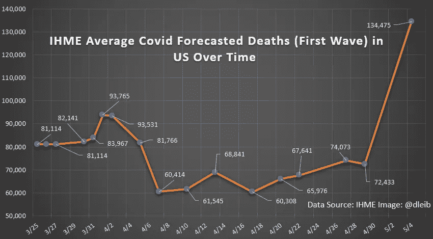
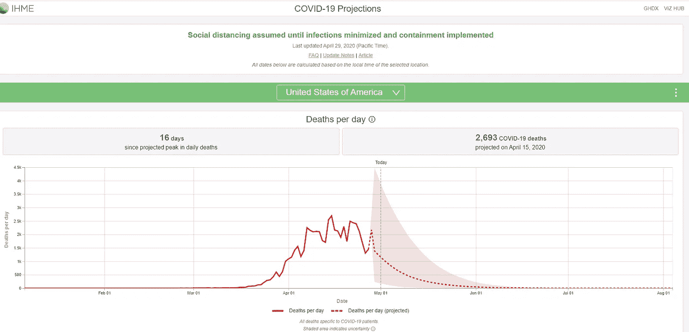
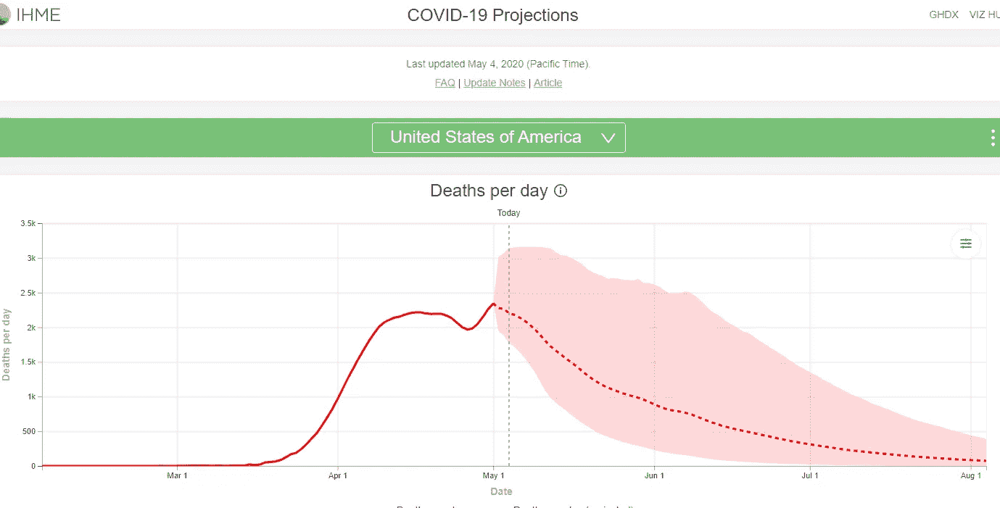
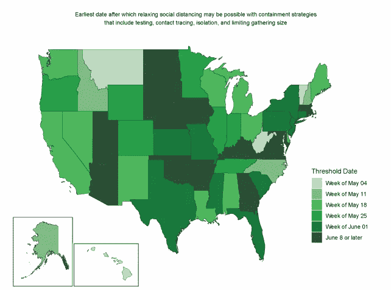
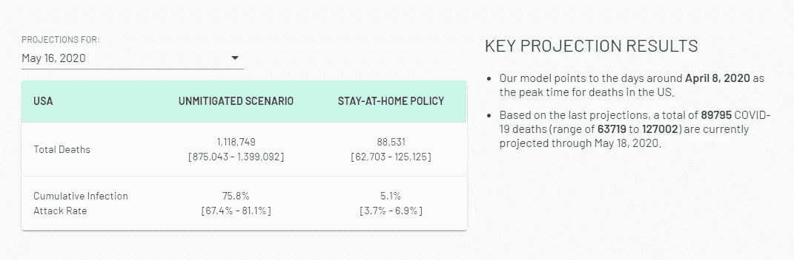
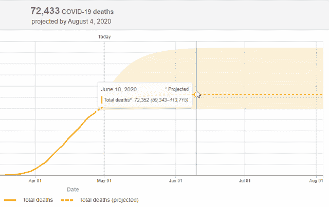
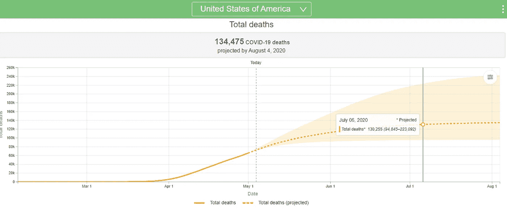
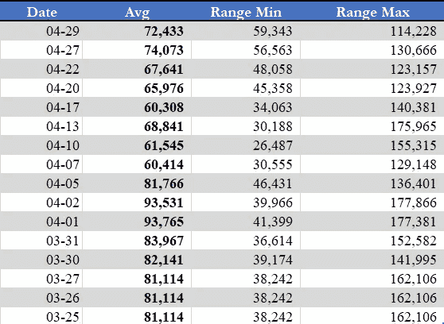

# Covid 死亡预测不断变化是我们的错

> 原文：<https://towardsdatascience.com/covid-coronavirus-forecasts-are-wrong-88f99bf8603e?source=collection_archive---------57----------------------->

## 这么多缺点，这么少时间

5 月 4 日，华盛顿大学的[健康指标和评估研究所](http://www.healthdata.org/covid/faqs) (IHME)更新了用于预测美国 Covid 相关死亡的估计框架。在他们的[站点](http://www.healthdata.org/covid/updates)上报告的实质性变化反映了与社会距离政策相关的流动性，修正了报告的病例，以说明增加的检测和驱动因素，如温度、人口密度和人均检测。

他们还将死亡人数上调至 134，475 人。就在 3 天前，这一数字为 72，433。

事实是，**美国政府和卫生官员所依赖的 IHME 预测自 3 月以来就像坐过山车一样，只是不明显。**

由于 IHME 网站上的预测可视化是动态的，普通访问者很难看到这些随时间的波动。而且，大多数新闻周期只报道最近的 delta，这也无助于问题的解决。由于 IHME 没有提供他们的可视化档案，我使用了他们免费提供的数据制作了下面的预测死亡时间图。

数据来源:IHME 图片来源:大卫·莱博维茨

# 以“相同的数字”结束

在 3 月 30 日的新闻发布会上，冠状病毒应对协调员 Deborah Birx 博士提到了 12 个已经接受审查的全球模型。虽然没有分享原因，但他们排除了这些原因，而是“从头”开发了一个新模型，随后了解到来自 IHME 的研究。Birx 博士最终预测了 IHME 的未来，因为他们“最终的数字是一样的”

自那以来，政府和卫生官员一直依赖 IHME 模型进行冠状病毒规划，扩大社会距离指导方针，制定遏制战略，最近还计划在州一级放松就地安置限制，以支持经济复苏。由于 IHME 修改了他们的数据，他们对最好情况的预测在新闻发布会上被重复。

例如，在 5 月 1 日的新闻发布会上，唐纳德·特朗普总统在谈到冠状病毒时说，“希望我们的死亡人数低于 10 万人”，指的是平均预测的上限。就在 4 天前，政府公布的平均死亡人数超过了 [70，000](https://www.reuters.com/article/us-health-coronavirus-usa-trump/trump-now-says-he-hopes-us-deaths-from-coronavirus-are-under-100000-idUSKBN22D6EK) 。两周前的 4 月 20 日，这个数字是 [60，000](https://www.cnn.com/world/live-news/coronavirus-pandemic-04-21-20-intl/h_a266b6f5fe37b3cc58cbd6c1655c0c84) 。都是基于 IHME 模型。

虽然对感知的门柱运动可能有合理的担忧，但它转移了更深层次的问题:我们中很少有人(从行政部门，到新闻媒体，到每个社交媒体扶手椅数据科学家)一直在仔细检查足球场本身。

> 因此，通过省略，大多数新闻报道，新闻简报和死亡预测的盲目推特都可以被解读。

# 这是怎么回事？

IHME 模型利用来自全球各地的数据，以及假设遵守美国的应对策略(学校关闭、就地安置命令、非必要的商业关闭)来预测峰值医疗需求和预测死亡人数。既然 IHME 提供的学术分析部分由[知名慈善家](https://www.gatesfoundation.org/media-center/press-releases/2017/01/ihme-announcement)资助，我就用马文·盖的话说，“*到底怎么回事？*

> “IHME 的预测不是基于传播动力学，而是基于一个没有流行病学基础的统计模型。”

有几个因素需要考虑。首先，正如《内科医学年鉴》所言，“IHME 的预测不是基于传播动力学，而是基于没有流行病学基础的统计模型。”他们没有使用流行病学学科，而是选择基于中国武汉的病例和死亡轨迹以及意大利和韩国的指标建立模型。

第二，**IHME 使用了过于乐观的预测**,以至于模糊了一些相当复杂的假设和限制，其中一些在 3 月底和 4 月初的美国并没有得到一致执行。正如你将在下面的截图中看到的，描述、上下文和可视化格式一直在变化。

最后，**我们应该受到责备，因为我们盲目地抓住标题**上的 **，而没有仔细检查来源和要求上下文。**

为 IHME 说句公道话，spartan projection [页面](https://covid19.healthdata.org/united-states-of-america/)包含了每款车型变更的公布结果，并提供了更新说明的链接。但我怀疑，对报告的审查与软件更新前的 iOS 许可协议一样严格。像许多申请条款一样，我们只需滚动到底部，点击“同意”，就可以进入下一步了。然而，问题在于所有这些细节和假设，尤其是当目标和背景不断变化的时候。

例如，请注意这张 5 月 1 日 IHME 预测页面的截图。过度宽泛的免责声明“在感染最小化和控制实施之前保持社会距离”显示在文件夹的顶部。

作者截图 IHME 新冠肺炎预测(截至 2020 年 5 月 1 日)

但是在 5 月 4 日，修正后的模型预测几乎是几天前预测的两倍，没有任何警示性的假设。他们还选择平滑可视化，而不是之前基于报告滞后的直线图。

作者截图 IHME 新冠肺炎预测(截至 2020 年 5 月 4 日)

# 利用中国的应对策略预测美国的结果

在 3 月 27 日发表的第一篇论文中，IHME 概述了对呼吸机需求和医院床位过剩的初步预测，以及超过 81，000 人的死亡预测。当该模型首次推出时，美国许多州尚未实施社交距离政策，那些实施的州也不一致。尽管如此， **IHME 利用来自*其他*国家(主要是中国和意大利)的趋势、预测和死亡人数来预测美国的结果**。

但每个国家对冠状病毒的反应不同，速度和效果也不同。与美国相反，中国[行动迅速](https://www.businessinsider.com/chinas-coronavirus-quarantines-other-countries-arent-ready-2020-3#the-country-postponed-non-urgent-medical-care-and-moved-many-doctors-visits-online-not-all-patients-were-given-the-critical-care-they-needed-during-the-outbreak-though-3):他们有现成的免费检测，建立了 1000 个床位的医院，制定了快速检测方案，在武汉等热点地区停止公共交通，强制隔离，并试图追踪接触者。所有这些举措在病毒在美国爆发时都是不可能的。

> 截至 5 月 4 日，IHME 似乎终于收到了消息，[承认](http://www.healthdata.org/covid/updates)，“越来越清楚的是，新冠肺炎疫情轨迹——以及相应的反应——在世界各地高度可变。”*丫的，觉得怎么样？*

其次，他们用来预测美国死亡率的国际死亡人数并不完全准确。意大利一直被无辜地低估了死亡人数，因为许多人没有被送往医院或接受检查就死亡了。相比之下，正如美国中央情报局官员在《纽约时报》的一次曝光中所称，小说作品正从中国流出。在信中，他们声称中国一直在大幅少报冠状病毒感染，因为中国的中层官员害怕受到惩罚，一直在感染率、检测和死亡人数上撒谎。

无论是由于疫情战争迷雾中的诚实错误，还是有意的谎言，问题仍然存在:看不见的和未统计的死亡没有被包括在 IHME 直到四月中旬的预报中。

# 不现实的乐观

尽管这些早期的挑战，IHME 已经受益于时间来提高预测的准确性:他们现在使用约翰霍普金斯大学(JHU)的实际死亡人数，并包括州级社会距离测量的假设。

因此，4 月 17 日的[预报](http://www.healthdata.org/sites/default/files/files/Projects/COVID/Estimation_update_041720.pdf)带来了一些更新，正如他们宣称的那样，带来了模型的“实质性”改进。这也是他们预测的迄今为止最低的死亡人数(60，308 人)**。**

这遭到了一些质疑。

当时， **IHME 模型被*福布斯*称为“** [**不切实际的乐观**](https://www.forbes.com/sites/hershshefrin/2020/04/18/what-makes-the-covid-19-mortality-forecasts-upon-which-the-white-house-relies-seem-so-low/#e9567c82f70c)**，而*纽约时报*认为，与哥伦比亚大学、东北大学和其他机构的基于流行病学的模型相比，“不那么悲观”。**

> **尽管为重新开放策略和每个州可能放松限制的日期提供了非常规范性的指导，IHME 在他们的预测中根本没有应用这些。**

**4 月 17 日的更新也为各州提供了放松社交距离限制的指导。例如，他们建议纽约、新泽西和康涅狄格最早可以在五月底考虑放宽社交距离。**

****

**来源:IHME 2020 年 4 月 17 日估计更新**

**但是，尽管为重新开放策略提供了非常规范性的指导，以及每个州可能放松限制的日期，IHME 实际上根本没有在他们的预测中应用这些。根据他们的[常见问题解答](http://www.healthdata.org/covid/faqs)，截至 4 月 17 日，他们的预测“*不再考虑社交距离任务的可变性”。***

**相比之下，宾夕法尼亚大学沃顿商学院(Wharton School of the University of Pennsylvania)开发了一种[建模工具](https://budgetmodel.wharton.upenn.edu/issues/2020/5/1/coronavirus-reopening-simulator)来可视化各州重新开放的健康和经济影响，称为冠状病毒政策响应模拟器。他们将该工具描述为使用“流行病学框架和经验估计来模拟放松国家封锁政策的健康和经济影响。”**

**如果各州开始部分重新开放，沃顿工具预测，除了 115，937 例 Covid 相关死亡的基线外，还有 43，683 例死亡。他们将部分重新开放定义为解除紧急状态声明、在家呆着的命令和学校关闭。**

**模拟器进一步预测，如果取消所有限制，包括取消除部分重新开放标准之外的商业和餐馆限制，到 6 月 29 日，死亡人数将增加 222，823 人(总数为 338，760 人)。**

**一些预测者采取了不同的方法来预测信心，以解释 IHME 的乐观情绪。德克萨斯大学奥斯汀分校的一个财团审查了 IHME 模型，目的是使用 GPS 信号模式而不是使用其他国家的趋势来校正它。在他们的研究过程中，他们注意到**IHME 模型显示** **越是展望未来**就越能增加确定性。换一种方式来说，人们可能会对预测近几英寸的降雨量有更高的信心，而不是预测未来六周的降雨量。**

**这可能是东北大学只会提前两周预测死亡人数的原因。相比之下，IHME 声称从开始到 8 月 4 日已经进行了四个月的预测。尽管连日期都不确定。尽管保留那个日期，因为我们稍后将回到它。**

****

**东北大学网站作者截图(2020 年 5 月 2 日)**

# **背景很重要:“低于 10 万英镑”..到什么时候？**

**想想其他疾病和疾病的预测是如何发布的:疾病预防控制中心估计，在 2017-2018 流感季节**期间，美国有 [61，000](https://www.cdc.gov/flu/about/burden/2017-2018.htm) 人死于流感**，并声称每年有 [647，000](https://www.cdc.gov/heartdisease/facts.htm) 美国人死于**心脏病**。它们包括一个时间段。**

**但是参考 Covid，通常省略相同的基于持续时间的上下文。在很大程度上，头条新闻和简报只是简单地陈述了总死亡人数。例如，美国新闻&世界报道在 4 月 6 日的一篇[文章](https://www.usnews.com/news/best-states/articles/2020-04-06/coronavirus-model-now-estimates-fewer-us-deaths)中吹捧较低的预测，称“新的评估预测大约 81，766 人死亡。”[NPR](https://www.npr.org/2020/04/09/830664814/fauci-says-u-s-coronavirus-deaths-may-be-more-like-60-000-antibody-tests-on-way)4 月 9 日，以“冠状病毒死亡人数可能更像 6 万人”为标题这两个故事都没有提到那个时期。**

**回想一下，在 5 月 1 日的新闻发布会上，总统的声明也没有澄清时间，“希望我们的死亡人数低于 10 万，尽管这是一个可怕的数字。”**

**想想来自 IHME 本身的报道。他们在 4 月 5 日的新闻稿中声称，“IHME 预测死亡人数为 81766 人，范围在 49431 到 136401 人之间。”在这份 780 字的声明中，没有对死亡人数的日期范围或波动进行限制。这是夏末的天气预报吗？12 月 31 日？隔离的终结？**

> **因此，通过省略，大多数新闻报道，新闻简报和死亡预测的盲目推特都可以被解读。**

**所以，问问你自己这个问题:当你阅读这些报道，或者在 3 月和 4 月的预测中提到的类似报道时，你认为它们是什么意思？疫情持续期间或疫苗研制出来之前的死亡人数可能是可信的答案。另一个合乎逻辑的含义可能是截至 12 月 31 日的一年，或者是一个季节，与类似流感的统计数据保持一致。**

**但是这些假设都不是真的。**

**据《IHME》报道，那里的 ***是*** 预测的结束日期，一些新闻媒体已经开始关注这一消息。在 *Forbes* [文章](https://www.forbes.com/sites/hershshefrin/2020/04/18/what-makes-the-covid-19-mortality-forecasts-upon-which-the-white-house-relies-seem-so-low/#e9567c82f70c)中，他们称，“根据 IHME 模型，**到 2020 年 8 月 4 日**疫情将接近尾声”，“到那时，每日死亡率将降至零。”他们使用这个日期大概是因为图表上标有“预计到 2020 年 8 月 4 日”**

> **但更奇怪的是，为期四个月的预测“8 月 4 日”*实际上将于 7 月 6 日结束。当你看到我从 IHME 网站上想象出来的这个形象时，请让这一点沉淀一会儿。***

****

**作者生成的图片来自 IHME 网站(2020 年 5 月 1 日)**

**动画显示(截至 5 月 1 日，当我在上面抓图时)在美国，我们将在 7 月 6 日达到 72，433 的最大预计死亡人数，然后一直到 8 月 4 日。如果你认为这意味着 7 月 6 日之后不会再有死亡预测，那么你就完全同意 IHME 的观点。**

**5 月 4 日的更新在此基础上略有改进，取消了 IHME 自 3 月 28 日以来一直使用的平线结果。正如你在下面的截图中看到的，这将 7 月 6 日的预测调整为 130，255 人死亡。或者换句话说，在预测死亡人数(134475)的 96.9%以内。按照这种逻辑，他们假设在从 7 月 6 日到 8 月的近 30 天内，只有 4220 人会因冠状病毒而丧生。**

****

**作者生成的图片来自 IHME 网站(2020 年 5 月 4 日)**

**IHME 在他们的论文中详述了他们的逻辑，指出新冠肺炎的死亡率将在五月或六月下降到百万分之 0.3 以下，因此在统计上不再重要。**

**更简单地说，他们在他们的常见问题中解释说，“假设当前的社会距离措施保持不变，直到感染最小化，遏制战略得到实施(作者注:之前报道过，现在已从预测页面中删除)，**我们的模型预测，到这个日期**在你所在的地方，新冠肺炎的死亡人数将接近于零。”这不仅是一个慷慨的免责声明，它还允许众所周知的目标不断移动。还记得德克萨斯大学研究所提到的关于未来预测确定性的说法吗？**

**与 IHME 预测的新冠肺炎死亡率相比，CDC 发现[流感的死亡率为每 100，000](https://www.cdc.gov/nchs/fastats/flu.htm) 人口中有 2.0 人死亡。尽管流感的发病率已经超过了整个季节，而且 Covid 的假设是，在它的周期结束时，发病率将会显著下降，但这似乎仍然令人怀疑。对于流感，测试和流感疫苗都可以广泛获得。对于 Covid，我们两者都没有。假设仅仅是社会距离就能在两个月内使这种侵略性病毒的死亡率低于流感，这是值得怀疑的。**

# **其他奇闻**

**你在上面的死亡预测虚线图周围看到的阴影带显示了预测范围的上下限。尽管这是合理的，因为预报由于其不精确的性质将包括范围，但有趣的是，在 4 月 27 日，[超过 56，000 人死亡](https://www.cbsnews.com/live-updates/coronavirus-update-lockdowns-million-cases-2020-04-27/)，然而 IHME 同一日期预报范围的下限奇怪地位于 56，563。**4 月 29 日，平均预测的下限是 59343 人，尽管 JHU 报告的死亡人数超过了** [**6 万**](https://www.cbsnews.com/live-updates/coronavirus-live-updates-2020-04-29/) **。**这就像天气预报员预测当天的温度在 45 到 67 度之间，而在他的直播中，外面的温度是 29 度，还下着雪。**

****

**数据来源:IHME(2020 年 5 月 1 日)**

# **驾驭预测浪潮**

**有趣的是，一个新的短语不时出现在 IHME 死亡预测中，尽管没有显示在他们的预测页面上。这个术语现在指的不是八月份的死亡人数，而是第一波病毒。**

**然而，IHME 报告并没有对*波*给出明确的定义，并且没有上下文允许目标也在这里改变。第一波可能包括一系列需要满足的条件，如冠状病毒病例在一段时间内的下降趋势，或传播速度。第一波可能是大多数州重新开门营业的时候。没有定义，它可能是任何东西。**

**值得注意的是，随着 5 月 4 日最近的模型变化，[更新](http://ww.healthdata.org/covid/updates)页面的解释，以及投影[可视化](https://covid19.healthdata.org/united-states-of-america)现在明显缺少单词“wave”或短语“first wave”**

**第一波确实有可能是 IHME 在三月份定义的任意的四个月窗口(截止于 8 月 4 日)。他们毕竟创造了这个短语。他们不会使用未来滚动期预测(如东北大学的两周展望)，而是会继续更新他们对 8 月 4 日或某个任意波动结束条件的预测。所以最后，死亡预测总是准确的。**

**这就像在足球比赛的最终比分上下赌注，并在每次触地得分和每个球员受伤后更新您的赌注。要是我的经纪人能给我这样的自由就好了。我的预测将是完美的。**

**(编辑于 5.16.20:更正了指向《纽约时报》文章的超链接)**