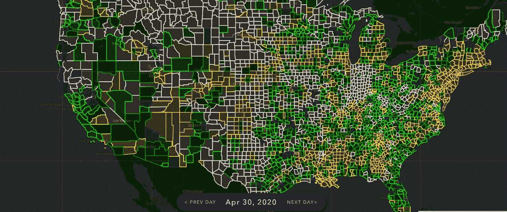

# Covid Data Science 推出预测和概率引擎

> 原文：<https://towardsdatascience.com/covid-data-science-launches-forecast-engine-88c31c4976d7?source=collection_archive---------53----------------------->

## 为新冠肺炎建立一个工作预报模式

> 由于新冠肺炎继续在世界各地造成破坏和疾病，我们决定创建一个工具，将人口与最近的病例结合起来，预测被感染的概率。这一工具现在可供公众和政府机构成员使用。

该数据适用于美国所有县、州和许多国家的省。[这段视频](https://vimeo.com/412642227)深入探讨了这一主题，但我们只是用 7 天的时间创建了一个日平均值，然后用总体来计算概率。我们还应用了一些特殊的逻辑规则来帮助我们处理数据馈送中令人头疼的问题，比如空值和国家值在只能上升的时候下降。

我们还开发了一个 ARIMA 模型，在这个模型中，您可以向前移动时间(最多 10 天)来查看病例将如何增加。该模型使用过去 7 天和预计衰变率来尽可能准确地预测病例数。

我们的[分析](https://coviddatascience.com/analysis/)部分有一个每日指数增长图，这非常有利于了解增长何时放缓，但可能至少在未来 7-14 天内还不会显示在每日案例中。我们还有一个图表，可以让你选择任何地点的组合，并根据进入疫情的天数进行比较，这样更容易看到不同国家的反应。

Covid 数据科学可以[访问这里](https://coviddatascience.com)。

Covid 数据科学由数据科学家、程序员和机器学习专家组成。