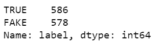
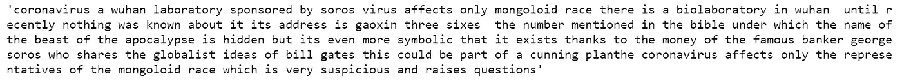
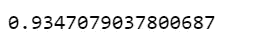

# 用非常简单的逻辑回归检测假新闻

> 原文：<https://towardsdatascience.com/covid-fake-news-detection-with-a-very-simple-logistic-regression-34c63502e33b?source=collection_archive---------18----------------------->


图片来源:Unsplash

## 自然语言处理，NLP，Scikit Learn

这一次，我们将使用我不久前收集的[数据](https://raw.githubusercontent.com/susanli2016/NLP-with-Python/master/data/corona_fake.csv)，创建一个简单的逻辑回归模型来将 COVID 新闻分类为真或假。

这个过程出奇的简单和容易。我们将清理和预处理文本数据，使用 [NLTK](https://www.nltk.org/) 库执行特征提取，使用 [Scikit-Learn](https://scikit-learn.org/stable/) 库构建和部署逻辑回归分类器，并在最后评估模型的准确性。

# 数据

[数据集](https://raw.githubusercontent.com/susanli2016/NLP-with-Python/master/data/corona_fake.csv)包含 586 条真新闻和 578 条假新闻，几乎对半分割。因为数据收集偏差，我决定不使用“源”作为特征之一，而是将“标题”和“文本”合并为一个特征“标题 _ 文本”。

fake_news_logreg_start.py



# 预处理

让我们来看一个标题文字组合的例子:

```
df['title_text'][50]
```


看看上面的标题和文本的例子，它们非常干净，一个简单的文本预处理就可以了。因此，我们将剥离任何 html 标签，标点符号，并使他们小写。

fake _ news _ logreg _ 预处理. py



下面的代码将标记化和词干化技术结合在一起，然后在“title_text”上应用这些技术。

```
porter = PorterStemmer()def tokenizer_porter(text):
    return [porter.stem(word) for word in text.split()]
```

# TF-IDF

这里，我们将“标题 _ 文本”特征转换成 TF-IDF 向量。

*   因为我们之前已经将“title_text”转换为小写，所以这里我们设置了`lowercase=False`。
*   因为我们已经注意到并对“title_text”应用了预处理，所以这里我们设置了`preprocessor=None`。
*   我们用之前定义的标记化和词干化的组合来覆盖字符串标记化步骤。
*   设置`use_idf=True`启用逆文档频率重新加权。
*   设置`smooth_idf=True`以避免零分割。

fake_news_logreg_tfidf.py

# 文献分类的逻辑回归

*   我们可以使用一个估计器`LogisticRegressionCV`，而不是手动调整 C 参数。
*   我们指定交叉验证折叠的数量`cv=5`来调整这个超参数。
*   型号的度量是分类的`accuracy`。
*   通过设置`n_jobs=-1`，我们将所有的 CPU 内核专用于解决问题。
*   我们最大化优化算法的迭代次数。
*   我们使用`pickle`来保存模型。

false _ news _ log reg _ model . py

# 模型评估

*   使用`pickle`加载我们保存的模型。
*   使用该模型查看以前从未见过的数据的准确性得分。

fake_news_logreg_eva.py



[Jupyter 笔记本](https://github.com/susanli2016/NLP-with-Python/blob/master/Fake_News_LogReg.ipynb)可以在 [Github](https://github.com/susanli2016/NLP-with-Python/blob/master/Fake_News_LogReg.ipynb) 上找到。享受这周剩下的时光。