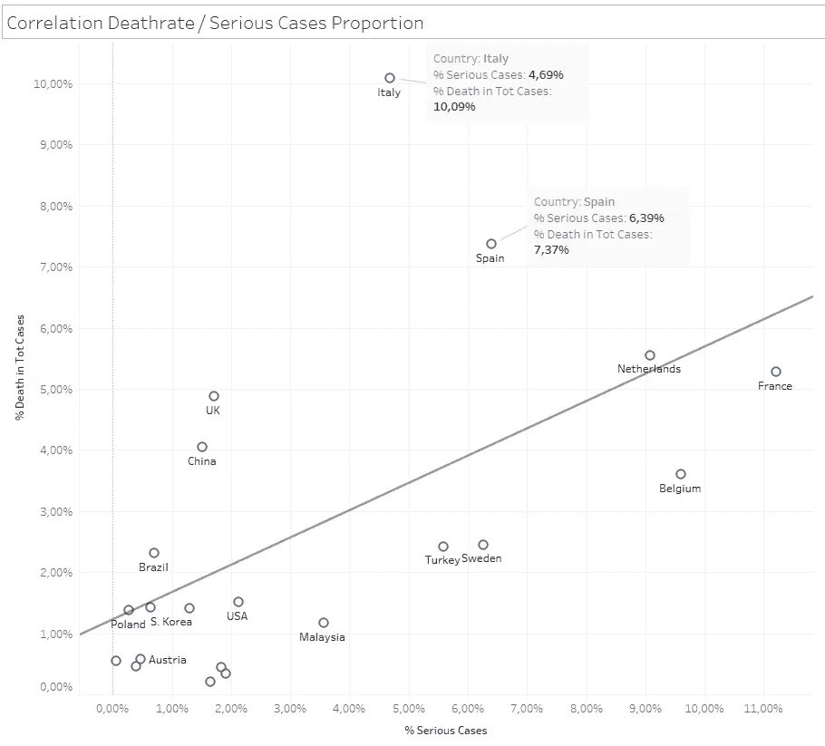
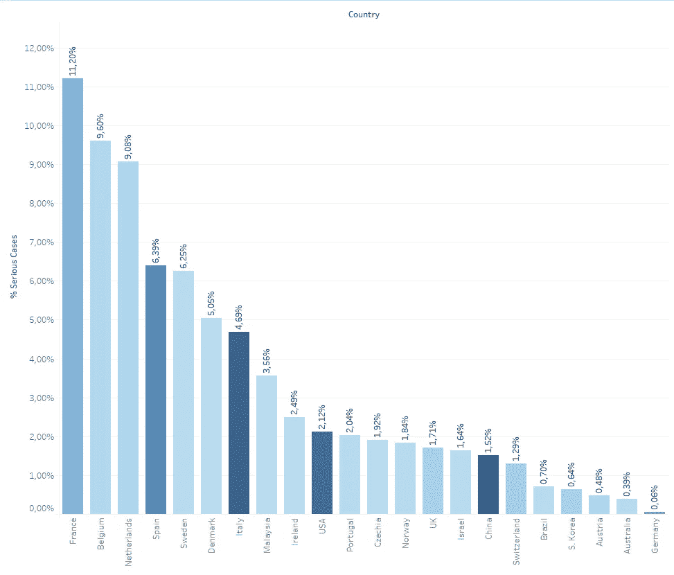
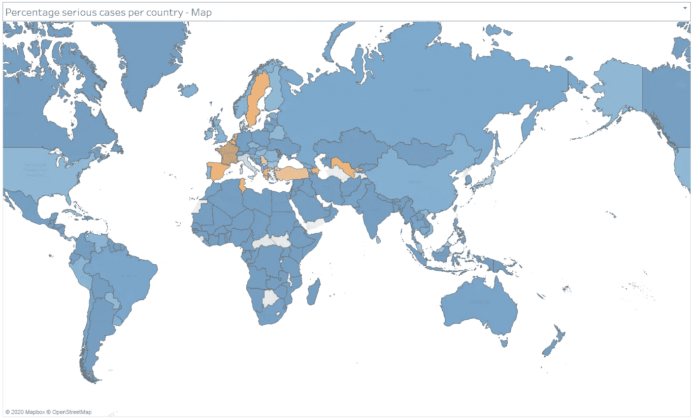

# COVID19 —西班牙和意大利的情况是否特别危急？

> 原文：<https://towardsdatascience.com/covid19-is-the-situation-in-spain-and-italy-particularly-critical-ca869a3d6bda?source=collection_archive---------44----------------------->

## COVID19 上的信息图形和统计数据

本文通过一些信息图表和统计数据显示了意大利和西班牙的死亡率比率和严重病例数的异常情况。在这两个国家，与报告的严重病例数量相比，死亡人数过多。这怎么解释？

(数据来源:[https://www . world ometers . info](https://www.worldometers.info)，图文: [www.stoeckl.ai](http://www.stoeckl.ai) )

COVID19 病毒的危险已经并仍在被大量谈论和报道。一方面，他们试图从统计数据中得出结论，另一方面，媒体和私人接触中的报道描述了个人的情况和戏剧性。所以每个人都已经熟悉了一些报道，例如，一位意大利医生[被指控。但在私人领域，经验的报告也在积累，这与仍在流传的那种“只是另一场流感”的报告相矛盾。因此，以下统计数据不应被用来淡化这种情况。](https://www.t-online.de/nachrichten/panorama/id_87492038/coronavirus-italien-arzt-berichtet-ueber-dramatische-zustaende-in-bergamo.html)

作为一名统计学家，我想回答一些关于国家间死亡率和重症比例差异的问题。

作为**数据源**我使用:

[https://www.worldometers.info/coronavirus/](https://www.worldometers.info/coronavirus/)

许多国家的数据是否是最新的:

*   病例数、严重病例、当前病例
*   新病例数
*   死亡人数和新增死亡人数
*   康复人数
*   每百万人口的病例和死亡率

(评价时间:26.3。14:30)

对于有许多病例的国家，下面的柱状图显示了报告为严重病例的百分比。条形图的颜色表示该国迄今为止的病例数，颜色越深，病例越多。

(数据来源:[https://www . world ometers . info](https://www.worldometers.info)，图文: [www.stoeckl.ai](http://www.stoeckl.ai) )

当然，像法国这样的国家(超过 11%的病例被列为严重)和像德国这样的国家(只有 0.06%)之间的巨大差异是惊人的。

**这些差异从何而来？**

死亡率差异的问题已经在报刊和文章中得到广泛讨论。媒体[文章](https://medium.com/@andreasbackhausab/coronavirus-why-its-so-deadly-in-italy-c4200a15a7bf)比较了意大利和韩国的情况。分析的重点是各国年龄结构和患者年龄结构的差异。

一项[科学研究](https://science.orf.at/stories/3200422)的讨论涉及死亡率以及中国和意大利年龄结构的差异。

**奥派出版社**讨论了许多原因，就像这篇[文章](https://www.wienerzeitung.at/nachrichten/politik/europa/2055513-Warum-Oesterreich-so-wienige-Corona-Tote-hat.html)一样。典型的奥地利方式是，由于“Ischgl”中的热点和来自那里的传播，奥地利和在奥地利有滑雪游客的国家的低死亡率，可以归因于年轻健康滑雪者的大比例。

[**瑞士出版社**](https://www.nzz.ch/visuals/coronavirus-warum-die-toedlichkeit-des-coronavirus-in-italien-so-hoch-ist-ld.1546758) 论述了两个因素，一方面是年龄结构的差异，另一方面是医疗保健制度。

[**德媒**](https://www.zdf.de/nachrichten/panorama/coronavirus-tote-zahlen-gering-warum-100.html) 发挥作用的不仅有**年龄结构**和**医疗保健体系**还有各国不同的**检测方法**。

正如我的柱状图所示，不仅各国之间的死亡率有很大差异，而且重症病例的比例也有很大差异。这可能与我刚才列举的原因相同。

但是重症比例和死亡率之间应该有明确的联系。如果有很多严重病例，应该会有很多人死亡。看文章开头包括回归线的散点图。

意大利和西班牙的数据不在本报告中所有其他国家的数据之内。与重症病例的比例相比，死亡率太高了。对于所考虑的所有其他国家，这些点或多或少位于一条直线上(线性关系)。

这只能用意大利和西班牙较差的医疗体系来解释吗？或者这是否表明这两个国家的情况非常危急，以至于重病患者无法得到足够的治疗？

最后，来看看一张**世界地图**上的危重病例比例分布。

(数据来源:[https://www . world ometers . info](https://www.worldometers.info)，图文: [www.stoeckl.ai](http://www.stoeckl.ai) )

比例最高的重症病例(橙色)主要出现在欧洲。