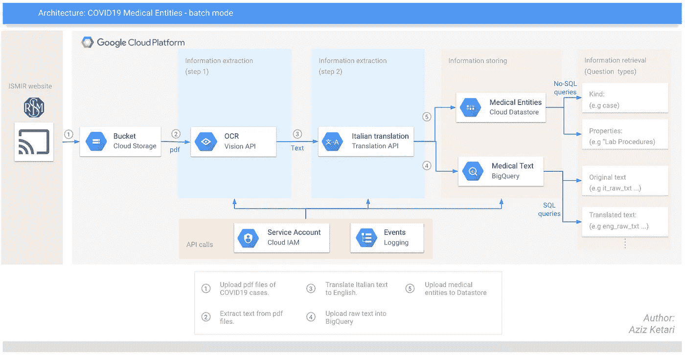

# 谷歌云平台上意大利案例的新冠肺炎公共数据集

> 原文：<https://towardsdatascience.com/covid19-public-dataset-on-gcp-nlp-knowledge-graph-193e628fa5cb?source=collection_archive---------40----------------------->

## 在 BigQuery 和 Datastore 上公开提供来自真实患者病例的医疗记录和实体！

当医疗专业人员正在拯救世界的时候，我想到了我们这些数据科学家如何尽我们的一份力量来帮助解决新冠肺炎全球疫情问题(当然，除了呆在家里)。

由[桑迪·克拉克](https://unsplash.com/@honeypoppet?utm_source=unsplash&utm_medium=referral&utm_content=creditCopyText)在 [Unsplash](https://unsplash.com/s/photos/stay-home?utm_source=unsplash&utm_medium=referral&utm_content=creditCopyText) 上拍摄的照片

像每一个自尊的数据科学家一样，在我信任的数据中。就在那时，我开始寻找新冠肺炎数据集，并偶然发现了意大利医学和介入放射学协会的网站。
除了拯救世界，他们还抽出时间定期更新网站，更新他们治疗的新冠肺炎病例的最新医学记录和医学图像的 pdf 文件。太棒了。

希望这个数据集将帮助研究人员和其他贡献者对抗冠状病毒全球疫情。潜在的应用包括但不限于:
-知识图表(例如揭示隐藏的模式……)
-Q&A 系统(例如实时 FAQ)或聊天机器人(例如规模客户服务)
-等等！！

那是旅程开始的地方。

谷歌云管道架构

到本文结束时，您将得到 **2 个数据集** :
1 个。[big query 上的表](https://console.cloud.google.com/bigquery?p=aketari-covid19-public&d=covid19&t=ISMIR&page=table)包含意大利语(基本事实)、英语和策划英语的非结构化文本。
2。No-SQL 数据库，包含来自精选英语文本的分类医疗实体。

您将在本[报告](https://github.com/azizketari/covid19_ISMIR)中找到所有细节，以重现相同的数据集，并做出您想要的更改，从而最大限度地满足您的需求。

## 一.数据提取

起点是一个带有医疗记录和图像的 pdf 文档。以下是提取数据的步骤:

1.  从 [ISMIR 网站](https://www.sirm.org/category/senza-categoria/covid-19/)下载 pdf 文件(手动流程)
2.  将每个案例的页面分开(手动流程)
3.  使用 Google Cloud Vision API 提取文本— DOCUMENT_TEXT_DETECTION。

从 Vision API 解析 json 输出的函数

## 二。数据处理

不幸的是，医疗记录是意大利语的。以下是处理原始文本的步骤:

1.  使用谷歌翻译 API 将意大利语翻译成英语

调用谷歌云翻译 API 的函数—批处理模式

2.管理文本:管理包括使用正则表达式删除文本(例如日期、图片标题…)，删除自定义停用词等等…我发现这篇来自 KDnuggets 的[文章](https://www.kdnuggets.com/2019/04/text-preprocessing-nlp-machine-learning.html)非常有帮助。

3.从 [Scispacy](https://allenai.github.io/scispacy/) 中提取 [UMLS 医疗](https://www.nlm.nih.gov/research/umls/index.html)实体，使用模型*“用更大的词汇量和 60 万字向量对生物医学数据进行训练”*。

函数从文本中提取医疗实体

## 三。数据存储

1.  将原创和策划的文本上传到 BigQuery (repo 可以在这里[找到](https://github.com/azizketari/covid19_ISMIR/blob/master/scripts/storing.py))。该表包含 3 种格式的医疗记录的基本事实: **raw_it_text** 、 **eng_raw_txt** 和 **eng_txt** (策划版本)。

包含所有提取文本的 FBQ 数据集

以下是查询公共 BigQuery 数据集的代码片段:

查询公共 BQ 数据库的 Python 示例代码

2.将每个病例的 UMLS 医疗实体上传至数据存储库(可在此处找到回购)

包含所有医疗实体的数据存储数据集

## 四。现在怎么办？

在这次旅程中，我直接从医生的笔记中了解了许多关于 COVID19 的知识。我注意到文本管理还远远不是最佳的。有大量的“垃圾”通过裂缝，并被错误地挑选为医学实体。

有趣的是，我发现“疾病或综合征”这个实体非常有启发性。事实上，它强调了病人表现出的所有症状(也称为共病)。正如所料，你会发现许多与呼吸衰竭症状相关的实体(如双侧间质性肺炎……)。然而，非常有趣的是，我们注意到许多病例也显示了**心脏病**相关实体(例如心包积液……)。

我也有责任敦促打算使用这个数据集的人在发表早期结论之前注意**偏差**(样本偏差、社会偏差、确认偏差和其他……)。

## 改进:

*   在当前管道中，必须在上传所有感兴趣的文档后手动触发管道(批处理模式)。管道的下一个版本将包括[云函数](https://cloud.google.com/functions)，一旦一个新的文档被放入桶中
    **(即将推出…)**
*   使用[数据丢失防护(DLP) API](https://cloud.google.com/dlp) 对数据进行去识别。基于医疗机构 ISMIR 公开发布 pdf 的假设，此管道的第一个版本不包括删除 PII 信息的步骤。管道的下一个版本正在开发中，将包含这一特性。
    **(即将推出…)**
*   我绝不是自然语言处理方面的专家，相反，我相信，通过更有意义的处理，英语文本的整理可以得到显著改善(如果你有任何建议，请随时贡献)。

就这样结束了！

希望这篇文章戳中你的好奇心！如果你有什么改进的建议，请告诉我。此外，请分享您对 Google Cloud 面临的任何问题的反馈或意见。

我希望听到任何能够利用这个数据集和/或代码的人的意见。对您正在进行的工作发表评论。