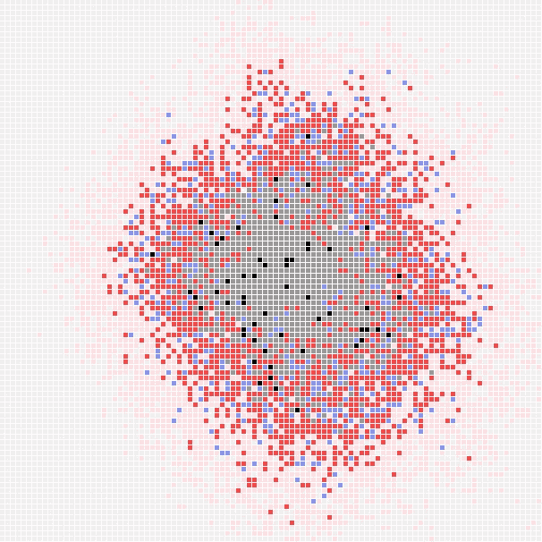
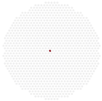
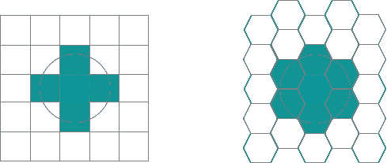
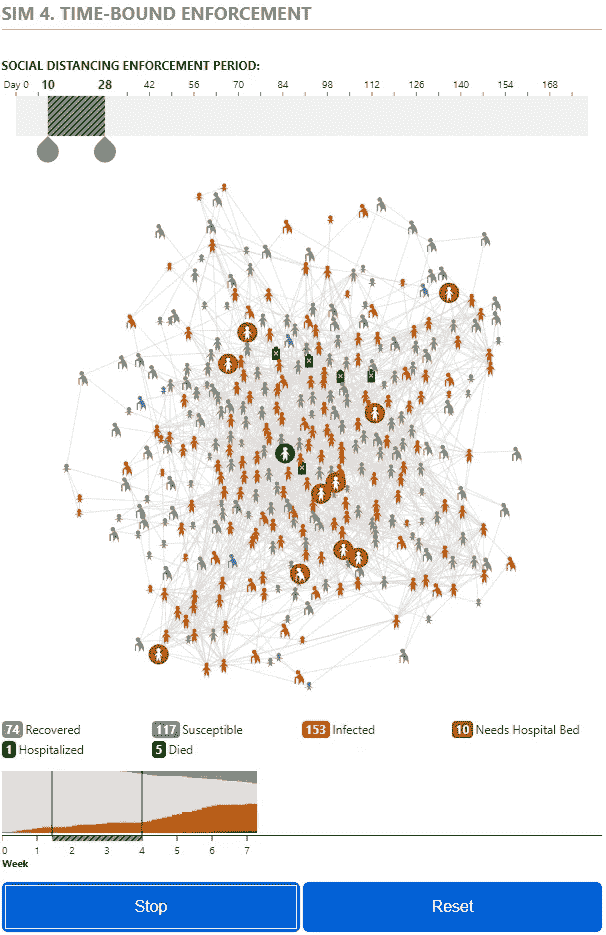
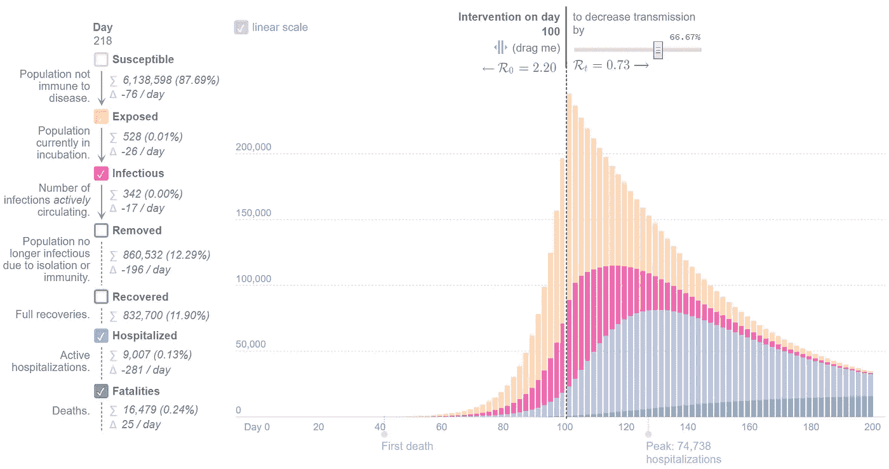
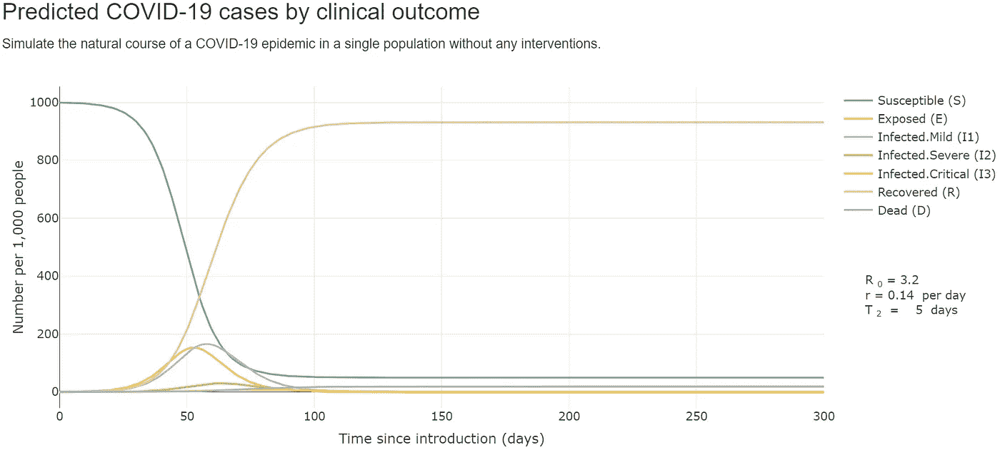

# COVID19:策划的 7 大在线互动模拟。

> 原文：<https://towardsdatascience.com/covid19-top-7-online-interactive-simulations-curated-fa4282889875?source=collection_archive---------21----------------------->

## TLDR:交互式模拟是直观了解复杂系统的好方法。没有比流行病学更复杂的了。这里是我发现的一些最好的新冠肺炎流行病学在线互动模拟。

认知状态:没有流行病学资格，也没有模拟。只是一个偶然的模拟爱好者。这使我不够资格和过于固执己见。请注意，这些模拟只是为了寓教于乐。对现实世界中的任何事情，比如决定金融战略、公共卫生政策，或者诸如此类的事情，都不是。真正的交易要比这复杂得多。

***编者注:*** [*走向数据科学*](http://towardsdatascience.com/) *是一份以研究数据科学和机器学习为主的中型刊物。我们不是健康专家或流行病学家，本文的观点不应被解释为专业建议。想了解更多关于疫情冠状病毒的信息，可以点击* [*这里*](https://www.who.int/emergencies/diseases/novel-coronavirus-2019/situation-reports) *。*

我在 Unsplash 上搜索“模拟”时发现了什么。[科学高清照片](https://unsplash.com/@scienceinhd?utm_source=unsplash&utm_medium=referral&utm_content=creditCopyText)在 [Unsplash](https://unsplash.com/s/photos/simulation?utm_source=unsplash&utm_medium=referral&utm_content=creditCopyText) 上

有很多方法可以对个体进行建模(台球 vs 像素)，甚至是是否首先对个体进行建模(PDE)。因此，这将按类别分组，没有特定的顺序(实际上，从我认为最直观的理解):

# 《华盛顿邮报》的#1 台球: [**这些模拟显示了如何使冠状病毒的增长曲线变平**](https://www.washingtonpost.com/graphics/2020/world/corona-simulator/)

[WaPo](https://www.washingtonpost.com/graphics/2020/world/corona-simulator/) 的台球模型截图。

华盛顿邮报使用了一个台球模型，其中每个人都是一个完全弹性的 2D 圆，以恒定的速度在一条直线上，生活在一个具有完全弹性的墙壁的矩形中。这是提出[球形牛](/the-messiness-of-real-world-data-tracking-r0-of-covid19-with-logistic-function-31cb4d6edd98)的一个非常好的时机:

球形奶牛。来源:http://www.cs.cmu.edu/~kmcrane/Projects/ModelRepository/

> 一个牛奶场的牛奶产量很低，所以农场主写信给当地大学，向学术界寻求帮助。组建了一个由理论物理学家领导的多学科教授小组，并进行了为期两周的密集现场调查。然后，学者们回到大学，笔记本上塞满了数据，写报告的任务就交给了团队领导。此后不久，这位物理学家回到农场，对农民说，“我有解决办法，但它只适用于真空中的球形奶牛”。【http://www.physics.csbsju.edu/stats/WAPP2_cow.html 

我不是在取笑阿婆。整个想法是，设计模拟是一门艺术。制作一个完美的世界模拟太难了。你需要在某个地方做一些假设和简化，不要把它做得太简单而失去我们想要模仿的行为。我认为 WaPo 做出了正确的决定。(如果需要更复杂的台球模拟，尽管不是交互式的，请查看最后荣誉奖部分的 3 blue 1 brown)[https://www . Washington post . com/graphics/2020/world/corona-simulator/](https://www.washingtonpost.com/graphics/2020/world/corona-simulator/)

 [## 这些模拟显示了如何使冠状病毒的增长曲线变平

### 警告健康:此图形需要 JavaScript。请启用 JavaScript 以获得最佳体验。请注意…

www.washingtonpost.com](https://www.washingtonpost.com/graphics/2020/world/corona-simulator/) 

# #2 台球由 Petr nio Silva:[**基于代理人的新冠肺炎健康和经济效果的模拟**](/agent-based-simulation-of-covid-19-health-and-economical-effects-6aa4ae0ff397)

另一个台球模型由[Petr nio Silva](https://towardsdatascience.com/@petroniosilva)在[基于代理人的新冠肺炎健康和经济效应的模拟](/agent-based-simulation-of-covid-19-health-and-economical-effects-6aa4ae0ff397)。

Petrô nio Silva 和他的团队制作了另一个台球模型，他们比较了 5 种不同的场景。这同时减少了互动也增加了互动。交互性较差，因为要与之交互，你需要了解 Python。然而，如果你这样做，它更具互动性，因为你可以疯狂地玩它。我也喜欢文章结尾的引用，以下是摘录:

> 所有的模型都是错的，但有些是有用的。(乔治·博克斯)

(对于更复杂的台球模拟，尽管不是交互式的，请查看最后荣誉奖部分的 3blue1brown)

以下是解释模拟“[基于代理人的新冠肺炎健康和经济影响模拟](/agent-based-simulation-of-covid-19-health-and-economical-effects-6aa4ae0ff397)”的文章:[https://towards data science . com/Agent-Based-Simulation-of-the-新冠肺炎-健康和经济影响-6aa4ae0ff397](/agent-based-simulation-of-covid-19-health-and-economical-effects-6aa4ae0ff397)

 [## 基于主体的新冠肺炎卫生经济效应模拟

### 我们生活在一个不寻常的时代，人类受到一种微生物的攻击，威胁着我们的…

towardsdatascience.com](/agent-based-simulation-of-covid-19-health-and-economical-effects-6aa4ae0ff397) 

而这里是代码:[https://colab . research . Google . com/drive/1 xyrq 9 dsq 9 kjuxu 8 MF 6 by-D2 gjvzjquk](https://colab.research.google.com/drive/1xXyRq9DSq9kjUxu8mf6By-d2GJvzjquk)

# 凯文·西姆勒在他的博客上写道: [**爆发**](https://meltingasphalt.com/interactive/outbreak/)

[爆发](https://meltingasphalt.com/interactive/outbreak/)中最终模型截图。

凯文·西姆勒在他的博客上[融化的沥青](https://meltingasphalt.com/) : [爆发](https://meltingasphalt.com/interactive/outbreak/)。他没有把人建模成台球，而是把它建模成网格中一个静止的正方形细胞。通过简单地成为邻居(共享边，而不是角落)来模拟具有传染潜力的互动。我会把这个叫做网格/点阵/细胞/像素/光栅/ [元胞自动机](https://en.wikipedia.org/wiki/Cellular_automaton) / [康威的生命游戏](https://en.wikipedia.org/wiki/Conway%27s_Game_of_Life) / [有限元法](https://en.wikipedia.org/wiki/Finite_element_method)。最有趣的是，即使在提出一个完全不同的模型和假设时，它也会得出与台球模型相似的结论。

有很多参数可以使用，但不要太多。而且整篇博文的作用就像一个教程，一个一个的给你介绍参数(读作:游戏力学)。下面是链接:[https://meltingasphalt.com/interactive/outbreak/](https://meltingasphalt.com/interactive/outbreak/)

 [## 爆发

### 可播放的疾病模拟

meltingasphalt.com](https://meltingasphalt.com/interactive/outbreak/) 

# 《华盛顿邮报》报道:[像新冠肺炎这样的流行病如何终结(以及如何更快终结)](https://www.washingtonpost.com/graphics/2020/health/coronavirus-how-epidemics-spread-and-end/)

六边形网格模拟，通过 [WaPo](https://www.washingtonpost.com/graphics/2020/health/coronavirus-how-epidemics-spread-and-end/) 比较不同的疾病。

与融化的沥青非常相似，互动少得多，但有一个关键的区别，六边形网格。虽然[更容易编码](https://www.redblobgames.com/grids/hexagons/)，但是使用正方形网格会导致许多问题，比如它如何像菱形(如果你使用 4 个邻居)或正方形(如果你使用 8 个邻居)那样扩散。简而言之，六角形通常更适合模拟，因为它是可以平铺空间的最圆的形状。你可以在这里[和](https://pro.arcgis.com/en/pro-app/tool-reference/spatial-statistics/h-whyhexagons.htm)[这里](http://www-cs-students.stanford.edu/~amitp/game-programming/grids/)阅读更多。

为什么十六进制比正方形好。[https://pro . ArcGIS . com/en/pro-app/tool-reference/spatial-statistics/h-whyhexagons . htm](https://pro.arcgis.com/en/pro-app/tool-reference/spatial-statistics/h-whyhexagons.htm)

以下是文章链接:[https://www . Washington post . com/graphics/2020/health/coronavirus-how-epiderations-spread-and-end/](https://www.washingtonpost.com/graphics/2020/health/coronavirus-how-epidemics-spread-and-end/)

 [## 像新冠肺炎这样的流行病如何终结(以及如何更快终结)

### 健康和警告:此图形需要 JavaScript。请启用 JavaScript 以获得最佳体验。作为…

www.washingtonpost.com](https://www.washingtonpost.com/graphics/2020/health/coronavirus-how-epidemics-spread-and-end/) 

# R2D3 的#5 网络:[通过模拟理解 COVID19】](http://www.r2d3.us/covid-19/)

来自 [r2d3](http://www.r2d3.us/covid-19/) 的第四次模拟截图。

[R2D3](http://www.r2d3.us/) 是一个优秀的网站。我知道它们，因为我[教](https://sites.google.com/view/arianprabowo) [机器学习](https://medium.com/datadriveninvestor/how-is-machine-learning-different-and-why-it-is-better-d5671b52dd65)并且它拥有可视化决策树和偏差-方差权衡的优秀资源。所以当我看到他们做新冠肺炎模拟，我必须去看看，我没有失望。

这是一个更有趣的模拟，因为网络是流行病学家会使用的实际结构，而不是台球或网格。“网络”的官方术语叫做[图](https://en.wikipedia.org/wiki/Graph_theory)。但这不是指[图表，外行人也称之为 graph](https://en.wikipedia.org/wiki/Chart)。(如果我没看错的话，著名游戏[瘟疫公司](https://www.ndemiccreations.com/en/22-plague-inc)也使用 graph 作为底层模型)。这里是文章的链接:[http://www.r2d3.us/covid-19/](http://www.r2d3.us/covid-19/)

 [## 通过模拟了解新冠肺炎

### 2020 年 3 月 31 日关于 COVID19 的消息铺天盖地。病例激增，防止进一步传播的措施…

www.r2d3.us](http://www.r2d3.us/covid-19/) 

# Gabriel Goh 的#6 微分方程:[流行病计算器](http://gabgoh.github.io/COVID/index.html)

Gabriel Goh 的 SEIR 互动模拟截图。

到目前为止，所有的模拟都可以归入[基于代理的模型](https://en.wikipedia.org/wiki/Agent-based_model)，在这里我们在个体水平上模拟疾病。但这不是唯一的做事方式。我们可以在亚种群水平上实现。这就是[先生(易感、传染、康复)模型](https://en.wikipedia.org/wiki/Compartmental_models_in_epidemiology#The_SIR_model)正在努力做的事情。在 SIR 中，使用[微分方程](https://en.wikipedia.org/wiki/Differential_equation)对亚群体之间的传播进行建模。(要了解更多关于 SIR model 的信息，请查看最后荣誉奖部分的 Numberphile 链接。)

请注意，SIR 是一个合法的成熟的学术水平模型。这里实现的是 SIR 的一个变种，叫做 SEIR(易感、暴露、感染、删除)。下面是链接:[http://gabgoh.github.io/COVID/index.html](http://gabgoh.github.io/COVID/index.html)

 [## 流行病计算器

### 编辑描述

gabgoh.github.io](http://gabgoh.github.io/COVID/index.html) 

# 艾莉森·希尔的 7 号微分方程:[模拟新冠肺炎传播与医疗保健能力](https://alhill.shinyapps.io/COVID19seir/?fbclid=IwAR2aXJT79M2AmZxMdy8jsiEuSC4i7ijU8Av6oB4dmlZIeJ2VQgL7Tt3QGxA)

SEIR 模型截图[艾莉森·希尔](https://alhill.shinyapps.io/COVID19seir/?fbclid=IwAR2aXJT79M2AmZxMdy8jsiEuSC4i7ijU8Av6oB4dmlZIeJ2VQgL7Tt3QGxA)。

另一种实现 SEIR 模式为上述第二种意见。(要了解更多关于 SIR model 的信息，请查看最后荣誉奖部分的 Numberphile 链接。)下面是链接:[https://alhill.shinyapps.io/COVID19seir/?FB clid = iwar 2 axjt 79 m2 amz xmdy 8 jsieusc 4 I 7 iju 8 av 6 ob 4 dmlziej 2v qgl 7 TT 3 qgxa](https://alhill.shinyapps.io/COVID19seir/?fbclid=IwAR2aXJT79M2AmZxMdy8jsiEuSC4i7ijU8Av6oB4dmlZIeJ2VQgL7Tt3QGxA)

 [## 模拟新冠肺炎传播与医疗保健能力

### 我们使用一个基于经典 SEIR 模型的分室流行病学模型来描述疾病的传播和临床传播

alhill.shinyapps.io](https://alhill.shinyapps.io/COVID19seir/?fbclid=IwAR2aXJT79M2AmZxMdy8jsiEuSC4i7ijU8Av6oB4dmlZIeJ2VQgL7Tt3QGxA) 

# #奖金

因为我在写这个之前没有做详尽的研究。

又一个 SIR 模型感谢 reddit 的[/u/好奇-b 通知我:【https://covid19-scenarios.org/】T2](https://www.reddit.com/r/slatestarcodex/comments/g0hx4f/covid19_top_7_online_interactive_simulations/fn9quql/?context=3)

 [## 新冠肺炎情景

### 该工具使用数学模型，根据用户定义的参数模拟各种新冠肺炎结果

covid19-scenarios.org](https://covid19-scenarios.org/) 

# 荣誉奖

这些相关的东西不是交互式的在线模型:

## 更复杂的台球由 3blue1brown: [模拟一场流行病](https://www.3blue1brown.com/videos-blog/simulating-an-epidemic)

正如预期的那样， [3b1b](https://www.3blue1brown.com/) 做出了惊人的模拟，新增了将人口划分为孤立的地理区域、城市中心、使用排斥力模拟社会距离等功能。不幸的是，它不是交互式的。反正下面是链接:[https://www . 3 blue 1 brown . com/videos-blog/simulating-an-epidemia](https://www.3blue1brown.com/videos-blog/simulating-an-epidemic)

## 图由 Ndemic 创作:[瘟疫公司](https://www.ndemiccreations.com/en/22-plague-inc)

这是我的胡乱猜测。但是我认为著名的游戏瘟疫公司使用基于图形的建模，就像上面提到的 R2D3。[https://www.ndemiccreations.com/en/22-plague-inc](https://www.ndemiccreations.com/en/22-plague-inc)

 [## 瘟疫公司- Ndemic 创作公司

### 瘟疫公司是一个高战略和可怕的现实模拟的独特组合。你能感染世界吗？你的…

www.ndemiccreations.com](https://www.ndemiccreations.com/en/22-plague-inc) 

## 数字爱好者理解 SIR 模型:[冠状病毒曲线](https://www.youtube.com/watch?v=k6nLfCbAzgo)

其中两个模拟使用了基于 SIR 模型的 SIER 模型，并假设观众对它很熟悉。如果你不是数字迷，有很棒的视频解释这个模型能捕捉什么，不能捕捉什么。

## FiveThirtyEight 对 SIER 模型的警告:[为什么做一个好的新冠肺炎模型如此之难](https://fivethirtyeight.com/features/why-its-so-freaking-hard-to-make-a-good-covid-19-model/)

后两种模式在另一方面有所不同。他们试图使用真实世界的数字。这有很多问题。这篇文章很好地总结了为什么很难很好地估计插入到这些模型中的实际数字，并且很好地概述了模型可以变得多复杂。以下是链接[https://fivethirtyeight . com/features/why-it ' s so-freaking-hard-a-good-model/](https://fivethirtyeight.com/features/why-its-so-freaking-hard-to-make-a-good-covid-19-model/)

 [## 为什么做一个好的新冠肺炎模型如此困难

### 我们在这里，在疫情的中间，像观赏鱼一样盯着我们起居室的窗户。关于…的问题

fivethirtyeight.com](https://fivethirtyeight.com/features/why-its-so-freaking-hard-to-make-a-good-covid-19-model/) 

## 超越模型作者托马斯·普约:[锤子与舞蹈](https://medium.com/@tomaspueyo/coronavirus-the-hammer-and-the-dance-be9337092b56)

既然你已经内化了流行病的动态，当其他人谈论处理这种情况的策略时，你可以有更好的欣赏。这种策略的一个很好的例子就是这篇文章:[https://medium . com/@ tomaspueyo/coronavirus-the-hammer-and-the-dance-be 9337092 b 56](https://medium.com/@tomaspueyo/coronavirus-the-hammer-and-the-dance-be9337092b56)

 [## 冠状病毒:锤子和舞蹈

### 如果领导人给我们争取时间，未来 18 个月会是什么样子

medium.com](https://medium.com/@tomaspueyo/coronavirus-the-hammer-and-the-dance-be9337092b56) 

## 超越模型由我们的世界在数据:[统计和研究](https://ourworldindata.org/coronavirus)

同样，随着更深入、更直观的理解，数据现在应该更有意义。这里有一个很好的详细的数据分析:[https://ourworldindata.org/coronavirus](https://ourworldindata.org/coronavirus)

 [## 冠状病毒疾病(新冠肺炎)-统计和研究

### 注意:为了让你自己了解和理解对公众的风险，我们建议依靠你的政府机构负责…

ourworldindata.org](https://ourworldindata.org/coronavirus) 

## 无耻的自我推销

我也试着给新冠肺炎做模特。我以前的相关帖子:

*   [COVID19:跟踪生长因子、每日新病例以及在哪里找到它们。(世界，澳大利亚，维多利亚)](/covid19-keeping-track-of-r0-and-where-to-find-them-world-australia-victoria-ab822e3da7e0)
*   [现实世界数据的杂乱:用 logistic 函数追踪 COVID19 的生长因子。](/the-messiness-of-real-world-data-tracking-r0-of-covid19-with-logistic-function-31cb4d6edd98)
*   [现实世界数据的混乱 2:比较国家间的增长因子。](https://medium.com/dataseries/the-messiness-of-real-world-data-2-comparing-growth-factor-between-countries-1867f14d2ce4)

# 参考文献和致谢

标题中提到了所有图片的来源。

每个来源的链接可在各自的标题上找到。

感谢 [Phillip Luong](https://www.linkedin.com/in/phillip-luong-53531610b) 向我介绍 SIR model 和上面的一些链接。