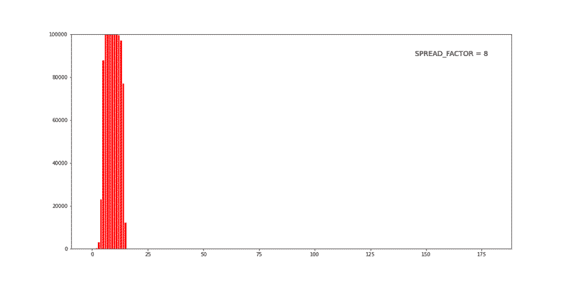
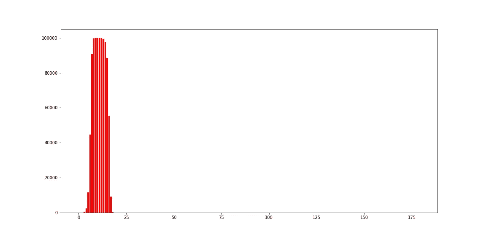
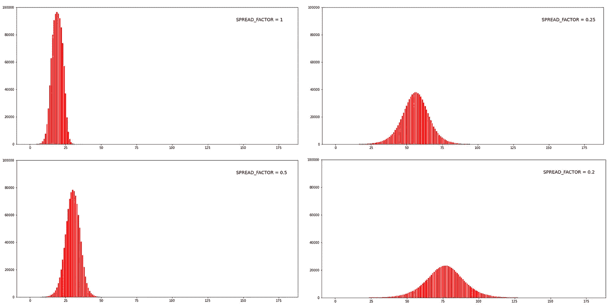

# COVID19:用 Python 可视化社交距离的影响

> 原文：<https://towardsdatascience.com/covid19-visualising-the-impact-of-social-distancing-in-python-8567c14a3a73?source=collection_archive---------23----------------------->

## [变更数据](https://towardsdatascience.com/tagged/data-for-change)

## 使用 pandas 和 python 中的 matplotlib 可视化，一个人可以对平坦化曲线产生指数级影响。

拉平曲线

新冠肺炎接管了世界，并在短短几个月内让整个世界陷入停滞。世界上的总病例将很快达到 50 万，超过 20，000 例死亡已被确认。令人担忧的是，T2 的病例总数图仍在呈指数增长，而且没有放缓的迹象。

通过社交距离拉平曲线似乎是唯一的出路。在过去的几周里，许多国家都被封锁，人们被要求严格呆在家里。所有这些措施不会消灭病毒，但将有助于减缓它的传播，从而减轻卫生保健系统的压力，从而降低死亡率。

但是许多人似乎仍然不理解社交距离的严重性，以及即使是一个人也能产生多大的影响。关键是，如果你是一个健康的个体，病毒可能不会对你产生太大影响，但你可能会将它传播给其他可能受到它不利影响的人。

因此，在这篇简短的帖子中，我将尝试使用 python 来可视化社交距离的效果，以了解每个人在阻止新冠肺炎病毒传播方面可能产生的巨大影响，并有可能挽救成千上万人的生命。

# 实验

这项实验的目的不是模拟病毒的传播，而是理解社会距离在减少病毒传播方面的影响，并认识到它的重要性。

首先让我们导入要点并定义几个参数。

让我解释一下每个参数:

*   天数:这只是我们进行模拟的天数
*   人口:我们模拟城市的人口。
*   SPREAD_FACTOR:是感染者接触的人数。在一个城市里，据说一个普通人一天至少要接触 16 个人。假设只有四分之一的人会被感染，我选择传播因子为 4。需要注意的是，扩散系数取决于许多变量，在现实生活中不会保持不变。
*   恢复天数:感染者恢复所需的天数。在现实生活中，这也不是一个常数，但 10 是一个很好的平均值。
*   最初受影响的人数:最初受病毒影响的人数。他们是携带者，把病毒从一个受感染的地区带到一个新的地区，就像我们假设的*城市*。

我们将使用一个数据框架来模拟一个城市，其中每行对应一个公民，并跟踪感染和康复的人。使用 sample 函数可以从数据框中随机选择人。我们将这样做:

*   创建一个名为 city 的数据框架，其中每一行对应于城市中的一个人。它还包含标记一个人何时被感染和康复的栏。最初随机选择最初受感染的人，使用样本并将他们标记为受感染。也纪念他们的康复日。
*   运行 for 循环天数来模拟过去的每一天。
*   查看这一天康复的人数，标记为康复。这些人不会再传播病毒了。
*   每天统计感染人数，使用 SPREAD_FACTOR 计算当天新感染的人数。所以一天的新增病例数= SPREAD_FACTOR *活跃病例数。
*   记录活动案例的数量和康复的人数，以便日后可视化。

输出

你可以看到，在大约 10 到 15 天内，整个 10 万人口都受到了影响并得到了恢复。这是假设这座城市能够同时治疗 10 万名患者，并且每个人都以相同的速度康复——10 天。但是你认为这个假设的 10 万人口的城市会有一个每天可以处理 10 万个活跃病例大约一周的医疗保健系统吗？现在在现实中，增长可能不会如此剧烈，但如果我们不采取任何行动，它很容易导致这样的事情。

现在让我们看一下 SPREAD_FACTOR 的不同值的图表。

观察结果:

*   SPREAD_FACTOR = 1(左上):这意味着每个被感染的人都与一个随机的人接触过，这个人如果没有被感染，也已经被感染了。几乎所有的人口都受到了影响。
*   SPREAD_FACTOR = 0.5(左下角):每两个感染者中，每天就有一个新感染者。请注意，这个新人的选择是随机进行的，只有在这个人没有被感染的情况下才会被感染。这里的曲线仍然与第一个案例几乎相同，但总病例数下降了约 20，000 例。
*   SPREAD_FACTOR = 0.25(右上):每 4 个感染者，就有一个人被感染(如果还没有被感染)。或者换句话说，这 4 名感染者中有 1 人接触了新感染的人(其他 3 人在练习社交距离！).这可能是一种所有人都有意识地隔离自己、练习社交距离的状态。从之前的案例来看，仅仅通过将价差系数减半，价差就已经呈指数级下降，曲线也明显变平。这里的保健系统应该能够提供良好的护理，因为在高峰期，只有 40，000 个活跃的病例。
*   SPREAD_FACTOR = 0.2(右下方):在这里，每 5 名感染者中就有一人与新的人接触并传播了感染。另外 4 人被隔离。与上一个案例没有太大的不同，但是曲线明显变平了，活动案例的峰值几乎下降了一半！

> 在最后两种情况下，你可以观察到一个人对整个病毒传播的影响！由此我们可以得出结论，尽管病毒呈指数传播，但社交距离也呈指数传播，每个孤立的人都会对曲线的平坦化产生指数影响！

注意:我知道这是对真实世界场景的过度简化，但我认为它让我们很好地理解了 SPREAD_FACTOR 和活动案例数之间的关系。此外，指数函数可以很容易地用数学方程模拟，但我认为这更直观，更容易理解。

好吧，现在你知道为什么社交距离如此重要了吧！基本上，你坐在家里就是在拯救生命。

你可以在这个谷歌实验室 找到 [**的代码。您可以尝试不同的参数值。另外，尝试可视化其他指标，如每日恢复率。您可以尝试在不同的时间间隔减少扩散因子，并观察其效果，而不是在整个模拟过程中保持扩散因子的恒定值。我注意到一旦伤害已经造成，就没有回头路了。**](https://colab.research.google.com/drive/1WGgVAFRnW0qvP_KpehYJs892MlWXwV86)

所以练习社交距离，洗洗手，记住，我们都在一起！

参考资料:

 [## 冠状病毒病例:

### 实时统计和冠状病毒新闻，跟踪确诊病例、康复患者和死亡人数，按…

www.worldometers.info](https://www.worldometers.info/coronavirus/)  [## 冠状病毒:为什么你必须现在行动

### 政治家和商业领袖:你应该做什么，什么时候做？

medium.com](https://medium.com/@tomaspueyo/coronavirus-act-today-or-people-will-die-f4d3d9cd99ca)  [## 这些模拟显示了如何使冠状病毒的增长曲线变平

### 警告健康:此图形需要 JavaScript。请启用 JavaScript 以获得最佳体验。请注意…

www.washingtonpost.com](https://www.washingtonpost.com/graphics/2020/world/corona-simulator/) 

***联系我！***

adarsh1021@gmail.com

推特:[https://twitter.com/adarsh_menon_](https://twitter.com/adarsh_menon_)

另外，如果你对机器学习感兴趣，可以看看我的 [YouTube 频道](http://www.youtube.com/adarshmenon)！

***编者按:*** [*走向数据科学*](http://towardsdatascience.com/) *是一份以数据科学和机器学习研究为主的中型刊物。我们不是健康专家或流行病学家，本文的观点不应被解释为专业建议。想了解更多关于疫情冠状病毒的信息，可以点击* [*这里*](https://www.who.int/emergencies/diseases/novel-coronavirus-2019/situation-reports) *。*